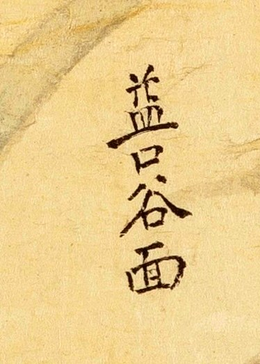

# 1872년 「충청도 공주목지도」 판독

《1872년 지방지도》 「충청도 공주목지도」(서울대학교 규장각한국학연구원 소장).
**공주목은 대전에 산내면·유등천면·탄동면·구즉면·명탄면으로 걸칩니다** — 지금 중구,
동구 남부, 유성구 북부, 서구 일부입니다.

기록 방식은 [`판독-기록-형식.md`](판독-기록-형식.md) 를 따릅니다. 고개 쟁점은
[`대전-고개-대조표.md`](대전-고개-대조표.md) 12.3 에 있습니다.

## 도엽

| | |
|---|---|
| 자료번호 | `KYKH002_0000_0026` |
| 원문 | [커먼즈 파일](https://commons.wikimedia.org/wiki/File:KYKH002_0000_0026_%EC%B6%A9%EC%B2%AD%EB%8F%84_%EA%B3%B5%EC%A3%BC%EB%AA%A9%EC%A7%80%EB%8F%84.jpg) |
| 크기 | 13,856 × 8,703 px (120 MP) |
| 짜임 | **왼쪽 3분의 1이 기문, 오른쪽 3분의 2가 그림** |

**이 도엽은 읽기 어렵습니다.** 진잠 도엽은 방(榜)에 진한 먹으로 적어 원본 타일 한 장에
여러 지명이 또렷한데, 공주목은 **방 없이 흐린 회색 먹으로 작게** 적혀 있습니다. 색을 살려
대비를 올려야 겨우 읽힙니다(PIL `ImageEnhance.Color` 2.4 + `Contrast` 1.5). 면적도
진잠의 세 배입니다.

## 방위 — 위가 남(南), 180° 돌아 있습니다

**위=南, 아래=北, 왼쪽=東, 오른쪽=西.**

| 근거 | 내용 |
|---|---|
| 방위 대자 | 왼쪽 변에 큰 `東` (0.35, 0.45), 아래 변에 큰 `北` |
| 경계 표기 | 아래 변 `北` 곁에 `天安界` — 천안은 공주 **북**쪽 |
| 기문과 그림의 대조 | 기문 `鷄龍山 在邑東南間四十里許` 인데 그림에서 계룡산은 읍치보다 **왼쪽·위** = 동쪽·남쪽 ✓ |
| 면 배치 | 대전에 걸리는 탄동·구즉·명탄면이 모두 **왼쪽 가장자리**(동) |

**한 도엽 안에서도 구역마다 글자가 상하 반전됩니다.** 계룡산 서쪽(대략 x 0.58–0.69,
y 0.08–0.18)이 그렇습니다 — 돌려 보지 않으면 글자가 있는지조차 모릅니다.

## 기문 「산천」 — 고개가 하나도 없습니다

| 표기 | 주기 |
|---|---|
| 鷄龍山 | `在邑東南間四十里許 連山界` |
| 泰華山 | `在邑…許` |
| 蒼壁 | `在錦江上 二十里許` |
| 熊津祭壇 | `在邑十里 春秋…` |

**공주목처럼 큰 고을의 도엽이 산천 조에 고개를 하나도 적지 않았습니다.** 해동지도 공주목
에서는 `栗峙` 를 읽었으니, **1872년 도엽은 고개를 기문이 아니라 그림에만 남긴** 것으로
보입니다. 근거: [`crops/KYKH002_0000_0026_x0.209_y0.057_w0.112_h0.2.jpg`](crops/KYKH002_0000_0026_x0.209_y0.057_w0.112_h0.2.jpg)

## 기문 「사창」 — 대전 쪽 리 이름

| 창고 | 주기 | 대전과의 관계 |
|---|---|---|
| 乃興倉 | `在邑東七十里許 山內面 高水亭里` | **산내면** — 현 동구 일원 |
| 永裕倉 | `在邑東四十里許 鳴灘面 石三洞里` (`糶米二百四十三石`) | **명탄면** — 대덕·세종 접경 |
| 太平倉 | `在邑…` | — |
| 昌陽倉 | `在邑…` | — |

**리 이름을 거리와 함께 주는 첫 자료입니다.** 해동지도 공주목의 `山內面 初境八十里
終境一百里` 와 견주면, 내흥창(70리)은 산내면 **초입** 쪽입니다.

## 그림 — 동쪽(왼쪽) 가장자리

| 위치 | 표기 | 읽기 | 확신 | 판독자 | 날짜 |
|---|---|---|---|---|---|
| (0.35, 0.45) | 東 | 방위 대자 | 상 | Claude | 2026-09-03 |
| (0.35, 0.47) | **懷德界** | 회덕계 | 상 | 연구회 | 2026-09-03 |
| (0.36, 0.43) | 炭洞面 | 탄동면 | 상 | Claude | 2026-09-03 |
| (0.36, 0.50) | 九則面 | 구즉면 | 상 | Claude | 2026-09-03 |
| (0.38, 0.59) | 鳴灘面 | 명탄면 | 상 | Claude | 2026-09-03 |
| (0.38, 0.19) | **山內面** | 산내면 | 상 | 연구회 | 2026-09-03 |
| (0.40, 0.17) | …距邑七十里… | — | 중 | Claude | 2026-09-03 |
| (0.64, 0.22) | □谷面 | **미판독** — 첫 글자는 `先` 비슷한 꼴 아래 `口` | 하 | 연구회 | 2026-09-03 |

크롭: [`crops/KYKH002_0000_0026_x0.32_y0.396_w0.058_h0.126.jpg`](crops/KYKH002_0000_0026_x0.32_y0.396_w0.058_h0.126.jpg) ·
[`crops/KYKH002_0000_0026_x0.359_y0.141_w0.065_h0.057.jpg`](crops/KYKH002_0000_0026_x0.359_y0.141_w0.065_h0.057.jpg) ·
□谷面 

**`懷德界` 가 `炭洞面` 과 `九則面` 사이에 놓입니다.** 공주목 동쪽 경계 가운데 회덕과
마주하는 구간이 그 사이라는 뜻이고, **공주–회덕 통행이 주로 그 사이로 났다**는 해석이
따라옵니다(판독자). 현 지명으로는 유성구 **탄동(신성·전민 방면)과 구즉(금강 남안) 사이**입니다.

**유성을 지나 유등천면(현 중구 유천동 일원)으로 가는 길은 고을 경계를 넘지 않습니다** —
유등천면이 공주목 소속이므로 **공주목 내부 교통로**였습니다. 경계 고개만 쫓으면 이 축이
통째로 빠집니다.

**다만 이 도엽은 붉은 도로선을 그리지 않습니다** — 산줄기와 물길만 그립니다. 위 해석은
**그려진 길이 아니라 경계 표기가 놓인 자리**에서 나온 것입니다.

## 그림 — 계룡산 일대와 읍치

| 위치 | 표기 | 확신 |
|---|---|---|
| (0.49, 0.20) | 鷄龍山 距邑四十里 | 상 |
| (0.60, 0.19) | 古王庵 距邑五十里 | 상 |
| (0.63, 0.10) | 連山界 | 상 |
| (0.63, 0.34) | 東部面 向孝浦里 濟南倉 距邑十里 | 중 |
| (0.73, 0.55) | 鄕校 | 상 |
| (0.71, 0.62) | 紅門 | 상 |
| (0.71, 0.66) | 山城 (공산성) | 상 |
| (0.68, 0.68) · (0.73, 0.70) | 東門 · 南門 | 상 |
| (0.77, 0.66) | 雙樹亭 | 상 |
| (0.75, 0.69) | 碑閣 | 상 |

이 범위에서 **`峴`·`峙` 표기는 하나도 나오지 않았습니다.**

## 좌표 없는 초기 기록 (2026-09-02)

도엽을 조각으로만 보던 때 `柏峴`〔?〕·`巢嵓峴`〔?〕 둘을 보았다고 적었으나, **조각의 자른
자리를 기록하지 않아 도엽 좌표를 찍지 못했습니다.** 2026-09-03 에 세 구역을 훑었지만
어느 쪽도 재확인되지 않았습니다.

- `巢嵓峴`〔?〕 이 `距邑十里` 와 함께 있다고 했는데, 그 자리(0.63, 0.34)에 있는 것은
  **`東部面 向孝浦里 濟南倉 距邑十里`** — 창(倉) 주기입니다.
- `柏峴閣`〔?〕 으로도 읽힐 수 있다던 `閣` 은 읍치의 **`碑閣`**(0.75, 0.69)일 수 있습니다.

**오독으로 보이지만 지우지 않습니다.** 아직 훑지 않은 범위가 넓으니 "없다"고 단정도
하지 않습니다.

## 남은 것

- **왼쪽 위(동남) = 산내면 일원** (대략 x 0.33–0.45, y 0.10–0.28) — 대조표 6.4 가 필요로 하는 자리
- 오른쪽 절반(서부) 전체
- `□谷面` 첫 글자
- 사지를 **거리까지 갖춘 형태**로 — 이 도엽은 사지를 한 곳에 모으지 않고 가장자리에 흩어 적습니다
- 기문 나머지(場市·古蹟·程途 조)

## 변경 이력

| 날짜 | 내용 |
|---|---|
| 2026-09-03 | 문서 개설. 방위 확정(위=남), 기문 산천·사창 조, 동쪽 가장자리·계룡산·읍치 채록을 옮김 |
