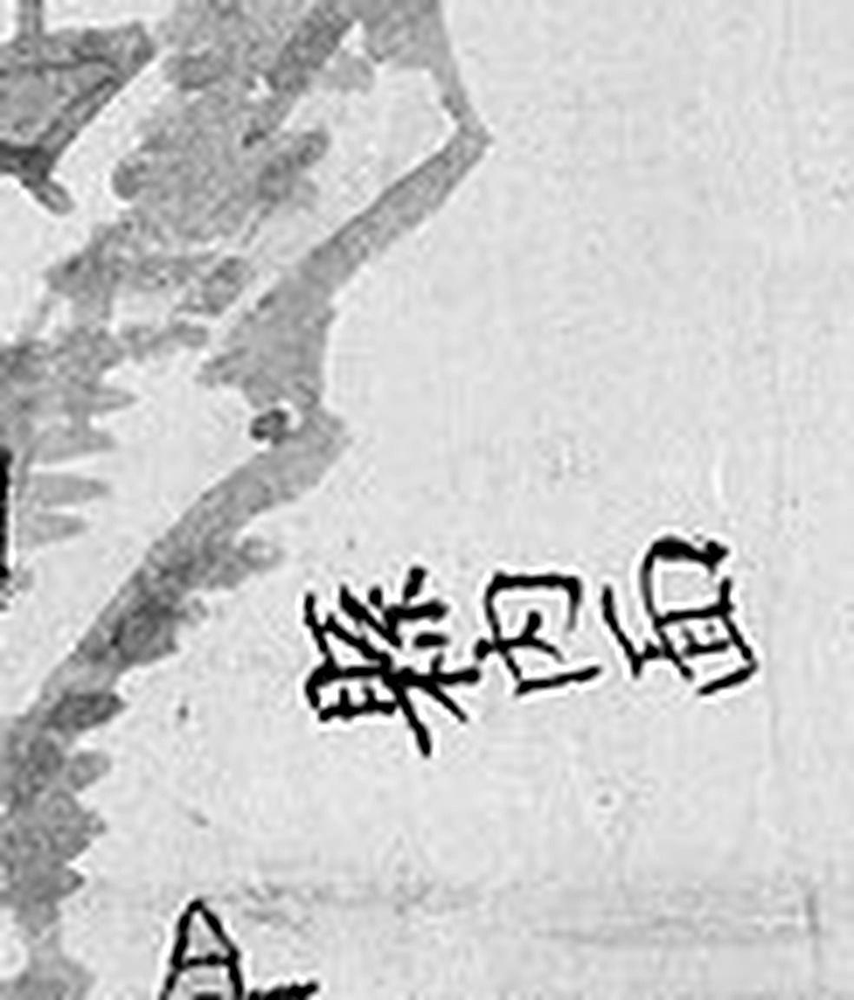

# 1872년 「충청도 공주목지도」 판독

《1872년 지방지도》 「충청도 공주목지도」(서울대학교 규장각한국학연구원 소장).
**공주목은 대전에 산내면·유등천면·탄동면·구즉면·명탄면으로 걸칩니다** — 지금 중구,
동구 남부, 유성구 북부, 서구 일부입니다.

기록 방식은 [`판독-기록-형식.md`](판독-기록-형식.md) 를 따릅니다. 고개 쟁점은
[`대전-고개-대조표.md`](대전-고개-대조표.md) 12.3 에 있습니다.

## 도엽

| | |
|---|---|
| 자료번호 | `KYKH002_0000_0026` |
| 원문 | [커먼즈 파일](https://commons.wikimedia.org/wiki/File:KYKH002_0000_0026_%EC%B6%A9%EC%B2%AD%EB%8F%84_%EA%B3%B5%EC%A3%BC%EB%AA%A9%EC%A7%80%EB%8F%84.jpg) |
| 크기 | 13,856 × 8,703 px (120 MP) |
| 짜임 | **왼쪽 3분의 1이 기문, 오른쪽 3분의 2가 그림** |

**이 도엽은 읽기 어렵습니다.** 진잠 도엽은 방(榜)에 진한 먹으로 적어 원본 타일 한 장에
여러 지명이 또렷한데, 공주목은 **방 없이 흐린 회색 먹으로 작게** 적혀 있습니다. 색을 살려
대비를 올려야 겨우 읽힙니다(PIL `ImageEnhance.Color` 2.4 + `Contrast` 1.5). 면적도
진잠의 세 배입니다.

## 방위 — 위가 남(南), 180° 돌아 있습니다

**위=南, 아래=北, 왼쪽=東, 오른쪽=西.**

| 근거 | 내용 |
|---|---|
| 방위 대자 | 왼쪽 변에 큰 `東` (0.35, 0.45), 아래 변에 큰 `北` |
| 경계 표기 | 아래 변 `北` 곁에 `天安界` — 천안은 공주 **북**쪽 |
| 기문과 그림의 대조 | 기문 `鷄龍山 在邑東南間四十里許` 인데 그림에서 계룡산은 읍치보다 **왼쪽·위** = 동쪽·남쪽 ✓ |
| 면 배치 | 대전에 걸리는 탄동·구즉·명탄면이 모두 **왼쪽 가장자리**(동) |

**한 도엽 안에서도 구역마다 글자가 상하 반전됩니다.** 계룡산 서쪽(대략 x 0.58–0.69,
y 0.08–0.18)이 그렇습니다 — 돌려 보지 않으면 글자가 있는지조차 모릅니다.

## 기문 「산천」 — 고개가 하나도 없습니다

| 표기 | 주기 |
|---|---|
| 鷄龍山 | `在邑東南間四十里許 連山界` |
| 泰華山 | `在邑…許` |
| 蒼壁 | `在錦江上 二十里許` |
| 熊津祭壇 | `在邑十里 春秋…` |

**공주목처럼 큰 고을의 도엽이 산천 조에 고개를 하나도 적지 않았습니다.** 해동지도 공주목
에서는 `栗峙` 를 읽었으니, **1872년 도엽은 고개를 기문이 아니라 그림에만 남긴** 것으로
보입니다. 근거: [`crops/KYKH002_0000_0026_x0.209_y0.057_w0.112_h0.2.jpg`](crops/KYKH002_0000_0026_x0.209_y0.057_w0.112_h0.2.jpg)

## 기문 「사창」 — 대전 쪽 리 이름

| 창고 | 주기 | 대전과의 관계 |
|---|---|---|
| 乃興倉 | `在邑東七十里許 山內面 高水亭里` | **산내면** — 현 동구 일원 |
| 永裕倉 | `在邑東四十里許 鳴灘面 石三洞里` (`糶米二百四十三石`) | **명탄면** — 대덕·세종 접경 |
| 太平倉 | `在邑…` | — |
| 昌陽倉 | `在邑…` | — |

**리 이름을 거리와 함께 주는 첫 자료입니다.** 해동지도 공주목의 `山內面 初境八十里
終境一百里` 와 견주면, 내흥창(70리)은 산내면 **초입** 쪽입니다.

## 그림 — 동쪽(왼쪽) 가장자리

| 위치 | 표기 | 읽기 | 확신 | 판독자 | 날짜 |
|---|---|---|---|---|---|
| (0.35, 0.45) | 東 | 방위 대자 | 상 | Claude | 2026-09-03 |
| (0.35, 0.47) | **懷德界** | 회덕계 | 상 | 연구회 | 2026-09-03 |
| (0.36, 0.43) | 炭洞面 | 탄동면 | 상 | Claude | 2026-09-03 |
| (0.36, 0.50) | 九則面 | 구즉면 | 상 | Claude | 2026-09-03 |
| (0.38, 0.59) | 鳴灘面 | 명탄면 | 상 | Claude | 2026-09-03 |
| (0.38, 0.19) | **山內面** | 산내면 | 상 | 연구회 | 2026-09-03 |
| (0.40, 0.17) | **山內面 高水亭里 乃興倉 距邑七十里** | 내흥창 주기 — **고개가 아니다** | 상 | Claude | 2026-09-30 |
| (0.37, 0.30) | **柳等川面** | 유등천면 | 상 | Claude | 2026-09-30 |
| (0.41, 0.10) | **鎭岑界** | 진잠계 | 상 | Claude | 2026-09-30 |
| (0.42, 0.28) | □內面 | **미판독** — 둘째·셋째는 `內`·`面`, 첫 글자를 못 읽었다 | 하 | Claude | 2026-09-30 · **2026-10-01 크롭 보탬** |

*`□內面`(상하 반전이라 180° 돌렸습니다). 첫 글자는 `艹` 머리에 긴 파임이 보이나
갈리지 않습니다 — 2026-10-01 에 8배로 다시 보았습니다.*
| (0.35, 0.27) | 柳等川面 太平倉 距邑五十里〔?〕 | 태평창 주기 | 중 | Claude | 2026-09-30 |
| (0.64, 0.22) | □谷面 | **미판독** — 첫 글자는 `先` 비슷한 꼴 아래 `口` | 하 | 연구회 | 2026-09-03 |

크롭: [`crops/KYKH002_0000_0026_x0.32_y0.396_w0.058_h0.126.jpg`](crops/KYKH002_0000_0026_x0.32_y0.396_w0.058_h0.126.jpg) ·
[`crops/KYKH002_0000_0026_x0.359_y0.141_w0.065_h0.057.jpg`](crops/KYKH002_0000_0026_x0.359_y0.141_w0.065_h0.057.jpg) ·
□谷面 

| 표기 | 조각 |
|---|---|
| 내흥창 주기 |  |
| 柳等川面 |  |
| 鎭岑界 |  |
| □內面 — **읽어 주실 분을 찾습니다** |  |

**`懷德界` 가 `炭洞面` 과 `九則面` 사이에 놓입니다.** 공주목 동쪽 경계 가운데 회덕과
마주하는 구간이 그 사이라는 뜻이고, **공주–회덕 통행이 주로 그 사이로 났다**는 해석이
따라옵니다(판독자). 현 지명으로는 유성구 **탄동(신성·전민 방면)과 구즉(금강 남안) 사이**입니다.

**유성을 지나 유등천면(현 중구 유천동 일원)으로 가는 길은 고을 경계를 넘지 않습니다** —
유등천면이 공주목 소속이므로 **공주목 내부 교통로**였습니다. 경계 고개만 쫓으면 이 축이
통째로 빠집니다.

**다만 이 도엽은 붉은 도로선을 그리지 않습니다** — 산줄기와 물길만 그립니다. 위 해석은
**그려진 길이 아니라 경계 표기가 놓인 자리**에서 나온 것입니다.

## 산내면 일대 — 훑었고, **고개 표기가 하나도 없습니다** (2026-09-30)

대조표 6.4 가 닭재(雞峙=鷄峴)의 소속을 가리기 위해 필요로 하던 자리입니다. 동쪽(왼쪽)
가장자리의 **x 0.33–0.52, y 0.07–0.35** 를 네 조각으로 나눠 전면으로 훑었습니다.

**결과: `峙`·`峴` 이 한 자도 없습니다.** 이 범위에 적힌 것은 면 이름 셋(`山內面`
`柳等川面` `□內面`), 경계 표기 하나(`鎭岑界`), 창고 주기 둘(내흥창·태평창),
그리고 제단·산줄기·물길뿐입니다.

*산내면 일대 전경(x 0.33–0.43, y 0.07–0.21, 180° 회전). 오른쪽 위 `山內面`, 그 아래
내흥창 주기, 왼쪽 아래 `鎭岑界`.*

**그동안 고개로 의심하던 주기의 정체가 밝혀졌습니다.** `山內面` 바로 곁(0.40, 0.17)의
글자 뭉치는 세 줄짜리 **창고 주기**였습니다 —

> `山內面 高水亭里 乃興倉 距邑七十里`

기문 사창 조의 `乃興倉 在邑東七十里許 山內面 高水亭里` 와 글자까지 맞습니다. **그림과
기문이 같은 사실을 두 번 적은 것이지 새 지명이 아닙니다.**

**세 가지가 새로 나왔습니다.**

- **`鎭岑界`**(0.41, 0.10) — 이 도엽이 진잠과의 경계를 적어 두었습니다. 위=南 이므로
  산내면보다 **남쪽**, 조금 **서쪽**입니다. 대조표 4.2 의 사지 대조에 넣을 값입니다.
- **`柳等川面`**(0.37, 0.30) — 산내면과 탄동면 **사이**에 놓입니다. 현 중구 유천동 일원이
  맞고, 대전에 걸친 공주목 다섯 면 가운데 네 번째가 도엽에서 확인됐습니다.
- **`太平倉`**〔?〕(0.35, 0.27) — 유등천면 쪽 창고로 읽힙니다. 거리를 `距邑五十里` 로
  읽었는데, 산내면 내흥창이 70리이고 유등천면이 그보다 가까우니 **앞뒤가 맞습니다.**
  다만 축소본에서 읽은 것이라 확신 중입니다.

**그래서 닭재는 이 도엽에서 나지 않습니다.** 1872년 공주목 도엽은 대전 쪽 다섯 면에
대해 **면 이름과 창고만 적고 고개를 적지 않는** 태도로 일관합니다(기문 산천 조에도
고개가 없습니다). 6.4 는 해동지도 공주목 동남단과 회덕·진산 도엽 쪽에서 갈려야 합니다.

**이 범위의 조각은 커먼즈 축소본(3,840 px)에서 잘랐습니다.** 원본(13,856 px)은 이 환경에서
받을 수 없었습니다 — 커먼즈가 요청을 제한합니다(`429`). 좌표는 상대값이라 그대로 쓸 수
있으니, **원본을 볼 수 있는 분이 같은 좌표를 다시 자르면** `□內面` 과 `太平倉` 주기가
바로 갈립니다.

## 그림 — 계룡산 일대와 읍치

| 위치 | 표기 | 확신 |
|---|---|---|
| (0.49, 0.20) | 鷄龍山 距邑四十里 | 상 |
| (0.60, 0.19) | 古王庵 距邑五十里 | 상 |
| (0.63, 0.10) | 連山界 | 상 |
| (0.63, 0.34) | 東部面 向孝浦里 濟南倉 距邑十里 | 중 |
| (0.73, 0.55) | 鄕校 | 상 |
| (0.71, 0.62) | 紅門 | 상 |
| (0.71, 0.66) | 山城 (공산성) | 상 |
| (0.68, 0.68) · (0.73, 0.70) | 東門 · 南門 | 상 |
| (0.77, 0.66) | 雙樹亭 | 상 |
| (0.75, 0.69) | 碑閣 | 상 |

이 범위에서 **`峴`·`峙` 표기는 하나도 나오지 않았습니다.**

## 좌표 없는 초기 기록 (2026-09-02)

도엽을 조각으로만 보던 때 `柏峴`〔?〕·`巢嵓峴`〔?〕 둘을 보았다고 적었으나, **조각의 자른
자리를 기록하지 않아 도엽 좌표를 찍지 못했습니다.** 2026-09-03 에 세 구역을 훑었지만
어느 쪽도 재확인되지 않았습니다.

- `巢嵓峴`〔?〕 이 `距邑十里` 와 함께 있다고 했는데, 그 자리(0.63, 0.34)에 있는 것은
  **`東部面 向孝浦里 濟南倉 距邑十里`** — 창(倉) 주기입니다.
- `柏峴閣`〔?〕 으로도 읽힐 수 있다던 `閣` 은 읍치의 **`碑閣`**(0.75, 0.69)일 수 있습니다.

**오독으로 보이지만 지우지 않습니다.** 아직 훑지 않은 범위가 넓으니 "없다"고 단정도
하지 않습니다.

## 남은 것

- 오른쪽 절반(서부) 전체
- `□谷面` 첫 글자 · `□內面`(0.42, 0.28) 첫 글자
- `太平倉` 주기 — 원본 해상도로 다시 볼 것
- 사지를 **거리까지 갖춘 형태**로 — 이 도엽은 사지를 한 곳에 모으지 않고 가장자리에 흩어 적습니다
- 기문 나머지(場市·古蹟·程途 조)

## 커먼즈 사본으로는 모자랍니다 (2026-10-01)

2026-09-30 에 커먼즈 썸네일 주소로 도엽을 직접 내려받는 길이 열렸고, 그 뒤 해동지도
일곱 장과 1872년 옥천·회덕·진잠 도엽을 그 길로 읽었습니다. **이 도엽만 걸립니다.**

| | |
|---|---|
| 원본 | **13,856 × 8,703 px** |
| 커먼즈 썸네일 상한 | **3,840 px** (= 원본의 **28%**) |
| 결과 | **면 주기의 잔글씨가 뭉개집니다.** 180° 돌려 8배로 키워도 읽히지 않습니다 |
| 원본 주소 | `?width=` 없이 부르면 `429 Too many requests` — 2026-10-01 에 여러 번 막혔습니다 |

**그래서 이 도엽의 추가 채록은 원본 파일로만 가능합니다.**
위의 채록은 모두 그 파일로 한 것입니다. 대조표 10장에 제약으로 적었습니다.

### 원본을 어디서 받는가 — 2026-10-01 에 길을 찾았습니다

「회원이 가진 원본 파일」로만 적어 두었던 것을 **받는 길까지** 적습니다.
규장각 통합검색에서 따라가 확인했습니다.

| | |
|---|---|
| 서명·청구기호 | **`公州牧地圖` · `奎10405`** |
| 규장각 `book_cd` | **`GK10405_00`** · `vol_no` `0001` · `item_cd` `GZD` |
| 파일 이름 | **`KYKH002_0000_0026.jpg`** — **커먼즈 이름과 같습니다** |
| 뷰어 | `https://kyudb.snu.ac.kr/pf01/rendererImg.do` (POST) |
| 이미지 서버 | `https://kimage.snu.ac.kr:9443/ImageServer/Server?js=down&print=false&pageid=/data01/stream/GZD/IMG/GK10405_00/GK10405_00_0001/KYKH002_0000_0026.jpg` |

자세한 절차는 [`고지도-목록.md`](고지도-목록.md) 의 **「규장각 원본을 받는 법」**에
있습니다. **커먼즈 파일 이름이 곧 규장각 파일 이름**이므로 다른 도엽도 같은 길로 갑니다.

> ⚠ **이 작업 환경에서는 이미지 서버에 닿지 못했습니다** — 연결이 열렸다가 바로
> 끊깁니다(비표준 포트 9443). **보통 브라우저에서는 열립니다.**

**아쉬운 것은 리 이름입니다.** 2026-10-01 에 1872년 옥천·회덕·진잠 도엽이
**면마다 리 이름을 다 적는다**는 것을 확인했는데(대조표 12.4 · 12.1 · 12.2),
이 도엽에도 같은 꼴의 면 주기가 있습니다. 대전의 다섯 면(산내·유등포·탄동·구즉·명탄)이
여기 있으므로, **대전 서부·북부 리 이름의 1872년 상태**가 이 한 장에 들어 있습니다.
**원본으로 다시 열 때 면 주기 전사를 첫 과제로 둡니다.**

## 변경 이력

| 날짜 | 내용 |
|---|---|
| 2026-09-03 | 문서 개설. 방위 확정(위=남), 기문 산천·사창 조, 동쪽 가장자리·계룡산·읍치 채록을 옮김 |
| 2026-09-30 | **산내면 일대(x 0.33–0.52, y 0.07–0.35) 전면 훑기 — 고개 표기 없음.** `鎭岑界`·`柳等川面`·`太平倉`〔?〕 새로 채록, `山內面` 곁 주기가 내흥창 주기임을 확정, `□內面` 을 미판독으로 세움 |
| 2026-10-01 | 커먼즈 썸네일 사본(3,840 px = 원본의 28%)으로는 **면 주기의 잔글씨가 안 읽힙니다.** 원본 주소는 `429` 로 막힙니다. **원본 파일로 다시 열 때 면별 리 이름 전사를 첫 과제로** 세웁니다 — 1872년 계열이 면마다 리 이름을 다 적는다는 것을 같은 날 옥천·회덕·진잠에서 확인했습니다 |
| 2026-10-01 | **규장각 원본을 받는 길을 찾아 적었습니다** — `公州牧地圖`·`奎10405`·`book_cd=GK10405_00`, 그리고 **커먼즈 파일 이름이 곧 규장각 파일 이름**입니다. 「회원이 가진 원본 파일」로만 적혀 있어 어디서 어떻게 받는지 아무도 모르던 것을 없앴습니다. 다만 이 작업 환경에서는 이미지 서버(9443 포트)에 닿지 못했습니다 |
