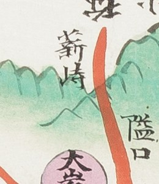

# 1872년 「전라도 금산군지도」 판독

《1872년 지방지도》 「전라도 금산군지도」(규장각). 금산군은 **대전의 남쪽**으로, 공주목
산내면 방면과 접합니다. 고개 쟁점은 [`대전-고개-대조표.md`](대전-고개-대조표.md) 12.6.

## 도엽

| | |
|---|---|
| 자료번호 | `KYKH003_0000_0047` |
| 원문 | [커먼즈 파일](https://commons.wikimedia.org/wiki/File:KYKH003_0000_0047_%EC%A0%84%EB%9D%BC%EB%8F%84_%EA%B8%88%EC%82%B0%EA%B5%B0%EC%A7%80%EB%8F%84.jpg) |
| 크기 | 5,095 × 8,395 px |
| 훑은 범위 | **西二面 일원만** |
| 방위 | **미확인** |

**`0047` 은 두 책에 각각 있습니다.** `KYKH002…0047` 은 충청도 서천군지도이고, 이 파일은
**전라도 책의 금산군지도**입니다. 번호만으로는 갈리지 않으니 주의합니다.

## 채록 — 西二面

| 위치 | 표기 | 읽기 | 확신 | 크롭 |
|---|---|---|---|---|
| (0.39, 0.30) | **薪峙** | 신치 | 상 |  |
| (0.41, 0.32) | 隘口 | 애구 | 상 | — |
| (0.31, 0.32) | 上薪谷 | 상신곡 | 상 | — |
| (0.35, 0.33) | 下薪谷 | 하신곡 | 상 | — |
| (0.39, 0.32) | 大岩里 二十里 | 대암리 | 상 | — |
| (0.44, 0.34) | 尾余坪 二十里 | 미여평 | 중 | — |
| (0.29, 0.35) | 馬首里 | 마수리 | 상 | — |

넓은 크롭: [`crops/KYKH003_0000_0047_x0.26_y0.24_w0.22_h0.12.jpg`](crops/KYKH003_0000_0047_x0.26_y0.24_w0.22_h0.12.jpg)

**`薪` 이 이 일대에 몰려 있습니다** — 고개 `薪峙` 와 그 아래 마을 `上薪谷`·`下薪谷`.
첫 글자의 풀초(`艹`)가 뚜렷하고, 같은 계열 진잠 도엽의 `薪峴里` 와 같은 글자입니다.

**붉은 도로가 `薪峙` 를 넘어 `隘口` 로 내려갑니다** — 고개와 관문이 한 축에 있습니다.
`隘口` 는 이 도엽 기문의 「隘口四處」와 이어집니다.

## 2026-09-02 의 좌표 오류

`薪峙` 를 (0.32, 0.26), `隘口` 를 (0.33, 0.28)로 적었는데 **x 로 0.07, y 로 0.04 만큼
어긋나 있었습니다.** 근거 크롭은 맞게 잘랐으나 **그 안에서의 위치를 도엽 좌표로 환산할 때**
틀렸습니다. 그 좌표로 다시 자르면 빈 화면이 나옵니다 — **재크롭이 검산입니다.**

같은 때 (0.28, 0.31)에 `石峴里` 가 있다고 적었으나, 그 자리에 있는 것은 `上薪谷`·`下薪谷`
입니다. `峴` 이 든 리 이름이 아니었습니다.

## 남은 것

- **방위 확인**
- 기문 전체 — 「隘口四處」가 어디 넷인지
- `薪峙` 가 해동지도 진산군의 `新峙`(만인산 아래)·해동지도 금산군의 `□峙`(서대산 서쪽)와
  같은 고개인지. **소리가 통해도 자리가 다를 수 있습니다**
- 대전(공주목 산내면)과 맞닿는 북쪽 가장자리

## 변경 이력

| 날짜 | 내용 |
|---|---|
| 2026-09-03 | 문서 개설. 대조표에 흩어져 있던 이 도엽의 채록을 한자리에 모음 |
