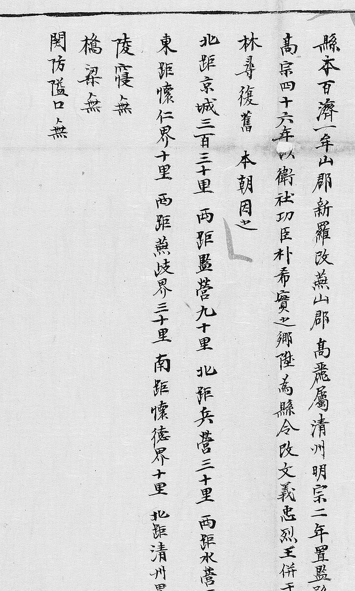

# 1872년 「충청도 문의현지도」 **둘째본** 판독

《1872년 지방지도》에는 **문의현 도엽이 두 장** 있습니다. 이 문서는 그 가운데
**`KYKH002_0000_0002`** 를 다룹니다. 지금까지 이 조사는 `KYKH002_0000_0038` 한 장만
보고 있었습니다 — [`1872-문의현지도-판독.md`](1872-문의현지도-판독.md).

**2026-10-01 에 커먼즈 1872년 분류를 훑다가 찾았습니다.**
기록은 [`대전-고개-대조표.md`](대전-고개-대조표.md) 12.7.7.

## 도엽

| | |
|---|---|
| 자료번호 | **`KYKH002_0000_0002`** |
| 원문 | [커먼즈 파일](https://commons.wikimedia.org/wiki/File:KYKH002_0000_0002_%EC%B6%A9%EC%B2%AD%EB%8F%84_%EB%AC%B8%EC%9D%98%ED%98%84%EC%A7%80%EB%8F%84.jpg) |
| 제목 | **`文義縣地圖`** (도엽 위쪽, 우횡서) |
| 크기 | 3,840 × 5,503 px (커먼즈 썸네일로 판독) |
| 훑은 범위 | 기문 · 동부(고개 일대) · 면 패 · **2차: 전면 개관과 남(오른쪽) 띠** (2026-10-01) |

## 두 장이 왜 있나

모릅니다. 《1872년 지방지도》는 고을마다 한 장이 원칙인데 문의만 둘입니다.
**둘을 나란히 놓고 보면 그림이 다릅니다** — 이 도엽은 산을 톱니꼴로 단순하게 그리고
**모든 지물에 `自官○距○里` 주기를 달았습니다.** 0038 쪽이 더 회화적입니다.

**조사에 값진 것은 이 도엽의 거리 주기입니다** — 고개·산·절의 자리를 **관문에서의
방향과 거리**로 알려 주기 때문입니다.

## 기문 — **사지가 갖춰졌습니다**



도엽 왼쪽 위, 전문입니다.

```
縣本百濟一牟山郡 新羅改燕山郡 高麗屬淸州 明宗二年置監務
高宗四十六年 以衛社功臣朴希實之鄕 陞爲縣令 改文義 忠烈王時併于嘉…
林尋後舊 本朝因之
北距京城三百三十里 · 西距監營九十里 · 北距兵營三十里 · 西距水營二百七里
東距懷仁界十里 · 西距燕歧界三十里 · 南距懷德界十里 · 北距淸州界十里
陵寢無
橋梁無
關防隘口無
```

### 이 사지가 오늘의 정정을 받칩니다

| 방향 | 이 도엽(1872) | 0038(1872) | 해동지도(1750년대) |
|---|---|---|---|
| 東 懷仁界 | **十里** | — | 十里 |
| **西 燕歧界** | **三十里** | 三十里 | ~~十五里~~ → **卅里**(30리) |
| **南 懷德界** | **十里** | 十里 | 十五里 |
| 北 淸州界 | 十里 | — | 十里 |

> **2026-10-01 에 해동지도 문의현의 `西距燕岐界十五里` 를 `燕歧界卅里`(30리)로
> 정정했습니다**(11.6.2). 그 정정이 **1872년 도엽 두 장에서 모두 30리**로
> 뒷받침됩니다. 같은 날 한 정정이 같은 날 확인된 셈입니다.
>
> **회덕까지는 120년 사이에 15리 → 10리로 줄었습니다** — 두 1872년 도엽이 함께
> 10리를 적으므로 이것은 오기가 아닙니다. 길이 바뀌었거나 경계가 옮겨졌을
> 수 있습니다(4.2).

고을 이름을 **`燕歧`**(止+支)로 적습니다 — 해동지도 문의·연기 도엽과 같습니다.
**`關防隘口無`**(관방·애구 없음)는 1872년 금산군지도의 `隘口四處`(12.6)와 맞놓고 볼
구절입니다.

## 고개 — **`漏峴` 에 거리가 붙어 있습니다**

| 위치 | 표기 | 주기 | 확신 | 판독자 | 날짜 |
|---|---|---|---|---|---|
| **(0.328, 0.383)** | **`漏峴`** | **`自官東距十里`** | **상** | Claude | 2026-10-01 |


세로로 `漏`·`峴`, 왼쪽에 `自官東距十里`. 바로 옆에 **`懷仁界十里`** 가 있고
`東面` 패가 가깝습니다.

### 2026-10-01 2차 — **틀이 0038 과 같습니다**

전면을 개관해 두 도엽의 **면 패 자리**를 맞춰 보았습니다.

| 면 패 | 이 도엽(0002) | 0038 |
|---|---|---|
| `東面` | (0.23, 0.45) 왼쪽 복판 | (0.24, 0.46) 왼쪽 복판 |
| `南面` | (0.61, 0.28) 오른쪽 위 | (0.61, 0.30) 오른쪽 위 |
| `邑面` | (0.51, 0.45) 가운데 | (0.51, 0.48) 가운데 |

**세 패가 거의 같은 자리입니다.** 그림 솜씨는 달라도 **두 장이 같은 틀로 그려졌다**는
뜻이고, 같은 날 0038 에서 정한 **위=東 · 아래=西 · 왼쪽=北 · 오른쪽=南** 이 이 도엽에도
그대로 섭니다([`1872-문의현지도-판독.md`](1872-문의현지도-판독.md)).

**이 도엽 스스로도 그 방위를 받칩니다** — `漏峴` 의 주기가 **`自官東距十里`** 인데
`漏峴`(0.33, 0.38)은 읍치(0.50, 0.57)에서 **왼쪽 위**, 곧 **북동**입니다.

**남(오른쪽) 띠에 주기가 빽빽합니다.** `自官距○里` 꼴이 열 줄 넘게 이어지는데
**상하가 반전된 데다 초서**여서 3,840 px 축소본으로는 대부분 못 읽습니다.
**이 도엽의 남은 일 가운데 가장 값진 자리**입니다 — 회덕 쪽이기 때문입니다.

### 이것이 12.7.1 의 미결을 풉니다

대조표 12.7.1 은 해동지도의 **`弘峙`** 와 1872년의 **`漏峴`** 이 같은 고개인지를
「두 고개로 보되 단정하지 않는다」로 열어 두었습니다. **이 도엽의 거리 주기가
가릅니다.**

| | 자리 | 통하는 곳 |
|---|---|---|
| **`弘峙`** (해동지도, 11.6.2) | 읍치와 `懷德界` **사이** | **남 — 회덕** |
| **`漏峴`** (1872 둘째본) | **`自官東距十里`** = `東距懷仁界十里` 와 같은 값 | **동 — 회인** |

> **두 고개는 다릅니다.** `漏峴` 은 **동쪽 회인 길**의 고개이고, `弘峙` 는
> **남쪽 회덕 길**의 고개입니다. 거리가 사지의 `東距懷仁界十里` 와 정확히 맞으므로
> **`漏峴` 은 회인 경계의 고개**로 읽힙니다.
>
> 2026-10-01 에 1872년 진잠지도에서 **길 주기가 고개의 쓰임을 알려 준다**는 기준을
> 세웠는데(12.2 — `奄峴`=연산 길, `牛拳峴`=진산 길), 여기서는 **거리 주기**가 같은 일을
> 합니다. **1872년 계열은 고개의 「어디로 통하는가」를 알려 줍니다.**

## 거리 주기가 지물마다 붙어 있습니다

이 도엽의 특징입니다. 동부에서 읽은 것만 —

| 지물 | 주기 |
|---|---|
| **`漏峴`** | `自官東距十里` |
| `大龍穴` | `自官東距十里` |
| `小龍穴` | `自官東距五里` |
| `玉童峰` | `自官東距三里` |
| `文峯`〔?〕 | `邑之案山 自官南距七里` |
| `社倉` | `自官北距…` |
| `懷仁界` | `十里` |

**`文峯`〔?〕 이 `邑之案山`(읍의 안산)으로 적혀 있습니다** — 읍치의 풍수적 기준산입니다.

## 면

패(牌)로 표시되고 호구가 붙습니다 — `南面` · `東面` · `邑面`(읍내면) ·
그 밖 넷~다섯(아래쪽, 일부 상하 반전).

**해동지도 문의현은 면 일곱**(`邑內`·`東`·`西`·`南`·`北`·`一道`·`二道`·`三道`)이므로
이 도엽의 면 패를 다 읽으면 맞춰 볼 수 있습니다(11.6.2).

## 남은 것

- **0038 과 이 도엽을 나란히 놓고 대조** — 같은 고을 두 장이 무엇이 다른지
- 나머지 면 패와 리 목록
- **`弘峙` 가 이 도엽에도 있는지** — 남쪽(회덕 방면)을 다시 훑어야 합니다.
  있으면 `弘峙`/`漏峴` 두 고개 설이 굳습니다
- 아래쪽 상하 반전 주기들
- 기문 셋째 줄(`林尋後舊`)의 자형
- 규장각 원본

## 변경 이력

| 날짜 | 내용 |
|---|---|
| 2026-10-01 | **문서 개설.** 커먼즈 1872년 분류를 훑어 **문의현 도엽이 두 장**임을 확인하고 둘째본을 받았습니다. ① 기문 전문 — **사지 넷이 갖춰져 있고, 같은 날 한 해동지도 `西距燕歧界卅里` 정정을 받칩니다** ② **`漏峴 自官東距十里`** — 거리가 `東距懷仁界十里` 와 맞아 **`漏峴`(회인 길)과 `弘峙`(회덕 길)가 다른 고개**임이 가려집니다(12.7.1 미결 해소) ③ 지물마다 `自官○距○里` 주기가 붙는 도엽임을 확인 |
