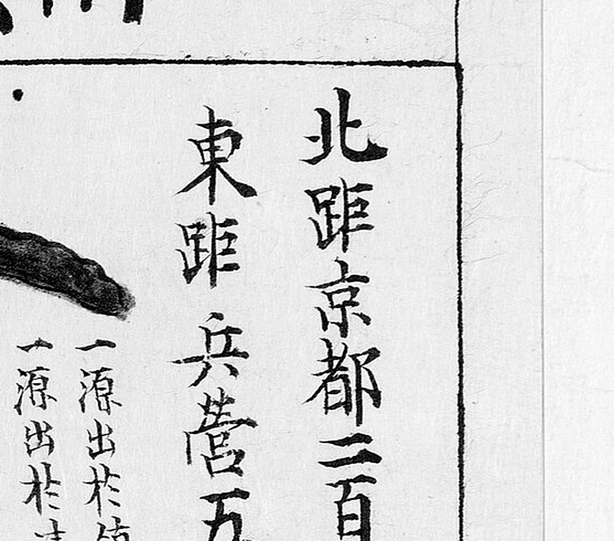
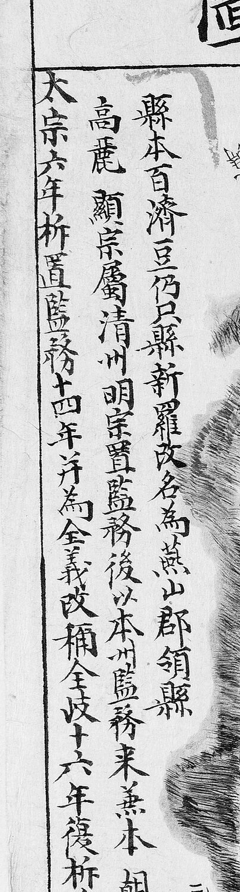
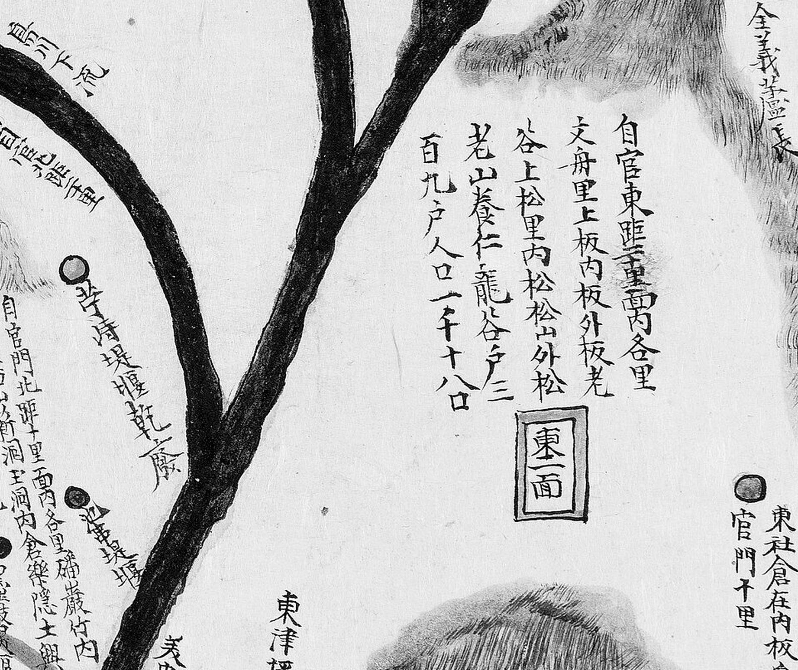
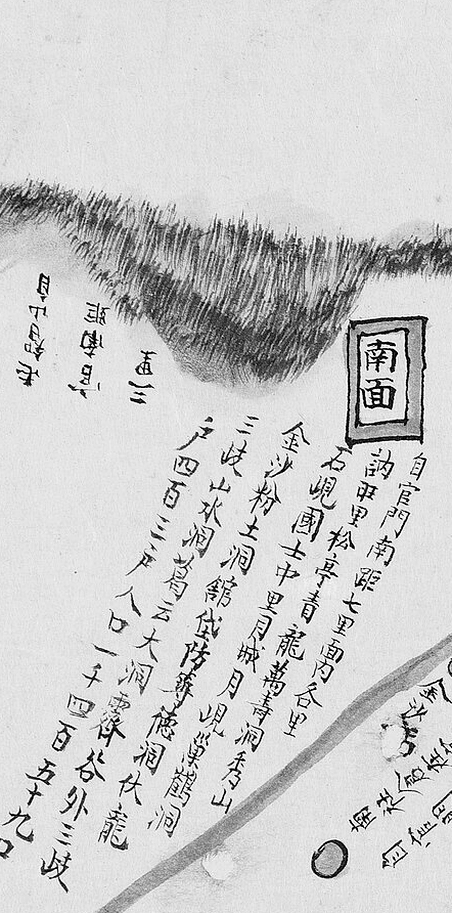

# 1872년 「충청도 연기현지도」 판독

《1872년 지방지도》 「충청도 연기현지도(燕岐縣地圖)」(서울대학교 규장각한국학연구원 소장).
**연기는 회덕(대전)의 서북쪽**이고 금강 건너입니다 — 회덕현 도엽에 경계 표기가 없는
**2차 접경**입니다. 지금 세종특별자치시 연기면 일원입니다.

**이 도엽은 2026-10-01 에 처음 찾았습니다.** 그때까지 이 조사의 1872년 계열에 연기가
빠져 있었습니다 — 해동지도 계열에는 있었는데도
([`해동지도-연기현-판독.md`](해동지도-연기현-판독.md)).
기록은 [`대전-고개-대조표.md`](대전-고개-대조표.md) 12.7.6.

## 도엽

| | |
|---|---|
| 자료번호 | `KYKH002_0000_0023` |
| 원문 | [커먼즈 파일](https://commons.wikimedia.org/wiki/File:KYKH002_0000_0023_%EC%B6%A9%EC%B2%AD%EB%8F%84_%EC%97%B0%EA%B8%B0%ED%98%84%EC%A7%80%EB%8F%84.jpg) |
| 제목 | **`燕岐縣地圖`** (도엽 위쪽, 우횡서) |
| 크기 | 3,840 × 5,755 px (커먼즈 썸네일로 판독) |
| 훑은 범위 | 가장자리 · 기문 · 면 주기 일부 · 읍치 (2026-10-01) |
| 방위 | **위 = 北** (표준) |

**방위 근거** — 면 배치가 그대로 맞습니다. `西面`(왼쪽 위) · `北面`(위 가운데) ·
`東一面`(오른쪽) · `南面`(아래 왼쪽) · `邑內面`(가운데). 오른쪽 아래 가장자리에
**`公州界十里`·`公州界二十里`** 가 있는데, 공주목의 북동쪽 면들(명탄·구즉)이 금강 건너
연기와 마주하므로 어긋나지 않습니다.

## 거리 주기 — 서울·감영·병영·수영



```
北距京都三百九十里   南距監營四十里
東距兵營五十里       西距水營二百里
```

**사지(이웃 고을까지의 거리)는 이 자리에 없습니다** — 대신 가장자리에
`公州界十里` 꼴로 적혀 있습니다. **해동지도 연기현은 사지를 갖추고 있으므로**
(東 청주 17리 · 西 공주 10리 · 南 문의 15리 · 北 전의 15리, 11.6.5)
두 계열을 함께 봐야 합니다.

## 연혁 기문



도엽 왼쪽 위, 세로 한 줄입니다.

```
縣本百濟豆仍只縣 新羅改名爲燕山郡領縣
高麗顯宗屬淸州 明宗置監務 後以本縣屬淸州
本朝太宗六年析置監務 十四年併爲金池〔?〕
我朝改稱全岐〔?〕 十六年復析爲縣監
```

`豆仍只`(두잉지)라는 백제 이름부터 적었습니다. 끝 두 줄은 초서가 섞여
확신 `중` 입니다.

## 고개 — ~~찾지 못했습니다~~ **서쪽을 다시 훑으니 넷이 나왔습니다** (2026-10-01 2차)

1차에서 「`峙`·`峴`·`嶺` 표기를 찾지 못했다」고 적고 **「없다」고는 적지 않았습니다.**
같은 날 서쪽 절반을 다시 훑어 **넷**을 찾았습니다. **1차 훑기가 성겼던 것입니다.**

| 위치 | 표기 | 읽기 | 확신 | 판독자 | 날짜 | 크롭 |
|---|---|---|---|---|---|---|
| (0.20, 0.21) | **`松峴店`** | 송현점 | **상** | Claude | 2026-10-01 |  |
| (0.21, 0.28) | **`小松峙`** | 소송치 · **「작은 솔재」** | **상** | Claude | 2026-10-01 |  |
| `南面` 리 목록 | **`石峴`** | 석현 | **상** | Claude | 2026-10-01 |  |
| `南面` 리 목록 | `月峴`〔?〕 | 월현 | 중 | Claude | 2026-10-01 | 위 목록 크롭 |

**`松峴店` 은 주막입니다** — `店` 이 붙었습니다. 고개 아래에 주막이 섰다는 것은
**사람이 넘어 다니는 길**이었다는 뜻입니다. 해동지도 연기현의 **`松峙`**(11.6.5)와
같은 계열이고, 두 계열이 `峙`/`峴` 으로 갈립니다(2장).

**`石峴` 은 해동지도의 그 글자입니다.** 2026-10-01 에 연기 도엽의 `金沙峴`·`城峴` 을
철회할 때 **자[尺]로 삼았던 바로 그 `石峴`** 이 1872년에는 **`南面` 의 리 이름**으로
남아 있습니다.

### **`金沙驛` — 철회가 직접 확인됐습니다**


(0.37, 0.74)에 **또렷한 해서로 `金沙驛`** 이 있습니다. 2026-10-01 오전에 해동지도
연기현의 `金沙峴` 을 **`金沙驛`**〔?〕 으로 고쳐 읽고 고개 목록에서 뺐는데
(11.6.5), **같은 날 1872년 도엽이 그 역을 이름째로 적어 둔 것을 찾았습니다.**
확신 `중` → **`상`**.

> **「없다」를 적지 않은 것이 옳았습니다.** 2026-10-01 하루에 「고개가 없다」가
> 세 번 거둬졌습니다 — 옥천(`九也峙`) · 연산(`□□峴`) · 그리고 여기.
> **한 번 훑고 「없다」고 적지 않습니다.**

## 면별 주기 — 리 이름과 호구

1872년 계열의 꼴 그대로입니다(12.1 회덕 · 12.4 옥천). **면 이름에 번호가 붙습니다** —
해동지도 연기현의 `東一`·`東二`·`北一`·`北二`·`北三` 과 같은 짜임입니다.



### `東一面`

```
東一面
自官東距三十里 面各里
文舟里 上板 內板 外板 老谷
上松里 內松 松山 外松 老山 養仁 龍谷
戶 三百九十戶 人口 一千七十八口
```

### `北一面`

```
北一面
自官門北距十里 面各里
碌巖洞 新洞 玉洞 內倉 樂隱 竹內 黑岩 …
戶 二百四十九戶 人口 八百九十八口
```

### `南面` — **고개 글자가 든 리 이름이 둘**



```
南面
自官門南距七里 面內各里
訥甲里 松亭 靑龍 萬壽洞 秀山
石峴 國士 中里 月城 月峴〔?〕 鶴鳴洞〔?〕
金沙粉土洞 錦城 防築 德洞 伏龍
三岐 山水洞 … 大洞 露谷〔?〕 外三岐
戶 四百三十戶 人口 一千四百五十九口
```

**`石峴`** 과 **`月峴`**〔?〕 — 위 「고개」 참조. `松亭`·`金沙` 도 함께 보입니다.

`東一面`·`北一面` 목록에는 고개 글자가 든 리 이름이 없습니다.

## 그 밖에 읽은 것

| 갈래 | 표기 |
|---|---|
| 물 | **`東津江`**(금강) · **`合江`**(미호천 합류, 오른쪽 아래) · `三岐`〔?〕 |
| 산 | `鳳凰山` · `元帥山` · `轉月山` · `獨樂亭`〔?〕 |
| 가장자리 | `公州界十里` · `公州界二十里`(오른쪽 아래) · 위·왼쪽 가장자리에 거리 주기 몇 |
| 읍치 | `客館` · `衙舍` · `司倉` · `鄕校` · `社壇` 등 열몇 |
| 시장 | `邑場市` |
| 제언 | 파란 점으로 여럿(`□□堤堰`) |

**`合江` 이 눈에 띕니다** — 미호천이 금강에 드는 자리이고, 그 건너가 공주목
구즉·명탄면(지금 대전 유성구 북부)입니다. **대전과 마주 보는 지점**입니다.

## 남은 것

- ~~서쪽(공주 방면) 다시 훑기~~ — **2026-10-01 2차에서 `松峴店`·`小松峙`·`石峴`·`月峴`〔?〕 넷**
- `月峴`〔?〕 확정 — `南面` 목록의 글자가 작습니다
- 나머지 면(西·邑內·東二·北二·北三) 주기 전문. `南面` 목록의 가운데 몇 글자
- 연혁 기문의 끝 두 줄
- 가장자리 거리 주기 전문 — **`文義界`·`懷德界` 가 적혀 있는지**
- 규장각 원본

## 변경 이력

| 날짜 | 내용 |
|---|---|
| 2026-10-01 | **문서 개설.** 커먼즈 1872년 분류를 훑어 **빠져 있던 도엽**임을 확인하고 받았습니다. 방위 **위=北**, 거리 주기(서울 390리·감영 40리), 연혁 기문, `東一面`·`北一面` 리 목록. **고개는 1차에서 찾지 못했습니다 — 「없다」고 적지는 않습니다** |
| 2026-10-01 | **2차 — 서쪽을 다시 훑어 넷을 찾았습니다.** `松峴店`(주막) · `小松峙` · `南面` 리 목록의 `石峴`·`月峴`〔?〕. **1차 훑기가 성겼던 것**이고, 「없다」를 적지 않은 것이 옳았습니다 |
| 2026-10-01 | **`金沙驛` 이 또렷한 해서로 있습니다**(0.37, 0.74) — 같은 날 해동지도의 `金沙峴`→`金沙驛` 철회가 **독립된 자료로 확인**됐습니다. 확신 `중`→`상` |
| 2026-10-01 | `南面` 리 목록 채록 — `自官門南距七里`, 호 430·구 1,459 |
