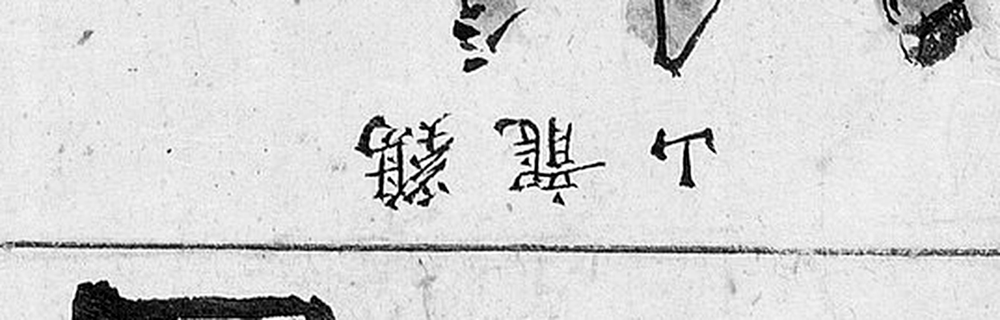

# 1872년 「충청도 연산현지도」 판독

《1872년 지방지도》 「충청도 연산현지도」(서울대학교 규장각한국학연구원 소장).
**연산은 진잠(대전 유성·서구 남부)의 서남쪽 이웃**입니다. 지금 논산시 연산면입니다.

해동지도 계열은 [`해동지도-연산현-판독.md`](해동지도-연산현-판독.md), 기록은
[`대전-고개-대조표.md`](대전-고개-대조표.md) 12.7.2.

## 도엽

| | |
|---|---|
| 자료번호 | `KYKH002_0000_0019` |
| 원문 | [커먼즈 파일](https://commons.wikimedia.org/wiki/File:KYKH002_0000_0019_%EC%B6%A9%EC%B2%AD%EB%8F%84_%EC%97%B0%EC%82%B0%ED%98%84%EC%A7%80%EB%8F%84.jpg) |
| 크기 | 3,840 × 5,066 px (커먼즈 축소본으로 판독) |
| 짜임 | 제목 `連山縣地圖` 가 위에, 도로 주기가 오른쪽 세로, 그림이 가운데 |
| 훑은 범위 | 전면 (2026-09-30) — 대전(진잠) 쪽 가장자리 중심 · **2차: 북동(진잠 쪽)·남서 타일 재훑기** (2026-10-01) |
| 방위 | 위가 北이되 **가장자리 글자는 상하가 뒤집혀** 있습니다 |

**면 이름을 빨간 네모에 넣습니다.** 1872년 계열은 도엽마다 면 표시 방식이 다릅니다 —
진산은 색칠한 네모(노랑·빨강·파랑), 금산은 색 네모에 면마다 색을 달리, 문의는 색 네모,
연산은 빨간 네모입니다.

## 도로 주기 — 오른쪽 세로

```
全羅道全州界二十里
京城三百七十里 · 監營七十里 · 兵營二百二十里 · 水營一百六十里
恩津界十五里
```

## 위 가장자리 — **진산계와 `鎭岑縣`**

가장자리 주기가 **상하 반전**되어 있습니다.

| 위치 | 표기 | 확신 |
|---|---|---|
| (0.17, 0.10) | **`鎭岑縣`** | 상 |
| (0.40~0.78, 0.09) | **`全羅道珎山界三十里`** | 상 |


*`岑`·`縣` 두 글자가 또렷하고, 인근에 다른 `岑縣` 이 없으므로 `鎭岑縣` 으로 읽습니다.*

**2026-10-01 에 넓게 다시 잘라 보니 첫 글자는 획이 거의 남아 있지 않습니다.**



*같은 자리를 넓게. `岑`·`縣` 왼쪽(=원본 오른쪽)에 글자 한 자리가 있으나 획이
토막만 남았습니다.* **그러므로 `鎭` 은 읽은 것이 아니라 미루어 넣은 것**입니다 —
확신 `상` 은 「`岑縣` 이라는 고을이 둘레에 진잠뿐」이라는 데서 나오지, 자형에서
나오지 않습니다. 이 단서를 달아 둡니다.


*`全羅道珎山界三十里`.*

**해동지도 연산현의 `鎭岑界` 두 곳이 1872년 도엽에서도 이어집니다**(11.6.4) —
**진잠과 연산은 두 계열 모두에서 서로를 적습니다.** 대조표 4.2 의 「이웃이 서로를 적는
짝」 가운데 하나입니다.

## 고개 — **`熊峙` 하나** (2026-10-01 2차)

2026-09-30 에 「위 가장자리(대전·진잠 방면)에 고개 표기가 없다」고 적고, 도엽 안쪽의
`雲住峙`〔?〕·`城隍峙`〔?〕 를 확인하지 못한 채 두었습니다. 2026-10-01 에 북동·남서를
2.0배로 다시 훑었습니다.

| 위치 | 표기 | 읽기 | 확신 | 판독자 | 날짜 | 크롭 |
|---|---|---|---|---|---|---|
| **(0.645, 0.378)** | **`熊峙`** | 웅치 · **곰재** | **상** | Claude | 2026-10-01 |  |

**우횡서로 `峙`(왼쪽)·`熊`(오른쪽)** 이고 두 글자 다 또렷합니다. `熊` 은 `能`+`灬`,
`峙` 는 `山`+`寺` 로 2026-10-01 에 연기현에서 세운 `山` 부수 검사를 통과합니다
(대조표 11.6.5).


*`熊峙` 둘레. 길이 고개를 지나 북동으로 올라갑니다.*

**자리가 도엽 동쪽입니다.** 이 도엽은 위가 北이므로 (0.645, 0.378)은 **동북쪽**이고,
연산의 동쪽이 **진잠**입니다. **진잠 쪽 고개일 수 있습니다** — 다만 경계 주기가 붙어
있지 않아 어느 고을로 넘는지는 이 도엽만으로 가릴 수 없습니다. 확신은 글자에 대해
`상`, **비정에 대해서는 두지 않습니다.**

**`雲住峙`〔?〕·`城隍峙`〔?〕 는 2차에서도 찾지 못했습니다.** 2026-09-30 의 추정이
어디를 가리킨 것인지 좌표가 남아 있지 않아 되짚을 수 없습니다 — **좌표 없는 추정은
적지 않는다**는 교훈으로 남깁니다. 남쪽·서쪽 절반은 아직 2차로 보지 못했습니다.

## 그 밖에 읽은 것

| 갈래 | 표기 |
|---|---|
| 면(빨간 네모) | `伐谷面` · `豆麻面` · `食汗面`〔?〕 · `城東面` · `赤寺谷面` · `外城面` · `夫人處面` · `芹渚面`〔?〕 |
| 산 | `鷄龍山` · `連天峯` · `大芚山` · `天護山`〔?〕 |
| 절 | `新興寺` · `靈隱寺` · `大興菴` · `雲寺`〔?〕 |
| 관아 | `東軒` · `衙舍` · `客舍` · `鄕校` · `邑場` |

## 남은 것

- **도엽 안쪽 전면 훑기** — 지금은 가장자리와 면 이름만 보았습니다
- `雲住峙`〔?〕 · `城隍峙`〔?〕 확인
- 위 가장자리 주기 전수 (상하 반전)
- 면별 거리 주기
- 원본은 이 환경에서 받을 수 없습니다

## 변경 이력

| 날짜 | 내용 |
|---|---|
| 2026-10-01 | **2차 — `熊峙`(0.645, 0.378)를 찾았습니다.** 2026-09-30 의 「고개 표기 없음」을 고칩니다. 도엽 동쪽(진잠 방면)이고 길이 지납니다. `雲住峙`〔?〕·`城隍峙`〔?〕 는 찾지 못했습니다 — **좌표 없는 추정은 되짚을 수 없습니다** |
| 2026-10-01 | `鎭岑縣` 의 첫 글자는 **획이 토막만 남아 있음**을 넓은 크롭으로 적어 두었습니다. 확신 `상` 은 자형이 아니라 「둘레에 `岑縣` 이 진잠뿐」이라는 데서 나옵니다 |
| 2026-09-30 | **문서 개설 · 착수.** 위 가장자리에서 **`鎭岑縣`** 과 `全羅道珎山界三十里` 확인, 면·산·절 채록. 대전 쪽 고개 없음 |
