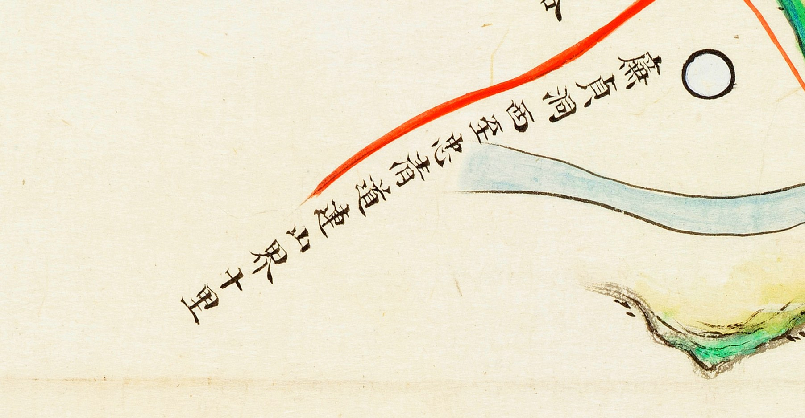

# 1872년 「전라도 진산군지도」 판독

《1872년 지방지도》 「전라도 진산군지도」(규장각). 진산군은 **회덕(대전)의 남쪽**으로,
지금 금산군 진산면입니다. 금산은 1963년에야 충남이 되었으니 당시는 **전라도**였습니다.

**이 도엽은 대조표 6.4(`鷄峴` 쟁점)의 판정점입니다.** 고개 쟁점은
[`대전-고개-대조표.md`](대전-고개-대조표.md) 12.5.

## 도엽

| | |
|---|---|
| 자료번호 | `KYKH003_0000_0059` |
| 원문 | [커먼즈 파일](https://commons.wikimedia.org/wiki/File:KYKH003_0000_0059_%EC%A0%84%EB%9D%BC%EB%8F%84_%EC%A7%84%EC%82%B0%EA%B5%B0%EC%A7%80%EB%8F%84.jpg) |
| 크기 | 8,549 × 14,438 px |
| 훑은 범위 | **가장자리 주기 한 곳** |
| 방위 | **미확인** — 이것이 지금 가장 급한 일입니다 |

## 채록

| 위치 | 표기 | 확신 | 판독자 | 날짜 | 크롭 |
|---|---|---|---|---|---|
| (0.66–0.87, 0.34–0.40) | □程東西至忠淸道連山界十里 | 상 | 연구회 | 2026-09-03 |  |
| (0.71, 0.39) | □ (위 주기의 첫 글자) | **하** | 연구회 | 2026-09-03 |  |

**글자는 상하가 반전되어 있고 열두 자입니다.** 오른쪽 위에서 왼쪽 아래로 비스듬히
내려갑니다. 어순은 `西至 忠淸道連山界 十里`(서쪽으로 충청도 연산 경계까지 10리)로 끊어
읽는 것이 자연스러워 보입니다 — 진산군 서쪽이 연산이므로 내용도 맞습니다.

첫 글자는 **`無`(없을 무)의 이체자로 보이나**(판독자), `無程…` 이 무엇을 뜻하는지 풀지
못했습니다.

## 2026-09-02 의 오독

이 주기를 `懷德`·`峙`·`大路`·`○十里` 로 읽고 **"진산 북쪽 경계에 회덕으로 통하는 고개
주기가 있다"**고 적었습니다. **틀렸습니다** — `連山` 을 `懷德` 으로 본 것입니다.
2026-09-03 에 철회했습니다.

**따라오는 것 둘.**

- **`鷄峴` 은 이 도엽에서 여전히 확인되지 않았습니다.** 제보를 뒷받침하던 원본 근거가
  사라진 상태로 돌아갔습니다.
- **`懷德` 이 없다는 사실이 오히려 대조표 6.4 를 강하게 합니다.** 해동지도 진산군도
  북쪽을 `公山界`(공주)라 하고 회덕을 적지 않습니다. **1872년까지 이어집니다.**

## 남은 것

- **방위 확정** — 네 변의 경계 표기를 찾아 확인합니다. 「북쪽 경계」라 적었던 자리에서
  진산 *서쪽*인 연산계가 나왔으니, 지금 방향 판단은 근거가 없습니다
- 도엽 전면 훑기 — `鷄峴` 이 정말 없는지
- 주기 첫 글자

## 변경 이력

| 날짜 | 내용 |
|---|---|
| 2026-09-03 | 문서 개설. 대조표에 흩어져 있던 이 도엽의 채록을 한자리에 모음 |
