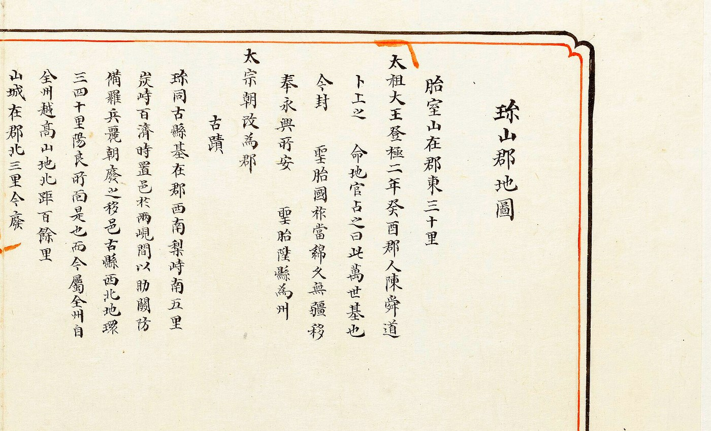
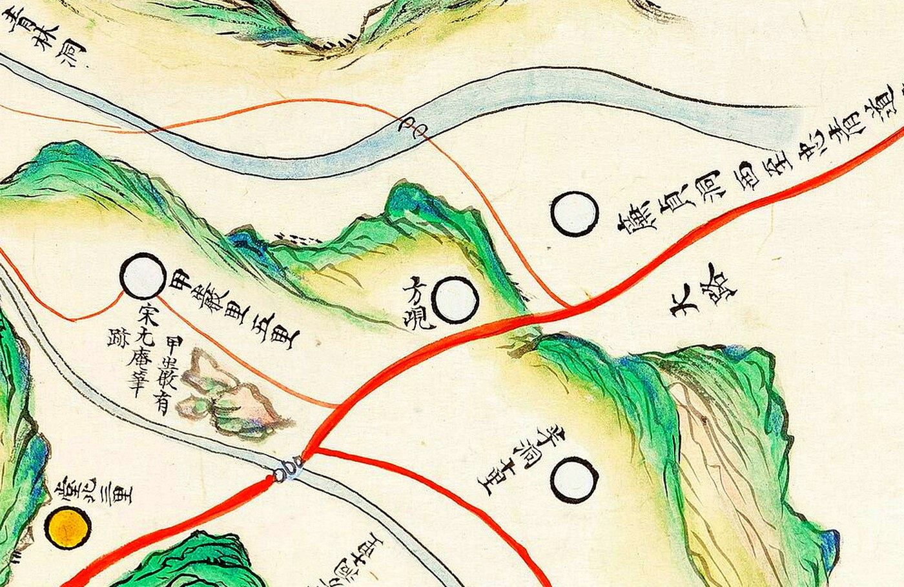
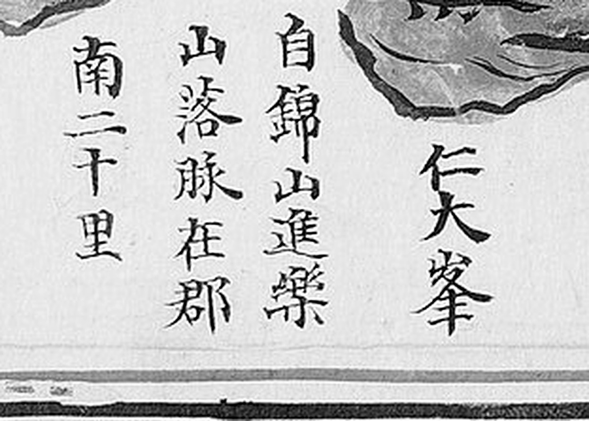
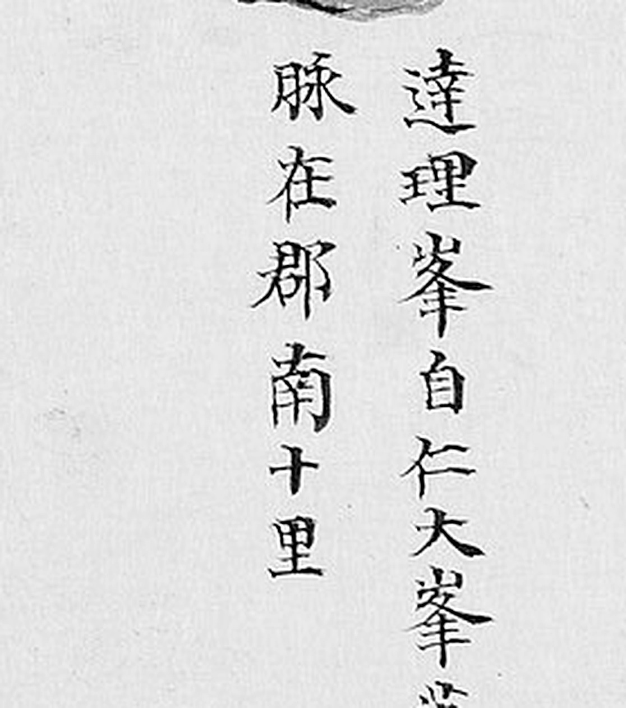
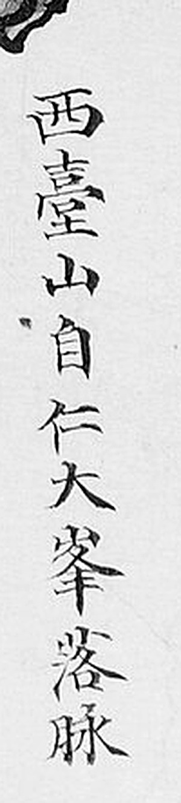

# 1872년 「전라도 진산군지도」 판독

《1872년 지방지도》 「전라도 진산군지도」(규장각). 진산군은 **회덕(대전)의 남쪽**으로,
지금 금산군 진산면입니다. 금산은 1963년에야 충남이 되었으니 당시는 **전라도**였습니다.

**이 도엽은 대조표 6.4(`鷄峴` 쟁점)의 판정점입니다.** 고개 쟁점은
[`대전-고개-대조표.md`](대전-고개-대조표.md) 12.5.

## 도엽

| | |
|---|---|
| 자료번호 | `KYKH003_0000_0059` |
| 원문 | [커먼즈 파일](https://commons.wikimedia.org/wiki/File:KYKH003_0000_0059_%EC%A0%84%EB%9D%BC%EB%8F%84_%EC%A7%84%EC%82%B0%EA%B5%B0%EC%A7%80%EB%8F%84.jpg) |
| 크기 | 8,549 × 14,438 px |
| 훑은 범위 | 기문 전문 · 읍치 · 북쪽 가장자리 (2026-09-30) · **동쪽·북쪽 경계 주기** (2026-10-01) |
| 방위 | **위=西 · 오른쪽=北 · 아래=東 · 왼쪽=南** (2026-09-30 확정) |

## 방위 — 위가 西입니다 (2026-09-30)

커먼즈 축소본(3,840 px)을 받아 확인했습니다. **도엽 안에 방위 대자(大字)가 있습니다.**

| 위치 | 대자 | 뜻 |
|---|---|---|
| (0.54, 0.31) | **`西`** | 위 = 서 |
| (0.13, 0.54) | **`南`** | 왼쪽 = 남 |

따라서 **오른쪽 = 北, 아래 = 東** 입니다. 둘 다 **상하가 반전되어** 적혀 있습니다 —
도엽 바깥에서 그 방향을 보고 읽도록 적은 것입니다.

**이것이 2026-09-03 의 `連山界` 판독을 검산해 줍니다.** 그 주기는 (0.66~0.87, 0.34~0.40),
곧 **오른쪽 위 = 북서**에 있고, 연산은 진산의 **북서**입니다. 앞뒤가 맞습니다.
2026-09-02 에 이 자리를 「북쪽 경계」라 부른 것도 반쯤 맞았던 셈입니다.

**글자 방향이 구역마다 다릅니다.** 읍치 언저리는 바로 읽히고, 네 가장자리의 주기는
바깥을 향해 뒤집혀 있습니다. **돌려 보지 않으면 글자가 있는지조차 모릅니다.**

## 기문 (2026-09-30)

도엽 위쪽에 기문이 있습니다. **고개가 둘 나옵니다 — 둘 다 고적(古蹟) 조입니다.**

| 조 | 내용 |
|---|---|
| 태실 | `胎室山 在郡東三十里` · `太祖大王登極二年癸酉 郡人陳舜道卜工之 命地官占之曰 此萬世基也 令封 璽胎 國祚當綿久無疆` · `移奉永興哥安` · `璽胎陞縣爲州 太宗朝改爲郡` |
| 고적 | `珎同古縣基 在郡西南 **梨峙** 南五里` |
| 고적 | `**炭峙** 百濟時置邑於兩峴間 以助關防 備羅兵 麗朝廢之 移邑古縣西北地…` |
| 산성 | `山城 在郡北三里 今廢` |
| 도로 | 京都北距 420리 · 監營南距 120리 · 兵營南距 440리 · 右水營南距 560리 · 左水營南距 460리 · 統營東南距 630리 |
| 그 밖 | `烽臺無` `鎭驛無` `沿海無` `牧場無` · **`坊里六面`** |

**`炭峙` 주기가 눈에 띕니다** — `百濟時置邑於**兩峴間** 以助關防 備羅兵`(백제 때 **두 고개
사이**에 읍을 두어 관방을 돕고 신라 병사를 대비했다). **진산이 예부터 고개로 막힌 길목이었다**는
것을 이 도엽 스스로 말합니다. 6.4 가 닭재를 「회덕에서 진산으로 넘는 고개」로 보는 것과
결이 같습니다.

**태실 기사가 길게 실렸습니다.** 2026-09-19 에 판독자가 「태조대왕 태실은 금산이 아니라
진산이고, 그래서 진산이 산골인데도 고유성을 지켰다」고 한 것이 **도엽 기문으로 확인됩니다.**

## 읍치 (2026-09-30)

`衙舍` `客舍` `東軒` `郡司` `作廳` `鄕射堂` `將廳` `邑倉` `軍器庫` `刑獄` `市場` `社稷壇`
`校宮` `校倉`. 리 이름 — `西上里` `南上里` `東里` `黑山 五里`. 면 이름표는 **색칠한 네모**에
넣습니다(`郡內` 노랑 · `南二面` 빨강 · `北面` 파랑).

## 경계 길 주기 — 방위마다 하나씩 (2026-10-01)

**이 도엽은 고을 밖으로 나가는 길마다 긴 주기를 답니다.** 빈 들판에 세로로, 또는
가장자리를 향해 뒤집힌 가로로 적혀 있어 **돌려 보지 않으면 보이지 않습니다.**
2026-09-03 에 찾은 서쪽 주기가 이 계열의 첫 건이었고, 2026-10-01 에 둘을 더 찾았습니다.

| 방위 | 주기 | 확신 | 날짜 |
|---|---|---|---|
| 동 | **`思睦峙東至忠淸道沃川界四十里`** | **상** | 2026-10-01 |
| 서북 | **`馬項西北至忠淸道公州界`**`□□里` + 따로 **`夾路`** | **중상** | 2026-10-01 |
| 서 | `□程東西至忠淸道連山界十里` | 상 | 2026-09-03 |
| **서남** | **`梨峙西至全州界十里`** + 곁에 **`大路`** | **상** | 2026-10-01 |

**충청도 쪽 셋은 상대를 `忠淸道 ○○界` 로 적습니다.** 진산이 전라도였기 때문입니다 —
도(道)를 먼저 적고 고을을 적습니다. **같은 전라도인 전주에는 도 이름을 붙이지
않습니다**(`全州界`). 이것도 한 가지 서식입니다.

### 동 — **`思睦峙`** (사목치)

(0.60~0.62, 0.83~0.91)에 **세로로 또렷한 해서** 열네 자. 가장자리 주기와 달리 뒤집혀
있지 않아 그냥 읽힙니다. 곁에 `大路` 가 적혀 있고, 그 아래가 `西臺山` 입니다.

**이것이 『해동지도』 진산군 기문의 `新目峙`(`暫夷〔?〕三十五里 沃川界`)입니다.**
120년 사이에 `新目` → `思睦` 으로 글자가 바뀌었을 뿐 **둘 다 「―목―」을 담고 있고,
동쪽 옥천 길에 35리·40리로 같은 자리를 가리킵니다**
([해동지도 진산군 판독](해동지도-진산군-판독.md) ③ · 대조표 11.2).

### 서북 — **`馬項`** (말목)

(0.77~0.89, 0.476~0.50)에 **가로로, 상하가 뒤집혀** 적혀 있습니다. 180° 돌려야 읽힙니다.
첫 두 글자가 **`馬項`**, 아래 줄에 따로 **`夾路`**(좁은 길)가 붙습니다. 끝의 거리 두 자는
미판독입니다.

**`項` 은 「목」입니다.** 이 도엽은 「목」을 세 가지 한자로 적습니다 —
`思睦峙`(睦) · `馬項`(項) · `睦洞五里`(睦). 해동지도의 `晚目峙`·`新目峙`(目)까지 넣으면
**한 고을에서 같은 우리말에 넉 자**가 쓰인 셈입니다.

**6.4(닭재)에 보탬이 됩니다.** 1872년 도엽도 북쪽을 **공주**라 적습니다. 그것도
사지가 아니라 **길 주기**로, 곧 「실제로 그리로 다녔다」는 말로 적습니다.
`懷德` 은 이 도엽 어디에도 없습니다.

### 서남 — **`梨峙`** (배티재)

(0.17~0.26, 0.36~0.38)에 **상하가 뒤집힌 가로줄**로 아홉 자. 그 위에 네 글자가 따로
있는데 앞 둘은 **`大路`**(큰길)이고 뒤 둘은 미판독(`道`〔?〕·`口`)입니다.

**이 주기가 『해동지도』 기문 읽기를 받쳐 줍니다.** 기문 산천 조는
**`梨峙 陰峻 十里 全州界`** 라 적습니다 — **거리가 `十里` 로 같습니다.**
2026-10-01 에 「기문의 리(里)는 읍치가 아니라 **고개에서 그 경계까지**」라고 읽었는데,
120년 뒤 도엽이 **`梨峙西至全州界十里`** 라고 풀어서 적어 둔 셈입니다
([해동지도 진산군 판독](해동지도-진산군-판독.md) 「주기의 서식」).

### 산을 적는 서식 — **`○○ 自○○落脉 在郡○ ○里`**

경계 길 주기와 짝을 이루는 또 하나의 서식입니다. **산마다 「어느 산에서 맥이
떨어졌는가」와 「군에서 몇 리인가」를 답니다.** 셋을 읽었습니다.

| 주기 | 자리 | 크롭 |
|---|---|---|
| **`仁大峯 自錦山進樂山落脉 在郡南二十里`** | (0.10~0.15, 0.55~0.59) |  |
| **`達理峯 自仁大峯落脉 在郡南十里`** | (0.12~0.20, 0.41~0.45) |  |
| **`西臺山 自仁大峯落脉`** | (0.51~0.53, 0.89~0.96) |  |

**산줄기가 금산 `進樂山`(진악산) → `仁大峯` → `達理峯`·`西臺山` 으로 이어집니다.**
산경표(山經表)식 기술입니다. `進樂山` 은 지금 금산읍 남쪽의 진악산(732 m)이고,
**실제 지형이라기보다 맥을 따지는 틀**입니다 — `西臺山` 은 진산 **동북**인데도
**남쪽** `仁大峯` 에서 맥을 받았다고 적습니다.

**방향마다 글자를 돌린 각도가 다릅니다.** 서북(`馬項`)·서남(`梨峙`)은 **180°**,
남쪽 산 주기는 **90°** 입니다. 동쪽(`思睦峙`)은 돌아 있지 않습니다.
『해동지도』 진산군 기문의 산천 조에도 `西臺山` 이 있습니다.

## 고개와 미판독 (2026-09-30)

| 위치 | 표기 | 읽기 | 확신 | 판독자 | 날짜 | 근거 |
|---|---|---|---|---|---|---|
| (0.64, 0.41) | `方峴` | 방현 | 중 | Claude | 2026-09-30 |  |
| **(0.74, 0.50)** | **`□□□` + `三十里`** | **미판독 — `鷄峴` 후보** | **하** | Claude | 2026-09-30 |  |

**`方峴`** 은 해동지도 진산군의 `方古峙`(대조표 11.2, (0.34, 0.48))와 같은 고개로 보입니다 —
두 계열이 `古` 한 자와 `峙`/`峴` 만 달리 적은 것입니다. 확대 재확인이 필요해 확신 `중`.

### (0.74, 0.50) — **고개 주기가 아니라 리(里) 패였습니다** (2026-10-01 재분류)

2026-09-30 에 「`鷄峴` 이 있다면 있을 자리」로 적었던 곳입니다. 9배로 키워 다시 보니
**바로 위에 리를 나타내는 동그라미가 있고**, 글자는 **윗줄 세 자 + 아랫줄 거리** 의
짜임입니다. 이 도엽이 리를 적는 꼴 그대로입니다(`睦洞五里` · `寒溪里` · `水心臺 十里` …).

- 아랫줄은 **`二十里`** 또는 `三十里` — 획이 둘로 보여 2026-09-30 의 `三十里` 를
  확정으로 두지 않습니다
- 윗줄 세 자는 **여전히 미판독**입니다
- 거리는 **관문에서 그 리까지**입니다. 사지의 `北距公山界三十里` 와 맞춰 읽을 값이 아닙니다

**따라서 이 자리를 `鷄峴` 후보로 보던 근거가 약해졌습니다.** 리 이름에 고개 글자가
들어갈 수는 있으므로 「아니다」라고 하지는 않습니다. 다만 **북쪽 경계 길의 주기는
바로 서쪽의 `馬項` 쪽**에 있고, 그쪽은 공주를 적습니다(위).

**원본(8,549 × 14,438 px)을 보실 수 있는 분의 판독을 기다립니다** — 커먼즈 축소본은
3,840 px 로 원본의 45%입니다.

## 그 밖에 읽은 것 (2026-09-30)

`趙重峯祠宇`(조헌 사우) · `水心臺 十里` · `宋尤庵 舊墟`(송시열 유허) · `太古寺 二十里` ·
`靑林菴 十里` · `馬田面` · `南二面`(`初境自官門三里`) · `北面`(`初境自官門十里`) ·
`郡內` · `舊路` · `南倉` · `木洞里` · `佳幕` · `睦洞五里` · `寒溪里` · `大德里` ·
`榮巖` · `西臺里` · `上元橋` · `新安面`

**리(里)를 색깔 있는 동그라미로 표시합니다** — 흰·빨강·파랑·노랑·분홍·초록. 색이 면을
가리키는 것으로 보이나 아직 짝을 맞추지 못했습니다.

## 남은 것

- ~~(0.74, 0.50)의 세 글자가 `鷄峴` 인가~~ — **2026-10-01 에 리 패로 재분류**. 글자 셋은 여전히 미판독
- **`馬項` 주기 끝의 거리 두 자**
- 서쪽 주기 `□程東西至忠淸道連山界十里` 의 첫 글자 — 2026-10-01 에 3,840 px 축소본을
  기울기까지 바로잡아 다시 보았으나 **2026-09-03 의 판독을 넘어서지 못했습니다.**
  이 해상도에서는 더 들여다볼 일이 아닙니다
- ~~서남 전주계 주기~~ — **2026-10-01 `梨峙西至全州界十里` 채록**
- **남쪽 금산계 주기**가 아직 없습니다. 동쪽(아래) 가장자리도 미착수
- **`大路` 곁의 두 글자**(`道`〔?〕·`口`)
- 리 동그라미 색과 면의 대응
- 리 이름 전수 채록 (백 곳이 넘습니다)

## 채록

| 위치 | 표기 | 확신 | 판독자 | 날짜 | 크롭 |
|---|---|---|---|---|---|
| (0.66–0.87, 0.34–0.40) | □程東西至忠淸道連山界十里 | 상 | 연구회 | 2026-09-03 |  |
| (0.71, 0.39) | □ (위 주기의 첫 글자) | **하** | 연구회 | 2026-09-03 |  |

**글자는 상하가 반전되어 있고 열두 자입니다.** 오른쪽 위에서 왼쪽 아래로 비스듬히
내려갑니다. 어순은 `西至 忠淸道連山界 十里`(서쪽으로 충청도 연산 경계까지 10리)로 끊어
읽는 것이 자연스러워 보입니다 — 진산군 서쪽이 연산이므로 내용도 맞습니다.

첫 글자는 **`無`(없을 무)의 이체자로 보이나**(판독자), `無程…` 이 무엇을 뜻하는지 풀지
못했습니다.

## 2026-09-02 의 오독

이 주기를 `懷德`·`峙`·`大路`·`○十里` 로 읽고 **"진산 북쪽 경계에 회덕으로 통하는 고개
주기가 있다"**고 적었습니다. **틀렸습니다** — `連山` 을 `懷德` 으로 본 것입니다.
2026-09-03 에 철회했습니다.

**따라오는 것 둘.**

- **`鷄峴` 은 이 도엽에서 여전히 확인되지 않았습니다.** 제보를 뒷받침하던 원본 근거가
  사라진 상태로 돌아갔습니다.
- **`懷德` 이 없다는 사실이 오히려 대조표 6.4 를 강하게 합니다.** 해동지도 진산군도
  북쪽을 `公山界`(공주)라 하고 회덕을 적지 않습니다. **1872년까지 이어집니다.**

## 그 뒤 (2026-09-30 · 2026-10-01)

- ~~방위 확정~~ — **2026-09-30 에 도엽 안의 방위 대자로 확정**(위 「방위」)
- **도엽 전면 훑기 — `鷄峴` 이 정말 없는지**는 남습니다. 2026-10-01 에 `鷄峴` 후보로
  보던 (0.74, 0.50)이 **리 패로 재분류**되어, 이 도엽에 `鷄峴` 을 받쳐 주는 자리는
  지금 하나도 없습니다
- 주기 첫 글자 — 위 「남은 것」

## 변경 이력

| 날짜 | 내용 |
|---|---|
| 2026-09-03 | 문서 개설. 대조표에 흩어져 있던 이 도엽의 채록을 한자리에 모음 |
| 2026-10-01 | **동쪽 경계 주기 `思睦峙東至忠淸道沃川界四十里` 를 찾았습니다** — 『해동지도』 기문의 `新目峙` 와 같은 고개이고, **`目`/`睦` 이 우리말 「목」**임을 보여 줍니다 |
| 2026-10-01 | **서북 경계 주기 `馬項西北至忠淸道公州界□□里` + `夾路` 를 찾았습니다** — 1872년 도엽도 **북쪽을 공주라 적습니다.** 그것도 길 주기로. 6.4 의 논거가 한 겹 두터워졌습니다 |
| 2026-10-01 | **(0.74, 0.50)을 고개 주기에서 리 패로 재분류** — 동그라미 + 이름 세 자 + 관문에서의 거리. `鷄峴` 후보 근거가 약해졌습니다 |
| 2026-10-01 | `西臺山自仁大峯落脉` 채록. **경계 길 주기가 방위마다 하나씩 있는 틀**임을 세웠습니다 |
| 2026-10-01 | **서남 경계 주기 `梨峙西至全州界十里` 를 찾았습니다** — 『해동지도』 기문의 `梨峙 陰峻十里 全州界` 와 **거리가 같습니다.** 같은 날 세운 「기문의 리는 고개에서 그 경계까지」 읽기를 **120년 뒤 도엽이 풀어서 적어 둔 셈**입니다. 같은 전라도인 전주에는 **도 이름을 붙이지 않습니다** |
| 2026-10-01 | **산을 적는 서식을 찾았습니다** — `○○ 自○○落脉 在郡○ ○里`. `仁大峯 自錦山進樂山落脉 在郡南二十里` · `達理峯 自仁大峯落脉 在郡南十里` · `西臺山 自仁大峯落脉`. **산경표식**입니다 |
| 2026-10-01 | **글자를 돌린 각도가 방향마다 다릅니다** — 서북·서남 **180°**, 남쪽 산 주기 **90°**, 동쪽은 **돌아 있지 않습니다** |
