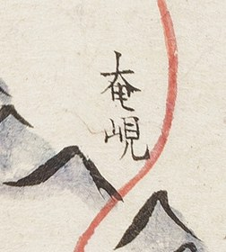
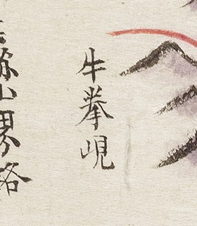
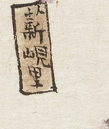

# 1872년 「충청도 진잠산천방리도로지도」 판독

《1872년 지방지도》 「충청도 진잠산천방리도로지도(鎭岑山川坊里道路之圖)」(서울대학교
규장각한국학연구원 소장). **진잠현은 지금 유성구 남부와 서구 남부입니다.**

기록 방식은 [`판독-기록-형식.md`](판독-기록-형식.md) 를 따릅니다. 고개 쟁점은
[`대전-고개-대조표.md`](대전-고개-대조표.md) 12.2 에 있습니다.

## 도엽

| | |
|---|---|
| 자료번호 | `KYKH002_0000_0036` |
| 원문 | [커먼즈 파일](https://commons.wikimedia.org/wiki/File:KYKH002_0000_0036_%EC%B6%A9%EC%B2%AD%EB%8F%84_%EC%A7%84%EC%9E%A0%EC%82%B0%EC%B2%9C%EB%B0%A9%EB%A6%AC%EB%8F%84%EB%A1%9C%EC%A7%80%EB%8F%84.jpg) |
| 크기 | 5,053 × 8,000 px |
| 훑은 범위 | **도엽 본체 전면** — 원본 3×3 타일 아홉 장 (2026-09-03) |

**표제가 `山川坊里道路` 입니다.** 산천·마을·길을 적겠다고 이름에 걸어 두었고, 실제로
마을 이름이 방(榜)에 진한 먹으로 빽빽합니다. **다만 고개는 인색합니다** — 아래 보듯 둘뿐입니다.

## 방위 — 위가 서(西)

**위=西, 아래=東, 왼쪽=南, 오른쪽=北.** 근거 넷이 서로 맞습니다.

| 근거 | 내용 |
|---|---|
| 가장자리 경계 표기 | 위쪽에 `珎山界`(남)·`連山界`(서) 둘, 아래 여백에 `公州界`·`去懷德路`(동·동북) |
| 면 배치 | 하남면 왼쪽 위, 상남면 왼쪽 가운데, 서면 오른쪽 위, 북면 오른쪽 가운데, 동면 아래, 읍치 가운데 |
| 산 | `安平山`(현 서구 흑석동 남)이 왼쪽, `分雞山`(빈계산, 유성구 계산동·읍치 북)이 오른쪽 |
| 물길 | `豆磨川`(현 계룡시 두마면·서)이 위쪽 |

**회덕현지도는 위가 東, 공주목지도는 위가 南입니다.** 도엽마다 다르니 좌표를 옮기기 전에
반드시 확인합니다.

## 기문

상단에 읍지 형식의 기록이 있습니다.

```
忠淸右道 公州鎭管   五面七十三洞   東西二十五里 南北二十五里
戶一千三百   古號 杞城
北距 鶴下洞 公州界 十里 · 東距 介水院里 公州界 十里
南距 壯安里 珍山界 十五里 · 西距 月底里 連山界 十五里
京三百六十里 · 監營六十里 · 兵營一百里 · 水營二百里
烽臺無 · 驛院無 · 場市·社倉 各三處(介水院·上城北里·龍村里)
```

**사지가 갖춰졌습니다** — 진잠은 사방이 공주(북·동)·진산(남)·연산(서)입니다.
[`고지도-목록.md`](고지도-목록.md) 이 "진잠 사지 미독"이라 적어 두었던 것이 이로써 풀립니다.

**다만 洞 수가 맞지 않습니다.** 기문은 `七十三洞` 인데, 그림의 면 편액을 더하면 **70**입니다
(서면 16 · 북면 14 · 상남면 14 · 하남면 13 · 동면 13). **셋이 뜹니다** — 편액 숫자
재확인이 필요합니다(확신 `중`).

## 고개 — 둘

| 위치 | 표기 | 읽기 | 확신 | 판독자 | 날짜 | 크롭 |
|---|---|---|---|---|---|---|
| (0.51, 0.53) | **奄峴** | 엄현 | 상 | 연구회 | 2026-09-03 |  |
| (0.13, 0.61) | **牛拳峴** | 우권현 | 상 | Claude | 2026-09-03 |  |

**`奄峴`** — 읍치에서 서쪽으로 난 붉은 도로가 산줄기를 넘는 자리. 첫 글자는 `大` 아래 `甲` 꼴.

**`牛拳峴`** — 곁에 `去珎山界路`(진산 경계로 가는 길)가 적혀 있어 **진잠에서 진산으로 넘던
고개**로 읽힙니다. 사지가 「남 壯安里 珍山界 15리」이고 장안리는 현 서구 장안동이니,
자리는 **서구 장안동·봉곡동 남쪽**으로 좁혀집니다. 우리말 이름은 아직 모릅니다.

## 고개 이름이 든 리 — 둘

| 위치 | 표기 | 면 | 확신 | 크롭 |
|---|---|---|---|---|
| (0.32, 0.43) | 鐵峴里 | 하남면 | 상 | — |
| (0.28, 0.58) | **薪峴里** | 상남면 | 상 |  |

`薪` 은 풀초(`艹`)가 얹힌 글자로, 1872년 「금산군지도」의 `薪峙`·`上薪谷`·`下薪谷` 과
같습니다. **리 이름은 고개의 출전이 아닙니다** — 그 마을 곁에 고개가 있었으리라는
정황일 뿐이고, 도엽은 고개를 따로 그리지 않았습니다.

## 도로 주기 — 넷

| 위치 | 표기 | 읽기 |
|---|---|---|
| (0.10, 0.61) | 去珎山界路 | 진산 경계로 가는 길 |
| (0.56, 0.36) | 去連山路 | 연산 가는 길 |
| (0.94, 0.72) | 去公州大路 | 공주 가는 **대로** |
| (0.60, 0.92) | **去懷德路** | 회덕 가는 길 (아래 여백) |

**`去懷德路` 는 사지에 없는 이웃이 도로 주기로 나온 사례입니다.** 경계 표기만 훑으면
놓칩니다.

## 경계 표기

| 위치 | 표기 | 실제 방위 |
|---|---|---|
| (0.10, 0.35) | 珎山界 | 남서 |
| (0.20, 0.35) · (0.73, 0.34) | 連山界 (두 곳) | 서 |
| (0.88, 0.31) | 鶴龍山 · 公州界 | 북 |
| (0.39, 0.86) · (0.62, 0.91) | 公州界 (두 곳) | 동 |

`珎山界` 의 `珎` 는 **회덕현지도의 `珎山` 과 같은 이체자**입니다.

## 산천·사찰

`白雲峰` · `錦繡峰` · `藥師峰` · `分雞山`(빈계산) · `安平山` · `大老山` · `石峰` · `胎峯` ·
`海見寺` · `豆磨川` · `介水川`

## 읍치 관아

`官舍` · `客舍` · `邑倉` · `軍器庫` · `社壇` · `鄕校` · `厲壇` · `東社倉` · `西社倉` ·
`南社倉` · `介水院場市`

## 면과 리

**아래 리 이름은 원본 타일에서 읽은 것입니다.** 방(榜) 색으로 면이 갈립니다 — 서면·상남면·
하남면은 붉은 방, 북면은 검은 방, 동면은 푸른 방입니다.

| 면 | 편액 | 읽은 리 |
|---|---|---|
| 西面 | 十六洞 | 各化里 · 松亭里 · 倉上里 · 沐林里 · 月底里 · 南仙里 · 上細洞 |
| 北面 | 十四洞 | 沙樹里 · 鐵店里 · 寒泉里 · 汪岩里 · 茅谷里 · 雞山里 · 長尺里 · 雙山岩里 · 龍頭里 · 上城北 · 下城北 · 三漢里 · 新院里 |
| 上南面 | 十四洞 | 壯安里 · 梅老里 · **薪峴里** · 龍台洞 · 黑石里 · 柳川洞 · 龍山石里〔?〕 |
| 下南面 | 十三洞 | 馬洞里 · 牛鳴里 · 甑村里 · 鐵峴里 · 永洞里 · 坪村里 · 龍村里 · 元亭里 · 貞防里 · 水回里 · 中山里 · 德洞 · 金靑里 · 鳳谷里 · 吉谷里 · 元洞里 |
| 東面 | 十三洞 | 官寺洞 · 蘆田里 · 中村 · 老谷里 · 白也洞 · 椵谷里 · 仙洞里 · 松村 · 心洞 · 丑山岩里 · 龍頭里 · 栗里 · 宜下洞 · 大井里 · 元堂里 · 山直里 · 道兵里〔?〕 · 龍巢里 · 防築里 · 新里 · 上狄里 · 獐坪里 · 屯洞里〔?〕 |

**편액 숫자와 읽은 리 수가 면마다 맞지 않습니다.** 하남면·동면은 편액보다 많이 읽혔습니다 —
**면 경계를 잘못 배정했을 수 있습니다.** 방 색으로 다시 가려야 합니다.

## 남은 것

- **면 배정 재확인** — 편액 洞 수와 읽은 리 수가 어긋납니다
- 기문 `七十三洞` 과 편액 합 70 의 차이
- `龍山石里`·`道兵里`·`屯洞里` 의 자형 재확인
- `牛拳峴` 의 우리말 이름과 현 위치 비정
- 도엽 남서·북동 모서리의 잔글씨

## 변경 이력

| 날짜 | 내용 |
|---|---|
| 2026-09-03 | 문서 개설. 전면 훑기(원본 3×3 타일) 결과를 옮김 — 방위, 기문, 고개 둘, 도로 주기 넷, 경계 표기, 면·리 |
