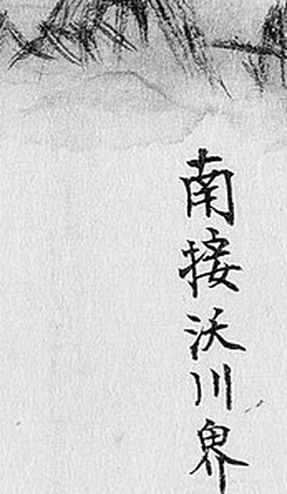
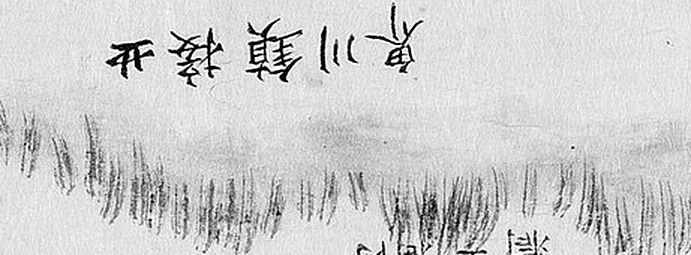
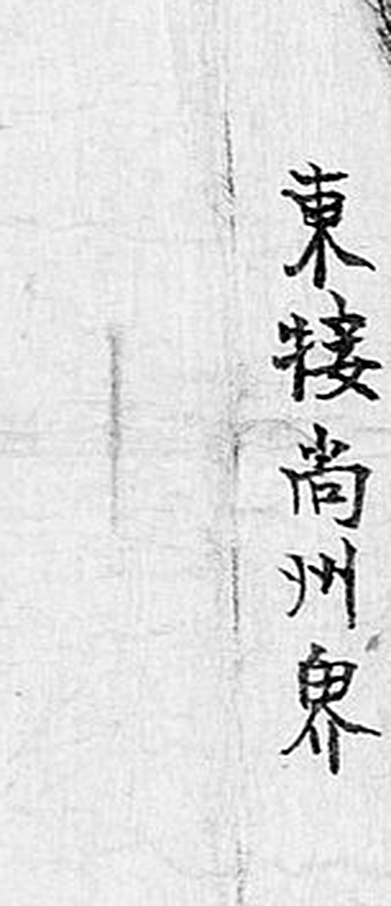
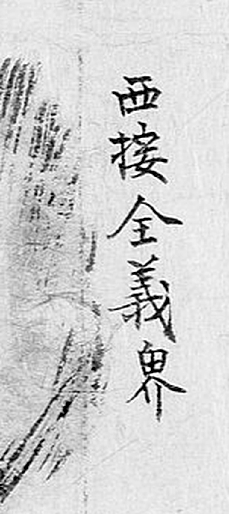
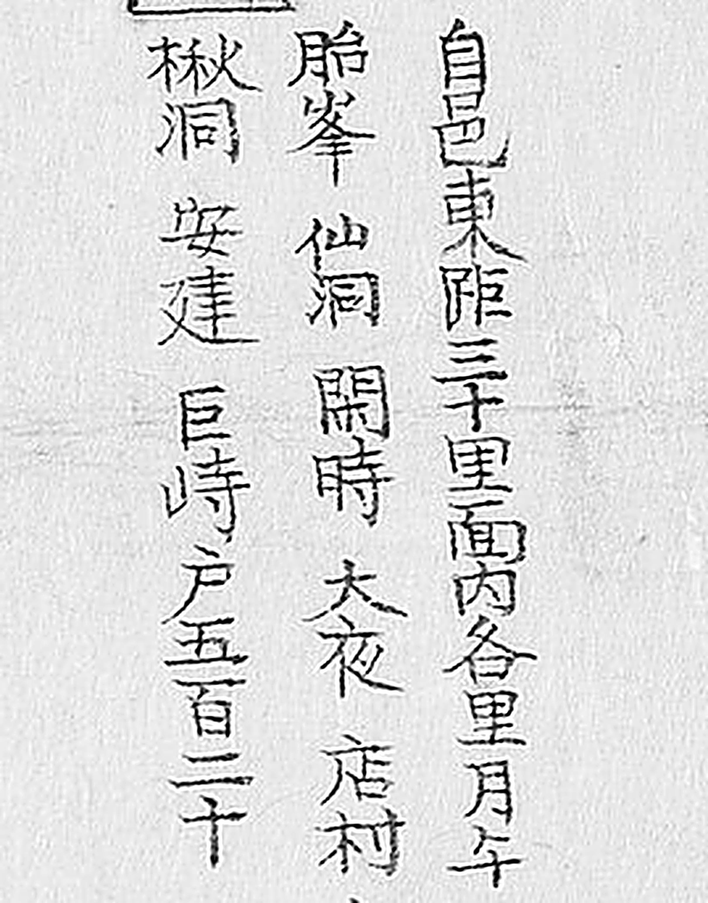
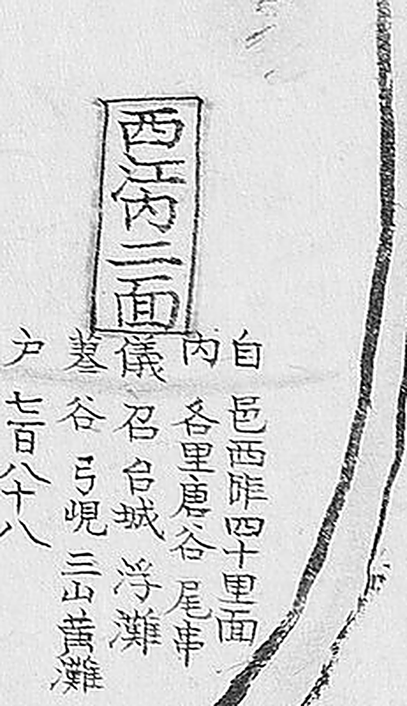
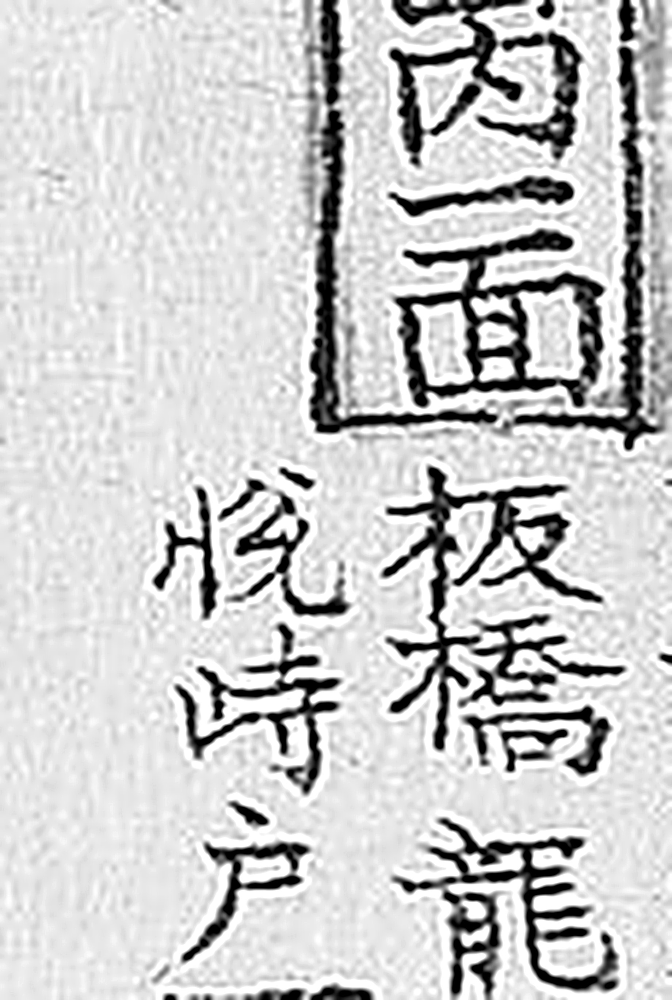
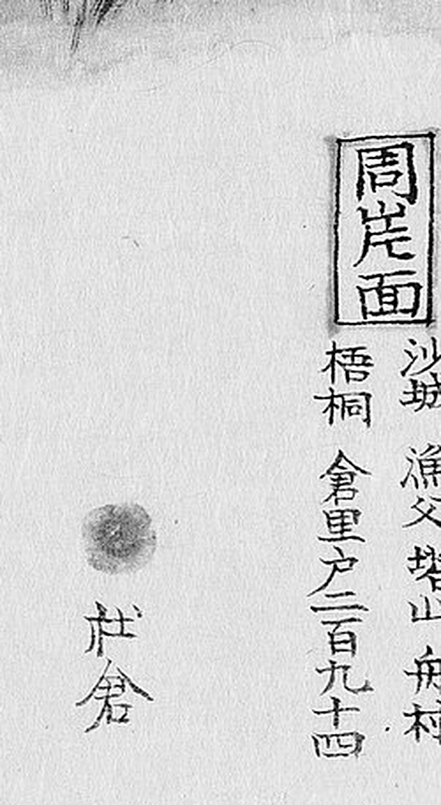

# 1872년 「충청도 청주목지도」 판독

《1872년 지방지도》 「충청도 청주목지도」(서울대학교 규장각한국학연구원 소장).
**청주는 회덕(대전)의 북동쪽**이고 **직접 닿지 않습니다** — 문의를 사이에 둡니다.

해동지도 계열은 [`해동지도-청주목-판독.md`](해동지도-청주목-판독.md), 기록은
[`대전-고개-대조표.md`](대전-고개-대조표.md) 12.7.3.

## 도엽

| | |
|---|---|
| 자료번호 | `KYKH002_0000_0028` |
| 원문 | [커먼즈 파일](https://commons.wikimedia.org/wiki/File:KYKH002_0000_0028_%EC%B6%A9%EC%B2%AD%EB%8F%84_%EC%B2%AD%EC%A3%BC%EB%AA%A9%EC%A7%80%EB%8F%84.jpg) |
| 크기 | 3,840 × 5,712 px (커먼즈 축소본으로 판독) |
| 훑은 범위 | 전면 (2026-09-30) — 대전 쪽 가장자리 중심 · **2차: 네 변 주기 확대 확인과 남쪽(대전 쪽) 띠 재훑기** (2026-10-01) |

## 방위 — **위=南**, 네 변이 스스로 알려 줍니다

| 변 | 글귀 | 확신 | 크롭 |
|---|---|---|---|
| 위 | **`南接沃川界`** | **상** |  |
| 아래 | `北接鎭川界` | 중상 |  |
| 왼쪽 | **`東接尙州界`** | **상** |  |
| 오른쪽 | **`西接全義界`** | **상** |  |

**2026-10-01 에 넷을 5~6배로 확대해 확인했습니다.** `西接全義界` 의 〔?〕 를 뗍니다 —
`全`·`義` 두 글자가 또렷합니다. 아래 변 `北接鎭川界` 만 획이 성겨 확신 `중상` 입니다.

**위=南 · 아래=北 · 왼쪽=東 · 오른쪽=西** — 표준의 180° 뒤집힘입니다.

**방위 근거가 가장자리 글귀 자체에 있습니다.** 네 변에 `南接…`·`北接…`·`東接…`·`西接…`
를 적어 두어 **방위와 접경을 한 줄로** 알려 줍니다. 이 조사에서 본 도엽 가운데 **가장
친절한 방식**입니다 — 다른 도엽은 방위 대자를 찾거나 면 배치를 맞춰 봐야 했습니다.

## `懷德` 이 없습니다

대전 쪽(위=남) 가장자리가 **`沃川界`** 이고, 회덕은 문의를 사이에 두고 더 남쪽입니다.
**해동지도 청주목(11.6.3)과 같은 결론**입니다.

## 고개 — 그림 라벨로는 없고, **리 이름에 하나 있습니다** (2026-10-01 2차)

도엽은 **면 이름과 주기, 사창, 제언(堰), 산줄기, 붉은 도로**로 이루어집니다.
**그림 라벨에는 `峙`·`峴`·`嶺` 이 없습니다.**

**다만 면 주기의 리 목록에는 있습니다.**

| 위치 | 표기 | 어디에 | 확신 | 판독자 | 날짜 | 크롭 |
|---|---|---|---|---|---|---|
| **(0.64, 0.28)** | **`德峴`** | **`南二面` 리 목록** | **상** | Claude | 2026-10-01 |  |
| **(0.22, 0.35)** | **`巨峙`** | **`山內二面` 리 목록** | **상** | Claude | 2026-10-01 |  |
| **(0.84, 0.42)** | **`弓峴`** | **`西內二面` 리 목록** | **상** | Claude | 2026-10-01 |  |
| **(0.23, 0.55)** | **`悅峙`** | **`山內一面` 리 목록** | **상** | Claude | 2026-10-01 |  |

**`德`(彳+悳)·`峴`(山+見) 두 글자가 또렷합니다.** 2026-10-01 에 옥천·연기·회인에서
드러난 것과 같은 꼴입니다 — **1872년 계열은 고개를 그림에 그리지 않고 리 이름 속에
남깁니다.** 「고개가 없다」를 그림만 보고 적으면 안 되는 까닭입니다.

### `時` 와 `峙` 가 **같은 도엽 이웃 칸에** 있습니다 — 더없이 좋은 자[尺]

`山內二面` 의 리 목록에서 **`開時` 와 `巨峙` 가 두 칸 건너 나란히** 적혀 있습니다.
**같은 도엽 · 같은 손 · 같은 크기**라, 2장이 말하는 자[尺]로 이보다 나은 것이 없습니다.

| | 왼쪽 변 |
|---|---|
| **`時`**(`開時`) | **`日`** — 닫힌 네모 안에 가로획 |
| **`峙`**(`巨峙`) | **`山`** — 가운데 세로획에 양옆 세로획 |

이 자로 `山內一面` 의 **`悅峙`** 도 가렸습니다. 썸네일에서는 `悅時` 로 보였는데
22배로 키우니 왼쪽 변이 `日` 이 아니라 `山` 이었습니다.

> **이 도엽에서 `時` 로 끝나는 리 이름과 `峙` 로 끝나는 리 이름이 **함께** 있습니다.**
> 그러므로 `-치` 로 들린다고 다 `峙` 가 아니고, `時` 라고 다 고개가 아닌 것도 아닙니다
> — **글자를 보고 가려야 합니다.**

**그래도 대조표 4.3(「고개가 없다」 목록)에는 올리지 않습니다.** 큰 고을이라
**면 주기를 아직 다 읽지 못했습니다.** 2026-10-01 에 읽은 것은
**남쪽(대전 쪽) 네 면 + 아래 여덟 면**입니다.

## 면 주기의 서식 — `自邑○距○里` (2026-10-01)



면마다 네모 라벨 곁에 주기가 붙고 **꼴이 일정합니다.**

```
<면 이름>
自邑<방위>距<거리>里 面內各里
<리 이름 …>
戶 <호수>
```

**다른 고을은 `自官門…`, 청주는 `自邑…` 입니다.** 목(牧)이라 쓰임이 다른 듯하나
단정하지 않습니다.

| 면 | 거리 | 리 이름(읽은 만큼) | 호수 |
|---|---|---|---|
| `周岸面` | `自邑南距七十里` | `沙城` `漁父` `塔山` `舟村` `梧桐` `倉里` | 二百九十四 |
| `南二面` | `自邑南距二十里` | `今須` `駕馬` `芦川` `岊`〔?〕 **`德峴`** `立岩` `長城` | 四百八十二 |
| `南一面` | `自邑南距二十里` | `鵲岩` `平村` `孝村` `方井` `熊川` `白雲` `上赤` `下赤` | 二千一百八十… |
| `南次二面` | 〔미판독〕 | `石隅` `農幕` … | 五百… |
| `山內二面` | `自邑東距三十里` | `月午` `胎峯` `仙洞` `開時` `大夜` `店村` `楸洞` `安建` **`巨峙`** | 五百二十 |
| `山內一面` | `自邑東距四十里` | `板橋` `龍洞` `墨防` `雲谷` **`悅峙`** | 一千一百八十六 |
| `山內一上面`〔?〕 | `自邑東距二十里` | `錦解` `寬洞` `鋼峯` `塗田` `梨亭` `浩山` `文博` `琅城` … | 七百五… |
| `西內二面` | `自邑西距四十里` | `唐谷` `尾車` `儀召`〔?〕 `白城` `浮灘` `姜谷` **`弓峴`** `三山` `黃灘` | 七百八十八 |
| `西州內面` | `自邑西距十里` | `內水` `果商`〔?〕 `蓮塘` `雲泉` | 三百二十七 |
| `南州內面` | `自邑南距十里` | `元興` `利州`〔?〕 `輦淸` `米坪` `氷洞` | 四百五十 |
| `東州內面` | `自邑東距十里` | `永雲` `龍岩` `金川` `有亭` `新村` `龜岩` | 四百九十 |
| `青川面` | `自邑東距六十里` | `滿月` `谷仙` `遊雲` `橋歸`〔?〕 … | 一千三百二十三 |

**`南次二面` 은 2026-09-30 에 적지 못한 면 이름입니다.**

> **`周岸面` 이 `自邑南距七十里`** 입니다 — 청주 읍치에서 남쪽 70리면 옥천·회인
> 언저리입니다. 청주목이 얼마나 큰 고을이었는지가 이 한 줄에 보입니다.

## 그 밖에 읽은 것

면 이름을 네모 라벨에 넣고 그 곁에 주기를 붙입니다 — `南一面` · `南二面` · `南三面` ·
`南江內面` · `東州內面` · `西州內面` · `西江內面` · `西江外面` · `西江外二面` ·
`北州內面` · `北江內面` · `北江外面` · `北江外二面` · `德平面` · `修身面` ·
`山內一面` · `山內二面` · `山外一面` · `山外二面` · `周岸面` · `靑川面` · `南次面` 등
스물 남짓.

산·절 — `獨林山` · `獨林寺` · `華陽` · `松面`〔?〕.
**사창과 제언(堰)이 면마다 그려져 있습니다** — 청주는 조선에서 손꼽히는 큰 고을입니다.

## 남은 것

- 전면 훑기 — 2026-10-01 에 **남쪽(대전 쪽) 띠만** 2차로 읽었습니다
- **면 주기 전수** — 스물 남짓입니다. **리 이름에 고개 글자가 더 있을 것**입니다
  (`德峴` 이 그 증거입니다)
- `南二面` 리 목록의 `岊`〔?〕
- 대전 조사에 바로 쓰이는 것은 **`南接沃川界`** 와 `德峴` 정도이므로 우선순위는 낮습니다

## 변경 이력

| 날짜 | 내용 |
|---|---|
| 2026-09-30 | **문서 개설 · 훑기.** 방위 **위=南**(네 변 글귀로 확정), **`懷德` 없음**(사이에 문의), 고개 표기 미발견, 면 스물 남짓 |
| 2026-10-01 | **2차 — 네 변 주기를 확대해 크롭으로 박았습니다.** 이 문서에 크롭이 하나도 없던 것을 고쳤습니다. `西接全義界` 의 〔?〕 를 뗍니다 |
| 2026-10-01 | **`德峴` 을 찾았습니다**(0.64, 0.28) — 그림 라벨이 아니라 **`南二面` 리 목록** 안입니다. 「고개 표기 없음」을 **「그림에는 없고 리 이름에는 있다」**로 고칩니다 |
| 2026-10-01 | 면 주기의 서식(`自邑○距○里 面內各里 … 戶○○`)과 남쪽 네 면의 리 목록을 채록. **`南次二面`** 은 새 면 이름입니다 |
| 2026-10-01 | **면 주기 여덟을 더 읽어 고개가 셋 더 나왔습니다** — **`巨峙`**(`山內二面`) · **`弓峴`**(`西內二面`) · **`悅峙`**(`山內一面`). 이 도엽의 고개 표기는 넷이 됐고, **모두 그림 라벨이 아니라 리 목록 안**입니다 |
| 2026-10-01 | **`時` 와 `峙` 가 같은 도엽 이웃 칸에 있습니다**(`開時`·`巨峙`, `山內二面`). 2장이 말하는 자[尺]로 이보다 나은 것이 없습니다. 이 자로 `悅峙` 를 가렸습니다 — 썸네일에서는 `悅時` 로 보였습니다 |
