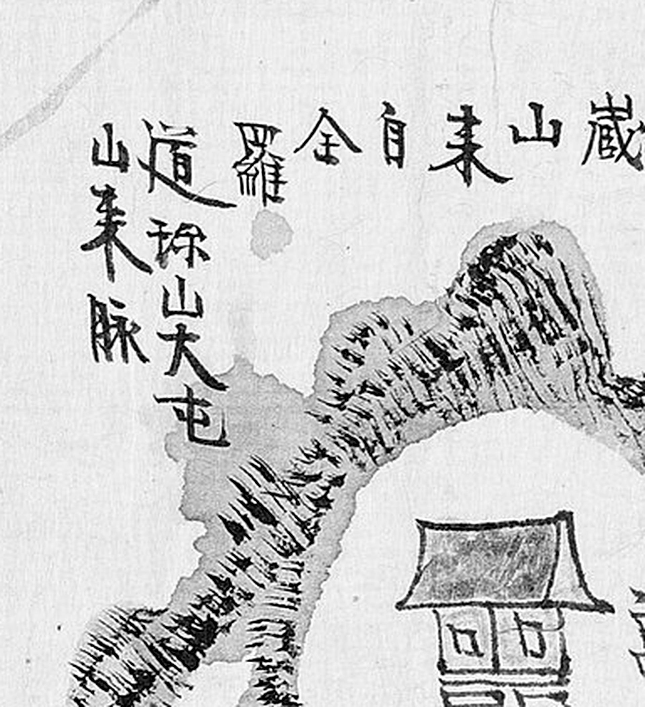
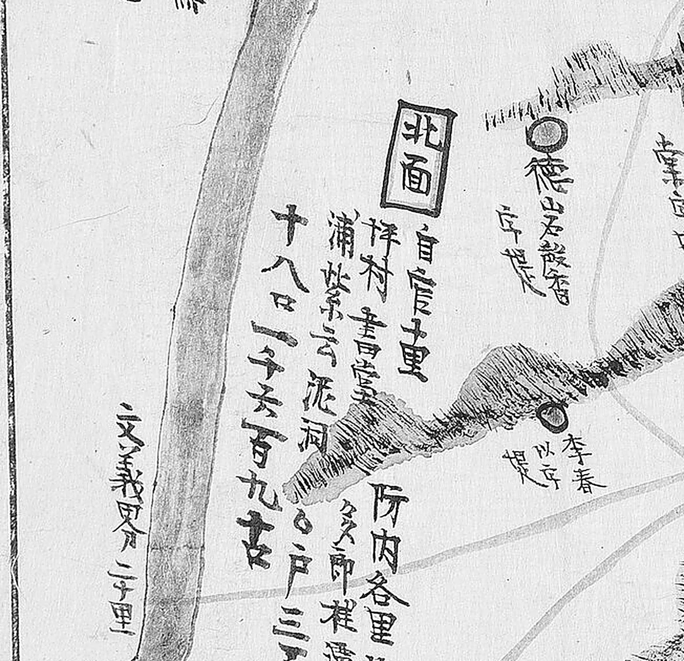
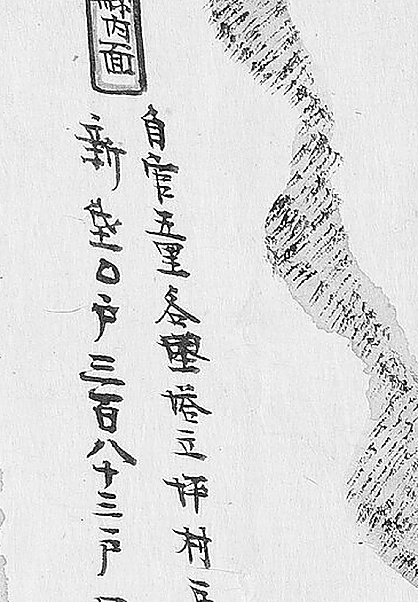

# 1872년 「충청도 회덕현지도」 판독

《1872년 지방지도》 「충청도 회덕현지도」(서울대학교 규장각한국학연구원 소장)를
전문 채록한 결과입니다. **회덕현은 대전의 본체입니다** — 지금 대덕구와 동구 북부가
이 도엽 한 장에 들어 있습니다.

기록 방식은 [`판독-기록-형식.md`](판독-기록-형식.md) 을 따릅니다. 도엽 목록은
[`고지도-목록.md`](고지도-목록.md), 고개 쟁점은 [`대전-고개-대조표.md`](대전-고개-대조표.md) 에 있습니다.

## 도엽

| | |
|---|---|
| 자료번호 | `KYKH002_0000_0046` |
| 원문 | [커먼즈 파일](https://commons.wikimedia.org/wiki/File:KYKH002_0000_0046_%EC%B6%A9%EC%B2%AD%EB%8F%84_%ED%9A%8C%EB%8D%95%ED%98%84%EC%A7%80%EB%8F%84.jpg) |
| 크기 | 7,564 × 10,353 px · 300 dpi · 78.3 MP |
| 판독 결과 공개 | 위키문헌 [회덕현지도](https://ko.wikisource.org/wiki/%ED%9A%8C%EB%8D%95%ED%98%84%EC%A7%80%EB%8F%84) |

**이 파일이 실질적 최대 해상도입니다.** Canon EOS 5DS R 로 촬영한 규장각 스캔본이고,
300 dpi 로 78 MP 입니다. **그래도 안 읽히는 글자는 해상도 문제가 아니라 원본의 마모입니다.**

### 방위 — 위쪽이 東

**이 도엽은 위쪽이 대체로 동(東)입니다.** 위=동, 아래=서, 왼쪽=북, 오른쪽=남.
도엽 증거와 맞습니다 — `沃川界`(동남)가 오른쪽 위, `新灘市`(신탄진, 북)가 왼쪽,
`文義界`(북서)가 왼쪽 아래, `公州界`(남서)가 오른쪽, `鷄足山`(읍치 동 3리)이 상단부.

**아래 가장자리의 주기는 상하가 반전(남향)되어 있습니다.** 그 자리를 자를 때는
180° 돌려 읽어야 합니다 — 숭현사·영귀루·금운정이 그렇습니다.

## 도엽 기문 — 확정 원문

```
縣本百濟雨述【一云朽淺】、新羅改比豊、高麗今名懷德。顯宗屬于公州、明宗二年置監務。
本朝太宗大王十三年改爲縣監。官員縣監·訓導各一人【訓導今無】。
上營·巡營·右營·中營在公州、西距七十里。兵營北距七十里。水營西距二百三十里。統營六百六十里。
鷄足山。食藏山【自來全羅道珎山大芚山來脈】。甲川【源出珎山下流】。
烽臺【自官東距三里。東應沃川環山峯燧三十里來應、北應文義夜味山峯燧四十里去應】。
沃川界二十里。文義界二十里。公州界十五里。
```

### 짚어 둘 것 넷

1. **`珎山` 은 진산(珍山)입니다.** `珎` 는 `珍` 의 이체자입니다. 판독 과정에서 두 번
   흔들렸으나 자형이 명확합니다.
2. **회덕 사람들은 갑천이 진산에서 온다고 적었습니다** — `甲川【源出珎山下流】`.
   실제로 진산에서 오는 것은 유등천이므로 **유등천과 갑천을 구별하지 않은 인식**입니다.
   대전 하천 인식사에서 값이 있는 한 줄입니다.
3. **`來應` 과 `去應` 이 짝을 이룹니다.** 봉수 주기의 `來應`(와서 응함, 남/동에서 받음)과
   `去應`(가서 응함, 북으로 보냄)이 신호의 방향을 가립니다. 계족산 봉수는
   **옥천 환산에서 받아 문의 야미산으로 보냅니다.** `來` 는 `未` 로도 보이나
   가로획이 하나 더 있어 `來` 의 이체자입니다.
4. **`夜味山`(야미산)** 은 문의 쪽 봉수산으로, 소이산(所伊山)과 같은 산으로 파악됩니다.
   《회덕현읍지》(1786, 奎17375)에도 「北應文義縣夜味山烽燧四十里」 로 나와 **회덕 쪽에서는
   야미산이라는 이름을 오래 썼음**을 보여 줍니다. 청주의 것대봉은 별개 봉수입니다.

## 건물 — 38건

가옥형(청기와 지붕+주황 몸체) 아이콘과 단(壇)·문(門) 구조물을 전수 조사했습니다.
**주황 원(里·시장·창고·店)과 파랑 원(제언 堤)은 건물이 아니므로 제외**했습니다.

좌표는 아이콘 중심 추정치이고, 원본 픽셀로 ±60~150 px 오차가 있습니다
(상대좌표로는 ±0.01~0.02).

### 읍치 성곽 밖 — 독립 건물 20건

| 위치 | 표기 | 읽기 | 확신 | 판독자 | 날짜 | 비고 |
|---|---|---|---|---|---|---|
| (0.31, 0.24) | 美湖祠 | 미호사 | 상 | 연구회·Claude | 2026-08~09 | 宋奎濂 배향. 1869년 훼철. 현 대덕구 미호동 |
| (0.26, 0.27) | 龍湖祠 | 용호사 | 상 | 연구회·Claude | 2026-08~09 | 姜鶴年·姜世龜 배향. 1869년 훼철. 현 대덕구 용호동 |
| (0.37, 0.33) | 鳳隱菴 | 봉은암 | 상 | 연구회·Claude | 2026-08~09 | 「自官東距三里 宋奎濂別業」. 가옥형이 아니라 주황 원형 표지 |
| (0.44, 0.35) | 霽月堂 | 제월당 | 상 | 연구회·Claude | 2026-08~09 | 「在內南面後谷里 自官東北距一里 文禧公宋奎濂建」 |
| (0.55, 0.33) | 同春堂 | 동춘당 | 상 | 연구회·Claude | 2026-08~09 | 「宋文正公浚吉」 |
| (0.58, 0.29) | 飛來菴 | 비래암 | 상 | 연구회·Claude | 2026-08~09 | 「在內南面 自官東距十里 宋文正公浚吉別業」 |
| (0.86, 0.26) | 高山寺 | 고산사 | 상 | 연구회·Claude | 2026-08~09 | 「在外南面 自官南距三十里」 |
| (0.74, 0.28) | 宗晦祠 | 종회사 | 상 | 연구회·Claude | 2026-08~09 | 「在外南面興農里 自官南距十里 宋時烈·權尙夏 … 令毁破」. 현 동구 가양동 우암사적공원 |
| (0.79, 0.35) | 靖節祠 | 정절사 | 중 | 연구회·Claude | 2026-08~09 | 朴彭年·宋愉·金慶餘 등 배향. 「令毁破」 |
| (0.72, 0.39) | 南澗亭 | 남간정 | 상 | 연구회·Claude | 2026-08~09 | 송시열 별업 |
| (0.82, 0.50) | 杞菊亭 | 기국정 | 상 | 연구회·Claude | 2026-08~09 | 「在外南面 自官南距十里 宋文正公時烈別業」. 원위치 = 외남면 소제리(현 동구 소제동) |
| (0.58, 0.53) | 雙淸堂 | 쌍청당 | 상 | 연구회·Claude | 2026-08~09 | 「在內南面宋村里 自官距五里」. 건립자 글자 불명(문헌상 宋愉) |
| (0.70, 0.55) | 錦雲亭 | 금운정 | 상 | 연구회·Claude | 2026-08~09 | 朴暹 별장. 주기는 상하 반전(남향) |
| (0.27, 0.47) | 鄕校 | 향교 | 상 | 연구회·Claude | 2026-08~09 | 「自官北距二里」. 담장+三門+본전 |
| (0.41, 0.67) | 홍살문 | — | 상 | 연구회·Claude | 2026-08~09 | 형태로 판단. 읍치 진입로 |
| (0.61, 0.74) | 挹灝亭 | 읍호정 | 상 | 연구회·Claude | 2026-08~09 | 「在內南面大禾里 自官西距三里 宋爾昌別業」. 大禾里=현 대덕구 대화동 |
| (0.28, 0.70) | 社稷壇 | 사직단 | 상 | 연구회·Claude | 2026-08~09 | 기둥이 드러난 소형 단(壇) |
| (0.53, 0.88) | 崇賢祠 | 숭현사 | 상 | 연구회·Claude | 2026-08~09 | 「萬曆己酉建 賜額 … 鄭光弼·金淨·宋麟壽·金長生·宋浚吉·宋時烈 … 令毁破」 |
| (0.52, 0.85) | 詠敀樓 | 영귀루 | 상 | 연구회·Claude | 2026-08~09 | 숭현사 문루. 敀 = 歸의 약자(표준자 詠歸樓) |
| (0.39, 0.24) | 烽臺 | 봉대 | 상 | 연구회·Claude | 2026-08~09 | 계족산 봉수. 아래 주기 풀이 참조 |

### 읍치 관아 구역 — 약 19채

성곽·내성 이중 구획 안입니다. 상대좌표로 **x 0.34–0.47, y 0.41–0.62** 범위.

| 위치 | 표기 | 읽기 | 확신 | 판독자 | 날짜 |
|---|---|---|---|---|---|
| (0.41, 0.48) | 內衙 | 내아 | 상 | 연구회·Claude | 2026-08~09 |
| (0.38, 0.47) | 冊房 | 책방 | 상 | 연구회·Claude | 2026-08~09 |
| (0.40, 0.52) | 東軒 | 동헌 | 상 | 연구회·Claude | 2026-08~09 |
| (0.44, 0.49) | 官廳 | 관청 | 상 | 연구회·Claude | 2026-08~09 |
| (0.37, 0.56) | 蓮亭·蓮潭 | 연정·연담 | 상 | 연구회·Claude | 2026-08~09 |
| (0.39, 0.57) | 使令廳 | 사령청 | 상 | 연구회·Claude | 2026-08~09 |
| (0.38, 0.60) | 作廳 | 작청 | 상 | 연구회·Claude | 2026-08~09 |
| (0.43, 0.57) | 刑廳 | 형청 | 상 | 연구회·Claude | 2026-08~09 |
| (0.40, 0.61) | 客舍 | 객사 | 상 | 연구회·Claude | 2026-08~09 |
| (0.40, 0.62) | 軍器庫 | 군기고 | 상 | 연구회·Claude | 2026-08~09 |
| (0.37, 0.61) | 鄕廳 | 향청 | 중 | 연구회·Claude | 2026-08~09 |
| (0.40, 0.61) | 縣司 | 현사 | 중 | 연구회·Claude | 2026-08~09 |
| (0.46, 0.61) | □□ | 대청(座起所?) | 하 | 연구회·Claude | 2026-08~09 |
| 성곽 축선 | 外三門·中門·三門 | 문루 셋 | 상 | 연구회·Claude | 2026-08~09 |
| 구역 내 | □ | **미판독 소옥 3~4채** | — | — | — |

### 집계

| | 건수 |
|---|---|
| 독립 표기 | 20 (문·단 포함) |
| 관아 구역 | 약 19 |
| **합계** | **약 38** |
| 라벨 판독(상) | 30 |
| 부분·추정(중/하) | 4 |
| 미판독 | 3~4 (관아 소옥) |

이 가운데 **봉은암과 봉대는 가옥형 아이콘이 아닙니다**(봉은암=주황 원형, 봉대=봉수 표지).
실제 가옥형은 약 36채입니다.

## 고개 — **`吉峙` 하나** (2026-10-01 전면 훑기)

> 2026-09-03 에 「고개는 나오지 않았습니다」라고 적었습니다. 그때는 **남부만** 훑은
> 상태였고, 같은 날 대조표 12.1 에 `吉峙` 가 올라갔습니다. 이 문서에도 싣습니다.

| 위치 | 표기 | 읽기 | 확신 | 판독자 | 날짜 |
|---|---|---|---|---|---|
| **(0.694, 0.253)** | **`吉峙`** | 길치 = **질티·질현** | **상** | 연구회 2026-09-03 · Claude 2026-10-01 재확인 |  |


세로로 `吉`(士+口) 위, `峙`(山+寺) 아래. **`峙` 의 `山` 부수가 왼쪽에 또렷합니다** —
2026-10-01 에 연기현에서 세운 검사를 통과했습니다(대조표 11.6.5).
**주황색 길이 이 고개를 지납니다.** 자리는 `東面` 안이고, 동면 리 목록에 `細川`(세천)이
있습니다.

**2026-10-01 에 3,840 px 사본으로 도엽 전면을 아홉 조각으로 훑었습니다.**
`峙`·`峴`·`嶺` 은 **`吉峙` 하나뿐**입니다.

## 주기(註記)가 흩어져 있습니다 — 찾는 자리

위의 「도엽 기문」은 **한 덩어리가 아닙니다.** 연혁·관원·영(營) 거리는 왼쪽 위 글상자에
있고, **산천과 봉대 주기는 지도 본문의 해당 그림 옆에** 흩어져 있습니다.
찾기 쉽도록 자리를 적어 둡니다.

| 주기 | 자리 | 비고 |
|---|---|---|
| 연혁·관원·영 거리 | (0.10–0.20, 0.10–0.30) | 왼쪽 위 글상자 |
| `食藏山【自來全羅道珎山大芚山來脈】` | (0.79–0.89, 0.19–0.27) | 식장산 그림 옆 |
| `甲川【源出珎山下流】` | (0.88–0.93, 0.66–0.76) | 갑천 물줄기 옆, 비스듬히 |
| `烽臺【自官東距三里…】` | (0.37–0.42, 0.24–0.27) | 봉수대 그림 옆 |
| 사지 세 값 | 네 가장자리 | `沃川界二十里`(오른쪽 위) 등 |



*`食藏山【自來全羅道珎山大芚山來脈】` — 식장산 그림 바로 옆입니다.
`珎`(진산)과 `大芚山`(대둔산)이 또렷합니다.*

## `鷄足山` 과 `烽臺` — **그림으로도 있습니다**


봉수대가 **납작한 봉우리 위에 탑 모양으로 그려져 있고**, 그 위에 세로로 **`烽臺`**,
오른쪽에 우횡서로 **`鷄足山`** 이 적혀 있습니다. 지금까지 이 봉수는 **주기로만**
기록돼 있었는데, **그림으로도 확인됐습니다.**

| | |
|---|---|
| 위치 | `烽臺` (0.408, 0.250) · `鷄足山` (0.456, 0.274) |
| 글자 | **`鷄`(奚+**鳥**)** — 해동지도 회덕현의 `雞`(奚+隹)와 갈립니다(대조표 2장) |
| 용어 | **`烽臺`** — 1872년 옥천군지도도 `環山烽臺`·`月伊峯烽臺` 로 적습니다. **1872년 계열의 표준 표기**이고, 주기 안에서 남의 고을 것을 가리킬 때만 `烽燧` 를 씁니다 |

**이로써 봉수 노선 다섯 고리의 회덕 자리가 그림·주기 양쪽으로 섰습니다**(대조표 13.3).

## 면별 주기 — **리 이름이 다 적혀 있습니다**

면마다 주황색 패와 함께 주기가 붙어 있고, **그 면에 딸린 리 이름을 모두 적고 호구까지**
달았습니다. **1872년 옥천군지도와 같은 꼴**입니다(대조표 12.4).

### `東面`


```
東面
自官東距二十里 各里 古堯〔?〕 官洞 楊川 新塩 三巨里 細川 細谷
○ 戶 三百七十 口 二千六百六十九
```

**`細川`(세천)이 있습니다** — 지금 동구 세천동이고, `吉峙` 가 이 면 안에 있습니다.
`楊川` 은 도엽 위쪽 `楊川市`(장날 4·9일)와 같은 이름입니다.

### `外南面`


```
外南面
自官南距三十里 各里 龍田 □道 右南 加陽 覆堤 大東 眞農
尾吉 龍防 楮田 井浦 泉洞
大別 ○ 戶 四百八十九 口 二千三百二十
```

`加陽`(가양) · `龍田`(용전) · `大東`(대동)은 지금 **동구의 동 이름으로 이어집니다.**

> **이 주기들이 지명 조사의 본 광맥입니다.** 한 장에 회덕(대전 북부·동부)의 리 이름이
> 면별로 수십 건 적혀 있고, 관문에서의 거리와 호구가 붙어 있습니다.
> **면 일곱의 주기를 모두 전사하는 것을 남은 일로 세웁니다.**

### `北面` (2026-10-01, 일부)



```
北面
自官〔?〕十里 所內各里 …
梓村 書堂 … 
… 浦 紫雲 泥洞 …
… 十八 ○ 戶 三… 口 一千五百九十六〔?〕
```

**읽힌 리 이름** — `梓村` · `書堂` · `紫雲` · `泥洞` · `○浦`.
**`峙`·`峴`·`嶺` 은 한 자도 없습니다.**

### `縣內面` (2026-10-01, 일부)



```
縣內面
自官五里 各里 塔立 坪村 …
新垈 ○ 戶 三百八十三 口 …
```

**읽힌 리 이름** — `塔立` · `坪村` · `新垈`.
**`峙`·`峴`·`嶺` 은 한 자도 없습니다.**

### 남은 면은 **사본 해상도에 막혔습니다**

도엽 아래쪽(위=東이므로 **서쪽**)에 있는 면 주기들은 **180° 돌려 적혀 있고 획이
가늘어**, 커먼즈 사본(3,840 px)으로는 글자가 뭉개집니다. `內南面` 패는 찾았으나
리 목록을 읽지 못했습니다.

> **1872년 공주목지도와 같은 벽입니다.** 2026-10-01 에 **규장각 원본을 받는 길**을
> 찾아 [`고지도-받는-법.md`](고지도-받는-법.md) 에 적어 두었으니, 이 도엽도 같은 길로
> 받아 다시 열면 됩니다. 이 도엽의 규장각 파일 이름은 **`KYKH002_0000_0046.jpg`**
> 입니다(커먼즈 이름과 같습니다).

## 판독이 뒤집힌 이력 — 읽는 사람이 알아야 할 것

**이 도엽에서 판독은 열 번 넘게 뒤집혔습니다.** 어느 종류의 오류가 반복되는지
남겨 둡니다. 다른 도엽에서도 같은 함정이 나옵니다.

| 처음 읽은 것 | 고친 것 | 무엇이 문제였나 |
|---|---|---|
| 統營 260리 | **統營 660리** | 숫자 자형을 같은 면의 다른 `六` 과 맞춰 보지 않았음 |
| 左營·距京 | **上營·巡營·右營·中營**, 水營西距二百三十里 | 영(營) 이름을 통째로 잘못 봄 |
| 東面 口 2,629 | **2,669** | 십의 자리를 바로 위 `六百` 의 `六` 과 대조해 확정 |
| 위쪽이 北 | **위쪽이 東** | 방위를 확인하지 않고 통례로 가정 |
| 봉은암 ↔ 제월당 | 좌표 맞바꿈 | 아이콘과 라벨의 짝을 확대 없이 배정 |
| 미호사 ↔ 용호사 | 좌표 맞바꿈 | "미호동이 더 북쪽"이라는 **추론으로** 배정 |
| 학운정 | **錦雲亭(금운정)** | 첫 글자 오독 |
| 정려각(추정) | **挹灝亭(읍호정)** | 형태만 보고 이름을 추정 |
| 숭현서원 | **崇賢祠** | 편액을 문헌 통칭으로 대신함 |
| 永敏樓 | **詠敀樓(영귀루)** | `敀` 가 `歸` 의 약자임을 몰랐음. 숭현사와 좌표도 뒤바뀜 |
| 珍山 → 아님 → **珎山** | 珎山 | 이체자를 두고 두 번 흔들림 |
| 未應 | **來應** | 가로획 하나를 놓침 |
| □□□川 | **三巨里店** | 상하 반전을 못 알아채고 `店` 을 `川` 으로 봄 |
| 것대봉 = 야미산 | **것대봉은 별개 봉수** | 서로 다른 봉수를 같은 것으로 봄 |

**교훈 셋.**

1. **같은 글자를 같은 도엽 다른 곳에서 찾아 맞춥니다.** 숫자와 이체자는 이 방법만 듣습니다.
2. **자형보다 추론을 앞세우면 틀립니다.** "미호동이 북쪽이니까" 같은 지리 추론으로
   라벨을 배정한 것이 실제로 뒤집혔습니다.
3. **아이콘과 라벨의 짝은 반드시 확대해서 확인합니다.** 좌표 맞바꿈이 세 번 났습니다.

## 남은 미판독

- **東面 주기는 확정됐습니다**(2026-09-03) — `自官東距二里 各里 古芚·宜洞·楊川·新垡·三巨里·細川·細谷…
  戶三百七十 口二千六百六十九`. `三巨里` 가 리 목록에 있어 `三巨里店` 과 맞물립니다
- **東面에 `吉峙`(질티)가 있습니다** — (0.70, 0.26). 붉은 도로가 고갯마루를 넘습니다.
  표기가 도엽마다 달라 `吉`/`質`/`迭` 셋입니다([대전-고개-대조표 6.5](대전-고개-대조표.md))
- 北面 호수(戶數) 끝자리
- `三政里`·`興農里`·`二川橋` 는 확정. **`二川橋` 의 가운데 글자는 재확인 대상**
  — '삼천교'라는 지명의 존재는 확인되지 않았습니다
- 西面·근북면·일도면의 里 전수
- 관아 구역 소옥 3~4채
- ~~도엽 동남 (0.79, 0.13) 의 `□□□川`~~ → **`三巨里店`(삼거리점)으로 확정**(2026-09-03).
  상하 반전으로 적혀 있어 `店` 을 `川` 으로 읽었던 것입니다
  ([`crops/KYKH002_0000_0046_x0.79_y0.13_w0.06_h0.02.jpg`](crops/KYKH002_0000_0046_x0.79_y0.13_w0.06_h0.02.jpg))

## 변경 이력

| 날짜 | 내용 |
|---|---|
| 2026-09-02 | 문서 개설. 회덕현지도 전문 채록 결과(기문 확정 원문·건물 38건·판독 뒤집힌 이력)를 저장소 형식으로 옮김. 건물 좌표를 좌하원점 픽셀에서 상대좌표로 변환 |
| 2026-09-03 | (0.79, 0.13) 을 `三巨里店` 으로 확정. 남쪽 주기의 상하 반전을 놓친 사례를 뒤집힌 이력에 추가 |
| 2026-10-01 | **3,840 px 사본으로 전면을 아홉 조각으로 훑었습니다.** ① **`吉峙`(0.694, 0.253) 재확인** — `峙` 의 `山` 부수 또렷, 길이 지남. 도엽 전면에 고개는 이것 하나 ② **`鷄足山`+`烽臺` 가 그림으로도 있습니다**(0.408·0.250 / 0.456·0.274) — 지금까지 주기로만 알던 봉수입니다. `鷄`(奚+鳥), 용어는 `烽臺`(1872년 계열 표준) ③ **면별 주기에 리 이름이 다 적혀 있음**을 확인 — `東面`·`外南面` 전사. 1872 옥천군지도와 같은 꼴입니다 ④ 「도엽 기문」이 한 덩어리가 아니라 **지도 본문에 흩어진 주기**임을 밝히고 자리를 표로 적음 |
| 2026-10-01 | **면 주기 둘을 더 읽었습니다** — `北面`(`梓村`·`書堂`·`紫雲`·`泥洞`)과 `縣內面`(`塔立`·`坪村`·`新垈`). **둘 다 `峙`·`峴`·`嶺` 이 한 자도 없습니다.** 남은 면들은 도엽 아래쪽 180° 띠에 있고 획이 가늘어 **3,840 px 사본으로는 안 읽힙니다** — 규장각 원본(`KYKH002_0000_0046.jpg`)을 받아 다시 열 일로 둡니다 |
