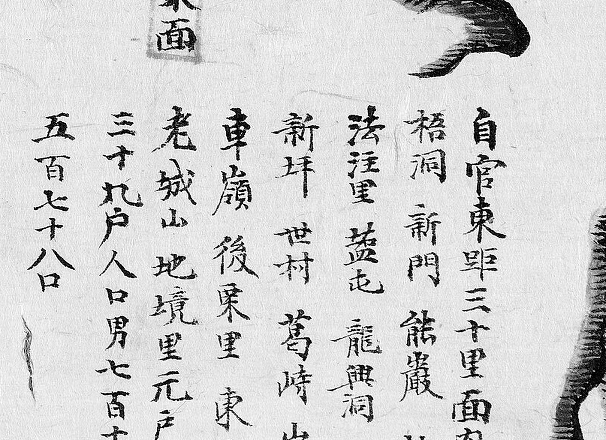
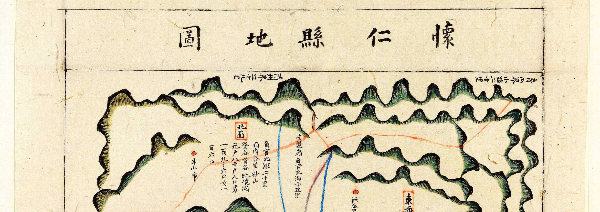

# 1872년 「충청도 회인현지도」 판독

《1872년 지방지도》 「충청도 회인현지도(懷仁縣地圖)」(서울대학교 규장각한국학연구원 소장).
**회인은 문의의 동쪽, 옥천의 북쪽**이고, 지금 보은군 회인면입니다.

**이 도엽은 2026-10-01 에 처음 찾았습니다.** 그때까지 이 조사의 1872년 계열에 회인이
빠져 있었습니다 — 해동지도 계열에는 있었는데도([`해동지도-회인현-판독.md`](해동지도-회인현-판독.md)).
기록은 [`대전-고개-대조표.md`](대전-고개-대조표.md) 12.7.5.

## 도엽

| | |
|---|---|
| 자료번호 | `KYKH002_0000_0021` |
| 원문 | [커먼즈 파일](https://commons.wikimedia.org/wiki/File:KYKH002_0000_0021_%EC%B6%A9%EC%B2%AD%EB%8F%84_%ED%9A%8C%EC%9D%B8%ED%98%84%EC%A7%80%EB%8F%84.jpg) |
| 제목 | **`懷仁縣地圖`** (도엽 위쪽, 우횡서) |
| 크기 | 3,840 × 6,184 px (커먼즈 썸네일로 판독) |
| 훑은 범위 | 가장자리 · 기문 · 면 주기 · 읍치 (2026-10-01) |
| 방위 | **위 = 北** (표준) |

**방위 근거** — 왼쪽 변에 **`文義界十六里`**, 오른쪽 변에 **`報恩界十六里`** 입니다.
문의는 회인의 **서쪽**, 보은은 **동쪽**이므로 **왼쪽=西·오른쪽=東**, 곧 위가 北 입니다.
해동지도 회인현(11.6.6)과 같습니다.

## 기문 — **회인이 한때 회덕의 겸임지였습니다**


도엽 오른쪽 아래, 전문입니다.

```
建置沿革
本百濟未谷縣
新羅改昧谷爲燕山郡領
高麗顯宗屬淸州
後爲懷德兼任官
辛禑時別置監務
本朝太宗十三年例改縣監
鎭管 淸州
距京三百五十里 · 距監營一百□里
```

> **`後爲懷德兼任官` — 「그 뒤 회덕이 겸임하는 관이 되었다」.**
>
> 이 한 줄이 대조표 4.2 의 묵은 물음 하나에 답합니다. **해동지도 회인현은
> `南距懷德界三十里` 로 회덕을 적는데 회덕현 도엽에는 회인이 없습니다**(11.6.6).
> 이것을 「사지는 네 방향 대표만 적으므로 일방 기록은 드물지 않다」로 설명해
> 두었는데, **회인 쪽에는 그 이상의 까닭이 있었습니다** — 한때 **회덕 수령이
> 회인을 겸임**했습니다. 회인에게 회덕은 각별한 이웃이었습니다.
>
> 거꾸로 말하면 **회덕 쪽에서 회인은 「내가 겸임하던 곳」**이므로, 회덕 도엽이
> 회인을 경계 고을로 적지 않은 것이 더 눈에 띕니다. 4.2 에 보탭니다.

`未谷`→`昧谷`→`燕山郡領`→`淸州 속현`→`懷德 겸임`→`監務`→`縣監` 의 차례가
한눈에 들어옵니다.

## 고개 — **`皮盤嶺` 에 거리가 붙어 있습니다**

| 위치 | 표기 | 주기 | 확신 | 판독자 | 날짜 |
|---|---|---|---|---|---|
| **(0.49, 0.25)** | **`皮盤嶺`** | **`自官北距十五里`** | **상** | Claude | 2026-10-01 |


세로로 `皮`·`盤`·`嶺`, 이어서 `自官北距十五里`. **고갯마루까지의 거리가 적힌 드문
예**입니다.

**세 자료가 모였습니다** — 해동지도 회인현(11.6.6, 0.61·0.28) · **이 도엽**(거리까지) ·
대동여지도 15-04(13.3, 0.89·0.71). 회인 북쪽 15리, **청주 가는 길**입니다.
대전 쪽이 아닙니다.

### 고개 글자가 든 리 — `車嶺` 이 두 계열에서 만납니다

`東面` 주기의 리 목록에 **`葛峙`·`車嶺`·`杜□`** 가 있습니다(아래).

**`車嶺` 은 2026-10-01 에 해동지도 회인현에서 찾은 고개(0.955, 0.49)와 같은 이름**이고,
둘 다 **동쪽 `報恩界` 가까이**입니다. 해동지도 쪽 확신을 `중`→**`상`** 으로 올립니다
(11.6.6). 다만 이 도엽에서는 **고개가 아니라 리 이름**으로 나옵니다 —
**고개가 마을 이름이 된 예**입니다.

## 면별 주기 — 리 이름과 호구

1872년 계열의 꼴 그대로입니다(12.1 회덕 · 12.4 옥천).

### `東面`



```
東面
自官東距三十里 面內各里
梧洞 新門 能巖 杜□
法注里 藍屯 龍興洞
新坪 世村 葛峙 山火□
車嶺 後果里 東□
老城山 地境里
元戶 三十九戶 人口 男七百□ 女五百七十八口
```

### `北面`

```
北面
自官北距二里 面內各里 杜山 登谷 骨谷 地境洞
元戶 八十七戶 口 一百九十六 男女 一百六口
```

`社倉 在新門 自官北距十里` 라는 주기도 따로 있습니다.

## 그 밖에 읽은 것

| 갈래 | 표기 |
|---|---|
| 가장자리 | **`文義界十六里`**(왼쪽) · **`報恩界十六里`**(오른쪽) · 위·아래 가장자리에 거리 주기 몇 |
| 읍치 | `鄕校` · `大成殿` · `明倫堂` · `東西祠`〔?〕 · 관아 건물 열몇 |
| 산 | `皮盤嶺` · `老城山` · `杜山` |
| 면 | `東面` · `北面` · 그 밖 둘~셋(아래쪽, 상하 반전) |



*위 가장자리 일대. 가운데에 `皮盤嶺`, 오른쪽에 `東面` 주기.*

## 아래(남) 가장자리 — 주기는 있는데 **초서라 못 읽습니다** (2026-10-01 2차)

도엽 아래 가장자리를 다시 훑었습니다. **경계 주기가 둘 있습니다.** 둘 다 **상하가
반전**되어 있고, 돌려 놓아도 **초서(草書)여서 3,840 px 축소본으로는 글자가 갈리지
않습니다.**

| 자리 | 지금까지 읽은 것 | 확신 | 크롭 |
|---|---|---|---|
| (0.41~0.49, 0.85) 아래 변 | `□□□□` **`界三十二里`** — 넷째 자리 앞이 `懷德`〔?〕 으로 보입니다 | **하** |  |
| (0.86~0.90, 0.75~0.80) 오른쪽 아래 | `東`〔?〕 … **`沃川界`**〔?〕 … `三十二里`〔?〕 | **하** |  |

**끝의 `界三十二里` 는 둘 다 꽤 또렷합니다.** 갈리지 않는 것은 **고을 이름 쪽**입니다.

> **같은 도엽 안에서 글씨체가 갈립니다.** 오른쪽 변의 **`報恩界十六里`** 는 또렷한
> 해서인데, 아래 변의 두 주기는 초서입니다. **가장자리 주기를 한 손이 쓴 것이
> 아닙니다.**
>
> 
>
> *오른쪽 변 `報恩界十六里` — 해서.*

**해동지도 회인현은 `南距懷德界三十里` 를 적습니다**(11.6.6). 1872년 쪽이
`三十二里` 라면 두 리 차이이고, **회인이 회덕을 적는 짝**(4.2)이 120년 뒤에도
이어지는 것이 됩니다. **다만 글자를 읽지 못했으므로 그렇게 적지 않습니다.**
**규장각 원본을 보실 수 있는 분의 판독을 기다립니다.**

## 남은 것

- **아래(남) 가장자리 주기의 고을 이름** — 위 참조. **대전 조사에 바로 걸립니다**
- 나머지 면(서·남·읍내) 주기 전문
- `東面` 리 목록의 `杜□`·`山火□`·`東□`
- 위 가장자리의 거리 주기 둘
- 규장각 원본 — 커먼즈 썸네일(3,840 px)로도 큰 글자는 읽히나 리 목록은 빠듯합니다

## 변경 이력

| 날짜 | 내용 |
|---|---|
| 2026-10-01 | **문서 개설.** 커먼즈 1872년 분류를 훑어 **빠져 있던 도엽**임을 확인하고 받았습니다. 방위 **위=北**, 기문 전문(**`後爲懷德兼任官`**), **`皮盤嶺 自官北距十五里`**, `東面`·`北面` 리 목록. `車嶺` 이 리 이름으로도 나와 해동지도 쪽 확신을 받칩니다 |
| 2026-10-01 | **2차 — 아래(남) 가장자리에 경계 주기가 둘 있습니다.** 끝의 `界三十二里` 는 읽히나 **고을 이름이 초서여서 갈리지 않습니다**(`懷德`〔?〕·`沃川`〔?〕). **같은 도엽 안에서 글씨체가 갈립니다** — 오른쪽 변 `報恩界十六里` 는 또렷한 해서입니다 |
