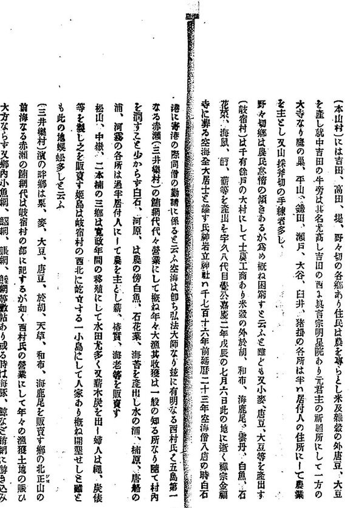
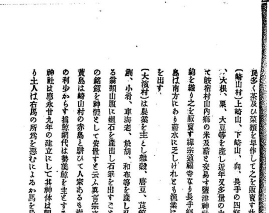
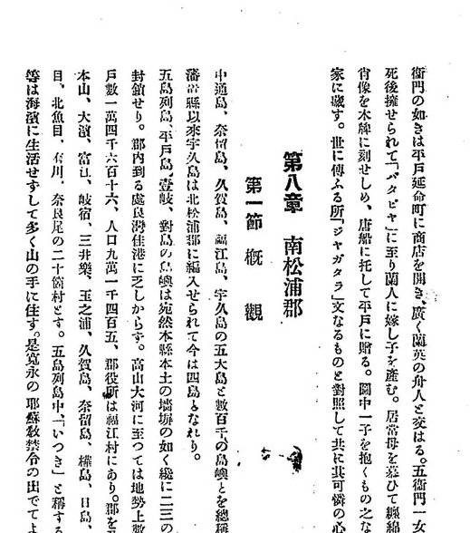
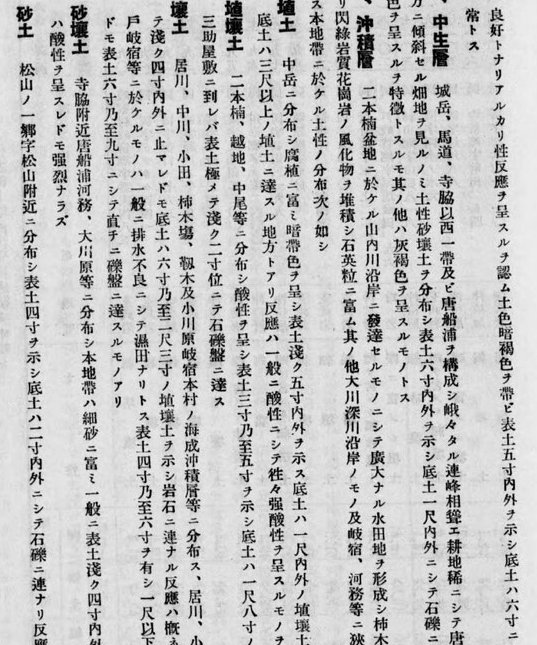
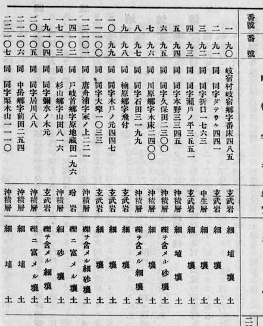

# 五島 岐宿의 中嶽·山内 — 메이지~쇼와 초기 문헌 채록

나가사키현 고토시 기시쿠초(五島市岐宿町)의 **中嶽(나카타케)** 와 **山内(야마우치)** 가
옛 간행물에 어떻게 적혀 있는지 모은 조사 메모입니다. **확정 자료가 아닙니다.** 판독은
저화질 스캔본을 눈으로 읽은 것이라 글자 하나하나에 오독이 있을 수 있습니다. 인용할 때는
아래 링크로 원본 쪽을 다시 보십시오.

최초 작성 2026-09-29 · 상태 **1차 훑기 끝**

## 한눈에

| 자료 | 해 | 中嶽 | 山内 |
|---|---|---|---|
| 「通俗五島紀要」 | 1896 | **中嶽** — 松山·二本楠과 함께 「寛政年間の移殖」인 郷 | **山内郷** — 崎山村이 잡곡과 바꿔 가는 쌀·땔감의 산지 |
| 「長崎県紀要」 | 1907 | — (이름은 없음. 「いつき」 부락의 유래를 설명) | — |
| 「南松浦郡農用土性圖説明書」 | 1931 | **中岳郷** — 토양 조사 지점 字前田·字栗木山 | **山内川** — 二本楠盆地의 논 |

- **표기가 바뀝니다.** 1896년에는 `中嶽`, 1931년에는 `中岳`입니다. 嶽과 岳은 이체 관계라
  같은 곳으로 봅니다.
- **동명 주의.** 「福江図幅地質説明書」(1913)의 `中岳`은 福江 쪽 鬼岳 화산군의 봉우리로,
  岐宿의 中嶽郷과 다른 곳입니다(아래 4절).

## 1. 「通俗五島紀要」(1896)

- 大久保周蔵 著, 鶴野書店, 明治29年(1896) 6月. 61쪽.
- 국립국회도서관 소장(NDL 766683). 위키미디어 공용
  [`File:NDL766683_通俗五島紀要.pdf`](https://commons.wikimedia.org/wiki/File:NDL766683_通俗五島紀要.pdf)
- 해당 절: 「五島(南松浦郡ニ属スル分)各村風土物産」(원서 26쪽~, PDF 25쪽~).
  이 PDF 에는 텍스트 층이 없어 검색으로는 걸리지 않습니다.

### 岐宿村 항목 — 원서 30~31쪽 (PDF 27쪽)

> (岐宿村)は千有餘戸の大村にして士農工商あり米穀の外於胡、和布、海鹿尾、雲丹、白魚、石花菜、海鼠、酊、薪等を産出す字久八代目覺公嘉慶二年戊辰の七月六日此の地に逝く禪宗金福寺に葬る空海全大居士と諡す氏神岩立神社は千七百十六年前延暦二十三年空海僧入唐の時白石港に寄港の際同僧の勧請に係ると云ふ空海は即ち弘法大師なり茲に有明なる西村氏と五島第一なる赤瀬(三井樂村)の鮪網代代々營業にして概ね年々大漁其收獲は一般の知る所なり隨て村内を潤すこと少からず白石、河原、は農の傍白魚、石花菜、海苔を産出し水の浦、楠原、唐船の浦、河務の各所は過半居付人にして農を主とし薪、椿實、海老等を販賣す**松山、中嶽、二本楠の三郷は寛政年間の移殖にして水田尤多く又薪木炭を出し婦人は繩、炭俵等を製し之を販賣す**姫島は岐宿村の西北に屹立する一小島にして人家あり概ね開墾せしと雖とも此の地蜈蚣多しと云ふ

- 판독 불확실: `酊`(해산물 이름으로 보이나 글자 확인 필요), `覺公`.
- `居付人` 은 다른 곳에서 옮겨 와 정착한 사람을 가리킵니다. 같은 쪽 本山村 항목에도
  「居付人の住所にして農業を主とし」가 나옵니다.

### 崎山村 항목 — 원서 29쪽 (PDF 26쪽)

> (崎山村)上崎山、下崎山、向、長手の四郷あり…大根、粟、大豆等を産し近年又多量の火山灰を出す然れども水田、樹木に乏しく依て雜穀を以て**岐宿村山内郷の米及薪と交易す**

- `山内郷` 은 岐宿村 항목에는 나오지 않고 이웃 村 항목에서만 나옵니다.
- 이 책의 통계표(PDF 31~32쪽)는 村 단위라 郷 이름이 없습니다.

## 2. 「長崎県紀要」(1907)

- 第二回関西九州府県聯合水産共進会長崎県協賛会 編, 明治40年(1907).
- 국립국회도서관 소장(NDL 766689). 위키미디어 공용
  [`File:NDL766689_長崎県紀要_part3.pdf`](https://commons.wikimedia.org/wiki/File:NDL766689_長崎県紀要_part3.pdf)
- 第八章 南松浦郡 第一節 概観 — 원서 352~353쪽 (part3 PDF 22쪽)

> 中通島、奈留島、久賀島、福江島、宇久島の五大島と數百千の島嶼とを總稱して五島といへりし。舊藩置縣以來宇久島は北松浦郡に編入せられて今は四島となれり。…郡を分ちて、福江、奥浦、崎山、本山、大濱、富江、岐宿、三井樂、玉之浦、久賀島、奈留島、樺島、日島、若松、濱ノ浦、青方、魚目、北魚目、有川、奈良尾の二十箇村とす。**五島列島中「いつき」と稱する部落各處に散在せり。彼等は海濱に生活せずして多く山の手に住す。是寛永の耶蘇教禁令の出でてより、同教信者の此島に流されたるものの子孫なりと云ふ。**

- `いつき` 는 1절의 `居付` 과 같은 말로 봅니다. 「海濱に生活せずして多く山の手に住す」는
  山間 盆地에 있는 中嶽·山内의 입지와 맞습니다.
- **이주 시기가 1절과 어긋납니다.** 1896년 자료는 `寛政`(1789~1801), 1907년 자료는
  `寛永`(1624~1644)입니다. 한 글자 차이라 어느 한쪽이 잘못 옮겼을 가능성이 있습니다 —
  **이것은 추정**이며 어느 쪽이 맞는지는 이 두 자료만으로는 가릴 수 없습니다.

## 3. 「南松浦郡農用土性圖説明書」(1931)

- 長崎県立農事試験場 編, 「長崎県施肥標準調査成績」 第4号, 昭和6年(1931).
- 국립국회도서관 소장(NDL 1051308). 위키미디어 공용
  [`File:NDL1051308_長崎県施肥標準調査成績_第4号_南松浦郡農用土性圖説明書.pdf`](https://commons.wikimedia.org/wiki/File:NDL1051308_長崎県施肥標準調査成績_第4号_南松浦郡農用土性圖説明書.pdf)
- 第二章 第三節 各論 「八、岐宿村」 — 원서 27~30쪽 (PDF 35~37쪽)

### 地質及土性 — 원서 29쪽 (PDF 36쪽)

> 五、沖積層　二本楠盆地ニ於ケル**山内川**沿岸ニ發達セルモノニシテ廣大ナル水田地ヲ形成シ柿木塲小田、**中岳**、居川等ニ亘リ閃緑岩質花崗岩ノ風化物ノ堆積シ石英粒ニ富ム其ノ他大川深川沿岸ノモノ及岐宿、河務等ニ狹少ナル海成沖積地域ヲ形成ス本地帶ニ於ケル土性ノ分布次ノ如シ
>
> 埴土　**中岳**ニ分布シ腐植ニ富ミ暗褐色ヲ呈シ表土淺ク五寸内外ヲ示ス底土ハ一尺内外ノ埴壤土ニシテ堅盤ニ達スル地方トアリ…

### 代表的土壤淘汰分析成績 — 원서 30쪽 (PDF 37쪽)

| 町村字名 | 地質 |
|---|---|
| 同 **中岳郷**字前田二五四 | 沖積層 |
| 同 字栗木山一一〇 | 沖積層 |

- 표의 끝 두 줄입니다. 조사번호·토성 열은 화질이 낮아 옮기지 않았습니다 — 조각 그림으로 확인하십시오.

- `山内` 은 이 자료에서 **하천 이름**(山内川)으로만 나오고, 郷 이름으로는 나오지 않습니다.
- 같은 표에 楠原郷·川原郷·唐舟浦(唐船浦)·杉山郷·戸岐首郷·二本楠郷 등이 있습니다.

## 4. 동명 주의 — 「福江図幅地質説明書」(1913)

- 神津俶祐 著, 農商務省地質調査所, 大正2年(1913). NDL 924643.
  [`File:NDL924643_福江図幅地質説明書.pdf`](https://commons.wikimedia.org/wiki/File:NDL924643_福江図幅地質説明書.pdf)
- 第一章 地形 — 원서 9쪽 (PDF 9쪽)

> 熔岩臺地上ニ亦幾多ノ小圓錐峯隆起ス、福江地域ニ於ケル**中岳**、鬼岳、火岳、箕岳及臼岳ノ五峯、三井樂地域ニ於ケル京嶽、宇久島ニ於ケル城嶽等即チ是ナリ

- **이 `中岳` 은 岐宿의 中嶽郷이 아닙니다.** 福江 지역 화산 봉우리입니다. 옛 자료에서
  `中岳` 이 나오면 문맥으로 어느 쪽인지 가려야 합니다.
- 地質各論(PDF 14~25쪽)은 암석 기재가 대부분이고 岐宿의 郷 이름은 나오지 않았습니다.

## 5. 보았지만 나오지 않은 것

| 자료 | 본 곳 | 결과 |
|---|---|---|
| 浦川和三郎 「切支丹の復活」 後篇 (NDL 1171097) | 「(一一)岐宿村附三井樂村と富江村」 원서 166~191쪽 (part1 PDF 98~100, part2 PDF 1~11) | 楠原·水ノ浦·打折·姫島·山ノ田의 박해 기록. **中嶽·山内 없음** |
| 「九州之山水」 (NDL 2387650) | 「四 五島方面」 원서 52~53쪽 (part1 PDF 41쪽) | 관광 안내. 없음 |

## 찾은 방법

다른 자료를 이어 찾을 때 그대로 쓸 수 있도록 적어 둡니다.

1. **목록 검색.** 커먼즈 검색창에서 `"五島" prefix:Commons:Library_back_up_project/file_list/NDL`
   처럼 `prefix:` 를 붙이면 NDL 백업 목록의 하위 페이지 본문 전체를 한 번에 검색합니다.
   결과는 하위 페이지 단위라, 한 페이지에 여러 건이 있어도 한 줄로만 나옵니다 —
   걸린 페이지를 열어 표를 다시 훑어야 합니다.
2. **파일 검색.** 파일 이름공간에서 `"岐宿村"` 을 검색하면 파일 설명 페이지의 **NDL 목차**
   에 걸리는 PDF 가 나옵니다. 목차에는 절마다 PDF 쪽 번호가 붙어 있어 곧바로 해당 쪽으로
   갈 수 있습니다. PDF 본문 자체는 대부분 텍스트 층이 없어 검색되지 않습니다.
3. **쪽 보기.** 파일 페이지 주소 끝에 `?page=<PDF 쪽>` 을 붙이면 그 쪽이 열립니다.

## 남은 것

- `寛政` 과 `寛永` 의 어긋남 — 이주 시기를 적은 다른 자료로 확인
- 1896년 판독문의 `酊` 등 불확실한 글자 재확인
- 「長崎県紀要」 part3 南松浦郡 절의 나머지(PDF 24쪽~). PDF 23쪽(農産·水産·名勝)에는 岐宿의 郷 이름이 없었음

## 변경 이력

| 날짜 | 내용 |
|---|---|
| 2026-09-29 | 문서 개설. NDL 백업 목록 검색 결과와 자료 다섯 종 판독을 옮김. 근거 조각 다섯 장을 `crops/` 에 둠 |
