# 규장각 고지도 — 새로 찾은 다섯 계열과 지명 색인

**2026-10-03 에 찾았습니다.** 그동안 조선시대 지도는 해동지도와 1872년 지방지도 둘로만
보고 있었는데, **규장각 고지도에 대전권 고을 지도가 다섯 계열 더 있습니다.**
도엽 자리는 [`고지도-목록.md`](고지도-목록.md) 에, 받는 길은
[`고지도-받는-법.md`](고지도-받는-법.md) 에 적었습니다. 이 문서는 **무엇이 더 있고,
그것이 우리 판독에 무엇을 말하는가**를 다룹니다.

## 1. 다섯 계열

| 계열 | 청구기호 | 간행 | `book_cd` | 대전권 도엽 |
|---|---|---|---|---|
| **廣輿圖** 광여도 | 古4790-58 | 1737 | `GR33611_00` | 13 (+ 주기 13) |
| **輿地圖** 여지도 | 古4709-68 (6책) | 간년미상 | `GR33496_00` | 13 (+ 주기 13) |
| **八道郡縣地圖** 팔도군현지도 | 古4709-111 (3책) | 1724 | `GR33535_00` | 11 |
| **地乘** 지승 | 奎15423 (6책) | 간년미상 | `GK15423_00` | 13 (+ 주기 13) |
| **朝鮮地圖** 조선지도 | 奎16030 (7책) | 간년미상 | `GK16030_00` | 10 |

**커먼즈에는 하나도 없습니다.** 해동지도가 쓰는 파일명 규칙(`GM<청구번호>IL<책차>_<면>`)
그대로 접두사를 조회해 보았으나 `GM33611`·`GM33496`·`GM33535`·`GM15423`·`GM16030`
모두 0건이고, `GM33469`(해동지도)만 걸립니다. **규장각에서만 볼 수 있습니다.**

**대전 본역 네 고을**은 이렇게 늘었습니다.

| 고을 | 전에 | 지금 |
|---|---|---|
| 회덕 | 2 | **6** — 광여도·여지도·팔도군현지도·조선지도 추가 |
| 진잠 | 2 | **7** — 위 넷 + 지승 |
| 공주 | 2 | **7** |
| 진산 | 2 | **5** — 광여도·여지도·지승 추가 |

진산·금산은 전라도라 조선지도·팔도군현지도에 들어 있지 않습니다.

> **고을 이름이 같은 다른 고을을 조심하십시오.** 규장각 색인은 한글이라
> **평안도 `理山府`가 충청도 `尼山縣`과 「이산」으로 겹치고, 경상도 `金山郡`(김천)이
> 전라도 `錦山郡`과 「금산」으로 겹칩니다.** 처음 뽑았을 때 평안도 이산부의 고개
> 스물여섯(`극성령`·`백파령`…)과 김천의 `추풍령`·`괘방령`이 대전권에 섞여 들어왔습니다.
> **도엽 이미지 번호로 갈라야 합니다** — 아래 넷은 대전권이 아닙니다:
> `GM33535IL0003_039` · `GM16030IL0002_039`(평안 理山) ·
> `GM33611IL0005_038` · `GM33469IL0005_053`(경상 金山).

## 2. 규장각이 지명 색인을 좌표까지 달아 두었습니다

**이것이 더 큰 수확입니다.** 규장각 원문 뷰어는 도엽마다 **지명과 그 지명이 적힌 자리의
화소 좌표**를 함께 들고 있습니다. 뷰어를 여는 요청 하나에 그 도엽의 색인이 통째로 딸려
옵니다. 대전권 **72 도엽에서 2,690 건**을 거두어
[`규장각-색인.csv`](규장각-색인.csv) 에 넣었습니다.

| 칸 | 뜻 |
|---|---|
| `계열`·`청구기호`·`book_cd` | 어느 지도첩인가 |
| `도엽`·`이미지` | 어느 장인가 (`이미지` 가 규장각 파일 이름) |
| `지명` | **한글 음만 있습니다 — 한자는 없습니다** |
| `x1,y1,x2,y2` | 그 이미지 안에서 라벨이 놓인 네모 (왼쪽 위 기준) |

**한자가 없다는 것이 이 자료의 한계입니다.** 「애송치」가 `崖松峙`인지 `崖松峴`인지는
색인만으로 정해지지 않습니다. **한자 확정은 여전히 원도 판독의 몫입니다.**
색인은 **어디에 무엇이 적혀 있는지 알려 주는 길잡이**로 씁니다.

## 3. 고을 × 계열 — 고개로 보이는 이름

한글 색인에서 `치`·`재`·`령`·`현`·**`험애`**(險阨, 좁은 길목)로 끝나는 것만 추렸습니다.
**`○○현`은 고을 이름일 수 있어** 해당 고을 이름과 같은 것은 뺐습니다.

| 고을 | 해동지도 | 광여도 | 여지도 | 지승 | 팔도군현지도 | 조선지도 |
|---|---|---|---|---|---|---|
| **회덕** | `계치` · `동치` · `애송치` · `우치령` · `자전현` · `자현` · `질치` | `계치` · `동치` · `애송치` · `질치` · `평치령` | `계치` · `동치` · `애송치` · `질치` · `평치령` | `계치` · `동치` · `애송치` · `질치` · `평치령` | `동치` · `원치` · `질치` | `동치` · `원치` · `질치` |
| **진잠** | **없음** | **없음** | **없음** | **없음** | **없음** | **없음** |
| **공주** | `각흘치` · `차령` | `각흘치` · `차령` | `차령` | `각흘치` · `차령` | `각흘치` · `개치` · `삽치` · `송치` · `정치` · `차령` · `차유령` · `판치` | `각흘치` · `개치` · `거유령` · `삽치` · `송치` · `정치` · `차령` · `판치` |
| **진산** | `거치` · `국치험애` · `만목치` · `방고치` · `삽치` · `송원치` · `신치` · `이치험애` | `신치` · `압치` · `이치험애` | `신치` · `압치` · `이치` | `국치` · `신치` · `압현` · `이치` | — | — |
| **금산** | `백자치` · `송치` · `신치` · `험애` | `백자치` · `송치` · `신치` · `험애` | `백자치` · `송치` · `신치` · `험애` | `백자치` · `송치` · `신치` | — | — |
| **옥천** | `구둔치` | `구둔치` | `구둔치` | `구둔치` | `가치` · `갈현` · `문치` · `안치` · `영음치` · `원치` · `유령` · `장선치` | `가치` · `갈치` · `문치` · `안치` · `영음치` · `유령` · `장선치` |
| **문의** | `성현` · `시만치` · `율현` · `홍치` | `성현` · `시탈치` · `율현` | `시열치` · `율현` | `성현` · `시열치` · `율현` | `누치` · `율치` | `만치` · `율치` |
| **연산** | `개태치` · `덕목치` · `돌당치` · `양정치` · `황산치` | `개태치` · `당돌치` · `양정치` · `황산령` | `개대치` · `당돌치` · `양정치` · `황산령` | `개태치` · `당돌치` · `양정치` · `황산령` | `개태치` · `사현` · `살포치` · `양정치` · `황령` | `개태치` · `사현` · `살포치` · `양정치` · `황령` |
| **청주** | `거질대령` · `삼일치` · `소구치` | — | `거질대령` · `삼일치` · `소구치` | `거질대령` · `보은치` · `삼일치` · `소구치` | `거질대령` · `굴운치` · `굴치` · `분치` · `웅치` · `유치` · `율치` | `거질대령` · `굴치` · `령` · `분치` · `웅치` · `유치` · `율치` |
| **연기** | `석현` · `성령` · `송치` | `석현` · `송치` | `석현` · `송치` | `석현` · `송치` | `송현` | `송현` |
| **회인** | `노령` · `묵령` · `차령` · `피반령` | `묵현` · `피반령` | `묵령` · `피반령` | `묵령` · `피반령` | `노령` · `묵현` · `장선치` · `차의현` · `피반령` | `노령` · `묵현` · `미흘령` · `웅치` · `장선치` · `차의현` · `피반령` |
| **이산** | `판치령` | `판치령` | `판치령` | `판치령` | **없음** | — |
| **은진** | **없음** | `중화재` | **없음** | **없음** | `구노현` | `구노현` |

**계열이 두 갈래로 갈립니다.** 회덕을 보면 분명합니다 —
**광여도·여지도·지승**은 `계치·동치·애송치·질치·평치령` 다섯으로 똑같고,
**팔도군현지도·조선지도**(둘 다 방안식)는 그림이 전혀 다릅니다.
**해동지도만 `우치령`·`자전현`·`자현`을 더 갖습니다.**

> ⚠ **이 표의 「질치」를 그대로 믿지 마십시오.** 색인은 한글이라
> **`質峙`와 `迭峙`가 둘 다 「질치」로 적힙니다.** 회덕에서 실제로는 **다른 두 고개**
> 입니다 — 5.5 참조. 같은 함정이 다른 고을에도 있을 수 있습니다.

## 4. 우리 판독과 맞춰 보면

### 4.1 회덕현 — 색인이 우리 넷을 다 짚고 셋을 더 보탭니다

해동지도 회덕현 도엽(2409 × 3722 px)의 색인을 정규좌표로 바꿔
[`해동지도-회덕현-판독.md`](해동지도-회덕현-판독.md) 과 나란히 놓았습니다.

| 규장각 색인 | 정규좌표 | 우리 판독 | 우리 좌표 | 판정 |
|---|---|---|---|---|
| 애송치 | (0.156, 0.367) | **`崖柏峙`** | (0.167, 0.386) | **⚠ 柏 인가 松 인가** |
| 자전현 | (0.528, 0.576) | `子田峴` | (0.542, 0.591) | 일치 |
| 자현 | (0.611, 0.608) | `子峴` | (0.621, 0.620) | 일치 |
| 계치 | (0.851, 0.627) | `雞峙` | (0.867, 0.637) | 일치 |
| 우치령 | (0.936, 0.359) | **`于峙`□** | (0.946, 0.370) | **셋째 글자를 `嶺` 으로 봅니다** |
| **동치** | (0.531, 0.387) | — | — | **새 고개** |
| **질치** | (0.539, 0.480) | — | — | **새 고개** |

좌표가 모두 0.01~0.02 안에서 겹칩니다. 규장각이 라벨 네모의 왼쪽 위를 적고 우리가
글자 가운데를 적었으니 **어긋남의 방향과 크기가 한결같습니다** — 같은 라벨입니다.

**얻은 것 셋.**

1. **`于峙`의 셋째 글자.** 우리는 「`山` 이 없다」며 확신 **하**로 비워 두었습니다.
   규장각은 **`嶺`** 으로 읽었습니다. 우리 판독과 어긋나지 않습니다 — 획이 뭉개진 자리를
   남이 어떻게 읽었는지가 생긴 것입니다. **확정이 아니라 유력한 후보로 올립니다.**
2. **`崖柏峙` 의 둘째 글자.** 우리는 `柏`(木+白), 규장각은 `松`. **둘 다 나무이고
   자형이 가깝습니다.** 우리 쪽은 「세 글자 모두 또렷, 중→상」으로 올려 둔 것이라
   가볍게 물러설 자리가 아닙니다. **크롭을 다시 떠서 가려야 합니다.**
3. **`동치`·`질치` 둘을 우리가 놓쳤습니다.** 자리가 `子田峴`(0.528, 0.576) 바로 위라
   **우리가 이미 훑은 구역**입니다. 못 본 것입니다.

**`질치`는 이름이 낯익습니다** — 대동여지도에서 찾은 `質峙` 이고,
회덕 기록의 「질고개」입니다(대조표 6장). **해동지도에도 있었던 것입니다.**

### 4.2 서로 받쳐 주는 것

| 고을 | 우리 판독 | 규장각 색인 | |
|---|---|---|---|
| 해동지도 **진잠현** | 고개 없음 | **없음** | 일치 — 독립 확인 |
| 해동지도 **은진현** | 고개 표기 없음 | **없음** | 일치 |
| 해동지도 **회인현** | 고개 넷, 모두 `嶺` | 노령·묵령·차령·피반령 | **넷 다 령. 완전 일치** |
| 해동지도 **금산군** | 고개 셋 | 백자치·송치·신치 | 일치 |
| 해동지도 **이산현** | `板峙嶺` | 판치령 | 일치 |
| 해동지도 **문의현** | 고개 셋(`弘峙`·`城峴`·`栗峴`) | 성현·율현·홍치 **+ 시만치** | 셋 일치 **+ 하나 더** |

**진잠에 고개가 없다**는 것은 여섯 계열이 모두 그렇습니다 — 더 이상 의심할 일이
아닙니다.

### 4.3 어긋나는 것 — 따로 봐야 합니다

| 고을 | 우리 | 규장각 | 메모 |
|---|---|---|---|
| 해동지도 **옥천군** | `九也峙` (구야치) | **구둔치** | `也` 인가 `屯` 인가. 크롭 재검 |
| 해동지도 **청주목** | 그림 라벨에 고개 없음 | 거질대령·삼일치·소구치 | 우리는 리 목록에서 여섯을 따로 셌습니다. **색인이 그림에서 셋을 짚습니다** |
| 해동지도 **연산현** | 둘(`德目峙`·`□□峴`) | 개태치·덕목치·돌당치·양정치·황산치 | **다섯.** `□□峴` 후보가 생겼습니다 |
| 해동지도 **연기현** | 둘(`松峙`·`石峴`) | 석현·성령·송치 | `성령` 이 더 있습니다. 우리가 철회한 `城峴` 과 같은 자리인지 봐야 합니다 |
| 해동지도 **진산군** | 고개 여덟 | **여덟** | 맞습니다 — 처음에 「여섯」으로 적었던 것은 **제 걸러내기 실수**였습니다(아래) |

> **철회 (2026-10-03 저녁).** 여기에 「우리가 여덟을 읽었는데 색인은 여섯이니
> 규장각 색인은 전수가 아니다」라고 적었습니다. **틀렸습니다.**
> 색인에도 여덟이 다 있었고, **`국치험애`·`이치험애` 두 건을 제 걸러내기가
> 떨어뜨린 것**입니다 — `치`·`현`·`령`으로 끝나는 것만 골랐는데 이 둘은
> **`험애`(險阨)** 로 끝납니다. 걸러내기를 고쳐 다시 세었고 위 표도 바꿨습니다.
>
> **그래서 「색인이 전수가 아니다」를 받칠 근거는 지금 없습니다.** 반대로
> 전수라고 주장할 근거도 없습니다 — 아직 모르는 것으로 둡니다. 다만
> **색인이 우리보다 많이 짚은 경우는 여럿 있습니다**(회덕현 7 대 5 따위).

## 5. 광여도·여지도 원본을 받았습니다 (2026-10-03)

**`ImageDown.do` 로 받아집니다.** 1872 공주목 때 막혔던 것은 별도 이미지 서버
(`kimage.snu.ac.kr:9443`)였는데, **내려받기 단추는 `kyudb` 본체에 있습니다.**

```
GET https://kyudb.snu.ac.kr/ImageDown.do
      ?imgFileNm=<파일이름>
      &path=/data01/stream/GZD/IMG/<book_cd>/<book_cd>_0000/<파일이름>
```

| 계열 | 받은 것 | 크기 | 용량 |
|---|---|---|---|
| 광여도 | 지도 13 + 주기 13 = **26장** | 2409 × 3364~3370 | 14 MB |
| 여지도 | 지도 13 + 주기 13 = **26장** | 2503~2603 × 4000 | 25 MB |

**여지도가 4000 px 로 가장 큽니다** — 해동지도(3722)·광여도(3366)보다 곱습니다.
저장 자리는 저장소 밖 `~/Documents/대전고지도/kyujanggak/` 이고, 목록은 같은 자리의
`목록.json` 입니다. 근거 조각만 [`crops/`](crops/) 에 둡니다.

> 받을 때 **경상도 `金山郡`(김천) 주기** 한 장이 섞여 들어와 뺐습니다
> (`GM33611IL0005_039`). 전라도 `錦山郡` 은 `GM33611IL0003_031·032` 입니다.

### 5.1 회덕현 고개 다섯 — 한자를 확정했습니다

광여도와 여지도가 **글자까지 똑같습니다.** 두 사본이 서로를 받쳐 줍니다.

| 색인 | 한자 | 광여도 | 여지도 | 비고 |
|---|---|---|---|---|
| 동치 | **`東峙`** | 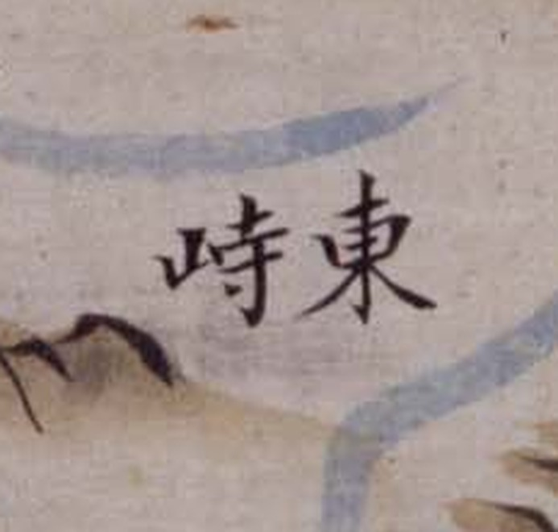 | 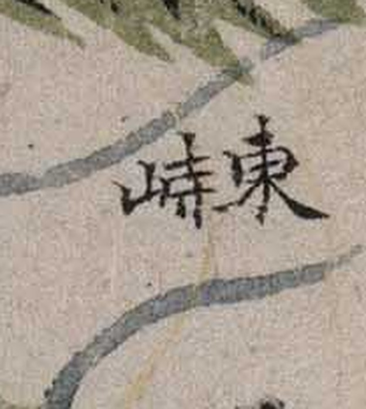 | **새 고개.** 우횡서 |
| 질치 | **`質峙`** | 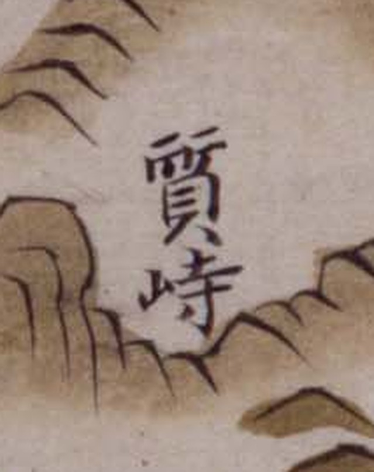 | 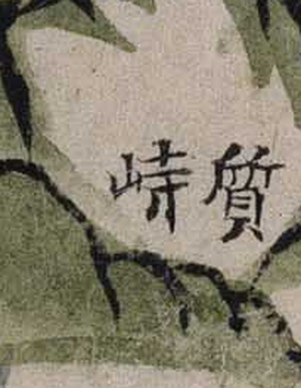 | **새 고개.** 대동여지도 `質峙` = 질고개 |
| 평치령 | **`平峙嶺`** | 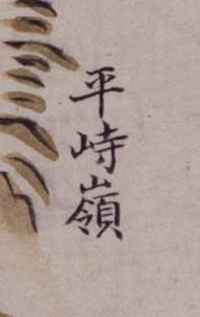 | 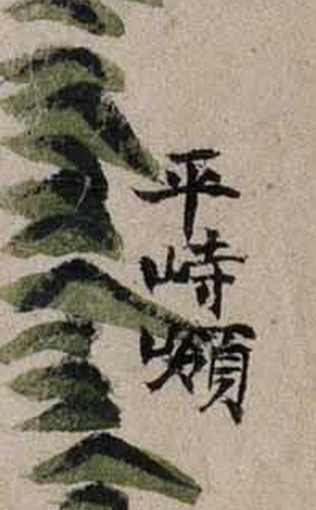 | **새 고개.** 세 글자 |
| 애송치 | **`崖松峙`** | 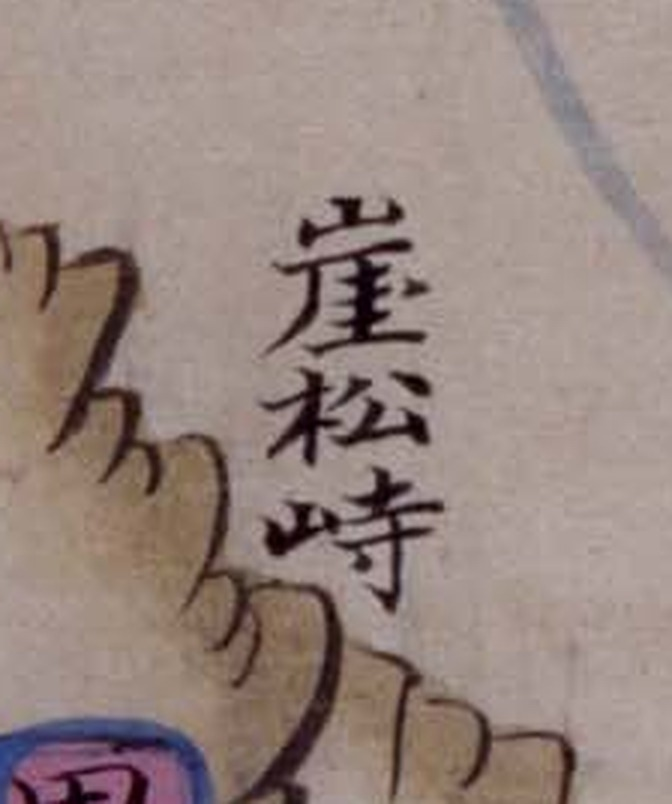 | 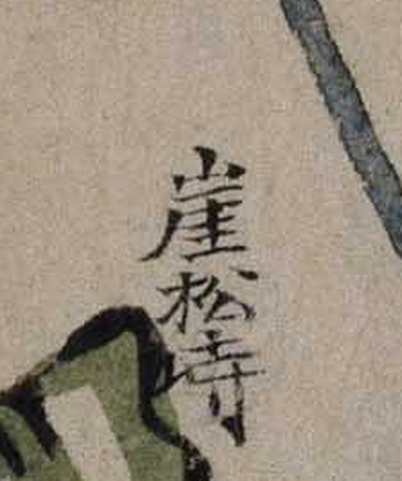 | 해동지도와 **글자가 다릅니다**(아래) |
| 계치 | **`鷄峙`** | — | — | 우리가 `雞峙` 로 적어 온 것. 둘 다 `奚`+`鳥` 로 **`鷄`** |

**`質峙` 가 가장 값집니다.** 대동여지도에서 찾아 두었던 `質峙`(질고개)가
**18세기 군현도 세 계열에 모두 있었습니다.** 해동지도에도 있는데 우리가 못 봤습니다.

### 5.2 `崖柏峙` / `崖松峙` — **우리 판독이 맞았고, 사본이 실제로 다릅니다**

규장각 색인은 해동지도까지 「애송치」로 적었습니다. 세 사본의 같은 자리를
나란히 떠 보았습니다.

| 해동지도 | 광여도 | 여지도 |
|---|---|---|
| 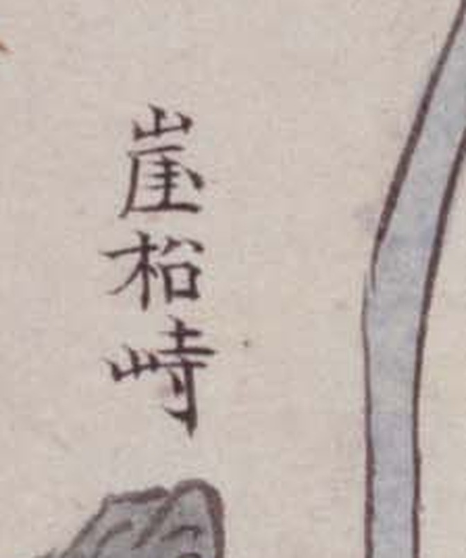 |  |  |
| **`柏`** — `木`+`白`. 네모 안에 가로획 | **`松`** — `木`+`公`(`八`+`厶`) | **`松`** — 같음 |

**둘째 글자가 분명히 갈립니다.** 해동지도는 `柏`, 광여도·여지도는 `松` 입니다.
[`해동지도-회덕현-판독.md`](해동지도-회덕현-판독.md) 의 **`崖柏峙` 는 그대로 둡니다**
— 확신 상을 유지합니다.

> **이것이 색인을 쓰는 법을 말해 줍니다.** 규장각 색인은 해동지도 자리에도
> 「애송치」를 적었습니다. **계열 간 글자 차이를 지우고 같은 읽기를 돌려 쓴 데가
> 있습니다.** 색인은 **어디를 보라**고만 알려 주는 것으로 쓰고,
> **무엇이라 적혔는지는 반드시 그 도엽에서** 확인해야 합니다.

### 5.3 그래서 회덕현 고개가 늘었습니다

| 고개 | 해동지도 | 광여도 | 여지도 | 지승 | 팔도군현지도 | 조선지도 | 1872 |
|---|---|---|---|---|---|---|---|
| **`東峙`** | ○ | ○ | ○ | ○ | ○ | ○ | — |
| **`質峙`** | ○ | ○ | ○ | ○ | ○ | **없음** | — |
| **`迭峙`** | — | — | — | — | ○ | ○ | — |
| **`遠峙`** | — | — | — | — | ○ | ○ | — |
| `崖柏峙`/`崖松峙` | `柏` | `松` | `松` | `松` | — | — | — |
| `子田峴` | ○ | — | — | — | — | — | — |
| `子峴` | ○ | — | — | — | — | — | — |
| `雞峙`/`鷄峙` | `雞` | `鷄` | `鷄` | ○ | — | — | — |
| `于峙`□ | ○ | — | — | — | — | — | — |
| `平峙嶺` | — | ○ | ○ | ○ | — | — | — |
| `吉峙` | — | — | — | — | — | — | ○ |

**`東峙` 만 여섯 계열 모두에 있습니다.** `質峙` 는 다섯(조선지도에 없음),
`迭峙`·`遠峙` 는 방안식 둘에만 있습니다.

### 5.4 진산군 — 해동지도 고개 여덟을 글자까지 읽었습니다 (2026-10-03)

색인이 짚은 자리를 그대로 떠서 읽었습니다. 도엽은 2409 × 3751 px.

| 색인 | 읽은 글자 | 크롭 | 메모 |
|---|---|---|---|
| 신치 | **`新峙`** | 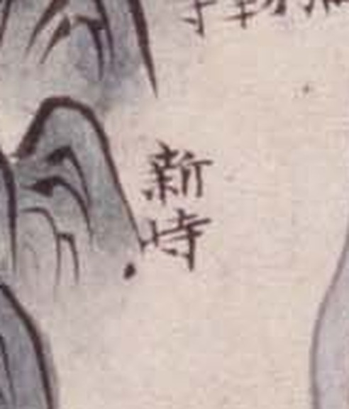 | |
| 국치험애 | **`□峙 險阨`** | 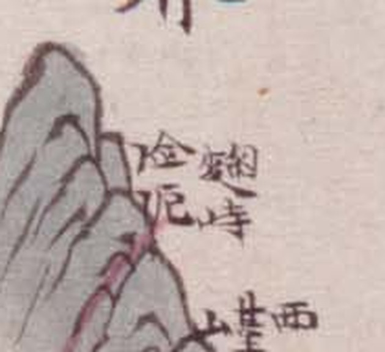 | 첫 글자가 뭉개져 못 읽음 |
| 방고치 | **`方古峙`** | 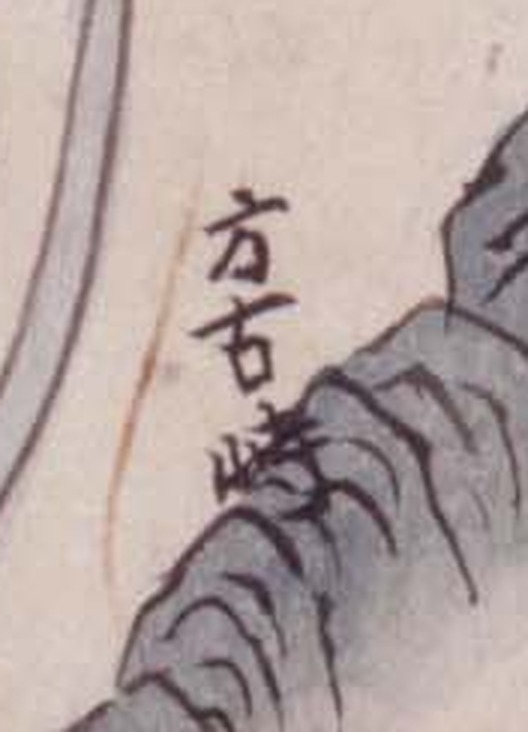 | |
| 만목치 | **`晩目峙`** | 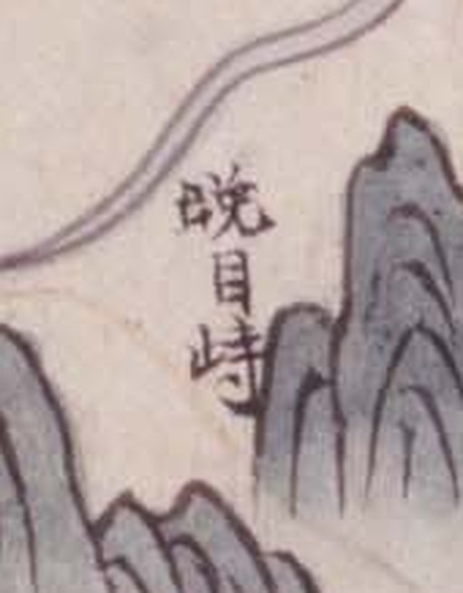 | **⚠ 아래** |
| 거치 | **`車峙`** | 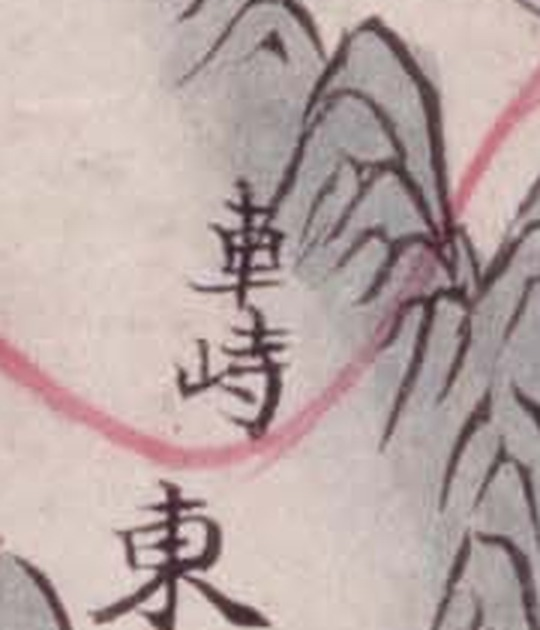 | 길 주기 위, `東` |
| 삽치 | **`揷峙`** | 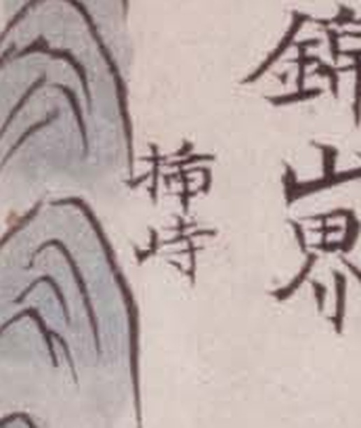 | `錦山界` 옆 |
| 이치험애 | **`梨峙 險阨`** | 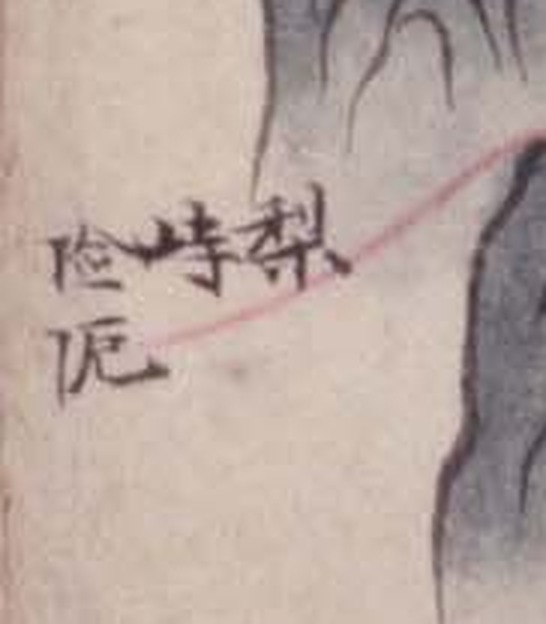 | 우횡서 |
| 송원치 | **`松院峙`** | 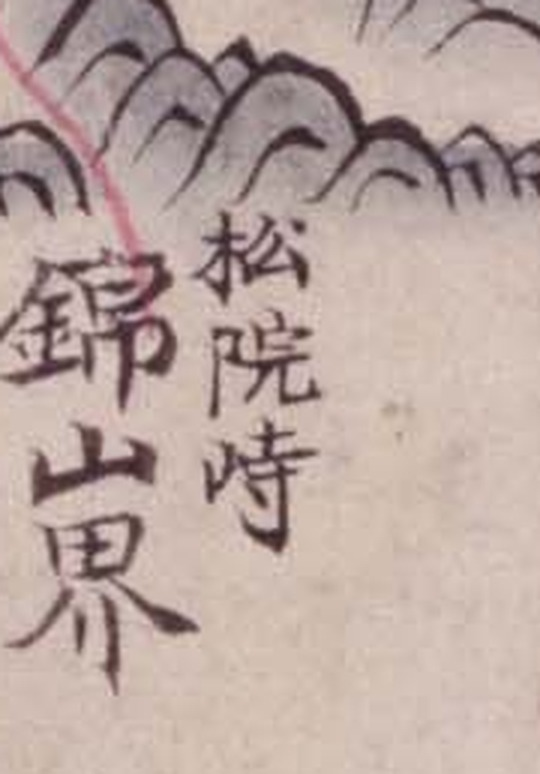 | `錦山界` 옆 |

**`險阨` 가 두 곳에 붙어 있습니다**(국치·이치). 좁은 길목을 따로 표시한 것으로,
`隘口` 로 읽을 뻔했던 것을 **`險阨`**(阝+僉 / 阝+厄)으로 확정합니다.
금산군 도엽에는 이름 없이 `險阨` 만 셋 찍혀 있습니다.

> ⚠ **`晩目峙` 인가 `新目峙` 인가.** [`해동지도-진산군-판독.md`](해동지도-진산군-판독.md) 은
> 이 자리를 **`新目峙`** 로 읽고 **1872년 진산군지도의 `思睦峙`와 같은 것**으로 보았습니다.
> 그런데 크롭을 10배로 키워 보면 첫 글자는 **왼쪽이 `日`, 오른쪽이 `免`** 으로
> **`晩`** 입니다 — `新`(亲+斤)의 자형이 아닙니다. **규장각 색인도 「만목치」** 라
> 적어 두 증거가 같은 쪽을 가리킵니다.
>
> **다만 판독 문서를 아직 고치지 않았습니다.** `新目峙 = 思睦峙` 는 1872년 도엽과
> 맞물려 세운 것이라, 뒤집으려면 **1872년 쪽 글자도 다시 봐야** 합니다.
> `晩目`(만목)과 `思睦`(사목)은 소리도 다릅니다. **열어 둡니다.**

**다른 사본은 훨씬 적습니다** — 광여도 셋(`신치`·`압치`·`이치험애`), 여지도 셋,
지승 넷(`국치`·`신치`·`압현`·`이치`). **진산군은 해동지도가 가장 풍부합니다.**
`압치`/`압현` 은 해동지도에 없고, 거꾸로 해동지도의 `방고치`·`만목치`·`거치`·
`삽치`·`송원치` 는 다른 사본에 없습니다.

### 5.5 ⚠ `質峙` 와 `迭峙` — **색인이 둘을 한 이름으로 묶었습니다** (2026-10-04)

**회덕현 일대에 「질치」로 읽히는 고개가 둘입니다.** 한자가 다릅니다.

| | 한자 | 어디에 | 자리 |
|---|---|---|---|
| 질치 ⓐ | **`質峙`** | 해동·광여·여지·지승·팔도군현 **다섯** | **붉은 길 위**, 읍치 남쪽 |
| 질치 ⓑ | **`迭峙`** | 팔도군현·조선 **둘**(방안식) | **딴 산줄기**, 길에서 떨어져 |

**`迭` 도 「질」로 읽힙니다.** 그래서 규장각 색인은 둘을 똑같이 「질치」로 적었고,
저는 어제 그것을 그대로 받아 **「팔도군현지도와 조선지도가 `동치·원치·질치` 셋으로
똑같다」고 썼습니다. 틀렸습니다** — 팔도군현지도는 **넷**(`東峙`·`質峙`·`迭峙`·`遠峙`),
조선지도는 **셋**(`東峙`·`迭峙`·`遠峙`, `質峙` 없음)입니다.

**팔도군현지도 회덕 — 한 화면에 셋이 나란히**

| `質峙` | `迭峙` | `遠峙` |
|---|---|---|
| 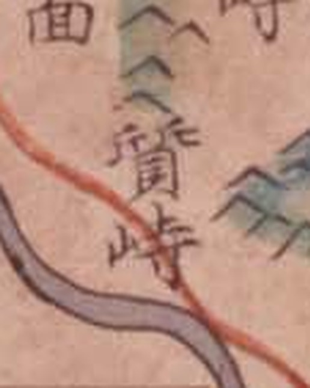 | 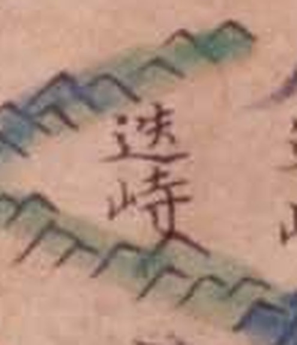 | 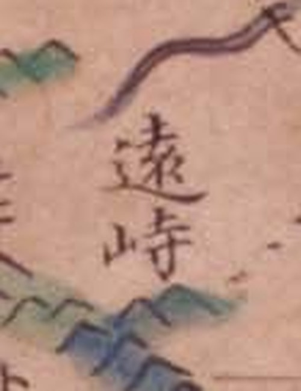 |
| 貝가 받친 `質` | 辶+失 = `迭` | 辶+袁 = `遠` |

**조선지도에는 `質峙` 가 없습니다**

| `迭峙` | `遠峙` |
|---|---|
| 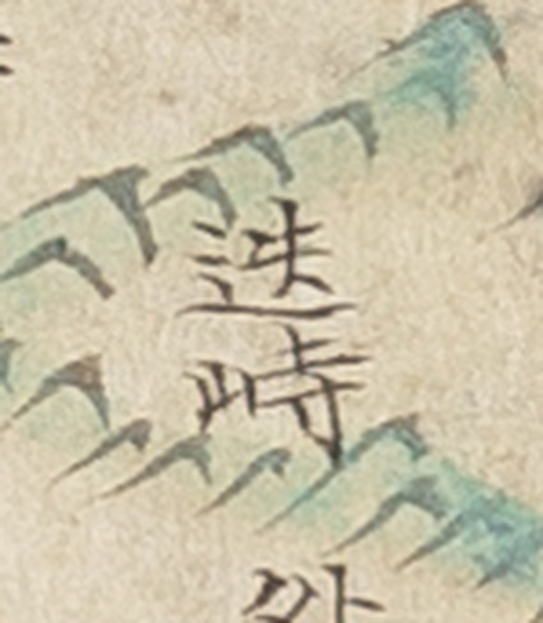 | 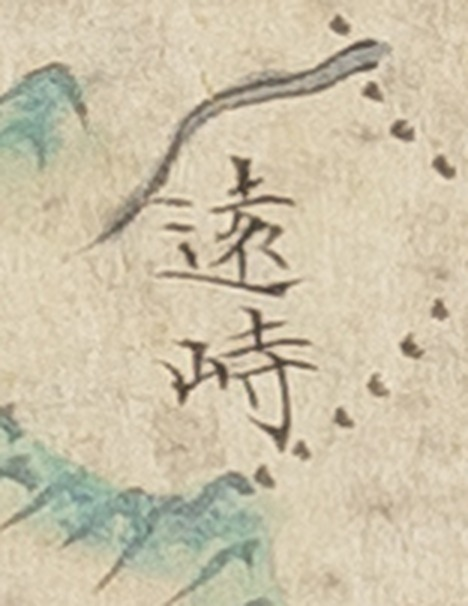 |

**해동지도의 `質峙` 도 붉은 길 위에 있습니다** — 팔도군현지도와 같은 자리입니다.

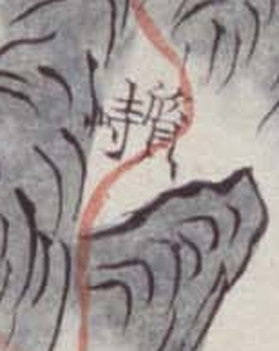

**길 위냐 아니냐가 둘을 가릅니다.** `質峙` 는 어느 사본에서든 **읍치에서 남으로 난
붉은 길이 산줄기를 넘는 자리**에 있고, `迭峙` 는 길이 닿지 않는 **동쪽 딴 줄기**에
있습니다. 회덕 기록의 **「질고개」**(공주·연산·옥천·문의로 통하는 길목)는
**길 위에 있는 `質峙`** 쪽입니다.

> **열린 쟁점에 걸립니다.** 대조표는 1872년 회덕현지도의 **`吉峙`** 를 두고
> **`迭峴`(비래동)인가 `陶峙`(비룡동)인가**를 묻고 있습니다. 여기 방안식 두 사본에
> **`迭峙`** 가 실물로 나왔고 자리도 동쪽입니다. **`吉峙`–`迭峙`–`迭峴` 셋을
> 한자리에 놓고 다시 볼 때입니다.** 다만 `吉峙` 의 자리를 1872년 도엽에서 다시
> 재기 전에는 잇지 않습니다.

**배운 것** — 색인은 **소리만** 줍니다. 서로 다른 한자가 같은 소리로 묶이면
**색인만 보고는 한 고개인지 두 고개인지 알 수 없습니다.** 세 보기 전에 글자를
봐야 합니다.

### 5.6 `吉峙` 는 비래동이 아니라 **세천 옆**입니다 (2026-10-04)

대조표 **6.5 는 `吉峙`·`質峙`·`迭峴` 을 「한 고개의 세 표기」로 묶어** 두었고,
3장 대장은 질티/길치의 자리를 **대덕구 비래동**(확신 C)으로 적고 있습니다.
1872년 도엽을 다시 보니 **그렇지 않습니다.**

**규장각 색인에 1872년 회덕현지도도 들어 있습니다** — 146건.
도엽은 **위=東·왼쪽=北·오른쪽=南·아래=西**(판독 문서 확인)이므로
색인 좌표에서 `x` 는 북→남, `y` 는 동→서입니다. 도엽은 7564 × 10353 px.

| 색인 | 좌표 | 정규 (x/W, y/H) | 어디 |
|---|---|---|---|
| **길치** | (5212, 2547) | (0.689, 0.246) | — |
| **세천** | (4866, 2546) | (0.643, **0.246**) | **길치와 같은 동서선, 바로 이웃** |
| 양천 | (4968, 2510) | (0.657, 0.242) | 〃 |
| 삼거리 | (4863, 2336) | (0.643, 0.226) | 〃 |
| 고요 | (4952, 2172) | (0.655, 0.210) | 〃 |
| **비래동** | (4886, 5709) | (0.646, **0.551**) | **동서로 도엽의 0.31 만큼 떨어짐** |
| 송촌 | (4712, 5727) | (0.623, 0.553) | 비래동 이웃 |
| 식장산 | (6513, 2038) | (0.861, 0.197) | 길치보다 더 남·더 동 |

**`吉峙` 는 `細川`(세천) 바로 옆입니다.** 두 라벨의 동서 좌표가 `2547` 과 `2546`
으로 사실상 같습니다. 그리고 **비래동은 전혀 다른 자리**에 있습니다 — 송촌·법동·
오정·대화와 한 무리로, 길치에서 동서로 도엽의 3분의 1 가까이 떨어져 있습니다.

東面 주기가 이를 받칩니다 — 「自官東距二十里. 各里 **古堯·官洞·楊川·新垈·三巨里·
細川·細谷**」. **길치는 회덕현 東面의 동쪽 끝**, 옥천으로 가는 쪽입니다.

| `吉峙` — 고갯마루에 길이 지납니다 | `古堯店` — 東面의 주막 |
|---|---|
| 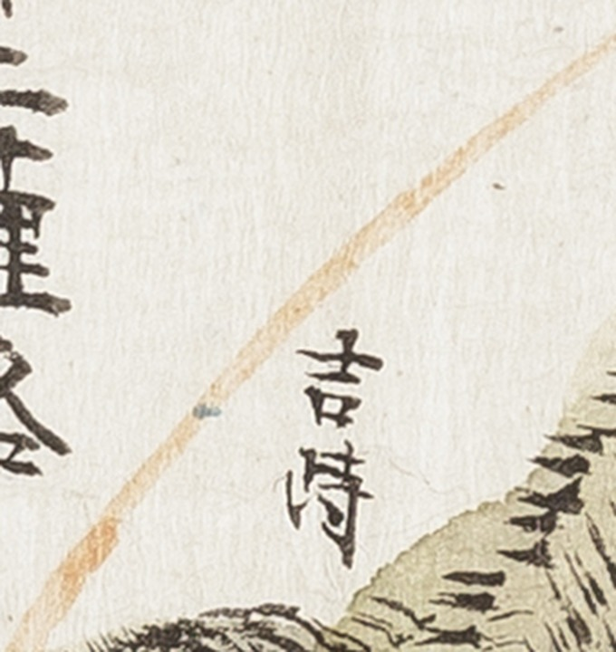 | 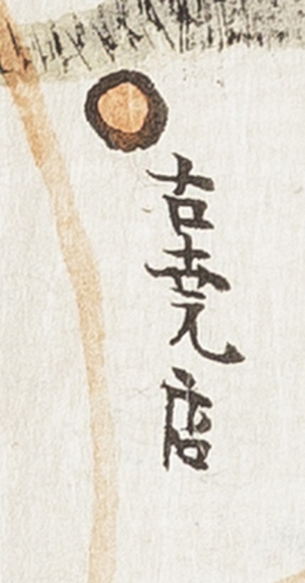 |

> 곁가지 — 주막 이름을 처음에 `吉峴店` 으로 볼 뻔했습니다. 색인이 **「고요점」**
> 이라 일러 주었고, 東面 주기의 마을 목록에 **`古堯`** 가 있어 **`古堯店`** 으로
> 확정됩니다. 가운데 글자는 `峴` 이 아니라 **`堯`** 입니다.

### 5.7 그래서 6.5 는 다시 세워야 합니다

**한 도엽에 함께 있는 라벨은 서로 다른 고개입니다.** 이것이 기준입니다.

| 도엽 | 고개 | 자리 |
|---|---|---|
| 1872 회덕현지도 | `吉峙` **하나** | 東面 동쪽 끝, 細川 옆 |
| 팔도군현지도 | `東峙` · `質峙` · `迭峙` · `遠峙` **넷** | 서→동 차례로 |
| 조선지도 | `東峙` · `迭峙` · `遠峙` **셋** | `質峙` 없음 |
| 해동·광여·여지·지승 | `東峙` · `質峙` | `迭峙`·`遠峙` 없음 |

조선지도 전면을 훑어 확인했습니다 — `東峙` 는 읍치 동쪽, `迭峙` 는 동남쪽
식장산 방향, `遠峙` 는 동북쪽 `淸州周安界`·`懷仁界` 모서리 쪽입니다.

**그러므로 `吉峙`·`質峙`·`迭峴` 을 한 고개로 묶은 6.5 는 유지할 수 없습니다.**
`質峙` 와 `迭峙` 는 **같은 도엽에 나란히** 있고, `吉峙` 는 비래동이 아니라
세천 옆입니다.

**다만 `吉峙` 가 넷 중 어느 것인지는 아직 못 정합니다.** 도엽마다 투영이 달라
눈대중으로 이어 붙일 수 없습니다. **정하려면 도엽을 좌표에 앉혀야(georeference)
합니다.** 지금 확실한 것은 **묶여 있던 것이 풀렸다**는 것뿐입니다.

## 6. 커먼즈에 올릴 준비 (2026-10-03)

### 6.1 다섯 계열이 커먼즈에 한 장도 없습니다

파일명 접두사, 청구기호, 분류, 전문 검색 네 가지로 확인했습니다.

| 조회한 것 | 결과 |
|---|---|
| 접두사 `GM33611`·`GM33496`·`GM33535`·`GK15423`·`GM16030` | 모두 **0건** |
| `insource:"古4790-58"`·`"古4709-68"`·`"古4709-111"`·`"奎15423"`·`"奎16030"` | 모두 **0건** |
| `Category:Gwangyeodo`·`Yeojido`·`Kwangyodo` | 모두 **없음** |
| 전문 검색 `Gwangyeodo` | 1건 — `File:Joseon-Qing border in Gwangyeodo.png`(파생물) |

> `廣輿圖` 로 검색하면 1,514건이 나오지만 **명대 羅洪先의 『廣輿圖』**(중국 지도첩)입니다.
> 이름만 같은 다른 책이니 섞지 마십시오.

### 6.2 94장을 더 받아 모두 99장이 되었습니다

| 계열 | 장수 | 크기 | 비고 |
|---|---|---|---|
| 광여도 | 26 | 2409 × 3364~3406 | |
| 여지도 | 26 | 2503~3225 × 4000 | 가장 곱습니다 |
| 팔도군현지도 | 11 | — | 주기 없음 · 방안식 |
| 지승 | 26 | — | 장당 1.5~3.0 MB 로 가장 큽니다 |
| 조선지도 | 10 | — | 주기 없음 · 전라도 없음 |

모두 241 MB, 저장소 밖 `~/Documents/대전고지도/kyujanggak/` 입니다.

### 6.3 연대를 바로잡았습니다 — **규장각 목록을 믿으면 안 됩니다**

| 계열 | 규장각 목록 | 실제 | 근거 |
|---|---|---|---|
| 광여도 | 1737 | **19세기 초** | 충청도 도지도의 `尼山→尼城` 개명 |
| 여지도 | 간년미상 | **18세기 중엽**(1736~1767) | 행정구역·지명 |
| 조선지도 | 간년미상 | **1767~1776** | 산음→산청·안음→안의(1767) 반영, `尼山` 표기(1776 개명 전) |
| 팔도군현지도 | 1724 | **1767~1776** | 영조대 20리 방안식, 3첩 38×50cm |
| 지승 | 간년미상 | **18세기 후반**(1776년 이후) | 지명 개정 반영. 2책 충청·4책 전라 |

**목록의 「1724」·「1737」은 영조 연간을 뭉뚱그린 값으로 보입니다.** 광여도가 그
증거입니다 — 목록은 1737이라 하는데 실제로는 19세기 초입니다. 해동지도도 목록은
1724인데 커먼즈 문서는 「before 1775」로 적고 있습니다.

조선지도가 **전라도를 담지 않는다**는 것은 우리 조사와 맞습니다 —
진산·금산이 그 계열에만 없었습니다(1장 표).

### 6.4 업로드 꾸러미

`~/Documents/대전고지도/kyujanggak/commons-업로드/` 에 두었습니다.

**2026-10-04 현재 87장이 올라갔습니다** — 광여도 26 · 여지도 26 · 팔도군현지도 11 ·
지승 24. **남은 것은 지승 2장과 조선지도 10장**입니다.

| | |
|---|---|
| `manifest.csv` | 99장 — 원본 경로·커먼즈 파일명·설명 파일·크기·연대 확인 여부 |
| `desc/` | 파일 하나당 위키텍스트 (99개, 한국어·영어 설명 둘 다) |
| `category/` | 새로 만들 분류 다섯 개 |
| `upload.py` | `mwclient` 업로드 스크립트. `--check`·`--only`·`--limit` 지원 |
| `올리는-법.md` | 순서와 주의 |

**파일 이름** — `Gwangyeodo GM33611IL0002_063 충청도 회덕현.jpg` 꼴입니다.
계열이 이름에 드러나고 규장각 ID도 남습니다.

**라이선스** — `{{PD-scan|PD-old-100-expired}}`. 원작은 18~19세기 익명 필사본이라
한국·미국 모두에서 퍼블릭 도메인이고, 평면 저작물의 충실한 스캔은 새 저작권이
생기지 않습니다. **같은 규장각·같은 스캔 사업의 해동지도 13장이 이미 커먼즈에
있는 것**이 선례입니다(그쪽은 `{{PD-old-70}}`).

**분류 다섯 개를 먼저 만들어야 합니다** — 없으면 빨간 링크가 됩니다.
`upload.py --categories` 가 만들어 줍니다.

점검은 통과했습니다 — `upload.py --check` 가 99장, 빠진 파일 0건, 경고 없음.
연대는 다섯 계열 모두 확인되어 `⚠확인필요` 가 남아 있지 않습니다.

## 7. 다음에 할 일

1. ~~회덕 `동치`·`질치` 크롭~~ **마쳤습니다**(5.1) — `東峙`·`質峙`. **해동지도 쪽도 떠서
   [`해동지도-회덕현-판독.md`](해동지도-회덕현-판독.md) 에 올려야 합니다.**
2. ~~`崖柏峙` / `애송치` 재검~~ **마쳤습니다**(5.2) — 우리 판독이 맞고 사본이 다릅니다.
3. **`于峙嶺`** — 규장각 읽기를 후보로 올리고 크롭 재검. 광여도·여지도에는 없는 고개라
   해동지도에서만 가려야 합니다.
4. **옥천 `九也峙` / `구둔치`** 둘째 글자.
5. **광여도 회덕현 전면 판독** — 해동지도와 120년 차이 없이 같은 시기(1737)인데
   계통이 다릅니다. `평치령`은 광여도 계통에만 있습니다.
6. 광여도 **청주목** 색인은 받지 못했습니다(연결 끊김). 다시 받아야 합니다.

## 주의

- **색인은 규장각이 붙인 2차 자료입니다.** 원도의 글자가 아니라 **읽은 결과**입니다.
  우리 판독과 어긋날 때 어느 쪽이 옳은지는 **원도를 봐야** 정해집니다.
- **한자가 없습니다.** 한글 음만으로는 `峙`/`峴`/`嶺` 도, 글자도 정해지지 않습니다.
- **빠진 것이 있습니다**(진산군 보기). 전수 목록으로 쓰지 마십시오.
- 좌표는 **그 도엽 이미지의 화소**입니다. 커먼즈 원본과 규장각 원본의 크기가 같은지
  도엽마다 확인하고 나눠야 정규좌표가 됩니다. 회덕현은 2409 × 3722 로 맞았습니다.

## 변경 이력

| 날짜 | 내용 |
|---|---|
| 2026-10-04 | **`吉峙` 는 비래동이 아니라 세천 옆입니다**(5.6) — 규장각 색인에 1872년 도엽도 있어(146건) 좌표로 확인했습니다. `길치`(5212,2547)와 `세천`(4866,2546)이 같은 동서선이고 `비래동`(4886,5709)은 도엽의 0.31만큼 떨어져 있습니다. **대조표 6.5 「`吉峙`·`質峙`·`迭峴` 한 고개의 세 표기」는 유지할 수 없습니다**(5.7). 다만 `吉峙` 가 넷 중 어느 것인지는 georeference 없이는 못 정합니다 |
| 2026-10-04 | **`質峙` 와 `迭峙` 가 다른 고개임을 밝혔습니다**(5.5) — 색인이 둘 다 「질치」로 적어 묶여 있었습니다. 팔도군현지도는 **넷**(`東峙`·`質峙`·`迭峙`·`遠峙`), 조선지도는 **셋**(`質峙` 없음)이라, 「방안식 둘이 똑같다」고 쓴 것을 바로잡습니다. `質峙` 는 어느 사본에서든 **붉은 길 위**에 있고 `迭峙` 는 길 밖 동쪽 줄기에 있습니다. 대조표의 `吉峙`/`迭峴` 쟁점에 걸립니다. 커먼즈 업로드가 **87장** 진행되었습니다 |
| 2026-10-03 | **진산군 해동지도 고개 여덟을 글자까지 읽었습니다**(5.4) — `新峙`·`方古峙`·`晩目峙`·`車峙`·`揷峙`·`松院峙` 와 `險阨` 둘. **어제 「색인이 전수가 아니다」라고 적은 것을 철회합니다** — 색인에도 여덟이 다 있었고 `험애`로 끝나는 둘을 제 걸러내기가 떨어뜨린 것이었습니다. `晩目峙`/`新目峙` 쟁점을 새로 세웠습니다 |
| 2026-10-03 | **다섯 계열 99장을 모두 받고 커먼즈 업로드 꾸러미를 만들었습니다**(6장). 커먼즈에 **한 장도 없음**을 네 가지로 확인했고, 규장각 목록의 간행년이 틀렸음을 밝혀 광여도=19세기 초·여지도=18세기 중엽·조선지도=1767~1776으로 바로잡았습니다. 팔도군현지도=1767~1776·지승=18세기 후반도 뒤이어 찾아, 다섯 계열의 연대가 모두 섰습니다 |
| 2026-10-03 | **광여도·여지도 원본 52장을 받았습니다**(`ImageDown.do`). 회덕현 고개 다섯의 한자를 확정 — **`東峙`·`質峙`·`平峙嶺` 셋이 새로 들어옵니다.** `崖柏峙`(해동지도) / `崖松峙`(광여도·여지도)는 **사본이 실제로 다른 것**이고 **우리 판독이 맞았습니다** — 규장각 색인이 해동지도에까지 「애송치」를 돌려 쓴 것이 드러났습니다 |
| 2026-10-03 | 문서 개설. 규장각 고지도 「지역별 보기」로 열다섯 고을을 전수 조회해 **다섯 계열 60장**을 찾음. 뷰어가 지명 색인을 좌표까지 들고 있는 것을 발견해 **72 도엽 2,690 건**을 거둠. 회덕현에서 **`동치`·`질치` 두 고개를 새로 얻고**, `于峙`□ 의 셋째 글자 후보(`嶺`)와 `崖柏峙`/`애송치` 쟁점을 세움 |
