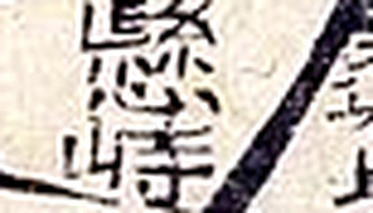
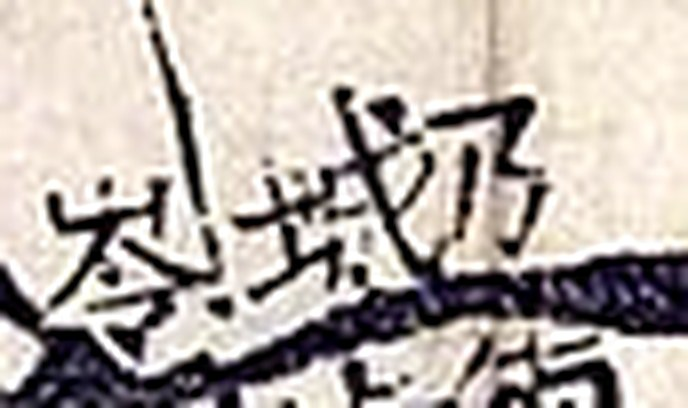
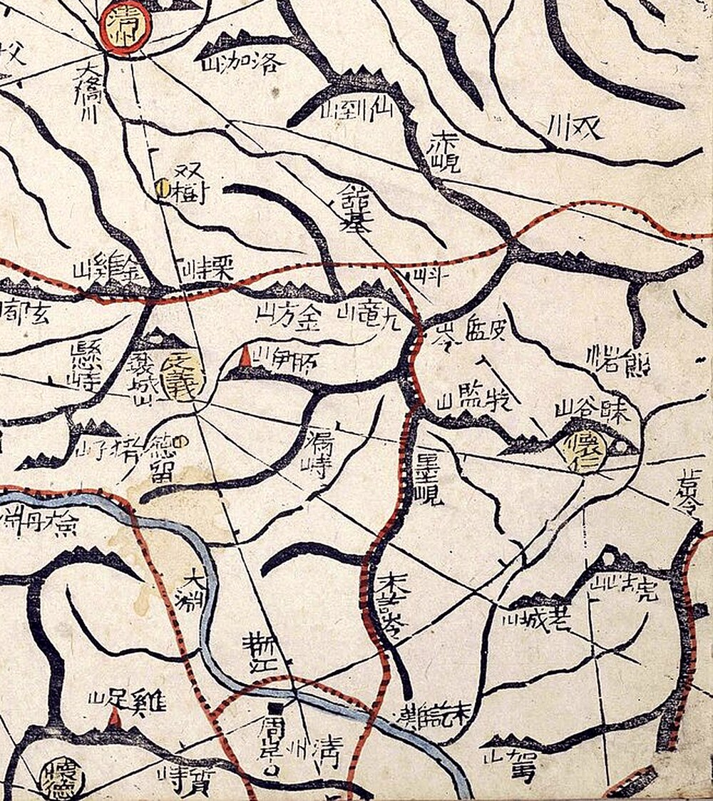

# 『대동여지도』 15층 4면 판독 — 대전 북부

김정호, 1861년(철종 12) 목판본. 규장각한국학연구원 소장본이 위키미디어 공용에 층·면
단위로 올라 있습니다.

**이 도엽에 회덕·유성·진잠·계족산·신탄이 들어 있습니다.** 대전 북부입니다.
남부(계현·만인산·진산 접경)는 [`대동여지도-16-04-판독.md`](대동여지도-16-04-판독.md).
기록은 [`대전-고개-대조표.md`](대전-고개-대조표.md) 13.3·13.4.

## 도엽

| | |
|---|---|
| 파일명 | `Daedongyeojido (Gyujanggak) 15-04.jpg` |
| 원문 | [커먼즈 파일](https://commons.wikimedia.org/wiki/File:Daedongyeojido_(Gyujanggak)_15-04.jpg) |
| 크기 | 1,920 × 1,467 px (커먼즈 축소본으로 판독) |
| 훑은 범위 | **아래 절반 전면**(대전 본역 + 문의·회인) (2026-09-30) |
| 방위 | 위가 北 (대동여지도는 전 층이 표준 방위) |
| 글 방향 | 우횡서 |

**층·면 번호 읽는 법.** `NN` 이 층(帖), `MM` 이 그 층 안의 면입니다.
**면 번호는 동에서 서로 갑니다** — 13층에서 05 가 강화·인천이고, 16층에서 05 가
보령·서천입니다.

**회덕 읍치가 이 도엽의 아래 가장자리(0.69, 0.99)에 있습니다.** 그래서 대전이 두 층에
걸칩니다 — 회덕 남쪽은 16층 4면입니다.

## 이 계열이 좋은 점

- **목판본이라 글자가 또렷합니다.** 1,920 px 축소본에서도 지명이 읽힙니다
- **`峙`·`峴`·`嶺` 표기가 회화식 군현지도보다 훨씬 촘촘합니다**
- **고을 경계에 얽매이지 않습니다** — 대전 일대를 한 화면에서 봅니다
- **방안(方眼)이 있어 거리를 잴 수 있습니다** (아직 쓰지 않았습니다)

## 채록

*대전 본역. 오른쪽 아래 `懷德`, 그 위가 `雞足山`, 왼쪽이 `儒城`.*

| 위치 | 표기 | 읽기 | 확신 | 판독자 | 날짜 |
|---|---|---|---|---|---|
| (0.69, 0.99) | `懷德` | 회덕 읍치(노란 원) | 상 | Claude | 2026-09-30 |
| (0.54, 0.99) | `儒城` | 유성 | 상 | Claude | 2026-09-30 |
| (0.44, 0.62) | `鎭岑` | 진잠 읍치(노란 원) | 상 | Claude | 2026-09-30 |
| **(0.72, 0.93)** | **`雞足山`** | 계족산 | 상 | Claude | 2026-09-30 |
| (0.60, 0.88) | `新灘` | 신탄(지금 신탄진) | 상 | Claude | 2026-09-30 |
| (0.63, 0.83) | `國師郞山`〔?〕 | — | 중 | Claude | 2026-09-30 |
| (0.72, 0.81) | `猪子山` · `德留` | — | 중 | Claude | 2026-09-30 |
| (0.63, 0.86) | `文岩川` | — | 중 | Claude | 2026-09-30 |
| (0.74, 0.86) | `大丹淵`〔?〕 · `荊江` | — | 중 | Claude | 2026-09-30 |

**`雞足山` 이 1872년 옥천군지도와 맞물립니다.** 그 도엽의 봉수 주기가
`環山 … 去應 懷德 鷄足山烽燧 距邑十五里` 라 적어 **봉수 노선이 대전으로 이어지는 것**을
보여 주는데(12.4), 대동여지도가 그 산을 회덕 북쪽에 그려 놓았습니다.
다만 글자는 **`雞`(奚+隹)**로, 옥천 도엽의 `鷄`(奚+鳥)와 갈립니다.

## 고개 셋

| 위치 | 표기 | 읽기 | 확신 | 근거 |
|---|---|---|---|---|
| **(0.75, 0.99)** | **`質峙`** | **질치** | **상** |  |
| (0.70, 0.73) | `懸峙` | 현치 | 중 |  |
| (0.49, 0.84) | `乃城□`〔?〕 | — | **하** |  |

`懸峙`(0.70, 0.73)는 문의 쪽입니다. `乃城□`〔?〕(0.49, 0.84)는 유성 북쪽이고,
셋째 글자가 `峙`·`岾`·`峴` 중 무엇인지 가리지 못했습니다.

## **`質峙` — 지도에서 처음 확인됐습니다**

오른쪽이 `質`(斦+貝), 왼쪽이 `峙`(山+寺)로 둘 다 또렷합니다(우횡서).

**대조표 6.5** 는 「질티/질고개」의 세 표기 `吉峙`·`質峙`·`迭峴` 을 다루면서
**`質峙` 는 기록에서만 들었을 뿐 지도에서 확인하지 못했다**고 적어 두었습니다.

**자리도 맞습니다** — `懷德` 읍치(0.69, 0.99) 바로 **동쪽**이고, 질현성·질티고개가 있는
대덕구 비래동이 회덕 읍치 동쪽입니다.

**그래서 세 표기 가운데 둘이 지도로 확인됐습니다** — `吉峙`(1872 회덕현지도, 12.1)와
`質峙`(여기, 1861). **두 지도가 11년 차이로 같은 고개를 다른 글자로 적었습니다.**
6.5 가 든 두 설명 가운데 **②「필사자가 뜻 좋은 글자로 바꿔 적었다」** 쪽으로 무게가
실립니다 — **`質`(1861) → `吉`(1872)** 이니 구개음화(`길`→`질`)와는 방향이 거꾸로입니다.

## 아래 절반 전면 훑기 (2026-09-30) — 고개 아홉

도엽을 여섯으로 나눠 아래 절반(y 0.5~1.0)을 다 훑었습니다. **이 계열이 고개를 얼마나
촘촘히 적는지가 여기서 드러납니다** — 회화식 군현지도 한 장에 서넛이던 것이, 같은 넓이에
아홉입니다.

*동남 4분면. 왼쪽 아래 `懷德`·`雞足山`·`質峙`, 가운데 `文義`, 오른쪽 `懷仁`.*

### 고개

| 위치 | 표기 | 읽기 | 확신 | 비고 |
|---|---|---|---|---|
| **(0.75, 0.98)** | **`質峙`** | 질치 | **상** | 회덕 읍치 동쪽 → 아래 13.4 |
| (0.70, 0.73) | `懸峙` | 현치 | 상 | 문의 읍치 서쪽 |
| **(0.87, 0.60)** | **`赤峴`** | 적현 | 상 | 청주 남쪽, `雙川` 곁 |
| **(0.89, 0.71)** | **`皮盤嶺`** | 피반령 | 상 | **해동지도 회인현의 `皮盤嶺`(11.6.6)과 같은 것** |
| **(0.86, 0.80)** | **`墨峴`** | 묵현 | 상 | **해동지도 회인현의 `墨嶺`(11.6.6)과 같은 것으로 보임** |
| (0.81, 0.79) | `潟峙`〔?〕 | — | 하 | 문의 동남 |
| (0.49, 0.85) | `乃城岾`〔?〕 | 내성재 | 하 | 유성 북쪽. **셋째 글자가 `岾`** → 아래 |
| (0.39, 0.70) | `□郞岾`〔?〕 | — | 하 | 진잠 서쪽. 역시 `山` 변 글자 |
| (0.76, 0.67) | `栗峙川`〔?〕 | 율치천 | 중 | **고개 이름이 하천 이름에 들어간 예** |

  

*왼쪽부터 `皮盤嶺` · `墨峴` · `乃城岾`〔?〕.*

### **`岾`(재 점) — 네 번째 고개 글자**

(0.49, 0.85)의 셋째 글자와 (0.39, 0.70)의 둘째 글자가 **`山` 변에 `占`** 꼴입니다.
`岾` 은 우리나라에서 만들어 쓴 글자로 **'재'를 적습니다.** 16층 4면에도
`加岾`〔?〕 이 있습니다.

**그러면 이 조사가 다루는 고개 글자가 넷이 됩니다** — `峙` · `峴` · `嶺` · **`岾`**.
대조표 2장(표기 원칙)과 4.4(고을마다 글자 버릇이 다르다)에 걸립니다.

**다만 `岾` 과 `峙` 는 축소본에서 구별이 어렵습니다**(`占` 과 `寺`). 확신 `하` 로 두고
원본 확인을 기다립니다.

### **`墨峴` 을 3장의 `墨峙` 와 섞지 않습니다**

3장에 `墨峙`(먹치)가 있습니다 — AMS 1:50,000 그리드 1043/1478, **만인산 언저리**이고
머들령과 자리가 거의 같습니다(6.1).

**여기 `墨峴`(0.86, 0.80)은 전혀 다른 곳입니다** — 회인 읍치(0.94, 0.78) 바로 서쪽이고,
해동지도 회인현의 `墨嶺`(11.6.6)과 같은 것으로 보입니다. **대전에서 북동쪽으로
40리 넘게 떨어져 있습니다.**

**글자가 같고 자리가 다른 전형**입니다 — 6.4 가 거듭 경계해 온 것입니다.
세 계열이 같은 곳을 `墨嶺`(해동지도) · `墨峴`(대동여지도)으로 적으니, **회인 쪽
'먹재'는 그것대로 한 고개**입니다.

### **`所伊山`(0.80, 0.73) — 봉수 노선의 그 산**

[`1872-회덕현지도-판독.md`](1872-회덕현지도-판독.md) 이 회덕 기문의 봉수 주기
`北應文義夜味山烽燧四十里去應` 를 읽으면서, **「`夜味山`(야미산)은 문의 쪽 봉수산으로
소이산(所伊山)과 같은 산으로 파악된다」**고 적어 두었습니다.

**대동여지도가 그 `所伊山` 을 문의 읍치(0.75, 0.73) 동쪽에 그려 놓았습니다.**

곧 **계족산 봉수 → 문의 소이산(야미산) 봉수**라는 노선이 지도로 짚입니다.
남쪽 끝은 옥천 환산이고(12.4), 그 산도 이 계열에 있습니다(16-04 (0.87, 0.09)).
**봉수 세 점이 모두 지도에서 확인된 셈**입니다.

## 함께 보이는 이웃

| 갈래 | 표기 |
|---|---|
| 읍치 | `公州` · `淸州`(0.72, 0.51) · `文義`(0.75, 0.73) · `懷仁`(0.94, 0.78) · `懷德`(0.69, 0.97) · `鎭岑`(0.44, 0.63) |
| 대전 | `儒城`(0.54, 0.98) · **`雞足山`**(0.72, 0.93) · `新灘`(0.61, 0.89) · `猪子山`(0.70, 0.79) · `德留`(0.74, 0.79) |
| 산 | `大明山`(0.61, 0.68) · `八峯山`(0.53, 0.65) · `金方山`(0.80, 0.70) · `九龍山`(0.83, 0.70) · `牧監山`(0.88, 0.75) · `洛加山`(0.77, 0.54) · `雲住山`(0.36, 0.62) · `五峯山`(0.47, 0.52) · `正左山`(0.42, 0.54) · `國師郞山`(0.63, 0.78) · `若城山`(0.92, 0.89) · `駕山`(0.91, 0.97) |
| 물·나루 | `大橋川`(0.70, 0.55) · `雙川`(0.93, 0.58) · `荊江`(0.78, 0.91) · `東津`(0.49, 0.69) · `浮灘`(0.54, 0.58) · `濯里灘`〔?〕(0.46, 0.78) · `大丹淵`〔?〕(0.69, 0.82) · `大淵`(0.76, 0.87) |
| 그 밖 | `雙橋`(0.75, 0.62) · `周岸`(0.79, 0.96) · `屯之川`(0.41, 0.65) · `居士里川` |

**`雲住山`(0.36, 0.62)이 해동지도 연기현 첨지의 `雲住山`(11.6.5)과 같은 산으로 보입니다.**

## 아직 안 본 곳

**도엽 위 절반(y 0 ~ 0.5)** — 공주 북부·천안·청주 북부입니다. 대전과 멀어 뒤로 미뤘습니다.

## 남은 것

- **도엽 위 절반**(공주 북부·천안·청주 북부)
- `乃城岾`〔?〕·`□郞岾`〔?〕 의 `岾`/`峙` 구별 — **원본이라야 갈립니다**
- `潟峙`〔?〕 · `栗峙川`〔?〕 확인
- 3장에 「미비정」으로 남은 회덕 고개 **넷**(`崖柏峙`·`子田峴`·`子峴`·`于峙領`〔?〕)을
  — `馬峴` 은 2026-10-01 에 **`縣內面` 의 오독으로 밝혀져 철회**됐습니다(11.1) —
  이 도엽에서 찾아볼 것
- **방안(方眼)으로 거리 재기** — 14장 AMS 그리드와 맞춰 볼 수 있습니다
- 15-03(옥천 방면) 확인

## 변경 이력

| 날짜 | 내용 |
|---|---|
| 2026-09-30 | **아래 절반 전면 훑기 — 고개 아홉.** `赤峴`·`皮盤嶺`·`墨峴`·`潟峙`〔?〕·`乃城岾`〔?〕·`□郞岾`〔?〕·`栗峙川`〔?〕 추가. **`岾`(재 점)이 네 번째 고개 글자**임을 확인. `墨峴` 은 3장의 `墨峙`(머들령 자리)와 **다른 곳**임을 못박음. **`所伊山`** 으로 봉수 노선 세 점이 모두 지도에서 확인됨 |
| 2026-09-30 | **문서 개설.** 대전 본역 채록 — `懷德`·`儒城`·`鎭岑`·`雞足山`·`新灘`. **`質峙` 를 지도에서 처음 확인**(6.5 에 반영). `懸峙`·`乃城□`〔?〕 |
