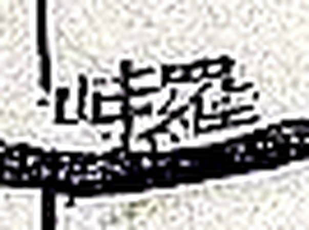

# 『대동여지도』 16층 4면 판독 — 대전 남부와 **`雞峴`**

김정호, 1861년(철종 12) 목판본. 규장각한국학연구원 소장본이 위키미디어 공용에 층·면
단위로 올라 있습니다.

**이 도엽에서 `雞峴`(닭재)을 찾았습니다.** 대조표 6.4 가 2026-09-01 부터 쫓아온
고개이고, **자리가 여기서 섰습니다.**

북부(회덕·유성·진잠)는 [`대동여지도-15-04-판독.md`](대동여지도-15-04-판독.md),
기록은 [`대전-고개-대조표.md`](대전-고개-대조표.md) 13.5·13.6.

## 도엽

| | |
|---|---|
| 파일명 | `Daedongyeojido (Gyujanggak) 16-04.jpg` |
| 원문 | [커먼즈 파일](https://commons.wikimedia.org/wiki/File:Daedongyeojido_(Gyujanggak)_16-04.jpg) |
| 크기 | 1,920 × 1,435 px (커먼즈 축소본으로 판독) |
| 훑은 범위 | **북부(대전 접경) + 남서부(연산·진산)** (2026-09-30) |
| 방위 | 위가 北 |
| 글 방향 | 우횡서 |

## 북부 채록 — 대전 접경

*도엽 북부. 왼쪽부터 `雞龍山` · `錦繡山` · `鎭岑` · `甲川`, 오른쪽 끝이 `食藏山`.*

| 위치 | 표기 | 읽기 | 확신 |
|---|---|---|---|
| (0.40, 0.05) | `雞龍山` | 계룡산 | 상 |
| (0.46, 0.05) | `錦繡山` | 금수산 | 중 |
| (0.50, 0.10) | `鎭岑` | 진잠 읍치(팔각) | 상 |
| (0.49, 0.13) | **`介水院`** | 개수원 | 상 |
| (0.50, 0.18) | `九峯山` | 구봉산 | 상 |
| (0.52, 0.25) | `安坪峙` | 안평치 | 중 |
| (0.61, 0.06) | **`甲川`** | 갑천 | 상 |
| (0.74, 0.13) | **`食藏山`** | 식장산 | 상 |
| **(0.75, 0.21)** | **`雞峴`** | **계현** | **상** |
| (0.65, 0.25) | `天庇山` | 천비산 | 상 |
| (0.71, 0.28) | **`萬仞山`** | 만인산 | 상 |
| (0.80, 0.27) | **`馬達峙`**〔?〕 | 마달치 | **중** |
| (0.84, 0.29) | `西臺山` | 서대산 | 상 |
| (0.83, 0.06) | `增若` | 증약역 | 상 |
| (0.87, 0.09) | `環山` | 환산(고리산) | 상 |
| (0.93, 0.15) | `沃川` | 옥천 읍치 | 상 |
| (0.77, 0.03) | `老峙`〔?〕 | — | 하 |
| (0.85, 0.06) | `古路峙`〔?〕 | — | 하 |

**`介水院` 이 1872년 진잠지도의 사지와 맞물립니다** — 12.2 가 진잠 동쪽 경계를
`介水院里 公州界 十里` 로 적었는데, 대동여지도가 그 원(院)을 진잠 읍치 바로 남동쪽에
그려 놓았습니다.

**`萬仞山`·`天庇山` 이 해동지도 진산군의 것과 같습니다**(11.2). 그쪽에서는
`萬伊山`·`天庇山` 으로 읽었는데, **대동여지도 쪽이 `仞`** 입니다 — 판독자가
2026-09-19 에 「만인산(萬仞山)」이라 한 것과 맞습니다.

**`環山`·`增若` 은 1872년 옥천군지도의 봉수 주기와 이어집니다**(12.4).

## **`雞峴` — 닭재의 자리가 섰습니다**

**`雞`(奚+隹) 와 `峴`(山+見) 두 글자가 또렷합니다.** 세로로 쓰였습니다.

*`食藏山`(위) 아래 `雞峴`, 그 남서쪽이 `天庇山`·`萬仞山`, 동쪽이 `西臺山`·`沃川`.
붉은 점선이 고을 경계입니다.*

**세 가지가 한꺼번에 섭니다.**

1. **`食藏山` 바로 남쪽입니다.** 해동지도 회덕현 동쪽 경계를 북에서 남으로 훑은 순서가
   `于峙嶺` → `東面` → `食藏山` → `雞峙` → `珎山界` 였습니다(11.1).
   **대동여지도가 같은 순서를 그대로 보여 줍니다** — 두 계열이 100여 년을 사이에 두고
   같은 자리에 같은 이름을 적었습니다.
2. **고을 경계(붉은 점선) 위에 있습니다.** 식장산 서쪽에서 내려온 경계선이 **`雞峴` 을
   지나** 서남쪽으로 꺾입니다. **닭재가 경계 고개였다**는 것이 처음으로 지도에 그려진
   형태로 확인됩니다.
3. **그 남서쪽이 `天庇山`·`萬仞山`** — 둘 다 해동지도 진산군 도엽의 산입니다.
   곧 **계현 남쪽이 진산**입니다.

**다만 소속을 직접 적지는 않습니다.** 대동여지도는 고을 이름을 읍치에만 적고 경계선에는
적지 않으므로, **계현 북쪽이 회덕인지 공주(산내면)인지는 이 도엽만으로 갈리지 않습니다.**
**6.4 의 물음 가운데 「어디에 있었나」는 풀렸고 「누구 땅이었나」는 남았습니다.**

### 표기가 넷이 되었습니다

| 표기 | 자료 | 연대 | 위치 |
|---|---|---|---|
| `雞峙` | 해동지도 회덕현 | 1750년대 | (0.87, 0.64) — 11.1 |
| **`雞峴`** | **대동여지도 16-04** | **1861** | **(0.75, 0.21) — 여기** |
| `鷄峴` | 1872 진산군지도 | 1872 | **미확인** — 후보 자리 (0.74, 0.50), 12.5 |
| `鷄峙` | AMS 1:50,000 Taejon | 저본 1919 | 그리드 1049/1485 — 14.2 |

**`峙`/`峴` 이 번갈아 나옵니다** — 1750년대 `峙`, 1861년 `峴`, 1919년 `峙`.
「고을마다 글자 버릇이 다르다」(4.4)가 **같은 고개 안에서도** 보입니다.

## `馬達峙`〔?〕 — 확신 중

왼쪽 `峙`(山+寺)는 또렷하고, 가운데는 `辶` 받침이 보여 **`達`**, 오른쪽은 가로획이
들어찬 네모꼴에 아래 점이 있어 **`馬`** 로 읽힙니다(우횡서).
**자리도 맞습니다** — `食藏山`·`雞峴` 과 `西臺山` 사이이고, 마달령은 동구 삼괴동↔옥천
군서면입니다.

**다만 축소본의 해상도 한계에 걸려 있습니다.** 이 조사에서 비슷한 자리에서 두 번 틀린
적이 있습니다(11.2 의 `□峙`, 12.5 의 `懷德`). **확신 `중` 으로 두고 원본 판독을
기다립니다.** 맞다면 **마달령의 세 번째 출전이자 가장 이른 것**(1861)이 됩니다.

## 남서부 훑기 — 연산·진산 (2026-09-30)

도엽 x 0.28~0.58, y 0.28~0.73 을 훑었습니다. **연산 읍치와 대둔산 일대**입니다.

| 위치 | 표기 | 읽기 | 확신 | 비고 |
|---|---|---|---|---|
| (0.44, 0.37) | `連山` | 연산 읍치(노란 원) | 상 | |
| **(0.45, 0.42)** | **`羅峙`** | 나치 | 상 | 연산 읍치 바로 남쪽 |
| **(0.45, 0.50)** | **`唐突峙`** | 당돌치 | 상 | `全州 揚良所` 서쪽 |
| (0.37, 0.59) | `瓦老峙`〔?〕 | — | 하 | `五老峙` 일 수도 |
| (0.55, 0.62) | `加岾`〔?〕 | 가재 | 중 | **또 하나의 `岾`** |
| (0.50, 0.38) | `黃山岑`〔?〕 | — | 하 | `黃山峙` 일 수도 |
| (0.46, 0.32) | `□熊峙`〔?〕 | — | 하 | `天護山` 곁 |

 

*`羅峙` 와 `唐突峙`.*

### **`全州 揚良所`(0.49, 0.52) — 1872 진산군지도 기문과 맞물립니다**

[`1872-진산군지도-판독.md`](1872-진산군지도-판독.md) 의 기문 고적 조가 이렇게 적습니다.

> `炭峙 百濟時置邑於兩峴間 以助關防 備羅兵 麗朝廢之 移邑古縣西北地 環三四十里`
> **`陽良所间是也 而今屬全州`**

**「양량소 사이가 그곳인데 지금은 전주에 속한다」** — 그 양량소를 **대동여지도가
`全州 揚良所` 로, 곧 전주 땅임을 밝혀 적어** 놓았습니다. 11년 차이로 두 자료가 같은
말을 합니다.

**이것이 진산 옛 읍치의 자리를 좁힙니다.** 기문이 「옛 현의 서북쪽 땅으로 읍을 옮겼고
둘레 3~40리, 양량소 사이가 그곳」이라 했으니, 대동여지도의 `揚良所`(0.49, 0.52)와
`大芚山`(0.56, 0.50) 사이가 그 범위입니다.

### 그 밖에 읽은 것 (남서부)

| 갈래 | 표기 |
|---|---|
| 산 | `大芚山`(0.56, 0.50) · `天護山`(0.48, 0.31) · `兜率山`(0.47, 0.62) · `佛明山`(0.38, 0.66) · `雲梯山`(0.42, 0.69) · `摩耶山`〔?〕(0.33, 0.60) · `北山`(0.44, 0.34) · `天賀山`〔?〕(0.52, 0.61) |
| 물 | `平川`(0.37, 0.40) · `居士里川`(0.40, 0.45) · `汗三川`〔?〕(0.51, 0.38) |
| 절 | `双溪寺`(0.39, 0.63) |
| 그 밖 | `馬泉坪`(0.31, 0.35) · `外城`(0.37, 0.36) · `德恩`(0.30, 0.56) · `玉溪`(0.55, 0.56) · `皇華`(0.29, 0.68) |

**`玉溪` 가 보입니다** — 해동지도 진산군 도엽의 군명 이칭 `玉溪` 와 같은 글자입니다(11.2).

## 아직 안 본 곳

도엽 남동부(금산·무주·용담 방면). `栗峙`·`炭峙`·`板峙`·`松峙` 가 눈에 띄나 좌표를
찍지 않았습니다 — [남쪽 절반을 넓게](crops/DDYJD-Gyujanggak-16-04_x0.5_y0.3_w0.3_h0.3.jpg).
11.4(금산 `松峙`)와 12.5(진산 기문의 `梨峙`·`炭峙`)가 거기서 다시 나옵니다.

## 남은 것

- **남동부 훑기** (금산·무주·용담) — `栗峙`·`炭峙`·`板峙`·`松峙` 의 좌표
- `加岾`〔?〕 의 `岾`/`峙` 구별 — 15-04 의 `乃城岾`〔?〕 과 함께 **원본이라야 갈립니다**
- `瓦老峙`〔?〕 · `黃山岑`〔?〕 · `□熊峙`〔?〕
- `馬達峙`〔?〕 확정
- `老峙`〔?〕 · `古路峙`〔?〕 · `安坪峙` 확인
- `雞峴` 북쪽이 어느 고을인지 — **이 도엽으로는 갈리지 않습니다.** 문헌(여지도서·읍지)
  으로 가야 합니다
- 16-03(금산 동부) 확인

## 변경 이력

| 날짜 | 내용 |
|---|---|
| 2026-09-30 | **남서부 훑기** — `羅峙`·`唐突峙`·`加岾`〔?〕 등 고개 일곱. **`全州 揚良所`** 가 1872년 진산군지도 기문의 `陽良所间是也 而今屬全州` 와 맞물립니다 |
| 2026-09-30 | **문서 개설.** 북부 채록. **`雞峴`(0.75, 0.21) 발견** — `食藏山` 바로 남쪽, 고을 경계 위. 6.4 의 「어디에 있었나」가 풀림. `馬達峙`〔?〕·`介水院`·`甲川`·`萬仞山`·`食藏山`·`西臺山`·`環山`·`增若`·`沃川` 채록 |
