# 대전 고개 대조표

대전 지역의 고개(재·티·령) 지명을 자료별로 채록해 한 줄에 맞춰 보는 **공동 작업표**입니다.

최초 작성 2026-09-01 · 상태 **조사 중** · 담당 미정

**문서는 세 부분입니다.**

| | 무엇이 있나 |
|---|---|
| **1부 — 확정된 것** (3~4장) | 출전까지 갖춘 고개와, 도엽마다 확정된 사실 |
| **2부 — 연구중인 것** (5~10장) | 채록 대기 이름, 쟁점, 미판독 글자, 앞으로 볼 자료 |
| **3부 — 지도별 판독** (11~12장) | 도엽 한 장씩의 채록 기록. 1·2부의 근거가 모두 여기에 있습니다 |

**1부만 인용하십시오.** 2·3부는 작업 중인 기록이고, **판독은 자주 뒤집힙니다.** 고친
판독은 해당 도엽 절(3부)에 양쪽을 다 적어 둡니다.

## 0. 무엇을 하는 문서인가

옛 지도·지지·근대 자료·현대 지형도에 흩어져 있는 대전의 고개 이름을 한 자리에 모읍니다.
목적은 셋입니다.

1. **향토문화 ID 등재 후보 확보** — 근거가 갖춰진 건을 "지명 등재 발의" 이슈로 넘깁니다.
   **무엇이 갖춰진 것인지는 문턱으로 정해 두었습니다** — `internal` 저장소
   `docs/decisions.md` 의 **0017**. 넷을 모두 채워야 넘어갑니다: 자리(대전 안이거나
   경계로 비정 — 「미비정」·「추정」은 안 됩니다) · 확신도 `상` · **두 근거의 성격이 다를 것**
   (글자를 대는 자료와 오늘의 자리를 대는 자료) · 표제어 확정. 확정되면 3장의 `대장` 칸에
   ID 를 적습니다 — 그 칸이 이 문서와 대장을 잇는 실입니다.
2. **이표기·오비정 정리** — 같은 고개가 문헌마다 다른 한자로 적히고, 다른 고개가 같은 이름으로
   불립니다. 어느 쪽인지 가리는 것이 이 표의 본업입니다.
3. **사라진 이름 기록** — 도로가 뚫리며 없어진 고개, 문헌에만 남은 이름을 붙잡아 둡니다.

**이 문서의 값은 확정이 아닙니다.** 작업 중인 메모이므로, 인용하실 때는 반드시 `출전` 열의
원자료를 직접 확인하십시오. 확정된 값은 등재 대장(`internal` 저장소, 비공개)과
[공개 목록](https://daehyang.github.io/placenames/)에만 있습니다.

**남은 일과 의논은 [Issues](https://github.com/daehyang/daehyang.github.io/issues) 에 있습니다.**
이 문서에는 결론과 근거만 둡니다 — 오가는 말과 아직 정해지지 않은 것은 이슈에 남깁니다.
문서 안에 할 일 체크리스트를 만들지 않습니다.

## 1. 조사 범위

**공간** — 대전광역시 5개 자치구 전역. 경계를 이루는 고개는 맞은편이 공주·계룡·금산·옥천·
청주라도 포함합니다. 고개는 본래 두 고을을 잇는 것이라 한쪽만 보면 반쪽입니다.

**시간** — 조선 후기 지지·고지도부터 현재까지. 그 이전은 확인 가능한 범위에서만.

**조사의 뼈대: 조선시대 대전은 한 고을이 아니었습니다.** 옛 지도는 고을 단위로 그려지므로,
도엽 한 장은 대전의 일부만 덮습니다. **세 고을을 다 봐야 대전이 채워집니다.**

| 조선시대 | 오늘 대략 | 비고 |
|---|---|---|
| 회덕현(懷德縣) | 대덕구, 동구 북부 | 7면 — 縣內·東·西·北·內南·外南·一道 |
| 진잠현(鎭岑縣) | 유성구 남부, 서구 남부 | 아직 자료를 보지 않음 |
| 공주목 관할 (산내면 등) | 중구, 동구 남부, 서구 일부 | 마달령이 여기 속함 |

세 번째 칸의 면 구성은 아직 확인하지 않았습니다(미검증). 회덕현 7면은 해동지도 도엽에서
직접 읽었습니다.

**도 경계도 걸칩니다.** 회덕현 남쪽은 **전라도 진산군(珍山郡)**과 접했습니다 — 지금 금산군
진산면이고, 금산은 1963년에야 충남이 되었습니다. 『세종실록지리지』 회덕현조가 "남쪽으로
진산에 이르기 22리"라 했고, 해동지도 도엽의 사지도 `南距 珍山界 30리`입니다. 남쪽 경계
고개를 볼 때는 충청도 자료만으로 부족하고 **전라도 진산군 자료를 함께 봐야 합니다.**

## 2. 표기 원칙

- **표제어는 우리말 이름**으로 잡고 한자를 병기합니다 (예: 삽재(揷峙)). 우리말 이름을
  아직 모르면 한자 표기를 임시 표제어로 쓰고 그렇다고 적습니다.
- **이표기는 버리지 않습니다.** 문헌마다 다른 글자를 모두 적어 둡니다. 우리말 이름을
  음차한 지명은 글자가 흔들리는 것이 정상입니다.
- **같은 고개인지 가리는 기준은 위치와 통하는 고을**입니다. 한자가 달라도 같은 고개일 수
  있고, 한자가 같아도 다른 고개일 수 있습니다.
- **고개를 적는 글자가 넷입니다** — `峙`(재 치) · `峴`(재 현) · `嶺`(재 령) ·
  **`岾`**(재 점, 우리나라에서 만든 글자). 넷은 뜻이 같고, **고을과 자료에 따라
  갈립니다**(4.4). 같은 고개가 `雞峙`(1750년대)·`雞峴`(1861)·`鷄峙`(1919)로 나타난
  예가 있습니다(6.4).
  **축소본에서 `岾`(山+占)과 `峙`(山+寺)는 구별이 어렵습니다** — 헷갈리면 `□` 로 두고
  크롭을 박습니다.
  2026-10-01 에 **`領`**(해동지도 회덕현 `于峙領`〔?〕, 11.1)과 **`項`**(해동지도
  연기현 `城項`〔?〕, 11.6.5)이 **후보로 올라왔습니다** — 둘 다 확신 `하` 이고,
  맞다면 글자가 여섯이 됩니다. `領` 은 `嶺` 의 통용자, `項` 은 우리말 '목'입니다.
  **넷 가운데 둘이 한 이름에 겹치기도 합니다** — 해동지도 이산현 **`板峙嶺`**(11.6.7)과
  AMS Kumsan 의 **`月嶺峙`**(14.7-4)입니다. 뒤엣것은 로마자가 `Wŏllyŏng-ch'i` 로
  **`嶺`(령)과 `峙`(치)를 둘 다 소리내어** 적습니다. 그러므로 **`嶺` 뒤에 `峙` 가 왔다고
  해서 판독이 틀린 것은 아닙니다.**

- **`峴`·`峙`·`嶺` 은 왼쪽(또는 왼쪽 위) `山` 부수 하나로 갈립니다.**
  저해상 사본에서 두세 글자짜리 지명의 뒷글자를 `峴`·`峙` 로 읽기 쉬운데,
  **먼저 같은 도엽 안에서 또렷하게 쓰인 같은 글자를 찾아 자[尺]로 삼습니다.**
  2026-10-01 에 이 방법으로 하루에 넷이 바뀌었습니다 —
  연기 `金沙峴`·`城峴` **철회**(자: `石峴`), 회인 `嶺` 넷 **확신 상승**(자: `墨嶺`),
  회덕 `馬峴` **철회**(자: 면별 거리표의 `縣內面`), 회덕 `于峙嶺` 의 셋째 글자
  **흔들림**(자: 회인 `墨嶺`).
- **자[尺]를 대기 전에 획부터 셉니다.** 2026-10-01 에 이 순서를 어겨 한 번 틀렸습니다 —
  1872년 금산군지도의 또렷한 `隘口` 를 보고 해동지도 진산군의 흐린 두 글자를 거기에
  맞췄는데, 20배로 키워 보니 **두 글자 모두 왼쪽이 `阝`** 여서 `隘口` 의 `口` 와 맞지
  않았습니다(`陰阨`〔?〕 로 고쳤습니다, 11.2). **뜻이 그럴듯한 것은 근거가 아닙니다.**
  다른 도엽의 또렷한 글자는 **획이 맞을 때만** 자가 됩니다.

- **고개 이름 가운데의 `目`·`睦`·`項` 은 우리말 「목」입니다.** 2026-10-01 에 진산군에서
  드러났습니다 — 해동지도가 `晚目峙`·`新目峙` 를 적고, 1872년 도엽이 같은 고을에서
  `思睦峙`·`馬項`·`睦洞` 을 적습니다. **한 고을에서 같은 우리말에 넉 자**가 쓰인 셈입니다.
  「눈(目)」·「화목(睦)」·「목덜미(項)」로 뜻을 풀면 어느 것도 서지 않고,
  **「목」(좁은 길목)**으로 읽어야 넷이 한꺼번에 풀립니다.
  그러므로 **`○目峙`·`○睦峙` 는 「―목재」**로 적습니다.

- **자리를 짐작해 그 둘레만 보지 않습니다. 도엽을 띠로 잘라 끝까지 훑습니다.**
  2026-10-01 하루에 이 잘못으로 **두 번** 틀렸습니다 — 아침에는 「`薪峙` 는 AMS 도엽
  바깥」이라 했다가 옆 도엽을 펴고 철회했고(6.4), 저녁에는 기억에 있는 배티재 좌표로
  자리를 잡고 그 둘레만 뒤진 끝에 「`梨峙` 주기가 없다」고 적었다가 **4 km 북쪽에서
  찾았습니다**(14.7-1). **없다고 적기 전에 띠로 끝까지 훑습니다.**
  띠로 훑자마자 같은 도엽에서 고개가 **여섯이 더** 나왔습니다(14.7-2 · 14.7-3 · 14.7-4).

- **자리는 좌표 **둘**로 적습니다 — 땅 좌표(경위도)와 도엽 자리.** 옛 고을지도는
  축척이 없어 도엽 자리에서 경위도를 뽑을 수 없고, 경위도만 적으면 그 고개가 어느
  도엽 어디에 적혀 있었는지를 잃습니다. **둘 다 적고, 경위도에는 어디서 왔는지를
  급(`A`·`B`·`C`)으로 함께 답니다**(3.1 · [`판독-기록-형식.md`](판독-기록-형식.md)).

- **확신도** — `상` 자료 둘 이상이 일치 / `중` 자료 하나로 확인 / `하` 판독·비정에 이견.


---

# 1부 — 확정된 것

## 3. 확정된 고개

**출전을 확인한 것 전부입니다.** 근거 없이 이름만 아는 것은 5장에
따로 둡니다. `크롭` 칸의 그림이 그 판독의 근거입니다.

| 우리말 이름 | 한자 | 현재 소재지 | 조선시대 소속 | 출전 | 대장 | 확신도 | 크롭 |
|---|---|---|---|---|---|---|---|
| 삽재 | 揷峙 | 유성구 갑동 ↔ 공주시 반포면 온천리 | 진잠? 공주? (미확인) | 국토정보플랫폼 | **DHC-2026-0005** | 상 | — |
| (미상) | 崖柏峙 | 미비정 | 회덕현 서북 | 해동지도 회덕현 | — | **상** (2026-10-01) | 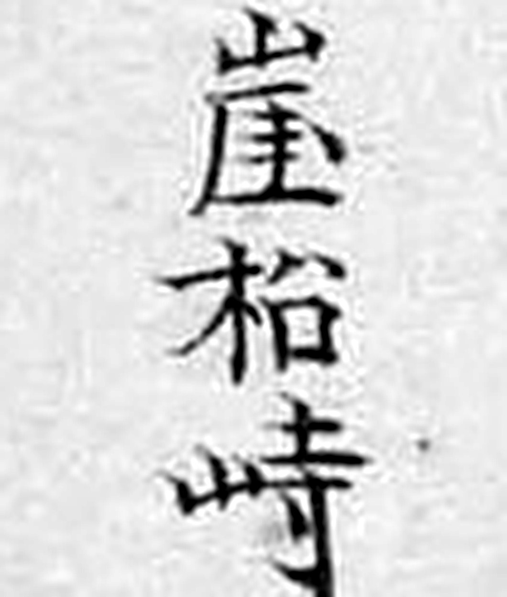 |
| (미상) | 子田峴 | 미비정 (갑천 동편) | 회덕현 동남 | 해동지도 회덕현 | — | **상** (2026-10-01) | 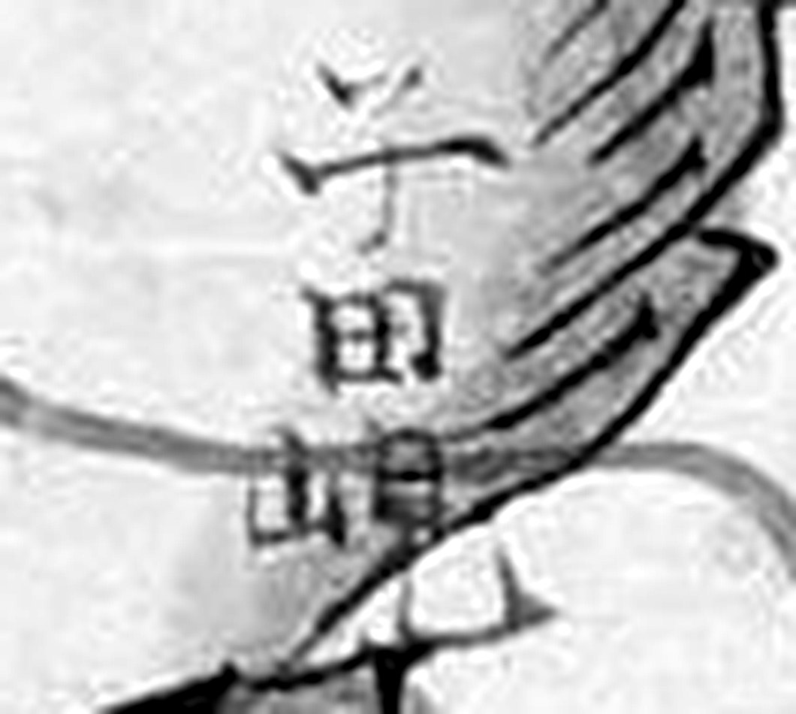 |
| (미상) | 子峴 | 미비정 | 회덕현 동남 | 해동지도 회덕현 | — | **상** (2026-10-01) | 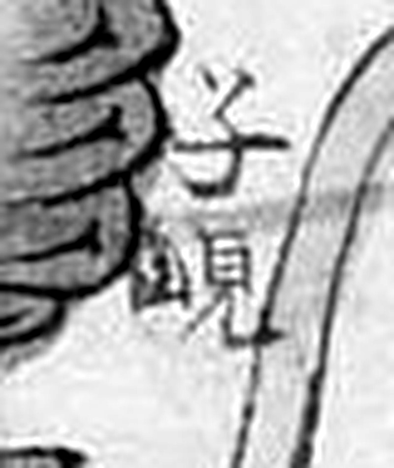 |
| 닭재 | 雞峙 / **雞峴** / 鷄峴 / 鷄峙 | 동구 삼괴동, 계현산성 아래 고개 | **고을 경계** (북쪽이 회덕인지 공주 산내면인지 미결) | 해동지도 회덕현 · **대동여지도 16-04**(1861) · 계현산성 지정자료 · **AMS 1:50,000 Taejon**(저본 1919) | — | **상** | 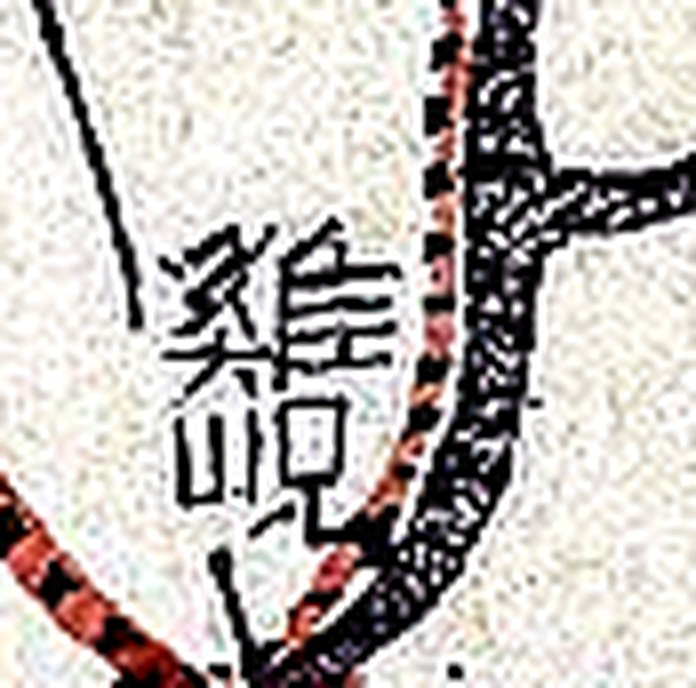 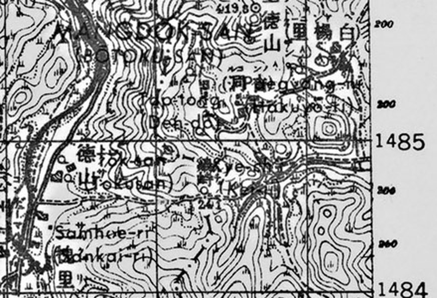 |
| (미상) | 于峙**領**〔?〕 | 미비정 (식장산 북쪽) | 회덕현 동북 | 해동지도 회덕현 | — | **하** | 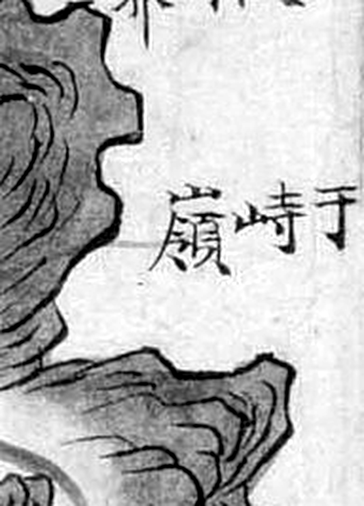 |
| (미상) '밤고개'? | 栗峙 / **栗寺**〔?〕 | 미비정 — 유성구 북부 추정 | **공주목 구즉면** 일대 | 해동지도 공주목 | — | **하** · [6.6](#66-栗峙-인가-栗寺-인가--둘째-글자) | 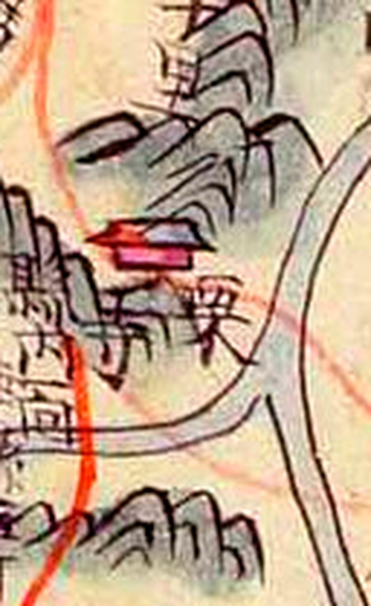 |
| (미상) '새재'? | 新峙 | 미비정 — **진산군 북면, 만인산·`彌勒寺` 아래의 공주 경계** | 진산군 북면 | 해동지도 진산군 | — | 중 · [6.7](#67-新峙-와-新目峙--한-도엽에-새재와-새목재가-함께-있는가) | 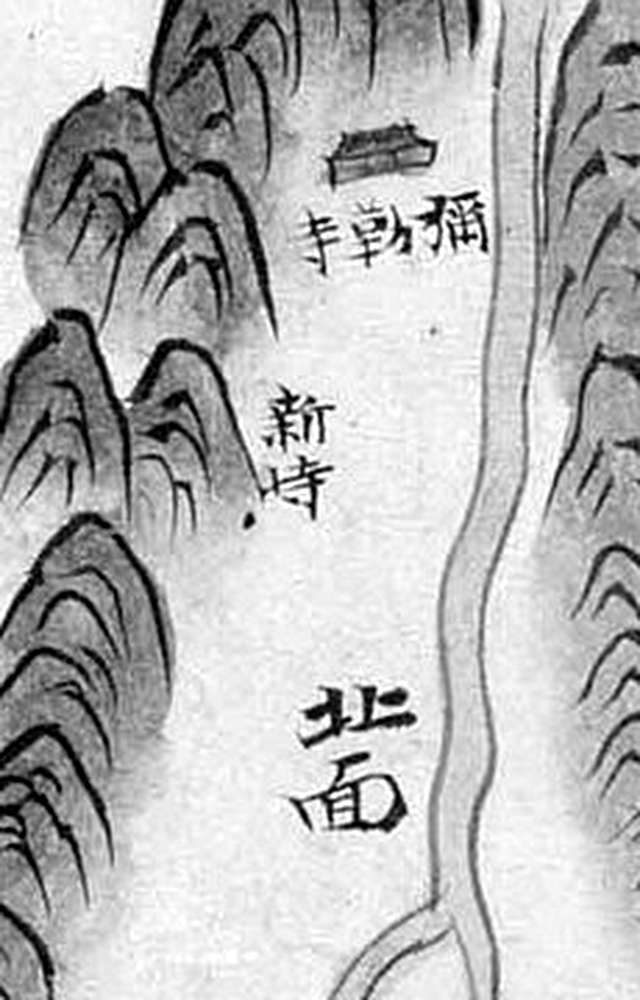 |
| (미상) **'새목재'?** | **新目峙** / **思睦峙** | 미비정 — 진산군 동쪽 끝, **서대산 서쪽 옥천 길** | 진산군 동이면 | **해동지도 진산군**(기문 `新目峙`) · **1872 진산군지도**(`思睦峙`) | — | **상** · [6.7](#67-新峙-와-新目峙--한-도엽에-새재와-새목재가-함께-있는가) | 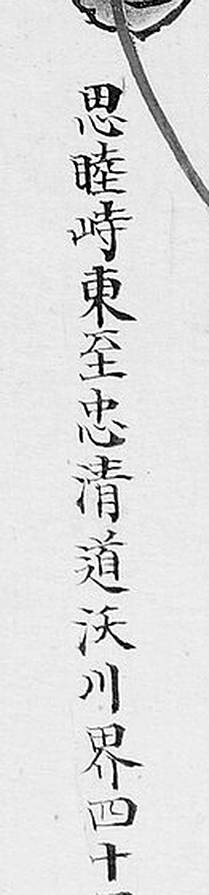 |
| (미상) **'말목'?** | **馬項** | 미비정 — 진산군 **서북, 공주 가는 `夾路`** | 진산군 | **1872 진산군지도** | — | **중상** | 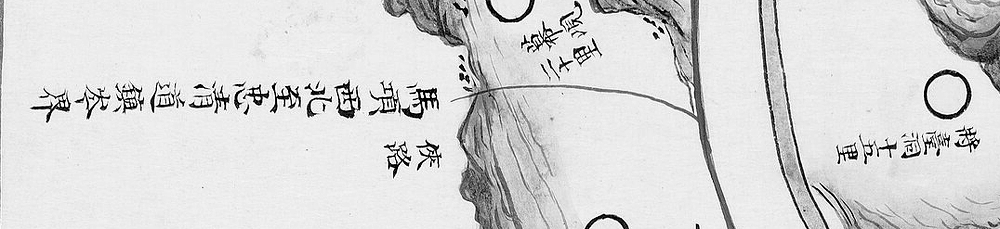 |
| **방고개** | **方古介** / 方古峙 / 方峴 | **금산군 복수면 방현리** (AMS 1034.2/1473.5) | 진산군 (연산계 방면) | 해동지도 진산군(기문·그림) · 1872 진산군지도 · **AMS 1:50,000 Kumsan**(저본 1919, `方峴里`) | — | **상** · [14.7](#147-미군-ams-150000-kumsan6622-ii--진산복수추부-2026-10-01) | 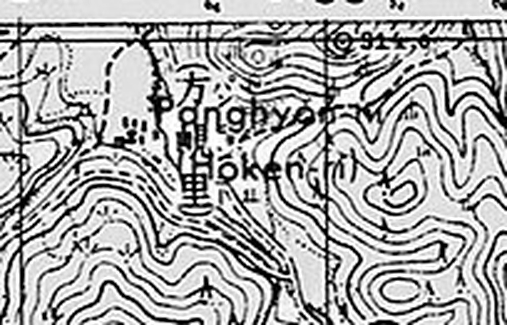 |
| (미상) | **炭峙** | **금산군 진산면·복수면 사이** (AMS 1038.2/1472.8) | 진산군 | **1872 진산군지도**(기문 고적 조) · **AMS 1:50,000 Kumsan**(저본 1919) | — | **중** · [14.7](#147-미군-ams-150000-kumsan6622-ii--진산복수추부-2026-10-01) | 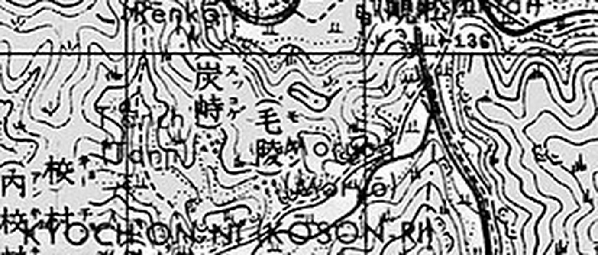 |
| **머들령** 〔삼괴동〕 | 馬達峙 / **馬達嶺** | **동구 삼괴동 ↔ 금산 추부면 요광리** (AMS 1048/1481, 고갯마루 **315 m**) | **공주목 산내면 ↔ 금산군** | **AMS 1:50,000 Taejon**(저본 1919) · **대동여지도 16-04**(1861, 13.5) | — | 상 · [15.3](#153-머들령--자리가-자료마다-갈립니다) | — |
| **마달령** 〔세천〕 | **馬達峙** | **동구 세천동 ↔ 옥천 군북면 증약리** | **회덕현 ↔ 옥천군**(도엽은 옥천 쪽) | **1872 옥천군지도**(0.27, 0.17) | — | 상 · [15.3](#153-머들령--자리가-자료마다-갈립니다) |  |
| (미상) | 奄峴 | 미비정 — 진잠 읍치 서쪽 | 진잠현 (읍치 서) | 1872 진잠지도 | — | 상 | 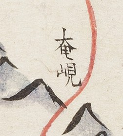 |
| (미상) | 牛拳峴 | 미비정 — **서구 장안동·봉곡동 남쪽** 추정 | 진잠현 상남면 (진산계 방면) | 1872 진잠지도 | — | 중 | 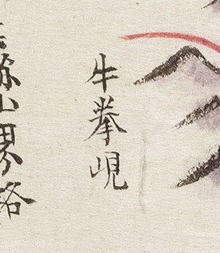 |
| **질티 / 길치** | 吉峙 / 質峙 / **迭峴**(비래동) · **陶峙**(비룡동) | **대덕구 비래동 ↔ 동구 추동**(대덕문화원) · **동구 비룡동 ↔ 가양동**(동구문화원) — 두 기록이 갈림 | 회덕현 東面 | **1872 회덕현지도 `吉峙`** · 국가유산포털 | — | 상 | 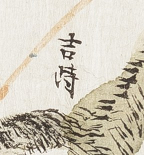 |
| (미상) '섶재'? | 薪峙 | **금산군 추부면 상·중·하신리 일대** (AMS 1047/1473 언저리) | 금산군 **서이면 = 지금 추부면** | 1872 금산군지도 · **AMS 1:50,000 Kumsan**(저본 1919, 둘레 리 이름 여섯 일치) | — | 상 | 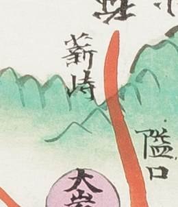 |
| (미상) | **海藍峙** | **금산군 추부면 동부** (AMS 1047.0/1472.3, 표고 **280**) | 금산군 서이면 | **AMS 1:50,000 Kumsan**(저본 1919) | — | **상** | 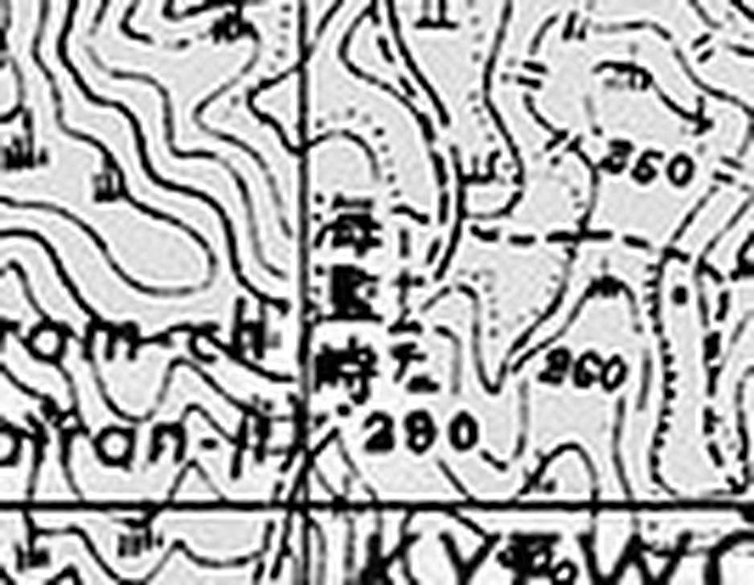 |
| (미상) | **月峰峙** | **금산군 금성면**, `月峯`(498) 북쪽 (AMS 1042.1/1468.2 ≈ **36°07.2′/127°25.7′**, 표고 **336**) | 금산군 | **AMS 1:50,000 Kumsan**(저본 1919) | — | **상** | 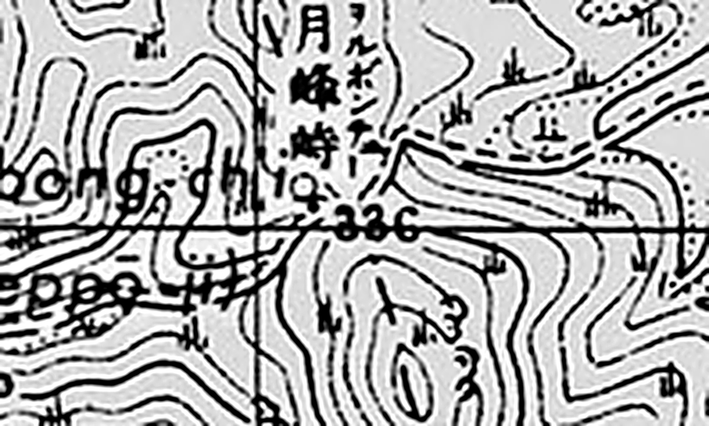 |
| (미상) | **松峴** | **금산군 금성면·남이면 쪽** (AMS 1043.1/1470.3 ≈ **36°08.1′/127°26.3′**, 표고 **247**) | 금산군 | **AMS 1:50,000 Kumsan**(저본 1919) | 2026-10-01 추가. **3장의 다른 `松峴` 둘(연기 서쪽·유성 방현동)과 이름만 같은 다른 고개** | **상** | 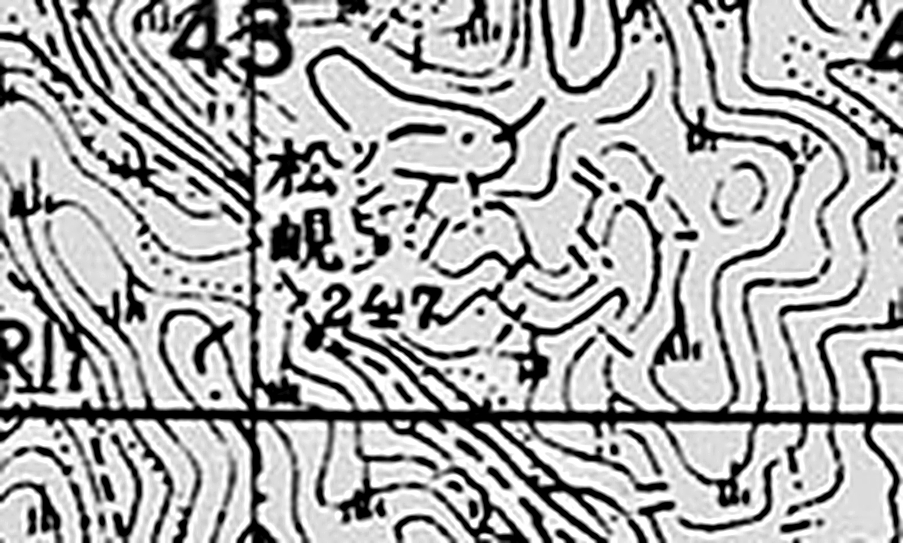 |
| (미상) | **石峴** | **금산군 추부면**, `城底` 동쪽 (AMS 1045.8/1471.5) | 금산군 서이면 | **1872 금산군지도**(`石峴里`) · **AMS 1:50,000 Kumsan**(저본 1919) | — | **상** | 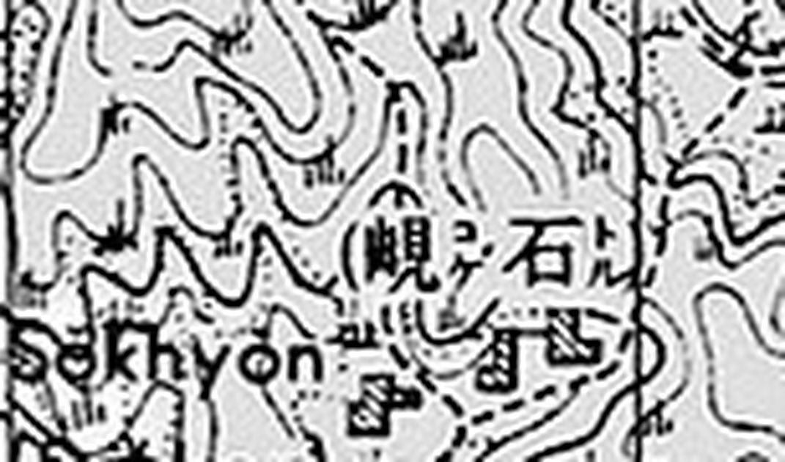 |
| (미상) **'솔재'?** | **松峙** / **松峴** | 미비정 — 연기현 서쪽, 공주 방면 | 연기현 | 해동지도 연기현(`松峙`) · **1872 연기현지도**(**`松峴店`** — 고개 아래 주막) | — | **상** | 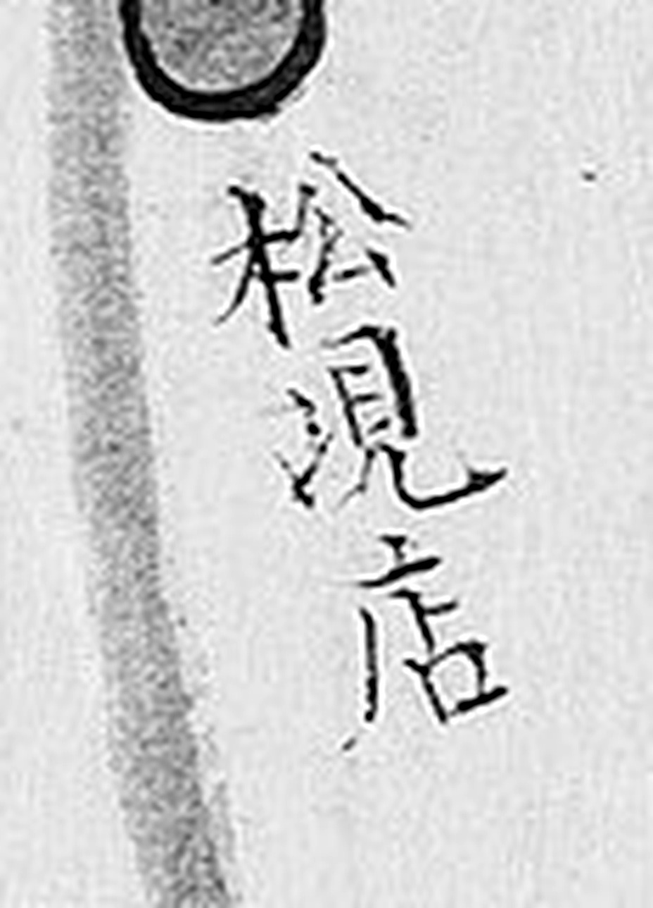 |
| (미상) **'작은솔재'?** | **小松峙** | 미비정 — 연기현 서쪽 | 연기현 | **1872 연기현지도** | — | **상** | 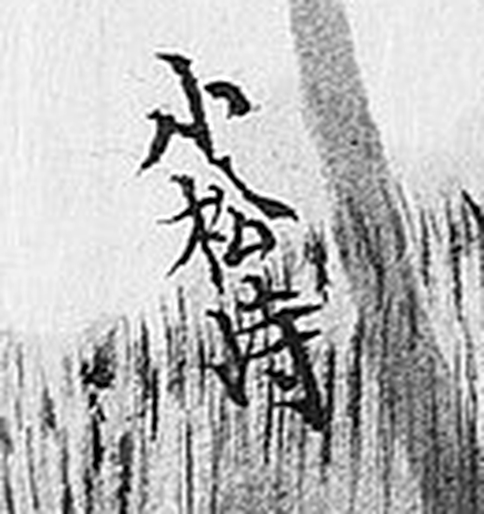 |
| **지프재** | 琵琶嶺 | 미비정 — 감암산(KANGAM-SAN) 북쪽 (AMS 1045/1487 ≈ **36°16.4′/127°27.3′**) | 동면/군북면 방면 | **AMS 1:50,000 Taejon**(저본 1919) | — | 상 | 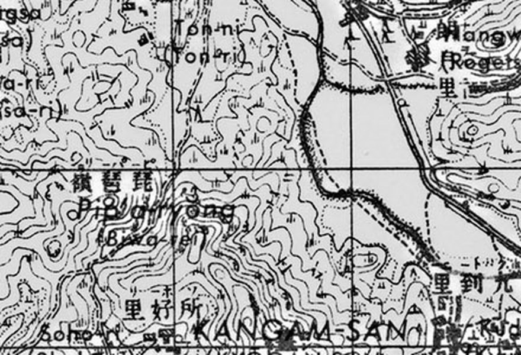 |
| **장고개 · 노루고개** | 獐峴 | 유성구 궁동 — 활골 서쪽, 충남대 정문 앞 | 진잠현? (미확인) | 유성문화원 지명유래 | — | 중 · [6.8](#68-獐峴장고개노루고개--궁동인가-둔곡동인가-2026-10-02) | **《대전지명지》는 궁동에 장고개를 적지 않습니다 — 둔곡동에 적습니다** |
| **도미재 · 덕미** | 道美峙 | 유성구 노은동 — 논골 남서쪽 | 공주목? (미확인) | 유성문화원 지명유래 | — | 중 | — |
| **솔고개** | 松峴 | 유성구 방현동 — 재밑 동남쪽 | 공주목? (미확인) | 유성문화원 지명유래 | — | 중 | — |
| **중고개** | 中峴 | 유성구 둔곡동 — 두니실 서쪽 | 공주목? (미확인) | 유성문화원 지명유래 | — | 중 | — |
| **절고개** (비래암고개·용자암고개) | 龍子庵峴 | **대덕구 비래동 ↔ 동구 추동 가래울**, 비래암 위 | 회덕현 東面 | 대덕문화원 전통마을 | — | 중 | — |
| **다롱고개 · 다른고개** | 月峴 | 대덕구 송촌동 — 금바위 ↔ 비래동 옥류각 | 회덕현 | 대덕문화원 전통마을 | — | 중 | — |
| **갬재** | 榛峴 | 대덕구 신대동 | 회덕현 | 대덕문화원 전통마을 | — | 중 | — |
| **찬샘골고개** | 冷泉峴 | 대덕구 갈전동 | 회덕현 | 대덕문화원 전통마을 | — | 중 | — |
| **배오개 · 배고개** | 梨峴 | 대덕구 이현동 — 배산 아래 | 회덕현 | 대덕문화원 전통마을 | — | 중 | — |
| **덕고개 · 덜골고개** | 德洞峴 / 德谷峴 | 대덕구 삼정동 ↔ 용호동 | 회덕현 | 대덕문화원 전통마을 | — | 중 | — |
| **구리고개** | 銅峴〔?〕 | 대덕구 미호동 — 지명산 남쪽 | 회덕현 | 대덕문화원 전통마을 | — | 하 | — |
| **진티고개** | 鎭峙 | 유성구 세동 | 진잠현 | 《대전지명지》(1994) | — | 중 | — |
| **대고개 · 댓고개 · 맑고개** | 大峴 | 서구 봉곡동 | 진잠현 상남면 | 《대전지명지》(1994) | — | 중 | — |
| **자모실고개** | 炭峴 / 沈峴 | **동구 삼정동 ↔ 옥천군 군북면 자모리**, 식장산 북쪽 | 회덕현 동북 | 《대전지명지》(1994) | — | 중 · [6.1](#61-于峙嶺--첫-글자-판독과-마달령설--5) | — |
| **느나미재** | 於南峙 | 중구 어남동 | 공주목 | 《대전지명지》(1994) | — | 중 | — |
| **안영고개** | 安永峴 | 중구 안영동 | 공주목 | 《대전지명지》(1994) | — | 중 | — |
| **남작골고개** | 南鵲峴 | 유성구 궁동 | 공주목 | 《대전지명지》(1994) | — | 중 | — |
| (미상) '곰재'? | **熊峙** | 미비정 — **연산현 동북**(진잠 방면), 길이 지남 | 연산현 | **1872 연산현지도** | — | **상**(글자) · 비정 없음 | 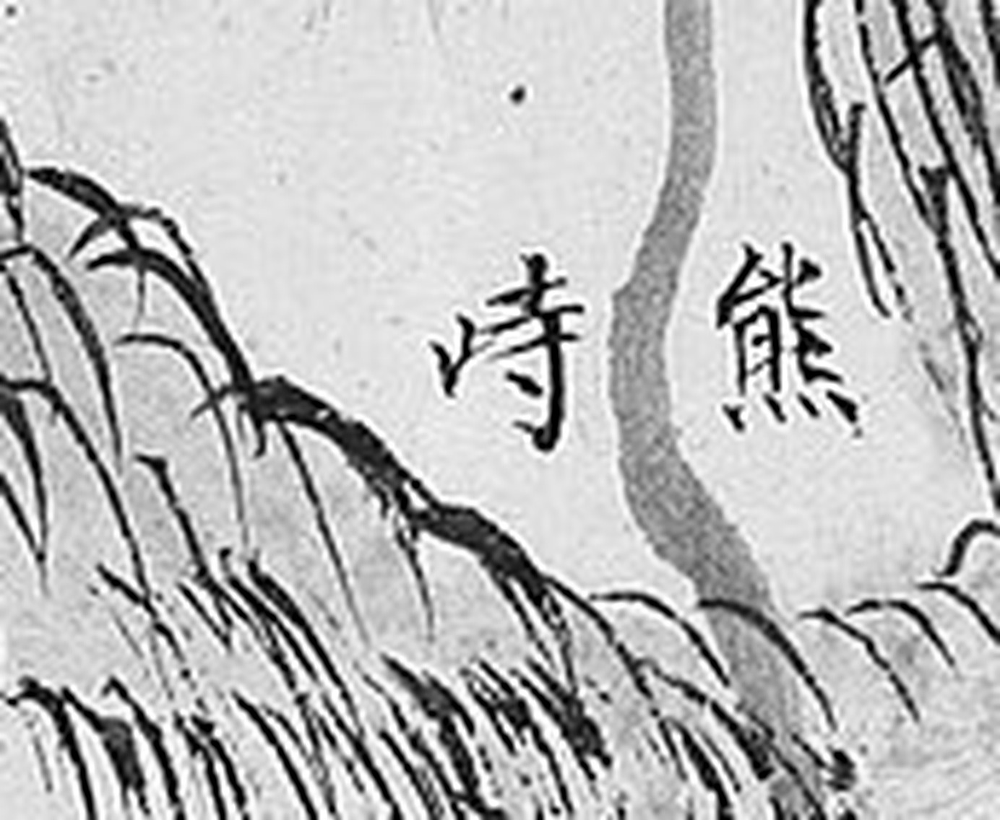 |
| (미상) | 望峙 | 미비정 — 대동리·만목리 사이 | 벌곡면 방면 | **AMS 1:50,000 Taejon**(저본 1919) | — | 상 | 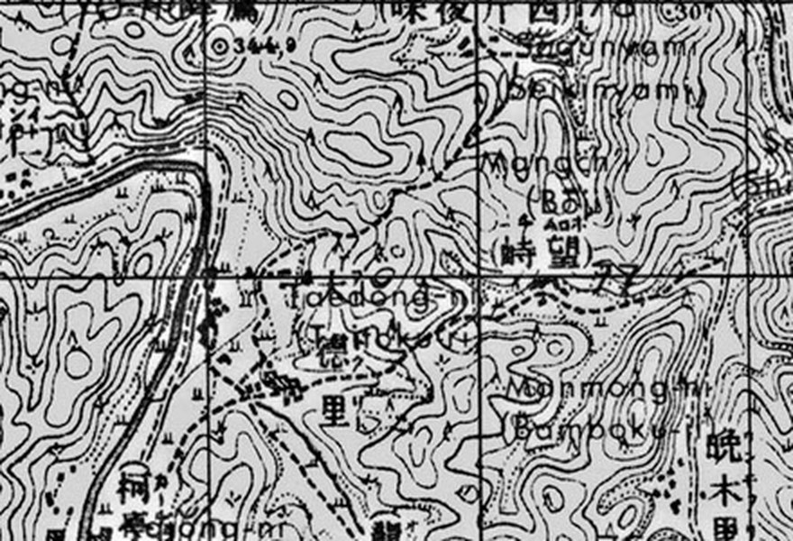 |
| **먹티** (묵티·택티) | 墨峙 | **동구 하소동**, 만인산 북쪽, 표고 **239** | 공주목 산내면 ↔ 진산군 북면 | **AMS 1:50,000 Taejon**(저본 1919) | — | 상 | 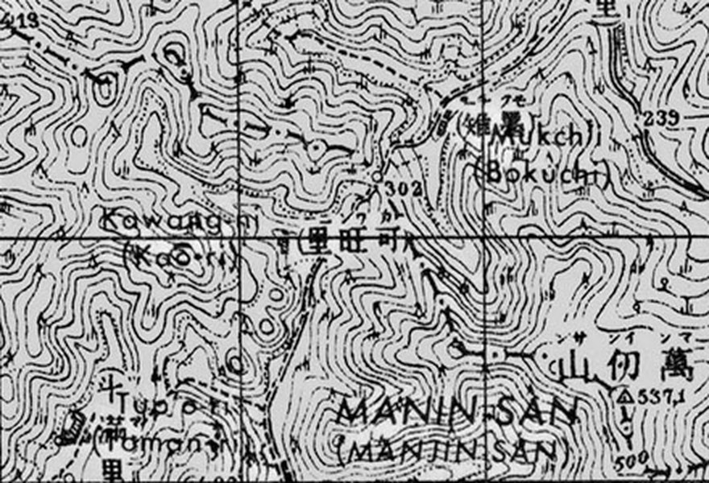 |
| (미상) | 介峙〔?〕 | 미비정 — 삼직천·학평 부근 | 진산면 방면 | **AMS 1:50,000 Taejon**(저본 1919) | — | 중 | 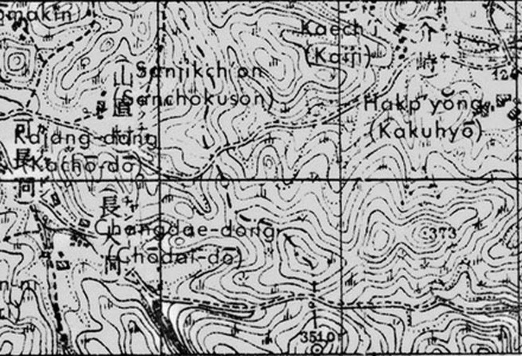 |
| (미상) | 〔?〕峙 | 미비정 — 용암(龍岩) 서쪽 (AMS **1027/1475** ≈ **36°10.6′/127°16.7′**) | 진산면 방면 | **AMS 1:50,000 Taejon**(저본 1919) | — | 중 | 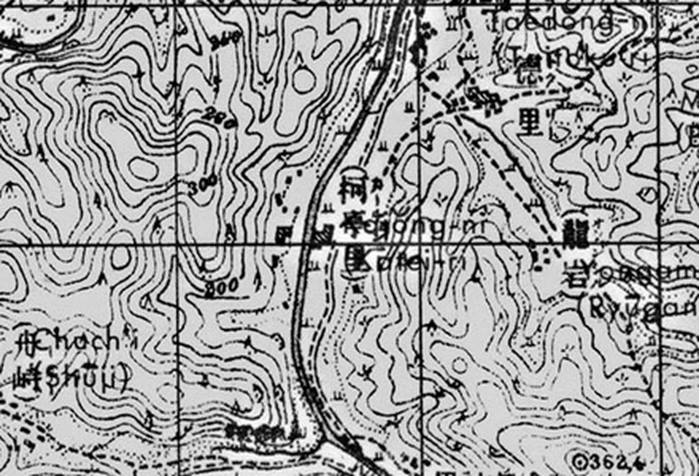 |
| (미상) | **□峙** | 미비정 — `五作谷` 남쪽, 도엽 서남 모서리 (AMS **1025/1475**, 표고 **273**) | 금산군 복수면 방면 | **AMS 1:50,000 Taejon**(저본 1919) | — | **중** · 로마자가 `P` 로 시작 | 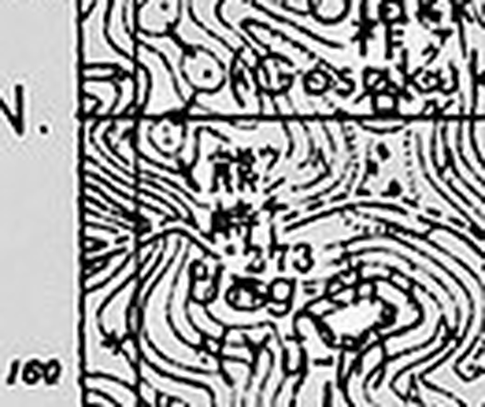 |

`삽재`의 조선시대 소속은 아직 확인하지 않았습니다 — 진잠현인지 공주목인지 갈립니다.
`닭재`는 1872년 지방지도 「진산군지도」의 `鷄峴`과 같은 고개인지 검토 중입니다 — **6.4** 참조.
`마달령`은 1872년 「옥천군지도」에서 `馬達峙` 로 확인되어 6 에서 올라왔습니다 — **12.4** 참조.
`奄峴`·`牛拳峴`은 **진잠 도엽에서 나온 첫 고개 둘**입니다 — **12.2** 참조.
**琵琶嶺·望峙·墨峙·介峙·〔?〕峙 다섯은 2026-10-01 에 미군 AMS 1:50,000 「Taejon」에서 새로
나온 것입니다** — **13** 참조. 이 도엽은 **1919년 발행 일본 1:50,000을 미군이 1945년에
그대로 베낀 것**이라 **1917년 측도 상태**를 보여 줍니다. 다만 **덧쓴 로마자는 1945년 시점의
표기**이므로 읽기는 그대로 믿지 마십시오(13 참조).

`薪峙` 는 1872년 「금산군지도」의 것이며(**12.6**), **해동지도 진산군의 `新峙` 와 같은 고개일
수 있습니다** — 둘 다 '신치'로 읽히지만 자리가 다를 수 있어 아직 두 줄로 둡니다(6.4·6.5).

**만인산 언저리에서 네 이름이 겹칩니다 — `新峙`·`薪峙`·`墨峙`·머들령.**
**2026-10-01 에 AMS 도엽의 그리드로 대조했습니다.**

| 이름 | 자료가 말하는 자리 | 대조 결과 |
|---|---|---|
| `墨峙` | **1043 / 1478**, 표고 **239** (13) | — |
| 머들령 | 동구 하소동 ↔ 금산 추부면 (5장) | **자리 일치** |
| `新峙` | 진산군 북면, **만인산 아래** (11.2) | 같은 축. 좌표가 없어 정밀 대조 불가 |
| `薪峙` | 금산군 西二面, `隘口` 아래 (12.6) | **별개로 보임** |

**`墨峙` 와 머들령은 자리가 맞습니다.**

- `墨峙`(1043/1478)는 **`萬仞山 537.1`(1043/1477) 바로 북쪽 한 칸**(≈900 m)입니다.
- 곁 마을이 `可旺里`·`斗滿里`·`柯亭里` — **셋 다 추부면**입니다(14.4).
- 넘어가는 두 끝이 **산내면(대전 동구 남부) ↔ 추부면**이고, 이는 머들령의 두 끝
  (동구 하소동 ↔ 추부면)과 **같습니다.**

**그런데 이름은 아직 못 맞췄습니다.** AMS 의 로마자 `Mukch'i` 는 **1945년에 덧쓴 것**이고,
14장이 이미 「덧쓴 로마자는 1945년 시점의 표기이므로 읽기를 그대로 믿지 말라」고 적어
두었습니다. **`Mukch'i` 가 한자음을 옮긴 것이라면, 「먹치」가 1919년 현지 발음이었다는
근거가 되지 못합니다** — 현지에서 「머들재」라 부르던 것을 한자 `墨`(먹)으로 적었을 여지가
남습니다. 그러면 `墨峙` = 머들령이 소리로도 이어집니다.

**~~`薪峙` 는 빼야 할 것 같습니다.~~** 1872년 「금산군지도」에서 `薪峙` 곁에 읽은 마을 여섯
(`上薪谷`·`下薪谷`·`大岩里`·`尾余坪`·`馬首里`·`隘口`)이 **AMS 「Taejon」 도엽의 지명 목록에
하나도 없다**는 것이 근거였습니다. 그래서 금산군 西二面 을 금산읍 서쪽, 곧 만인산 축과
다른 자리로 보았습니다.

> **2026-10-01 철회 — 엉뚱한 도엽을 본 것이었습니다.** 미군 1:50,000 **「Kumsan」(6622 II)**
> 도엽을 펼치자 그 마을들이 **여섯이나** 나왔습니다 — `上薪里`·`中薪里`·`下薪里` ·
> `大岩里` · `馬首里` · `石峴` · `瓦余里`(=`尾余坪`?). 모두 **추부면**입니다(14.7).
> **금산군 `西二面` 은 지금의 추부면**이고, 금산읍 **서쪽**이 아니라 **북서쪽**입니다.
> 그러면 `薪峙` 는 **1047/1473 언저리**, 곧 **만인산 동남·서대산 서쪽** — 바로 만인산
> 축입니다. 「없다」고 적기 전에 **옆 도엽을 펴 보았어야 했습니다.**

**`新峙` 는 만인산 반대편입니다 — 별개로 봅니다.** 해동지도 진산군 도엽(11.2)을 다시
보니 세 이름이 **위에서 아래로 차례로** 놓입니다.

```
萬伊山  (만인산)
  ↓
彌勒寺  (미륵사)
  ↓
新峙            ← 진산군 北面 안
```

**`新峙` 는 만인산 남쪽**, 그것도 미륵사보다 더 남쪽입니다. `墨峙` 는 만인산 **북쪽**이니
**둘은 산을 사이에 두고 반대편**입니다. 해동지도가 개략도이긴 하나, **만인산·미륵사라는
기준점 둘 사이의 차례가 뚜렷하므로** 같은 고개로 보기 어렵습니다.

`彌勒寺` 는 AMS 도엽에도 있습니다(`Miruk-sa`). 두 자료가 같은 절을 적고 있으니 **기준점이
맞물립니다.**

#### 정리 — 넷이 셋으로, 셋이 둘로

| 이름 | 판정 |
|---|---|
| `墨峙` ＝ **머들령** | **자리 일치.** 3장에서 한 줄로 합칩니다(확신 `중`) |
| `新峙` | **별개** — 만인산 **남쪽**, 진산군 北面 안 |
| `薪峙` | ~~별개 — 금산 西二面, AMS 도엽 바깥으로 보임~~ → **2026-10-01 철회.** 西二面은 **지금의 추부면**이고, `薪峙` 는 **1047/1473 언저리**, 곧 **만인산 동남쪽**입니다(14.7) |

> **2026-10-01 보탬 — 다섯째 이름이 있습니다.** 『해동지도』 진산군 **기문**의
> `新目峙`(= 1872년 `思睦峙`)는 **동쪽 옥천 길**의 고개로, **서대산 서쪽**입니다.
> 만인산 축이 아닙니다. 위 표의 `新峙`(그림, 만인산 남쪽)와 **이름이 비슷해 섞이기 쉬우나
> 자리가 다릅니다.** 둘이 실은 같은 것인지가 6.7 입니다.

**`墨峙` 를 머들령으로 비정하되 확신은 `중` 입니다.** 자리는 맞지만 **이름이 아직
맞지 않습니다** — `Mukch'i` 가 1945년에 덧쓴 한자음일 수 있다는 것이 지금으로서는
가정이고, 뒷받침할 자료를 아직 대지 못했습니다. **뒤집힐 수 있는 비정입니다.**

### 3.1 위치 대장 — **좌표를 둘 적습니다** (2026-10-01 신설)

**고개 하나에 좌표가 둘입니다.** 하나는 **땅 좌표**(경위도), 하나는 **도엽 자리**
(그 고개가 어느 옛 지도 어디에 적혀 있는가)입니다.

| | 무엇 | 꼴 | 무엇에 쓰나 |
|---|---|---|---|
| **땅 좌표** | 지구 위 어디인가 | 십진 위도, 경도 | **현대 지도에 찍기** · 거리 재기 · 같은 고개인지 가르기 |
| **도엽 자리** | **어느 도엽 어디**에 적혀 있나 | `도엽 (x, y)` 또는 도엽 제 좌표계 | **옛 지도 위에 찍기** · 다시 찾기 · 크롭 |

> **둘은 서로를 대신하지 못합니다.** 옛 고을지도는 **축척이 없습니다** — 산과 마을을
> 뜻에 맞게 늘이고 줄여 그린 그림이라, 도엽 자리에서 경위도를 뽑을 수 없습니다.
> 거꾸로 경위도만 적어 두면 **그 고개가 어느 도엽 어디에 적혀 있었는지**를 잃습니다.
> 그래서 **둘 다 적습니다.**

#### 급 — 좌표를 얼마나 믿을 것인가

| 급 | 어디서 왔나 | 오차 |
|---|---|---|
| **A** | 현대 자료가 **고갯마루 그 점**을 집어 줌 — 국토정보플랫폼, 또는 **OpenStreetMap 의 `natural=saddle` 점** | **±0.3 km** |
| **B** | **미군 AMS 1:50,000**(저본 1919) 그리드 환산 — [14.5-3](#145-3-그리드를-오늘-좌표로--대전지명지와-맞춰-보는-다리-2026-10-01) | **±1 km** |
| **C** | 지명 자료가 **동(洞)·면(面)까지만** 알려 줌 — 그 동의 **중심**을 적습니다 | **1~3 km** |
| **—** | 아직 어느 쪽도 없음 | — |

**2026-10-02 에 `A` 가 여섯 생겼습니다.** 지금 `A` 여섯, `B` 열여섯, `C` 열셋, `—` 열셋 —
**마흔여덟 가운데 서른다섯이 지도에 섭니다.** 어제는 열여섯이었습니다.

> **`A` 가운데 국토정보플랫폼에서 온 것은 아직 하나도 없습니다.** 여섯 다
> OpenStreetMap 의 고갯마루 점이고, 이는 **여럿이 함께 만드는 자료**이지 측량 성과가
> 아닙니다. 그래서 오차를 ±0.1 km 가 아니라 **±0.3 km** 로 적었습니다.
> **국토정보플랫폼으로 확인하는 일은 8장 4순위에 그대로 남아 있습니다** — 다만
> 할 일이 서른둘에서 스물여섯으로 줄었습니다.

> **`C` 급 좌표는 고개의 자리가 아닙니다.** 지명 자료가 「대덕구 송촌동」까지만
> 알려 줄 때, **그 동의 중심**을 적어 둔 것입니다. 「대덕구 비래동 ↔ 동구 추동」
> 처럼 두 끝이 적힌 것은 **두 중심의 중간점**을 적습니다 — 고개는 본디 둘 사이에
> 있기 때문입니다. 동 중심은 OpenStreetMap 의 `place` 점을 씁니다.
>
> **그러니 `C` 급 점은 「이 언저리」라는 뜻으로만 읽으십시오.** 지도에서 `C` 를
> **네모**로, `B` 를 **동그라미**로 달리 그린 까닭입니다. 1~3 km 틀릴 수 있고,
> 두 끝이 멀리 떨어진 `揷峙`(유성구 갑동 ↔ 공주시 반포면 온천리) 같은 것은
> 더 틀릴 수 있습니다. **`A` 급으로 올리는 것은 8장 4순위의 일입니다.**

#### 두 무리가 서로를 메웁니다 — 지도가 그것을 보여 줍니다

`B` 와 `C` 는 **출처가 다르고, 주는 것도 정반대**입니다.

| | 어디서 | 주는 것 | 못 주는 것 |
|---|---|---|---|
| **`B` 열여섯** | 옛 지도(AMS 도엽) | **자리** (±1 km) | **이름** — 열여섯 중 열하나가 아직 `(미상)`, 한자뿐 |
| **`A`+`C` 열아홉** | 《대전지명지》·문화원 「지명유래」 | **우리말 이름** — 열아홉이 다 섰습니다 | **자리** — 그 가운데 여섯만 고갯마루 점을 찾았습니다 |

**그리고 둘은 지도에서 자리까지 갈립니다.** `B` 는 **하나도 빠짐없이** AMS 도엽
네모 **안**에 있고, `A`·`C` 는 대부분 그 **밖**(북쪽 대전 시가·대덕·유성)입니다. 까닭은
[14.5-1](#145-1-도엽의-북쪽-끝은-대전역입니다--회덕계족산은-이-도엽에-없습니다-2026-10-01)
이 적은 그대로입니다 — **AMS 「Taejon」 도엽이 북위 36°20′ 에서 끝나** 그 북쪽은
환산할 저본이 없습니다. **급이 갈리는 것은 고개의 탓이 아니라 자료의 탓입니다.**

**이 둘을 맞붙이는 것이 6장·8장의 일입니다.**

#### OpenStreetMap 에 **고갯마루 점**이 있습니다 (2026-10-02)

바탕 지도를 깔면서 알게 된 것인데, OSM 은 고개를 `natural=saddle` 로 적어 둡니다.
《대전지명지》의 이름으로 물어 **여섯을 찾았습니다** — 모두 급 `C` 에서 `A` 로
올라갔습니다.

| 표제 | 한자 | 얻은 자리 | 비고의 동과 맞나 |
|---|---|---|---|
| 삽재 | `揷峙` | 36.3620 127.2721 | 유성구 갑동 서쪽, 공주 가는 길 — **맞음** |
| 절고개 | `龍子庵峴` | 36.3782 127.4528 | 비래동과 추동 **사이** — 맞음 |
| 덕고개 | `德洞峴` | 36.4301 127.4616 | 삼정동·용호동 남쪽 — 맞음 |
| 대고개 | `大峴` | 36.2794 127.3191 | 서구 봉곡동 북쪽 1.2 km — 맞음 |
| 안영고개 | `安永峴` | 36.2818 127.3693 | **OSM 은 서구로 적습니다**(중구 안영동 경계 위) |
| 배오개 | `梨峴` | 36.4144 127.4569 | OSM 이름은 **「배고개」** · 이현동 서쪽 — 맞음 |

> ⚠ **이름이 같다고 집어 오면 안 됩니다.** 찾은 것 가운데 **둘을 버렸습니다.**
>
> | 버린 것 | OSM 이 적은 자리 | 우리 비고 | 왜 버렸나 |
> |---|---|---|---|
> | 「솔고개」 | **중구 산성동** 36.2867 127.4045 | `松峴` 은 **유성구 방현동** | 딴 고개입니다 |
> | 「장고개」 | **동구 대청동** 36.3143 127.4987 (옥천·청주에도 하나씩) | `獐峴` 은 **유성구 궁동** | 딴 고개입니다 |
>
> **고개 이름은 흔합니다.** 「솔고개」·「장고개」·「절고개」는 한 시(市) 안에도 여럿입니다.
> 그래서 이름만 맞추지 않고 **비고에 적힌 구(區)·동(洞)까지 맞는 것만** 받았습니다.
> 2장의 자[尺] 원칙이 자료에도 그대로 듭니다 — **맞아 보이는 것과 맞는 것은 다릅니다.**
>
> 버린 둘은 **잃은 것이 아닙니다.** 중구에 「솔고개」가, 동구에 「장고개」가 따로 있다는
> 것은 5.1 의 323 건과 맞춰 볼 거리입니다 — 그 목록에 그 둘이 있는지가 다음 일입니다.

#### 파일 넷 가운데 **`.csv` 가 정본입니다**

| 파일 | 무엇 | 이름이 보이나 |
|---|---|---|
| [`고개-위치.csv`](고개-위치.csv) | 대장 그 자체 | **정본 — 고칠 때는 여기를 고칩니다** |
| [`고개-위치.svg`](고개-위치.svg) | **이름이 함께 찍힌 지도.** GitHub 이 그대로 그립니다 | **점 옆에 늘 보입니다** |
| [`고개-위치.geojson`](고개-위치.geojson) | 현대 지도용. GitHub 이 열면 **움직이는 지도**로 그립니다 | **점을 눌러야 뜹니다**(아래) |
| 아래 「대장」 표 | 읽기 좋으라고 둔 것 | — |

> **`.geojson` 은 상시 이름표를 달지 못합니다.** GitHub 의 지도는 Leaflet 이고,
> 점을 **누르면** 속성 표가 뜨는 방식입니다 — 이름을 늘 띄워 두는 기능이 없습니다.
> 그래서 **`name` 을 속성 맨 앞에** 두어 눌렀을 때 이름이 맨 위에 오게 했고,
> **늘 보이는 이름표는 `.svg` 쪽**에 두었습니다. 둘은 같은 `.csv` 에서 나옵니다.
>
> `.geojson` 의 `name` 은 **geojson.io · QGIS · Mapbox** 같은 다른 뷰어에서는
> 그대로 이름표가 됩니다 — 그 자리를 쓰는 것이 표준이기 때문입니다.

**점의 생김새가 한 가지를 더 말합니다** — **색이 찬 점은 우리말 이름이 선 것**,
**테두리만 있는 점은 아직 `(미상)`** 입니다. 열여섯 가운데 이름이 선 것은 다섯입니다.
**8장이 「막힌 곳은 판독이 아니라 이름」이라 한 것이 지도에서 그대로 보입니다.**

#### 바탕 지도 — 점만으로는 어디가 어디인지 모릅니다

점 열여섯만 떠 있으면 「그래서 이게 어디냐」에 답하지 못합니다. 그래서
`.svg` 에는 **OpenStreetMap 에서 받은 바탕**을 깔았습니다 — 물줄기 · 고속도로와
국도 · 철도 · **시·도 경계** · 산봉우리 · 오늘의 면 소재지 이름입니다.

가장 일을 많이 하는 것은 **시·도 경계**입니다. 파선 안쪽이 대전광역시이고,
**`지프재`와 `먹티`가 그 경계선 위에 앉아 있는 것이 한눈에 보입니다.** 고개는
본디 두 고을을 잇는 자리이니, 경계선과 고개가 겹치는 것은 우연이 아닙니다 —
**오늘의 시 경계가 옛 고을 경계를 상당히 물려받았다는 증거로 읽을 수 있습니다.**

| 재료 | 어디서 | 저장소의 어디에 |
|---|---|---|
| 물줄기·길·철도·산·지명 | OpenStreetMap **Overpass** | [`배경-osm.json`](배경-osm.json) |
| **대청호 · 대전광역시 경계** | OpenStreetMap **Nominatim** — 이미 꿰맨 다각형으로 줍니다 | 〃 |
| 급 `C` 고개의 동(洞) 중심 | OpenStreetMap **Nominatim** | [`고개-위치.csv`](고개-위치.csv) |
| 받아 추리는 스크립트 | — | [`fetch-osm.py`](fetch-osm.py) |

셋 다 **OpenStreetMap 기여자**의 자료이고 **ODbL** 입니다. 창구만 다릅니다 —
Overpass 는 조건으로 긁어 오기에, Nominatim 은 이름으로 하나 집어 오기에 낫습니다
([14.11](#1411-지도를-북쪽으로-넓히고-축척을-바로잡았습니다-2026-10-02) ④).

**바탕은 작업(Actions)이 받지 않습니다.** `배경-osm.json` 은 저장소에 들어 있고,
`fetch-osm.py` 는 몇 해에 한 번 **손으로** 돌립니다. 그림 한 장 그리자고 남의
공개 서버를 두드릴 일이 아니고, 더구나 그 서버가 막히면 그림이 아예 안 나오게
되기 때문입니다. (받아 보니 실제로 자주 끊겼습니다 — 14.10 참조.)

> **범례의 출처 표시(`© OpenStreetMap 기여자, ODbL`)를 지우지 마십시오.**
> ODbL 이 요구하는 것이고, 우리가 남의 자료를 쓰는 값입니다.

#### 세 사본은 손대지 마십시오 — 저절로 만들어집니다

`.geojson`·`.svg`·아래 「대장」 표 셋은 [`make-positions.py`](make-positions.py) 가
`.csv` 하나에서 만드는 **생성물**입니다. 손으로 고치면 다음 실행에서 덮어씁니다.
내용을 바꾸려면 **`고개-위치.csv` 를 고치십시오.**

그리고 그 실행은 GitHub 이 합니다. `고개-위치.csv` 를 고쳐 `main` 에 밀면 —
웹 화면에서 연필 단추로 고쳐도 마찬가지입니다 — 작업
[「고개 위치 사본 만들기」](../.github/workflows/positions.yml)가 이어서 돌아
셋을 다시 만들어 커밋합니다. 몇십 초 뒤 새로고침하면 지도에 반영되어 있습니다.
**돌리는 것을 잊어 지도와 대장이 어긋나는 일을 없애려고 둔 장치입니다.**

- 손으로 돌리려면 Actions 탭 → 「고개 위치 사본 만들기」 → `Run workflow`
- 내 컴퓨터에서 돌리려면 `research/` 에서 `python3 make-positions.py`
  (**표준 라이브러리만** 씁니다)

만든 뒤에 작업이 스스로 검사합니다 — 점 수가 대장과 맞는지, 좌표가 한반도 중부
안인지, 이름이 빈 점은 없는지, `.svg` 가 XML 로 열리는지. 하나라도 어긋나면
커밋하지 않고 빨갛게 멈춥니다.

**한 바퀴를 돌려 확인했습니다**(2026-10-01). 스크립트만 고쳐 밀었더니 작업이 사본
둘을 제 손으로 다시 만들어 밀었고, 그 결과가 같은 스크립트를 내 컴퓨터에서 돌린
것과 **한 글자도 다르지 않았습니다.** 작업이 민 커밋은 다시 작업을 부르지
않았습니다 — `paths` 로 막은 되돌이가 실제로 막혔습니다.

**`crop.py` 처럼 문서 안에 적어 두지 않고 파일로 둔 까닭** — 지도를 그리는 대목
(이름표가 서로 겹치지 않게 자리를 잡는 일)이 길어져서, 문서에 넣으면 문서가
읽히지 않습니다. 작업이 불러 쓰려면 파일이어야 한다는 사정도 더해졌습니다.

#### 대장

| 표제 | 한자 | 위도 | 경도 | 급 | 도엽 자리 | 비고 |
|---|---|---|---|---|---|---|
| 삽재 | `揷峙` | 36.3620 | 127.2721 | **A** | — | 유성구 갑동 ↔ 공주시 반포면 온천리 · 국토정보플랫폼 · OSM 고갯마루 점 · 갑동 서쪽, 공주 가는 길 |
| (미상) | `崖柏峙` | — | — | **—** | `해동 회덕 (0.167, 0.386)` | 회덕현 서북 |
| (미상) | `子田峴` | — | — | **—** | `해동 회덕 (0.542, 0.591)` | 회덕현 동남, 갑천 동편 |
| (미상) | `子峴` | — | — | **—** | `해동 회덕 (0.621, 0.620)` | 회덕현 동남 |
| 닭재 | `雞峙 / 雞峴` | 36.255 | 127.493 | **B** | `AMS Taejon 1048/1485` · `해동 회덕 (0.87, 0.64)` · `대동여지도 16-04 (0.75, 0.21)` | 동구 삼괴동, 계현산성 아래 |
| (미상) | `于峙領〔?〕` | — | — | **—** | `해동 회덕 (0.946, 0.370)` | 회덕현 동북, 식장산 북쪽 |
| (미상) '밤고개'? | `栗峙 / 栗寺〔?〕` | — | — | **—** | `해동 공주목 (0.51, 0.60)` | 공주목 구즉면 일대 |
| (미상) '새재'? | `新峙` | — | — | **—** | `해동 진산 (0.455, 0.310)` | 진산군 북면, 만인산·彌勒寺 아래 |
| (미상) '새목재'? | `新目峙 / 思睦峙` | — | — | **—** | `해동 진산 (0.71, 0.28)` · `1872 진산 (0.61, 0.87)` | 진산군 동쪽 끝, 서대산 서쪽 옥천 길 |
| (미상) '말목'? | `馬項` | — | — | **—** | `1872 진산 (0.87, 0.49)` | 진산군 서북, 공주 가는 夾路 |
| 방고개 | `方古介 / 方古峙 / 方峴` | 36.162 | 127.348 | **B** | `AMS Kumsan 1034/1474` · `해동 진산 (0.17, 0.47)` · `1872 진산 (0.64, 0.41)` | 금산군 복수면 방현리 |
| (미상) | `炭峙` | 36.156 | 127.389 | **B** | `AMS Kumsan 1038/1473` · `1872 진산 〔기문 고적 조〕` | 금산군 진산면·복수면 사이 |
| 머들령 〔삼괴동〕 | `馬達峙 / 馬達嶺` | 36.227 | 127.487 | **B** | `AMS Taejon 1048/1481` · `대동여지도 16-04 (0.80, 0.26)` | 동구 삼괴동 ↔ 금산 추부면 요광리, 표고 315 — 요광리 1.5 km · 삼괴동 2.5 km · 《대전지명지》 삼괴동에 「머들령 마을」이 있음 |
| 마달령 〔세천〕 | `馬達峙 / 馬達嶺` | 36.3356 | 127.5072 | **C** | `1872 옥천 (0.27, 0.17)` | 동구 세천동 ↔ 옥천 군북면 증약리 — 《대전지명지》 「세천 서쪽」 · 동구문화원 「증약굴 위」(15.5) · 두 동 중심의 중간점 · OSM 「마달령봉」(264 m)이 1.0 km |
| (미상) | `奄峴` | — | — | **—** | `1872 진잠 (0.51, 0.53)` | 진잠 읍치 서쪽 |
| (미상) | `牛拳峴` | — | — | **—** | `1872 진잠 (0.13, 0.61)` | 서구 장안동·봉곡동 남쪽 추정 |
| 질티 / 길치 | `吉峙 / 迭峴 / 陶峙` | 36.3678 | 127.4637 | **C** | `1872 회덕 (0.694, 0.253)` · `대동여지도 15-04 (0.75, 0.98)` | 대덕구 비래동 ↔ 동구 추동 / 동구 비룡동 ↔ 가양동 — 두 기록이 갈림 |
| (미상) '섶재'? | `薪峙` | 36.158 | 127.479 | **B** | `AMS Kumsan 1047/1473` · `1872 금산 (0.39, 0.30)` | 금산군 추부면 상·중·하신리 일대 |
| (미상) | `海藍峙` | 36.152 | 127.479 | **B** | `AMS Kumsan 1047/1472` | 금산군 추부면 동부, 표고 280 |
| (미상) | `月峰峙` | 36.118 | 127.429 | **B** | `AMS Kumsan 1042/1468` | 금산군 금성면, 月峯(498) 북쪽, 표고 336 |
| (미상) | `松峴〔금산〕` | 36.135 | 127.439 | **B** | `AMS Kumsan 1043/1470` | 금산군 금성면·남이면 쪽, 표고 247 |
| (미상) | `石峴` | 36.145 | 127.467 | **B** | `AMS Kumsan 1046/1472` · `1872 금산 〔石峴里〕` | 금산군 추부면, 城底 동쪽 |
| (미상) '솔재'? | `松峙 / 松峴〔연기〕` | — | — | **—** | `해동 연기 (0.287, 0.295)` · `1872 연기 (0.20, 0.21)` | 연기현 서쪽, 공주 방면 |
| (미상) '작은솔재'? | `小松峙` | — | — | **—** | `1872 연기 (0.21, 0.28)` | 연기현 서쪽 |
| 지프재 | `琵琶嶺` | 36.273 | 127.455 | **B** | `AMS Taejon 1045/1487` | 감암산 북쪽 — 15장의 「대별동 ↔ 소호동」과 2 km 어긋납니다 |
| 장고개 · 노루고개 | `獐峴` | 36.3665 | 127.3463 | **C** | — | 유성구 궁동 |
| 도미재 · 덕미 | `道美峙` | 36.3692 | 127.3189 | **C** | — | 유성구 노은동 |
| 솔고개 | `松峴〔유성〕` | 36.4093 | 127.3651 | **C** | — | 유성구 방현동 |
| 중고개 | `中峴` | 36.4585 | 127.3660 | **C** | — | 유성구 둔곡동 |
| 절고개 | `龍子庵峴` | 36.3782 | 127.4528 | **A** | — | 대덕구 비래동 ↔ 동구 추동 가래울 · OSM 고갯마루 점 · 비래동과 추동 사이 |
| 다롱고개 | `月峴` | 36.3648 | 127.4428 | **C** | — | 대덕구 송촌동 |
| 갬재 | `榛峴` | 36.3937 | 127.4163 | **C** | — | 대덕구 신대동 |
| 찬샘골고개 | `冷泉峴` | 36.4265 | 127.4694 | **C** | — | 대덕구 갈전동 |
| 배오개 | `梨峴` | 36.4144 | 127.4569 | **A** | — | 대덕구 이현동 · OSM 고갯마루 점 「배고개」 · 이현동 서쪽 |
| 덕고개 | `德洞峴 / 德谷峴` | 36.4301 | 127.4616 | **A** | — | 대덕구 삼정동 ↔ 용호동 · OSM 고갯마루 점 · 삼정동·용호동 남쪽 |
| 구리고개 | `銅峴〔?〕` | 36.4595 | 127.4715 | **C** | — | 대덕구 미호동 |
| 진티고개 | `鎭峙` | 36.3048 | 127.2727 | **C** | — | 유성구 세동 |
| 대고개 | `大峴` | 36.2794 | 127.3191 | **A** | — | 서구 봉곡동 · OSM 고갯마루 점 · 봉곡동 북쪽 1.2 km |
| 자모실고개 | `炭峴 / 沈峴` | 36.3394 | 127.5191 | **C** | — | 동구 삼정동 ↔ 옥천 군북면 자모리 |
| 느나미재 | `於南峙` | 36.2242 | 127.4133 | **C** | — | 중구 어남동 |
| 안영고개 | `安永峴` | 36.2818 | 127.3693 | **A** | — | 중구 안영동 · OSM 고갯마루 점 — 다만 OSM 은 서구로 적습니다(중구 경계 위) |
| 남작골고개 | `南鵲峴` | 36.3755 | 127.3483 | **C** | — | 유성구 궁동 ↔ 신성동 — 《대전지명지》가 양 끝을 적습니다 |
| (미상) '곰재'? | `熊峙` | — | — | **—** | `1872 연산 (0.645, 0.378)` | 연산현 동북, 진잠 방면 |
| (미상) | `望峙` | 36.192 | 127.308 | **B** | `AMS Taejon 1030/1477` | 大洞里·晩木里 사이 |
| 먹티 | `墨峙` | 36.202 | 127.439 | **B** | `AMS Taejon 1043/1478` | 동구 하소동, 표고 239 — 15장의 「먹티」와 합치 |
| (미상) | `介峙` | 36.181 | 127.384 | **B** | `AMS Taejon 1038/1476` | 三直川·鶴坪 부근 |
| (미상) | `〔?〕峙` | 36.177 | 127.279 | **B** | `AMS Taejon 1027/1475` | 龍岩 서쪽. 로마자 Chuch'i |
| (미상) | `□峙〔P…〕` | 36.172 | 127.258 | **B** | `AMS Taejon 1025/1475` | 五作谷 남쪽, Taejon 도엽 서남 모서리, 표고 273 |
| (미상) | `梨峙` | 36.121 | 127.343 | **B** | `AMS Kumsan 1034/1469` · `해동 진산 (0.03, 0.62)` | 진산면 ↔ 완주 운주면, 大芚山 동쪽, 표고 374 |

**읽는 법.** `도엽 자리` 의 `(x, y)` 는 **도엽의 폭과 높이를 각각 1로 본 상대 좌표**이고
왼쪽 위가 `(0, 0)` 입니다([`판독-기록-형식.md`](판독-기록-형식.md)). **도엽이 제
좌표계를 가졌으면 그것을 씁니다** — AMS 는 1,000 야드 방안 좌표(`1048/1485`)입니다.

**같은 고개가 도엽마다 다른 자리에 있습니다.** 그래야 맞습니다 — 도엽이 다르면
그림틀이 다릅니다. **땅 좌표가 하나인 것과 도엽 자리가 여럿인 것**이 이 대장의 짜임입니다.

## 4. 확정된 도엽 사실

고개 이름 말고도, 도엽을 읽는 데 먼저 알아야 하는 것들입니다. **여기 적힌 것은 근거를
갖춰 확정된 것뿐이고, 근거는 3부의 해당 도엽 절에 있습니다.**

### 4.1 방위 — 도엽마다 다릅니다

**《1872년 지방지도》는 북쪽이 위가 아닙니다. 도엽마다 다릅니다.** 좌표만 옮기고 방위를
확인하지 않으면 방향 해석이 통째로 뒤집힙니다 — 회덕에서 실제로 한 번 뒤집혔습니다.

| 도엽 | 위쪽 | 확인 근거 | 기록 |
|---|---|---|---|
| 「충청도 회덕현지도」 | **東** | `沃川界`(동남) 오른쪽 위, `新灘市`(북) 왼쪽, `文義界`(북서) 왼쪽 아래, `公州界`(남서) 오른쪽, `鷄足山`(읍 동 3리) 상단 | 12.1 |
| 「충청도 진잠산천방리도로지도」 | **西** | `珎山界`·`連山界` 가 위쪽 가장자리, `安平山`(남) 왼쪽, `分雞山`(북) 오른쪽, `豆磨川`(서) 위쪽 | 12.2 |
| 「충청도 공주목지도」 | **南** | 왼쪽 변 `東` 대자, 아래 변 `北` 대자와 `天安界`, 기문 `鷄龍山 在邑東南間四十里` 가 그림 배치와 일치 | 12.3 |
| 「전라도 진산군지도」 | **미확인** | — **아직 확인하지 않았습니다** | 12.5 |
| 「충청도 옥천군지도」 | 미확인 | — | 12.4 |
| 「전라도 금산군지도」 | 미확인 | — | 12.6 |

**한 도엽 안에서도 구역마다 글자가 상하 반전됩니다.** 돌려 보지 않으면 글자가 있는지조차
모릅니다 — "글자가 뭉개졌다"고 넘긴 자리에 지명이 있었습니다.

| 도엽 | 반전 구역 | 예 |
|---|---|---|
| 회덕현지도 | 남쪽(도엽 오른쪽) 주기 | 숭현사·영귀루·금운정, `三巨里店` |
| 공주목지도 | 계룡산 서쪽 (x 0.58–0.69, y 0.08–0.18) | `古王庵`·`連山界`·`□谷面` |
| 진산군지도 | 가장자리 주기 | `忠淸道連山界十里` |
| 진잠지도 | 남쪽 일부 | 금운정 주기 |

### 4.2 사지(四至)

| 고을 | 사지 | 기록 |
|---|---|---|
| 회덕현 | `沃川界二十里` · `文義界二十里` · `公州界十五里` — **고개 이름은 없습니다** | 12.1 |
| 회덕현(해동지도) | 東 `沃川界二十里` · 西 `公州界十里` · 南 **`珍山界三十里`** · 北 `文義界二十里`. **면별 거리표의 `外南面` 종경 30리와 남거가 일치** | 11.1 |
| 진잠현 | 북 `鶴下洞 公州界 十里` · 동 `介水院里 公州界 十里` · 남 `壯安里 珍山界 十五里` · 서 `月底里 連山界 十五里` | 12.2 |
| 공주목 | 동 `懷德界` · 남동 `鎭岑界` · 북 `天安界` · `連山界`(계룡산 주기) — **거리를 갖춘 형태로는 미확인** | 12.3 |
| 진산군 | 해동지도는 북 `公山界 三十里` · 1872년 도엽 가장자리에 `忠淸道連山界十里` | 11.2 · 12.5 |
| 옥천군(해동지도) | 東 `靑山界三十里` · **西 `懷德界二十里`** · 南 `永同界三十里` · 北 `文義界四十里` | 11.6.1 |
| 문의현(해동지도) | 東 `懷仁界十里` · 西 **`燕歧界卅里`** · **南 `懷德界十五里`** · 北 `淸州界十里`. 면별 거리표 일곱 면 전문 | 11.6.2 |
| 금산군(해동지도) | 東 `永同界四十里` · 西 `珎山界十五里` · 南 `龍潭界三十里` · 北 `沃川界五十里` | 11.4 |
| 연산현(해동지도) | 東 `珎山界五十里` · 西 `尼山界二十里` · 南 `恩津界二十里` · 北 `公州界二十里`. 가장자리에 **`鎭岑界` 두 번** | 11.6.4 |

**회덕과 공주는 서로를 이웃으로 적습니다** — 공주목 도엽에 `懷德界`, 회덕현지도에
`公州界十五里`. **진산은 회덕을 적지 않습니다** — 해동지도도, 1872년 도엽도. 이것이 6.4 의
핵심 논거입니다.

**2026-09-30 — 이웃이 서로를 적는 짝이 넷 확인됐습니다.**

| 짝 | 한쪽 | 다른 쪽 | 맞나 |
|---|---|---|---|
| 회덕 ↔ 옥천 | `東距沃川界二十里` | `西距懷德界二十里` | **거리까지 일치** ✓ |
| 회덕 ↔ 문의 | `北距文義界二十里` | `南距懷德界十五里` | 방향 일치, 거리 5리 차 |
| 회덕 ↔ 공주 | `西距公州界十里` | 가장자리 `懷德界` | ✓ |
| 진잠 ↔ 연산 | `西 月底里 連山界 十五里` | 가장자리 `鎭岑界` 두 번 | ✓ |
| **진잠 ↔ 진산** | 1872 진잠지도 `南 壯安里 珍山界 十五里` | **해동지도 진산군 기문 `晚目峙 鎭岑界`** | ✓ (2026-09-30) |

**⚠ 다만 일방 기록은 드물지 않습니다.** 같은 날 회인현 도엽이 `南距懷德界三十里` 로
회덕을 적는데 **회덕은 회인을 적지 않는 것**을 보았습니다(11.6.6). 사지는 **네 방향
대표만** 적으므로 한쪽만 적는 일이 자주 생깁니다. 그러니 「진산이 회덕을 적지 않는다」
자체는 약한 논거입니다.

**6.4 의 힘은 소극적 사실이 아니라 적극적 진술에 있습니다** — 진산 도엽은 북쪽을
**`公山界`(공주)라고 두 번 적습니다**(11.2). 「회덕을 빠뜨렸다」가 아니라 「북쪽은
공주다」라고 말하고 있는 것입니다.

### 4.3 「고개가 없다」로 확인된 곳

**없다고 확인한 것도 기록입니다.** 같은 자리를 두 번 훑지 않기 위해서입니다.

> ⚠ **「없다」는 그림과 리 목록을 **둘 다** 본 뒤에만 적습니다.**
> 2026-10-01 에 1872년 청주목지도의 면 주기 스물둘을 다 읽었더니,
> **그림 라벨에는 고개가 하나도 없는데 리 이름에는 여섯**(`德峴`·`巨峙`·`弓峴`·
> `悅峙`·`開峴`·`栢峴`)이 있었습니다(12.7.3). 같은 날 옥천·연기·회인·연산에서도
> 같은 일이 있었습니다. **1872년 계열은 고개를 그림에 그리지 않고 리 이름에
> 남깁니다.** 아래 표에서 「전면 훑기」라 적힌 것도 **그림만 본 것**이면
> 리 목록을 다시 봐야 합니다.

| 어디 | 결과 | 기록 |
|---|---|---|
| 공주목지도 **기문 산천 조** | 계룡산·태화산·창벽·웅진제단 넷뿐 — **고개가 하나도 없음.** 1872년 도엽은 고개를 기문이 아니라 그림에만 남긴 것으로 보임 | 12.3 |
| 회덕현지도 **기문** | 사지만 있고 고개 이름 없음 | 12.1 |
| 진잠지도 **전면** | `峴`·`峙`·`嶺` 표기는 넷(고개 둘 + 리 둘)이 전부 | 12.2 |
| 공주목지도 계룡산 일대·읍치·동쪽 가장자리 | `峴`·`峙` 없음 | 12.3 |
| 공주목지도 **산내면·유등천면 일대**(x 0.33–0.52, y 0.07–0.35) | 전면 훑기 — `峴`·`峙` **한 자도 없음.** 면 이름 셋·`鎭岑界`·창고 주기 둘뿐 (2026-09-30) | 12.3 |
| **해동지도** 공주목 동남단(x 0.44–0.66, y 0.50–0.81) | 훑기 — `栗`〔峙?〕 말고 `峙`·`峴` 없음. 대전 다섯 면이 다 들어가는 범위 (2026-09-30) | 11.3 |
| ~~**해동지도 옥천군 전체**~~ → **서쪽(회덕) 길만** | ~~`峙`·`峴`·`嶺` 이 한 자도 없음~~ → **2026-10-01 거둠.** 원본 크기로 다시 훑어 **`九也峙`**(0.395, 0.541)를 찾았습니다. 다만 **마달령 자리인 서쪽 길에는 여전히 고개 이름이 없습니다** | 11.6.1 |
| **해동지도 청주목** 남서 가장자리 | 고개 표기 없음. 대전과 직접 닿지도 않음(사이에 문의) (2026-09-30) | 11.6.3 |
| ~~**해동지도 연산현** 북동(진잠 접경) 가장자리~~ | ~~고개 표기 없음~~ → **2026-10-01 거둠.** (0.785, 0.475)에 **`□□峴`** 이 있습니다(`峴` 확신 상, 앞 두 자 미판독). `鎭岑界` 와 `珎山界` 사이입니다 | 11.6.4 |
| 회덕현지도 남부 | 고개 표기 없음 (찾던 질티는 **東面**에 있었음) | 12.1 |

### 4.4 이웃 고을의 고개 — 대전 밖이지만 길로 이어집니다

**3장은 대전의 고개만 싣습니다.** 그런데 2026-09-30 에 접경 도엽을 모두 훑으면서
**이웃 고을 땅의 고개**가 여럿 나왔습니다. 대전으로 드나드는 길목에 있거나, 대전 고개와
이름·글자가 겹쳐 견줄 거리가 되는 것들이라 여기에 모읍니다.

| 표기 | 고을 | 위치 | 출전 | 대전과의 관계 |
|---|---|---|---|---|
| **`弘峙`** | 문의현 | (0.45, 0.55) | 해동지도 문의현 (11.6.2) | **읍치에서 회덕으로 내려가는 축.** 좌상단 첨지가 **방어처**로 지목 |
| **`城峴`** | 문의현 | (0.33, 0.60) | 해동지도 문의현 (11.6.2) | **`弘峙` 보다 더 남쪽, 회덕계 쪽.** 문의→회덕 길에 고개가 둘입니다 (2026-10-01) |
| **`栗峴`** | 문의현 | (0.755, 0.536) | 해동지도 문의현 (11.6.2) | 읍치 **북쪽**(청주 방면). 붉은 길이 갈라지는 자리 (2026-10-01) |
| **`九也峙`** | 옥천군 | 해동 (0.395, 0.541) / 1872 (0.720, 0.595) | **두 계열 모두** (11.6.1 · 12.4) | 읍치 남동(영동·청산 방면). **120년을 건너 같은 이름·같은 자리** (2026-10-01) |
| **`問峙`** | 옥천군 | (0.744, 0.148) | 1872 옥천군지도 (12.4) | 읍치 북동, `金積山` 곁. 보은·회인 방면 (2026-10-01) |
| **`漏峴`** | 문의현 | (0.32, 0.38) | 1872 문의현지도 (12.7.1) | 붉은 길이 지남. `弘峙` 와 같은 고개인지 미결 |
| **`松峙`** | 금산군 | (0.69, 0.68) | 해동지도 금산군 (11.4) | 용담 방면. **11.4 의 `松`/`薪` 쟁점을 푼 고개** |
| **`柏子峙`** | 금산군 | (0.34, 0.68) | 해동지도 금산군 (11.4) | **`柏`+`子`** 가 한 이름에 — 6.3 의 근거 |
| **`薪峙`** | 금산군 | (0.61, 0.31) / 1872 (0.39, 0.30) | 두 계열 (11.4 · 12.6) | 진산계·서대산 서쪽. 곁에 **`隘口`** |
| **`方峴`** | 진산군 | (0.64, 0.41) | 1872 진산군지도 (12.5) | 해동지도의 `方古峙`(11.2)와 같은 고개로 보임 |
| `梨峙` · `炭峙` | 진산군 | 기문 고적 조 | 1872 진산군지도 (12.5) | `炭峙` 주기 「백제 때 **두 고개 사이**에 읍을 두어 관방을 돕고 신라 병사를 대비했다」 |
| `德目峙` | 연산현 | (0.87, 0.67) | 해동지도 연산현 (11.6.4) | 진산·전주 방면 |
| **`松峙`·`石峴`** | 연기현 | (0.287, 0.295) · (0.118, 0.383) | 해동지도 연기현 (11.6.5) | **서쪽 공주 방면**. 대전 쪽에는 없음. ~~`金沙峴`·`城峴`~~ 은 **2026-10-01 철회**(`峴` 이 아님) |
| `皮盤嶺`·`墨嶺`·`蘆嶺`·**`車嶺`** | 회인현 | 11.6.6 | 해동지도 회인현 | **넷 다 `嶺`** — 2026-10-01 에 `車嶺` 추가. **「고을마다 글자 버릇」의 유일한 강한 근거**이고, `墨嶺` 의 `山` 부수로 넷을 다 검사했습니다 |
| **`板峙嶺`** | 이산현 | (0.51, 0.36) | 해동지도 이산현 (11.6.7) | 대전과 닿지 않음. **2026-10-01 확정**(`杻` 후보 뺌) |
| `安坪峙` · **`馬達峙`** · `遠峙`〔?〕 | — | 16-04 (0.52, 0.25) · (0.80, 0.26) · (0.77, 0.03) | **대동여지도**(13.5) | 진잠 남쪽 · 만인산~서대산 사이 · 식장산 북동(옥천). **`馬達峙` 는 3장으로** (2026-10-01) |
| `赤峴` · `皮盤嶺` · **`墨峴`** · `潟峙`〔?〕 | 청주·회인·문의 | 15-04 (0.87, 0.60) · (0.89, 0.71) · (0.86, 0.80) · (0.81, 0.79) | **대동여지도**(13.3) | `皮盤嶺`·`墨峴` 은 **해동지도 회인현(11.6.6)과 맞물림**. **`墨峴` 을 3장의 `墨峙`(머들령 자리)와 섞지 않습니다** |
| `乃城岾`〔?〕 · `□郞岾`〔?〕 · `加岾`〔?〕 | — | 15-04 (0.49, 0.85)·(0.39, 0.70) · 16-04 (0.55, 0.62) | **대동여지도**(13.3 · 13.7) | **`岾`(재 점)** 을 쓴 예 셋 |
| `羅峙` · `唐突峙` · `瓦老峙`〔?〕 | 연산현 | 16-04 (0.45, 0.42)·(0.45, 0.50)·(0.37, 0.59) | **대동여지도**(13.7) | 연산 읍치 남쪽. 해동지도 연산현(11.6.4)에는 없던 것 |

**고을마다 글자 버릇이 다릅니다.** 회덕은 `峙`·`峴`, 진산·금산은 `峙`, **회인은 `嶺` 넷**.
같은 지형을 어느 글자로 적느냐가 고을을 따라 갈립니다 — **2장 표기 원칙에 걸리는
관찰**이고, 한 고개가 두 고을 도엽에 다른 글자로 나타날 수 있다는 뜻이기도 합니다
(6.4 의 `雞峙`/`鷄峴`).

> **2026-10-01 — 근거 하나를 거둡니다.** 여기에 「연기는 `峴` 셋에 `峙` 하나」를 들고
> 있었는데, 연기의 `金沙峴`·`城峴` 이 **`峴` 이 아닌 것**으로 갈렸습니다(11.6.5).
> 연기는 `峙` 하나·`峴` 하나가 되어 **버릇을 말할 거리가 되지 않습니다.**
> **회인의 `嶺` 넷(같은 날 `車嶺` 하나를 더 찾았습니다)이 이 관찰의 유일한 강한 근거**로
> 남았습니다. 나머지는
> 「고을마다 다르다」기보다 **「도엽마다 적은 수가 적다」** 일 수 있습니다.

**`石峴里`(금산군, 1872, (0.26, 0.34))는 고개 이름이 마을 이름으로 남은 예입니다**(12.6).
대전 쪽에서도 같은 일이 있었는지 견줄 거리가 됩니다.

---

# 2부 — 연구중인 것

## 5. 이름만 들어온 고개 — 채록 대기 · [#8](https://github.com/daehyang/daehyang.github.io/issues/8)

**3장에 올리기 전 단계입니다.** 이름과 대략의 자리는 들어왔으나 **옛 지도에서 아직 찾지
못한 것**을 여기 둡니다. 찾는 대로 3장으로 옮깁니다.

### 5.1 《대전지명지》(1994) 고개 323건 (2026-10-02 통합)

**대전 전역의 고개 이름이 한꺼번에 들어왔습니다.** 동 221쪽 가운데 **112개 동**에
`〔고개〕` 항목이 있고 모두 **323건**입니다. 자료 설명은 [16장](#16-대전지명지1994--대전-전역의-지명-2026-10-01-착수)에 있습니다.

**전체 목록은 [`대전지명지-고개-이름목록.md`](대전지명지-고개-이름목록.md) 에 구·동별로
두었습니다.** 여기에는 **우리 조사와 맞물리는 것만** 적습니다.

| 구 | 고개 | 한자 표기가 붙은 것 |
|---|---|---|
| 동구 | 134 | 6 |
| 중구 | 37 | 6 |
| 서구 | 19 | 8 |
| 유성구 | 81 | 6 |
| 대덕구 | 52 | 10 |
| **합** | **323** | **36**(이름 **35**) |

> **종전 299건은 끊기가 덜 된 것이었습니다.** 2026-10-01 에 뽑은 299건은 항목 경계를
> 문장 부호로만 끊어 **다음 항목 이름이 앞 항목 꼬리에 붙어** 있었습니다. 2026-10-02 에
> 〔갈래〕 표지를 항목 경계로 삼아 다시 끊으니 **323건**이 되었습니다. 한자 표기가 붙은
> 것도 **27 → 35** 로 늘었습니다.

#### 이 323건을 어떻게 쓰는가

**이름의 출전이지 자리의 출전이 아닙니다**(16장). 세 가지로만 씁니다.

1. 옛 지도에서 읽은 한자 고개에 **우리말 이름**을 붙인다
2. 우리말 고개에 **한자 표기**를 얻어, 옛 지도에서 무엇을 찾을지 정한다
3. 고개가 **잇는 두 끝**을 알아, 도엽의 **어디를 볼지** 좁힌다

**하지 않는 일** — 자리를 못 박는 것, 두 기록이 같은 고개인지 가르는 것.
그 일은 좌표와 표고가 있는 자료(14장 AMS, 국토정보플랫폼)로 합니다.

#### 한자 표기가 붙은 서른다섯

**`우리 기록과` 칸이 이 표의 쓸모입니다.** `새로`라 적힌 **열넷**이 이번에 처음 들어온
한자 고개입니다.

| 우리말 | 한자 | 구·동 | 자료가 말하는 자리 | 우리 기록과 |
|---|---|---|---|---|
| 금동현 | **`錦洞峴`** | 동구 상소동 | 큰골 ↔ 금동리 | **새로** |
| 질티 (길치·도치) | **`陶峙`** | 동구 비룡동 | 비름들 북서쪽 | 3장 질티 줄 · [16.4](#164-221쪽-전부를-받았습니다-2026-10-01) |
| 닭재 | **`鷄峴`** | 동구 삼괴동 | 닭산, 덕산 마을 뒤 | 3장 · [6.4](#64-雞峙해동지도-회덕현--鷄峴1872-진산군--닭재동구-삼괴동--4) |
| 자모실고개 | **`炭峴`·`沈峴`** | 동구 삼정동 | 옥천군 군북면 자모리로 넘음 | 3장 · [6.1](#61-于峙嶺--첫-글자-판독과-마달령설--5) |
| 절미고개 (질마고개) | **`鞍峴`** | 동구 사성동 | 덜미기 북쪽 | **새로** — 16.4 가 동을 못 적었던 것 |
| 머들령 | **`馬達嶺`** | 동구 세천동 | 세천 서쪽, **증약굴 위** | 3장 마달령 · **아래 「머들령이 셋」** |
| 솔고개 | **`松峴`** | 중구 무수동 | 무수동 ↔ 사정동 | **새로.** 3장의 `松峴` 셋과 **이름만 같은 다른 고개** |
| 솔고개 | **`松峴`** | 중구 사정동 | 행평 ↔ 무수리 | **새로.** 위 무수동 것과 **두 끝이 겹칩니다** |
| 느나미재 | **`於南峙`** | 중구 어남동 | 느나미 서쪽 | 3장 |
| 선골재 (선곡티) | **`仙谷峙`** | 중구 안영동 | 안영 ↔ 서구 기성동 선골 | **새로.** 아래 괴곡동 `仙谷峴` 과 짝 |
| 학고개 (하고개) | **`鶴峴`** | 중구 옥계동 | 옥계파출소 서쪽 | **새로** |
| 돌고개 (석티) | **`石峙`** | 중구 구완동 | 구완전 ↔ 신완전(동구 소호동) | **새로** — 16.4 가 동을 못 적었던 것 |
| 승적고개 | **`僧跡峴`** | 서구 도안동 | 가둔이 냇물 건너 | **새로** — 16.4 가 동을 못 적었던 것 |
| 독골재 | **`道洞峴`** | 서구 도마1동 | 원도마 서쪽 | **새로** — 16.4 가 동을 못 적었던 것 |
| 가루고개 | **`粉峴`** | 서구 갈마동 | 중뜸 ↔ 둔산 | **새로** — 16.4 가 동을 못 적었던 것 |
| 대고개 (댓고개·맑고개) | **`大峴`** | 서구 봉곡동 | 벌곡·내외금곡 ↔ 진잠 | 3장 |
| 불티고개 | **`火峙`·`佛峙`** | 서구 도마2동 | 도마동 ↔ 정림동 | **새로** |
| 불티고개 (불턱고재) | **`化峰`** | 서구 정림동 | 도마육교 있는 고개 | **새로.** 위 도마2동 것과 **이름이 같고 한자가 다릅니다** |
| 선골고재 | **`仙谷峴`** | 서구 괴곡동 | 선골 앞 ↔ **금산군 복수면 지량리** | **새로.** 안영동 `仙谷峙` 와 짝 |
| 안영고개 | **`安永峴`** | 서구 괴곡동 | 선골 ↔ 안영리 | 3장(중구 안영동으로 적었음) — **동이 어긋납니다** |
| 대곡리고개 | **`大谷峙`** | 유성구 덕진동 | 덕진 ↔ 구즉의 구룡동 | **새로** |
| 대곡티 | **`大谷峙`** | 유성구 구룡동 | 별락정 ↔ 덕진 쪽 | 위와 **같은 고개를 두 동에서 적은 것으로 보입니다** |
| 남작골고개 | **`南鵲峴`** | 유성구 신성동 | 신성 ↔ 충남대 음악관 쪽 남작골 | 3장(**궁동**으로 적었음) — **동이 어긋납니다** |
| 중고개 | **`中峴`** | 유성구 둔곡동 | 용머리 ↔ 백운사 | 3장 |
| 다릿골고개 | **`月谷峴`** | 유성구 봉산동 | 앞바구니 ↔ 구룡동 다릿골 | **새로** — 16.4 의 「릿골고개」가 이것 |
| 진티고개 | **`鎭峙`** | 유성구 세동 | 중세동 ↔ 성북동 | 3장 |
| 덕고개 (덕골고개) | **`德洞峴`·`德谷峴`** | 대덕구 삼정동 | 덕골 서쪽 | 3장 |
| 찬샴골고개 | **`冷泉峴`** | 대덕구 갈전동 | 아래갈밭 ↔ 덕고개 | 3장(찬샘골고개) |
| 구리고개 | **`銅峴`** | 대덕구 미호동 | 지명산 남쪽 | 3장(확신 `하`) — **자료가 둘이 되었습니다** |
| 배오개 (배고개) | **`梨峴`** | 대덕구 이현동 | 상봉 서남쪽 | 3장 |
| 길치고개 (질티고개) | **`迭峴`** | 대덕구 비래동 | 비래동 댕이 ↔ 동구 추동 주산 | 3장 질티 줄 · [16.4](#164-221쪽-전부를-받았습니다-2026-10-01) |
| 절고개 (비래암고개) | **`龍子庵峴`** | 대덕구 비래동 | 비래암 지나 동구 추동 가래울 | 3장 |
| 다롱고개 (다른고개) | **`月峴`** | 대덕구 송촌동 | 금바위 ↔ 비래동 비래암 | 3장 |
| 갬재 | **`榛峴`** | 대덕구 신대동 | 새터말 ↔ 동성산업 | 3장 |
| 사직고개 | **`社稷峴`** | 대덕구 연축동 | 읍내동 ↔ 연축동 경계 | **새로** — 16.4 가 동을 못 적었던 것 |

**3장을 아직 고치지 않았습니다.** 「동이 어긋납니다」로 적은 둘(`安永峴`·`南鵲峴`)은
**문화원 자료와 《대전지명지》가 서로 다른 동에 싣는 것**이라, 어느 쪽이 맞는지는 좌표로
가립니다. **섣불리 한쪽으로 고치지 않고 어긋난 채로 적어 둡니다.**

**「새로」 열넷은 [위치 대장](#31-위치-대장--좌표를-둘-적습니다-2026-10-01-신설)에도 아직
넣지 않았습니다.** 대장은 3장에 선 고개의 것이고, 이 열넷은 **어느 도엽에서도 아직 찾지
못했습니다** — 도엽 자리 칸을 채울 수가 없습니다. **도엽에서 하나를 찾으면 그때 3장으로
옮기고 대장에 한 줄을 더합니다.** 그때 경위도의 급은 `C`(동까지만)에서 출발합니다 —
《대전지명지》가 주는 것이 **동과 넘어가는 두 끝**까지이기 때문입니다.

#### 한자가 일부만 붙은 것 열넷

표제가 `○○(漢字-)` 꼴이라 **고개 글자(`峙`/`峴`/`嶺`)까지는 안 나온 것**입니다.
그래도 **앞 글자를 알면 옛 지도에서 찾을 수 있습니다.**

| 고개 | 한자 | 구·동 |
|---|---|---|
| 용네미 (용넘이) | `龍逾材`〔?〕 | 중구 무수동 |
| 맥김이재 | **`莫顯里`** | 서구 장안동 |
| 향청재 (상청재) | `鄕廳` | 유성구 원내동 |
| 동산고개 | `東山` | 유성구 덕진동 |
| 동산고재 | `東山` | 유성구 송강동 |
| 두니실고개 | `屯谷` | 유성구 봉산동 |
| 백산고개 | `白山` | 유성구 문지동 |
| 남선이고재 | `南仙` | 유성구 송정동 |
| 모정고개 | `茅亭` | 유성구 계산동 |
| 성재 | `城` | 유성구 장동 |
| 황서방고개 | `黃書傍` | 유성구 장동 |
| 달송고개 (하산디고개) | `達松` | 대덕구 용호동 |
| 덕운고개 | `德雲` | 대덕구 용호동 |
| 서낭당고개 (효평고개) | `城隍堂`·`孝坪` | 대덕구 이현동 |

#### `莫顯里`(장안동) 와 AMS `莫峴里` — 맞춰 볼 만합니다

**14.2 가 「고개 이름이 마을 이름이 된 것」으로 적어 둔 `莫峴里`·`上莫峴`(1036/1478)** 과
**《대전지명지》 서구 장안동의 `맥김이재(막현리 莫顯里)`** 가 이름에서 겹칩니다.

| | **확인된 것** | **아직 아닌 것** |
|---|---|---|
| 이름 | AMS 는 `莫峴里`, 《대전지명지》는 `莫顯里`. **`峴`/`顯` 이 갈립니다** | 두 표기가 같은 땅을 가리키는지 |
| 자리 | AMS 는 **1036/1478 언저리, 금산군 진산면·복수면 북부**(14.2). 장안동은 **서구 남부**로, 괴곡동 `仙谷峴` 이 **복수면 지량리**로 넘어가니 두 구역이 **맞닿습니다** | 장안동 고개가 시계 이쪽인지 저쪽인지 |
| 고개 | AMS 에는 **고개가 따로 표기되지 않았습니다** — 마을 이름뿐입니다(14.2) | `莫峴` 고개의 자리 |

**맞물릴 수 있다는 데까지입니다.** 맞는다면 `莫峴` 에 **우리말 이름(맥김이재)과 그리드**가
한꺼번에 붙습니다. **AMS 도엽에서 1036/1478 둘레를 다시 보는 것**이 다음 할 일입니다.

#### 옛 지도의 미비정 고개와 맞춰 보았습니다 — **풀린 것은 없습니다**

3장에 `(미상)`으로 남아 있는 고개들을 323건에 대 보았습니다.

| 옛 지도의 고개 | 323건에서 찾은 것 | 결과 |
|---|---|---|
| `奄峴` (1872 진잠, 읍치 서) | 성북동 `성재`·`읍내재`, 원내동 `향청재(鄕廳-)` | **못 찾음** — 셋 다 고개 한자 표기가 없습니다 |
| `牛拳峴` (1872 진잠, 상남면·진산계) | 장안동 `맥김이재(莫顯里)`, 괴곡동 `仙谷峴` | **못 찾음** — `牛拳` 과 겹치는 글자가 없습니다 |
| `栗峙`/`栗寺` (해동지도 공주목, 구즉면) | 유성 북부에 **'밤'계 고개 이름이 하나도 없습니다**(유일한 `밤고지고재` 는 동구 용계동) | **없음** |
| `崖柏峙`·`子峴`·`子田峴` (해동지도 회덕현) | '잣'계 **고개** 이름 없음. 다만 **마을 이름에 '잣'이 있습니다** — 아래 | **못 찾음** |
| `于峙嶺` (해동지도 회덕현) | '우티·우치'계 이름 없음 | **없음** |
| `新峙`·`薪峙` | '새재·섶재'계 이름 없음 | **없음** |
| `介峙` (AMS 1037/1476) | 동구 대청호 북부에 `개티`·`개티재`·`우괴티`·`괴티` 가 몰려 있음 | **자리가 다릅니다** — AMS `介峙` 는 진산면 방면 |
| `□峙` (AMS, 성북동 언저리) | 성북동 `성재(산징이재)`·`읍내재(움내재·학교뒷재)` | **글자를 읽기 전에는 못 맞춥니다**(16.2) |

**이 자료가 한자 고개의 우리말 이름을 풀어 주지는 못했습니다.** 들어온 것은 **반대
방향** — 우리말 고개에 붙은 **새 한자 표기 열넷**이고, 그것을 옛 지도에서 찾는 일이
남았습니다.

#### 같은 이름이 여러 동에 나옵니다 — 세는 법에 주의

| 이름 | 동 수 | 어디 |
|---|---|---|
| **장고개** | 7 | 동구 주촌동·내탑동·가양2동·세천동, 서구 오동·평촌동, 유성구 둔곡동 |
| **성재** | 6 | 동구 장척동·용운동, 서구 갈마동, 유성구 성북동·장동, 대덕구 부수동 |
| 솔고개 | 3 | 중구 무수동·사정동·금동 |
| 돌고개 | 3 | 중구 구완동, 대덕구 용호동·법동 |
| 언고개 | 3 | 중구 대별동·사정동, 동구 가오동 |
| 서낭당고개 | 3 | 유성구 덕진동, 서구 평촌동, 대덕구 이현동 |
| 삽재 · 고모재 · 독골재 · 갈고개 · 바람재 · 역골고개 · 불티고개 · 절고개 · 장판재 · 동산고개 · 남작골고개 · **머들령** | 각 2 | — |

**장을 보러 넘던 고개는 어느 고을에나 있었습니다.** `장고개`가 일곱, `성재`가 여섯이라는
것은 **고개가 일곱·여섯 개라는 뜻이지 같은 고개가 일곱 번 적혔다는 뜻이 아닙니다.**
반대로, **두 동이 한 고개를 양쪽에서 적은 것**도 있습니다(유성구 덕진동·구룡동의
`大谷峙`, 중구 무수동·사정동의 `松峴`). **두 경우를 가르는 것은 좌표이지 이름이 아닙니다.**

#### 머들령이 셋입니다

| 동 | 표제 | 자료가 말하는 자리 |
|---|---|---|
| 동구 **세천동** | **머들령(마달령 `馬達嶺`)** | **세천 서쪽, 증약굴 위.** 「고개가 험준하여 말도 겨우 넘는다 하여 `馬`·`達`」 |
| 동구 **삼괴동** | 마달령(머들령·마달현) | 마달산 아래, 공주말 ↔ **금산 추부면 요강리** |
| 동구 **신상동** | 머들령(머들렁) | 봉계 남쪽 |

**15.3 이 「자리가 자료마다 갈린다」고 적어 둔 것이, 한 자료 안에서도 갈립니다.**

| | |
|---|---|
| **확인된 것** | 《대전지명지》는 머들령을 **세 동에 따로 싣고**, 그 가운데 **둘을 마달령과 같은 것으로 적습니다.** 그런데 **두 곳이 넘어가는 끝이 다릅니다** — 세천동 쪽은 **옥천**(증약), 삼괴동 쪽은 **금산 추부면** |
| **아직 아닌 것** | 어느 것이 1872년 「옥천군지도」의 `馬達峙`(12.4)이고 어느 것이 AMS `馬達嶺`(1048/1481, 표고 315)인지. **셋이 다른 고개인지, 한 이름이 능선을 따라 퍼진 것인지도 모릅니다** |

**이 자료로는 못 가립니다** — 도면이 없기 때문입니다(16장). **AMS 그리드 1048/1481 둘레를
다시 보는 것**이 가리는 길입니다. 증약(增若)이 그 도엽에 있는지부터 봅니다.

##### 적어도 **둘은 다른 고개입니다** — OSM 에 `마달령봉` 이 있습니다 (2026-10-02)

바탕 지도를 받다가 걸렸습니다. **OpenStreetMap 에 「마달령봉」(264 m)이
`36.3433 / 127.5105` 에 있습니다.**

| 어디에서 | 거리 |
|---|---|
| **증약리**(옥천군 군북면) | **1.2 km** |
| 세천동 | 2.7 km |
| 비룡동 | 3.2 km |
| 삼괴동 | 11.1 km |
| **우리 대장의 `馬達嶺`**(AMS 1048/1481 환산, 36.227/127.487) | **13.1 km** |

**《대전지명지》 세천동 항목의 「증약굴 위」와 맞습니다** — 증약에서 1.2 km 입니다.
그러니 이 봉우리는 **세천 계열 머들령**의 자리를 가리킵니다.

**그렇다면 세천 계열과 삼괴동 계열은 13 km 떨어져 있습니다.** 위 표가
「한 이름이 능선을 따라 퍼진 것인가」를 물어 두었는데, **13 km 는 한 능선이
아닙니다.** 적어도 **둘은 서로 다른 고개**입니다. 셋째(신상동 봉계 남쪽)는
아직 모릅니다.

> ⚠ **두 가지는 조심해야 합니다.**
> ① **봉우리 이름이지 고개가 아닙니다.** 「마달령봉」이 있다는 것은 그 곁에
> 마달령이 있(었)다는 뜻이지, 그 점이 고갯마루라는 뜻이 아닙니다.
> ② **《대전지명지》가 제 안에서 어긋납니다** — 「세천 **서쪽**, 증약굴 위」라
> 적었는데, 증약도 마달령봉도 세천 **동쪽**입니다. 「서쪽」이 무엇을 기준으로
> 한 말인지 확인해야 합니다.

##### 그리고 **1872년 도엽의 `馬達峙` 도 북쪽입니다** — 대장을 두 줄로 갈랐습니다

도엽을 다시 보고 왔습니다([12.4](#124-충청도-옥천군지도--馬達峙-와-회덕-계족산-봉수-2026-09-30)).
그 크롭에 `馬達峙` 와 **`環山烽臺`** 가 **한 화면에 나란히** 있습니다 — 그 사이가
손가락 두 마디입니다.

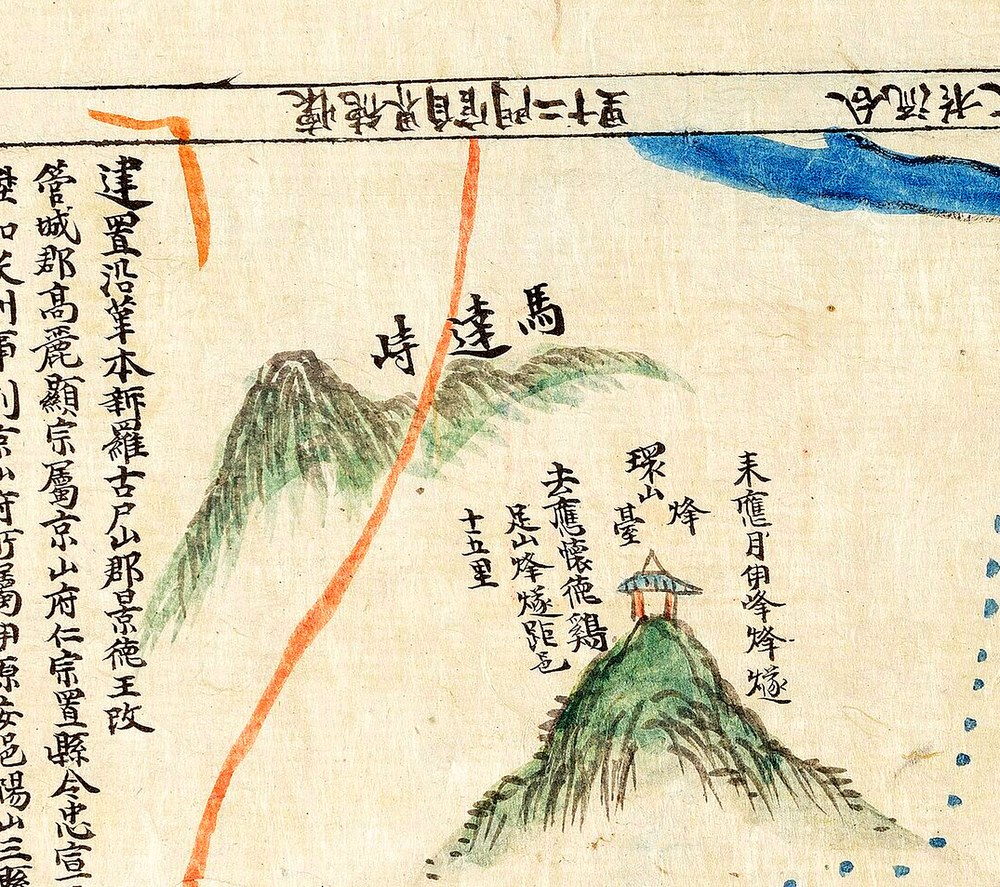

**`環山` 은 오늘의 환산(579 m, 36.3609/127.5431)입니다.** 거기서 재면 이렇습니다.

| 環山 에서 | 거리 |
|---|---|
| **마달령봉**(북쪽 계열) | **3.5 km** |
| 증약리 | 2.4 km |
| **우리 대장이 적어 둔 `馬達嶺`**(AMS 1048/1481 환산) | **15.7 km** |

**도엽이 둘을 나란히 그렸는데 3.5 km 는 나란하고 15.7 km 는 나란하지 않습니다.**
게다가 그 도엽의 `馬達峙` 에는 **붉은 길이 지나 북쪽(회덕 방면)으로 빠져나갑니다** —
옥천 읍치에서 **증약역**(`增若驛 距邑二十里`, 도엽에 있습니다)을 지나 회덕으로
가는 그 길입니다.

**그러므로 1872년 「옥천군지도」의 `馬達峙` 는 북쪽(증약·세천) 고개입니다.**

##### 남쪽 것도 따로 받쳐집니다

바탕 지도로 AMS 환산 좌표(36.227/127.487) 둘레를 재어 보니 —

| 둘레 | 거리 |
|---|---|
| **금산 추부면 요광리** | **1.5 km** |
| 삼괴동 | 2.5 km |
| 추부면 소재지 | 2.3 km |

**《대전지명지》 삼괴동 항목의 「공주말 ↔ 금산 추부면 요강리」와 그대로 맞습니다**
(`요강리` 는 오늘의 **요광리**로 보입니다). 두 계열이 **저마다 다른 자료로**
받쳐졌습니다.

##### 그래서 대장을 두 줄로 갈랐습니다 (2026-10-02)

| | 남쪽 — **머들령 〔삼괴동〕** | 북쪽 — **마달령 〔세천〕** |
|---|---|---|
| 좌표 | 36.227 / 127.487 (급 **B**) | 36.3356 / 127.5072 (급 **C**) |
| 어디서 | **AMS Taejon 1048/1481**(`馬達嶺`, 표고 315) · **대동여지도 16-04** (0.80, 0.26 — 「만인산~서대산 사이」) | **1872 옥천 (0.27, 0.17)**(`馬達峙`) |
| 받치는 지명 자료 | 《대전지명지》 **삼괴동** — 공주말 ↔ 금산 추부면 요광리 · **「머들령 마을」이 여기 있습니다** | 《대전지명지》 **세천동** — 「세천 서쪽」 · **동구문화원**(15.5) — 「증약굴 위」 |
| 곁에 있는 것 | 요광리 1.5 km | OSM 「마달령봉」 1.0 km · 증약 |

##### 이름은 **연구회가 쓰는 대로** 답니다 (2026-10-02)

**연구회(대향연)는 남쪽을 「머들령」, 북쪽을 「마달령」이라 부릅니다.** 표제를
그대로 따랐습니다 — 이 대장은 연구회의 것이고, **쓰는 이름이 곧 표제**입니다.

> ⚠ **《대전지명지》를 보고 오는 사람은 헷갈립니다.** 지명지는 두 이름을 양쪽에
> 다 달아 두는데, **앞에 내세운 이름이 연구회와 반대**입니다.
>
> | | 연구회 | 《대전지명지》가 앞세운 이름 |
> |---|---|---|
> | 남쪽(삼괴동) | **머들령** | 마달령(머들령·마달현) |
> | 북쪽(세천) | **마달령** | 머들령(마달령 `馬達嶺`) |
>
> **어느 쪽이 옳다는 말이 아닙니다** — 한 고개에 이름이 둘이고, 어느 것을
> 앞세우느냐가 갈릴 뿐입니다. 다만 **대조할 때 반드시 걸리는 자리**이므로
> 적어 둡니다. 「마달령」이라고만 적힌 자료를 만나면 **어느 쪽 마달령인지부터**
> 물어야 합니다.
>
> **덧붙여, 연구회 용법을 받쳐 주는 것이 지명지 안에 있습니다** — 《대전지명지》
> **삼괴동** 항목의 다른 두 줄이 **「머들령 마을」**을 기준점으로 씁니다
> (`구단고개` — 머들령 마을 ↔ 천주교공원묘원 · `신평고개` — 머들령 마을 ↔ 충주골).
> **삼괴동에는 「머들령」이라는 마을이 있습니다.** 고개 이름이 마을 이름이 된
> 14.2 의 꼴이고, 그 마을이 남쪽에 있으니 **남쪽을 머들령이라 부르는 것이
> 땅에 붙어 있습니다.**

> **한자는 둘을 갈라 주지 못합니다.** 남쪽은 AMS 가 `馬達嶺`, 북쪽은 1872년
> 도엽이 `馬達峙` 라 적었습니다 — **둘 다 `馬達`** 입니다. 5.1 이 「가르는 것은
> 좌표이지 이름이 아닙니다」라 한 것이 **한자에도 그대로** 듭니다.

**[3.1](#31-위치-대장--좌표를-둘-적습니다-2026-10-01-신설) 이 「둘 다 서면 대장에
두 줄로 나눈다」고 적어 둔 것을 처음 쓴 자리입니다.** 하나로 두면 **두 고개의
도엽 자리가 한 줄에 섞여**, 뒤에 보는 사람이 어느 도엽을 펴야 할지 알 수 없습니다.

> ⚠ **셋째(신상동 「머들령」, 봉계 남쪽)는 아직 자리를 모릅니다.** 세 줄이 될지
> 두 줄로 끝날지는 그것을 찾은 뒤입니다.
>
> ⚠ **[6.1](#61-于峙嶺--첫-글자-판독과-마달령설--5)(`于峙嶺` 마달령설)에 영향이
> 갑니다.** 거기서 말하는 「마달령」이 **둘 중 어느 쪽인지**를 다시 따져야 합니다 —
> `于峙嶺` 은 해동지도 회덕현 **동북, 식장산 북쪽**이라 **북쪽 계열에 가깝습니다.**

##### 도엽 자리 하나를 고쳤습니다

대장의 `1872 옥천` 자리가 **(0.21, 0.165)** 로 적혀 있었는데, 12.4 의 표와 크롭
파일 이름이 모두 **(0.27, 0.17)** 을 가리킵니다. **x 가 0.06 틀렸습니다** — 도엽
한 장이 가로 수천 px 이니 수백 px 어긋난 자리입니다. 고쳤습니다.

##### 비고의 「군서·군북면」도 덜 맞았습니다

남쪽 줄의 비고가 **「동구 삼괴동 ↔ 옥천 군서·군북면」**이었습니다. 그런데
옥천 군서면은 **6.0 km**, 금산 추부면은 **2.3 km** 입니다. **「군서·군북면」은
1872년 「옥천군지도」에서 따라온 말**인데, 그 도엽의 `馬達峙` 가 애초에
**북쪽 고개**였으니 남쪽 줄에 붙어 있을 까닭이 없었습니다.

**비고를 「동구 삼괴동 ↔ 금산 추부면 요광리」로 고쳤습니다.** 도엽 자리가
잘못 붙어 있으면 비고까지 함께 틀어진다는 것을 보여 주는 자리입니다.

#### 「잣」이 `城` 을 적습니다 — [6.3](#63-子잣와-柏잣나무) 에 보탬

유성구 **성북동(城北洞)** 을 이웃 동들이 **「잣디」**, 그 안쪽을 **「윗잣뒤」** 라 부릅니다.

- 교촌동 `선바위재` — 「교촌동 선바위 ↔ **잣디(城北洞)**」
- 세동 `불당재` — 「상세동 새뜸 ↔ 성북동 **윗잣뒤**」

| | |
|---|---|
| **확인된 것** | 대전 안에서 **'잣'이 `城` 을 적는 말로 실제로 쓰였습니다.** 유성구 장동의 `성재(城-)` 도 같은 갈래입니다 |
| **아직 아닌 것** | 회덕현의 `子峴`·`子田峴` 이 그 '잣'인지. **갈래가 하나 늘었다는 데까지입니다** |

6.3 은 금산 `柏子峙` 를 근거로 `子`·`柏` 을 **'잣나무'** 쪽으로 한 단계 올려 두었습니다.
**'잣'에 `城` 이라는 다른 뜻이 있다는 것은 그 추론을 뒤집지 않지만, 다른 길을 하나 엽니다.**
`子峴`·`子田峴` 둘 다 **갑천 동편 회덕현 동남**이고, 그 일대에 성이 여럿입니다.

#### 자료를 다루며 걸린 것 — **호환 한자**

원문에 `冷`(U+F92E)·`嶺`(U+F9AB) 처럼 **CJK 호환 한자**(U+F900~)가 섞여 있습니다.
**눈에는 똑같이 보이지만 `冷`(U+51B7)·`嶺`(U+5DBA)로 찾으면 걸리지 않습니다.**
이 때문에 `冷泉峴` 과 `馬達嶺` 을 한 번 놓쳤습니다. **한글 음이 둘인 한자**(嶺/령·영,
冷/랭·냉 따위)에서 주로 나타납니다. 다른 누리집 자료를 긁을 때도 **`NFKC` 로 펴고
나서** 찾으십시오.

### 5.2 출전을 아직 확인하지 않은 것

**현대 등산로 안내나 검색 요약에서 이름만 본 단계이니, 이 표를 근거로 쓰지 마십시오.**

| 이름 | 대략 위치 | 이름을 본 곳 |
|---|---|---|
| 동오리고개 | 식장산 일원 | 등산로 안내 |
| 갈현(葛峴) | 갈현성 일대 | 등산로 안내 |
| 능성 | 계족산성길 구간 | 등산로 안내 |

**질티고개와 절고개는 이웃이지만 다른 고개입니다.** 둘 다 대덕구 비래동 언저리이고, 계족산과
식장산 사이 능선에 여러 고개가 이어져 있습니다(절고개·질티고개·동오리고개·능성). **이름과
자리를 하나씩 떼어 두어야 뒤에 섞이지 않습니다.**

### 5.3 3장으로 올라간 것들 — 기록

- **2026-10-01 절고개.** 대덕문화원이 **`龍子庵峴`** 이라는 한자 표기와 「비래암 지나 동구
  추동 가래울로 넘어가는 고개」라는 자리를 줍니다(15.8). → **2026-10-02** 《대전지명지》가
  같은 표기를 같은 동에 싣습니다(5.1).
- **2026-10-01 머들령.** AMS 1:50,000 의 `墨峙`(1043/1478, 표고 239)와 자리가 일치한다고
  보아 올렸으나, 같은 날 **비정을 철회했습니다**(15.2). **2026-10-02 에 다시 갈라졌습니다** —
  위 「머들령이 셋」 참조.
- **2026-09-02 마달령.** 1872년 「옥천군지도」에 `馬達峙` 로 그려진 것을 확인했습니다(12.4).
- **2026-09-03 질티(질현).** 1872년 「회덕현지도」에서 표기 `吉峙`, 자리 (0.70, 0.26)으로
  확인했습니다(12.1).

## 6. 쟁점

### 6.1 `于峙嶺` — 첫 글자 판독과 마달령설 · [#5](https://github.com/daehyang/daehyang.github.io/issues/5)

**제기된 가설:** 해동지도 회덕현의 `于峙嶺`이 마달령(馬達嶺)의 당시 이름이다.

**검토 결과: 부정.** 근거 셋.

1. **행정구역.** 마달령의 이름은 아래 마을 마달리(馬達里)에서 왔고, 마달리는 조선시대
   **공주목 산내면** 소속입니다. 1914년 개편 때 "공주군 산내면의 소룡리·마달리·소호리
   일부와 **외남면 덕산리**를 병합하여 삼괴리"가 되었다는 기록이 이를 보여 줍니다 —
   회덕 외남면 땅은 따로 명시되어 있으니 마달리는 회덕이 아니었습니다. 즉 마달령은
   **공주–옥천 경계**의 고개이고, 회덕현 도엽에 그려질 이유가 없습니다.
2. **도엽상 위치.** `于峙嶺`은 식장산보다 **북쪽**입니다(11.1). 마달령은 식장산 **남쪽**입니다.
3. **도엽 내부 정합성.** 남동쪽 진산계 부근 고개 자리는 이미 `雞峙`가 차지하고 있고,
   마달령 방면은 도엽에서 `公州界` 바깥으로 처리되어 있습니다.

#### 2026-10-01 — 글자를 다시 봤습니다. **`牛` 는 아니고, 셋째는 `嶺` 이 아닐 수 있습니다**


커먼즈 사본(1,920 px)을 8배로 키워 우횡서로 오른쪽부터 읽었습니다.

| 글자 | 결과 |
|---|---|
| 첫째 | **`于`/`亐`.** 가로 둘에 갈고리 하나이고 **왼쪽 위에 `丿` 가 없습니다** → **`牛` 는 지웁니다** |
| 둘째 | **`峙`.** `山` 부수가 또렷합니다. 확신 **상** |
| 셋째 | **`山` 부수가 없습니다.** 오른쪽은 `頁` 가 분명한데 왼쪽에 `山` 이 보이지 않습니다 |

셋째 글자가 같은 사본·같은 크기의 회인현 `墨嶺`(11.6.6)과 **다릅니다** — 그쪽은
`山` 이 또렷합니다. 해상도 탓으로 보기 어렵습니다.

곧 **`于峙領`**〔?〕 일 수 있습니다. `領` 은 `嶺` 의 통용자이므로 **뜻은 그대로
「재」**이고, 2장에 글자 하나가 더 늘어납니다. 확신 `하`, 규장각 고해상본이 필요합니다.

**이 절의 물음이 「첫 글자」에서 「첫 글자와 셋째 글자」로 넓어졌습니다.**
다만 **마달령설 부정은 그대로**입니다 — 근거 셋이 글자가 아니라 자리와 행정구역에
기대고 있기 때문입니다.

**대안 후보: 질현(迭峴, 질티고개).**

| 표기 | 도엽 | 위치 | 크롭 |
|---|---|---|---|
| `吉峙` | 1872년 「충청도 회덕현지도」 | (0.70, 0.26) |  |

식장산 북쪽에서 회덕 읍치와 옥천을 잇던 옛 고개로,
고갯마루에 질현성(대전시 기념물)이 있습니다. 회덕 관련 기록에도 정민역(貞民驛)·형각진
(荊角津)과 함께 **질고개[質峙]**가 공주·연산·옥천·문의로 통하는 길목으로 나옵니다.
위치와 도로 관계가 맞습니다.

**다만 `于`는 `質`·`迭` 어느 쪽과도 음이 통하지 않습니다.** 같은 고개의 다른 표기인지,
질현과 별개인 북쪽 고개인지 미결입니다. 이것이 지금 이 조사의 핵심 미결 사항입니다.

**글자 판독 자체가 미결입니다.** 첫 글자는 `于`(우)로 읽히지만 `亐`·`牛`일 여지가 남아
있습니다. `牛`라면 '쇠고개/소재'가 되어 뜻이 완전히 달라집니다. `峙`와 `嶺`이 겹치는 것은
우리말 '우티'를 음차한 뒤 뜻(재)을 덧붙인 형태로 보입니다 — `于`는 이두·지명 표기에서
'우'를 적는 데 흔히 쓰입니다.

**`于峙嶺`이라는 표기를 접근 가능한 어느 온라인 자료에서도 찾지 못했습니다.** 색인되지
않았거나 이 지도 계열에만 남은 표기일 수 있습니다 — 사실이라면 오히려 기록할 값이 큽니다.

**2026-09-02 — 마달령설이 더 약해졌습니다.**

| 표기 | 도엽 | 위치 | 크롭 |
|---|---|---|---|
| `馬達峙` | 1872년 「충청도 옥천군지도」 | (0.27, 0.17) |  |

1872년 「옥천군지도」 북서부에서 `馬達峙` 를
확정했습니다(12.4, (0.27, 0.17)). 마달령이 **옥천군 쪽 도엽에 옥천 땅 고개로 그려져 있고**
홍선 도로가 그 위를 넘어갑니다. 회덕현 도엽의 `于峙嶺` 과는 도엽도 자리도 다릅니다.
위 1·2번 논거(행정구역·도엽상 위치)와 같은 방향입니다.

**2026-10-01 — 두 번째 자료가 나왔습니다.**

| 표기 | 도엽 | 위치 | 크롭 |
|---|---|---|---|
| `馬達嶺` / `Madal-lyŏng (Batatsu-rei)` | **미군 AMS 1:50,000 「Taejon」**(저본 1919년판, 1917 측도) | 그리드 1048/1481, **고갯마루 315 m**(2026-10-01 정정) | 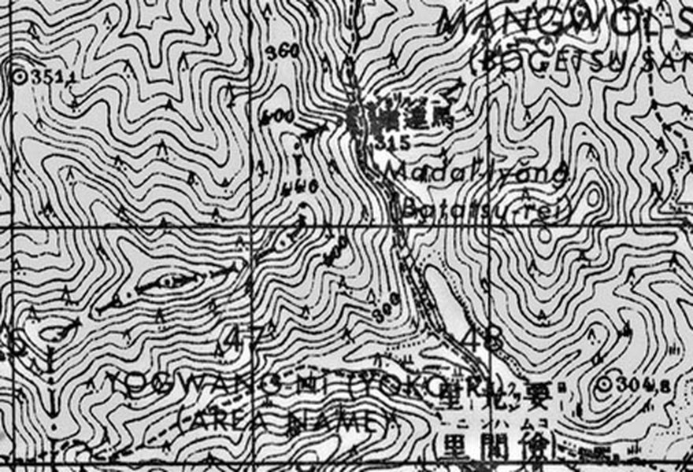 |

**서로 다른 계열의 도엽이 같은 고개를 같은 자리에 적었습니다.** 1872년 「옥천군지도」의
`馬達峙` 와 위치가 맞고, **표고 315 m** 라는 새 정보가 붙었습니다. 도엽에는 바로 북쪽에
`馬達里 Madal-li` 가 있어 **마을 이름에서 고개 이름이 왔다**는 1번 논거와도 맞습니다.

**그리고 이 도엽은 `于峙嶺` 자리(식장산 북쪽)에 마달령을 그리지 않습니다** — 마달령은
식장산 **남쪽**입니다. 마달령설을 부정하는 2번 논거가 제3의 도엽으로 다시 확인됩니다.

한편 **1:250,000 도엽은 같은 고개를 `MADO-RYŎNG` 으로 적어** `達`/`道` 가 갈립니다 — **14.4** 참조.

### 6.2 `子峴`·`子田峙` — 해동지도 좌상단 첨지 · [#6](https://github.com/daehyang/daehyang.github.io/issues/6)

도엽 좌상단에 **별도 종이를 붙인 첨지(貼紙)**가 있고 `子峴 子田峴 俱…`로 시작하는 세 줄이
적혀 있습니다. 뒷사람이 두 고개의 위치나 표기를 수정한 메모로 보입니다. 셋째 줄까지는
초서라 미판독.

**2026-09-03 에 원본을 열어 확인했습니다.** 두 고개는 도엽 본체에 분명히 있고, 붉은 도로가
둘 다 지납니다. 그동안 「본문은 `子田峙`, 첨지는 `子田峴` 으로 글자가 다르다」고 적어
두었는데, **저해상본에서는 본문도 `峴` 으로 읽힙니다**(`山`+`見`, 바로 옆 `子峴` 의 `峴` 과
자형이 같음). `峙`/`峴` 차이는 확인되지 않았습니다 — **고해상본 재확인이 필요합니다**
(확신 `중`).

#### 2026-09-30 — 이 첨지는 회덕만의 것이 아닙니다

접경 도엽을 훑다가 **같은 자리(좌상단)에 같은 형식의 첨지가 붙은 도엽을 둘 더**
찾았습니다(11.6).

| 도엽 | 첨지 내용 |
|---|---|
| 충청도 **문의현** | `鷹峯 弘峙 … 備禦處在 … 故添書` |
| 충청도 **청주목** | `諸嶺山 … 引頸山 助車山 備禦處在 是處 故添書` |

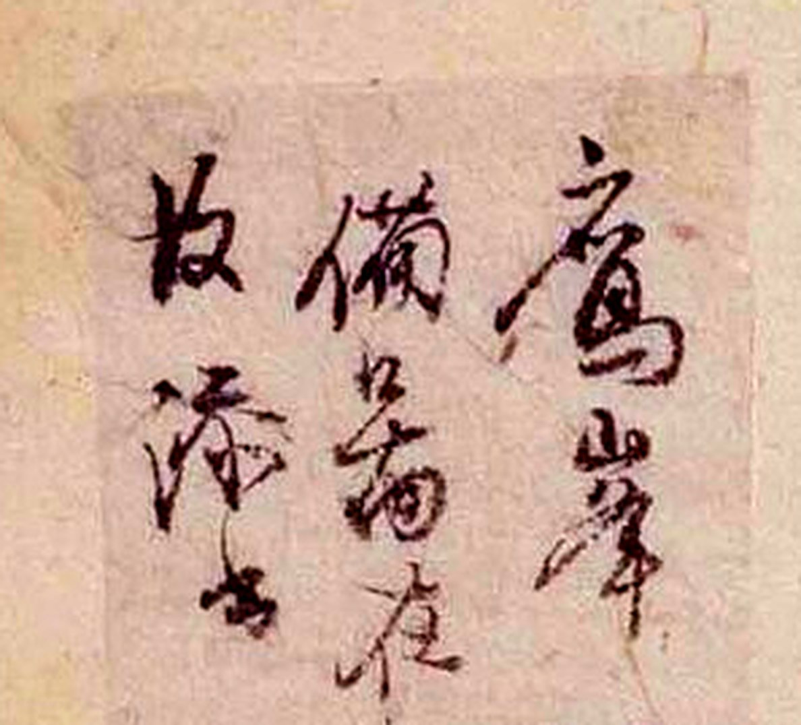

*문의현 첨지. 초서지만 **`備禦處`** 와 **`故添書`** 는 또렷합니다.*

**형식이 같습니다** — 「지명 둘(또는 여럿) + `備禦處` + `故添書`」. 곧 **뒷사람이 관방
(關防)의 눈으로 요해처를 골라 덧붙여 적은 것**입니다. 문의는 봉우리와 **고개**를,
청주는 산 셋을 골랐습니다.

**그러므로 회덕 첨지도 「고개 표기를 고친 메모」가 아니라 「`子峴`·`子田峴` 두 고개가
방어처임을 덧붙인 관방 기록」일 가능성이 큽니다.** 지금까지 이 문서는 첨지를 「뒷사람이
두 고개의 위치나 표기를 수정한 메모」로 보아 왔는데, **성격이 달라집니다** — 표기 수정이
아니라 **군사적 주기**라면, `峙`/`峴` 글자 차이를 여기서 따질 이유가 줄어듭니다.

**확정은 아닙니다.** 회덕 첨지의 셋째 줄이 여전히 미판독이고, 문의·청주 첨지도 초서
전문을 읽지 못했습니다. 다만 **읽을 방향이 잡혔습니다** — 세 첨지를 나란히 놓고 같은
글자꼴을 맞춰 보면 회덕 것도 풀립니다.

#### 2026-10-01 — 같은 형식인데 **쓰임이 둘로 갈립니다**

문의 도엽을 다시 훑다가 걸린 것입니다.

| 도엽 | 첨지가 든 곳 | 그 곳이 **그림 안에 있는가** |
|---|---|---|
| 충청도 **문의현** | `鷹峯` · `弘峙` | **둘 다 있습니다** — (0.40, 0.36) · (0.445, 0.54) |
| 충청도 **회덕현** | `子峴` · `子田峴` | **둘 다 없습니다** — 3장에서 아직 자리를 못 잡았습니다 |

그러면 첨지가 하는 일이 갈립니다.

- 문의 첨지 = 이미 그린 것 가운데 **요해처를 골라 지목**
- 회덕 첨지 = **그리지 않은 곳을 더해 적음**

둘 다 관방의 눈으로 쓴 글이라는 결론은 그대로입니다. 다만 **회덕 첨지는 `子峴`·`子田峴`
두 고개의 유일한 출전**이라는 무게가 더해집니다 — 그림이 받쳐 주지 않으므로,
이 두 고개는 **다른 자료(대동여지도·1872년·지리지)에서 찾아야 자리가 잡힙니다**.
13장 과제로 넘깁니다.

### 6.3 `子`(잣)와 `柏`(잣나무)

`崖柏峙`의 `柏`과 `子田峙`·`子峴`의 `子` 사이에 표기 관계가 있을 수 있습니다. '잣'을 음(`子`)과
뜻(`柏`)으로 나눠 적은 사례인지 확인해 볼 만합니다. **가설 단계이며 근거 없음.**

**2026-09-02 — 이웃 고을에도 `柏` 고개가 있습니다.** 공주목 동부 확대본에서 `柏峴`(?)을
읽었습니다(12.3, 확신 `하`). 회덕의 `崖柏峙`와 같은 글자를 씁니다. 두 곳이 가깝고 글자가
겹치므로, '잣'계 지명이 이 일대에 흩어져 있는 것인지 볼 만합니다. **다만 12.3 자체가 출전
미확정이라 지금은 단서로만 둡니다.**

**2026-09-30 — `柏子` 가 한 낱말로 쓰인 고개가 나왔습니다.** 해동지도 금산군 도엽 서남쪽
`高山界` 곁에 **`柏子峙`** 가 있습니다(11.4, 확신 `상`).

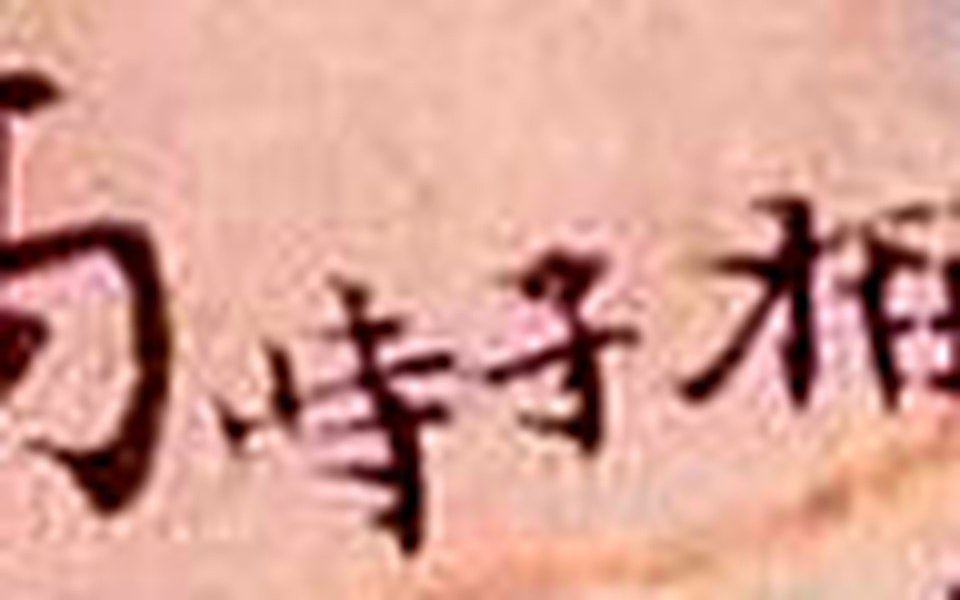

**이것이 가설을 한 단계 올립니다.** 지금까지는 `柏`(회덕 `崖柏峙`)과 `子`(회덕 `子峴`·
`子田峴`)가 **서로 다른 고개에** 따로 나와서, 같은 우리말을 달리 적은 것인지 알 길이
없었습니다. **`柏子峙` 는 한 이름 안에 둘을 함께 씁니다** — `柏子` 는 한문에서 '잣'
(잣나무 열매)을 가리키는 보통 낱말이므로, **이 일대에서 `柏`·`子` 가 '잣'을 적는 데
쓰였다**는 것이 도엽 하나로 보입니다.

**다만 회덕의 세 고개에 그대로 옮길 수는 없습니다.** 금산 `柏子峙` 는 한자 낱말을 그대로
쓴 것일 수 있고, 회덕의 `子峴`·`子田峴` 은 우리말을 음으로 적은 것일 수 있습니다.
**가설 단계를 벗어나지는 않되, 처음으로 근거가 생겼습니다.**

**2026-10-02 — '잣'에 `城` 이라는 다른 뜻이 있습니다.** 《대전지명지》에서 유성구
**성북동(城北洞)** 을 이웃 동들이 **「잣디」**, 그 안쪽을 **「윗잣뒤」** 라 부르는 것이
나왔습니다(교촌동 `선바위재`·세동 `불당재` 항목, [5.1](#잣이-城-을-적습니다--63-에-보탬)).
유성구 장동의 `성재(城-)` 도 같은 갈래입니다.

| | |
|---|---|
| **확인된 것** | 대전 안에서 **'잣'이 `城` 을 적는 말로 실제로 쓰였습니다** |
| **아직 아닌 것** | 회덕의 `子峴`·`子田峴` 이 그 '잣'인지 |

**이것이 `柏子` 쪽 근거를 뒤집지는 않습니다.** 다만 **갈래가 둘이 되었습니다** — '잣나무'
(`柏子`)와 '성'(`城`). `子峴`·`子田峴` 이 **갑천 동편 회덕현 동남**이고 그 일대에 성이
여럿이므로, **어느 쪽인지는 자리를 못 박은 뒤에야 가립니다.**

### 6.4 `雞峙`(해동지도 회덕현) = `鷄峴`(1872 진산군) = 닭재(동구 삼괴동)? · [#4](https://github.com/daehyang/daehyang.github.io/issues/4)

**제기된 가설:** 1872년 지방지도 「진산군지도」에 보이는 `鷄峴`이 해동지도 회덕현의 `雞峙`와
같은 고개다.

> ### 2026-09-30 — **`雞峴` 을 대동여지도에서 찾았습니다**
>
> **자리가 섰습니다.** 대동여지도 16-04 (0.75, 0.21), **`食藏山` 바로 남쪽**이고
> **고을 경계(붉은 점선) 위**입니다. 그 남서쪽이 `天庇山`·`萬仞山`(진산)입니다.
> 해동지도 회덕현이 동쪽 경계를 `食藏山` → `雞峙` → `珎山界` 순으로 적은 것(11.1)과
> **100여 년을 사이에 두고 그대로 맞습니다.** 자세한 것은 **13.6**.
>
> **그래서 6.4 의 물음이 둘로 갈립니다** — 「**어디에 있었나**」는 풀렸고,
> 「**누구 땅이었나**」는 남았습니다. 대동여지도는 고을 이름을 읍치에만 적으므로
> 계현 북쪽이 회덕인지 공주(산내면)인지는 이 도엽으로 갈리지 않습니다.
> 아래 글은 그 물음을 풀어 온 과정입니다.

**검토 결과: 유력했으나 새 사실이 나와 다시 열렸습니다.** 아래 "2026-09-02 에 달라진 것"을
먼저 보십시오. **2026-09-03 에 `懷德` 판독이 철회되어, 제보를 뒷받침하던 원본 근거가
사라졌습니다**(12.5).

들어맞는 것 —

1. **이름이 사실상 같습니다.** `雞`와 `鷄`는 이체자로 같은 글자이고, `峙`와 `峴`은 둘 다
   우리말 '재'를 적는 글자입니다. 표기 차이는 고을·필사자에 따른 흔들림 범위 안입니다.
2. **우리말 이름이 지금도 살아 있습니다.** 대전 동구 삼괴동에 **닭재**가 있고, 그 고갯마루
   북쪽 봉우리에 **계현산성(鷄峴山城)** — 대전광역시 기념물 제24호, 둘레 220m의 삼국시대
   산성 — 이 있습니다. 문화유산 지정 명칭 자체가 `鷄峴`입니다.
3. **넘어가는 방향이 맞습니다.** 계현산성은 금산군 **마전(馬田) 방면**의 추정리산성·금성산성과
   연결되어 그쪽에서 넘어오는 길을 막는 자리로 봅니다. 마전리는 **진산면 소재지**입니다.
   즉 닭재는 대전에서 진산으로 넘는 고개이고, 이것이 회덕과 진산 **양쪽 고을 지도에 각각
   그려질** 조건입니다.
4. **두 지도의 위치가 서로 마주 봅니다.** 해동지도 회덕현에서 `雞峙`는 남동쪽
   `珍山界` 접경에 있습니다(11.1). 진산군 쪽에서 보면 북쪽 경계가 됩니다.
5. **경계 고개의 전형입니다.** 1장에 적은 대로 회덕현 남쪽은 전라도 진산군과 접했습니다.
   도가 다른 두 고을의 지도에 같은 고개가 각각 나타나는 것은 자연스럽습니다.

아직 남은 것 —

- **1872년 「진산군지도」에서 `鷄峴` 을 아직 찾지 못했습니다.** 그 도엽 가장자리 주기는
  이렇습니다(12.5, 180° 돌려 놓은 것) —

  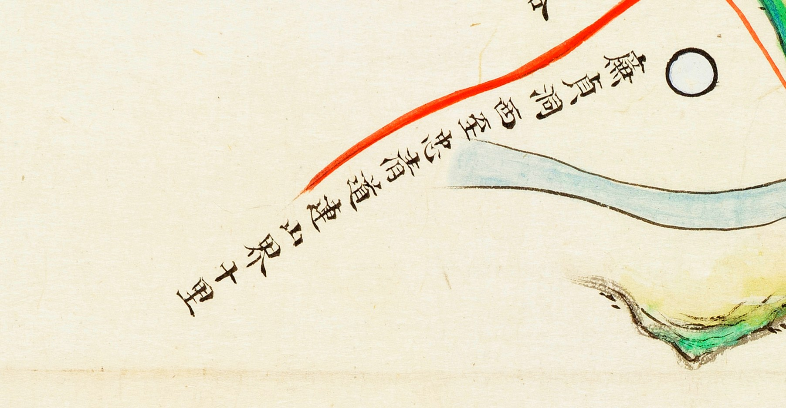
 2026-09-02 에 가장자리
  도로 주기의 `懷德`+`峙` 를 근거로 "한 걸음 남았다"고 적었으나, **그 판독을 철회했습니다**
  (2026-09-03, 12.5) — 그 자리는 `忠淸道連山界十里` 이고 회덕도 고개도 없습니다.
  **제보의 근거가 아직 원본에서 확인되지 않은 상태로 돌아갔습니다.**
- **닭재의 조선시대 소속이 확실하지 않습니다.** 삼괴동은 1914년에 공주군 산내면의
  소룡리·마달리·소호리 일부와 **회덕 외남면 덕산리**를 합쳐 만든 곳이라 두 고을이 섞여
  있습니다. 닭재가 회덕 땅이었는지 산내면 땅이었는지 가려야 합니다 — 회덕현 도엽에 그려진
  것은 회덕 소속이었거나 경계였다는 뜻입니다.
- **`닭재`·`계현`은 흔한 이름입니다.** 이름 일치만으로는 부족하고 위치가 맞아야 합니다.
- **`新峙`(만인산 아래)와 11.2·11.4 의 `□峙`(서대산 서쪽)를 섞지 않습니다.** 뒤엣것이
  `薪峙` 로 확정되면 둘 다 '신치'로 읽히지만 **자리가 전혀 다른 고개**입니다.
  1872년 「금산군지도」의 `薪峙`(12.6, (0.39, 0.30))는 또 다른 자리입니다 —
  
- **`마달령`과 `머들령`을 섞지 않습니다.** 이름이 비슷하지만 다른 고개입니다 —
  마달령은 동구 삼괴동↔옥천 군서면, 머들령은 동구 하소동↔금산 추부면입니다.
  대전 남동쪽 경계에 비슷한 이름의 고개가 여럿 있으니 특히 주의합니다.
  마달령의 도엽 표기는  입니다(12.4).

#### 2026-09-02 에 달라진 것 — 해동지도 진산군 도엽을 읽고

**첫째, 이 도엽에 `鷄峴`이 없습니다.** 읽어 낸 고개는 `梨峙` `方古峙` `晩目峙` `新峙`
`車峙` `枾峙` `松院峙` 였습니다(11.2). 커먼즈본이 저화질이라 작은 표기를 놓쳤을 수 있으므로
**없다고 단정하지는 않습니다.** 제보는 120년 뒤 1872년 「진산군지도」에 대한 것이었으니,
그 사이에 표기가 생겼을 수도 있습니다.

**둘째, 이쪽이 더 중요합니다 — 진산군 도엽의 사지에 회덕이 없습니다.**

| | 회덕현 도엽이 말하는 것 | 진산군 도엽이 말하는 것 |
|---|---|---|
| 회덕 남쪽 | `南距 珍山界 30리` | — |
| 진산 북쪽 | — | `北距 公山界 30리` (공주) |

**두 도엽이 서로를 이웃으로 적지 않습니다.** 회덕은 남쪽을 진산이라 하는데, 진산은
북쪽을 공주라 합니다. 진산 도엽의 가장자리 경계 표기에도 `懷德界`가 없습니다.

**2026-09-02 확대본에서 더 단단해졌습니다.** 진산 도엽 북쪽 가장자리에 **`公山界` 가 두 번**
적혀 있습니다(11.2 의 북쪽 경계 확대본). 한 번 스친 표기가 아니라 북쪽 경계 전체가
공주라는 뜻입니다.

그리고 그 경계에 놓인 고개는 **`新峙`** 입니다. 즉 진산 도엽이 북쪽 경계 고개로 적은 것은
`鷄峴` 이 아니라 `新峙` 입니다. 둘이 같은 고개의 다른 이름일 가능성도 아주 없지는 않으나
(`新`=새, `鷄`=닭 — 우리말 '새재'와 '닭재'), **뜻이 다른 글자이므로 근거 없는 추측입니다.**
1872년 도엽에서 `鷄峴` 의 위치를 보면 갈립니다.

> **2026-10-01 — 이 대목이 흔들렸다가 다시 섰습니다.**
>
> **흔들린 쪽.** 기문의 `新目峙` 가 **동쪽 옥천 길**의 고개임이 1872년 `思睦峙` 로
> 확인되면서, 그림의 `新峙`(북)가 그 이름을 잘못 붙인 것일 가능성이 열렸습니다(6.7).
> 그렇다면 「진산이 북쪽 경계 고개로 `新峙` 를 적었다」는 문장이 근거를 잃습니다.
>
> **다시 선 쪽.** 그 자리를 **1872년 도엽이 메웁니다.** 진산군지도 서북 가장자리에
> **`馬項西北至忠淸道公州界□□里`** 라는 길 주기가 있습니다(12.5). **북쪽으로 나가는
> 길이 있고, 그 끝은 공주입니다.** 사지가 아니라 길 주기라 「실제로 그리로 다녔다」는
> 말이고, `懷德` 은 1872년 도엽에도 없습니다.
>
> **덤으로 하나가 깎였습니다.** 2026-09-30 에 `鷄峴` 후보 자리로 세웠던
> (0.74, 0.50)은 **고개 주기가 아니라 리(里) 패**였습니다(12.5). 6.4 에 `鷄峴` 을
> 1872년 진산 도엽에서 받쳐 줄 자리는 지금 **하나도 없습니다.**

앞뒤를 맞춰 보면 **두 고을 사이에 공주목 땅(산내면)이 끼어 있었을 가능성**이 큽니다.
이는 6.1 에서 마달령을 검토하며 확인한 것과 같은 그림입니다 — 마달리·소룡리·소호리가
공주목 산내면이었습니다.

**그렇다면 닭재의 소속이 다시 문제가 됩니다.** 닭재(계현산성)는 대전 동구 삼괴동에 있고,
삼괴동은 산내면과 회덕 외남면이 섞인 곳입니다. 두 고을이 직접 접하지 않는다면 닭재는
**회덕–진산 경계가 아니라 공주(산내면)–진산 또는 공주–금산 경계**일 수 있습니다.
그러면 회덕현 도엽의 `雞峙`는 회덕 땅 밖의 인접 지명을 그려 넣은 것이 됩니다 —
고지도에서 드문 일이 아닙니다.

**셋째 — 2026-09-02 에 「1872년 진산군지도는 회덕을 적는다」고 여기에 덧붙였다가,
2026-09-03 에 지웠습니다.** 그 근거로 삼은 `懷德` 판독이 오독이었습니다(12.5). 그 자리는
`忠淸道連山界十里` 입니다. **1872년 진산 도엽에도 회덕이 없습니다** — 위 둘째 논거는
해동지도에 한정되지 않고 **1872년까지 이어집니다.**

#### 2026-09-02 · 공주목 도엽으로 한 걸음 더

공주목 도엽에 **`懷德界`가 있고**(11.3 · 12.3), 진산군 도엽은 **북쪽을 `公山界`(공주)**라 합니다.
회덕현 도엽에는 `公州界`가 있습니다. 세 도엽을 이으면 이렇게 됩니다.

```
회덕현  ──(公州界 / 懷德界)──  공주목  ──(公山界)──  진산군
```

**회덕과 진산은 각각 공주와 접하고, 서로는 적지 않습니다.** 어제 세운
"두 고을 사이에 공주목 산내면이 끼어 있다"는 추론이 세 도엽의 경계 표기로 뒷받침됩니다.
공주목 면 목록에서 **`山內面`이 `初境八十里 終境一百里`** 로 읍치에서 가장 먼 축이라는
것도 같은 방향입니다 — 산내면이 공주목의 동남쪽 끝이고, 그 끝이 회덕·진산과 맞닿습니다.

다만 회덕현 도엽에는 여전히 `珍山界`가 적혀 있습니다. **한쪽만의 기록**이므로, 회덕 남쪽
끝이 실제로 진산에 점으로 닿았는지 아니면 남쪽 방면을 뭉뚱그린 것인지는 남아 있습니다.

**다음 확인 순서(고쳐 적음)**

1. **1872년 「진산군지도」**에서 `鷄峴`의 위치 — 제보의 원본. 북쪽 경계에 있는지
2. ~~**공주목 도엽의 산내면 일대 확대**~~ — **두 계열 모두 2026-09-30 에 끝냈습니다.
   어느 쪽에도 고개가 없습니다**(아래). **닭재는 공주목 도엽에서 나지 않습니다**
3. ~~**해동지도 회덕현 도엽의 `珍山界` 표기 위치를 다시**~~ — **2026-09-30 에 끝냈습니다.
   `珎山界` 는 남쪽 변이 아니라 동남 끝, `雞峙` 바로 건너편에 딱 한 번 있습니다**(아래)
4. 여지도서·읍지의 회덕현·진산군 산천조에서 `雞峙`/`鷄峴`이 통하는 고을
5. 한국지명총람에서 삼괴동 닭재의 우리말 이름과 이표기

#### 2026-09-30 — 1872년 공주목 도엽의 산내면 일대에는 고개가 없습니다

위 "다음 확인 순서" 2번을 절반 끝냈습니다. 《1872년 지방지도》 「공주목지도」의 동쪽
가장자리 **x 0.33–0.52, y 0.07–0.35** 를 전면으로 훑었습니다(12.3).

**`峙`·`峴` 이 한 자도 없습니다.** 적힌 것은 면 이름 셋(`山內面` `柳等川面` `□內面`),
경계 표기 하나(`鎭岑界`), 창고 주기 둘(내흥창·태평창)뿐입니다.

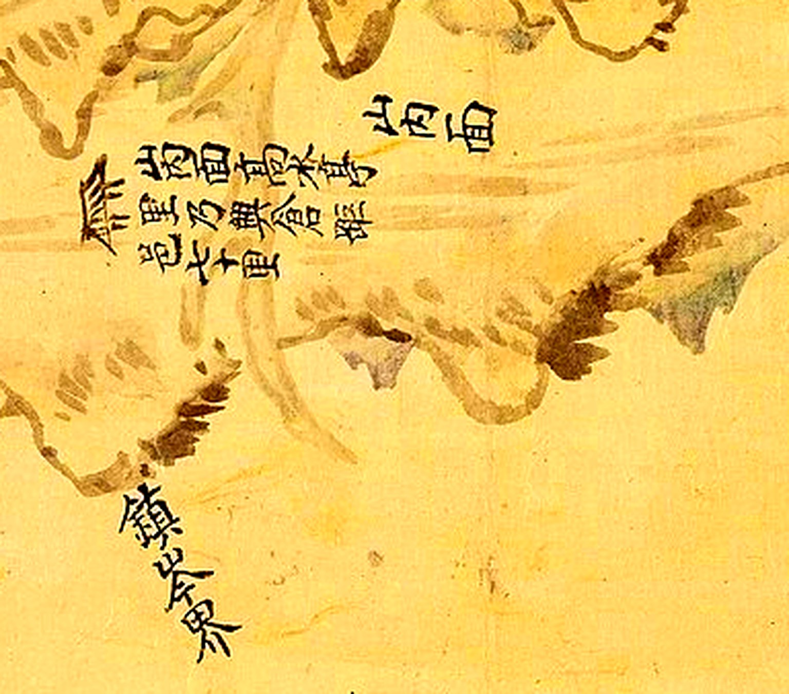

**그동안 고개일 수도 있다고 보던 `山內面` 곁의 글자 뭉치는 창고 주기였습니다** —
`山內面 高水亭里 乃興倉 距邑七十里`. 기문 사창 조와 글자까지 맞습니다.

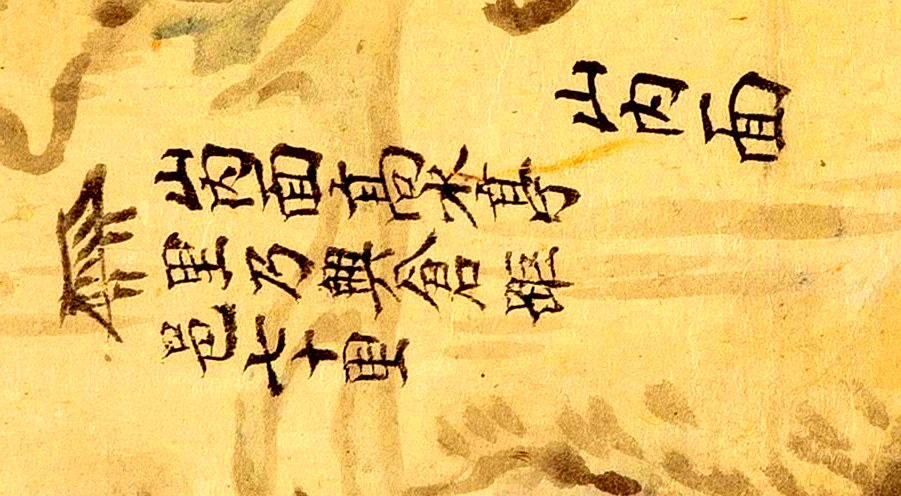

**이것이 6.4 에 주는 값은 소극적이지만 분명합니다.** 1872년 공주목 도엽은 대전에 걸친
다섯 면에 대해 **면 이름과 창고만 적고 고개를 적지 않습니다** — 기문 산천 조에도 고개가
없습니다(4.3). 그러므로 **닭재의 소속은 이 도엽에서 나지 않습니다.**

**같은 날 해동지도 공주목 동남단도 훑었습니다 — 거기에도 없습니다**(11.3). 대전에 걸리는
다섯 면이 다 들어가는 x 0.44–0.66, y 0.50–0.81 에서 `峙`·`峴` 은 `栗`〔峙?〕 하나뿐입니다.
**공주목 계열 두 도엽이 다 닫혔습니다.** 남은 자리는 둘입니다: 회덕현 도엽의 `珍山界`
표기 위치, 그리고 문헌(여지도서·읍지).

**공주목이 대전 쪽 고개를 적지 않는 것은 축척과 관심의 문제로 보입니다.** 해동지도
면별 거리표가 말해 주듯 **대전 일원은 공주목 26면 가운데 읍치에서 가장 먼 변두리**
(산내 80~100리, 유등포 70~80리)였습니다. 큰 고을의 도엽이 변두리의 고개까지 적지 않는
것은 이상한 일이 아닙니다. **닭재의 소속은 공주목 자료가 아니라 회덕·진산 쪽 자료와
문헌에서 나야 합니다.**

**한편 새로 나온 `鎭岑界`**(0.41, 0.10)는 6.4 와 직접 관계는 없으나 4.2 의 사지 대조를
한 칸 채웁니다. 공주목 도엽이 동쪽 경계로 적은 고을이 **회덕과 진잠 둘**이 되었습니다.

#### 2026-09-30 — 회덕현 도엽은 진산을 「계치 건너편」 한 곳에만 적습니다

위 「다음 확인 순서」 3번입니다. 해동지도 회덕현 도엽의 남쪽 변을 훑었습니다(11.1).

| 위치 | 표기 |
|---|---|
| (0.87, 0.64) | **`雞峙`** |
| (0.92, 0.64) | **`珎山界`** |
| (0.56, 0.80) · (0.69, 0.80) | `公州界` 둘 |

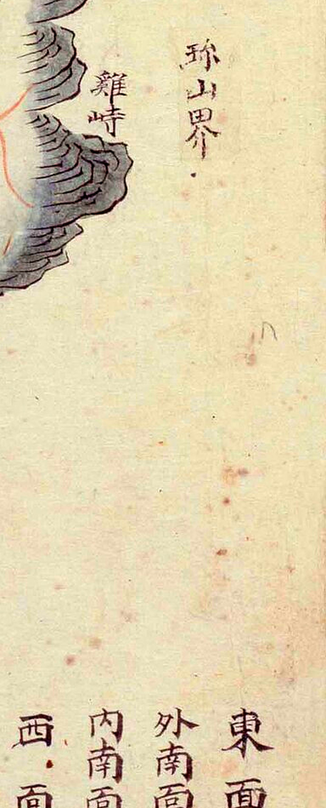

**`雞峙` 와 `珎山界` 가 같은 높이입니다.** 진산계 표기는 **동남 끝, 계치 바로 건너편에
딱 한 번**이고 남쪽 변을 따라서는 `公州界` 가 놓입니다. 그러니 이 도엽이 말하는 것은
「남쪽 방면이 대충 진산」이 아니라 **「계치 너머가 진산」** 입니다. 3번의 두 갈래 가운데
앞쪽입니다.

**면별 거리표가 이를 못박습니다.** 같은 도엽 오른쪽 아래의 7면 표에서 **`外南面` 종경이
30리**이고, 사지의 **`南距 珍山界 三十里`** 와 정확히 맞습니다(11.1의 표).

```
회덕현 남쪽 끝 = 외남면의 끝 = 진산계 = 雞峙 가 있는 자리
```

**삼괴동은 1914년에 공주군 산내면 세 리와 회덕 `外南面 德山里` 를 합쳐 만든 곳입니다.**
도엽이 외남면의 끝을 진산계라 하고 거기에 계치를 그렸으니, **닭재가 회덕 외남면 땅
(또는 그 경계)이었을 쪽으로 무게가 실립니다.** 6.4 가 처음 세운 가설 쪽입니다.

**`雞峙` 의 글자도 확인했습니다.** `雞` 는 `奚`+`隹`, `峙` 는 `山`+`寺` 로 둘 다 또렷하고,
**`山` 부수가 분명합니다** — 같은 날 흔들린 공주목의 `栗`〔峙/寺?〕(6.6)과 좋은 대조가
됩니다. 확신 `상` 유지, 좌표를 (0.79, 0.68)에서 **(0.87, 0.64)** 로 정정했습니다.

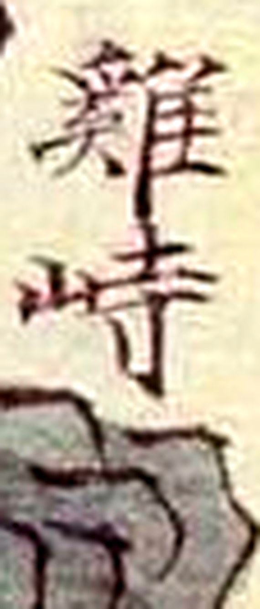

**붉은 길이 계치 서쪽 기슭(0.82, 0.635)까지 와서 끊깁니다.** 이 도엽은 길을 고을 경계에서
끊는 버릇이 있고 남쪽 두 `公州界` 에서도 똑같이 끊깁니다 — **길이 계치까지 나 있었다**는
뜻입니다.

**그래도 한쪽만의 기록입니다.** 진산군 도엽은 여전히 회덕을 적지 않고 북쪽을 공주라
합니다(위 「2026-09-02 에 달라진 것」). **두 도엽이 서로 다른 말을 하는 상태**이고,
이번 것은 회덕 쪽 주장을 훨씬 또렷하게 만든 것입니다. 남은 것은 문헌(여지도서·읍지)과
1872년 진산군 도엽에서 `鷄峴` 의 자리를 찾는 일입니다.

#### 2026-10-01 — 세 번째 표기 `鷄峙` 가 나왔습니다

| 표기 | 도엽 | 위치 | 크롭 |
|---|---|---|---|
| `鷄峙` / `Kye-ch'i (Kei-ji)` | **미군 AMS 1:50,000 「Taejon」**(저본 1919년판, 1917 측도) | 그리드 **1049/1485** |  |

**표기가 셋이 되었습니다** — 해동지도 회덕현 `雞峙`, 1872 진산군 `鷄峍`〔=鷄峴〕,
그리고 이 도엽의 `鷄峙`. **읽기가 처음으로 확인되었습니다 — `Kye-ch'i`(계치), 곧 '닭재'입니다.**
(다만 이 로마자는 1945년 시점 표기이고 오기 사례도 있으므로 절대적 근거로 삼지는 않습니다 — 14.1 참조.)

**자리**는 도엽에서 `德山 Tŏksan`·**`三槐里`**(삼괴리) 동쪽, `馬墳山`(379)과 `國師峰`(509)
사이 능선입니다. **마달령보다 북쪽**이고, 계현산성이 있다는 동구 삼괴동 방면과 방향이 맞습니다.

**2026-10-01 — 곁 마을은 `三槐里`(삼괴리)입니다**(판독자 확정).

**이로써 `鷄峙` 곁 마을의 이름이 확정됐습니다.** 근거 다섯.

| | |
|---|---|
| 일본어 전사 | `Sankai-ri` 는 **`三槐`(サンカイ)·`三會`(サンカイ) 둘 다** 가능합니다 |
| 측도 시점 | 저본이 **1917년 측도** — **1914년 부군면 통폐합 뒤**이므로 `三槐里` 가 이미 있어야 할 때입니다 |
| 곁 마을 `德山`·`德山里` | **덕산리는 삼괴리를 이룬 마을입니다** — 회덕 외남면 덕산리 |
| `琵琶嶺` 곁 `所好里` | **소호리도 삼괴리를 이룬 마을입니다** — 공주군 산내면 소호리 |
| 한국어 전사 | `Samhoe` 는 오기일 수 있습니다. 삼괴라면 `Samgoe` 여야 합니다 — 13.1 이 경고한 바로 그 사례입니다 |

**1914년에 `三槐里` 를 이룬 마을 넷 가운데 둘(`德山`·`所好`)이 이 도엽의 `鷄峙`·`琵琶嶺`
바로 곁에 적혀 있습니다.**

#### 확인된 것과 아직 아닌 것

**확인된 것은 이것뿐입니다.**

| | |
|---|---|
| `鷄峙` 의 자리 | 1919년 도엽에서 `三槐里` 북동 약 1 km (1049/1485) |
| 곁 마을 | `德山里`·`所好里`·`馬達里` 가 각각 `鷄峙`·`琵琶嶺`·`馬達嶺` 곁에 적혀 있음 |
| 그 셋의 내력 | 1914년에 삼괴리를 이룬 마을들입니다 |

**아직 아닌 것 — 다음은 어느 것도 입증되지 않았습니다.**

- **1919년의 `鷄峙` 가 해동지도의 `雞峙`·1861년의 `雞峴`·1872년의 `鷄峴` 과 같은 고개인지.**
  표기와 읽기가 같고 자리가 가깝다는 것뿐이고, **같은 고개임을 보인 자료는 아직 없습니다.**
- **계현산성이 `鷄峙` 에 딸린 산성인지.** 산성이 삼괴동에 있다는 것과 `鷄峙` 가 삼괴리
  북동에 있다는 것은 **서로 다른 자료의 서로 다른 진술**입니다. 둘을 잇는 근거는 아직
  이름뿐입니다.
- **마을 넷을 1914년에 묶은 까닭이 고개였는지.** 고개 곁에 마을이 있다는 관찰에서
  병합의 까닭을 끌어낼 수는 없습니다.
- **이 일대가 「통행이 모이는 자리」였는지.** 고개가 여럿이라는 것과 통행이 모였다는 것은
  다른 말입니다. 도로 주기나 역원·장시 기록으로 받쳐야 합니다.

#### 남은 물음 — 그런데 방향이 어긋납니다

**`鷄峙` 는 `郡西面`(옥천, 1049/1486) 바로 곁입니다.** 서쪽이 `德山`(회덕 외남면 덕산리)
이니, 1919년 도엽대로라면 닭재는 **회덕(덕산리) ↔ 옥천 군서면** 경계입니다.

**그런데 해동지도 회덕현은 `雞峙` 를 `珎山界`(남) 접경에 그렸습니다**(11.1). 옥천이
아니라 진산입니다. **이 어긋남이 6.4 의 다음 물음입니다** — ① 해동지도가 자리를 성기게
찍은 것인지, ② 1914년 이전에 그 언저리가 진산과도 맞물렸는지, ③ 「닭재」가 하나가
아니라 그 능선에 여럿인지.

### 6.5 `吉峙`·`質峙`·`迭峴` — 한 고개의 세 표기

**같은 고개인데 자료마다 한자가 다릅니다.**

| 표기 | 읽기 | 나온 곳 | 크롭 |
|---|---|---|---|
| `吉峙` | 길치 | **1872년 「충청도 회덕현지도」** (0.70, 0.26) — 12.1 |  |
| `質峙` | 질치 | **대동여지도 15-04** (0.75, 0.99) — 13.4 · 회덕 관련 기록의 「질고개」(6.1) | 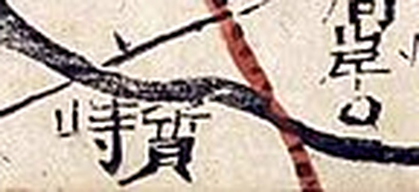 |
| `迭峴` | 질현 | 질현성(대전시 기념물) 지정 명칭 | — |

**우리말 「질티/질고개」를 적는 방식이 셋입니다.** `質`·`迭` 은 소리를 적은 것이고,
**`吉` 은 소리가 다릅니다**(길/질). 그런데도 같은 고개인 것은 자리로 확인됩니다 — 도엽의
`吉峙` 는 질현성이 있는 대덕구 비래동 언저리입니다.

**두 가지로 설명됩니다.** ① 이 지역에서 구개음화 이전·이후 표기가 섞였을 가능성
(`길` → `질`), ② 필사자가 뜻이 좋은 글자로 바꿔 적었을 가능성. 어느 쪽인지는 더 볼
일입니다.

**2026-09-30 — `質峙` 를 지도에서 처음 찾았습니다**(13.4). 대동여지도(1861)가 `質峙`,
1872년 회덕현지도가 `吉峙` 입니다. **`質`(1861) → `吉`(1872)** 이라는 순서가 나오므로,
①(구개음화로 `길`→`질`)은 **방향이 거꾸로**입니다. ②(글자를 바꿔 적었다) 쪽으로
무게가 실립니다.

**대조표를 쓰는 데 걸리는 실무 문제입니다.** 한자 표기로만 색인하면 **같은 고개가 세 줄로
갈립니다.** 3 의 `한자` 칸에 세 표기를 함께 적어 두었습니다.

**6.1 에 걸립니다.** 6.1 은 해동지도 회덕현의 `于峙嶺` 의 대안 후보로 질현을 들면서
"`于` 는 `質`·`迭` 어느 쪽과도 음이 통하지 않는다"를 약점으로 적었습니다. **표기가 소리를
그대로 따르지 않는 사례(`吉`)가 같은 고을 도엽에서 나왔으므로, 그 약점은 조금 가벼워집니다** —
다만 `于`→`질` 을 설명하지는 못합니다.

### 6.6 `栗峙` 인가 `栗寺` 인가 — 둘째 글자

**`栗` 은 확실합니다.** 9배 확대에서 `西`+`木` 이 또렷합니다. 문제는 **그 다음 글자**입니다.


*해동지도 공주목 (0.52, 0.60) 언저리. 축소본 1,920 px 를 9배로 키운 것.*

**둘째 글자 자리에 창고 그림이 겹쳐 있습니다.** 우횡서이므로 `峙` 는 `栗` 의 **왼쪽**에
와야 하는데, 바로 거기에 지붕 얹은 네모(창고)가 그려져 있어 글자 획과 그림 선이
갈리지 않습니다. 회색조로 대비를 끝까지 올려도 마찬가지입니다.

> **2026-09-30 (류철).** **`山` 부수가 보이지 않습니다.** 그래서 `峙`(고개 치)가 아니라
> **`寺`(절 사)로도 읽힙니다.** 다만 **그림 속 정황은 `峙` 쪽**입니다 — 산줄기 위에
> 놓이고 붉은 도로선이 지나갑니다. **확신하지 못합니다.**

**이것이 걸리는 자리가 큽니다.** `栗寺` 라면 고개가 아니라 절이고, 3장에서 내려야 합니다.
그러면 **회덕현 밖에서 채록된 유일한 대전의 고개가 사라집니다.** 그래서 확신을 `중` 에서
**`하`** 로 내리고 쟁점으로 세웁니다.

**양쪽 논거**

| `峙` 쪽 | `寺` 쪽 |
|---|---|
| 산줄기 위에 놓임 | **`山` 부수가 안 보임** (류철) |
| **붉은 도로선이 지남** — 해동지도에서 붉은 선은 길입니다 | 곁의 건물 그림이 절집일 수 있음 |
| 대전 일원에 '밤고개' 지명이 흔함 | 공주목 도엽은 절(`甲寺`·`東鶴寺`·`普門寺`)을 건물 그림과 함께 적음 |

**곁의 건물 그림이 양쪽 모두의 논거입니다.** 앞서 이 문서와 판독 문서에 「곁에 `倉`」
이라 적었는데, **글자가 아니라 건물 그림**이었습니다(2026-09-30 정정). 창고라면 `峙` 쪽에
힘이 실리고(창고는 길목에 둡니다), 절집이라면 `寺` 쪽입니다.

**가르는 방법**

1. **규장각 고해상 원본** — 커먼즈본은 2,409 px 이고 그마저 이 환경에서는 요청 제한으로
   못 받아 1,920 px 축소본을 썼습니다. 원본이면 바로 갈립니다
2. **여지도서·공주목읍지**의 산천 조에 `栗峙` 가, 사찰 조에 `栗寺` 가 있는지
3. **1872년 「공주목지도」의 같은 자리** — 다만 그 도엽은 기문 산천 조에 고개를 하나도
   적지 않았고(4.3) 그림 쪽 동쪽 가장자리에도 없었습니다(12.3). 절이라면 오히려 남았을 수
   있으니 **이번에는 절을 찾는 눈으로** 다시 봐야 합니다
4. `九則面` 일대(현 유성구 구즉·봉산·송강동)의 한국지명총람 — '밤고개'가 있는지

### 6.7 `新峙` 와 `新目峙` — 한 도엽에 「새재」와 「새목재」가 함께 있는가

**2026-10-01 에 열린 쟁점입니다.** 『해동지도』 「전라도 진산군」 한 장 안에 `新` 으로
시작하는 고개가 **둘** 있습니다.

| | 그림 `新峙` | 기문 `新目峙` |
|---|---|---|
| 적힌 곳 | 그림 (0.455, 0.310) | 기문 산천 조 |
| 글자 수 | **두 자** | **세 자** |
| 곁 | `彌勒寺`(절 그림) · 위에 `萬仞山` · 아래 `北面` · 좌우에 **`公山界` 두 번** | — |
| 주기 | 없음 | **`暫夷`〔?〕 `三十五里` `沃川界`** |
| 가리키는 쪽 | **북 — 공주(대전)** | **동 — 옥천** |

**기문 쪽은 2026-10-01 에 풀렸습니다.** 1872년 「진산군지도」가 같은 고개를 또렷한
해서로 적습니다 —

> **`思睦峙東至忠淸道沃川界四十里`**


`新目峙`(1750년대) ↔ `思睦峙`(1872년). **동쪽 옥천 길, 35리·40리.** 글자는 다르지만
`目`·`睦` 이 둘 다 우리말 **「목」**이고(2장), 그림의 동북 `□峙`(0.71, 0.28)가
`沃川界` 아래·`西臺山` 서쪽이라 자리도 맞습니다. **`新目峙` 는 대전의 고개가 아닙니다.**

**남는 것이 그림의 `新峙` 입니다.** 이쪽은 `公山界` 사이에 놓여 **대전 경계 고개 후보**로
남습니다. 두 갈래입니다 —

- **같다** — 그림이 기문의 `新目峙` 에서 `目` 을 빼고 **자리를 북쪽에 잘못 붙였다.**
  같은 도엽의 `晚目峙` 도 기문은 `鎭岑界`(북동)인데 그림은 서쪽에 있어, **이 도엽은
  기문과 그림이 어긋나는 버릇이 있습니다**(11.2 ②). 그러면 대전 경계 고개 후보가
  하나 사라집니다
- **다르다** — 「새재」(新峙, 북)와 「새목재」(新目峙, 동)가 **별개**다. 1872년 도엽이
  `思睦峙` 를 **동쪽에만** 쓰고 북쪽 경계 길에는 **`馬項`** 이라는 다른 이름을 쓰는 것이
  이쪽 논거입니다(12.5)

**가르지 않습니다.** 가르려면 ① 그림 `新峙` 자리의 고해상 재판독 ② 『여지도서』·
『진산군읍지』 산천 조 ③ 금산군 복수면·추부면의 한국지명총람에 「새재」·「새목재」가
남아 있는지 — 셋 가운데 하나가 필요합니다.

> **이 쟁점이 6.4 에 닿습니다.** 11.2 는 「진산 도엽이 북쪽 경계 고개로 적은 것은
> `鷄峴` 이 아니라 `新峙`」라고 적어 왔습니다. `新峙` 가 실은 동쪽 고개였다면 그 문장이
> 흔들립니다. 다만 **1872년 도엽의 `馬項` 주기가 그 자리를 메웁니다** — 북쪽 경계 길은
> 있고, 그 끝은 **공주**입니다.

### 6.8 `獐峴`(장고개·노루고개) — 궁동인가 둔곡동인가 (2026-10-02)

**두 자료가 유성구 안에서 「장고개」를 다른 동에 적습니다.**

| | 궁동(弓洞) | 둔곡동(屯谷洞) |
|---|---|---|
| **유성문화원** 「유성의 지명유래」([15.6](#156-유성문화원-지명유래-2026-10-01)) | **장고개 · 노루고개 `獐峴`** — 활골 서쪽, 충남대 정문 앞쪽 · 남작골고개 | 중고개 `中峴` · 덕진재 · 달전재 |
| **《대전지명지》**(1994) ([5.1](#51-대전지명지1994-고개-323건-2026-10-02-통합)) | **남작골고개 하나뿐** (궁동 ↔ 신성동) | **장고개** — 두니실 마을 바로 앞 |

**《대전지명지》의 궁동 항목에 「장고개」가 없습니다.** 그리고 《대전지명지》가
유성구에서 장고개를 적은 곳은 **둔곡동**입니다.

**셋 가운데 하나입니다.**

1. **둘 다 맞다** — 궁동과 둔곡동에 장고개가 각각 따로 있다
2. **한쪽이 동을 잘못 적었다**
3. **두 동 경계의 한 고개를 양쪽에서 달리 적었다** — 5.1 이 든
   「유성구 덕진동·구룡동의 `大谷峙`」와 같은 꼴

**③ 은 어렵습니다 — 궁동과 둔곡동은 10 km 떨어져 있습니다**(궁동 36.37/127.35,
둔곡동 36.46/127.37). 맞닿은 동이 아닙니다. 그러니 ① 이나 ② 입니다.

**「장고개」는 흔한 이름입니다** — 《대전지명지》만 해도 일곱(동구 주촌동·내탑동·
가양2동·세천동, 서구 오동·평촌동, 유성구 둔곡동), 대덕구에는 아홉 넘게 있습니다.
한 구 안에 둘이 있어도 이상하지 않으니 ① 이 그럴듯해 보입니다.

**그런데 ① 을 깎는 것이 하나 있습니다.** 《대전지명지》가 궁동을 **안 본 것이
아닙니다.** 궁동 항목에 고개를 하나 적었고, **그것이 우리 대장의 `南鵲峴` 입니다.**

| 자료 | 남작골고개를 어디에 적었나 |
|---|---|
| 《대전지명지》 **신성동** 항목 | 남작골고개(**남작현 `南鵲峴`**) — 신성 ↔ 충남대 음악관 쪽 남작골 |
| 《대전지명지》 **궁동** 항목 | 남작골고개 — **궁동 ↔ 신성동** |

**두 동이 한 고개를 양쪽에서 적은 것**입니다 — 궁동과 신성동은 맞닿아 있고,
한자 `南鵲峴` 도 붙어 있습니다. **`南鵲峴` 은 두 자료가 궁동으로 맞습니다.**

**그러니 《대전지명지》는 궁동을 훑었고, 거기서 고개를 하나 찾아 한자까지 달았는데,
장고개는 적지 않았습니다.** 「안 봐서 빠진 것」이라 하기 어렵습니다.

**다만 `獐峴` 이라는 한자를 단 것은 유성문화원 하나뿐**입니다 — 그쪽이 더 늦게
나온 자료이니 **지명지가 놓친 것을 뒤에 주운 것**일 수도 있습니다. 가르지
못합니다.

> **이것이 급 `A` 로 올릴 때 반드시 걸립니다.** 지금 대장의 `獐峴` 좌표는
> **궁동의 중심**(급 `C`)입니다. 고갯마루를 찾으러 가면 **어느 동으로 갈지부터**
> 정해야 하고, 그 답은 아직 없습니다.

**할 일** — ① 유성문화원 궁동 쪽 원문에서 「활골」과 「충남대 정문 앞」을 오늘
지도에 짚어 고갯마루를 좁힌다 ② 《대전지명지》 둔곡동 「두니실 바로 앞」도 함께
짚어 둘이 다른 고개임을 확인한다 ③ 둘 다 서면 **대장에 두 줄로 나눈다** —
향토문화 ID 는 영구 식별자이므로 하나로 뭉뚱그려 두면 나중에 가를 수 없습니다.

#### 훑어보니 같은 손질이 필요한 줄이 더 있습니다 (2026-10-02)

`南鵲峴` 을 보다가 알았습니다 — **우리 비고는 「어느 동」만 적었는데 《대전지명지》는
「어디서 어디로」를 적습니다.** 급 `C` 좌표를 동 중심이 아니라 **두 끝의 중간점**으로
잡으면 그만큼 좁아집니다.

| 대장 | 우리 비고 | 《대전지명지》가 적은 것 | 할 일 |
|---|---|---|---|
| `南鵲峴` | 유성구 궁동 | **궁동 ↔ 신성동** — 신성 ↔ 충남대 음악관 쪽 남작골 | **고쳤습니다** → 36.3755 / 127.3483 |
| `鎭峙` | 유성구 세동 | **중세동 ↔ 성북동** (둘 다 유성구) | 두 중심의 중간점으로 |
| `月峴` | 대덕구 송촌동 | **금바위 ↔ 비래동의 비래암** → 송촌동 ↔ 비래동 | 〃 |
| `冷泉峴` | 대덕구 갈전동 | **아래갈밭에서 「덕고개」 올라가는 중간** | 아래 |
| `銅峴` | 대덕구 미호동 | **지명산(芝茗山) 남쪽** | 산을 짚어 좁힌다 |

> **`冷泉峴` 은 뜻밖의 끈이 걸렸습니다.** 《대전지명지》가 「아래갈밭에서 **덕고개**
> 올라가는 중간」이라 적는데, 그 **덕고개(`德洞峴`)는 어제 급 `A` 가 되었습니다**
> (36.4301 / 127.4616, OSM 고갯마루 점). **자리를 아는 고개가 모르는 고개의 자리를
> 좁혀 줍니다** — 아래갈밭만 짚으면 `冷泉峴` 은 그 사이입니다. 급 `A` 가 생기면
> 그 이웃도 따라 좁아진다는 것을 처음 본 사례입니다.
>
> ⚠ **다만 「찬샘골고개」도 둘입니다** — 대덕구 **부수동**에 「절터골고개(찬샘골고개)」가
> 따로 있습니다(부수골 ↔ 동구 직동 찬샘골). 우리 `冷泉峴` 은 **갈전동** 쪽이고
> 한자가 붙은 것도 그쪽뿐입니다.

> **`獐` 은 노루입니다.** 그러니 `獐峴` 의 본디 이름은 **노루고개**이고
> 「장고개」는 **한자음 `獐`(장)을 우리말처럼 읽은 것**일 수 있습니다 —
> 「장 보러 넘던 고개」가 아니라는 뜻입니다. 그렇다면 **흔한 「장고개」 일곱과
> 궁동 `獐峴` 은 뿌리가 다릅니다.** 14.2 가 적은 「이름이 비슷하다고 같은 고개가
> 아니다」의 또 한 꼴이고, 이것이 ① 을 더 받쳐 줍니다. **다만 아직 가정입니다** —
> 노루고개가 먼저인지 장고개가 먼저인지를 댈 자료가 없습니다.

---

## 7. 미판독 글자

**`□` 만 적어 두면 아무도 못 고칩니다.** 그림을 표에 박아 두면 읽을 수 있는 사람이
지나가다 바로 고쳐 줍니다(형식은 [`판독-기록-형식.md`](판독-기록-형식.md)).

| 도엽 | 위치 | 지금까지 | 크롭 | 기록 |
|---|---|---|---|---|
| 공주목지도 | (0.64, 0.22) | `□谷面` — 첫 글자는 `先` 비슷한 꼴 아래 `口`. **판독자도 미상** | 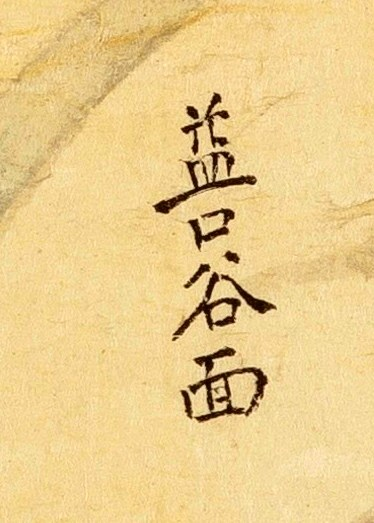 | 12.3 |
| 진산군지도 | (0.71, 0.39) | `□程東西至忠淸道連山界十里` 의 첫 글자 — `無`(없을 무)의 이체자로 보이나 `無程…` 의 뜻이 안 풀림 | 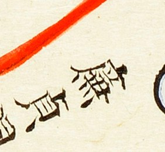 | 12.5 |
| 해동지도 공주목 | (0.52, 0.60) | `栗` **뒤의 글자** — `峙` 인지 `寺` 인지. 창고 그림이 겹쳐 있고 `山` 부수가 안 보임 |  | **6.6** |
| 해동지도 문의현 | (0.755, 0.536) | `□峴` **앞의 글자** — `栗`(覀+木) 인지 `界`(田+介) 인지. `峴` 은 또렷합니다 | 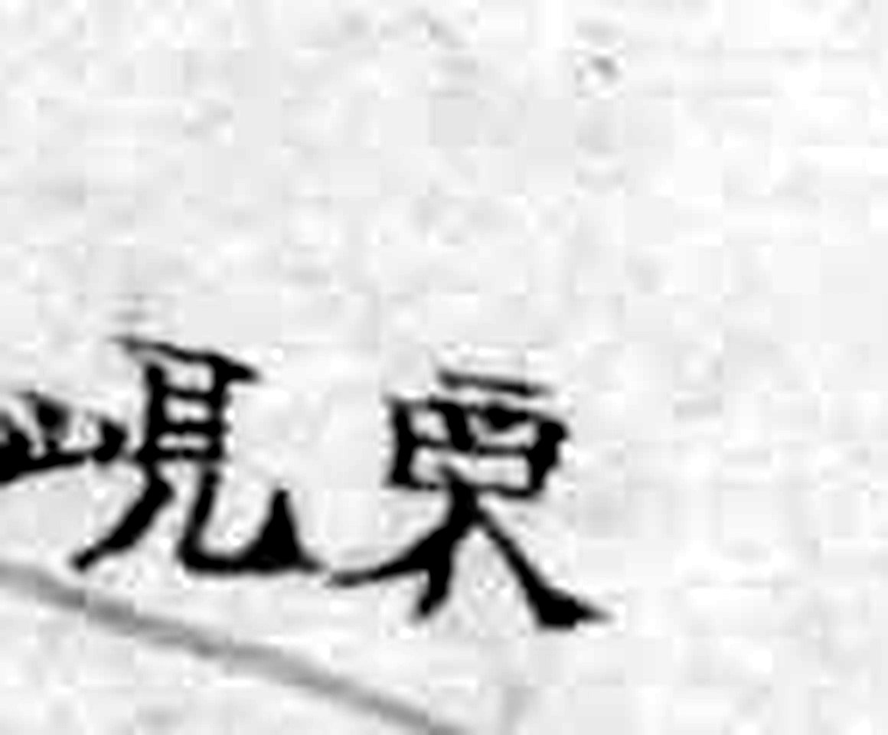 | 11.6.2 |
| 해동지도 문의현 | (0.336, 0.425) | `□峯書院` 첫 글자 — `曾` 인지 `魯` 인지 | — | 11.6.2 |
| 해동지도 옥천군 | (0.29, 0.06) | 좌상단 첨지의 **첫 두 자** — `□□ 與備禦同` | 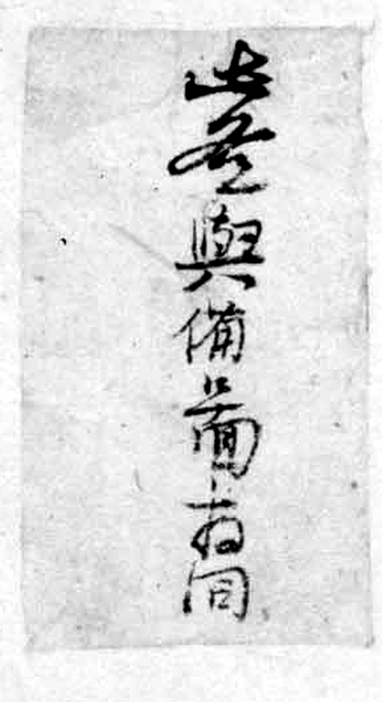 | 11.6.8 |
| **해동지도 연산현** | **(0.785, 0.475)** | **`□□峴` 의 앞 두 글자.** `峴` 은 또렷합니다. 자리가 `鎭岑界` 와 `珎山界` 사이라 **진잠에서 넘는 고개**일 수 있습니다 | 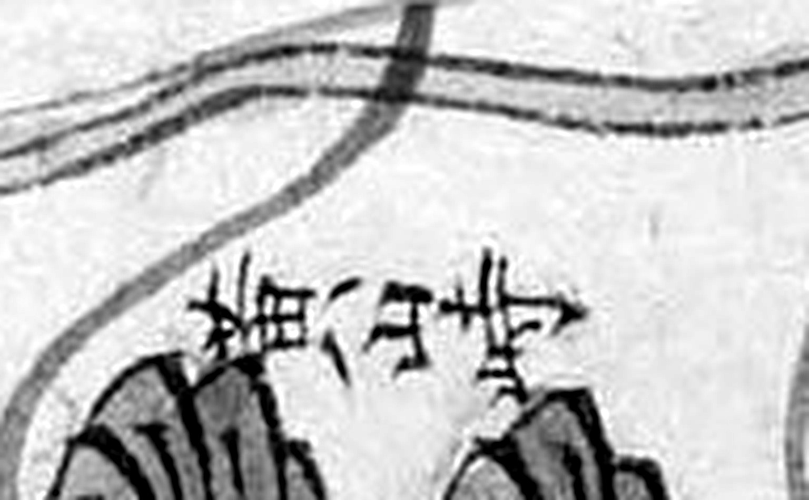 | 11.6.4 |
| 해동지도 연산현 | (0.883, 0.586) | 세 글자. **맨 오른쪽 글자가 위 `□□峴` 의 맨 오른쪽과 같아 보입니다** | 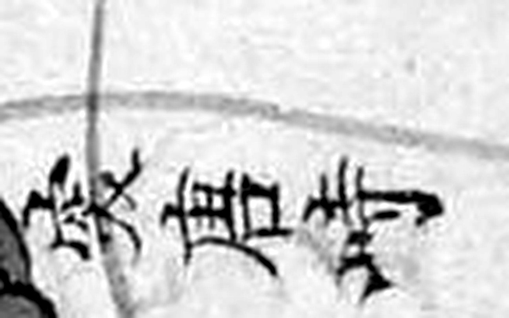 | 11.6.4 |
| **진산군지도** | **(0.74, 0.50)** | **리 패의 이름 세 자.** 2026-09-30 에 `鷄峴` 후보로 세웠다가 2026-10-01 에 **리 패로 재분류**했습니다. 아랫줄은 `二十里` 또는 `三十里` | 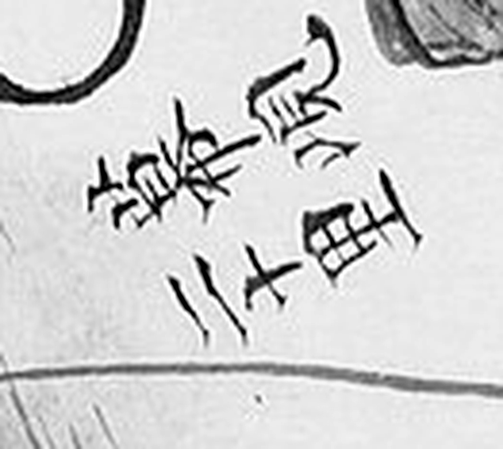 | 12.5 |
| 진산군지도 | (0.77~0.89, 0.49) | `馬項西北至忠淸道公州界` **뒤의 거리 두 자** |  | 12.5 |
| 해동지도 진산군 | 기문 산천 조 | **`暫夷`**〔?〕 의 **첫 글자** — `車`+`斤` 위에 `日` 로 보여 `暫` 이나, `漸`(점점 평탄해짐)일 수 있습니다. 고개 셋에 되풀이됩니다 | 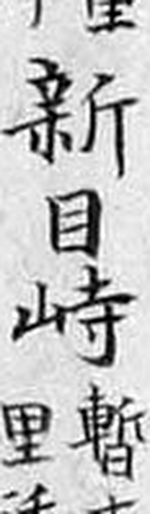 | 11.2 |

**원본이 손에 없어 크롭을 못 만드는 것들.**

> **2026-10-01 정정.** 「해동지도 도엽은 커먼즈 저화질본뿐」이라고 적어 두었으나, 문의현
> 도엽을 내려받아 보니 **커먼즈본이 곧 원본 크기**였습니다(2,409 × 3,754 px). 커먼즈
> 썸네일 주소에 `?width=` 를 붙여 받은 것이 작아 보였을 뿐입니다. 곧 **커먼즈에서 더
> 키울 여지는 없고**, 이 칸의 글자들은 규장각 고해상본을 봐야 풀립니다.

| 도엽 | 지금까지 | 기록 |
|---|---|---|
| 해동지도 회덕현 | `于峙嶺` 첫 글자 — `于`/`亐`/`牛` | 6.1 |
| 해동지도 진산군 | 서대산 서쪽 `□峙`(0.71, 0.28) — 기문의 `新目峙` 로 보나(2026-10-01) **첫 글자가 갈리지 않습니다.** 금산 쪽 `薪峙` 와 같은 고개인지도 여기 달려 있습니다 | 11.2 · 6.7 |

**자리를 아직 특정하지 못한 것들** — 회덕현지도에 있는 것은 아는데 좌표를 못 찍었습니다.

| 도엽 | 무엇 | 기록 |
|---|---|---|
| 회덕현지도 | 北面 호수(戶數) 끝자리 | 12.1 |
| 회덕현지도 | `二川橋` 가운데 글자 | 12.1 |
| 회덕현지도 | 관아 구역 소옥 3~4채의 편액 | 12.1 |

## 8. 앞으로 볼 자료

우선순위 순입니다. 본 사람이 날짜와 결과를 적고, 채록한 고개는 3장과 6장에 반영합니다.

| 순 | 자료 | 무엇을 얻나 | 상태 |
|---|---|---|---|
| 1 | 해동지도 「회덕현」 **고해상 원본**(규장각) | 6.1·6.2 재판독 — 커먼즈본은 6책 저화질이라 잔글씨 한계 | 미착수 · [#5](https://github.com/daehyang/daehyang.github.io/issues/5) [#6](https://github.com/daehyang/daehyang.github.io/issues/6) |
| 2 | 1872년 지방지도 「회덕현지도」 | 120여 년 뒤 표기와 대조 + **질티(迭峴) 확인**(6 제보) | **원문 확보** · 남부 훑기(12.1) · 고개 표기 미발견 · **북동부 미착수** |
| 3 | 여지도서 회덕현 산천조 | 고개가 통하는 고을 | 미착수 |
| 4 | **1872년 지방지도 「진산군지도」** (전라도) | 6.4의 `鷄峴` 확인 — 남쪽 경계 | **원문 확보** · **방위 확정**(2026-09-30) · **경계 길 주기 셋 채록**(2026-10-01, 12.5) — 동 `思睦峙`·서북 `馬項`·서 `連山界`. **`鷄峴` 은 여전히 미확인이고, 후보 자리로 보던 (0.74, 0.50)은 리 패로 재분류** · [#4](https://github.com/daehyang/daehyang.github.io/issues/4) |
| 5 | 「진잠」 — 해동지도·1872 두 계열 | **대전 남서부 미조사 구역** | **1872 도엽 전면 훑기 완료**(2026-09-03, 12.2) — 고개 `奄峴`·`牛拳峴`, 사지 확보. **해동지도 진잠은 미착수** · [#7](https://github.com/daehyang/daehyang.github.io/issues/7) |
| 6 | 「공주목」 — 해동지도·1872 두 계열 | **대전 중·남부 미조사 구역** | 1872 도엽 **방위 확정·기문 채록**(2026-09-03, 12.3). 그림의 작은 지명(특히 **산내면 일원**)은 미착수 · [#7](https://github.com/daehyang/daehyang.github.io/issues/7) |
| 7 | 한국지명총람 충남편 | 우리말 이름 확보 | 미착수 |
| 8 | 조선지지자료 | 리 단위 지명, 우리말 병기 | 미착수 |
| 9 | 회덕읍지·진잠읍지·진산군읍지 | 읍지 계열 대조 | 미착수 |
| 10 | 근대 지형도(1910년대~) | 사라진 고개 확인 · **우리말 읽기** | **「Taejon」 전면 훑기 완료**(2026-10-01, 14장). 「Kumsan」은 북쪽 띠·동부만. **북쪽 이웃 도엽(6623 II = 회덕·계족산)은 AMS 계열에 아예 없음**(14.5-1) |
| 11 | 국토정보플랫폼 현대 지형도 | 좌표 취득 | 건별 |

### 2026-10-01 — 우선순위를 다시 매깁니다

**5·6번(진잠·공주목)은 메워졌습니다.** 2026-09-03 에 두 계열을 다 훑었고, 그 뒤 접경
도엽까지 한 번씩 보았습니다. 「대전 남쪽 절반은 손도 대지 않았다」던 대목은 더는
맞지 않아 지웠습니다.

**지금 막힌 곳이 바뀌었습니다 — 판독이 아니라 「우리말 이름」입니다.**

| | |
|---|---|
| 3장에 선 고개 | **스물아홉** |
| 우리말 이름이 붙은 것 | **여섯** — 삽재·닭재·밤고개·마달령·질티·머들령〔?〕 |
| 나머지 | **(미상)** — 한자만 있습니다 |

**2장은 「표제어는 우리말 이름으로 잡는다」고 적어 두었습니다.** 지금 표는 그 원칙을
지키지 못합니다. 한자 표기는 지도에서 많이 건졌지만, **고을 사람들이 뭐라고 불렀는지는
지도가 잘 알려 주지 않습니다.** 14장의 근대 지형도가 로마자로 읽기를 함께 적어 준 것이
지금까지 유일한 돌파구였습니다.

**그래서 7·8번이 1순위로 올라갑니다.**

| 바뀐 순위 | 자료 | 까닭 |
|---|---|---|
| **1** | **《대전지명지》(1994)** | **16장에서 찾았습니다.** 217쪽 가운데 15쪽만 봤습니다 — **나머지 202쪽이 (미상) 을 메웁니다** |
| 1-2 | 한국지명총람 충남편 | 《대전지명지》로 갈음될 수 있습니다. 어긋나는 데가 있으면 봅니다 |
| **2** | **조선지지자료** | 리 단위 지명에 우리말 병기. 고개 이름이 마을 이름으로 남은 것(`孟峙里`·`莫峴里` 따위)과 맞물립니다 |
| **3** | 근대 지형도 이웃 도엽 | AMS 계열은 읽기를 함께 줍니다. **다만 「Taejon」 도엽은 2026-10-01 저녁에 전면 훑기를 마쳤고, 북쪽 테두리가 대전역이라 회덕 쪽은 이 계열로 볼 수 없습니다**(14.5-1) |
| **4** | 국토정보플랫폼 | 그리드·표고를 현대 좌표로 옮겨 **같은 고개인지 가르는 기준**으로 씁니다. **회덕·계족산 일대는 AMS 가 없으므로 여기가 유일한 길**입니다 → **2026-10-02 에 길이 열렸습니다**([8.1](#81-국토정보플랫폼의-일제강점기-150000-을-찾았습니다-2026-10-02)) |
| 5 | 해동지도 고해상 원본 | 6.1·6.2 의 글자 판독 |
| 6 | 여지도서·읍지 계열 | 고개가 통하는 고을 |

**자료는 다 있는데 이름이 없습니다.** 도엽 주소는 [`고지도-목록.md`](고지도-목록.md) 에
있습니다.


### 8.1 국토정보플랫폼의 일제강점기 1:50,000 을 찾았습니다 (2026-10-02)

**14.8-1 이 적은 막다른 길 — `6623` 네 장이 텍사스대학에 없다 — 에서 벗어났습니다.**
국토지리정보원 국토정보플랫폼이 **일제강점기 1:50,000 지형도를 열쇠 없이 타일로
공개**하고 있습니다. 가는 길·타일 주소·도엽 조회법은
[`고지도-목록.md`](고지도-목록.md) 의 「국토정보플랫폼 1910~1930 1:50,000」에 적었습니다.

| 도엽번호 | 도엽명 | 도곽 | 메우는 AMS 공백 |
|---|---|---|---|
| **36709** | 공주 | 36°15′~30′N · 127°00′~15′E | `6623 III` — **공주 읍치** |
| **36710** | 대전 | 36°15′~30′N · 127°15′~30′E | **`6623 II`** — **회덕·신탄진·유성** |
| **36706** | 청주 | 36°30′~45′N · 127°15′~30′E | `6623 I` — **청주 읍치·조치원** |
| **36711** | 보은 | 36°15′~30′N · 127°30′~45′E | **`6722 IV`** — **옥천읍** |

**AMS 와 결정적으로 다른 점이 둘입니다.**

| | AMS 계열 | 이 자료 |
|---|---|---|
| 지명 표기 | 1:50,000 은 **로마자 위주**, 1:250,000 은 `里` 한자만 붉게 | **한자 그대로**, **면(面) 이름까지** |
| 해상도 | Taejon 4,679 × 4,175 px | **2.1167 m/px** — 훨씬 곱습니다 |

회덕 일대에서 **`東面`**(회덕현 동면) · `木洞里` · `連丑里` · `比來里` · `秋洞里` ·
`龍溪里` · `大頭山` 을 눈으로 확인했습니다.

#### 이것이 바꾸는 것

| 미결 | 이 자료가 할 수 있는 일 |
|---|---|
| **16.4 질티가 하나인가 둘인가** | 비래동·비룡동 두 자리를 **같은 도엽(36710)에서** 보고, 안부가 둘로 잡히는지 가립니다. [14.9](#149-1250000-nj-52-14-taejon--빈-구역을-메우는-한-장-2026-10-02) 의 **동산재**도 여기서 다시 봅니다 |
| **6.1 `于峙嶺`·`沈峴`** | 식장산 북쪽, 삼정동 ↔ 옥천 군북면 자모리 길이 **36710·36711** 에 걸칩니다 |
| **14.9-1 청주목 고개 여섯** | `德峴`(남이면)·`巨峙`(낭성)·`悅峙`(미원)이 **36706** 과 그 이웃에 듭니다 |
| **6.6 `栗峙`** | 공주목 구즉면이 **36710** 북서부입니다 |
| **3.1 위치 대장의 `C`·`—` 서른둘** | 도엽 좌표로 **급 `A`~`B`** 를 매길 수 있습니다 |

#### ⚠ 먼저 가려야 할 것 둘

1. **연대가 어긋납니다** — 메뉴는 **「1910~1930」**인데 내부 레이어 이름은 **`PC050K_1945`**
   입니다. 14장이 AMS 「Taejon」의 저본을 **제작 주기로** 1919년판이라 확정했던 것처럼,
   **이 자료도 도곽 밖 주기를 읽어야 합니다.** 타일로는 도곽 밖이 안 보이므로
   **낱장 파일이 필요합니다.**
2. ~~이용 조건을 확인하지 않았습니다~~ → **풀렸습니다**(2026-10-02, 회원 확인).
   **저작권이 만료되어 누구든 쓸 수 있고**, 누리집에서 신청하면 내려받을 수 있습니다.
   **크롭을 저장소에 올려도 됩니다.**

### 8.2 대전 전역 모자이크를 만들었습니다 (2026-10-02)

**타일을 이어 붙여 대전 전역을 한 장으로 만들었습니다.**

| | |
|---|---|
| 자료 | 국토정보플랫폼 **`PC050K_1945`**(「지형도 50K · 1910~1930」) |
| 받은 것 | **L9 타일 1,209장**(31 × 39) · 162 MB · 124초 |
| 모자이크 | **7,936 × 9,984 px** · **4.233 m/px** · 28 MB |
| 범위 | **127°12.9′~127°35.4′E · 36°08.5′~36°31.3′N** — 대전광역시 전역 |
| 둔 곳 | 저장소 밖 회원 작업 폴더 `ngii_1950k/` (원본 + 1′ 눈금본) |

**AMS 「Taejon」 원본(4,679 px / 15′ ≈ 4.8 m/px)보다 곱습니다.** 더 고운 **L10(2.117 m/px)**
도 같은 길로 받을 수 있고, 질티 구역은 이미 받아 두었습니다.

> **색조가 블록으로 갈립니다.** 도엽마다 스캔 색이 달라 이어 붙이면 바둑판처럼 보입니다.
> **원본을 건드리지 않으려고 보정하지 않았습니다.**

#### 좌표 환산 — 이번에는 정밀합니다

타일은 **EPSG:5179**(Korea 2000 Unified, 횡축 메르카토르 · GRS80 · lat₀ 38° · lon₀ 127.5° ·
k₀ 0.9996 · FE 1,000,000 · FN 2,000,000)입니다. 표준 식을 그대로 구현해
**OpenLayers 값과 0 m 로 일치**하는 것을 확인했습니다(`ngii_1950k/tm5179.py`).

```
X = ox + px·res      (ox = −4620900 + x₀·res·256)
Y = oy − py·res      (oy =  7792300 − y₀·res·256)
경위도 = EPSG:5179 역변환
```

**14.9 의 1:250,000 환산(±1~2.5 km)과 차원이 다릅니다** — 여기서는 **투영 오차가
없고**, 남는 것은 라벨이 지물에서 얼마나 치우쳤는가뿐입니다.

### 8.3 첫 판독 — 네 가지가 바로 나왔습니다 (2026-10-02)

**회덕 구역(L9·L10)만 보고도 이만큼 나왔습니다.**

| 읽은 것 | 자리 | 크롭 |
|---|---|---|
| **`東山峙`** · 가타카나 **`トンサンチ`**(동산치) | **127°29.8′E 36°22.0′N** | 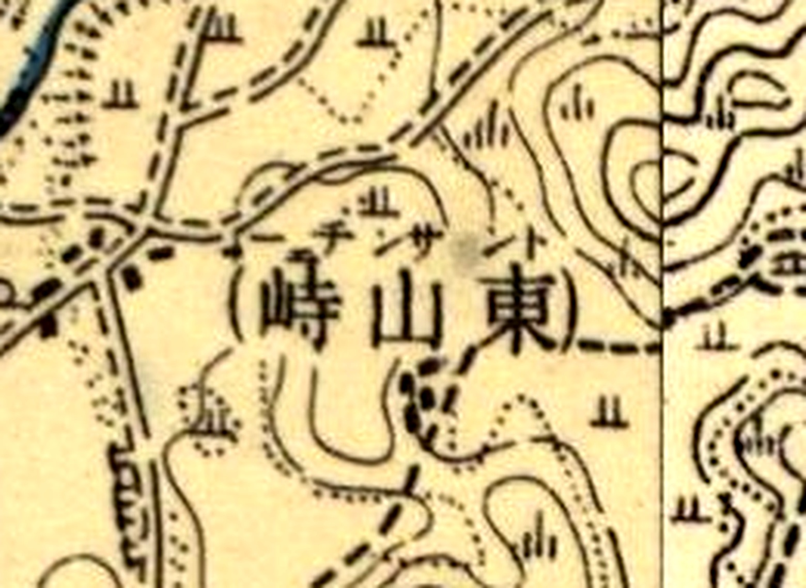 |
| **`兩屈峴` 145** · 가타카나 **`ヤングルゴケ`**(양굴고개) | **127°29.5′E 36°23.4′N** | 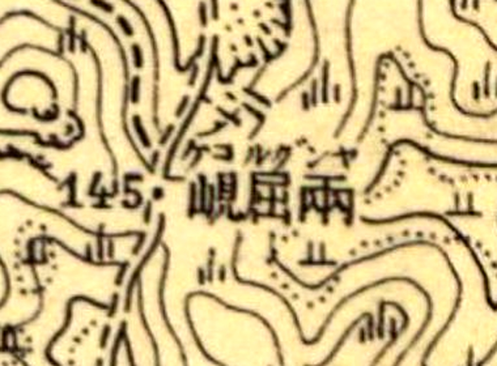 |
| **`栗寺洞`** · 가타카나 `…ルサドン`(율사동) | **127°24.7′E 36°22.0′N** | 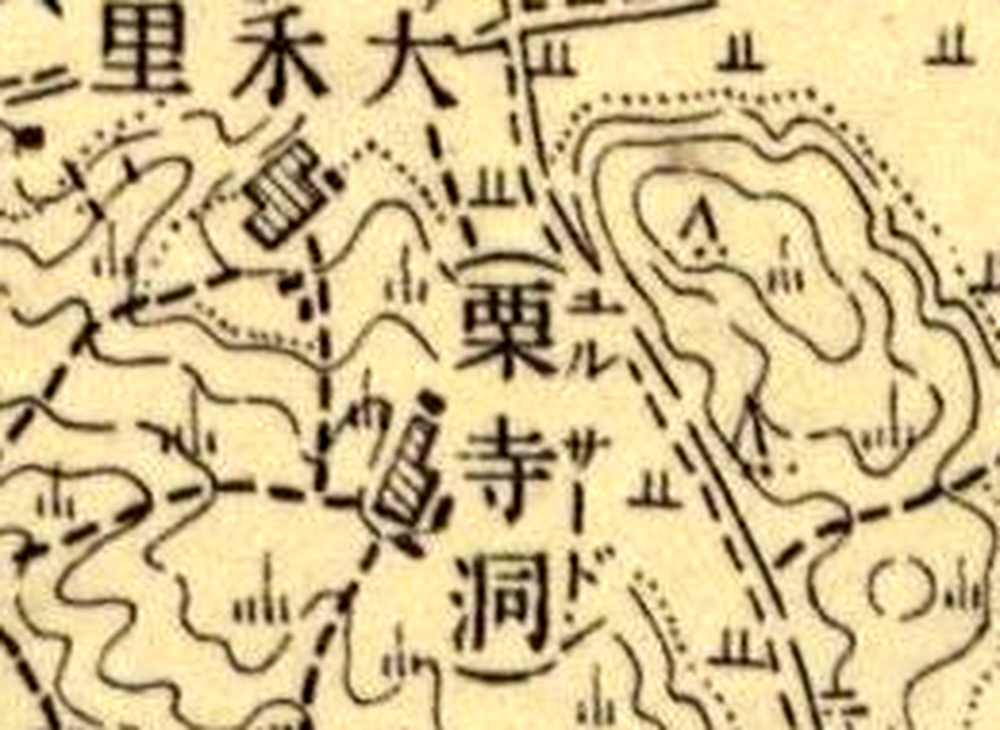 |
| **`烽燧臺址` 431**(계족산 봉수대) · `鷹峰山` 318 · `比來庵` 卍 | **127°26.9′E 36°23.5′N** | 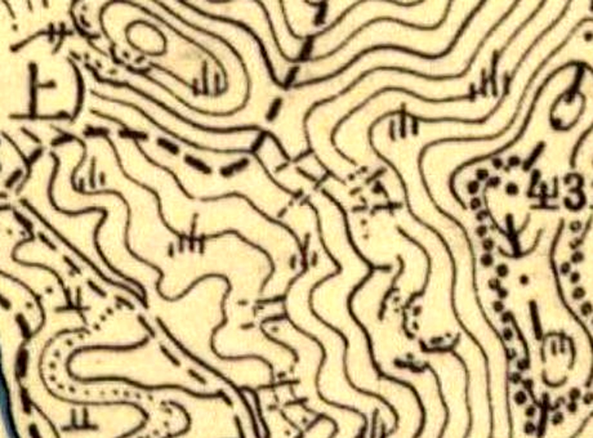 |

**무엇이 걸리는가.**

| 읽은 것 | 어디에 걸리나 |
|---|---|
| `東山峙` | **14.9 의 `Tongsanjae`(동산재)의 한자입니다.** 글자가 **`峙`** 이므로 **고개가 확정**됩니다 |
| `兩屈峴` | **새 고개.** 표고 `145` 와 우리말 이름이 함께 붙어 있습니다 |
| `栗寺洞` | **[6.6](#66-栗峙-인가-栗寺-인가--둘째-글자)** — 「`栗寺` 라는 표기가 실재하는가」에 **대전 안에 실재한다**는 답 |
| `烽燧臺址` | 11장의 **봉수 노선**과 맞물립니다 |

#### ⚠ `-재` 인가 `-치` 인가 — 두 자료가 갈립니다

| 자료 | 적은 것 |
|---|---|
| AMS 1:250,000 `NJ 52-14`(1953 편찬) | **`Tongsanjae`** — **동산재** |
| 국토정보플랫폼 1:50,000(1910~1930) | **`東山峙` / `トンサンチ`** — **동산치** |

**한자는 `峙` 하나인데 우리말이 「재」와 「치」로 갈립니다.** 2장이 적어 둔
**「`-치` 로 들린다고 다 `峙` 가 아니다」의 뒤집힌 짝**입니다 — 같은 `峙` 를 두 자료가
달리 읽었습니다.

| | **확인된 것** | **아직 아닌 것** |
|---|---|---|
| | 1919년 원도는 **`トンサンチ`(동산치)**, 1953년 AMS 는 **`Tongsanjae`(동산재)** 로 적었다 | 어느 쪽이 현지 발음인가. 둘 다였는가 |

**둘 다 「치/재」가 섞여 쓰이는 우리말 관행 안에 있습니다.** 같은 도엽의
`兩屈峴` 은 한자가 **`峴`** 인데 우리말은 **「고개」** 입니다 — **`峙`·`峴` 과
「치」·「재」·「고개」 사이에 일대일 대응이 없다**는 것을 한 도엽이 보여 줍니다.

#### 일본 원도는 **한자 위에 가타카나로 현지 발음**을 답니다

이것이 이 자료의 가장 큰 값입니다. **8장이 「자료는 다 있는데 이름이 없다」고 적은
그 문제를 정면으로 풉니다** — `鷹峰山`에 **`メーボーサン`(매봉산)**, `東山峙`에
**`トンサンチ`**, `栗寺洞`에 `…ルサドン` 처럼 **한자와 우리말을 한 자리에서 줍니다.**

**3장의 `(미상)` 스물몇 줄이 여기서 이름을 얻을 수 있습니다.**


### 8.4 측도 연도 — **한 해가 아닙니다. 도엽마다 다릅니다** (2026-10-02)

**8.1 이 「메뉴는 1910~1930 인데 내부 이름은 `PC050K_1945` 라 어긋난다」고 적어 둔 것을
안에서부터 캐 보았습니다.**

#### 먼저, 모자이크는 **10′ × 15′ 일본 도엽**을 이어 붙인 것입니다

색조가 블록으로 갈리는 자리를 재 보니 **이음매가 정확히 `36°20′`·`36°30′`(위도)와
`127°15′`·`127°30′`(경도)** 에 있습니다. **AMS 와 같은 격자**이고, 국토정보플랫폼이
오늘 1:50,000 도엽번호(`15′ × 15′`)로 묶어 파는 것과는 다릅니다.

**그러므로 「이 지도의 측도 연도」라는 물음에는 도엽마다 따로 답해야 합니다.**

#### 대전 시가가 든 도엽 (`36°10′~20′ × 127°15′~30′` = 公州 11호)

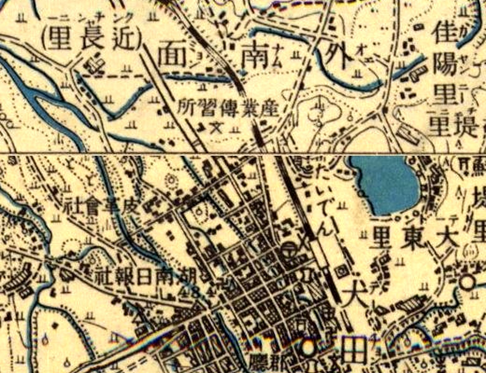
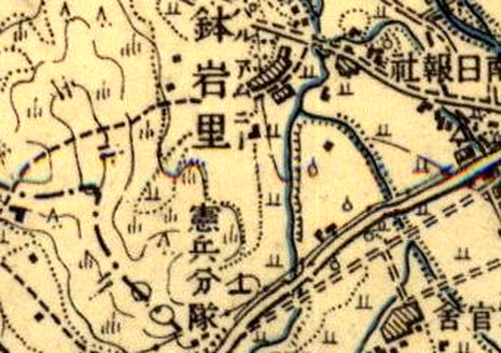

| 증거 | 좁혀지는 범위 | 굳기 |
|---|---|---|
| **`大田面`**(大田邑 아님) | **1931년 4월 대전읍 승격 이전** | **단단함** |
| **소제호가 그려져 있음** | **매립(1927년 무렵) 이전** — 회원 작업 폴더 `소제호_조사메모.md` 참조 | **단단함** |
| 경부선과 **호남선**이 둘 다 | **1914년 1월 호남선 전통 이후** | **단단함** |
| **`憲兵分隊`** 가 있고 **경찰서가 없음** | 헌병경찰제 **1910~1919.8** 의 표지 | **방증** — 헌병대 자체는 뒤에도 있었으므로 단독으로 못 박지 않습니다 |
| `湖南日報社`·`電氣會社`·`陸軍官舍`·`郡廳`·`皮革會社`·`專賣課出張所` | 1910년대 대전의 시설 | 방증 |

**→ `1914 ~ 1927`, 좁히면 `1910년대 후반`.**

**14장이 AMS 「Taejon」(6622 I)의 저본으로 확정한 「1919년 발행 · 1917년 측도」와
딱 겹칩니다.** 도곽도 **같은 `36°10′~20′ × 127°15′~30′`** 입니다.
**같은 판으로 보입니다** — 다만 도곽 밖 주기를 읽기 전에는 **「같다」고 못 박지 않습니다.**

#### 유성·회덕이 든 도엽 — **1919년입니다** (2026-10-02, 서지로 확정)

**대전–유성 도로가 실마리였습니다.** 그 길이 갑천을 건너는 자리에 **`萬年橋`** 가 적혀
있고, 『조선토목사업지』(1937)에 **「天安大邱線 一等 · 萬年橋 · 長 38.05 m · 混凝土 ·
大田郡 柳川面 月坪里·儒城面 鳳鳴里 入會 · 昭和3년(1928) 11월 22일 起工」** 이 있습니다
— **자리와 이름이 지도와 정확히 같습니다.**

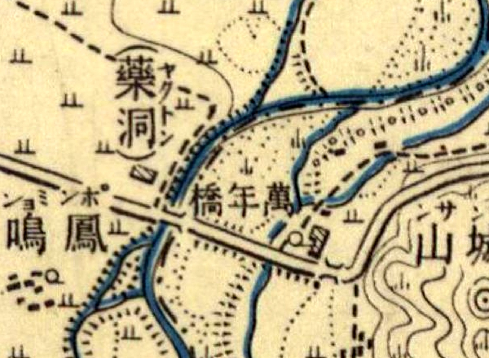

**그래서 「1929년 이후인가」를 의심했으나, 서지가 아니라고 답했습니다.**

### 8.5 국토정보맵의 **서지로 연도를 확정했습니다** (2026-10-02)

**추정할 필요가 없었습니다 — 국토정보맵이 도엽별 서지를 가지고 있습니다.**

#### 어떻게 꺼내나

| | |
|---|---|
| 조회 | `POST /ms/map/oldmapQuery.do` · 본문 `minx,miny,maxx,maxy`(**EPSG:5179**) + **`type=1`** |
| `type` | `0` 지형도 · **`1` 광복이전지형도** · `2` 토지이용현황도 · `3` 연안해역도 · `4` 음영지형도 |
| 돌아오는 것 | `mapname`·`scale`·**`printdate`**·`adjustmentdate`·`photographicdate`·`editingdate`·`filepathlink`·도곽(`minx…maxy`) |
| 낱장 미리보기 | `POST /ms/map/oldmapExtnsCnvrs.do` 에 `path=<filepathlink>` → 크기를 돌려줌 → `GET /ms/map/oldmapOutputStream.do?path=<2중 인코딩>` 로 **2,205 px 전지(여백 포함)** |

**이 미리보기에는 도곽 밖 여백이 들어 있습니다.** 8.1 이 「타일로는 도곽 밖이 안 보인다」고
적어 둔 벽이 여기서 뚫립니다.

#### 간기(刊記) — 도곽 밖 주기를 읽었습니다

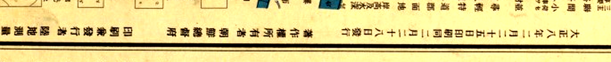

> **`大正八年二月十五日印刷`** · **`同二月二十八日發行`**
> `著作權所有者 朝鮮總督府` · `印刷兼發行者 陸地測量部`

**`大正八年` = 1919년.** **「유성」과 「대전」 두 도엽이 똑같습니다** —
**1919년 2월 15일 인쇄, 2월 28일 발행.**

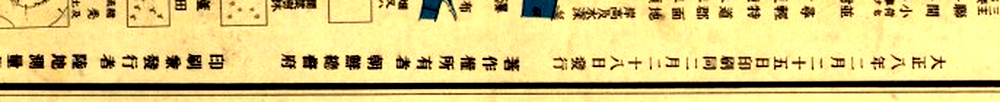

**그러므로 `萬年橋` 는 1928년 콘크리트 다리가 아닙니다.** 1917년 『조선대전발전지』가
「자동차·마차·인력거·자전거가 다닌다」고 적은 **그 길의 앞선 다리**입니다.
**8.4 가 의심만 하고 못 가렸던 것을 서지가 끊었습니다.**

#### 1928년 공사는 **개축이었습니다** — 표 이름이 그렇게 적습니다

**『조선토목사업지』에서 그 표의 이름을 다시 보았습니다.**

> **`橋梁改良工事施行一覽表`** (교량**개량**공사 시행일람표) — 접지(折込) 大表, 본문 139면 부
> 같은 표에 **`大田橋`** 와 **`萬年橋`** 둘이 실려 있습니다

**`改良`은 고치는 공사입니다. 새로 놓는 것이 아닙니다.**
1919년 도엽에 이미 다리가 있던 것과 **어긋나지 않고 맞물립니다.**

| | |
|---|---|
| **확인된 것** | **1919년 2월 발행 도엽에 `萬年橋` 가 이름까지 붙어 그려져 있습니다.** 1928년 11월 기공한 공사는 **「橋梁改良工事」**, 곧 **콘크리트로 고쳐 놓은 것**입니다 |
| **아직 아닌 것** | **언제 처음 놓였는가.** 도엽은 1919년을 말할 뿐이고, 측도는 그보다 앞섭니다. 1917년 책이 이미 자동차를 적으므로 **적어도 1917년 이전**입니다 |

**세 자료가 한 줄로 섭니다.**

| 연도 | 자료 | 말하는 것 |
|---|---|---|
| **~1917 이전** | 『조선대전발전지』(1917) | 대전·유성 간 2리 도로에 **자동차·마차·인력거·자전거**가 다님 |
| **1919** | 1:50,000 「유성」 도엽 | **`萬年橋`** 가 이름까지 붙어 그려짐 |
| **1928.11~** | 『조선토목사업지』(1937) | **`橋梁改良工事`** — 콘크리트 1등교 **38.05 m** 로 개축 |

**고개 조사의 몫은 아니지만** 대전 근대 도로사에 쓸 만한 날짜 셋이라 적어 둡니다.

#### 대전 둘레 스무 장 — 도엽 색인·연도표

**符號**는 파일 이름에 들어 있습니다(`O0367`+일련+**符號**+`01`). 「유성」 도엽 왼쪽 위의
`符號 194` 와 맞습니다.

| 도곽 (E) | 36°40′~50′ | 36°30′~40′ | 36°20′~30′ | 36°10′~20′ | 36°00′~10′ |
|---|---|---|---|---|---|
| **127°00′~15′** | 천안 **1927**<br>(221) | 광정리 **1921**<br>(207) | **공주 1922**<br>(193) | 논산 **1924**<br>(179) | 강경 **1925**<br>(163) |
| **127°15′~30′** | 오근장 **1918**<br>(222) | **청주 1923**<br>(208) | **유성 1919**<br>(194) | **대전 1919**<br>(180) | 금산 **1918**<br>(164) |
| **127°30′~45′** | 청안 **1918**<br>(223) | 미원 **1916**<br>(209) | 보은 **1919**<br>(195) | **옥천 1919**<br>(181) | 무주 **1917**<br>(165) |
| **127°45′~128°00′** | 괴산 **1918**<br>(224) | 속리산 **1919**<br>(210) | 청산 **1919**<br>(196) | 영동 **1923**<br>(182) | 설천 **1918**<br>(166) |

**연도가 1916~1927에 흩어집니다.** 메뉴의 「1910~1930」이 뭉뚱그린 말이 아니라
**실제로 그 범위**였습니다.

#### AMS 저본 연도가 이 표에서 한꺼번에 나옵니다

**AMS 1:50,000 의 도엽 이름은 일본 도엽 이름 그대로입니다.** 14장이 「Taejon 의 저본은
1919년판」이라고 제작 주기로 확정한 것이, 이 표의 **「대전 1919」와 정확히 맞습니다.**

| AMS | 일본 도엽 | 이 표의 인쇄 | 14장이 적어 둔 것 |
|---|---|---|---|
| **Taejon 6622 I** | 대전(180) | **1919** | **1919년 발행** ✓ **일치** |
| Kumsan 6622 II | 금산(164) | 1918 | — |
| Nonsan 6622 IV | 논산(179) | 1924 | — |
| Kanggyong 6622 III | 강경(163) | 1925 | — |
| Yongdong 6722 I | 영동(182) | 1923 | — |
| Muju 6722 III | 무주(165) | 1917 | — |
| Solchon 6722 II | 설천(166) | 1918 | — |
| Songni San 6723 I | 속리산(210) | 1919 | — |
| Chongsan 6723 II | 청산(196) | 1919 | — |

**다만 `Taejon` 말고는 AMS 가 이 판을 베꼈다고 아직 확인하지 않았습니다.**
AMS 도엽마다 제작 주기에 저본 연도가 적혀 있으므로, **한 장씩 맞춰 보면 끝납니다.**

#### 아직 남은 것 — **測圖 연도**

간기는 **印刷·發行**만 말합니다. **測圖(측량) 연도는 이 기둥에 없습니다.**
14장이 「대전 = 1917년 측도」라 적은 근거를 이 도엽에서는 아직 못 찾았습니다.
**발행이 1919년 2월이니 측도는 그보다 앞섭니다** — 그 이상은 못 박지 않습니다.

## 9. 문헌 대조표 — 채워 나갈 표

확인한 사람이 값과 날짜를 적습니다. 없으면 `없음`, 아직 안 봤으면 `미확인`.

**해동지도 칸은 따로 두지 않습니다** — 이 표의 고개들이 대부분 해동지도에서 처음 나왔고,
그 기록은 11장에 도엽별로 있습니다. 표가 채워야 하는 것은 **아직 보지 않은 계열**입니다.

| 표기 | 대동여지도 | 1872년 지방지도 | 여지도서 | 읍지 | 조선지지자료 | 지명총람 | **1919 지형도(AMS)** | 현대 지형도 |
|---|---|---|---|---|---|---|---|---|
| 崖柏峙 | 미확인 | 미확인 | 미확인 | 미확인 | 미확인 | 미확인 | 미확인 | 미확인 |
| 子田峙 | 미확인 | 미확인 | 미확인 | 미확인 | 미확인 | 미확인 | 미확인 | 미확인 |
| 子峴 | 미확인 | 미확인 | 미확인 | 미확인 | 미확인 | 미확인 | 미확인 | 미확인 |
| 雞峙 | **`雞峴` 로 16-04 (0.75, 0.21)** (13.6) | 「진산군지도」에서 **미확인** — 후보 자리로 보던 (0.74, 0.50)은 **2026-10-01 에 리 패로 재분류**(12.5) | 미확인 | 미확인 | 미확인 | 미확인 | **鷄峙** 1049/1485 | 닭재 (동구 삼괴동) |
| 于峙嶺 | 미확인 | 미확인 | 미확인 | 미확인 | 미확인 | 미확인 | 미확인 | 미확인 |
| 馬達峙 | **16-04 (0.80, 0.27)**〔?〕 확신 중 (13.5) | **「옥천군지도」 (0.27, 0.17)** (12.4) | 미확인 | 미확인 | 미확인 | 미확인 | **馬達嶺** 1048/1481 | 마달령 (동구 삼괴동↔옥천) |
| 奄峴 | 미확인 | **「진잠지도」 (0.51, 0.53)** (12.2) | 미확인 | 미확인 | 미확인 | 미확인 | 미확인 | 미확인 |
| 牛拳峴 | 미확인 | **「진잠지도」 (0.13, 0.61)** (12.2) | 미확인 | 미확인 | 미확인 | 미확인 | 미확인 | 미확인 |
| 吉峙 | **`質峙` 로 15-04 (0.75, 0.99)** (13.4) | **「회덕현지도」 (0.70, 0.26)** (12.1) | 미확인 | 미확인 | 미확인 | 미확인 | 미확인 | 질티고개 (대덕구 비래동) |
| 薪峙 | 미확인 | **「금산군지도」 (0.39, 0.30)** (12.6) | 미확인 | 미확인 | 미확인 | 미확인 | 미확인 | 미확인 |
| 栗峙〔?〕 | 미확인 | 「공주목지도」에서 **없음**(12.3) | 미확인 | 미확인 | 미확인 | 미확인 | 미확인 | 미확인 |
| 琵琶嶺 | 미확인 | 미확인 | 미확인 | 미확인 | 미확인 | 미확인 | **1045/1487** | 미확인 |
| 墨峙 | 미확인 | 미확인 | 미확인 | 미확인 | 미확인 | **먹티**(15.1) | **1043/1478** | 미확인 |

## 10. 확인이 막힌 곳

2026-09-01 조사 시점에 아래는 작업 환경의 프록시에 막혀 원문을 읽지 못했고, 검색 결과
요약에만 의존했습니다. **다시 볼 때 여기부터 보십시오.**

- 한국민족문화대백과사전 (`encykorea.aks.ac.kr`) — 「회덕」 항목 교통로 서술
- 대전시립박물관 지명 자료 (`daejeon.go.kr`)
- ~~대전동구문화원 지명유래 (`dgcc.or.kr`)~~ → **2026-10-01 열림. 15장 참조**
- 역지사지 HGIS 위키 (`hisgeo.info`)
- 위키미디어 공용 (`commons.wikimedia.org`) — 고지도 이미지

**2026-09-02 — 마지막 항목은 풀렸습니다.** 1872년 지방지도 도엽 열한 장을 회원이 원본
파일로 갖고 있어, 커먼즈를 거치지 않고 규장각 스캔본을 직접 확대해 읽습니다(12.3, 12.4).
**남은 막힌 곳은 문헌 쪽 다섯 가운데 넷입니다.**

따라서 6.1의 근거 1·2는 견고하지만, 질현 대안 후보는 정황 수준입니다.

### 2026-10-01 — 커먼즈의 **해상도 한계**가 새 제약입니다

2026-09-30 에 커먼즈 썸네일 주소(`Special:FilePath/…?width=N`)로 도엽을 직접
내려받는 길이 열렸습니다. 다만 **한계가 둘** 있습니다.

| 한계 | 내용 |
|---|---|
| **최대 3,840 px** | 썸네일 버킷의 상한입니다. 그보다 큰 사본은 받을 수 없습니다 |
| **원본 주소는 막힙니다** | `?width=` 없이 부르면 `429 Too many requests` 가 돌아옵니다. 2026-10-01 에 여러 번 시도했습니다 |

도엽마다 이것이 뜻하는 바가 다릅니다.

| 도엽 | 원본 크기 | 3,840 px 로 충분한가 |
|---|---|---|
| 해동지도 (모든 도엽) | 약 2,409 px | **원본 그대로입니다** — 더 키울 여지가 없고, 남은 글자는 규장각 고해상본이 필요합니다 |
| 1872 옥천군지도 | 8,434 px | 45% — **넉넉합니다**(봉수 주기·리 목록 다 읽힘) |
| 1872 회덕현지도 | 7,564 px | 51% — **넉넉합니다** |
| 1872 진잠지도 | 5,053 px | 76% — **넉넉합니다** |
| **1872 공주목지도** | **13,856 px** | **28% — 모자랍니다.** 잔글씨가 뭉개집니다 |

**1872년 공주목지도만 걸립니다.** 대전의 다섯 면(산내·유등포·탄동·구즉·명탄)이 이
도엽에 있어 **대전 서부·북부 리 이름의 1872년 상태**가 여기 들어 있는데,
3,840 px 로는 면 주기의 잔글씨를 읽지 못했습니다(2026-10-01 확인).
**회원이 가진 원본 파일(13,856 px)이 있어야 합니다** — 12.3 의 채록은 그 파일로
한 것입니다.


---

# 3부 — 지도별 판독

도엽 한 장에 절 하나입니다. **1·2부의 근거가 모두 여기에 있습니다.**

## 11. 『해동지도』 (18세기 중엽)

### 11.1 『해동지도』 「회덕현」 — 채록 완료 (2026-09-01)

**전문 기록: [`해동지도-회덕현-판독.md`](해동지도-회덕현-판독.md)** — 여기에는 고개만 둡니다.

『해동지도』 8책, 1750년대 초 제작 추정, 규장각한국학연구원 소장, 보물. 그 가운데 충청도
회덕현 도엽 1장. 우횡서(오른쪽→왼쪽)로 적혀 있습니다.

[`판독-기록-형식.md`](판독-기록-형식.md) 을 따릅니다. `위치` 는 도엽 폭·높이를 각각 1로 본
상대 좌표입니다.

| 위치 | 표기 | 읽기 | 확신 | 판독자 | 날짜 | 근거 |
|---|---|---|---|---|---|---|
| (0.167, 0.386) | **崖柏峙** | 애백치 | 중 → **상** | Claude | **2026-10-01** | 서북, `公州界` 안쪽. `崖`·`柏`·`峙` 세 글자 모두 또렷 |
| ~~(0.23, 0.53)~~ | ~~馬峴~~ → **`縣內面`** | — | **철회** | Claude | **2026-10-01** | **고개가 아니라 면 이름입니다** (아래 「철회」) |
| (0.542, 0.591) | **子田峴** | 자전현 | 중 → **상** | Claude | **2026-10-01** | 관아 동남, `甲川` 동편. `子`·`田`·`峴`, `峴` 의 `山` 또렷. 첨지에 함께 언급 → 6.2 |
| (0.621, 0.620) | **子峴** | 자현 | **상** | Claude | **2026-10-01 재확인** | 자전현 남동, `凉亭` 위. 첨지에 함께 언급 → 6.2 |
| **(0.867, 0.637)** | **雞峙** | 계치 | **상** | Claude | **2026-10-01 재확인** | 동남, `珎山界` 바로 서편. `雞`(奚+隹)·`峙`(山+寺) 둘 다 또렷. '닭재' → 6.4 |
| (0.946, 0.370) | `于峙`**`□`** | 우치□ / 우티재 | **하** | Claude | **2026-10-01** | 동북, `沃川界` 바로 아래. **셋째 글자에 `山` 부수가 없습니다** — `嶺` 이 아니라 `領` 쪽 → 6.1 |

#### 2026-10-01 — **여섯을 한 자[尺]로 다시 쟀습니다**

같은 날 연기현에서 **`峴`/`峙` 는 왼쪽 `山` 부수 하나로 갈린다**는 것을 확인하고
(11.6.5), 그 검사를 **대전 본역**에 그대로 돌렸습니다. 커먼즈 사본(1,920 px)에서
라벨마다 10배로 키워 보았습니다.

| 표기 | 결과 | 근거 |
|---|---|---|
| `崖柏峙` | 확신 **중→상** |  `崖`(山+厓)·`柏`(木+白)·`峙`(山+寺) 모두 또렷 |
| ~~`馬峴`~~ | **철회** | 아래 |
| `子田峴` | 확신 **중→상** |  `子`·`田`·`峴`, `峴` 의 `山` 또렷 |
| `子峴` | 상 유지 |  |
| `雞峙` | 상 유지 | 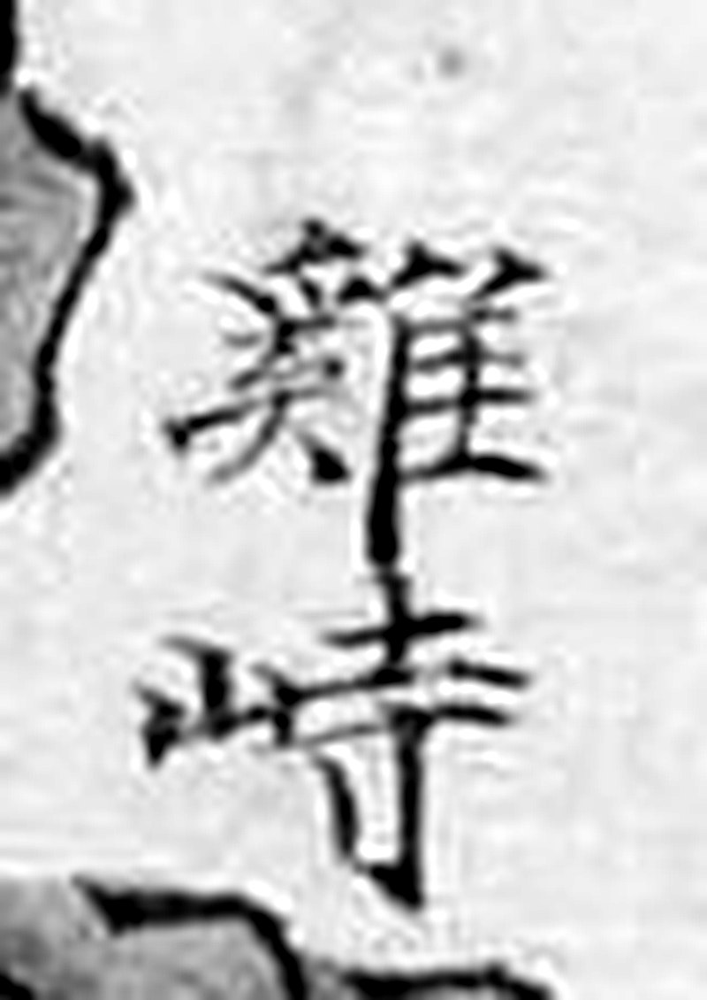 **6.4 의 핵심 증거가 검사를 통과했습니다** |
| `于峙嶺` | **셋째 글자가 흔들립니다** | 아래 |

##### 철회 — **`馬峴` 은 `縣內面` 이었습니다**

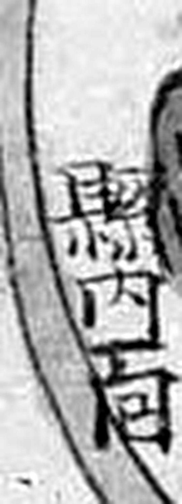
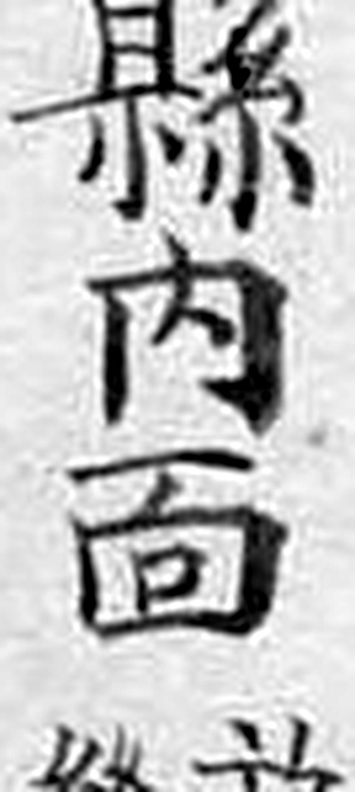

*왼쪽이 그림 속 라벨(0.225, 0.529), 오른쪽이 **같은 도엽 면별 거리표의 `縣內面`**.*

**세 글자이고 같은 글자입니다** — `縣`(県+系) · `內` · `面`. 2026-09-01 에
저해상 그림에서 두 글자로 보고 `馬峴`(말고개)으로 읽었던 것인데,
**`縣` 의 왼쪽 `県` 을 `馬` 로, `內` 를 `峴` 으로 본 오독**입니다.

**같은 도엽 안에 해서로 또렷하게 쓰인 짝이 있었습니다** — 면별 거리표의
`縣內面` 입니다. 그림 라벨과 나란히 놓으면 바로 갈립니다.

> **오늘 세 번째로 쓴 방법입니다.** 연기는 `石峴` 의 `峴` 이, 회인은 `墨嶺` 의
> `嶺` 이, 회덕은 **면별 거리표의 `縣內面`** 이 자[尺]가 됐습니다.
> **흐린 글자를 더 키우기 전에, 같은 도엽에서 또렷하게 쓰인 같은 글자를 먼저
> 찾습니다.**

**3장과 9장에서 내렸습니다.** 해동지도 회덕현의 고개는 여섯이 아니라 **다섯**입니다.

##### `于峙嶺` — 셋째 글자에 `山` 이 없습니다


우횡서로 오른쪽부터 `于` · `峙` · `□` 입니다.

- **`于`** — 가로 둘에 갈고리 하나. **왼쪽 위에 `丿` 가 없으므로 `牛` 는 아닙니다.**
  `于`/`亐` 로 좁혀집니다 → 6.1 에 진전입니다.
- **`峙`** — `山` 부수가 또렷합니다. 확신 상.
- **셋째 글자** — 오른쪽은 `頁` 가 분명한데 **왼쪽에 `山` 이 없습니다.**
  같은 사본·같은 크기의 회인현 `墨嶺`(11.6.6)은 `山` 이 또렷하므로, **해상도 탓으로
  보기 어렵습니다.**

곧 **`嶺` 이 아니라 `領`** 일 수 있습니다. `領` 은 `嶺` 의 통용자이므로 **뜻은
그대로 「재」**이고, 맞다면 **2장에 다섯 번째 고개 글자**가 됩니다.
확신 `하` 로 두고 규장각 고해상본을 기다립니다.

**좌표는 개략값입니다(±0.03).** 대화에 붙여진 전체 도엽 그림에서 눈대중으로 잡은 것이고,
원본을 열어 확인하지 않았습니다. **`子田峴`·`子峴`(2026-09-03)과 `雞峙`(2026-09-30)는
도엽을 열어 조였습니다** — 계치는 (0.79, 0.68)에서 (0.87, 0.64)로 꽤 옮겨졌습니다. 원본으로 판독하시는 분이 값을 조여 주십시오 — 그 자리에서
`crops/` 에 조각을 남기시면 뒤에 오는 사람이 바로 확인합니다.

도엽 동쪽 경계를 북에서 남으로 훑은 순서: `于峙嶺` → `東面` → `食藏山` → `雞峙` → `珎山界`.
즉 **6번은 식장산보다 북쪽, 5번은 남쪽**입니다. 비정 논의의 기준선입니다.

**2026-09-30 에 남쪽 경계를 훑고 면별 거리표 7면을 전문으로 읽었습니다**(전문은 판독 문서에).

| 면 | 初境 | 終境 | 사지와 대조 |
|---|---|---|---|
| `東面` | 10리 | 20리 | `東距 沃川界 二十里` ✓ |
| `外南面` | 15리 | **30리** | **`南距 珍山界 三十里` ✓** |
| `內南面` | 1리 | 10리 | |
| `西面` | 5리 | 10리 | `西距 公州界 十里` ✓ |
| `縣內面` | 5리 | 10리 | 읍치 |
| `北面` | 9리 | 15리 | |
| `一道面` | 8리 | 30리 | 금강 북안 쪽 |

**`外南面` 종경 30리가 사지의 `南距 珍山界 三十里` 와 맞습니다** — 회덕 남쪽 끝이
곧 외남면의 끝이고 거기가 진산계입니다. 6.4 에 걸립니다.

같은 도엽에서 함께 읽은 그 밖의 지명(고개는 아니지만 뒤에 쓸 수 있어 남깁니다) —
표제 `懷德縣 城郭無` / 民戶 2,272호·田 2,375결·畓 1,218결 / 사지: 東 沃川界 20리, 西 公州界
10리, 南 珍山界 30리, 北 文義界 20리 / 관아 계열 `衙舍` `客舍` `鄕校` `倉`과 서쪽 `貞民驛` /
산천 `食藏山` `注山` `甲川`, 못 두 곳, `船岩` / 서원 `崇賢書院`, `靖節書院`(?), 북쪽 강가 두 곳(미확정) /
그 밖 `凉亭`, `三亭洞`(?).

### 11.5 『해동지도』 「충청도 진잠현」 — 전면 훑기 (2026-09-03)

**전문 기록: [`해동지도-진잠현-판독.md`](해동지도-진잠현-판독.md)**

**본체를 전면 훑었으나 고개 표기가 하나도 없습니다.** 1872년 진잠 도엽에는 `奄峴`·`牛拳峴`
둘이 있으니, **해동지도가 고개를 안 적는 도엽**이라는 뜻으로 읽는 편이 온당합니다 —
같은 계열의 회덕현 도엽은 여섯을 적었으므로 **도엽마다 다릅니다.**

**사지가 1872년과 다릅니다.**

| | 해동지도 (1750년대) | 1872년 진잠지도 |
|---|---|---|
| 東 | **懷德界 20리** (去本縣 30리) | 介水院里 **公州界** 10리 |
| 西 | **尼山界 20리** (去本縣 40리) | 月底里 **連山界** 15리 |
| 南 | **連山界 20리** (去本縣 45리) | 壯安里 **珍山界** 15리 |
| 北 | 公州界 15리 (去本州 65리) | 鶴下洞 公州界 10리 |

**해동지도 진잠은 동쪽을 회덕이라 적습니다.** 1872년 도엽은 회덕을 사지에 넣지 않고
아래 여백의 `去懷德路` 도로 주기로만 남겼습니다 — **같은 고을을 120년 사이에 다르게
적은 것**이고, 이웃 관계를 사지만으로 판단하면 안 된다는 사례가 하나 더 늘었습니다.

방위는 **위가 西** 로 1872년 도엽과 같습니다.

#### 2026-10-01 — **고개는 그대로 없고, 쪽지 계통이 하나 드러났습니다**

같은 날 옥천(`九也峙`)과 연산(`□□峴`)에서 「고개가 없다」를 거뒀으므로 진잠도 다시
훑었습니다. **진잠은 그대로입니다** — `峙`·`峴`·`嶺` 이 한 자도 없습니다. 도엽 자체가
성겨서, 산 다섯·물 하나·누정 하나·절 하나·관아 넷·면 다섯이 전부입니다.

**기문도 호구·전결·곡물·군병 네 조목뿐이고 산천 조가 없습니다.** 2026-10-01 에
충청도 도엽 일곱을 모두 읽었는데 **한 틀**이었습니다 —
회덕·진잠·문의·옥천·연기·회인·연산. 전라도 진산·금산만 산천 조를 갖습니다
(11.2 · 11.4).

##### 쪽지 둘 — 11.6.8 의 방어처 첨지와 **다른 계통**입니다

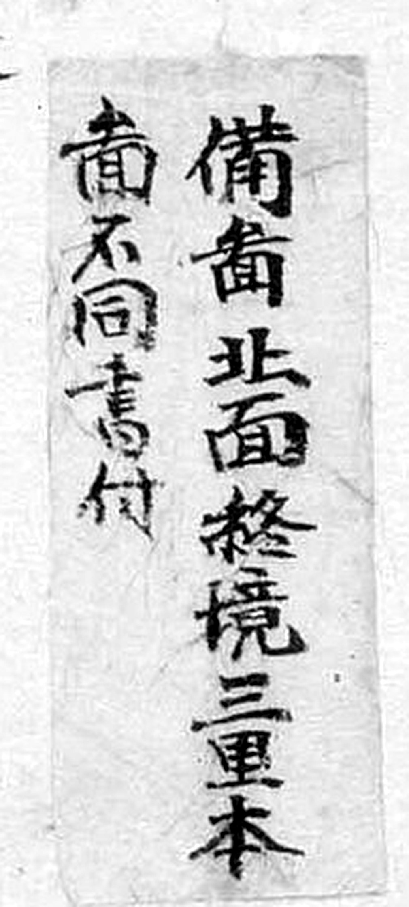
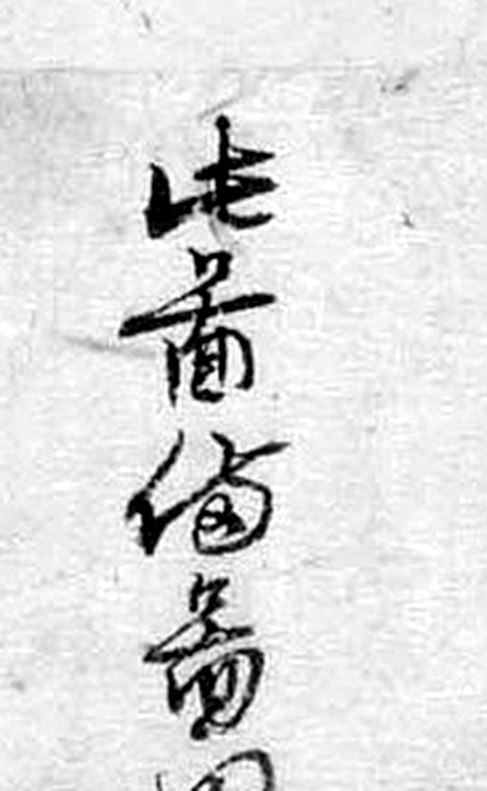

```
備面 北面終境三里 本□ / 面不同 書付      (가운데 위)
此面 備面 □〔?〕                          (가운데 아래)
```

**좌상단이 아니라 지도 한가운데와 아래**에 붙었고, 내용이 **면별 거리표의 숫자**입니다.
면별표는 `北面 終竟十里` 인데 쪽지는 `三里` 라 적고 **「본(本)과 달라 써 붙인다」**
합니다.

같은 계통이 셋 더 있습니다.

| 도엽 | 자리 | 내용 |
|---|---|---|
| **진잠현** | 가운데 위·아래 | `備面 北面終境三里 本面不同書付` · `此面備面□` |
| **회인현**(11.6.6) | 면별표 아래 | `邑內面`·`江外面` 을 더하고 `本面無備面有`〔?〕 |
| **옥천군**(11.6.1) | 면별표 아래 | `邑內面 初竟 終竟` — **숫자가 비어 있습니다** |

**해동지도에는 「면별 거리표를 고치는 쪽지」 계통이 따로 있습니다.**
11.6.8 의 방어처 첨지(아홉 도엽)와 구별해 적습니다. 넷 가운데 하나는 끝내 값을
못 채웠고 하나는 본과 다르다고 적었습니다 — **이 책이 작업 중인 책이었다는 증거**가
모입니다.

`備面` 두 글자의 뜻은 아직 모릅니다. **세 도엽에 같은 말이 나오므로 함께 봐야 합니다.**

##### 면별 초경·종경 — 다섯 면

| 면 | 初竟 | 終竟 | | 면 | 初竟 | 終竟 |
|---|---|---|---|---|---|---|
| 東面 | 五里 | 十里 | | 西面 | 八里 | 三十里 |
| 上南面 | 十里 | 三十里 | | 北面 | 五里 | 十里 |
| 下南面 | 十里 | 三十五里 | | | | |

기문 곡물 숫자 셋도 고쳤습니다(전문 기록 문서).

### 11.2 『해동지도』 「전라도 진산군」 — 채록 (2026-09-02)

**전문 기록: [`해동지도-진산군-판독.md`](해동지도-진산군-판독.md)**

커먼즈본으로 판독했습니다(6·7책 저화질 그룹). 지명 라벨은 읽히나 잔글씨는 한계가 있습니다.

**사지(四至).** `東距沃川界四十里` · `西距全州界五里` · `南距錦山界十五里` ·
`北距公山界三十里`. 도엽 가장자리 경계 표기도 이와 같습니다 — `沃川界`(북동),
`公山界`(북, **두 번 적힘**), `連山界`(서북), `全州界`(서남), `錦山界`(동·남).

**면.** 東一面 · 東二面 · 南面 · 西面 · 北面. 군명 이칭 `玉溪` `珍同` `珍州`.

**고개.** 도엽 폭·높이를 1로 본 상대 좌표. **2026-10-01 에 눈금을 그어 다시 쟀습니다** —
`梨峙` 와 `方古峙` 가 크게 틀려 있었습니다.

| 위치 | 표기 | 읽기 | 확신 | 판독자 | 날짜 | 근거 |
|---|---|---|---|---|---|---|
| **(0.03, 0.62)** | 梨峙 | 이치 · **배티재** | 상 | Claude | 2026-09-02 | 서남, `全州界` 안쪽. 금산의 5대 고개로 지금도 불림. 곁에 `大芚寺`·`五臺山`. 곁 주기 `陰阨`〔?〕 |
| **(0.17, 0.47)** | 方古峙 | 방고치 | **상** | Claude | 2026-09-02 | 서북, `連山界` 안쪽. 곁에 `大芚山` |
| **(0.27, 0.52)** | **`晚目峙`** | **만목치 · 「―목재」** | **상** | Claude | 2026-09-30 | 서쪽, `鄕校` 서북. **기문이 `晚目峙 鎭岑界` 로 적어 첫 글자가 풀렸습니다** |
| **(0.71, 0.28)** | □峙 | **`新目峙` 로 봅니다** | **중** | 류철·Claude | 2026-10-01 | 동북, `沃川界` 아래·`西臺山` 서쪽. **붉은 길이 넘어감.** 곁 주기 `陰阨`〔?〕. 첫 글자는 미판독 |
| **(0.455, 0.310)** | 新峙 | 신치 · '새재'(추정) | **상** | Claude | 2026-09-02 | **만인산·`彌勒寺` 아래**, 좌우에 `公山界` → **대전 경계 고개 후보**(6.7) |
| **(0.52, 0.53)** | 車峙 | 차치 | **상** | Claude | 2026-09-02 | 중앙, `東面` 곁. 붉은 도로선이 넘음. 곁에 `水心臺` |
| **(0.69, 0.545)** | 枾峙 | 시치 · 감고개 | **상** | Claude | 2026-09-02 | 동쪽, `錦山界` 안쪽 |
| **(0.40, 0.82)** | 松院峙 | 송원치 | **상** | Claude | 2026-09-02 | 남쪽, `錦山界` 접경. 붉은 도로선이 넘음 |

#### 2026-09-30 — **기문을 읽었습니다. 고개가 넷 더 있습니다**

도엽 위쪽 띠의 기문은 **그림의 잔글씨보다 훨씬 또렷합니다.** 산천 조가 고개를
**경계 고을과 거리를 달아** 적어 두었습니다.

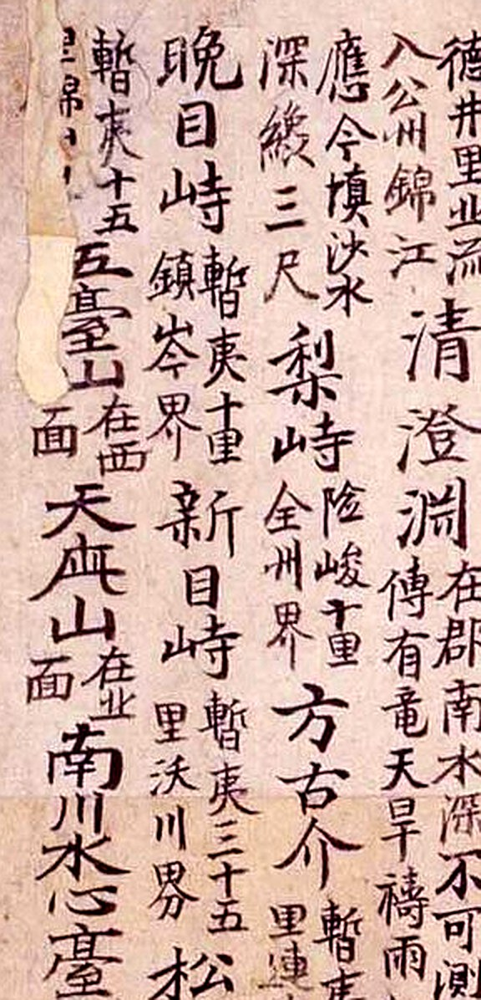

| 기문 표기 | 주기 | 그림에서 |
|---|---|---|
| `梨峙` | **`陰峻`** · **`十里`** · **`全州界`** | (0.03, 0.62) |
| **`方古介`** | **`暫夷`**〔?〕 · `□里` · **`連山界`** | (0.17, 0.47)에 **`方古峙`** — 글자가 다릅니다 |
| **`晚目峙`** | **`暫夷`**〔?〕 · **`十里`** · **`鎭岑界`** | (0.27, 0.52)의 `晚目峙` |
| **`新目峙`** | **`暫夷`**〔?〕 · **`三十五里`** · **`沃川界`** | 동북 `□峙`(0.71, 0.28) — 2026-10-01 |

**주기의 서식(2026-10-01).** 넷이 같은 틀입니다 —
`<이름>` + 할주 오른쪽 줄 `<성격 두 글자> <거리>里` + 왼쪽 줄 `<○○界>`.
`陰峻`(응달지고 가파름)은 `梨峙` 하나뿐이고 나머지 셋은 `暫夷`〔?〕(완만함)입니다.
**2026-09-30 에 `十重` 으로 읽은 것은 `里` 였습니다.** 거리는 읍치가 아니라 **고개에서
그 경계까지**로 읽어야 사지와 앞뒤가 맞습니다.

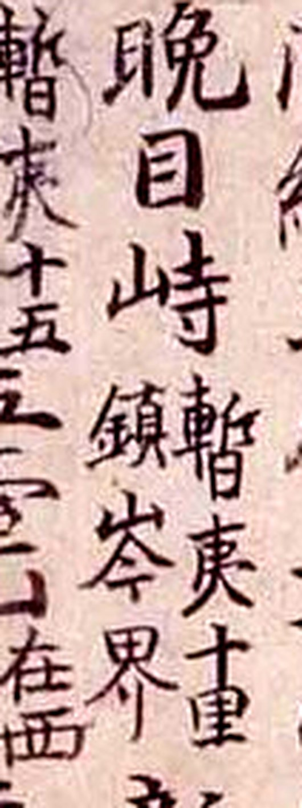 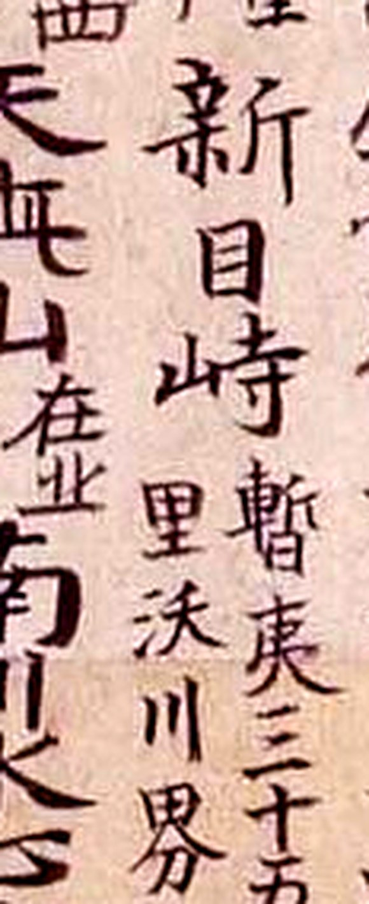 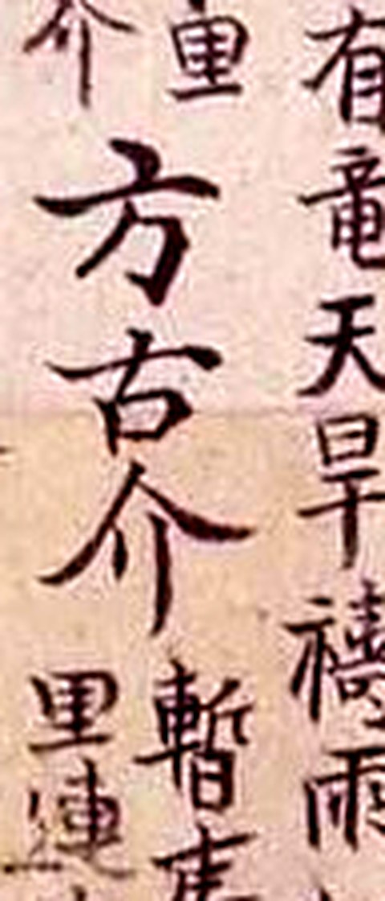

*왼쪽부터 `晚目峙 鎭岑界` · `新目峙 … 沃川界` · `方古介`.*

**① `□目峙` 의 첫 글자는 `晚` 입니다.** 2026-09-02 부터 `晥`/`晩` 사이에서 갈리지 않던
글자입니다. 그림 라벨은 8배로 키워도 안 갈렸는데 **같은 도엽 기문의 해서가 바로
읽힙니다.** 확신 `중` → **`상`**, 읽기는 **만목치**.
**그림이 아니라 기문이 풀었습니다 — 기문을 먼저 읽을 일이었습니다.**

**② 그 주기가 `鎭岑界` 입니다.** 둘을 바꿉니다.

- **4.2 의 「이웃이 서로를 적는 짝」에 진산↔진잠이 들어갑니다.** 1872년 진잠지도가
  `南 壯安里 珍山界 十五里` 로 진산을 적는데(12.2), **진산 쪽에서도 진잠을 적는 기록**이
  나왔습니다.
- **`晚目峙` 가 대전 경계 고개일 수 있습니다.** 진잠은 지금 유성구 남부·서구 남부입니다.

**다만 그림과 어긋납니다.** 그림의 `□目峙` 는 (0.27, 0.53), 도엽 **서쪽**(연산·전주
방면)입니다. 셋 중 하나입니다 — ① 그림 좌표(눈대중, ±0.03)가 틀렸다 ② `鎭岑` 오독
(`金` 변이 또렷해 가능성은 낮습니다) ③ 기문과 그림이 실제로 어긋난다.
**가리지 않고 둘 다 적어 둡니다.**

**③ `新目峙` 는 1872년 `思睦峙` 입니다 (2026-10-01).** 1872년 「진산군지도」가
**`思睦峙東至忠淸道沃川界四十里`** 를 또렷한 해서로 적습니다(12.5). 동쪽 옥천 길,
35리·40리로 같은 자리입니다. `目`·`睦` 은 둘 다 우리말 **「목」**(2장).
**그러므로 기문의 `新目峙` 는 그림의 동북 `□峙`(0.71, 0.28)입니다** — 확신 `중`
(그림 라벨의 첫 글자를 아직 못 읽었습니다).
**그러면 그림 한가운데의 `新峙`(0.455, 0.310)는 무엇인가** — 6.7 로 세웠습니다.

**④ `方古介` — 기문과 그림의 글자가 다릅니다.** 기문 `方古介`, 그림 `方古峙`,
1872년 도엽 `方峴`(12.5). **`介` 는 우리말 '개'를 음으로 적은 것으로 보입니다 —
곧 「방고개」.** 그러면 `方古峙`·`方峴` 은 그 우리말을 한자 뜻으로 옮긴 것입니다.
**같은 도엽의 기문과 그림이 다른 글자를 씁니다** — 2장이 「이표기는 버리지 않는다」고
한 까닭이 한 장 안에서 드러납니다.

호구는 `元戶 二千二百五十戶`, 연혁은 `本百濟珍同縣【一作同洞】 新羅爲黃山郡領縣
高麗屬進禮縣 恭讓王以高山監務來無 本朝太祖陞爲知珎山郡事 太宗例改今名` 입니다.
전문은 [`해동지도-진산군-판독.md`](해동지도-진산군-판독.md).

그 밖 — `大芚山` `西臺山` `五臺山` `天庇山` `萬仞山`(만인산) `七大峯`(?) `水心臺`,
관아 계열 `衙舍` `客舍` `鄕校`, `大芚寺` `西臺寺` `彌勒寺` 등 불우와 `新品院` `三息院` 등 원우.

**정정 — `泥峙` 는 고개가 아닙니다.** 처음 전체 도엽에서 `梨峙` 곁의 두 글자를 `泥峙(?)` 로
읽었으나, 확대본에서 보면 세로로 놓인 두 글자입니다. 고개 목록에서 뺐습니다.

**2026-09-30 재정정 — `隂泥`(?) 가 아니라 `隘口`(애구) 입니다.** 1872년 금산군지도가
`薪峙` 바로 아래에 같은 말을 **또렷한 해서로** 적어 두었고, 그 도엽 기문 관방 조가
**`隘口四處`** 라고 못박습니다(11.4).
**진산군의 고개는 일곱에 `□峙` 를 더해 여덟입니다.**

> **2026-10-01 재재정정 — 진산 도엽의 두 글자는 `隘口` 가 아니라 `陰阨`〔?〕 입니다.**
> 20배로 키우니 **위아래 글자 모두 왼쪽이 `阝`(좌부변)** 입니다. 아래 글자는 `阝`+`厄`,
> 곧 `阨`(막힐 액)이고, `隘口` 의 `口` 에는 `阝` 가 붙을 자리가 없습니다. 위 글자는
> `阝`+`今` 으로 보여 `陰` 이며, **같은 도엽 기문의 `梨峙 陰峻十里`** 가 자[尺]가 됩니다.
>
> 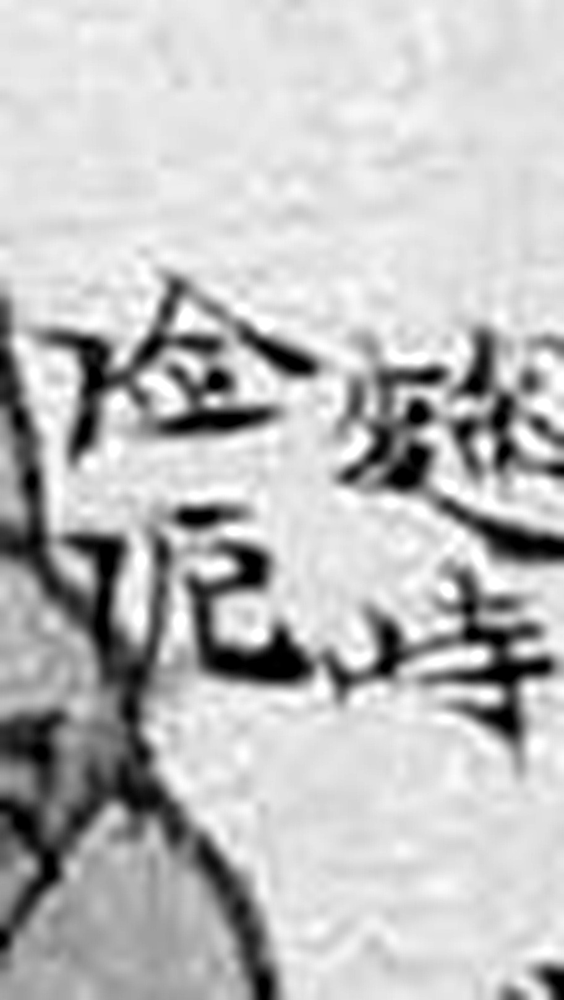
>
> **금산 도엽의 `隘口` 는 그대로 섭니다** — 두 도엽이 서로 다른 말을 적었을 뿐입니다.
> 잘못은 **뜻이 그럴듯하다는 이유로 획을 맞춰 보지 않은 것**이고, 2장에 원칙으로
> 적어 두었습니다.

**`鷄峴`은 이 도엽에서 찾지 못했습니다.** 6.4 참조.

#### 확대본으로 확인한 것 (2026-09-02)

`方古峙`·`□目峙`·`車峙`·`枾峙`·`松院峙`·`梨峙` 를 각각 확대해 받았습니다. **다섯은 판독이
확정되어 확신을 `상` 으로 올렸습니다.** `連界` 로 읽었던 서북 경계는 **`連山界`** 로
확정됐습니다. 새 고개는 나오지 않았고, 대신 `泥峙` 가 고개가 아닐 수 있다는 정정이 나왔습니다
(위 참조).

`車峙` 와 `松院峙` 는 **붉은 도로선이 그 위를 넘습니다** — 실제 통행로였다는 뜻입니다.

**`□目峙` 의 첫 글자는 확정하지 못했습니다.** 뒤 두 자 `目峙` 는 확실합니다. 첫 자는
왼쪽이 `日` 변이고 오른쪽이 `完` 또는 `免` 으로 보여 두 후보가 남습니다.

| 후보 | 읽기 | 근거 |
|---|---|---|
| `晥` | 환목치 | 오른쪽이 `完`(宀+元)으로 보임. 확대본에서는 이쪽이 우세 |
| `晩` | 만목치 | 오른쪽이 `免`. 전체 도엽에서 처음 이렇게 읽었음 |

전체 도엽에서 `晩目峙` 로 적었던 것을 **`□目峙` 로 되돌리고 확신을 `중` 으로 내렸습니다.**
확대본이 오히려 첫 판독을 흔든 경우입니다. 규장각 고해상 원본이나 진산군읍지 산천조로
가려야 합니다.

**2026-09-30 재확인 — 여전히 갈리지 않습니다.** 커먼즈 축소본(1,920 px)을 따로 받아 8배로
보았고, 오른쪽이 `完`(宀+元)으로 보여 **`晥` 쪽으로 기웁니다.** 다만 `免` 과 구별할 만큼
또렷하지는 않습니다. 확신 `중` 유지.

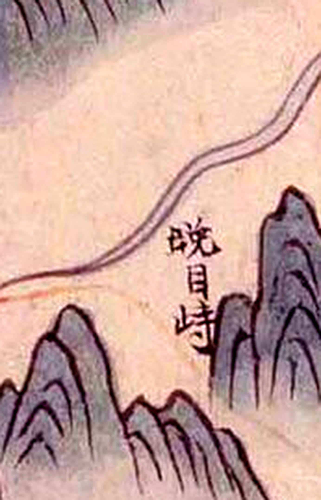

#### 2026-09-30 — 금산 도엽과 맞춰 보니 어긋납니다

같은 날 금산군 도엽을 전면으로 훑어 그쪽 `□峙` 를 **`薪峙`** 로 확정했습니다(11.4).
두 고개는 둘 다 `西臺山` 서쪽이라 **같은 고개를 두 고을이 각각 그린 것**으로 보아 왔습니다.

**그런데 글자가 맞지 않습니다.** 금산 쪽 `薪` 은 **`艹`(초두)가 가로로 또렷**한데,
진산 쪽 글자는 초두가 없고 **좌우 짜임(왼쪽에 획 뭉치, 오른쪽에 모난 부분)** 입니다.

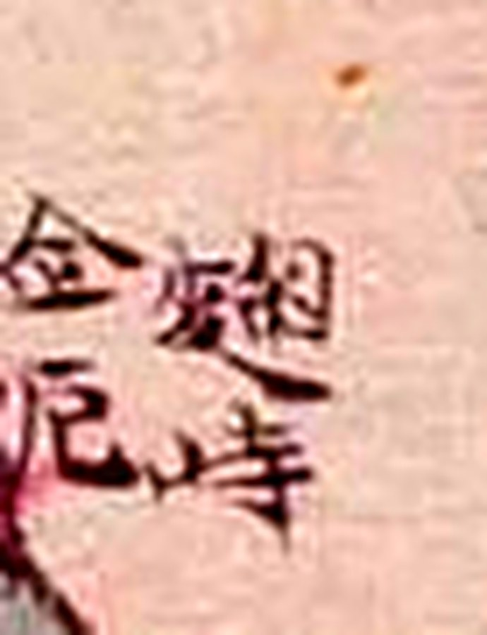 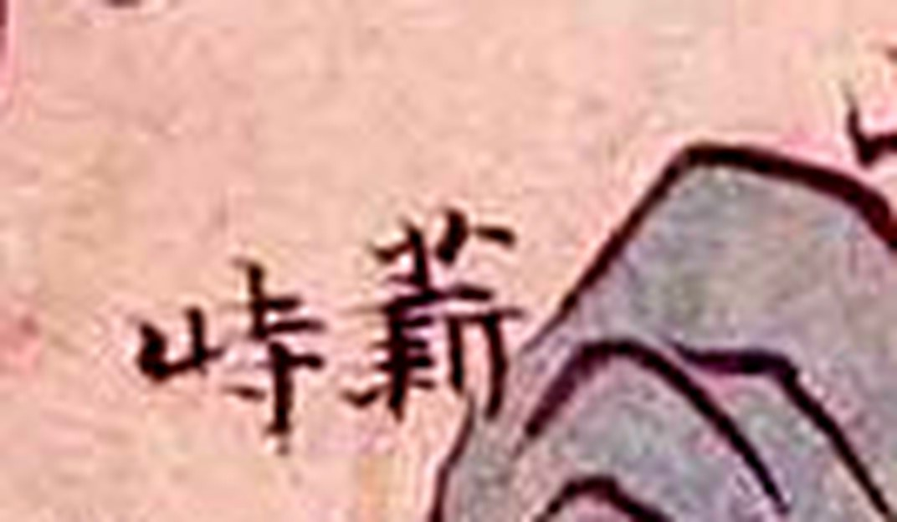

*왼쪽 진산 (0.72, 0.29), 오른쪽 금산 (0.61, 0.31). 같은 자리를 그렸다면 같은 글자여야 합니다.*

진산 쪽 자리를 넓게 본 것: [동북 전경](crops/GM33469IL0007_017_x0.58_y0.22_w0.18_h0.16.jpg)

**셋 중 하나입니다** — ① 두 고개가 서로 다른 고개다 ② 두 고을이 같은 고개를 다른 이름으로
적었다 ③ 축소본(1,920 px)에서 진산 쪽 초두를 놓쳤다. **확신 `하` 를 유지합니다.**
2026-09-02 에 이 글자의 첫 획을 새(鳥) 머리로 본 적이 있으나 그때 철회했고, 이번에도
`鷄` 로 읽을 근거는 없습니다.

#### 북쪽 경계 확대본 (2026-09-02)

`新峙` 주변을 확대해 받았습니다. 다음이 확인됐습니다.

- **`新峙` 판독 확정** — 확신 `중` → `상`. 우리말은 '새재'일 수 있습니다(`新` = 새).
- `彌勒寺` `萬伊山` `天庇山` — 앞서 `天庇山`(?) 으로 남겨 둔 것이 확정됐고 `萬伊山` 이
  새로 나왔습니다. `北面` 도 보입니다.
- **북쪽 가장자리에 `公山界` 가 두 번 적혀 있습니다.** 한 번이 아니라 두 번입니다 —
  진산의 북쪽 경계가 **처음부터 끝까지 공주**라는 뜻입니다. `懷德界` 는 어디에도 없습니다.

#### 동북 `□峙` — 서대산 서쪽 (2026-09-02)

`沃川界` 바로 아래, `西臺山`(충남 최고봉, 지금 금산 추부면·옥천 군서면 경계) 서쪽에 고개가
하나 더 있습니다. 곁에 `西臺寺`, 아래에 `天庇山` 과 `公山界`, 붉은 도로선이 남북으로 지납니다.

**뒤 글자 `峙` 는 확실하고 첫 글자를 읽지 못했습니다.**

처음에는 새(鳥) 변으로 보아 **`鷄`** 를 후보에 넣었고, 그렇다면 6.4 가 뒤집힌다고 적었습니다.
**그 추측은 접습니다.** 같은 `西臺山` 서쪽 자리가 금산군 도엽에도 나오는데(11.4), 거기서는
첫 글자가 `松`(제보) 또는 `薪`(제 판독)입니다. **어느 쪽이든 새 변이 아닙니다.** 제가 초두
(`艹`)를 새 변으로 잘못 본 것으로 보입니다.

**따라서 "해동지도 진산군에 `鷄峴` 이 없다"는 관찰은 그대로 유지됩니다.**

이 고개는 11.4 의 `□峙` 와 같은 고개일 가능성이 있습니다 — 서대산은 진산·금산·옥천이 만나는
자리이므로 한 고개가 두 도엽에 각각 그려진 것일 수 있습니다. 첫 글자는 규장각 고해상 원본이나
읍지 산천조로 가려야 합니다.

#### `新峙` 는 대전 경계의 고개입니다 (2026-09-02)

확대본의 산이 `萬伊山` 이 아니라 **`萬仞山`(만인산)** 입니다. 그리고 `新峙` 는 **그 아래**에
있습니다. 이것이 위치를 못박습니다.

- **만인산(537 m)은 지금 대전 동구 하소동과 금산군 추부면의 경계**를 이룹니다. 정상에
  봉수가 있었고, 남쪽 기슭에 **조선 태조 이성계의 태실**이 있습니다(1393년 함경도 용연에서
  옮겨 온 것). **지금 주소는 금산군 추부면 마전리지만 당시에는 진산군 땅**입니다 —
  '태조대왕 태실'은 금산이 아니라 **진산**의 것이었습니다.
- 그래서 **진산은 산골짜기에 인구도 적었는데 오래 독립 고을로 남았습니다.** 태실 봉안지라는
  격이 읍의 존속을 받쳤고, 1914년에야 금산군에 통합됩니다. 이 도엽의 사지가 진산을
  회덕이 아니라 공주·옥천·전주·금산과 견주어 적은 것도 그런 위상과 무관하지 않습니다.
- 하소동은 추부면 **마전리**와 맞닿습니다.
- **`新峙` 가 만인산 아래 진산 북쪽 경계에 있다면, 지금 대전 동구 남부와 금산 경계의
  고개**입니다. 회덕현 밖에서 나온 두 번째 대전 고개입니다.

**머들령과 겹칠 가능성이 있습니다.** 그 자리를 넘는 옛길이 **머들령**입니다 — 대전 동구
하소동에서 추부 마전으로 넘고, 정훈(鄭勳)의 시 「머들령」("요강원을 지나 머들령 / 옛날 이
길로 원님이 내리고 / 등짐장사 쉬어 넘고 / 도적이 목 지키던 곳")의 그 고개입니다.
**마전(馬田)이라는 이름 자체가 머들령을 넘을 때 쓰던 마방(馬房)에서 왔다**는 설이 있습니다.

다만 `新峙`(새재)와 '머들령'은 소리가 통하지 않습니다. **같은 고개인지, 만인산을 넘는 여러
길 가운데 다른 하나인지는 확인해야 합니다.** 지금은 지리적으로 같은 구역이라는 것까지입니다.

**6.4 와도 이어집니다.** 계현산성이 "금산 **마전** 방면 산성들과 연결"된다고 했는데, 그
마전이 바로 이 마전리입니다. 만인산–머들령–마전 축이 대전 남쪽 경계의 주 통로였던 셈입니다.

### 11.3 『해동지도』 「충청도 공주목」 — 동남단 훑기 (2026-09-30)

**전문 기록: [`해동지도-공주목-판독.md`](해동지도-공주목-판독.md)**

**공주목은 범위가 매우 넓어 대전에 해당하는 부분이 작게 그려집니다.** 전체 축척에서는
잔글씨를 읽지 못했고, **확대본을 받아 북동단에서 고개 한 건을 채록했습니다**(아래).

**2026-09-30 에 동남단(x 0.44–0.66, y 0.50–0.81)을 훑었습니다 — 새 고개는 없습니다.**
대전에 걸리는 다섯 면이 다 들어가는 범위인데 `峙`·`峴` 이 `栗`〔峙?〕 말고는 나오지
않았습니다. **이로써 6.4 「다음 확인 순서」 2번이 두 계열 모두 닫혔습니다.**

**사지(四至).** `東距燕歧界二十五里` · `西距定山界三十里` · `南距尼山界四十里` ·
`北距天安界五十里`. (`燕岐` 가 아니라 **`燕歧`** 입니다 — 2026-09-30 교정.)

**도엽 가장자리 경계 표기.** 상대 좌표(±0.03).

| 위치 | 표기 | 확신 |
|---|---|---|
| (0.05, 0.34) | 禮山界 | 중 |
| (0.05, 0.44) | 大興界 | 중 |
| (0.05, 0.59) | 靑陽界 | 중 |
| (0.05, 0.65) | 定山界 | 중 |
| (0.19, 0.82) | 扶餘界 | 중 |
| (0.33, 0.83) | 尼山界 | 중 |
| (0.50, 0.34) | 天安界 | 중 |
| (0.54, 0.44) | 全義界 | 중 |
| (0.64, 0.45) | 燕岐界 | 중 |
| (0.64, 0.58) | 文義界 | 중 |
| **(0.60, 0.65)** | **懷德界** | **상** |
| (0.58, 0.72) | **珎山界** | **상** (2026-09-03 확정) |

**`懷德界`가 있습니다.** 회덕현 도엽의 `公州界`와 짝이 맞습니다 — 두 고을은 서로를
이웃으로 적습니다.

**면별 거리표 26면을 2026-09-30 에 전문으로 읽었습니다**(전문은 판독 문서에).
대전에 걸리는 다섯 면이 **1·2·5·6·7번**으로 앞쪽에 몰려 있습니다 — 표의 순서가 곧
거리 순서이므로 **대전 일원이 공주목에서 가장 먼 변두리**였습니다.

| 면 | 初境 | 終境 | 지금 |
|---|---|---|---|
| `山內面` | 80리 | 100리 | 동구 남부 |
| `柳等浦面` | 70리 | 80리 | 중구 유천동 일원 |
| `炭洞面` | 50리 | 70리 | 유성구 북부 |
| `九則面` | 50리 | 70리 | 유성구 금강 남안 |
| `鳴灘面` | 40리 | 60리 | 대덕·세종 접경 |

**이 표가 판독의 검산 도구가 됩니다.** 1872년 도엽의 창고 주기 `太平倉 … 柳等川面〔?〕
距邑五十里` 는 유등포면 70~80리와 20리가 어긋납니다 — 그 면 이름 판독(12.3, 확신 `중`)을
다시 봐야 합니다.

**그 밖.** `鷄龍山`(0.31, 0.67), `甲寺`, `熊津`, 금강 물줄기.

#### 동부 확대본 — `栗峙` (2026-09-02)

`燕岐界`(북) · `文義界`(북동) · `懷德界`(동) · `珎山界`(남동)가 함께 들어온 조각입니다.
**공주목 동부 전체**에 걸치며, 대전에 해당하는 구역이 다 들어 있습니다.

| 위치 | 표기 | 읽기 | 확신 | 판독자 | 날짜 | 근거 |
|---|---|---|---|---|---|---|
| (0.53, 0.63) ±0.05 | 栗〔峙/寺?〕 | 율치 · '밤고개'(추정) — **둘째 글자 미결(6.6)** | **하** | 류철·Claude | 2026-09-30 | `九則面` 남쪽, 붉은 도로선이 지남. 곁의 것은 글자 `倉` 이 아니라 **건물 그림**이었음(2026-09-30 정정) |

**좌표를 얻은 방법.** 조각에 `懷德界`·`文義界` 두 기준점이 들어와 있어, 11.3 에서 읽은 도엽
좌표에 맞춰 환산했습니다. 다만 두 기준점이 눈대중이라 **가로·세로 배율이 1.45배 어긋납니다**
— 그래서 오차를 ±0.05 로 크게 잡았습니다. 조각의 `x·y·w·h` 나 원본 픽셀 좌표가 나오면
바로 조입니다.

**함께 읽은 면.** `九則面` `陽也里面` `要堂面` `東部面` `三歧面` `辰頭面` `炭洞面`(?).

> **2026-09-30 정정.** 이때 저해상 조각에서 읽은 거리값 둘이 전문 채록과 어긋나
> 고쳤습니다 — `辰頭面` **20·40 → 30·40**, `曲火川面` **30·70 → 30·50**.
> `益貴谷面`(10·50) `三歧面`(30·40) `長尺洞面`(20·40)은 그대로입니다.

**`九則面` 이 결정적입니다.** 구즉면은 1914년 대전군에 들어와 **지금 대전 유성구 구즉동·
봉산동·송강동 일대**가 됩니다. 자리가 대전 안이라는 것은 이것으로 섭니다.

**다만 이것이 고개인지가 2026-09-30 에 다시 열렸습니다** — 둘째 글자가 `峙` 가 아니라
`寺` 일 수 있습니다(6.6). `寺` 라면 **회덕현 밖에서 채록된 대전의 고개는 아직 없는**
것이 됩니다.

**함께 읽은 그 밖.** `日新驛`(일신역 — 공주목의 역), `甲寺`, `鷄龍山`, `辰頭面` 곁의 원우,
`靑林寺`(?), `天澤島`(?).

**`山內面` 을 아직 못 찾았습니다.** 조각 동남쪽 구석, `懷德界`(0.60, 0.61 조각 기준) 아래와
`鎭岑界`(?) 위 사이의 대략 **(0.49, 0.70) 조각 기준** 자리에 두세 자 면 이름이 있는데 이
해상도로는 확정하지 못했습니다. 위치로 보면 산내면일 가능성이 있습니다 — 11.3 에서 읽은
`初境八十里 終境一百里` 와 맞습니다. **그 자리를 더 확대하면 6.4 가 풀립니다.**

**남은 일** — 산내면 일대(도엽 동남단, `懷德界` 아래쪽)를 확대해야 합니다. 6.4 의 판정이
거기 걸려 있습니다.

### 11.4 『해동지도』 「전라도 금산군」 — 전면 훑기 (2026-09-30)

**전문 기록: [`해동지도-금산군-판독.md`](해동지도-금산군-판독.md)**

**2026-09-30 에 도엽 전체를 받아 훑었고, 11.4 의 쟁점이 풀렸습니다.**
2026-09-02 에는 북쪽 확대본 한 장만 보고 `□峙` 의 첫 글자를 `松` 과 `薪` 사이에서
가리지 못했습니다. 그때 세운 가릴 방법이 **「도엽 전체에서 `峙` 로 끝나는 표기를 모두 훑어
`松峙` 와 이 글자가 각각 따로 있는지 보는 것」** 이었습니다 — **따로 있습니다.**

#### 방위 — 위가 北, 표준입니다

2026-09-02 에 「방위가 북쪽을 위로 두지 않았을 가능성」을 걱정했으나 **기우였습니다.**
가장자리 경계 표기가 사지와 맞습니다.

| 위치 | 표기 | 방향 |
|---|---|---|
| (0.58, 0.29) | `珎山界` | 서북 |
| (0.92, 0.28) | `沃川界` | 북(동쪽으로 치우침) |
| (0.96, 0.49) | `永同界` | 동 |
| (0.98, 0.64) | `茂朱界` | 동남 |
| (0.64, 0.75) | `龍潭界` | 남 |
| (0.31, 0.70) | `高山界` | 서남 |

**사지(四至)**〔[넓게](crops/GM33469IL0007_018_x0.6_y0.63_w0.4_h0.14.jpg)〕 — `東距永同界四十里`(영동까지 70리) · `西距珎山界十五里`(진산까지 30리) ·
`南距龍潭界三十里`(용담까지 50리) · `北距沃川界五十里`(옥천까지 70리).
도엽 아래에 **면별 거리표 13면**(西一·西二·郡北·郡一·郡二·東一·富北·富西·富東·富南·
南一·南二…)도 있습니다.

#### 고개 셋

| 위치 | 표기 | 읽기 | 확신 | 판독자 | 날짜 | 근거 |
|---|---|---|---|---|---|---|
| **(0.61, 0.31)** | **`薪峙`** | 신치 | **상** | Claude | 2026-09-30 | 북부. `珎山界` 아래, `西臺山` 서쪽. **`艹`(초두)가 또렷** <br>[넓게](crops/GM33469IL0007_018_x0.53_y0.26_w0.2_h0.09.jpg) |
| **(0.69, 0.68)** | **`松峙`** | 송치 · 솔티재 | **상** | Claude | 2026-09-30 | 남부. **붉은 길이 곧장 넘어** `龍潭界` 로 내려감 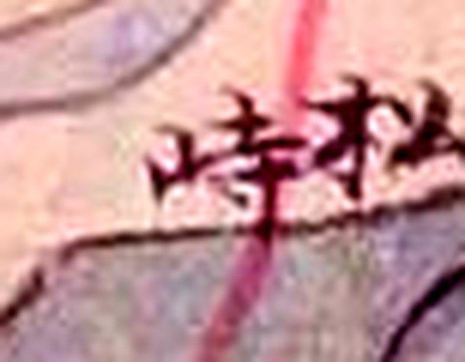 |
| **(0.34, 0.68)** | **`柏子峙`** | 백자치 · '잣고개'? | **상** | Claude | 2026-09-30 | 서남. `高山界` 곁  |

**`松峙` 와 `薪峙` 는 서로 다른 고개입니다.** 도엽 북부(진산 접경)의 것이 `薪峙`,
도엽 남부(용담 접경)의 것이 `松峙` 입니다. 제보의 **「용담면으로 가는 송치」와 남쪽 것이
정확히 맞습니다** — 붉은 길이 그 고개를 넘어 `龍潭界` 로 내려갑니다. 기문 산천 조에도
`松峙` 가 `龍潭界` 와 함께 나옵니다.

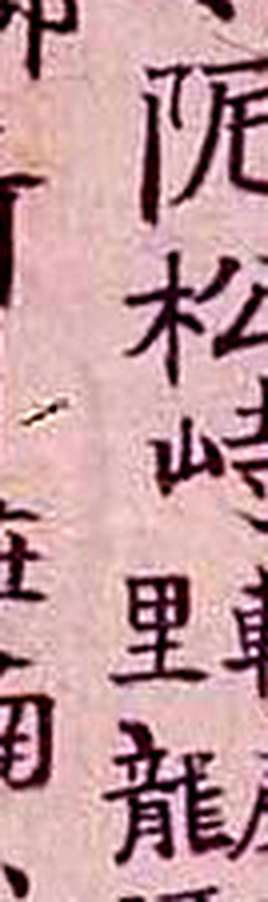

*기문 산천 조의 `松峙`. 아래로 `龍潭界` 가 이어집니다.*

**그러므로 11.4 의 `□峙` 는 `薪峙` 로 확정합니다.** 확신 `하` → **`상`**.
12.6 의 1872년 금산군지도 `薪峙`(0.39, 0.30)와 같은 고개이고, 두 계열이 120년을 사이에
두고 같은 이름을 적었습니다.

#### `柏子峙` — 6.3 에 걸리는 새 이름

서남쪽 `高山界` 곁에 **`柏子峙`** 가 있습니다. **한 이름 안에 `柏` 과 `子` 가 함께**
들어간 예입니다. 6.3 에서 회덕의 `崖柏峙`·`子峴`·`子田峴` 을 두고 「`子`(잣)와
`柏`(잣나무)가 같은 우리말을 적은 것인가」를 물었는데, **`柏子` 가 한 낱말로 쓰인 표기가
나온 셈**입니다. 6.3 으로 넘깁니다.

#### `隘口`(애구) — 고개에 붙는 주기 **[해결]**

11.2 에서 `隂泥`(?) 로 적었다가 `隂阨`〔?〕 으로 고쳐 읽었던 두 글자를, 같은 날
**`隘口`** 로 확정합니다. 두 글자 모두 `阝` 를 가진 줄 알았으나 **아래는 `口`** 이고
왼쪽 획은 붓이 들어오는 자리였습니다.

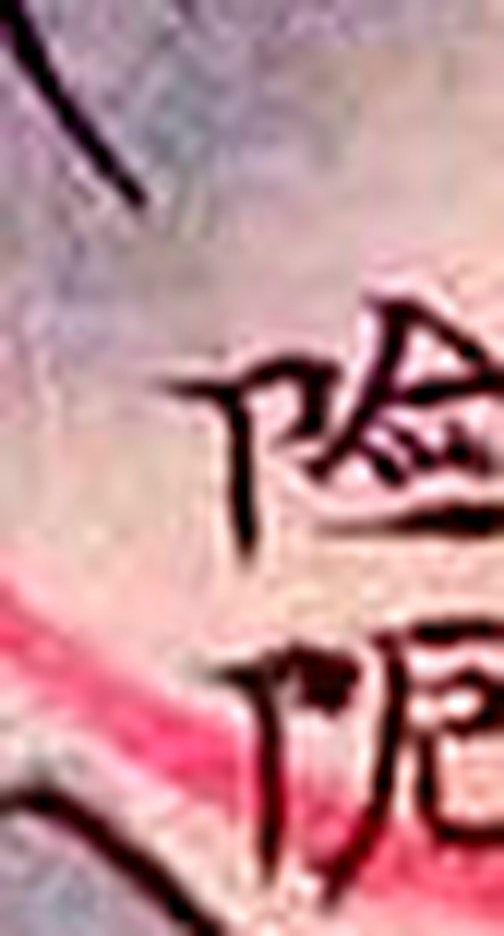
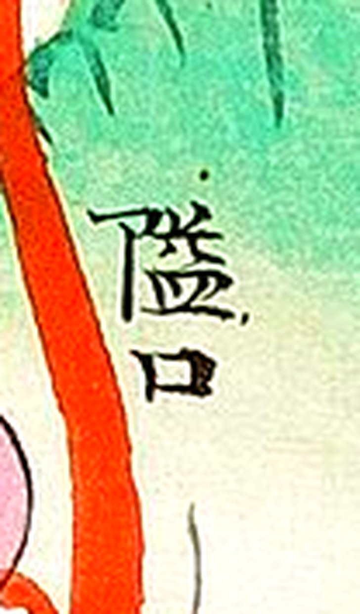

*왼쪽 해동지도 금산군(0.39, 0.37), 오른쪽 **1872년 금산군지도**(0.42, 0.31).
120년을 사이에 둔 두 도엽이 **같은 자리에 같은 말**을 적었습니다.*

**결정적인 것은 1872년 금산군지도였습니다.** 그 도엽은 같은 고을을 120년 뒤에 그린
것인데, **`薪峙` 바로 아래에 `隘口` 를 또렷한 해서로 적어 두었습니다.** 게다가 그
도엽의 기문 관방(關防) 조가 **`隘口四處`**(애구 네 곳)라고 못박습니다.

**`隘口` 는 「좁은 길목·관문」입니다.** 지명이 아니라 **길목의 성격을 적은 관방 주기**이고,
그래서 해동지도 진산·금산 도엽에서 **여러 곳에, 모두 붉은 길 위에** 되풀이됩니다.

> **판독이 두 번 바뀐 자리입니다** — `泥峙`(2026-09-02) → `隂泥`(?) → `隂阨`〔?〕
> → **`隘口`**(2026-09-30). 세 번째 고침이 선 것은 **다른 도엽의 또렷한 같은 글자**를
> 찾았기 때문입니다. **확대만으로는 끝내 갈리지 않던 글자가, 같은 말을 다르게 쓴
> 도엽 하나로 갈렸습니다.** 7장 미판독에서 내립니다.

#### 그 밖에 읽은 것

기문이 도엽 왼쪽 3분의 1을 채웁니다 — 호구(`元戶六千三百五十三戶`), 전결, 군병 다섯 갈래,
연혁(`本百濟進乃郡 … 新羅改進禮郡 … 忠烈王陞知錦州事 … 本朝太宗例改今名`), 산천
(`阿山`(진산) `西臺山` `珠崒山` `召甫津` `神陰山` `樂山` `德裕山` `一岉山` `松峙` `祖宗山`),
고적(`富利廢縣` `大谷所` `安城所` `橫川所`), 누정(`映碧樓` `養成堂` `養淸堂`),
서원(`星谷書院` `從容祠`), 역원(`濟原驛` `南濟院` `岐平院` `錦南院` `柯亭子院` `金谷院`),
불우(`寶石寺` `萬德寺` `靈岩寺` `石泉寺` `月峯寺` `元曉寺` `安自寺` `元通寺` `佛華寺`
`宝通寺`), 토산(`蜂蜜` `海松`).

군명 이칭 — `進乃` `景陽` `錦溪` `進禮` `錦州`. 형승 — `山椒高 四塞幽險 山川阻僻`.

### 11.6 『해동지도』 접경 도엽 — 옥천·문의·청주·연산 (2026-09-30)

**미착수로 남아 있던 접경 도엽을 커먼즈 축소본(1,920 px)으로 받아 훑었습니다.**
대전에 걸리는 쪽 가장자리와 사지·고개만 봅니다.

#### 11.6.1 「충청도 옥천군」 — **`九也峙` 하나. 「없다」를 거둡니다** (2026-10-01 2차 판독)

**전문 기록: [`해동지도-옥천군-판독.md`](해동지도-옥천군-판독.md)**

| | |
|---|---|
| 자료번호 | `GM33469IL0007_013` |
| 크기 | **2,409 × 3,781 px** — 커먼즈본이 곧 원본 크기입니다. 1차 판독은 1,920 px 축소본이었습니다 |
| 방위 | **위가 北** (표준) |
| 사지 | 東 `靑山界三十里`(청산까지 60리) · **西 `懷德界二十里`**(회덕까지 40리) · 南 `永同界三十里`(60리) · 北 `文義界四十里`(60리) |

**`西距懷德界二十里` 가 회덕현 도엽의 `東距沃川界二十里` 와 정확히 맞습니다**(11.1).
두 고을이 서로를 같은 거리로 적었습니다 — 4.2 의 사지 대조에 넣습니다.
다만 **옥천은 문의를 적는데 문의 사지에는 옥천이 없습니다** — 4.2 의 ⚠ 「일방 기록은
드물지 않다」에 한 예가 더 붙습니다.

##### `九也峙` — 2026-09-30 의 「고개가 없다」를 거둡니다

> 1차 판독에서 「도엽 전체에서 `峙`·`峴`·`嶺` 이 한 자도 나오지 않는다」고 적고
> 4.3 에 올렸습니다. **틀렸습니다.** 원본 크기로 다시 훑으니 도엽 가운데쯤에
> **`九也峙`** 가 있습니다.

| 위치 | 표기 | 읽기 | 확신 | 판독자 | 날짜 |
|---|---|---|---|---|---|
| **(0.395, 0.541)** | **`九也峙`** | 구야치 | **상** | Claude | 2026-10-01 |

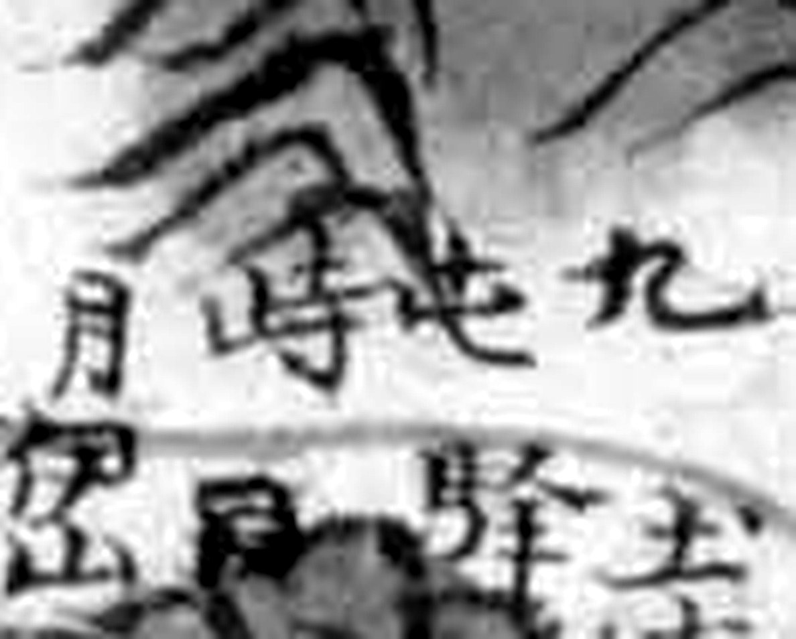

우횡서로 오른쪽부터 `九`·`也`·`峙`. `也`(어조사 야)는 우리말 소리를 적은 것으로 보여,
해동지도 진산군 기문의 `方古介`(방고개)에서 `介` 가 '개'를 적은 것과 같은 쓰임입니다(11.2).
자리는 읍치(0.287, 0.421) **남동쪽** — 영동·청산 방면이고 **대전 쪽이 아닙니다.**

**그래도 마달령 자리인 서쪽 길에는 고개 이름이 없습니다.** 4.3 의 줄을
「고개 표기가 없다」에서 **「서쪽(회덕) 길의 고개 이름이 없다」** 로 고쳐 적습니다.

> **두 번째로 같은 교훈입니다.** 2026-09-30 에 1872년 금산군지도의 `石峴里` 를
> 「없다」고 철회했다가 자리가 두 칸 옆이어서 되돌린 일이 있습니다(12.6). 그때는
> **보는 자리**가, 이번에는 **보는 해상도**가 문제였습니다.
> **「없다」고 적을 때는 도엽 전체를, 가장 큰 사본으로 봐야 합니다.**

##### 기문 — 문의와 **같은 네 조목**. 산천 조가 없습니다

```
沃川郡 城郭無
民戶 八千二百二戶
田 三千九百五十結三十四負九束
畓 一千三百八十五結九十三負六束
穀物摠數  會付米 一千六百四十四石九斗 / 末捧 二千六百八十三石 /
         皮穀 四千六百六石 / 末捧 三千二百二十五石九斗
軍兵摠數  兵營軍 九十名 / 右營鎭束伍軍 五百七十四名
```

**문의현 기문(11.6.2)과 조목이 똑같습니다** — 호구·전결·곡물·군병 넷뿐, **산천 조 없음.**
전라도 진산군 기문은 산천 조로 고개 넷을 경계·거리와 함께 적었는데(11.2), 충청도
문의·옥천은 그렇지 않습니다. **기문의 조목이 도(道)를 따라 갈리는지**가 새 물음입니다.

군병 조가 옥천은 `右營鎭`, 문의는 `中營鎭` 입니다 — 충청도 다섯 영의 소속이 도엽에
그대로 적혀 있습니다.

##### 면별 거리표의 오류와 **값이 빈 첨지**

면 열하나의 초경·종경이 있습니다. 그 가운데 **`陽南面` 은 초경 70리가 종경 40리보다
큽니다** — 두 값이 뒤바뀐 것으로 보입니다. 11.6.2 의 문의 `南面` 과 함께
**면별 거리표를 고개 비정의 근거로 쓰지 않는 이유**입니다.

표 오른쪽 아래에 종이 조각이 붙어 **`邑內面 初竟 終竟`** 까지만 적혀 있고
**숫자가 없습니다.** 읍내면만 표에서 빠져 조각을 덧붙였는데 값은 끝내 적히지
않았습니다 — **해동지도가 작업 중인 책이었음**을 보여 주는 자리입니다.

##### 봉수 둘 — **같은 날 1872년 도엽이 글자를 갈랐습니다**

| 위치 | 산 | 봉수 표시 | 확신 |
|---|---|---|---|
| (0.145, 0.295) | **`環山`** | **`烽臺`** (0.122, 0.297) | 상 |
| (0.365, 0.545) | **`月伊`** | **`烽臺`** (0.350, 0.556) | 산 이름 중 · 표시 상 |

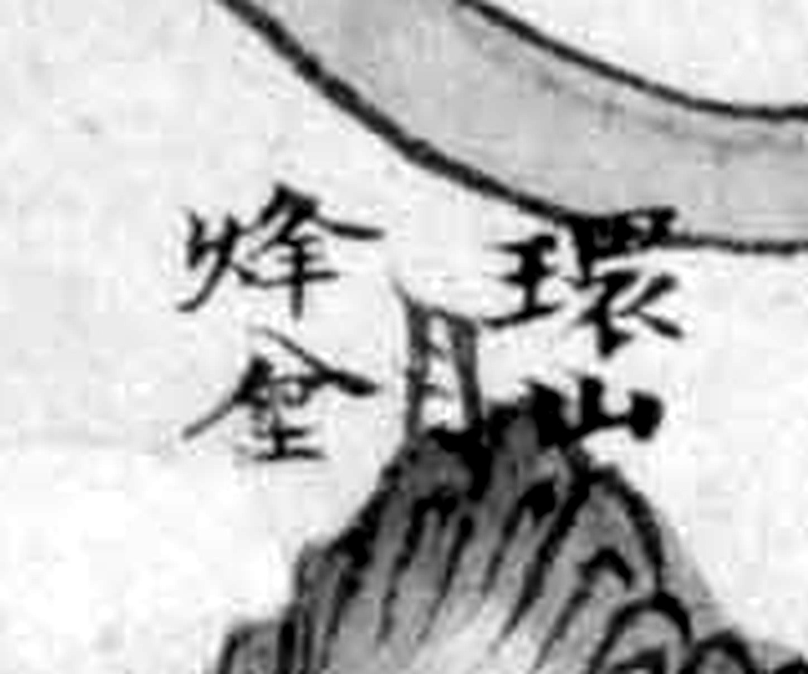

`環山`(고리산)은 1872년 옥천군지도가 `環山烽臺 … 去應 懷德 鷄足山烽燧` 라 적은
그 봉수입니다(12.4). 곁에 봉수대 그림(탑 모양)이 있습니다.

**봉수 표시 두 글자는 한동안 못 갈랐습니다.** `烽` 은 또렷한데 아래 글자가 `金`·`全`
처럼 보여 `燧` 로도 `臺` 로도 읽히지 않았습니다. **같은 날(2026-10-01) 1872년
옥천군지도가 같은 자리에 또렷한 해서로 `烽臺` 를 적은 것을 찾아 갈랐습니다**(12.4).
둘째 봉수 산도 1차 판독의 `月呑` 이 아니라 **`月伊`**(1872년 도엽은 `月伊峯`)입니다.

**같은 두 글자가 해동지도 문의현 (0.690, 0.570)에 같은 필체로 있습니다** —
11.6.2 의 1차 판독에서 `金峯` 으로 읽었던 라벨이 이것입니다. 곧 **문의 도엽에도
봉수 표시가 있습니다.** 곁의 산이 납작한 봉우리로 그려져 있으나 **산 이름은 적혀
있지 않습니다** — 봉수 노선으로 보면 문의 `夜味山`(=`所伊山`)일 것이나, 도엽이
이름을 적지 않았으므로 **비정하지 않고 열어 둡니다**(13.3).

읽은 것 — `環山` `馬城山` `西臺山` `智勒山` `雉鳳山`〔?〕 `赤登津` `庯灘`〔?〕
`增若驛` `化仁驛 距郡三十里` `土坡驛 距郡二十五里` `順陽驛` `嘉化驛`〔?〕
`安邑倉` `陽山倉` `□仙樓`〔?〕 `陽山縣`〔?〕, 면 열하나.
**역이 다섯**이고 둘에 `距郡○○里` 주기가 달려 있어 **지점 거리를 직접 알려 주는
드문 자료**입니다.

#### 11.6.2 「충청도 문의현」 — 고개 **셋** 과 방어처 첨지 (2026-10-01 2차 판독)

**전문 기록: [`해동지도-문의현-판독.md`](해동지도-문의현-판독.md)**

| | |
|---|---|
| 자료번호 | `GM33469IL0006_036` |
| 크기 | 2,409 × 3,754 px — **커먼즈본이 원본 크기**여서 더 키울 여지가 없습니다 |
| 방위 | **위=西, 오른쪽=北, 아래=東, 왼쪽=南** — 90° 돌아 있습니다 |
| 사지 | 東 `懷仁界十里`(20리) · 西 **`燕歧界卅里`**(50리) · **南 `懷德界十五里`**(회덕까지 40리) · 北 `淸州界十里`(청주까지 30리) |

**방위 근거** — 가장자리 표기가 사지와 어긋나 보여 맞춰 보았습니다. `燕歧界` 가 위,
`淸州界` 가 오른쪽, `懷仁界` 가 아래, **`懷德界` 가 왼쪽**입니다. 사지의 西·北·東·南과
차례로 맞으므로 **위가 西**입니다. 1872년 진잠 도엽(위=西)과 같은 꼴입니다.

##### 고개 셋

| 위치 | 표기 | 읽기 | 확신 | 판독자 | 날짜 |
|---|---|---|---|---|---|
| **(0.445, 0.540)** | **`弘峙`** | 홍치 | **상** | Claude | 2026-09-30 |
| **(0.330, 0.600)** | **`城峴`** | 성현 | **상** | Claude | 2026-10-01 |
| **(0.755, 0.536)** | **`栗峴`** | 율현 | `峴` 상 · `栗` **중** | Claude | 2026-10-01 |

위=西 이므로 **x 가 작을수록 남쪽**입니다. 세 고개는 읍치를 사이에 두고 갈립니다.

```
懷德界 0.175 ── 城峴 0.33 ── 弘峙 0.445 ── 읍치 0.53 ── 栗峴 0.755 ── 淸州界 0.93
   (남 = 대전 쪽)                                                        (북 = 청주 쪽)
```

**`弘峙`**

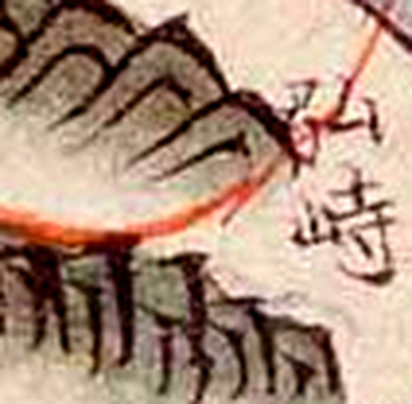

`弘`(弓+厶)·`峙`(山+寺) 두 글자가 또렷하고 **붉은 길이 이 고개를 지납니다.**
[일대를 넓게](crops/GM33469IL0006_036_x0.17_y0.47_w0.33_h0.19.jpg) 보면 읍치와 `懷德界`
사이에 놓인 것이 보입니다 — 위=西이므로 왼쪽이 남쪽, 곧 **문의 읍치에서 회덕으로
내려가는 축** 위입니다.

**`城峴` — 1차 판독의 `峴城` 을 뒤집습니다**

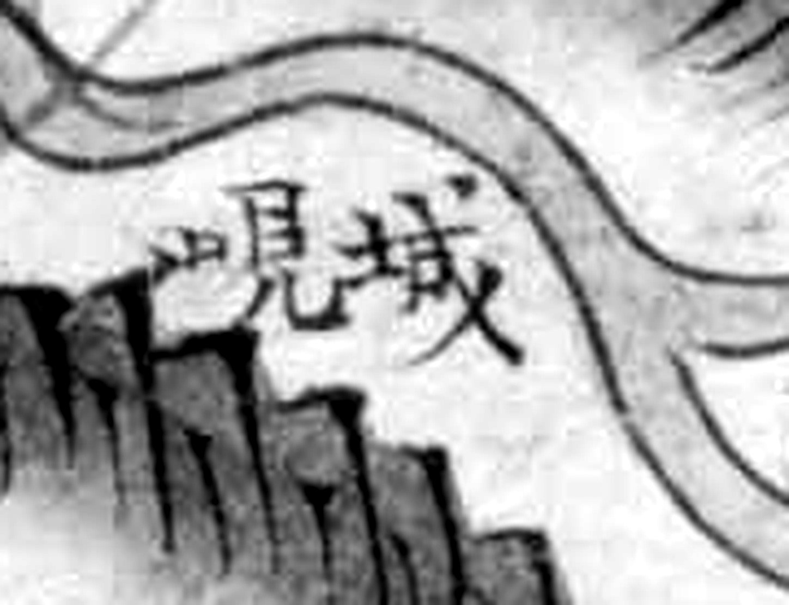

2026-09-30 에 `峴城`(고개의 성)으로 적었던 라벨입니다. 왼쪽 글자가 `峴`(山+見),
오른쪽 글자가 `城`(土+成) 인데 **이 도엽의 가로 라벨은 우횡서**이므로 오른쪽이
먼저입니다 → **`城峴`**. 같은 규칙이 바로 옆 `峯屈月`(→`月屈峯`)·`溪花`(→`花溪`)에
그대로 맞습니다. 기문이 `城郭無`(성곽 없음)라고 적는 것도 성 이름이 아닌 쪽을 받칩니다.

그래서 **성이 아니라 고개**이고, 자리는 `弘峙` 보다 더 남쪽 — `荊灘津`·`大潭` 과
`懷德界` 사이 산줄기 위입니다. **문의에서 회덕으로 내려가는 길에 고개가 둘**인 셈입니다.

> **2장 표기 원칙에 걸리는 교훈.** 가로 두 글자를 읽은 뒤에는 **같은 도엽의 다른 두 글자
> 라벨로 읽는 차례를 먼저 검증**합니다. 한자 두 자는 뒤집어도 말이 되는 일이 많아
> (`城峴`/`峴城`), **글자를 바르게 읽고도 이름을 틀릴 수 있습니다.** 이번에는 그 반대
> 방향의 실수였습니다 — 글자는 처음부터 맞았는데 차례를 놓쳤습니다.

**`栗峴`**


`峴`(山+見)은 흔들림이 없습니다. 첫 글자는 위가 네모(覀/田), 아래가 `木` 으로 보여
`栗` 로 읽되, `界`(田+介)와 획이 비슷해 **확신 `중`** 입니다 — `界峴` 은 말이 되지
않으므로 `栗` 쪽이 낫습니다. **붉은 길 둘이 바로 이 자리에서 갈라집니다**(읍치에서
올라온 길이 북(청주)과 동북으로). 이 도엽에서 두 번째로 나오는 `栗`+고개 글자인데,
공주목의 `栗`〔峙/寺?〕(6.6)과 달리 **이쪽은 `峴` 이 또렷합니다**.

##### 좌상단 첨지 — 회덕 첨지와 **쓰임이 갈립니다**


```
鷹峯 弘峙
備禦處在 □□□
故添書
```

초서라 가운데 줄 끝 서너 자를 못 읽었으나 **`備禦處`·`故添書`(그래서 덧붙여 적었다)는
또렷합니다.**

**여기서 6.2 가 한 걸음 더 나갑니다.** 회덕 첨지가 든 `子峴`·`子田峴` 은 **회덕 도엽
그림 안에 없습니다**(그래서 3장에서 아직 자리를 못 잡았습니다). 반면 문의 첨지가 든
`鷹峯`(0.40, 0.36)과 `弘峙`(0.445, 0.54)는 **둘 다 그림 안에 있습니다.** 곧 —

- 문의 첨지 = **이미 그린 것 가운데 요해처를 골라 지목**
- 회덕 첨지 = **그리지 않은 곳을 더해 적음**

같은 형식(`지명 둘 + 備禦處 + 故添書`)이라도 쓰임이 둘로 갈립니다. 둘 다 **관방의
눈으로 쓴 글**이라는 6.2 의 결론은 그대로이되, 회덕 첨지는 **그림에 없는 고개의
유일한 출전**이라는 무게가 더해집니다.

##### 기문 — **산천 조가 없습니다**

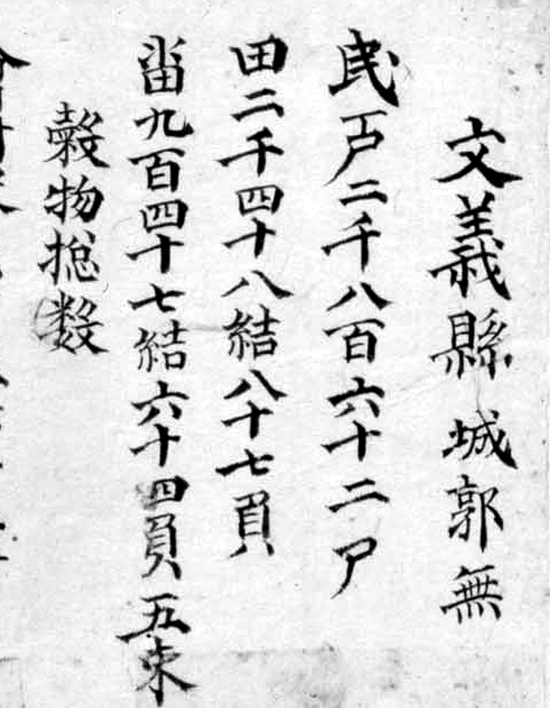

```
文義縣 城郭無
民戶 二千八百六十二戶
田 二千四百八十八結八十七負
畓 九百四十七結六十四負五束
穀物摠數  會付米 三十五石十二斗 / 末捧 三百七十七石九斗 /
         皮穀 三千五百五十六石 / 末捧 四千九百七十二石
軍兵摠數  兵營軍 一百五十六名 / 中營鎭束伍軍 三百八十二名
```

**조목이 호구·전결·곡물·군병 넷뿐입니다.** 해동지도 진산군 기문이 산천 조에 고개 넷을
경계 고을·거리와 함께 적어 `晚目峙` 를 풀어 준 것과 대조됩니다(11.2).
곧 **해동지도의 기문은 도엽마다 조목이 다릅니다** — 어느 도엽에서 기문이 그림을
풀어 줄지는 미리 알 수 없고, **열어 보기 전에는 없다고도 있다고도 할 수 없습니다.**

##### 사지 — **서거 `十五里` → `卅里` 정정**

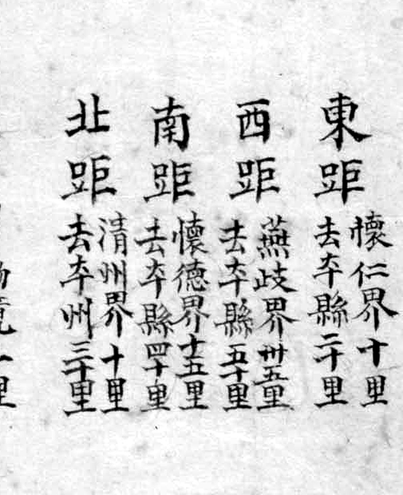

```
東距 懷仁界十里   去本縣二十里
西距 燕歧界卅里   去本縣五十里
南距 懷德界十五里 去本縣四十里
北距 淸州界十里   去本州三十里
```

`卅`(세 획을 가로줄이 꿰는 꼴) 한 자입니다. 같은 표의 `南距懷德界十五里` 가 `十`·`五`
**두 자로 또렷이 갈라져** 있어 한 사람의 손 안에서 두 꼴이 맞놓였습니다. 면별 표에도
`南面 終竟三十里`(두 자)와 `三道面 終竟卅里`(한 자)가 나란히 나옵니다. 고을 이름도 이
도엽은 `燕歧`(止+支)로 적습니다.

##### 면별 초경·종경 — 일곱 면

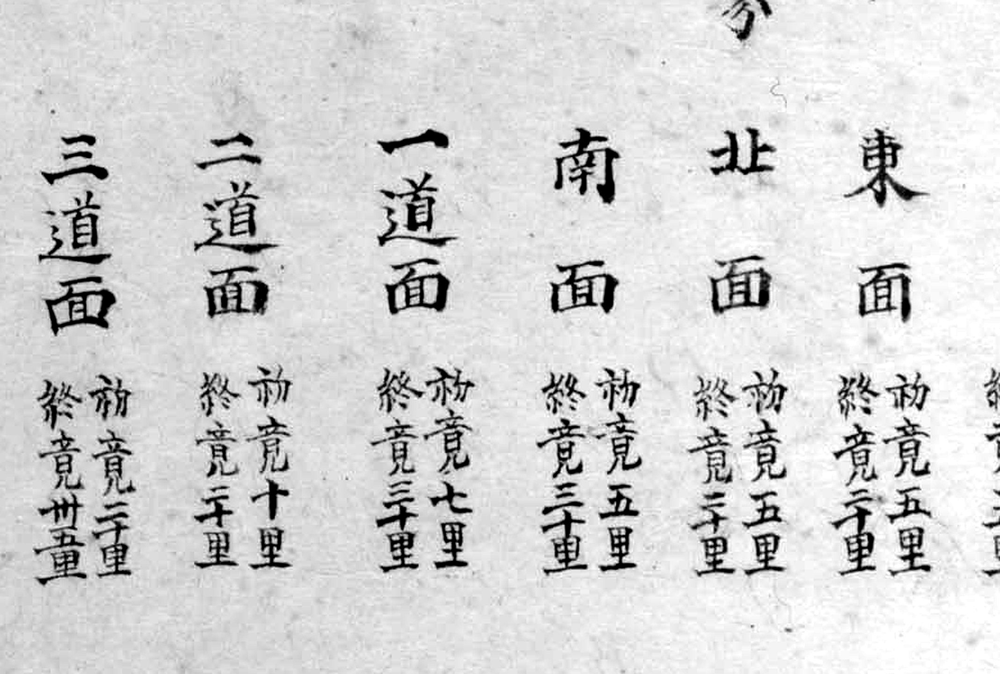

| 면 | 初竟 | 終竟 | | 면 | 初竟 | 終竟 |
|---|---|---|---|---|---|---|
| 邑內面 | 一里 | 五里 | | 一道面 | 七里 | 三十里 |
| 東面 | 五里 | 二十里 | | 二道面 | 十里 | 二十里 |
| 北面 | 五里 | 二十里 | | 三道面 | 二十里 | 卅里 |
| **南面** | 五里 | **三十里** | | | | |

**`南面` 종경 30리와 사지의 `南距懷德界十五里` 가 맞지 않습니다.** 사지는 정남쪽으로
곧장 잰 가장 가까운 경계까지이고, 면 종경은 그 면이 남동·남서로 뻗은 끝까지이므로
서로 다른 값일 수 있습니다. **거리로 고개를 비정할 때 쓸 수 있는 것은 사지 쪽**이고,
두 수를 섞어 쓰면 안 됩니다 — 11.1 에서 회덕현 `外南面` 종경 30리와 남거 30리가
**맞아떨어진 것은 운이 좋았던 경우**로 보아야 합니다.

그 밖 — `養城山` `大明山` `宿子山` `鷹峯` `月屈峯` `金諫峯` `白川` `芙蓉江`〔?〕 `梅浦`
`大潭` `花溪` `荊灘津`〔?〕 `江亭` `黔潭書院` `□峯書院`〔曾/魯?〕 `德留驛` `胎峯`
`大龍穴` `堤` 둘.

#### 11.6.3 「충청도 청주목」 — 대전과 닿지 않습니다

**전문 기록: [`해동지도-청주목-판독.md`](해동지도-청주목-판독.md)**

| | |
|---|---|
| 자료번호 | `GM33469IL0006_012` |
| 방위 | **위가 北** (표준) |
| 사지 | 東 `報恩界四十里`(70리) · 西 `木川界五十里`(70리) · 北 `淸安界四十里`(50리) |

**가장자리에 `懷德界` 가 없습니다.** 대전 쪽 가장자리는 `文義界`(0.53, 0.735)와
`燕歧界`(0.28, 0.735)이고, 그 너머가 회덕입니다 — **청주는 회덕과 직접 접하지 않고
문의를 사이에 둡니다.** 회덕현 도엽에 `淸州界` 가 있는 것은 2차 접경 표기입니다.

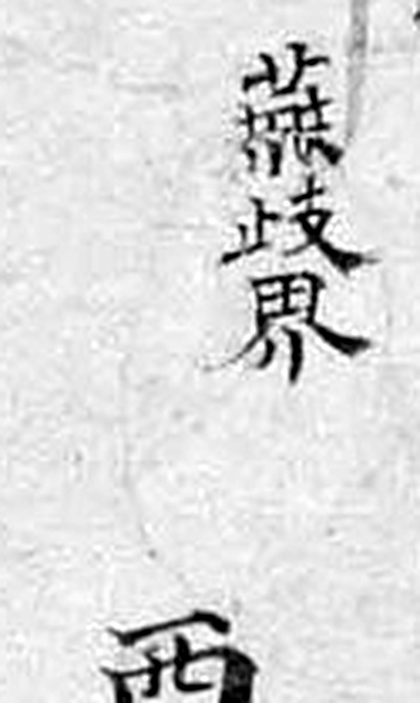 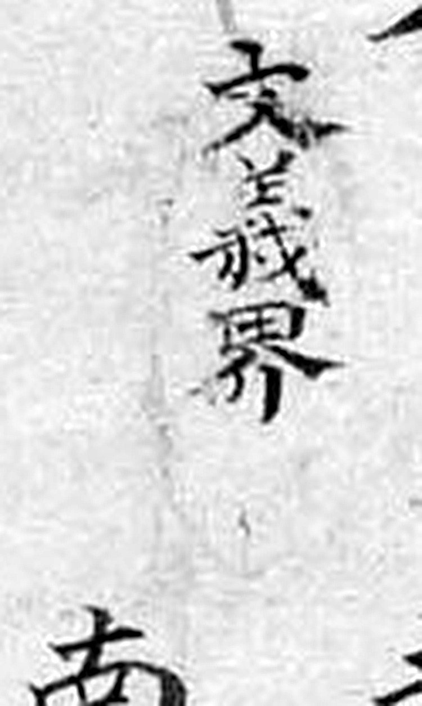 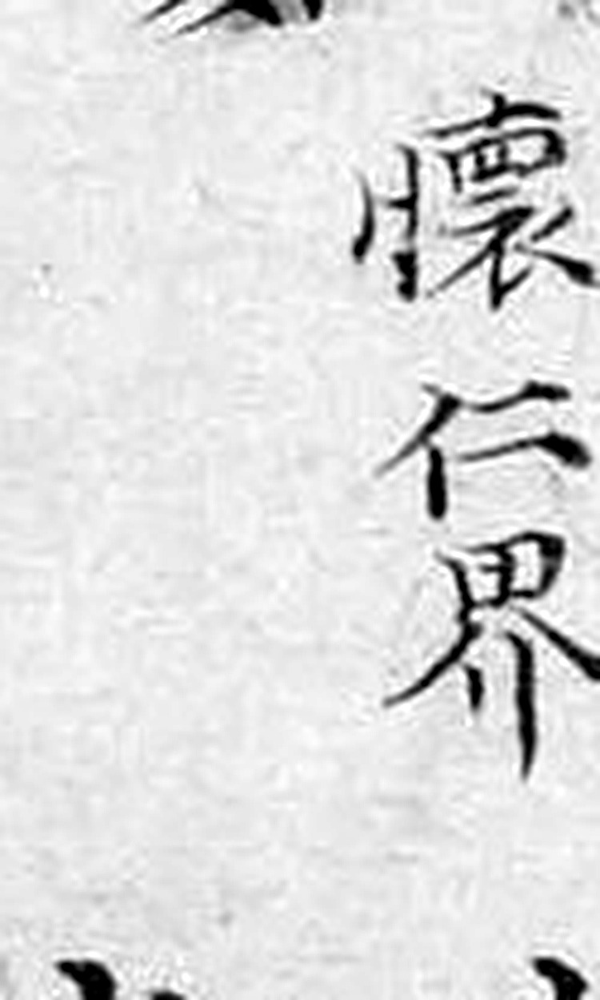

*왼쪽부터 `燕歧界` · **`文義界`** · `懷仁界`. 2026-10-01 에 6배로 박았습니다 —
이 도엽은 그때까지 **크롭이 하나도 없는 문서**였습니다.*

> **`文義界` 를 `全義界` 로 볼 뻔했습니다.** 좁게 자르면 `文` 의 윗점이 잘려 `全` 처럼
> 보입니다. 1872년 청주목지도의 **서쪽**이 `西接全義界`(12.7.3)라 더 헷갈리는
> 자리입니다 — **셋을 나란히 놓고서야 갈렸습니다.** 가장자리 표기는 **한 장씩 떼어
> 보지 말고 그 변의 이웃과 함께** 봐야 합니다.

대전 쪽(남서) 가장자리에 **고개 표기가 없습니다.** 읽힌 고개는 모두 동쪽
(보은·상주 방면)입니다 — `小龍峙`〔?〕 `三皂峙`〔?〕.

**여기에도 좌상단 첨지가 있고 형식이 같습니다** — `諸嶺山 … 引頸山 助車山 備禦處在
是處 故添書`. **해동지도 충청도 도엽에 이 형식의 첨지가 여럿 붙어 있다**는 뜻이고,
6.2 의 회덕 첨지를 읽는 열쇠가 됩니다.

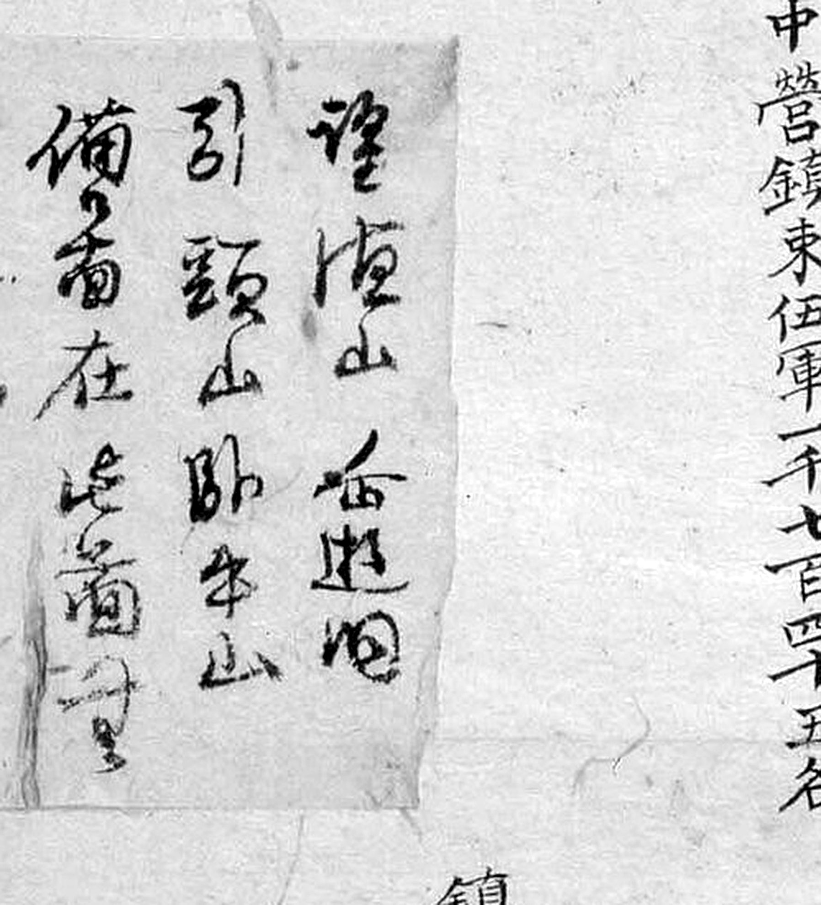

*2026-10-01 크롭. **덧붙인 종이의 테두리가 또렷합니다.** 다만 셋째 줄 둘째 글자는
`禦` 보다 **`看`** 에 가까워 보입니다(`備看在此處`?) — 11.6.8 의 「`備禦處在` 틀」을
확인할 때 함께 볼 일입니다.*

#### 11.6.4 「충청도 연산현」 — `鎭岑界` 가 두 번

**전문 기록: [`해동지도-연산현-판독.md`](해동지도-연산현-판독.md)**

| | |
|---|---|
| 자료번호 | `GM33469IL0006_045` |
| 방위 | 위가 北이되 **북쪽 가장자리 글자는 상하가 뒤집혀** 있습니다 |
| 사지 | 東 `珎山界五十里`(60리) · 西 `尼山界二十里`(30리) · 南 `恩津界二十里`(30리) · 北 `公州界二十里`(공주까지 70리) |

**`鎭岑界` 가 두 곳(0.35, 0.37)·(0.62, 0.33)에 있습니다.** 진잠은 사지에 없는
2차 접경인데도 가장자리에 두 번 적혔습니다 — 12.2 의 1872년 진잠 도엽 사지
`西 月底里 連山界 十五里` 와 짝이 맞습니다. **진잠과 연산은 서로를 적습니다.**

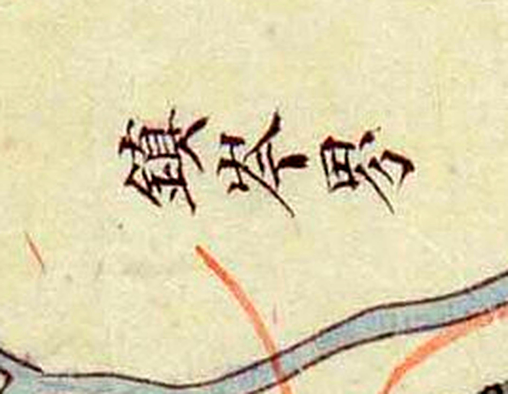

*`鎭岑界`. 이 구역은 글자가 **상하 반전**되어 있어 `界岑鎭` 으로 보입니다.*

##### 2026-10-01 — **북동(진잠 방향)에 `□□峴` 이 하나 있습니다**

1차 훑기에서 「대전 쪽(북동) 가장자리에 고개 표기가 없다」고 적고 4.3 에 올렸습니다.
**2차에서 (0.785, 0.475)에 세 글자 라벨을 찾았고 맨 왼쪽이 `峴`(山+見)입니다.**

| 위치 | 표기 | 확신 |
|---|---|---|
| **(0.785, 0.475)** | **`□□峴`** | `峴` **상** · 앞 두 자 **미판독** |
| (0.872, 0.643) | **`德目峙`** | 중 → **상** (붉은 길이 지남) |
| (0.883, 0.586) | `□□□` | 미판독 |


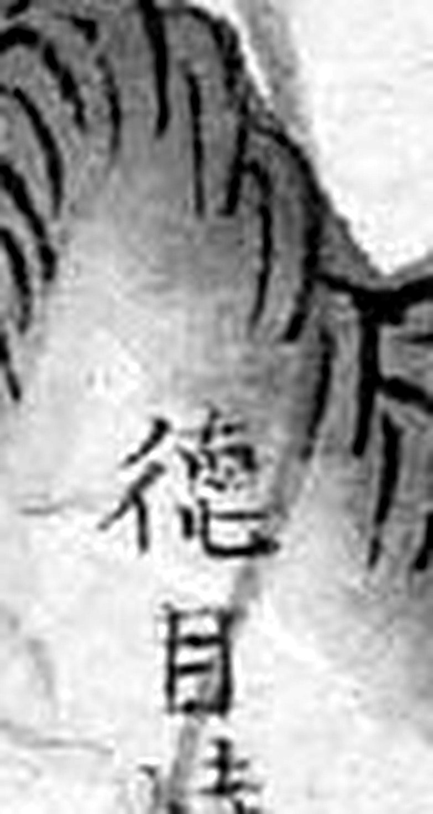

*왼쪽 `□□峴`, 오른쪽 `德目峙`.*

**자리가 `鎭岑界`(0.636, 0.324)와 `珎山界`(0.90, 0.366) 사이**입니다 —
**진잠에서 연산으로 넘는 고개**일 수 있어 대전 조사에 걸립니다. 7장 미판독에 올립니다.

(0.883, 0.586)의 세 글자는 **맨 오른쪽 글자가 `□□峴` 라벨의 맨 오른쪽 글자와 같아
보입니다** — 같은 말로 시작하는 두 지명일 수 있습니다.

##### 기문·사지·첨지

```
連山縣 城郭無 / 民戶 三千一百四十七戶
田 二千九百三結九十九卜六束 / 畓 二千一百三十結二十五卜三束
穀物摠數  會付米 十三石九斗 / 末捧 二百五十九石十一斗 /
         皮穀 九百五十八石四斗 / 末捧 七百七十二石五斗
軍兵摠數  監營軍 二十五名 / 兵營軍 二十三名 / 右營鎭束伍軍 三百十七名
```

**호구·전결·곡물·군병 넷뿐, 산천 조 없음** — **충청도 도엽 다섯이 한 틀**입니다
(문의·옥천·연기·회인·연산). 전라도 진산·금산만 산천 조를 갖습니다.
전결 단위를 **`卜`** 으로 적어 연기와 같습니다 — **`卜`/`負` 는 연기만의 버릇이
아닙니다.** 군병도 연기와 같이 세 갈래입니다.

사지는 `去本縣` 까지 갖췄습니다 — 진산 60 · 이산 30 · 은진 30 · 공주 70리.
`珎山界` 의 `珎` 는 회덕현·진잠 도엽과 같은 이체자입니다(5.1 · 5.4).

첨지는 `大芚山 古城基 □…` / `… □峙〔?〕 … 如` 두 줄이고, **`故添書` 가 보이지
않습니다**(11.6.8). `屯` 이 아니라 **`芚`** 입니다. 왼쪽 줄 둘째 글자가 `峙` 로
보여, 전문 판독이 대전 조사에 걸립니다.

#### 11.6.5 「충청도 연기현」 — 고개 **넷이 아니라 둘** (2026-10-01 정정)

**전문 기록: [`해동지도-연기현-판독.md`](해동지도-연기현-판독.md)**

| | |
|---|---|
| 자료번호 | `GM33469IL0006_052` · 방위 **위가 北** |
| 사지 | 東 `淸州界十七里`(50리) · 西 `公州界十里`(40리) · 南 `文義界十五里`(50리) · 北 `全義界十五里`(40리) |

**`懷德界` 가 없습니다** — 연기는 회덕과 직접 접하지 않고 문의·공주를 사이에 둡니다.
가장자리 표기는 `公州界`(세 곳) · `全義界` · `淸州界` · `文義界` 입니다.

##### 고개 둘로 줄었습니다

| 위치 | 표기 | 확신 | 날짜 |
|---|---|---|---|
| **(0.287, 0.295)** | **`松峙`** | 중 → **상** | 2026-10-01 |
| **(0.118, 0.383)** | **`石峴`** | 중 → **상** | 2026-10-01 |
| ~~(0.22, 0.55)~~ | ~~`金沙峴`~~ → **`金沙驛`**〔?〕 | **철회** | 2026-10-01 |
| ~~(0.12, 0.57)~~ | ~~`城峴`~~ → **`城□`** | **철회** | 2026-10-01 |

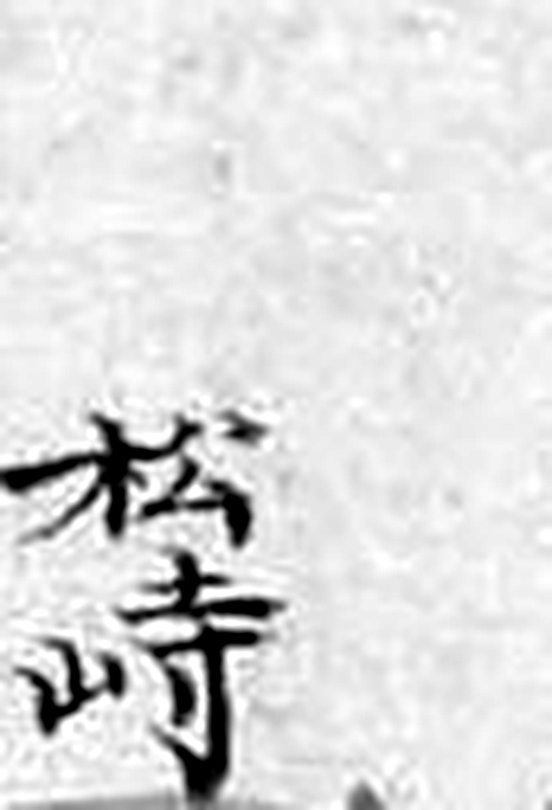
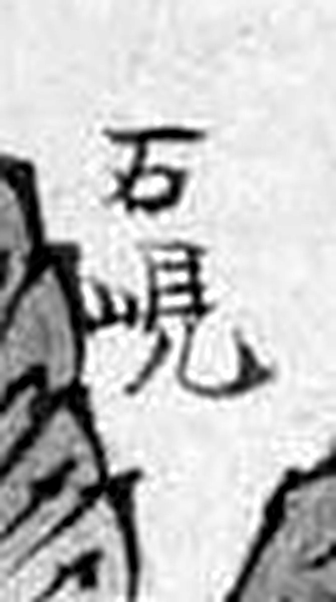
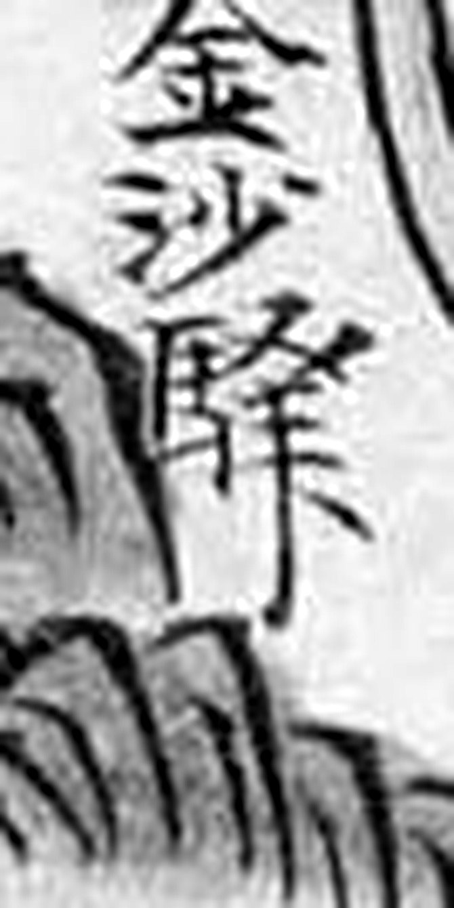
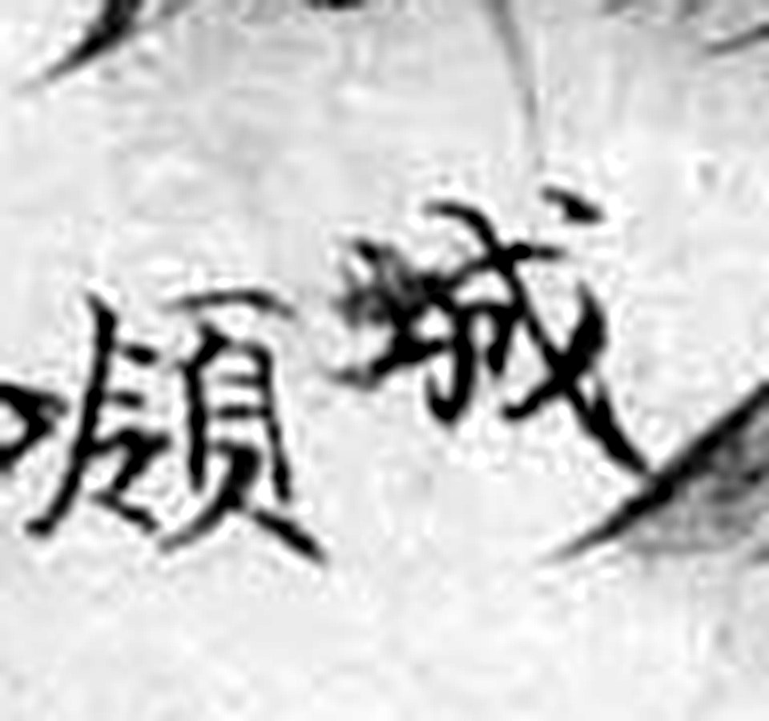

*왼쪽부터 `松峙` · `石峴` · `金沙□` · `城□`.*

1차 훑기(2026-09-30)에서 넷을 모두 확신 `중` 으로 두고 넘어갔습니다. 2026-10-01 에
10배로 키워 **같은 도엽의 `石峴` 을 자[尺]로 삼아** 대 보니 둘이 갈렸습니다.

- `金沙□` 의 셋째 글자는 왼쪽이 **세로로 긴 갈고리 부수**(`馬` 를 흘린 꼴)이지
  `石峴` 의 `峴` 이 보여 주는 **납작한 `山`** 이 아닙니다 → **`金沙驛`**〔?〕
  **같은 날 오후에 확정됐습니다** — 1872년 「연기현지도」(0.37, 0.74)에 **또렷한 해서로
  `金沙驛`** 이 있습니다(12.7.6). 확신 `중` → **`상`**, 〔?〕 를 뗍니다.

  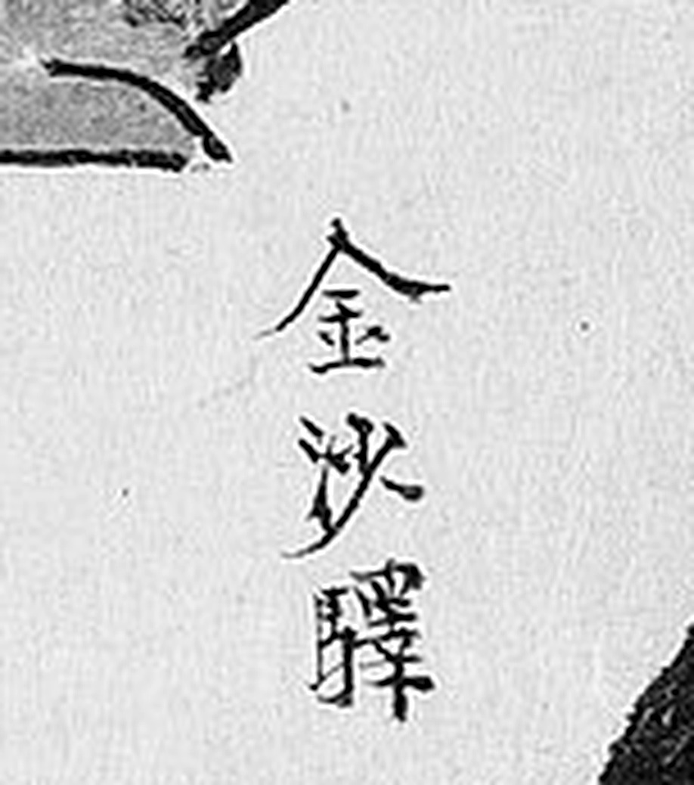
- `城□` 의 왼쪽 글자는 오른쪽이 `頁`, 왼쪽이 `工`/`禾` 꼴로 역시 `山` 이 아닙니다
  → **`城項`**〔?〕 일 수 있으나 확신 `하`

> **`峴`/`峙` 는 왼쪽 `山` 부수 하나로 갈립니다.** 저해상 사본에서 두 글자짜리 지명의
> 뒷글자는 `峴` 으로 읽기 쉬운데, **같은 도엽에 확실한 `峴` 이 있으면 그것을 자로
> 삼습니다.** 이번에는 `石峴` 이 자가 됐습니다. 2장 표기 원칙에 걸립니다.

##### 그래서 4.4 의 「고을마다 글자 버릇」 근거가 하나 줄었습니다

1차에서 **「연기는 `峴` 셋에 `峙` 하나」** 라고 적고 회인(`嶺` 셋)·회덕(`峙`·`峴`)·
진산금산(`峙`)과 함께 관찰을 세웠습니다. 연기가 `峙` 하나·`峴` 하나가 되면
**연기 쪽 근거는 사라집니다.** 회인의 `嶺` 셋은 그대로이므로 관찰 자체는 남기되,
**연기를 근거로 들지 않습니다.**

`城項`〔?〕 이 맞다면 **`項`(목 항)이 다섯 번째 고개 글자**가 됩니다 — 1872년
옥천군지도 `陽內面` 리 목록에 `竹項里` 가 있는 것과 짝이 됩니다(12.4).

##### 기문 — 충청도 셋이 **같은 틀**

```
燕歧縣 城郭無 / 民戶 二千六百九十戶
田 一千七百三十六結七十九卜六束 / 畓 一千一百二十四結八十九卜一束
穀物摠數  會付米 四百四十石二斗 / 末捧 五百十四石二斗 /
         皮穀 三千六百九十八石十四斗 / 末捧 一千七百八十四石十二斗
軍兵摠數  監營軍 二十二名 / 兵營軍 二十三名 / 右營鎭束伍軍 三百六十二名
```

**호구·전결·곡물·군병 넷뿐, 산천 조 없음** — 문의(11.6.2)·옥천(11.6.1)과 같습니다.
**충청도 도엽 셋이 한 틀**이고 전라도 진산·금산만 산천 조를 갖습니다(11.2 · 11.4).
**기문의 조목이 도(道)를 따라 갈린다**는 물음에 사례가 하나 더 붙었습니다.

전결 단위를 **`卜`** 으로 적습니다(문의·옥천은 `負`). 군병은 **세 갈래**
(감영·병영·우영진) — 문의·옥천은 둘이었습니다.

좌상단 첨지 — `五峯山 雲住山 興龍山 城山 正左山 … 備禦處在 … 故添書`〔?〕(11.6.8).

#### 11.6.6 「충청도 회인현」 — 회덕을 적습니다. 고개는 모두 `嶺`

**전문 기록: [`해동지도-회인현-판독.md`](해동지도-회인현-판독.md)**

| | |
|---|---|
| 자료번호 | `GM33469IL0007_012` · 방위 **위가 北** |
| 사지 | 東 `報恩界十五里`(30리) · 西 `文義界十五里`(30리) · **南 `懷德界三十里`**(회덕까지 60리) · 北 `淸州界二十五里`(50리) |

**`南距懷德界三十里` — 회인은 회덕을 이웃으로 적습니다.** 회덕 도엽에는 회인이 없습니다
(사지가 네 방향 대표만 적으므로). **일방 기록입니다** — 아래 4.2 의 주의 참조.
그림 가장자리에도 `懷德界` 는 없고 `淸州界`·`文義界`·`報恩界`·`沃川界` 만 있습니다.

##### 고개 **넷**, 모두 `嶺` (2026-10-01 하나 추가)

| 위치 | 표기 | 확신 |
|---|---|---|
| (0.61, 0.28) | `皮盤嶺` | 중 → **상** |
| (0.30, 0.42) | **`墨嶺`** | 중 → **상** |
| (0.94, 0.56) | `蘆嶺` | 중 → **상** |
| **(0.955, 0.49)** | **`車嶺`** | **중** (`車`/`卑`) |

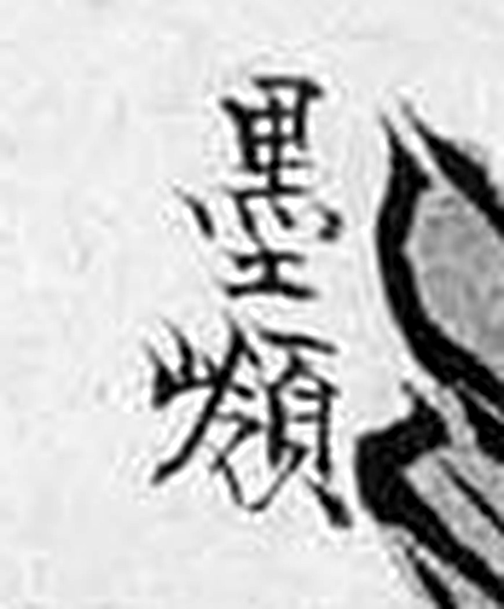
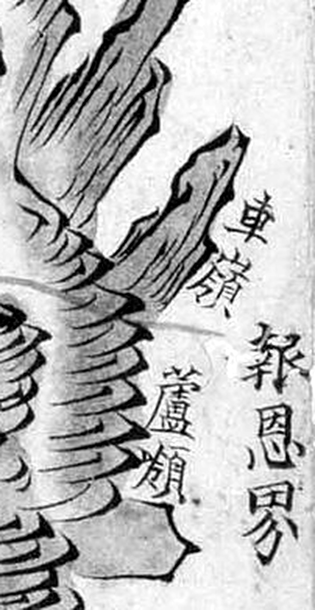

*왼쪽 `墨嶺`, 오른쪽은 위가 **`車嶺`**, 아래가 `蘆嶺`, 끝이 `報恩界`.*

**`墨嶺` 이 이 도엽의 자[尺]입니다** — `墨` 아래 글자에 `山` 부수가 왼쪽에 또렷합니다
(`山`+`令`+`頁`). 같은 날 연기에서 두 라벨이 **`山` 부수가 없어 철회된 것**(11.6.5)과
대조되고, **이 도엽의 `嶺` 넷은 모두 같은 검사를 통과합니다.** 확신을 `중`→`상` 으로
올립니다.

`車嶺` 은 1차 훑기에서 `蘆嶺` 바로 위를 지나쳤던 것입니다. 보은 가는 길목이고
**넷 다 대전 쪽이 아닙니다.**

**같은 날 연기의 `峴` 셋이 둘로 줄면서, 회인의 `嶺` 넷이 4.4 「고을마다 글자 버릇」의
유일한 강한 근거**가 됐습니다 — 그리고 넷으로 늘어 오히려 단단해졌습니다.

##### 첨지 둘 — 문구가 **세 번째 꼴**

좌상단 첨지의 마지막 줄이 **`寫畫`** 입니다 — `故添書` 가 아닙니다(11.6.8).
`水波`·`麻田菴`·`峨眉山` 이 읽히고 `備` 가 셋째 줄에 있습니다. 초서라 전문은 미판독.

**면별표 아래에도 조각이 하나 더** 붙어 `邑內面`(초경 自官門 · 종경 5리)과
`江外面`(초경 15리 · 종경 1리〔?〕)을 더합니다. 본표는 東·南·西·北 넷뿐입니다.
**옥천군 도엽에도 똑같은 꼴의 `邑內面` 조각이 있습니다**(11.6.1) — 다만
**옥천은 숫자가 비어 있고 회인은 채워져 있습니다.**

> **읍내면을 빠뜨리는 일이 되풀이됐습니다.** 도엽 둘에서 같은 자리에 같은 종류의
> 조각이 나왔고 한쪽은 끝내 값을 못 채웠습니다 — **해동지도가 작업 중인 책**이라는
> 증거가 둘이 됐습니다.

##### 기문 — **충청도 넷이 같은 틀**

```
懷仁縣 城郭無 / 民戶 八百四十戶
田 九百八十七結三十四負七束 / 畓 一百六十六結五十三負四束
穀物摠數  會付米 四十一石二斗 / 末捧 五百二十五石一斗 /
         皮穀 二百十二石十四斗 / 末捧 一千一百十石一斗
軍兵摠數  兵營軍 三十二名 / 中營鎭束伍軍 一百十六名
```

호구·전결·곡물·군병 넷뿐, **산천 조 없음.** 문의·옥천·연기와 같습니다 —
**충청도 도엽 넷이 한 틀**이고 전라도 진산·금산만 산천 조를 갖습니다.
전결 단위는 `負`(연기만 `卜`), 군병은 둘(병영·중영진).
**호수 840호로 지금까지 본 도엽 가운데 가장 작습니다**(문의 2,862 · 연기 2,690 ·
옥천 8,202).

#### 11.6.7 「충청도 이산현」·「충청도 은진현」 — 대전과 닿지 않습니다

**전문 기록: [`해동지도-이산현-판독.md`](해동지도-이산현-판독.md) · [`해동지도-은진현-판독.md`](해동지도-은진현-판독.md)**

| 도엽 | 사지 | 대전 |
|---|---|---|
| 이산현(`GM33469IL0006_044`) | 東 `連山界十里`(30리) · 西 `石城界十里`(20리) · 南 `恩津界十里`(20리) · 北 `公州界十里`(50리) | **접하지 않음** — 연산을 사이에 둠 |
| 은진현(`GM33469IL0006_043`) | 東 `連山界十里`(30리) · 西 `林川界二十五里`(50리) · 南 `礪山界二十里`(30리) · 北 `石城界二十里`(30리) | **접하지 않음** |

이산에 **`板峙嶺`**(0.51, 0.36) 하나가 보이고, **은진에는 고개 표기가 하나도 없습니다.**

**2026-10-01 2차 — 두 도엽은 크롭이 하나도 없는 문서였습니다.** `板峙嶺` 을 8배로
확대해 **확신 `하`→`상`** 으로 올리고(첫 글자는 `木`+`厂`+`又`, 곧 `板`. `杻`(木+丑)
후보를 뺍니다), 두 도엽의 좌상단 첨지도 박았습니다.

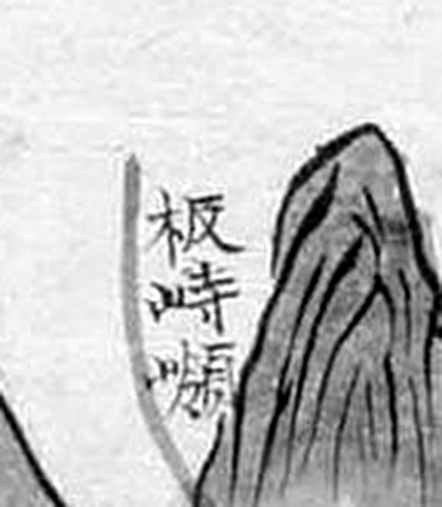 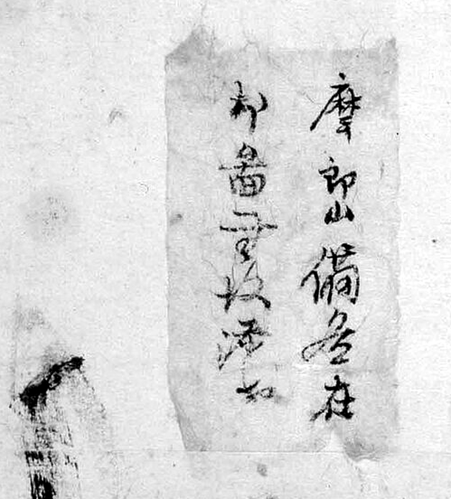

*왼쪽 이산현 `板峙嶺`, 오른쪽 은진현 첨지(`摩尼山 備禦處在`). **덧붙인 종이의 테두리가
그대로 보입니다** — 이 계열이 「나중에 붙인 쪽지」임을 눈으로 확인할 수 있습니다.*

**`板峙嶺` 은 `峙` 와 `嶺` 이 겹친 드문 표기**입니다(2장). `板` 은 우리말 「널」이므로
「널재」일 수 있으나 그 이상은 모릅니다.
둘 다 좌상단 첨지가 있습니다(이산 `論橋 備當在此處`〔?〕, 은진 `摩尼山 備禦處在 … 故添書`〔?〕).

#### 11.6.8 방어처 첨지 — 여섯 도엽에서 확인

이번 훑기에서 **좌상단 첨지가 여섯 도엽에 붙어 있는 것**을 확인했습니다. 회덕까지 치면
일곱입니다.

| 도엽 | 첨지가 지목한 곳 |
|---|---|
| **회덕현** | `子峴 子田峴 俱在…` (6.2, 셋째 줄 미판독) |
| 문의현 | `鷹峯` · **`弘峙`** |
| 청주목 | `諸嶺山` · `引頸山` · `助車山` |
| 연기현 | `五峯山` · `雲住山` · `興龍山` · `城山` · `正左山`〔?〕 |
| 회인현 | `水波沙` · `麻田菴` · `娥眉山`〔?〕 |
| 이산현 | `論橋` |
| 은진현 | `摩尼山` |
| **옥천군** (2026-10-01) | `□□` — **문구가 다릅니다**(아래) |
| **회인군** (2026-10-01) | `水波 … 麻田菴 … 峨眉山 … 備 … ` **`寫畫`** — 또 다른 문구 |
| **연산현** (2026-10-01) | `大芚山 古城基 □…` / `… □峙〔?〕 … 如` — **`故添書` 가 보이지 않습니다**. 문구 미확인 |

**형식이 같습니다** — 지명을 늘어놓고 `備禦處在`(방어처가 있다) + `故添書`(그래서 덧붙여
적었다). **충청도 도엽에 두루 붙은 관방 주기**입니다. 6.2 의 회덕 첨지를 읽는 열쇠가
여기에 있습니다.

##### 2026-10-01 — 여덟 번째 도엽에서 **문구가 처음 갈립니다**

옥천군 도엽 좌상단에도 첨지가 있습니다. 한 줄 여섯 자인데 —

```
□□ 與備禦 同          (옥천)
○○ 備禦處在 … 故添書   (나머지 일곱)
```

`與`·`備`·`禦`·`同` 이 또렷하고, 맨 위 두 자(지명으로 보임)는 초서라 못 읽었습니다.
**「방어처가 있다 … 그래서 덧붙여 적었다」가 아니라 「방어처와 같다」입니다.**

같은 날 **회인현에서 세 번째 문구**가 나왔습니다 — 마지막 줄이 **`寫畫`**(베껴 그림)
입니다(11.6.6).

| 문구 | 도엽 | 수 |
|---|---|---|
| `… 備禦處在 … 故添書` | 회덕 · 문의 · 청주 · 연기 · 이산 · 은진 | 여섯 |
| `… 與備禦同` | **옥천** | 하나 |
| `… 寫畫` | **회인** | 하나 |

**첨지가 한 번에 한 손으로 붙은 것이 아닙니다.** 여섯이 한 꼴이고 둘이 제각각이라면,
**여섯 쪽이 본(本)이고 둘은 따로 적힌 것**으로 보는 편이 자연스럽습니다.
6.2 의 회덕 첨지는 **여섯 쪽**에 들므로, 그 꼴을 기준으로 읽으면 됩니다 —
이것이 2026-10-01 에 얻은 실마리입니다.

## 12. 《1872년 지방지도》

**대전에 걸리는 도엽 셋과 접경 도엽 여섯을 원본으로 갖고 있습니다** — 도엽 주소는
[`고지도-목록.md`](고지도-목록.md). 2026-09-02 에 6.4 의 판정점인 「진산군지도」의 `鷄峴`
확인을 목표로 접경 도엽을 훑기 시작했고, 그 뒤 도엽별로 이어 가고 있습니다.

### 12.1 「충청도 회덕현지도」

**대전의 본체입니다.** 전문 채록은 별도 문서
**전문 기록: [`1872-회덕현지도-판독.md`](1872-회덕현지도-판독.md)** — 여기에는 고개와
관련된 것만 둡니다.

#### 東面에서 `吉峙`(질티) 확인 (2026-09-03)

**6 가 제보로만 갖고 있던 질티가 도엽에 있습니다.** 표기는 **`吉峙`** 입니다.

| 위치 | 표기 | 읽기 | 확신 | 판독자 | 날짜 | 근거 |
|---|---|---|---|---|---|---|
| (0.70, 0.26) | **吉峙** | 길치 = **질티·질현** | 상 | 연구회 | 2026-09-03 | <br>[넓게](crops/KYKH002_0000_0046_x0.66_y0.23_w0.09_h0.05.jpg) |
| (0.75, 0.20) | 古芚店 | 고둔점 | 상 | Claude | 2026-09-03 | [`crops/KYKH002_0000_0046_x0.53_y0.16_w0.26_h0.14.jpg`](crops/KYKH002_0000_0046_x0.53_y0.16_w0.26_h0.14.jpg) |
| (0.72, 0.16) | 楊川市 開市 五日·十五日 | 양천시(장시) | 상 | Claude | 2026-09-03 | 같음 |

**붉은 도로가 `吉峙` 를 넘습니다.** 위쪽(동)에서 `楊川市`·`古芚店` 을 거쳐 내려온 길이
고갯마루를 지나 서남으로 빠집니다. 이 도엽은 위가 東이므로 `吉峙` 는 읍치의 **동남**이고,
`飛來菴`(0.58, 0.29)·`宗晦祠`(0.74, 0.29)와 나란한 높이입니다 — **질현성이 있는 대덕구
비래동 언저리와 맞습니다.**

**표기가 도엽마다 다릅니다** — 여기서는 `吉`(길할 길), 다른 자료에서는 `質`(품질 질),
문화유산 지정 명칭은 `迭峴` 입니다. **6.5** 에 쟁점으로 세웠습니다.

**같은 블록에서 東面 주기가 확정됐습니다.**

```
東面【自官東距二里】 各里 古芚·宜洞·楊川·新垡·三巨里·細川·細谷…
戶三百七十  口二千六百六十九
```

**`三巨里` 가 東面 리 목록에 있습니다** — 도엽 (0.79, 0.13)의 `三巨里店` 이 그 마을의
점(店)이라는 것이 이로써 맞물립니다. 그리고 **口 = 2,669** 가 리 목록과 같은 블록에서
다시 확인되어, 한때 2,629 로 적었던 것이 확실히 정정됩니다.

#### 남부 훑기 — 고개 표기 없음

이 도엽은 **위쪽이 東**입니다(위=동, 아래=서, 왼쪽=북, 오른쪽=남). 대전–옥천·대전–금산
경계 방면은 도엽 **오른쪽 위**에 해당합니다.

| 훑은 범위(상대좌표) | 실제 방위 | 본 것 |
|---|---|---|
| x 0.75–0.95, y 0.08–0.16 | 동남 모서리 | `沃川界二十里`, 미확인 라벨 |
| x 0.75–0.95, y 0.16–0.25 | 동남 | `食藏山` 주기 |
| x 0.83–0.97, y 0.23–0.56 | 남 | `高山寺`·`外南面`·`杞菊亭` 주기 |

이 범위에서 `峴`·`峙` 로 끝나는 표기가 나오지 않았습니다. **찾던 질티는 남부가 아니라
東面(위쪽)에 `吉峙` 로 있었습니다** — 위 소절 참조. 남부만 훑고 "없다"고 적었던 것이
방향 판단 착오였습니다.

| 위치 | 표기 | 읽기 | 확신 | 판독자 | 날짜 | 근거 |
|---|---|---|---|---|---|---|
| (0.79, 0.13) | **三巨里店** | 삼거리점 | **상** | 연구회 | 2026-09-03 | 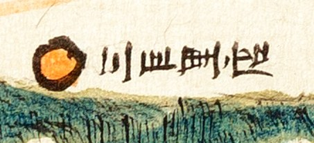 |

**`三巨里店`(삼거리점)입니다** — 판독자 확인. 곁의 주황 원은 `古芚店`·`長洞店` 과 같은
**점(店) 기호**였습니다.

**이 글자는 상하가 반전되어 적혀 있습니다.** 돌려 보지 않아 마지막 글자 `店` 을 `川` 으로
읽고 "하천 이름일 것"이라고 적었습니다. **회덕현지도는 남쪽(도엽 오른쪽) 주기를 반대편에서
읽도록 적는 일이 있습니다** — 숭현사·영귀루·금운정이 그랬는데 여기도 그렇습니다.

**고개 조사에 값이 있습니다.** `三巨里`(삼거리)는 **길이 갈리는 자리**이고, 점(店)은 그 갈림길에
선 주막입니다. 자리가 `沃川界二十里` 안쪽이니, **회덕에서 옥천으로 넘는 길이 갈라지던
지점**일 수 있습니다 — 마달령(3)·질현(6) 어느 쪽으로 붙는지가 다음 물음입니다.

#### 2026-10-01 — 전면 훑기. 고개는 `吉峙` 하나, **봉수가 그림으로도 있습니다**

**전문 기록: [`1872-회덕현지도-판독.md`](1872-회덕현지도-판독.md)**

3,840 px 사본으로 도엽을 아홉 조각으로 훑었습니다. 지금까지 남부와 동면만 봤습니다.

##### `吉峙` 재확인

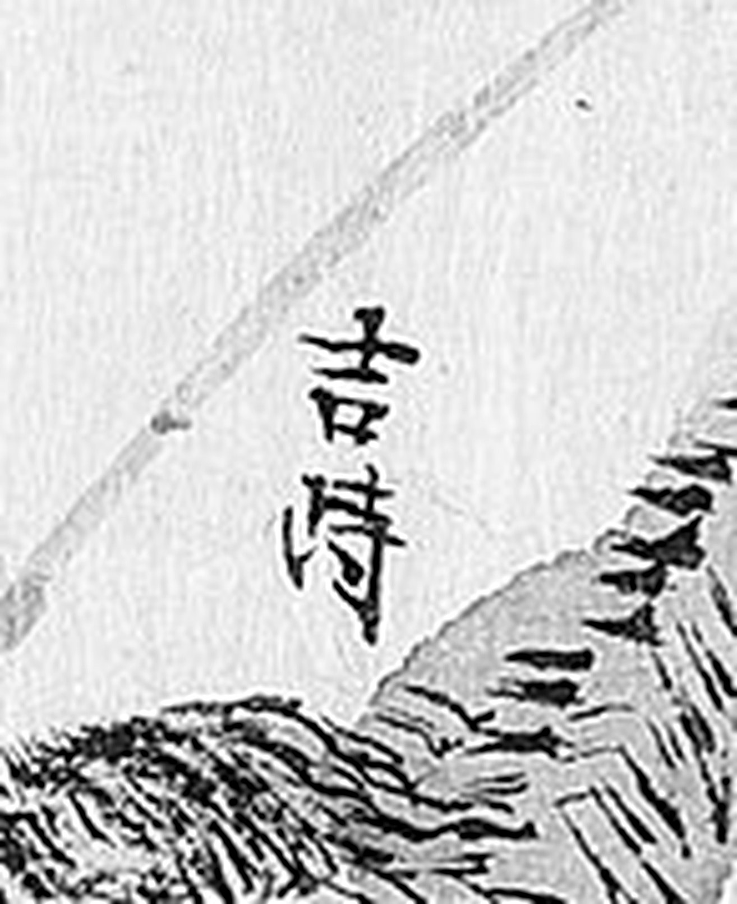

좌표를 **(0.694, 0.253)** 으로 조였습니다. `峙` 의 `山` 부수가 또렷해 2026-10-01 의
자[尺] 검사를 통과합니다(11.6.5). 주황색 길이 지나고, `東面` 안입니다.
**도엽 전면에 `峙`·`峴`·`嶺` 은 이것 하나뿐**입니다.

##### `鷄足山` 과 `烽臺` — 주기만이 아니라 **그림으로도**

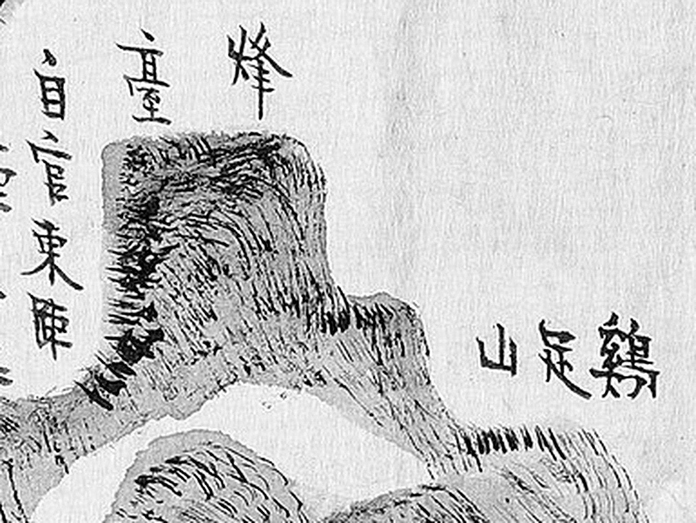

납작한 봉우리 위에 탑 모양 봉수대가 그려져 있고, **`烽臺`**(세로)와 **`鷄足山`**(우횡서)이
붙어 있습니다 — `烽臺`(0.408, 0.250) · `鷄足山`(0.456, 0.274).
지금까지 이 봉수는 **주기로만** 기록돼 있었습니다.

- 글자는 **`鷄`(奚+鳥)** — 해동지도 회덕현의 `雞`(奚+隹)와 갈립니다(2장).
- 용어는 **`烽臺`** — 1872년 옥천군지도도 `環山烽臺`·`月伊峯烽臺` 입니다.
  **1872년 계열의 표준 표기**이고, 주기 안에서 남의 고을 것을 가리킬 때만 `烽燧` 입니다.
  이것이 해동지도의 `烽□` 를 `烽臺` 로 가른 근거를 한 번 더 받칩니다(11.6.1).

**봉수 노선 다섯 고리의 회덕 자리가 그림·주기 양쪽으로 섰습니다**(13.3).

##### 면별 주기에 **리 이름이 다 있습니다** — 1872 옥천군지도와 같은 꼴

```
東面   自官東距二十里 各里 古堯〔?〕 官洞 楊川 新塩 三巨里 細川 細谷
       ○ 戶 三百七十 口 二千六百六十九
外南面 自官南距三十里 各里 龍田 □道 右南 加陽 覆堤 大東 眞農
       尾吉 龍防 楮田 井浦 泉洞 大別 ○ 戶 四百八十九 口 二千三百二十
```

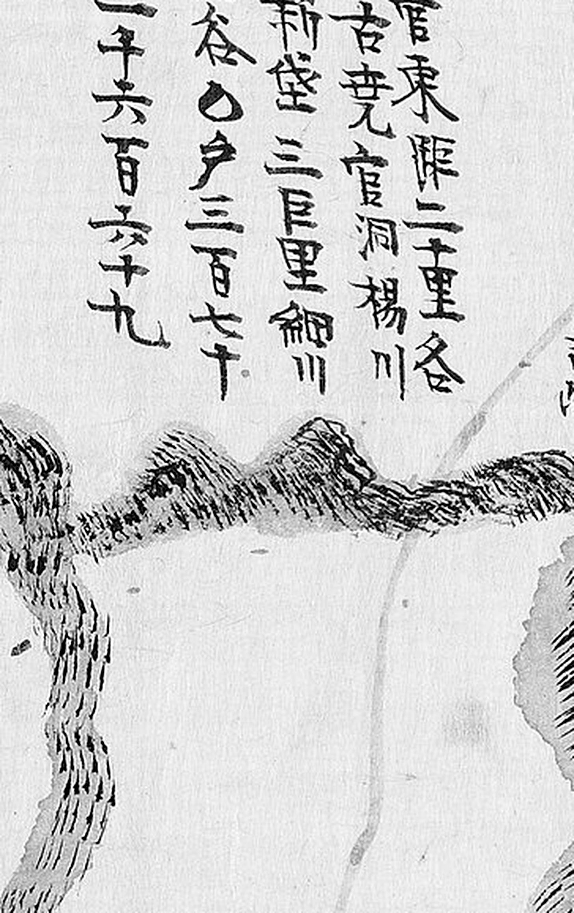
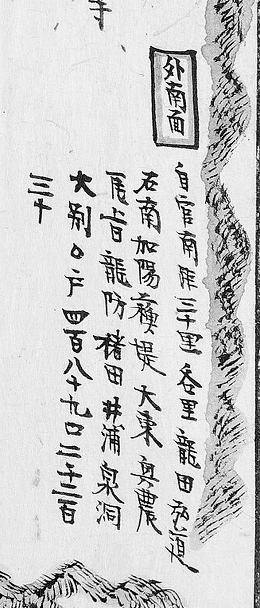

**`細川`(세천)이 `吉峙` 와 같은 `東面` 에 있습니다.** `加陽`·`龍田`·`大東` 은 지금
동구의 동 이름으로 이어집니다.

> **이것이 지명 조사의 본 광맥입니다.** 1872년 계열은 **옥천·회덕 두 도엽 모두**
> 면마다 리 이름을 다 적었습니다. 고개 조사를 넘어 **대전 리 이름의 1872년 상태**가
> 한 장에 들어 있습니다. 면 일곱의 주기를 모두 전사하는 것을 남은 일로 세웁니다.

##### 주기가 흩어져 있습니다

12.1 의 「도엽 기문」은 한 덩어리가 아니라 **지도 본문에 흩어진 주기를 모은 것**입니다 —
연혁·관원은 왼쪽 위 글상자, **산천과 봉대는 해당 그림 옆**입니다. 자리는 전문 기록
문서에 표로 적었습니다.

### 12.2 「충청도 진잠산천방리도로지도」 — 전면 훑기 (2026-09-03)

**전문 기록: [`1872-진잠지도-판독.md`](1872-진잠지도-판독.md)**

9 의 5번이자 **이 조사의 가장 큰 구멍**이라 적어 둔 진잠 도엽입니다. 도엽 본체를
원본 3×3 타일로 나눠 아홉 장 전부를 훑었습니다. 자료는 《1872년 지방지도》
「충청도 진잠산천방리도로지도(鎭岑山川坊里道路之圖)」(규장각), 5,053 × 8,000 px 입니다.

#### 먼저 방위 — **위가 서(西)** 입니다

**위=서, 아래=동, 왼쪽=남, 오른쪽=북.** 근거 넷이 서로 맞습니다.

| 근거 | 내용 |
|---|---|
| 가장자리 경계 표기 | 위쪽 가장자리에 `珎山界`(남)·`連山界`(서) 둘, 아래 여백에 `公州界`·`去懷德路`(동·동북) |
| 면 배치 | 하남면 왼쪽 위, 상남면 왼쪽 가운데, 서면 오른쪽 위, 북면 오른쪽 가운데, 동면 아래, 읍치 가운데 |
| 산 위치 | `安平山`(현 서구 흑석동 남 → 남)이 왼쪽, `分雞山`(빈계산, 유성구 계산동 → 읍치 북)이 오른쪽 |
| 물길 | `豆磨川`(두마천, 현 계룡시 두마면 → 서)이 위쪽 |

**도엽마다 방위가 다릅니다.** 회덕현지도는 위가 東이었고([1872-회덕현지도-판독.md](1872-회덕현지도-판독.md)),
진잠 도엽은 위가 西입니다. **좌표만 옮겨 적고 방위를 확인하지 않으면 방향 해석이 통째로
뒤집힙니다** — 회덕에서 실제로 한 번 뒤집혔습니다.

#### 고개 — 둘

| 위치 | 표기 | 읽기 | 확신 | 판독자 | 날짜 | 근거 |
|---|---|---|---|---|---|---|
| (0.51, 0.53) | **奄峴** | 엄현 | **상** | 연구회 | 2026-09-03 | <br>[넓게](crops/KYKH002_0000_0036_x0.44_y0.47_w0.14_h0.1.jpg) |
| (0.13, 0.61) | **牛拳峴** | 우권현 | 상 | Claude | 2026-09-03 | <br>[넓게](crops/KYKH002_0000_0036_x0.05_y0.55_w0.16_h0.1.jpg) |

**`奄峴` 은 읍치에서 서쪽으로 난 붉은 도로가 산줄기를 넘는 자리에 적혀 있습니다.**
첫 글자는 **`大` 아래 `甲` 꼴 = `奄`** 으로 확정했습니다(판독자, 2026-09-03).

**`牛拳峴` 이 이번 훑기의 가장 큰 소득입니다.** 바로 옆에 `去珎山界路`(진산 경계로 가는 길)가
적혀 있어, **진잠에서 진산으로 넘던 고개**로 읽힙니다. 기문의 사지가 「남 壯安里 珍山界 15리」
이고 장안리는 현 서구 장안동이니, 자리는 **서구 장안동·봉곡동 남쪽**으로 좁혀집니다.
다만 도로 주기가 이 고개를 가리킨다는 것은 **자리로 미룬 추정**이며, 우리말 이름은
아직 모릅니다.

#### 고개 이름이 든 리 — 둘

| 위치 | 표기 | 읽기 | 확신 | 판독자 | 날짜 | 근거 |
|---|---|---|---|---|---|---|
| **(0.215, 0.427)** | 鐵峴里 | 철현리 | 상 | Claude | 2026-09-03 · **2026-10-01 좌표 정정·크롭** | 하남면. 2026-09-03 의 (0.32, 0.43)에는 `下南面 十三洞` 패가 있습니다 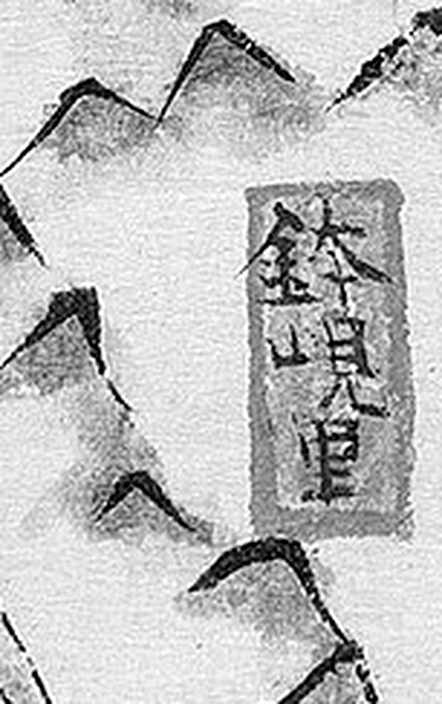 |
| (0.28, 0.58) | **薪峴里** | 신현리 | **상** | 연구회 | 2026-09-03 | 상남면. 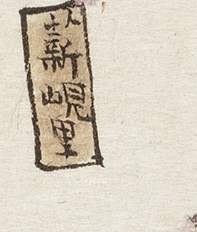 |

**`薪峴里` 입니다**(판독자 확정). 첫 글자는 `新` 이 아니라 **풀초(`艹`)가 얹힌 `薪`** 입니다 —
내가 "`新` 위에 덧쓴 작은 글자"로 본 것이 바로 그 `艹` 였습니다. 방(榜) 안은 **세 글자가
전부**이고 덧쓴 글자는 없습니다.

**이 정정이 다른 도엽으로 번집니다.** `薪` 은 1872년 「금산군지도」 西二面의 `薪峙`·`上薪谷`·`下薪谷`(12.6)과
같은 글자입니다. **`薪`(섶·땔나무)이 이 지역 고개 이름에 실제로 쓰이는 글자임이 확인된
것이므로**, 해동지도 진산군에서 `新峙` 로 읽은 것(11.2)도 **`薪峙` 일 가능성을 다시
봐야 합니다.** 6.4 의 "`新峙` 와 `□峙` 를 섞지 않는다"는 주의가 더 중요해졌습니다.

> **2026-10-01.** 진산 도엽의 `新峙`(0.455, 0.310)는 **`艹` 가 없고 두 글자**임을
> 7배 확대에서 다시 확인했습니다 — `薪峙` 가 아닙니다. 흔들리는 것은 그 옆의
> 동북 `□峙`(0.71, 0.28) 하나이고, 그쪽은 기문의 `新目峙` 로 보는 쪽에 섰습니다(6.7).

**리 이름은 고개의 출전이 아닙니다.** `鐵峴`·`新峴` 이라는 고개가 그 마을 곁에 있었으리라는
정황일 뿐, 도엽은 고개를 따로 그리지 않았습니다. 3장에 올리지 않고 여기에만 둡니다.

#### 도로 주기 — 넷

| 위치 | 표기 | 읽기 | 확신 | 판독자 | 날짜 | 근거 |
|---|---|---|---|---|---|---|
| (0.10, 0.61) | 去珎山界路 | 진산 경계로 가는 길 | 상 | Claude | 2026-09-03 | 우권현 크롭에 함께 나옴 |
| (0.56, 0.36) | 去連山路 | 연산 가는 길 | 상 | Claude | 2026-09-03 | `豆磨川` 곁 |
| (0.94, 0.72) | 去公州大路 | 공주 가는 **대로** | 상 | Claude | 2026-09-03 | 동북 모서리 |
| (0.60, 0.92) | 去懷德路 | **회덕 가는 길** | 상 | Claude | 2026-09-03 | 아래 여백. [`crops/KYKH002_0000_0036_x0.55_y0.88_w0.13_h0.07.jpg`](crops/KYKH002_0000_0036_x0.55_y0.88_w0.13_h0.07.jpg) |

**`去懷德路` 는 이 계열에서 이웃 고을이 도로 주기로 나오는 사례입니다.**
(2026-09-02 에 「진산군지도의 `懷德` 주기와 같은 성격」이라 적었으나 그 판독은
**철회되었습니다** — 12.5.) 1872년 도엽들은 이웃
고을을 **경계 표기가 아니라 도로 주기로** 적어 두는 일이 있습니다 — 사지에 없는 이웃이
도로 주기에 나오므로, **경계 표기만 훑으면 놓칩니다.**

#### 경계 표기와 사지

| 위치 | 표기 | 실제 방위 |
|---|---|---|
| (0.10, 0.35) | 珎山界 | 남서 |
| (0.20, 0.35) · (0.73, 0.34) | 連山界 (두 곳) | 서 |
| (0.88, 0.31) | 鶴龍山 · 公州界 | 북 |
| (0.39, 0.86) · (0.62, 0.91) | 公州界 (두 곳) | 동 |

**기문의 사지를 읽었습니다** — 「북 鶴下洞 公州界 10리 · 동 介水院里 公州界 10리 ·
남 壯安里 珍山界 15리 · 서 月底里 連山界 15리」. **[`고지도-목록.md`](고지도-목록.md) 가
"진잠·공주목의 사지를 읽지 않았다"고 적어 둔 것 가운데 진잠 쪽이 해소됩니다.**

`珎山界` 의 `珎` 는 **회덕현지도의 `珎山` 과 같은 이체자**입니다. 같은 1872년 계열에서
두 도엽이 나란히 `珎` 를 쓴 것이 확인되어, 6.1·6.4 에서 흔들렸던 `珎` 판독은 더 단단해집니다.

#### 훑은 범위 — 전면

| 타일(원본 좌표) | 실제 방위 | 본 것 |
|---|---|---|
| 왼쪽 위 | 남서 | 하남면 13동, `珎山界`·`連山界`·`大老山` |
| 가운데 위 | 서 | `去連山路`·`豆磨川`, 하남면 리 |
| 오른쪽 위 | 서북 | 서면 16동, `連山界`, `白雲峰` |
| 왼쪽 가운데 | 남 | 상남면 14동, **`牛拳峴`**·`去珎山界路`·`安平山` |
| 가운데 | 중앙 | **`奄峴`**, 읍치(官舍·客舍·邑倉·軍器庫·社壇), `藥師峰`, `新院里` |
| 오른쪽 가운데 | 북 | 북면 14동, 향교·서사창·厲壇, `海見寺`·`分雞山`·`錦繡峰` |
| 왼쪽 아래 | 남동 | 거의 빈 여백. `獐坪里`·`屯洞里`〔?〕 |
| 가운데 아래 | 동 | 동면 13동, `公州界`, 아래 여백에 **`去懷德路`** |
| 오른쪽 아래 | 동북 | `去公州大路`, `介水院場市`·`介水川`·`東社倉`·`胎峯` |

**`峴`·`峙`·`嶺` 로 끝나는 표기는 위 넷(고개 둘 + 리 둘)이 전부입니다.** 진잠 도엽은
`山川坊里道路` 를 표제로 걸었지만 **고개는 인색하게 적었습니다** — 산 이름과 리 이름은
빽빽한데 고개는 둘뿐입니다.

#### 2026-10-01 — 두 고개의 쓰임이 **짝을 이룹니다**

**전문 기록: [`1872-진잠지도-판독.md`](1872-진잠지도-판독.md)**

3,840 px 사본으로 아홉 조각 재훑기. 고개는 여전히 **둘뿐**이고, `峴` 둘 다 왼쪽에
`山` 부수가 또렷해 **자[尺] 검사를 통과**합니다(11.6.5).

| 위치 | 표기 | 길 주기 | 통하는 곳 |
|---|---|---|---|
| **(0.508, 0.530)** | **`奄峴`** | **`去連山路`**(0.56, 0.36) | **연산** |
| **(0.123, 0.617)** | **`牛拳峴`** | **`去珎山界路`**(0.10, 0.61) | **진산** |


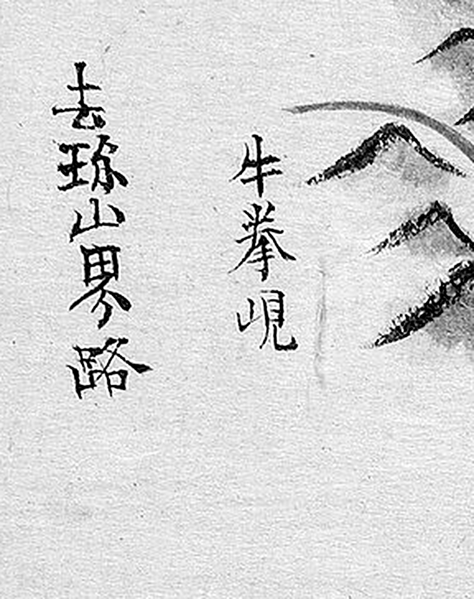

*왼쪽 `奄峴`, 오른쪽 `牛拳峴` 과 바로 곁의 `去珎山界路`.*

**`奄峴` 을 넘은 붉은 길이 `豆磨川` 을 건너 `去連山路` 가 됩니다** — 두 주기가 따로
적혀 있던 것을 3,840 px 에서 한 줄기로 이었습니다.

> **1872년 진잠 사지의 서·남 두 방향이 그대로 고개 둘로 나타납니다.**
> 「西 月底里 連山界 十五里」 ↔ `奄峴`, 「南 壯安里 珍山界 十五里」 ↔ `牛拳峴`.
> **길 주기가 고개의 쓰임을 알려 주는 사례**이고, 이 계열에서 처음 확인했습니다 —
> 4.4 에서 「대전으로 드나드는 길목」을 가릴 때 쓸 수 있는 기준입니다.

`雞山里`(북면)의 `雞` 는 **`奚`+`隹`** 로 해동지도 회덕현 `雞峙` 와 같은 자형이고
1872년 옥천군지도의 `鷄`(奚+鳥)와 갈립니다. **「닭」 계열 지명이 진잠에도 있었습니다**
— 지금 유성구 계산동(鷄山洞)입니다. 6.4 의 맥락에 넣습니다.

### 12.3 「충청도 공주목지도」 — 방위 확정과 기문 채록 (2026-09-03)

**전문 기록: [`1872-공주목지도-판독.md`](1872-공주목지도-판독.md)**

9 의 6번입니다. 도엽은 13,856 × 8,703 px (120 MP)이고, **왼쪽 3분의 1이 기문, 오른쪽
3분의 2가 그림**입니다. 12.3 에서 조각으로 스쳤던 도엽을 이번에 도엽 기준 좌표로 다뤘습니다.

#### 방위 — **위가 남(南)**, 180° 돌아 있습니다

**위=南, 아래=北, 왼쪽=東, 오른쪽=西.** 네 변에 방위 대자가 있고, 그 가운데 둘을 직접
확인했습니다.

| 근거 | 내용 |
|---|---|
| 방위 대자 | 왼쪽 변에 큰 `東` (0.35, 0.45), 아래 변에 큰 `北` |
| 경계 표기 | 아래 변 `北` 곁에 `天安界` — 천안은 공주 **북**쪽 |
| 기문과 그림의 대조 | 기문이 `鷄龍山 在邑東南間四十里許` 라 적었고, 그림에서 계룡산은 읍치보다 **왼쪽·위** = 동쪽·남쪽 → **동남간** ✓ |
| 면 배치 | 대전에 걸리는 탄동·구즉·명탄면이 모두 **왼쪽 가장자리**(동) |

**이로써 1872년 지방지도 세 도엽의 방위가 다 다릅니다** — 회덕현지도 위=東, 진잠지도
위=西, 공주목지도 위=南. **도엽마다 확인해야 합니다.**

#### 기문 「산천」 조 — 고개가 하나도 없습니다

기문 첫머리가 `山川` 이고, 실린 것은 넷뿐입니다.

| 표기 | 읽기 | 주기 |
|---|---|---|
| 鷄龍山 | 계룡산 | `在邑東南間四十里許 連山界` |
| 泰華山 | 태화산 | `在邑…許` |
| 蒼壁 | 창벽 | `在錦江上 二十里許` |
| 熊津祭壇 | 웅진제단 | `在邑十里 春秋…` |

**공주목처럼 큰 고을의 도엽이 산천 조에 고개를 하나도 적지 않았습니다.** 11.3 의 해동지도
공주목에서 `栗峙` 를 읽었던 것과 견주면, **1872년 도엽은 고개를 기문이 아니라 그림에만
남겼다**는 뜻입니다. 근거:
[`crops/KYKH002_0000_0026_x0.209_y0.057_w0.112_h0.2.jpg`](crops/KYKH002_0000_0026_x0.209_y0.057_w0.112_h0.2.jpg)

#### 기문 「사창」 조 — 대전 쪽 리 이름 둘

| 창고 | 주기 | 대전과의 관계 |
|---|---|---|
| 乃興倉 | `在邑東七十里許 山內面 高水亭里` | **산내면** — 현 대전 동구 일원 |
| 永裕倉 | `在邑東四十里許 鳴灘面 石三洞里` (`糶米二百四十三石`) | **명탄면** — 대덕·세종 접경 |

**`山內面 高水亭里`·`鳴灘面 石三洞里` 는 도엽 기준 리 이름을 거리와 함께 주는 첫 자료입니다.**
11.3 의 `山內面 初境八十里 終境一百里` 와 견주면, 내흥창(70리)은 산내면 **초입** 쪽입니다.

#### 그림 — 동쪽(왼쪽) 가장자리

| 위치 | 표기 | 읽기 | 확신 | 판독자 | 날짜 | 근거 |
|---|---|---|---|---|---|---|
| (0.35, 0.45) | 東 | 방위 대자 | 상 | Claude | 2026-09-03 | [`crops/KYKH002_0000_0026_x0.32_y0.396_w0.058_h0.126.jpg`](crops/KYKH002_0000_0026_x0.32_y0.396_w0.058_h0.126.jpg) |
| (0.36, 0.43) | 炭洞面 | 탄동면 | 상 | Claude | 2026-09-03 | 같음 |
| (0.36, 0.50) | 九則面 | 구즉면 | 상 | Claude | 2026-09-03 | 같음 |
| (0.38, 0.59) | 鳴灘面 | 명탄면 | 상 | Claude | 2026-09-03 | — |
| (0.35, 0.47) | **懷德界** | 회덕계 | **상** | 연구회 | 2026-09-03 | 같음 |
| (0.38, 0.19) | **山內面** | 산내면 | **상** | 연구회 | 2026-09-03 | [`crops/KYKH002_0000_0026_x0.359_y0.141_w0.065_h0.057.jpg`](crops/KYKH002_0000_0026_x0.359_y0.141_w0.065_h0.057.jpg) |
| (0.64, 0.22) | □谷面 | **미판독** — 첫 글자는 `先` 비슷한 꼴 아래 `口`. 판독자도 미상 | **하** | 연구회 | 2026-09-03 |  |
| (0.40, 0.17) | …距邑七十里… | — | 중 | Claude | 2026-09-03 | 같음 |

**`東` 대자 바로 아래는 `懷德界` 입니다** — 판독자 확인(2026-09-03). 왼쪽 변에는 위에서부터
`炭洞面` · `東` · `懷德界` · `九則面` 이 차례로 놓이고, **혼동되는 것이 하나도 없습니다.**
12.3 이 조각에서 본 `懷德界` 가 바로 이 자리입니다.

**여기서 나는 글자 수를 잘못 세었습니다.** 4배 확대본에서 획 뭉치를 다섯으로 끊어
`□□懷德界` 로 적었는데, 실제로는 **세 글자**입니다. 흘려 쓴 글자는 한 자의 획이 다음 자
자리까지 뻗어 **글자 경계 자체가 판독 대상**입니다 — 획을 세기 전에 글자를 세어야 합니다.
확대만으로는 오히려 잘못 끊기 쉽습니다.

**`山內面` 입니다**(판독자 확정, 2026-09-03). 도엽 왼쪽 위(= 동남)이고, 자리도 산내면이
있을 곳과 맞습니다. **6.4 가 필요로 하는 구역의 위치가 이로써 잡혔습니다** — 이 근방
(대략 x 0.33–0.45, y 0.10–0.28)이 다음 훑기 대상입니다.

#### 초기 가채록의 두 `峴` — 재확인 실패

12.3 이 조각에서 `柏峴`〔?〕(계룡산 서쪽)과 `巢嵓峴`〔?〕(`距邑十里` 가 함께 적힘)을 보았다고
적었고, 둘 다 확신 `하` 였습니다. **도엽 좌표를 찍으려 세 구역을 훑었으나 어느 쪽도
재확인되지 않았습니다.**

| 훑은 범위(상대좌표) | 실제 방위 | 읽은 것 | `峴`·`峙` |
|---|---|---|---|
| x 0.47–0.69, y 0.08–0.37 | 계룡산 일대(남) | `鷄龍山 距邑四十里`(0.49, 0.20), `古王庵 距邑五十里`(0.60, 0.19), `連山界`(0.63, 0.10), `□谷面`(0.64, 0.22), 사찰 여러 채 | **없음** |
| x 0.67–0.77, y 0.52–0.70 | 읍치 | `鄕校`(0.73, 0.55), `紅門`(0.71, 0.62), `山城`(0.71, 0.66), `東門`·`南門`, `雙樹亭`(0.77, 0.66), **`碑閣`(0.75, 0.69)** | **없음** |
| x 0.32–0.43, y 0.06–0.65 | 동쪽 가장자리 | 면 넷 · `懷德界` | **없음** |
| 기문 산천 조 | — | 계룡산·태화산·창벽·웅진제단 | **없음** |

**두 표기가 무엇이었을지 짐작이 갑니다.**

- **`巢嵓峴`〔?〕 — `距邑十里` 가 붙은 자리에 있는 것은 고개가 아닙니다.** 그 자리(0.63, 0.34)에
  있는 것은 **`東部面 向孝浦里 濟南倉 距邑十里`** — 창(倉) 주기이고, 위에 작은 창고 기호가
  그려져 있습니다.
- **`柏峴閣`〔?〕 으로도 읽힐 수 있다던 `閣` 은 읍치의 `碑閣`(0.75, 0.69)일 수 있습니다.**

**그래서 두 표기는 오독으로 보이지만, 지우지 않고 12.3 에 그대로 둡니다**(2장 표기 원칙).
아직 훑지 않은 범위가 넓으니 **"없다"고 단정하지도 않습니다** — 특히 **왼쪽 위(동남) =
산내면 일원**과 오른쪽 절반(서부)이 남았습니다.

**읽는 데 걸린 것 하나 더.** 계룡산 서쪽(대략 x 0.58–0.69, y 0.08–0.18) 구역의 글자는
**상하가 반전**되어 있습니다. 이 도엽은 방위가 180° 돌아 있어 **일부 구역을 반대편에서
읽도록 적어 두었습니다** — 돌려 보지 않으면 글자를 못 찾습니다.

#### 왜 진잠처럼 전면 훑기를 못 했나

**이 도엽은 그림 쪽 글자가 흐린 회색 먹이고 작습니다.** 진잠 도엽은 방(榜)에 진한 먹으로
적어 원본 타일 한 장에 여러 지명이 또렷했는데, 공주목은 대비를 2배 넘게 올려야 겨우
읽힙니다. 게다가 면적이 진잠의 세 배입니다.

| 훑은 범위(상대좌표) | 실제 방위 | 결과 |
|---|---|---|
| 기문 x 0.21–0.32, y 0.06–0.26 | — | 산천·사창 조 채록 |
| 그림 x 0.32–0.43, y 0.06–0.65 | 동쪽 가장자리 | 면 셋·경계 주기·`□內面` |
| 그림 x 0.32–1.00, y 0.00–1.00 (2배 축소 개관) | 전체 | 큰 글자만 — 작은 지명은 못 읽음 |

#### 경계 표기가 놓인 자리 — 공주에서 회덕으로 가던 길 (판독자 해석)

**`懷德界` 는 `炭洞面` 과 `九則面` 사이에 놓입니다.** 공주목의 동쪽 경계 가운데 회덕과
마주하는 구간이 그 사이라는 뜻이고, **공주–회덕 통행이 주로 그 사이로 났다**는 해석이
따라옵니다(판독자, 2026-09-03). 현 지명으로는 유성구 **탄동(신성·전민 방면)과 구즉(금강
남안) 사이**입니다.

**따라오는 것이 하나 더 있습니다.** 현 유성을 지나 **유등천면(柳等川面, 현 대전 중구 유천동
일원)으로 가는 길은 고을 경계를 넘지 않습니다** — 유등천면이 공주목 소속이므로 그 축은
**공주목 내부 교통로**였습니다. 이 조사가 주로 쫓는 것은 고을 경계의 고개인데,
**유성–유천 축의 고개는 성격이 다릅니다.** 경계 고개만 찾다가 이 축을 비워 두면 대전
서·중부의 옛길이 통째로 빠집니다.

**다만 근거의 성격을 밝혀 둡니다.** 이 도엽은 **붉은 도로선을 그리지 않습니다** — 산줄기와
물길만 그립니다(진잠·회덕 도엽은 도로를 붉게 그립니다). 따라서 위 해석은 **그려진 길이
아니라 경계 표기가 놓인 자리**에서 나온 것입니다. 도로로 확인하려면 해동지도 공주목(11.3)
이나 읍지 계열의 도로조를 봐야 합니다.

#### 두 도엽이 서로를 이웃으로 적습니다

`懷德界` 가 확정되어, **공주목 도엽은 회덕을 경계로 적고** 회덕현지도는 `公州界十五里` 를
적습니다. 6.4 에서 회덕–진산이 **해동지도에서는** 서로를 적지 않는다는 것이 논거였는데,
공주–회덕은 그렇지 않습니다 — **경계 표기가 서로 맞물리는 것이 정상이고, 진산 쪽이
예외**라는 뜻이 됩니다.

**남은 것: 그림 전체의 작은 지명.** 특히 **왼쪽 위(동남) = 산내면 일원**이 6.4 가 필요로 하는
자리이고, 12.3 이 조각에서 본 `柏峴`〔?〕·`巢嵓峴`〔?〕 도 도엽 좌표로 다시 찍어야 합니다.
계룡산 서쪽이라면 도엽에서는 **계룡산의 오른쪽**입니다(위=남이므로).

#### 좌표 없는 초기 기록 — 동부 가채록 (2026-09-02)

출전: [`KYKH002_0000_0026_충청도_공주목지도.jpg`](https://commons.wikimedia.org/wiki/File:KYKH002_0000_0026_%EC%B6%A9%EC%B2%AD%EB%8F%84_%EA%B3%B5%EC%A3%BC%EB%AA%A9%EC%A7%80%EB%8F%84.jpg) (75.6 MB). 11.3 의 해동지도 공주목보다
약 120년 뒤이고, 화풍이 훨씬 회화적이며 글자도 큽니다.

**2026-09-03 후속: 도엽의 방위와 기문을 12.3 에서 정식으로 기록했습니다.** 아래 두 `峴` 의
도엽 좌표는 **아직 못 찍었습니다** — 12.3 의 남은 과제입니다.

**아직 정식 기록이 아닙니다 — 조각의 좌표를 모릅니다.** 아래 위치는 **조각 안에서의 상대
좌표**이지 도엽 전체 기준이 아닙니다. [`판독-기록-형식.md`](판독-기록-형식.md) 이 요구하는
형식을 채우지 못합니다. 자른 자리(`x`·`y`·`w`·`h`)를 알면 도엽 기준으로 환산해 정식 기록으로
옮깁니다. **파일 이름에 자른 자리를 넣으라는 규칙이 왜 필요한지 이번에 그대로 드러났습니다.**

| 조각 안 위치 | 표기 | 읽기 | 확신 | 판독자 | 날짜 | 메모 |
|---|---|---|---|---|---|---|
| (0.55, 0.28) | 柏峴(?) | 백현 | 하 | Claude | 2026-09-02 | `閣` 자가 붙어 있어 `柏峴閣` 으로 읽힐 수도. 계룡산 서쪽 |
| (0.93, 0.86) | 巢嵓峴(?) | — | 하 | Claude | 2026-09-02 | `距邑十里` 가 함께 적힘 |

**함께 읽은 것** — `鷄龍山 距邑四十里`, `東學寺 距邑五十里`, `岬寺 距邑三十里`(갑사),
`一柱門`, `鷄龍川`, `蒼壁`. 면 이름으로 `北面` `三奇面` `炭洞面` `九則面` `鳴灘面`
`反浦面` 등.

**왼쪽 가장자리에 큰 글씨 `東` 과 `懷德界`** 가 있습니다. 이 조각이 공주목의 **동쪽 끝**이고
회덕과 맞닿는 자리라는 뜻입니다.

**이 도엽은 `距邑○○里` 를 지명마다 적습니다.** 읍치로부터의 거리가 함께 나오므로 비정에
쓸모가 큽니다 — 11.3 에서 읽은 `山內面 初境八十里 終境一百里` 와 맞춰 볼 수 있습니다.

**다만 산내면 일대는 이 조각에 없습니다.** 여기는 계룡산 언저리(읍치 동쪽 30~50리)이고,
산내면은 읍치에서 80~100리이니 **더 동남쪽**입니다.

#### 2026-09-30 후속 — 산내면 일대를 전면으로 훑었습니다

도엽 기준 **x 0.33–0.52, y 0.07–0.35** 를 네 조각으로 나눠 다 보았습니다.
**`峙`·`峴` 이 한 자도 없습니다.** 새로 채록한 것과 확정한 것 —

| 위치 | 표기 | 읽기 | 확신 | 판독자 | 날짜 | 근거 |
|---|---|---|---|---|---|---|
| (0.41, 0.10) | `鎭岑界` | 진잠계 | 상 | Claude | 2026-09-30 | 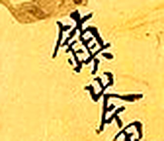 |
| (0.37, 0.30) | `柳等川面` | 유등천면 | 상 | Claude | 2026-09-30 | 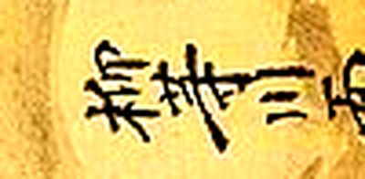 |
| (0.40, 0.17) | `山內面 高水亭里 乃興倉 距邑七十里` | 내흥창 주기 — **고개가 아님** | 상 | Claude | 2026-09-30 |  |
| (0.42, 0.28) | `□內面` | **미판독** — 첫 글자 | 하 | Claude | 2026-09-30 | 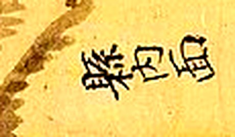 |
| (0.35, 0.27) | `柳等川面 太平倉 距邑五十里`〔?〕 | 태평창 주기 | 중 | Claude | 2026-09-30 | 축소본에서 읽음 — 재확인 필요 |

중간 배율 조각 둘이 함께 있습니다 — [내흥창 언저리](crops/KYKH002_0000_0026_x0.35_y0.16_w0.06_h0.05.jpg) · [`□谷面` 언저리](crops/KYKH002_0000_0026_x0.61_y0.19_w0.06_h0.05.jpg).

**이로써 6.4 가 필요로 하던 자리를 1872년 도엽 쪽에서는 닫았습니다** — 닭재는 여기서
나지 않습니다. 전문은 [`1872-공주목지도-판독.md`](1872-공주목지도-판독.md) 에 있습니다.

### 12.4 「충청도 옥천군지도」 — `馬達峙` 와 **회덕 계족산 봉수** (2026-09-30)

**전문 기록: [`1872-옥천군지도-판독.md`](1872-옥천군지도-판독.md)**

| 위치 | 표기 | 읽기 | 확신 | 판독자 | 날짜 | 근거 |
|---|---|---|---|---|---|---|
| (0.27, 0.17) | 馬達峙 | 마달치 | 상 | Claude | 2026-09-02 | <br>[넓게](crops/KYKH002_0000_0024_x0.24_y0.15_w0.07_h0.02.jpg) |

세 글자가 또렷하고 **홍선 도로가 이 고개를 넘어갑니다.** 이 도엽은 북쪽이 위이고, 자리는
**북서부 郡北面 일원** — 회덕(대전) 방면 경계입니다. 마달령이 옛 지도에서 확인된 첫 건이므로
**3 로 올렸고, 6.1 에도 새 증거로 붙습니다.**

**2026-09-30 에 방위를 도엽 안에서 확정했습니다** — 네 변에 방위 대자 `北`(위)·`南`(아래)·
`東`(오른쪽)·`西`(왼쪽)가 있습니다. **표준 방위**입니다.
[북서부를 넓게](crops/KYKH002_0000_0024_x0.14_y0.1_w0.28_h0.18.jpg) 보면 `馬達峙` 와 봉수대가 한 화면에 들어옵니다.

#### 2026-09-30 — `馬達峙` 바로 아래에 **회덕 계족산 봉수**가 적혀 있습니다

`馬達峙` 남쪽(0.30, 0.20~0.23)에 봉수대 그림과 주기가 있습니다.

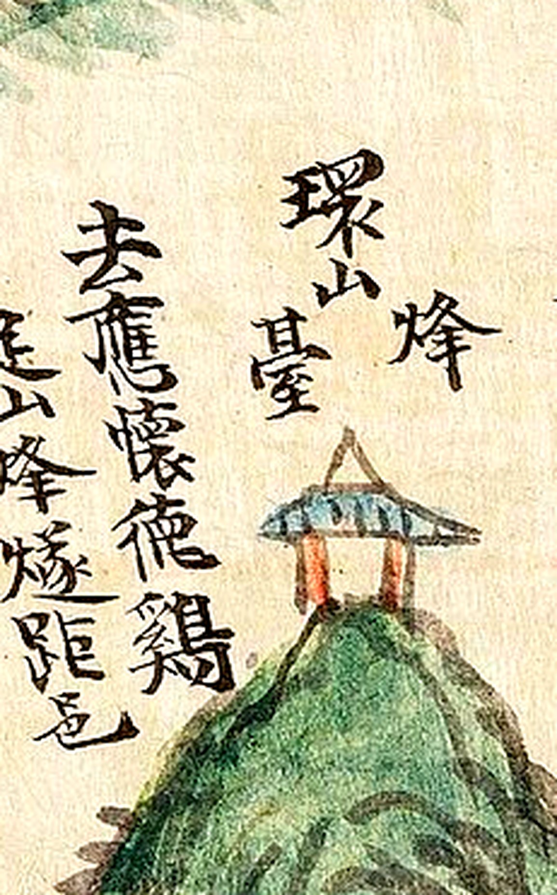

> `環山烽臺`
> `來應 月伊峯烽燧`
> **`去應 懷德 鷄足山烽燧`**
> `距邑十五里`

**옥천 환산(環山, 고리산) 봉수가 북쪽으로 신호를 보내는 곳이 「회덕 계족산 봉수」입니다.**
`來應`(받는 곳)은 월이봉, `去應`(보내는 곳)은 회덕 계족산 — **봉수 노선이 대전으로
이어집니다.**

> **2026-10-01 전사 정정.** 3,840 px 사본으로 다시 읽어 `環山 其臺 烽` → **`環山烽臺`**,
> `未應` → **`來應`** 으로 바로잡습니다. 2026-09-30 판독은 저해상 사본이었습니다.

| 위치 | 표기 | 읽기 | 확신 | 판독자 | 날짜 | 근거 |
|---|---|---|---|---|---|---|
| (0.30, 0.21) | **`去應 懷德 鷄足山烽燧 距邑十五里`** | 회덕 계족산 봉수 | **상** | Claude | 2026-09-30 |  |

**이것이 6.4 에 두 가지를 줍니다.**

1. **회덕 땅에 `鷄`(닭) 계열 지명이 실제로 있었다는 1872년 기록**입니다 — 계족산.
   닭재(`鷄峴`)와 같은 곳은 아니지만(계족산은 회덕 읍치 동쪽, 닭재는 남쪽),
   **「닭」이 이 고장 지명에 쓰이는 글자**라는 것이 도엽으로 섭니다.
2. **`鷄` 의 기준 글자가 생겼습니다.** 같은 계열(1872년 지방지도)·같은 시기·비슷한
   필체로 쓰인 `鷄`(奚+**鳥**)를 확대본으로 확보했으므로, **12.5 의 미판독 세 글자와
   자형을 맞춰 볼 수 있습니다.** 다만 진산 도엽 쪽은 3,840 px 축소본에서 이미 해상도
   한계라 지금 견주면 결론이 나지 않습니다 — **원본이 필요합니다.**

**`鷄` 는 `隹` 가 아니라 `鳥` 를 씁니다**(奚+鳥). 해동지도 회덕현의 `雞峙` 는 `奚`+`隹`
였으므로(11.1), **같은 이름이 도엽마다 `雞`/`鷄` 로 갈립니다** — 2장 표기 원칙에 걸리는
관찰입니다.

#### 2026-10-01 — 전면 훑기. **글자 둘이 풀리고 봉수 노선이 다섯 고리가 됩니다**

**전문 기록: [`1872-옥천군지도-판독.md`](1872-옥천군지도-판독.md)**

이 도엽은 **8,434 × 11,625 px** 입니다. 3,840 px 사본으로 전면을 훑었습니다.
지금까지 북서부(마달치)만 보고 있었습니다.

##### 봉수 주기 둘이 전문으로 남아 있습니다

| | |
|---|---|
| **`環山烽臺`** | `來應 月伊峯烽燧` · `去應 懷德 鷄足山烽燧` · `距邑十五里` |
| **`月伊峯烽臺`** | `來應 永同 朴達羅山烽燧` · `去應 環山烽燧` · `距邑十五里` |

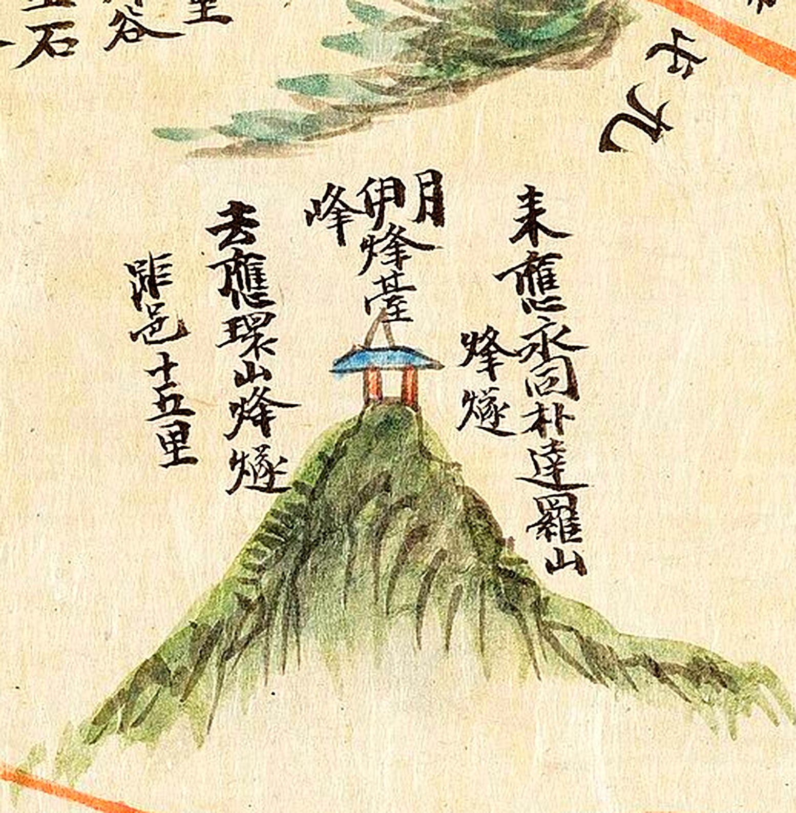

*`月伊峯烽臺` 와 그 주기. 봉수대 그림이 봉우리 위에 얹혀 있습니다.*

**노선이 다섯 고리가 됩니다** — 13.3 의 세 점이 둘 늘었습니다.

```
永同 朴達羅山 ──→ 옥천 月伊峯 ──→ 옥천 環山 ──→ 회덕 鷄足山 ──→ 문의 夜味山(=所伊山)
└──────── 이 도엽 한 장에 가운데 세 고리가 다 있습니다 ────────┘   (1872 회덕현지도 기문)
```

##### 글자 둘이 풀렸습니다 — 「또렷한 도엽 하나」의 세 번째 사례

**① `烽臺`.** 해동지도 옥천군(둘)·문의현(하나)의 봉수 표시 두 글자를 `烽□` 로 두고
있었습니다(11.6.1 · 11.6.2 · 7장). 아래 글자가 `金`·`全` 처럼 보여 `燧` 로도 `臺` 로도
읽히지 않았습니다. **이 도엽이 같은 자리(環山)에 또렷한 해서로 `烽臺` 를 적었습니다.**
7장 미판독에서 내립니다.

덤으로 **쓰임이 갈린다**는 것도 보입니다 — 그림 라벨은 `烽臺`, 주기 안에서 남의 고을
것을 가리킬 때는 `烽燧`.

**② `月伊`.** 해동지도 옥천군 둘째 봉수 산 `月□`(1차 판독 `月呑`)이 **`月伊峯`** 으로
확정됐습니다.

> `隘口`(2026-09-30) · `晚目峙`(2026-09-30) 에 이어 **세 번째**입니다.
> **흐린 글자는 더 키우지 말고, 같은 말을 또렷하게 쓴 다른 도엽을 찾습니다.**

##### `九也峙` — 해동지도와 **같은 자리, 120년을 건너**

| 위치 | 표기 | 읽기 | 확신 | 판독자 | 날짜 |
|---|---|---|---|---|---|
| **(0.720, 0.595)** | **`九也峙`** | 구야치 | **상** | Claude | 2026-10-01 |

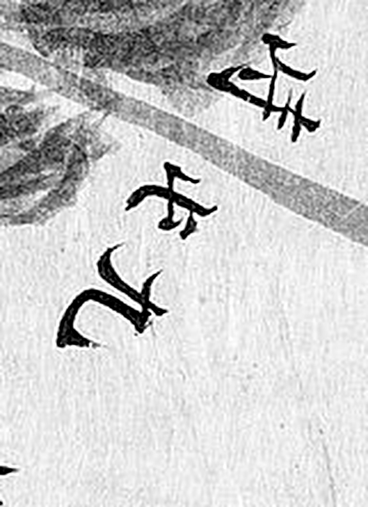

길을 따라 왼쪽 아래에서 오른쪽 위로 `九`·`也`·`峙` 가 비스듬히 적혀 있습니다.
읍치(0.44, 0.40) **남동쪽** — **해동지도 옥천군의 `九也峙`(0.395, 0.541)와 같은
이름·같은 방향**입니다(11.6.1). 같은 날 해동지도에서 먼저 찾고 여기서 확인했습니다.

##### `問峙` — 북동쪽, `金積山` 곁

| 위치 | 표기 | 읽기 | 확신 | 판독자 | 날짜 |
|---|---|---|---|---|---|
| (0.744, 0.148) | **`問峙`** | 문치 | **중** (`問`/`門`) | Claude | 2026-10-01 |

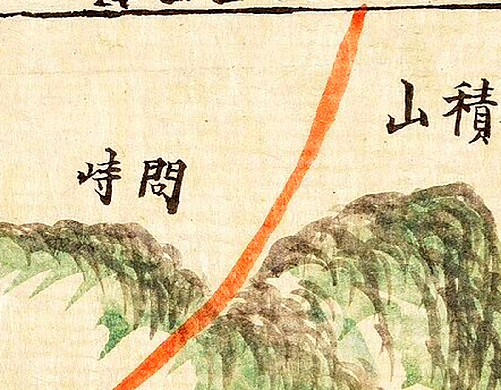

붉은 길이 고개 동쪽을 지나 위 테두리를 넘어갑니다 — 보은·회인 방면이고 대전 쪽이
아닙니다. 4.4 에 올립니다.

##### 면별 주기에 **리 이름이 다 적혀 있습니다**

면마다 노란 패와 함께 긴 주기가 붙어 있고, **그 면에 딸린 리 이름을 모두 적고 호구까지**
달았습니다. 꼴은 `自官門○距○○里 各里 ○○里 ○○洞 … 戶 ○○○ 口 ○○○○`.

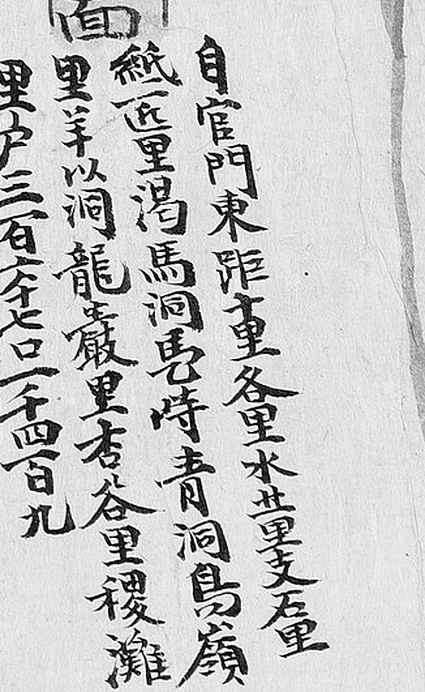

*`郡東面` 주기. 리 이름 열몇이 이어집니다.*

**지명 조사의 본 광맥입니다** — 한 장에 리 이름 수백 건. 그 가운데 **고개 글자를 쓴
리 이름**이 있습니다: `郡東面` 의 **`□峙`**(`渴馬洞` 다음)와 **`鳥嶺`**.
**그림 라벨이 아니라 리 이름**이므로 3장·4.4 와 갈라 적습니다 — 고개가 마을 이름이
된 예입니다.

면 이름도 한 가지 갈립니다 — **해동지도의 `利內`·`利南` 이 1872년에는 `伊內`·`伊南`**
입니다. 2장 표기 원칙에 걸리는 관찰입니다.

### 12.5 「전라도 진산군지도」 — 방위 확정 · 경계 길 주기 (2026-09-30 · 2026-10-01)

**전문 기록: [`1872-진산군지도-판독.md`](1872-진산군지도-판독.md)**

| 위치 | 표기 | 읽기 | 확신 | 판독자 | 날짜 | 근거 |
|---|---|---|---|---|---|---|
| (0.66–0.87, 0.34–0.40) | □程東西至忠淸道連山界十里 | — | 상 | 연구회 | 2026-09-03 |  |
| **(0.71, 0.39)** | **□** | **미판독** — `無`(없을 무)의 이체자로 보임 | **하** | 연구회 | 2026-09-03 |  |

중간 배율 조각 둘: [주기 전체](crops/KYKH003_0000_0059_x0.67_y0.34_w0.20_h0.07.jpg) · [뒷부분](crops/KYKH003_0000_0059_x0.72_y0.34_w0.09_h0.04.jpg).

**2026-09-02 에 이 주기를 `懷德`·`峙`·`大路`·`○十里` 로 읽었습니다. 틀렸습니다.**
판독자 확인 결과 이 주기는 **`忠淸道連山界十里`** 이고, **`懷德` 도 `峙` 도 없습니다.**
`連山` 을 `懷德` 으로 본 것입니다.

첫 글자는 **`無`(없을 무)의 이체자로 보입니다**(판독자, 2026-09-03) — 다만 `無程…` 이
무엇을 뜻하는지는 풀지 못했습니다. 어순은 **`西至 忠淸道連山界 十里`**(서쪽으로 충청도 연산 경계까지
10리)로 끊어 읽는 것이 자연스러워 보입니다 — 진산군 서쪽이 연산이므로 내용도 맞습니다.

**따라오는 정정 셋.**

1. **6.4 는 원래대로 돌아갑니다.** 「1872년 진산군지도는 회덕을 적는다」고 6.4 에 덧붙였던
   대목을 지웠습니다. **1872년 진산 도엽에도 회덕이 없습니다** — 해동지도 진산군의 침묵
   (11.2)이 120년 뒤에도 이어집니다. 6.4 의 논거는 **약해지지 않고 강해졌습니다.**
2. **`鷄峴` 은 이 도엽에서 여전히 확인되지 않았습니다.** 있다고 볼 근거가 하나 줄었습니다.
3. **이 가장자리가 북쪽인지도 확인되지 않았습니다.** 처음에는 이 자리를 "북쪽 경계"라 적었으나,
   나온 것이 `連山界`(진산 서쪽)입니다. **나는 진산군지도의 방위를 확인하지 않았습니다** —
   회덕 위=東, 진잠 위=西, 공주목 위=南 이었으니 진산도 확인해야 합니다. **다음 차례입니다.**

**교훈.** 이 오독은 확대만으로 잡히지 않았습니다. `連山界` 라는 정답을 듣고 나서야
`懷德` 이 아닌 것이 보입니다. **경계 고을 이름은 그 고을의 사지(四至)와 맞춰 검산해야
합니다** — 진산 서쪽이 연산이라는 것만 먼저 확인했다면 `懷德` 은 애초에 후보가 아니었습니다.

#### 2026-09-30 — 방위를 확정하고, `鷄峴` 이 있을 자리를 찾았습니다

커먼즈 축소본(3,840 px, 원본 8,549 px 의 45%)을 받아 도엽을 훑었습니다.
**전문은 [`1872-진산군지도-판독.md`](1872-진산군지도-판독.md) 에 있습니다.**

**첫째, 방위가 확정됐습니다 — 도엽 안에 방위 대자가 있었습니다.**

| 위치 | 대자 |
|---|---|
| (0.54, 0.31) | **`西`** |
| (0.13, 0.54) | **`南`** |

**위=西 · 오른쪽=北 · 아래=東 · 왼쪽=南.** 둘 다 상하가 반전되어 있어 그동안 눈에
띄지 않았습니다. 이로써 **1872년 지방지도 네 도엽의 방위가 다 다릅니다** — 회덕 위=東,
진잠 위=西, 공주목 위=南, 진산 위=西. 12.5 의 「방위 미확인」이 닫힙니다.

**그리고 이것이 `連山界` 판독을 검산해 줍니다.** 그 주기는 오른쪽 위 = **북서**에 있고
연산은 진산의 북서입니다. 앞뒤가 맞습니다.

**둘째, 기문에 고개가 둘 있습니다 — 둘 다 고적 조입니다.**

> `珎同古縣基 在郡西南 **梨峙** 南五里`
> `**炭峙** 百濟時置邑於**兩峴間** 以助關防 備羅兵 麗朝廢之…`

**`炭峙` 주기가 「백제 때 두 고개 사이에 읍을 두어 관방을 돕고 신라 병사를 대비했다」고
적습니다.** 진산이 예부터 고개로 막힌 길목이었다는 것을 도엽 스스로 말합니다 —
6.4 가 닭재를 「회덕에서 진산으로 넘는 고개」로 보는 것과 결이 같습니다.

**셋째, `鷄峴` 이 있다면 있을 자리를 찾았습니다. 다만 글자는 읽지 못했습니다.**

| 위치 | 표기 | 확신 |
|---|---|---|
| **(0.74, 0.50)** | `□□□` + 아랫줄 `三十里` | **하 — 미판독** |

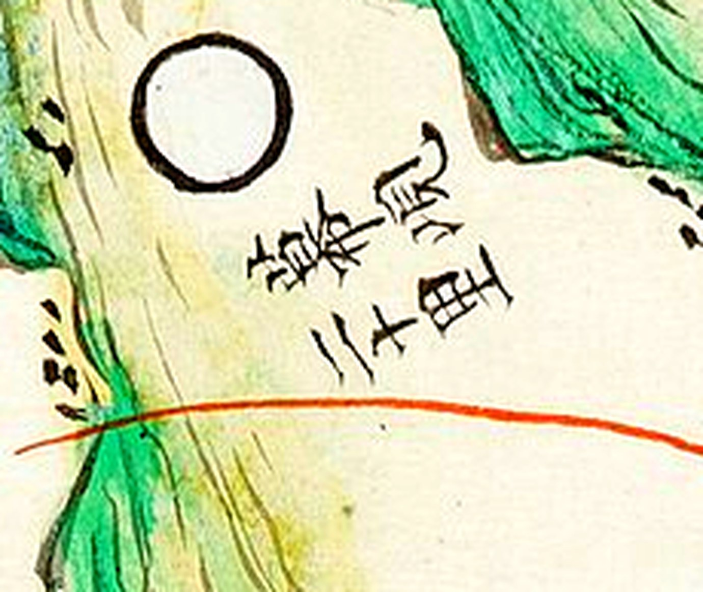

자리가 셋을 갖췄습니다 —

1. **오른쪽(x 0.74) = 북쪽 가장자리.** 그 너머가 **공주목 산내면**입니다
2. 바로 곁이 **`北面`**(0.65, 0.56, `初境自官門十里`)입니다
3. 아랫줄이 **`三十里`** — 해동지도 진산군 사지의 **`北距 公山界 三十里`** 와 같은 값입니다

**그래도 `鷄峴` 이라고 적지 않습니다.** 이 조사에서 `鷄` 로 잘못 읽은 일이 두 번 있었습니다
(11.2 의 `□峙`를 2026-09-02 에 새 머리로 본 일, 그리고 12.5 자체의 `懷德` 오독).
**세 글자가 갈리면 6.4 가 갈립니다** — 원본(8,549 px)을 보실 수 있는 분의 판독을 기다립니다.

**넷째, `方峴`(0.64, 0.41)을 새로 채록했습니다** — 해동지도의 `方古峙`(11.2)와 같은 고개로
보입니다. 두 계열이 `古` 한 자와 `峙`/`峴` 만 달리 적었습니다.

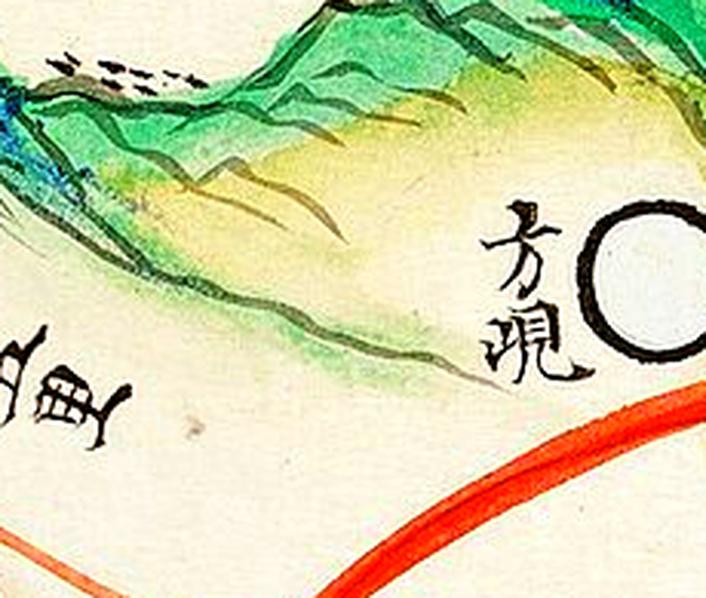

그 밖에 `趙重峯祠宇`(조헌) · `宋尤庵 舊墟`(송시열) · `馬田面` · `南二面` · `北面` ·
`太古寺` · `水心臺` 등을 읽었습니다.

#### 2026-10-01 — 경계 길 주기가 방위마다 하나씩 있습니다

**이 도엽은 고을 밖으로 나가는 길마다 긴 주기를 답니다.** 빈 들판에 세로로, 또는
가장자리를 향해 **상하 반전**된 가로로 적혀 있어 돌려 보지 않으면 보이지 않습니다.
2026-09-03 의 서쪽 주기가 이 계열의 첫 건이었고, 이날 둘을 더 찾았습니다.

| 방위 | 주기 | 확신 |
|---|---|---|
| **동** | **`思睦峙東至忠淸道沃川界四十里`** | **상** |
| **서북** | **`馬項西北至忠淸道公州界`**`□□里` + 따로 **`夾路`** | **중상** |
| 서 | `□程東西至忠淸道連山界十里` | 상 (2026-09-03) |
| **서남** | **`梨峙西至全州界十里`** + 곁에 **`大路`** | **상** |

**같은 전라도인 전주에는 도 이름을 붙이지 않습니다**(`全州界`) — 충청도 셋만
`忠淸道 ○○界` 입니다. **서남 주기가 오늘의 기문 읽기를 받쳐 줍니다** —
『해동지도』 기문이 `梨峙 陰峻 十里 全州界` 라 적은 그 **`十里`** 를, 120년 뒤 도엽이
**`梨峙西至全州界十里`** 라고 풀어서 적었습니다(11.2 「주기의 서식」).

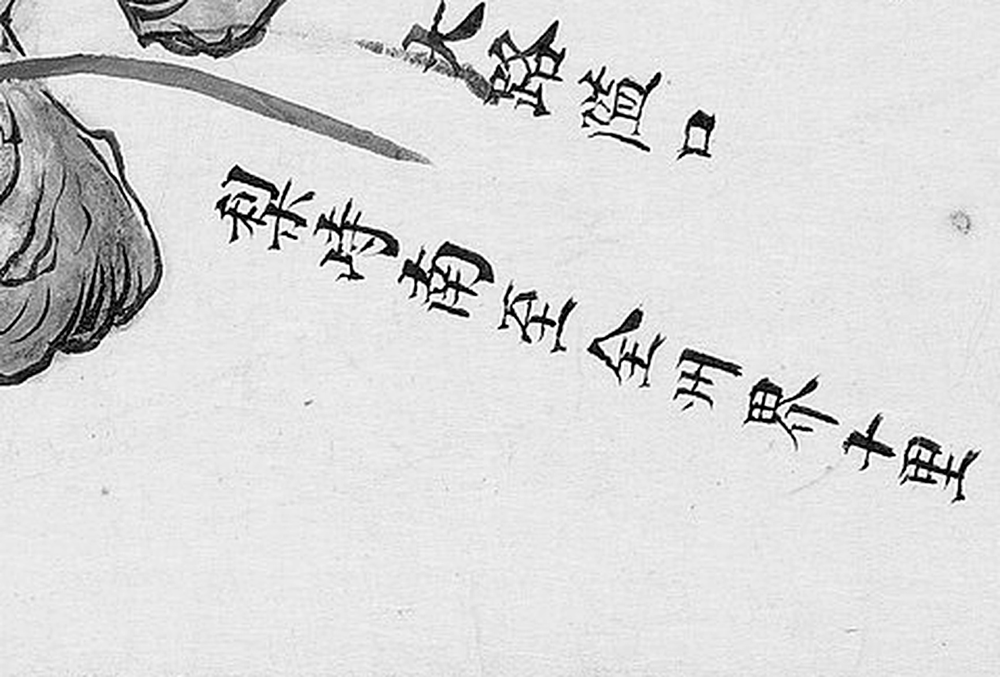

**산을 적는 서식도 따로 있습니다** — `○○ 自○○落脉 在郡○ ○里`.
`仁大峯 自錦山進樂山落脉 在郡南二十里` · `達理峯 自仁大峯落脉 在郡南十里` ·
`西臺山 自仁大峯落脉`. **산경표식**이고, 실제 지형이라기보다 맥을 따지는 틀입니다 —
`西臺山` 은 진산 동북인데도 남쪽 `仁大峯` 에서 맥을 받았다고 적습니다.
**글자를 돌린 각도도 방향마다 다릅니다** — 서북·서남 180°, 남쪽 산 주기 90°,
동쪽은 돌아 있지 않습니다.

 

*왼쪽 `思睦峙東至忠淸道沃川界四十里`(0.60~0.62, 0.83~0.91), 오른쪽 `馬項西北至忠淸道公州界…`(0.77~0.89, 0.476~0.50).*

**셋 다 상대를 `忠淸道 ○○界` 로 적습니다** — 진산이 전라도였기 때문입니다.

**① `思睦峙` 가 『해동지도』 기문의 `新目峙` 입니다.** 동쪽 옥천 길, 35리·40리.
`目`·`睦` 이 둘 다 우리말 **「목」**이고, 그림의 동북 `□峙`(0.71, 0.28)가 그 자리입니다
(11.2 ③ · 6.7).

**② `馬項`(말목)이 북쪽 경계 길입니다.** `項` 도 「목」입니다. 이 도엽은 한 고을 안에서
「목」을 세 글자로 적습니다 — `思睦峙`(睦) · `馬項`(項) · `睦洞五里`(睦).
해동지도의 `目` 까지 넣으면 **넉 자**입니다(2장).

**③ 6.4 가 한 겹 두터워집니다.** 1872년 도엽도 북쪽을 **공주**라 적습니다. 그것도
사지가 아니라 **길 주기**로, 곧 「실제로 그리로 다녔다」는 말로 적습니다.
`懷德` 은 이 도엽 어디에도 없습니다.

#### 2026-10-01 — (0.74, 0.50)은 고개 주기가 아니라 **리(里) 패**였습니다


9배로 키워 보니 **바로 위에 리를 나타내는 동그라미가 있고**, 글자는 **윗줄 세 자 +
아랫줄 거리** 의 짜임입니다. 이 도엽이 리를 적는 꼴 그대로입니다
(`睦洞五里` · `寒溪里` · `水心臺 十里` …).

- 아랫줄은 **`二十里`** 또는 `三十里` — 획이 둘로 보여 2026-09-30 의 `三十里` 를
  확정으로 두지 않습니다
- 윗줄 세 자는 **여전히 미판독**입니다
- 거리는 **관문에서 그 리까지**입니다. 사지의 `北距公山界三十里` 와 맞춰 읽을 값이
  아니었습니다 — 2026-09-30 의 논거 3 이 무너집니다

**그러므로 이 자리를 `鷄峴` 후보로 보던 근거가 약해졌습니다.** 리 이름에 고개 글자가
들어갈 수는 있으므로 「아니다」라고 하지는 않습니다. 다만 **북쪽 경계 길의 주기는 바로
서쪽의 `馬項` 쪽**에 있고, 그쪽은 공주를 적습니다.

그 밖에 동쪽 가장자리에서 **`西臺山自仁大峯落脉`**(서대산은 인대봉에서 맥이 떨어진다)을
읽었습니다.

### 12.6 「전라도 금산군지도」 — 西二面의 고개와 마을 (2026-09-03)

**전문 기록: [`1872-금산군지도-판독.md`](1872-금산군지도-판독.md)**

| 위치 | 표기 | 읽기 | 확신 | 판독자 | 날짜 | 근거 |
|---|---|---|---|---|---|---|
| (0.39, 0.30) | **薪峙** | 신치 | 상 | Claude | 2026-09-03 |  |
| (0.41, 0.32) | 隘口 | 애구 | 상 | Claude | 2026-09-03 | [넓게](crops/KYKH003_0000_0047_x0.26_y0.24_w0.22_h0.12.jpg) |
| (0.31, 0.32) | 上薪谷 | 상신곡 | 상 | Claude | 2026-09-03 | 같음 |
| (0.35, 0.33) | 下薪谷 | 하신곡 | 상 | Claude | 2026-09-03 | 같음 |
| (0.39, 0.32) | 大岩里 二十里 | 대암리 | 상 | Claude | 2026-09-03 | 같음 |
| (0.44, 0.34) | **尾余坪 二十里** | 미여평 | 중 → **상**(2026-10-01) | Claude | 2026-09-03 | 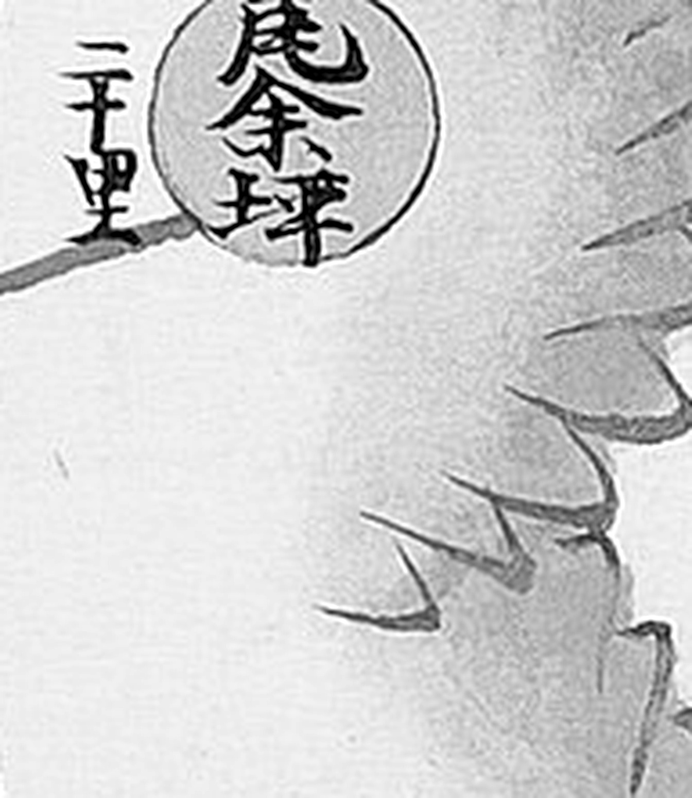 |
| (0.29, 0.35) | 馬首里 | 마수리 | 상 | Claude | 2026-09-03 | 같음 |

**2026-09-02 에 적은 좌표가 틀렸습니다.** `薪峙` 를 (0.32, 0.26), `隘口` 를 (0.33, 0.28)로
적었는데 실제는 위 표와 같습니다 — **x 로 0.07, y 로 0.04 만큼 어긋나 있었습니다.**
근거 크롭은 맞게 잘라 두었으나 **그 안에서의 위치를 도엽 좌표로 환산할 때 틀렸습니다.**
그 좌표로 다시 자르면 빈 화면이 나옵니다(2026-09-03 확인).

**`石峴里` 철회를 2026-09-30 에 되돌립니다 — 있습니다.** 2026-09-03 에 (0.28, 0.31)에
`石峴里` 가 없다며 철회했는데, **그 자리에 없었을 뿐 도엽에는 있습니다.**
자리는 **(0.26, 0.34)** 이고, 흰 동그라미 안에 세 글자가 또렷합니다.


`石`(厂+口) · `峴`(山+見) · `里` — 붉은 길이 이 마을로 이어집니다. **확신 `상`.**

> **철회를 철회한 첫 사례입니다.** 2026-09-03 의 철회는 「좌표를 고쳤더니 그 자리에
> 다른 것이 있더라」였는데, **고친 좌표도 틀렸습니다.** 없다고 말하려면 **그 자리**가
> 아니라 **도엽 전체**를 봐야 한다는 것이 이번에 드러났습니다.

**`石峴` 은 고개 이름이 마을 이름으로 남은 예입니다.** 대전 쪽에서도 같은 일이 있었는지
(예: 질현 → 질티고개) 견줄 거리가 됩니다.

중간 배율 조각: [`薪峙` 언저리](crops/KYKH003_0000_0047_x0.28_y0.23_w0.09_h0.05.jpg).

**`薪` 이 이 일대에 몰려 있습니다** — 고개 `薪峙` 와 그 아래 마을 `上薪谷`·`下薪谷`.
첫 글자의 풀초(`艹`)가 뚜렷하고, 같은 계열 진잠 도엽의 `薪峴里`(12.2)와 같은 글자입니다.
**확신을 `상` 으로 둡니다.**

`隘口` 는 이 도엽 기문의 「隘口四處」와 이어집니다. 붉은 도로가 `薪峙` 를 넘어 `隘口` 로
내려갑니다 — **고개와 관문이 한 축에 있습니다.**

**2026-09-30 — 11.4 의 `□峙` 는 `薪峙` 로 확정됐습니다.** 해동지도 금산군 도엽 전체를
훑어 `松峙`(남부)와 `薪峙`(북부)가 따로 있는 것을 확인했습니다. 곧 **이 도엽의 `薪峙` 와
해동지도의 `薪峙` 는 같은 고개**이고, 두 계열이 120년을 사이에 두고 같은 이름을
적었습니다. 11.2 의 `新峙`(만인산 아래)와는 여전히 자리가 다릅니다 — 6.4 의 주의 그대로
**소리가 통해도 자리가 다를 수 있습니다.**

**2026-09-30 재확인.** 북부를 다시 훑어 위 표의 좌표와 판독이 모두 맞는 것을 확인하고,
리 이름 몇을 보탰습니다 — `陽地里 十五里` · `陰地里 十五里` · `栗谷里` · `杻峯`〔?〕 ·
`西二面 自官十里` · `郡北面 自官十五里` · `錦城山`(도엽 좌상단).

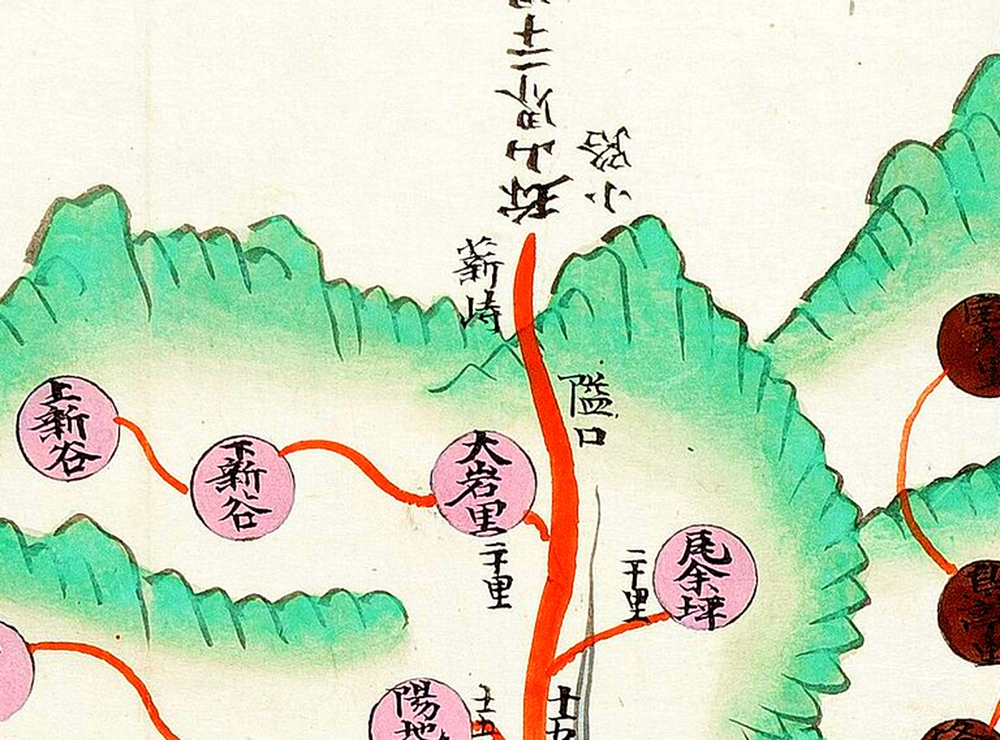


---

### 12.7 접경 도엽 착수 — 문의현·연산현 (2026-09-30)

《1872년 지방지도》 쪽 접경 도엽은 참고로만 걸려 있었습니다. **3,840 px 축소본을 받아
착수했습니다.** 1872년 계열은 원본이 50~80 MB 라 이 환경에서 못 받지만,
축소본은 원본의 45% 내외라 큰 글자는 읽힙니다.

#### 12.7.1 「충청도 문의현지도」 — **`漏峴`**

**전문 기록: [`1872-문의현지도-판독.md`](1872-문의현지도-판독.md)**

| | |
|---|---|
| 자료번호 | `KYKH002_0000_0038` (3,840 × 5,524 축소본) |
| 짜임 | 제목 `文義縣地圖` 가 위에, 기문이 왼쪽 세로, 그림이 가운데 |
| 사지 | `東距懷仁界七里` · `西距燕岐界三十里` · **`南距懷德界十里`** · `北距淸州界十里` (확신 중) |
| 도로 | `北距京城三百三十里` · `西距監營九十里` · `南距兵營三百三十里` |
| 그 밖 | `陵寢無 橋梁無 閒防隘口無` · [기문 전체](crops/KYKH002_0000_0038_x0.13_y0.145_w0.1_h0.2.jpg) |

| 위치 | 표기 | 읽기 | 확신 | 판독자 | 날짜 | 근거 |
|---|---|---|---|---|---|---|
| **(0.32, 0.38)** | **`漏峴`** | 누현 | **상** | Claude | 2026-09-30 |  |

`漏`(氵+屚)·`峴`(山+見) 두 글자가 또렷하고 **붉은 길이 이 고개를 지납니다.**
곁에 `自官…里` 주기가 붙습니다.

**~~2026-09-30 후속 — 이 도엽도 위가 西입니다.~~** 제목 `文義縣地圖` 아래 금강 곁의
주기를 `燕岐界 距三十里` 로 읽고 **위 = 西** 라 했습니다. **2026-10-01 에 철회합니다.**

##### **방위 정정 — 위는 西가 아니라 東입니다** (2026-10-01)

네 변의 경계 주기를 모두 찾았습니다. **셋이 사지와 거리까지 그대로 맞습니다.**

| 자리 | 주기 | 어느 쪽 | 확신 | 크롭 |
|---|---|---|---|---|
| **왼쪽**(0.20, 0.73) | **`淸州界十里`** | 청주 = **北** | **상** | 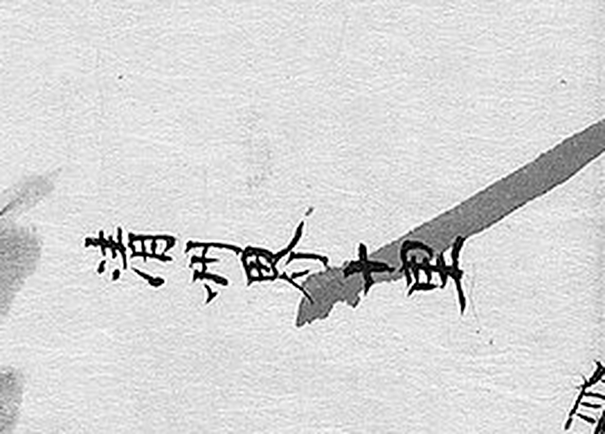 |
| **오른쪽**(0.84, 0.38) | **`懷德界十里`** | 회덕 = **南** | **상** | 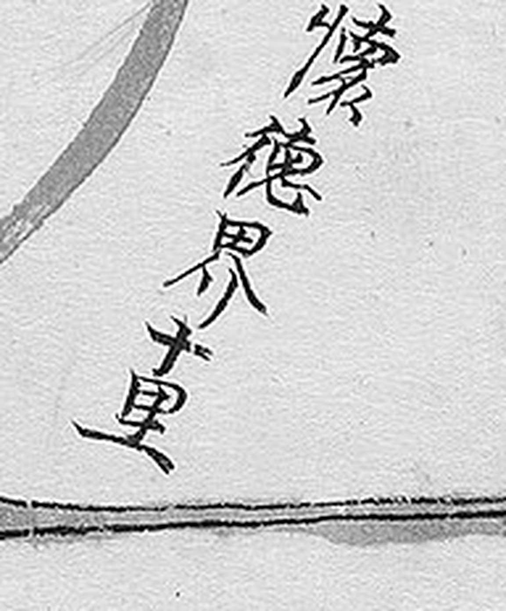 |
| **아래**(0.84, 0.88) | **`燕岐界三十里`** | 연기 = **西** | **상** | 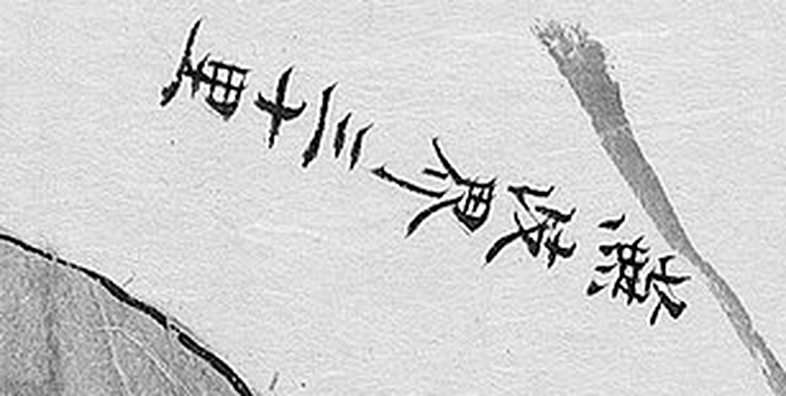 |
| 위(0.52, 0.18) | `燕`〔?〕 … `三` `十` `里` — **미판독** | — | 하 | 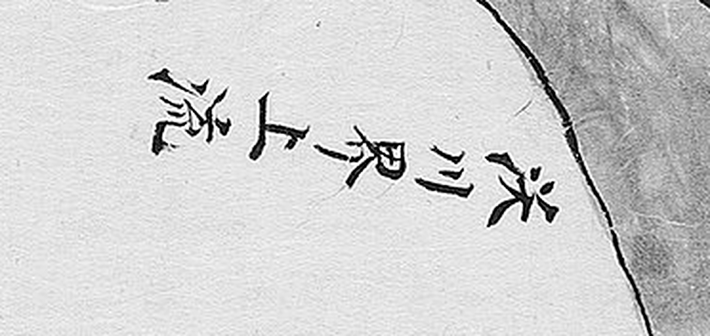 |

> **위 = 東 · 아래 = 西 · 왼쪽 = 北 · 오른쪽 = 南.** 표준에서 **시계 반대로 90°** 돌린 틀입니다.

**무엇을 잘못 봤는가.** 위 가장자리 주기를 `燕岐界 距三十里` 로 읽었는데, **같은 꼴의
주기가 아래 가장자리에 있고 그쪽이 훨씬 또렷합니다.** 위쪽 것은 초서여서 지금도 못
읽습니다 — **읽히는 쪽을 버리고 안 읽히는 쪽에 기대어 방위를 정한 것**이 잘못이었습니다.
2026-09-30 에 「면 상자 배치가 어긋나 보인다」고 단서를 단 것이 신호였는데 따라가지
않았습니다.

**해동지도 문의현(위=西, 11.6.2)과 방위가 다릅니다** — 「같은 고을을 120년 사이에 같은
방향으로 그렸다」도 함께 철회합니다.

**`懷德界十里` 는 이 도엽의 첫 「그림 주기」 회덕 기록입니다.** 그동안은 기문의 사지
한 줄뿐이었습니다. **4.2(이웃이 서로를 적는 짝)에 보탭니다** — 문의는 기문과 그림
양쪽에서 회덕을 적습니다.

**`弘峙`(해동지도)와 `漏峴`(이 도엽)은 같은 고개로 보기 어렵습니다.** 두 계열의 방위가
같으므로 읍치 기준 방향을 견줄 수 있는데 —

| | 읍치 | 고개 | 읍치에서 본 방향 |
|---|---|---|---|
| 해동지도 `弘峙` | (0.53, 0.51) | (0.45, 0.55) | **남동** |
| 1872 `漏峴` | (0.46, 0.57)〔개략〕 | (0.32, 0.38) | **남서** |

**방향이 갈립니다.** 다만 1872년 쪽 읍치 좌표가 개략값이고 글자도 다르므로
(`弘`/`漏`), **두 고개로 보되 단정하지 않습니다.** 문의 도엽을 원본으로 보면 바로
갈립니다.

> **2026-10-01 — 풀렸습니다.** 같은 날 찾은 **문의현지도 둘째본**(`KYKH002_0000_0002`,
> 12.7.7)이 `漏峴` 옆에 **`自官東距十里`** 라 적었습니다. 사지의 `東距懷仁界十里` 와
> 같은 값입니다 — 곧 **`漏峴` 은 동쪽 회인 길의 고개**이고, 읍치와 `懷德界` 사이에
> 있는 **`弘峙` 는 남쪽 회덕 길의 고개**입니다. **두 고개입니다.**
>
> 좌표 견주기로는 「단정하지 않는다」에 머물렀던 것이, **거리 주기 한 줄로
> 갈렸습니다.** 4.1 의 방위 확인보다 **주기가 먼저**일 때가 있습니다.

연혁도 함께 읽었습니다 — `縣本百濟一年山郡 新羅改燕山郡 高麗屬淸州 明宗二年置監務 …
高宗四十六年 以衛社功臣朴希實之鄕 陞爲縣令 改文義`.
산 주기가 거리를 갖춘 형태입니다 — `大龍山 自邑東距十里` · `龍穴 自邑東距三里` ·
`王頭峯 自邑東距三里` · `月落峯 自邑南距五里`.

#### 12.7.2 「충청도 연산현지도」 — 진산계 주기

**전문 기록: [`1872-연산현지도-판독.md`](1872-연산현지도-판독.md)**

| | |
|---|---|
| 자료번호 | `KYKH002_0000_0019` (3,840 × 5,066 축소본) |
| 도로 주기 | `全羅道全州界二十里` · `京城三百七十里` · `監營七十里` · `兵營二百二十里` · `水營一百六十里` · `恩津界十五里` |
| 위 가장자리 | **`全羅道珎山界三十里`** (상하 반전) |

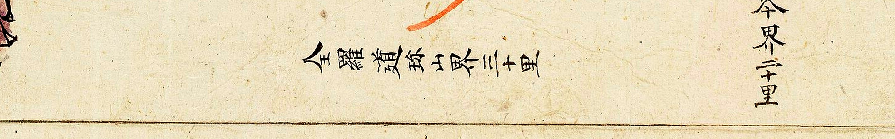

면 이름을 **빨간 네모**에 넣습니다 — `伐谷面` `豆麻面` `食汗面`〔?〕 `城東面` `赤寺谷面`
`外城面` `夫人處面` `芹渚面`〔?〕. 산은 `鷄龍山` `連天峯` `大芚山` `天護山`〔?〕,
절은 `新興寺` `靈隱寺` `大興菴`.

**`鎭岑縣` 을 찾았습니다** — 위 가장자리 왼쪽 **(0.17, 0.10)**, 역시 상하 반전입니다.

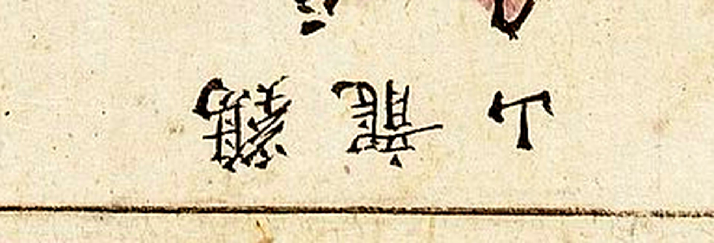

`岑`·`縣` 두 글자가 또렷하고, 인근에 다른 `岑縣` 이 없으므로 **`鎭岑縣`** 으로 읽습니다.
**해동지도 연산현의 `鎭岑界` 두 곳(11.6.4)이 1872년 도엽에서도 이어집니다** — 진잠과
연산은 두 계열 모두에서 서로를 적습니다(4.2).

> **2026-10-01 단서.** 넓게 다시 자르니 **첫 글자는 획이 토막만 남아 있습니다.**
> `鎭` 은 읽은 것이 아니라 미루어 넣은 것이고, 확신 `상` 은 자형이 아니라
> 「둘레에 `岑縣` 이 진잠뿐」이라는 데서 나옵니다(전문 문서).

##### **`熊峙` — 2차에서 고개가 나왔습니다** (2026-10-01)

| 위치 | 표기 | 읽기 | 확신 | 크롭 |
|---|---|---|---|---|
| **(0.645, 0.378)** | **`熊峙`** | 웅치 · **곰재** | **상** |  |

2026-09-30 에 「대전 쪽에는 고개 표기가 없다」고 적고 도엽 안쪽의 `雲住峙`〔?〕·
`城隍峙`〔?〕 를 확인하지 못한 채 두었습니다. 2.0배로 북동·남서를 다시 훑어 **`熊峙`**
하나를 찾았습니다 — 우횡서로 `峙`·`熊` 이고 둘 다 또렷하며 **길이 고개를 지나 북동으로
올라갑니다.**

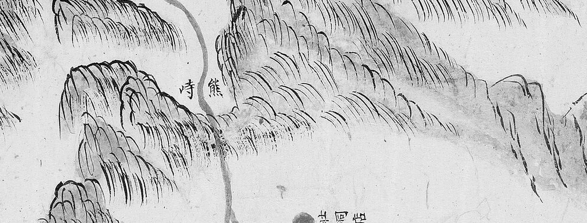

**이 도엽은 위가 北이므로 (0.645, 0.378)은 동북쪽**이고, 연산의 동쪽이 **진잠**입니다.
**진잠 쪽 고개일 수 있으나 경계 주기가 붙어 있지 않아** 어느 고을로 넘는지는 이 도엽
하나로 가릴 수 없습니다. **글자는 `상`, 비정은 두지 않습니다.**

**`雲住峙`·`城隍峙` 는 2차에서도 못 찾았습니다** — 2026-09-30 의 추정에 **좌표가 없어
되짚을 수 없습니다.** 교훈으로 적어 둡니다: **좌표 없는 추정은 적지 않습니다.**

**위 가장자리가 대전(진잠) 방면이고, 거기에 고개 표기는 없습니다.**

#### 12.7.3 「충청도 청주목지도」 — 대전과 닿지 않습니다

**전문 기록: [`1872-청주목지도-판독.md`](1872-청주목지도-판독.md)**

| | |
|---|---|
| 자료번호 | `KYKH002_0000_0028` (3,840 × 5,712 축소본) |
| 방위 | **위=南 · 아래=北 · 왼쪽=東 · 오른쪽=西** (표준의 180° 뒤집힘) |
| 가장자리 | 위 **`南接沃川界`** · 아래 `北接鎭川界` · 왼쪽 **`東接尙州界`** · 오른쪽 **`西接全義界`** (2026-10-01 에 넷 다 확대 확인, 〔?〕 뗌) |

**방위 근거가 가장자리 글귀 자체에 있습니다** — 네 변에 `南接…`·`北接…`·`東接…`·`西接…`
를 적어 두어 방위와 접경을 한 줄로 알려 줍니다. 이 조사에서 본 도엽 가운데 **가장 친절한
방식**입니다.

**`懷德` 이 없습니다.** 대전 쪽(위=남) 가장자리가 `沃川界` 이고, 회덕은 문의를 사이에 두고
더 남쪽입니다 — 해동지도 청주목(11.6.3)과 같은 결론입니다.

**~~고개 표기가 없습니다.~~ 그림 라벨에는 없고, 리 이름에는 있습니다** (2026-10-01 2차).
도엽은 면(22면 남짓) 이름과 주기, 사창, 제언(堰), 산줄기, 붉은 도로로 이루어집니다.
`獨林山` `獨林寺` `華陽` `松面` 정도가 눈에 띕니다.

| 위치 | 표기 | 어디에 | 확신 | 크롭 |
|---|---|---|---|---|
| **(0.64, 0.28)** | **`德峴`** | **`南二面` 리 목록** | **상** | 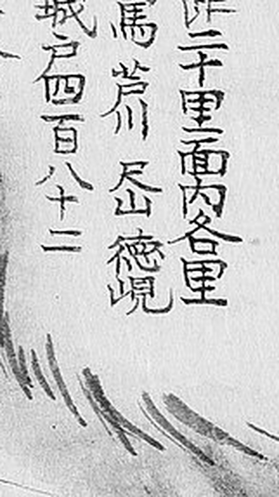 |

**면 주기의 꼴은 `自邑<방위>距<거리>里 面內各里 <리 이름 …> 戶 <호수>`** 입니다 —
다른 고을이 `自官門…` 인데 **청주만 `自邑…`** 입니다. 2026-10-01 에 남쪽(대전 쪽)
네 면을 읽었습니다: `周岸面`(남 70리, 호 294) · `南二面`(남 20리, 호 482) ·
`南一面`(남 20리, 호 2,18x) · **`南次二面`**(2026-09-30 에 빠뜨린 면 이름).

> **「고개가 없다」를 그림만 보고 적으면 안 됩니다.** 2026-10-01 하루에 옥천·연산·연기에
> 이어 **네 번째**로 거둬졌습니다. **1872년 계열은 고개를 그림에 그리지 않고 리 이름
> 속에 남깁니다.** 다만 청주는 면 주기 스물 남짓을 다 읽지 못해 **4.3 에는 올리지
> 않습니다.**

#### 12.7.4 접경 도엽 정리

**2026-09-30 로 1872년 계열 접경 도엽을 모두 한 번씩 훑었습니다.**

| 도엽 | 방위 | 대전 쪽 고개 | 대전과의 접경 |
|---|---|---|---|
| 옥천군지도 | 위=北 (표준) | **`馬達峙`** | `懷德` — 봉수가 계족산으로 이어짐(12.4) |
| 금산군지도 | 위=北 (표준) | **`薪峙`** · `隘口` · `石峴里` | `珎山界`(12.6) |
| 진산군지도 | **위=西** | `方峴` · 미판독(0.74, 0.50) | 북쪽이 공주(12.5) |
| 문의현지도 | 위=南 으로 보임(미확정) | **`漏峴`** | `南距懷德界十里` |
| 연산현지도 | 위=北 (가장자리 글자는 반전) | 없음 | **`鎭岑縣`**(0.17, 0.10) |
| 청주목지도 | **위=南** | 없음 | 닿지 않음 |

**여섯 도엽의 방위가 넷으로 갈립니다.** 도엽마다 확인해야 한다는 4.1 의 원칙이 다시
확인됐습니다.

#### 12.7.5 「충청도 회인현지도」 — **빠져 있던 도엽** (2026-10-01)

**전문 기록: [`1872-회인현지도-판독.md`](1872-회인현지도-판독.md)**

2026-10-01 에 커먼즈 1872년 분류(도엽 200장)를 훑어 **대전 인근에서 빠진 도엽 셋**을
찾았습니다. 그 하나입니다 — 해동지도 계열에는 회인이 있었는데(11.6.6) 1872년 계열에는
없었습니다.

| | |
|---|---|
| 자료번호 | `KYKH002_0000_0021` · 제목 `懷仁縣地圖` |
| 방위 | **위 = 北**(표준) — 왼쪽 `文義界十六里`, 오른쪽 `報恩界十六里` |
| 고개 | **`皮盤嶺`**(0.49, 0.25) + **`自官北距十五里`** |

##### 기문이 4.2 에 답합니다 — **`後爲懷德兼任官`**

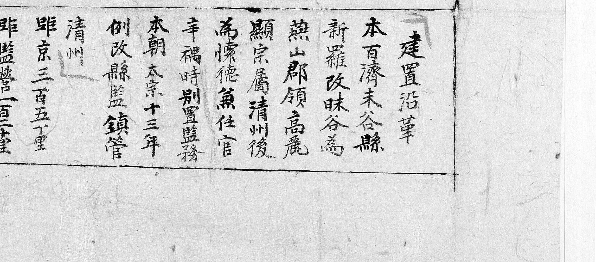

```
建置沿革 本百濟未谷縣 新羅改昧谷爲燕山郡領
高麗顯宗屬淸州 後爲懷德兼任官 辛禑時別置監務
本朝太宗十三年例改縣監 鎭管 淸州
距京三百五十里 距監營一百□里
```

4.2 는 **「회인은 회덕을 적는데 회덕은 회인을 적지 않는다」** 를 「사지가 네 방향
대표만 적으므로 일방 기록은 드물지 않다」로 설명해 두었습니다. **회인 쪽에는 그
이상의 까닭이 있었습니다** — 한때 **회덕 수령이 회인을 겸임**했습니다.

> 거꾸로 보면 **회덕 쪽에서 회인은 「내가 겸임하던 곳」**이므로, 회덕 도엽이 회인을
> 경계 고을로 적지 않은 것이 오히려 눈에 띕니다. 4.2 의 ⚠ 항목에 이 사실을
> 덧붙입니다.

##### `皮盤嶺` — 세 자료가 모였고, 거리까지 붙었습니다

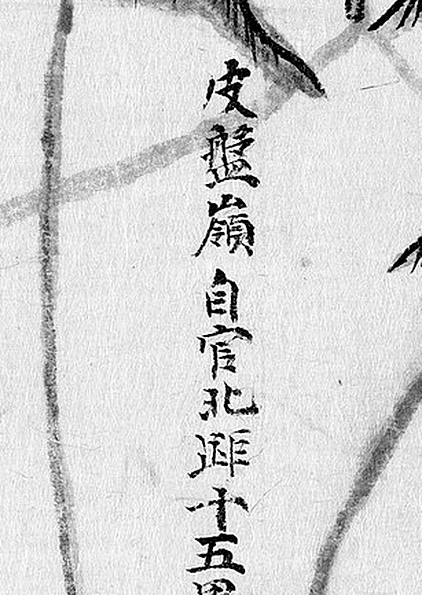

`皮`·`盤`·`嶺` 에 이어 **`自官北距十五里`**. 해동지도 회인현(11.6.6) ·
대동여지도 15-04(13.3)와 함께 **세 자료**이고, **고갯마루까지의 거리가 적힌 드문
예**입니다. 회인 북쪽 15리, 청주 가는 길이고 대전 쪽이 아닙니다.

`東面` 리 목록에 **`車嶺`·`葛峙`** 가 있습니다. `車嶺` 은 같은 날 해동지도 회인현에서
찾은 고개(0.955, 0.49)와 **같은 이름·같은 쪽(동, 報恩界 가까이)** 이므로
**해동지도 쪽 확신을 `중`→`상` 으로 올립니다**(11.6.6). 여기서는 **리 이름**이니
**고개가 마을 이름이 된 예**로 따로 셉니다.

##### 아래(남) 가장자리 — 주기는 있는데 **초서라 못 읽습니다** (2026-10-01 2차)

2026-10-01 2차에서 아래 가장자리를 다시 훑었습니다. **경계 주기가 둘 있습니다.**
둘 다 **상하 반전**이고, 돌려 놓아도 **초서**여서 3,840 px 축소본으로는 갈리지 않습니다.

| 자리 | 지금까지 | 확신 | 크롭 |
|---|---|---|---|
| (0.41~0.49, 0.85) | `□□□□` **`界三十二里`** — 앞이 `懷德`〔?〕 | **하** | 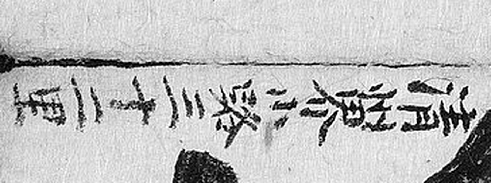 |
| (0.86~0.90, 0.75~0.80) | `東`〔?〕 … `沃川界`〔?〕 … `三十二里`〔?〕 | **하** | 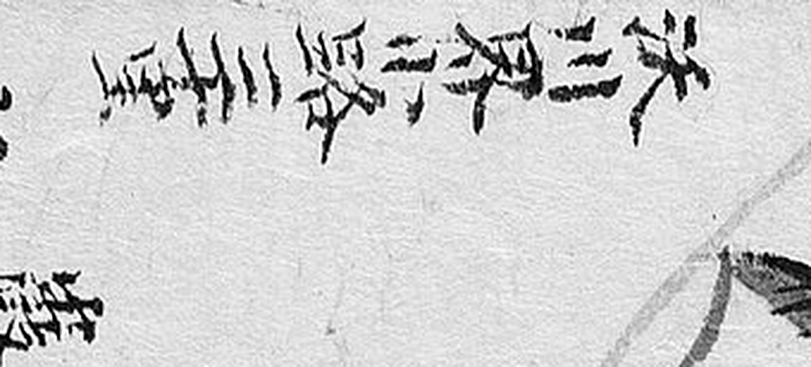 |

**끝의 `界三十二里` 는 둘 다 꽤 또렷합니다.** 갈리지 않는 것은 고을 이름 쪽입니다.

> **같은 도엽 안에서 글씨체가 갈립니다.** 오른쪽 변의 **`報恩界十六里`** 는 또렷한
> 해서입니다. **가장자리 주기를 한 손이 쓴 것이 아닙니다** — 도엽을 읽을 때
> 「이 도엽은 또렷하다/흐리다」로 뭉뚱그릴 수 없다는 뜻입니다.
>
> 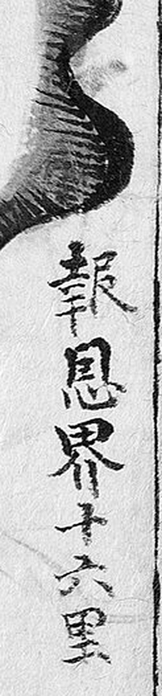

해동지도 회인현은 **`南距懷德界三十里`** 를 적습니다(11.6.6). 1872년 쪽이 `三十二里`
라면 **회인이 회덕을 적는 짝**(4.2)이 120년 뒤에도 이어지는 것이 됩니다.
**다만 글자를 읽지 못했으므로 그렇게 적지 않습니다.** 규장각 원본이 필요합니다.

#### 12.7.6 「충청도 연기현지도」 — **빠져 있던 도엽** (2026-10-01)

**전문 기록: [`1872-연기현지도-판독.md`](1872-연기현지도-판독.md)**

| | |
|---|---|
| 자료번호 | `KYKH002_0000_0023` · 제목 `燕岐縣地圖` |
| 방위 | **위 = 北**(표준) — 면 배치가 그대로 맞습니다 |
| 거리 주기 | `北距京都三百九十里 · 南距監營四十里 · 東距兵營五十里 · 西距水營二百里` |
| 고개 | 1차 미발견 → **2차에서 넷**: `松峴店`·`小松峙`·`石峴`·`月峴`〔?〕 |

사지(이웃 고을 거리)는 이 자리에 없고 가장자리에 `公州界十里`·`公州界二十里` 로
적혀 있습니다. 해동지도 연기현이 사지를 갖추고 있으므로(11.6.5) 두 계열을 함께 봅니다.

##### 「없다」를 적지 않은 것이 옳았습니다 — **2차에서 넷이 나왔습니다**

1차에서 「`峙`·`峴`·`嶺` 을 찾지 못했다」고만 적고 **「없다」고는 적지 않았습니다.**
같은 날 서쪽 절반을 다시 훑으니 넷이 나왔습니다. **1차 훑기가 성겼던 것입니다.**

| 위치 | 표기 | 읽기 | 확신 | 크롭 |
|---|---|---|---|---|
| (0.20, 0.21) | **`松峴店`** | 송현점 — **고개 아래 주막** | **상** |  |
| (0.21, 0.28) | **`小松峙`** | 소송치 · **「작은 솔재」** | **상** |  |
| `南面` 리 목록 | **`石峴`** | 석현 — **리 이름** | **상** | 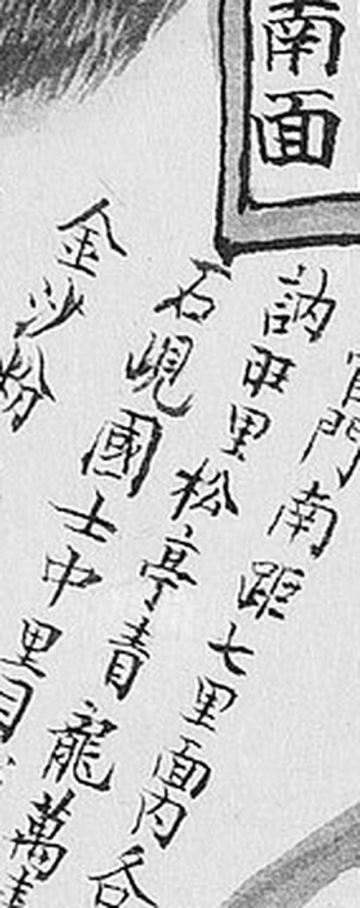 |
| `南面` 리 목록 | `月峴`〔?〕 | 월현 — 리 이름 | 중 | 위와 같은 목록 |

**`店` 이 붙은 것이 중요합니다.** 주막이 섰다는 것은 **사람이 넘어 다니는 길**이었다는
뜻입니다. 해동지도 연기현의 `松峙`(11.6.5)와 같은 계열이고, 두 계열이 `峙`/`峴` 으로
갈립니다(2장).

**`石峴` 은 오늘 오전에 자[尺]로 쓴 바로 그 글자**입니다 — 해동지도 연기의
`金沙峴`·`城峴` 을 철회할 때 기준으로 삼았던 `石峴` 이, 1872년에는 `南面` 의
**리 이름**으로 남아 있습니다.

> **2026-10-01 하루에 「고개가 없다」가 세 번 거둬졌습니다** — 옥천(`九也峙`, 11.6.1) ·
> 연산(`□□峴`, 11.6.4) · 연기(여기). **한 번 훑고 「없다」고 적지 않습니다.**

`南面` 리 목록 — `自官門南距七里 面內各里 訥甲里 松亭 靑龍 萬壽洞 秀山 石峴 國士
中里 月城 月峴〔?〕 鶴鳴洞〔?〕 金沙粉土洞 錦城 防築 德洞 伏龍 三岐 山水洞 … 大洞
露谷〔?〕 外三岐 / 戶 四百三十戶 人口 一千四百五十九口`.

면 이름에 **번호가 붙습니다**(`東一面`·`北一面` …) — 해동지도 연기현의 짜임과 같고,
**면마다 리 이름과 호구**를 적는 1872년 계열의 꼴입니다.

`合江`(미호천이 금강에 드는 자리)이 오른쪽 아래에 있습니다. **그 건너가 공주목
구즉·명탄면**, 곧 지금 대전 유성구 북부입니다.

#### 12.7.7 「충청도 문의현지도」 **둘째본** — 문의는 도엽이 둘입니다 (2026-10-01)

**전문 기록: [`1872-문의현지도-둘째본-판독.md`](1872-문의현지도-둘째본-판독.md)**

《1872년 지방지도》는 고을마다 한 장이 원칙인데 **문의만 둘**입니다 —
`KYKH002_0000_0038`(12.7.1 에서 쓴 것)과 **`KYKH002_0000_0002`**.
둘째본은 산을 톱니꼴로 단순하게 그리고 **지물마다 `自官○距○里` 주기**를 달았습니다.

##### 사지가 오늘의 정정을 받칩니다

```
東距懷仁界十里 · 西距燕歧界三十里 · 南距懷德界十里 · 北距淸州界十里
關防隘口無 · 陵寢無 · 橋梁無
```

| 방향 | 둘째본(1872) | 0038(1872) | 해동지도 |
|---|---|---|---|
| **西 燕歧界** | **三十里** | 三十里 | ~~十五里~~ → **卅里**(2026-10-01 정정, 11.6.2) |
| **南 懷德界** | **十里** | 十里 | 十五里 |

**같은 날 한 해동지도 정정이 같은 날 확인됐습니다.** 회덕까지는 120년 사이에
15리 → 10리로 줄었고, **1872년 두 장이 함께 10리**를 적으므로 오기가 아닙니다.

##### **`漏峴 自官東距十里` — 12.7.1 의 미결이 풀립니다**

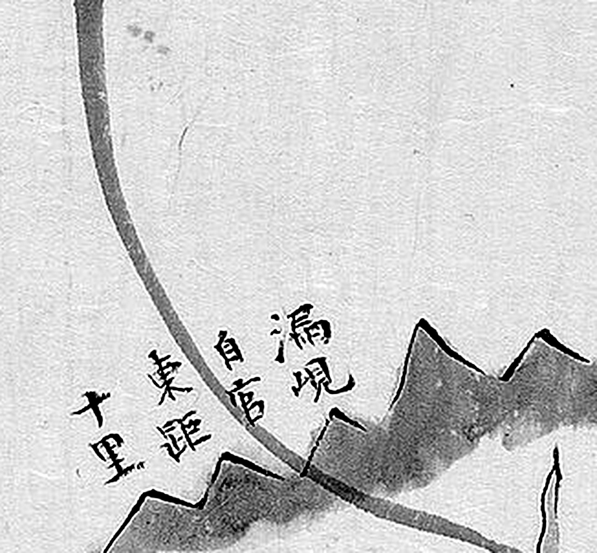

12.7.1 은 해동지도의 `弘峙` 와 1872년의 `漏峴` 이 같은 고개인지를 열어 두었습니다.

| | 자리 | 통하는 곳 |
|---|---|---|
| **`弘峙`**(해동지도) | 읍치와 `懷德界` **사이** | **남 — 회덕** |
| **`漏峴`**(1872 둘째본) | **`自官東距十里`** = 사지의 `東距懷仁界十里` 와 같은 값 | **동 — 회인** |

> **두 고개는 다릅니다.** `漏峴` 은 **회인 길**, `弘峙` 는 **회덕 길**입니다.
>
> 2026-10-01 에 1872년 진잠지도에서 **길 주기가 고개의 쓰임을 알려 준다**는 기준을
> 세웠는데(12.2), 여기서는 **거리 주기**가 같은 일을 합니다 —
> **1872년 계열은 고개가 「어디로 통하는가」를 알려 줍니다.** 4.4 에서 「대전으로
> 드나드는 길목」을 가릴 때 쓸 수 있는 두 번째 기준입니다.

#### 12.7.8 빠진 도엽을 어떻게 찾았나 — 그리고 아직 남은 것

커먼즈 분류 [Category:Jibang jido (1872)](https://commons.wikimedia.org/wiki/Category:Jibang_jido_(1872))
의 목록(200장)을 받아 **해동지도 열세 도엽의 고을 이름과 맞춰 보았습니다.**

| 고을 | 1872 도엽 | 상태 |
|---|---|---|
| 회덕 | `0046` | 전면 훑기(12.1) |
| 진잠 | `0036` | 전면 훑기(12.2) |
| 공주목 | `0026` | 부분 — **해상도 한계**(10장) |
| 옥천 | `0024` | 전면 훑기(12.4) |
| 문의 | `0038` · **`0002`** | 둘 다 — **도엽이 두 장**(12.7.1 · 12.7.7) |
| 청주목 | `0028` | 훑기(12.7.3) |
| 연산 | `0019` | 훑기(12.7.2) |
| **회인** | **`0021`** | **2026-10-01 찾음**(12.7.5) |
| **연기** | **`0023`** | **2026-10-01 찾음**(12.7.6) |
| 진산 | `KYKH003 0059` | 부분(12.5) |
| 금산 | `KYKH003 0047` | 북부(12.6) |
| **이산(尼山)** | **`0015` 「노성현읍지도」** | **미착수** — 1776년에 `尼山`→`魯城` 으로 이름이 바뀌어 **고을 이름으로 찾으면 안 걸립니다** |
| 은진 | `0045` 「은진지도」 | 미착수 — 대전과 닿지 않음 |

> **배운 것 하나.** 1872년 계열을 해동지도의 고을 이름으로 찾으면 **이산현처럼
> 그 사이에 개명한 고을을 놓칩니다.** 1872년 도엽의 이름은 1872년 당시의 것입니다.

그 밖에 분류에서 확인한 대전 인근 도엽 — `전의현지도`(0025) · `천안군지도`(0052) ·
`부여현지도`(0011) · `석성현지도`(0014). 모두 대전과 닿지 않습니다.

## 13. 『대동여지도』 (1861) — 착수 (2026-09-30)

**장 번호가 시기 순서와 어긋납니다.** 3부는 11장 『해동지도』(1750년대) → 12장 《1872년
지방지도》 → 14장 AMS(1919년 저본) 순으로 쌓여 왔는데, **대동여지도는 1861년으로 12장보다
11년 앞섭니다.** 12장의 절 참조가 100곳이 넘어 번호를 밀면 깨질 위험이 커서,
**13장을 비워 두고 여기에 넣었습니다.** 읽을 때 시기를 헷갈리지 마십시오.

### 13.1 자료 — 커먼즈에 규장각본이 층·면 단위로 있습니다

김정호, 1861년(철종 12) 목판본. 커먼즈 분류
**[Category:Daedongyeojido](https://commons.wikimedia.org/wiki/Category:Daedongyeojido)** 에
규장각본이 올라 있고, 파일명은 **`Daedongyeojido (Gyujanggak) NN-MM.jpg`** 꼴입니다
(`NN` = 층(帖), `MM` = 그 층 안의 면). **면 번호는 동에서 서로 갑니다** — 13층에서
05 가 강화·인천이고, 16층에서 05 가 보령·서천입니다.

**이 계열은 고개 조사에 특히 좋습니다.** 목판본이라 글자가 또렷하고, **`峙`·`峴`·`嶺`
표기가 회화식 군현지도보다 훨씬 촘촘합니다.** 1,920 px 축소본에서도 지명이 읽힙니다.
고을 경계에 얽매이지 않아 **대전 일대를 한 화면에서** 볼 수 있다는 것도 큽니다.

### 13.2 대전이 실린 층·면 — **15층 4면**과 **16층 4면**

| 층·면 | 담긴 것 |
|---|---|
| **15-04** | **대전 북부** — 회덕·유성·진잠·계족산·신탄, 공주·청주·문의 |
| **16-04** | **대전 남부 접경** — 계룡산·진산·금산·연산·은진·고산 |

대전이 **두 층에 걸칩니다.** 회덕 읍치가 15-04 의 **아래 가장자리**(0.69, 0.99)에 있고,
그 남쪽(산내면·삼괴동·마달령)은 16-04 로 넘어갑니다.

### 13.3 15-04 채록 — 대전 북부

**전문 기록: [`대동여지도-15-04-판독.md`](대동여지도-15-04-판독.md)**

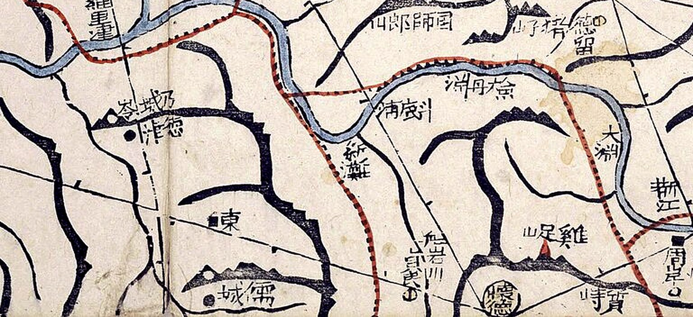

*대전 본역. 오른쪽 아래 `懷德`, 그 위가 `雞足山`, 왼쪽이 `儒城`.*

| 위치 | 표기 | 읽기 | 확신 | 판독자 | 날짜 |
|---|---|---|---|---|---|
| (0.69, 0.99) | `懷德` | 회덕 읍치(노란 원) | 상 | Claude | 2026-09-30 |
| (0.54, 0.99) | `儒城` | 유성 | 상 | Claude | 2026-09-30 |
| (0.44, 0.62) | `鎭岑` | 진잠 읍치(노란 원) | 상 | Claude | 2026-09-30 |
| (0.72, 0.93) | **`雞足山`** | 계족산 | 상 | Claude | 2026-09-30 |
| (0.60, 0.88) | `新灘` | 신탄(지금 신탄진) | 상 | Claude | 2026-09-30 |
| (0.63, 0.83) | `國師郞山`〔?〕 | — | 중 | Claude | 2026-09-30 |
| (0.72, 0.81) | `猪子山` · `德留` | — | 중 | Claude | 2026-09-30 |

**`雞足山` 이 여기에도 있습니다.** 같은 날 1872년 옥천군지도의 봉수 주기에서
`去應 懷德 鷄足山烽燧` 를 읽었는데(12.4), **대동여지도가 그 산을 회덕 북쪽에 그려
놓았습니다.** 두 자료가 맞물립니다. 다만 글자는 `雞`(奚+隹)로, 옥천 도엽의 `鷄`(奚+鳥)와
갈립니다 — 2장 표기 원칙.

#### 고개 아홉 — 아래 절반을 전면으로 훑었습니다

**이 계열이 고개를 얼마나 촘촘히 적는지가 여기서 드러납니다** — 회화식 군현지도 한 장에
서넛이던 것이, 같은 넓이에 아홉입니다.

| 위치 | 표기 | 읽기 | 확신 | 비고 |
|---|---|---|---|---|
| **(0.75, 0.98)** | **`質峙`** | **질치** | **상** | 회덕 읍치 동쪽 → 13.4 |
| (0.70, 0.73) | `懸峙` | 현치 | 상 | 문의 읍치 서쪽 |
| **(0.87, 0.60)** | **`赤峴`** | 적현 | 상 | 청주 남쪽 |
| **(0.89, 0.71)** | **`皮盤嶺`** | 피반령 | 상 | **해동지도 회인현(11.6.6)과 같은 것** |
| **(0.86, 0.80)** | **`墨峴`** | 묵현 | 상 | **해동지도 회인현의 `墨嶺` 과 같은 것으로 보임.** 3장의 `墨峙` 와 **다른 곳** |
| (0.81, 0.79) | `潟峙`〔?〕 | — | 하 | 문의 동남 |
| (0.49, 0.85) | `乃城岾`〔?〕 | 내성재 | 하 | 유성 북쪽. **셋째 글자가 `岾`** |
| (0.39, 0.70) | `□郞岾`〔?〕 | — | 하 | 진잠 서쪽 |
| (0.76, 0.67) | `栗峙川`〔?〕 | 율치천 | 중 | 고개 이름이 **하천 이름**에 들어간 예 |

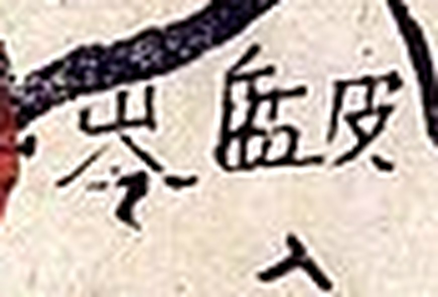 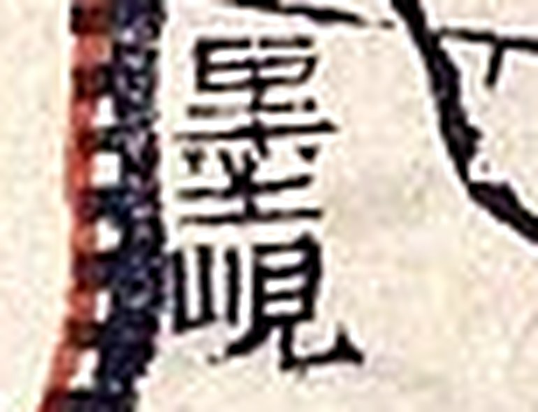 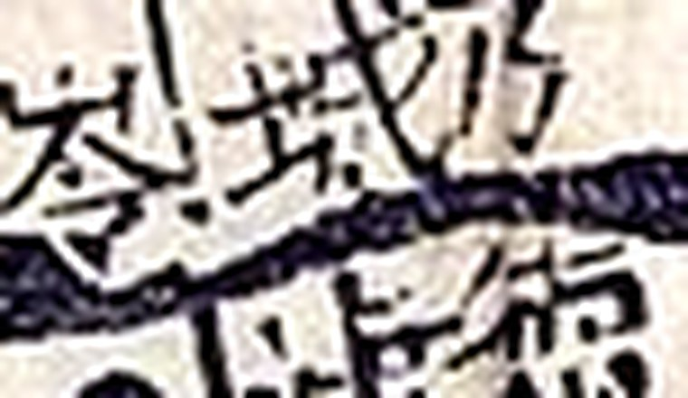

*왼쪽부터 `皮盤嶺` · `墨峴` · `乃城岾`〔?〕.*

**`質峙` 가 6.5 를 크게 움직입니다** — 13.4.

#### **`岾`(재 점) — 네 번째 고개 글자**

(0.49, 0.85)의 셋째 글자, (0.39, 0.70)의 둘째 글자, 16-04 의 `加岾`〔?〕(0.55, 0.62)이
**`山` 변에 `占`** 꼴입니다. `岾` 은 우리나라에서 만들어 쓴 글자로 **'재'를 적습니다.**

**그러면 이 조사가 다루는 고개 글자가 넷이 됩니다** — `峙` · `峴` · `嶺` · **`岾`**.
2장 표기 원칙과 4.4 에 걸립니다. **다만 축소본에서 `岾`(山+占)과 `峙`(山+寺)는 구별이
어렵습니다** — 확신 `하` 로 두고 원본을 기다립니다.

#### **`墨峴` 을 3장의 `墨峙` 와 섞지 않습니다**

3장의 `墨峙`(먹치)는 **만인산 언저리**이고 머들령과 자리가 거의 같습니다(AMS 1043/1478).
**여기 `墨峴`(0.86, 0.80)은 회인 읍치(0.94, 0.78) 바로 서쪽**이고, 해동지도 회인현의
`墨嶺`(11.6.6)과 같은 것으로 보입니다. **대전에서 북동쪽으로 40리 넘게 떨어져 있습니다.**

**글자가 같고 자리가 다른 전형**입니다 — 6.4 가 거듭 경계해 온 것입니다.
두 계열이 같은 곳을 `墨嶺`·`墨峴` 으로 적으니 **회인 쪽 '먹재'는 그것대로 한 고개**입니다.

#### **`所伊山`(0.80, 0.73) — 봉수 노선의 세 점이 다 섰습니다**

[`1872-회덕현지도-판독.md`](1872-회덕현지도-판독.md) 이 회덕 기문의 봉수 주기
`北應文義夜味山烽燧四十里去應` 를 읽으면서 **「야미산 = 소이산(所伊山)」** 으로 파악해
두었습니다. **대동여지도가 그 산을 문의 읍치 동쪽에 그려 놓았습니다.**

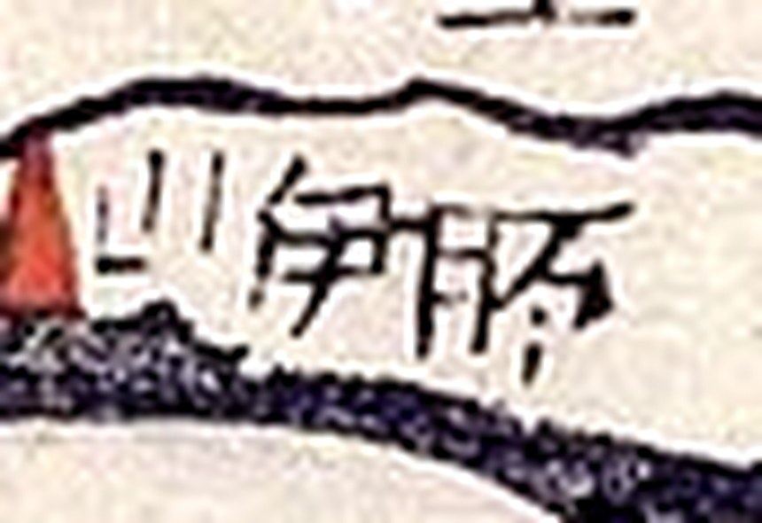

```
옥천 環山(16-04, 0.87·0.09) ──→ 회덕 雞足山(15-04, 0.72·0.93) ──→ 문의 所伊山(15-04, 0.80·0.73)
        (12.4 봉수 주기의 來應)                            (1872 회덕현지도 기문의 去應)
```

**세 점이 모두 지도에서 확인됐습니다.** 12.4 에서 옥천 쪽 주기를 읽은 것과 합치면,
**대전을 지나는 봉수 한 구간이 자료 셋으로 교차 확인된 셈**입니다.

##### 2026-10-01 — **다섯 고리가 됐습니다**

1872년 옥천군지도를 전면으로 훑어 **봉수 주기를 둘 다 전문으로** 읽었습니다(12.4).
남쪽으로 두 고리가 더 붙습니다.

```
永同 朴達羅山 ──→ 옥천 月伊峯 ──→ 옥천 環山 ──→ 회덕 雞足山 ──→ 문의 夜味山(=所伊山)
└──── 1872 옥천군지도 한 장이 가운데 세 고리를 다 적었습니다 ────┘  (1872 회덕현지도 기문)
```

| 고리 | 출전 |
|---|---|
| 永同 朴達羅山 → 옥천 月伊峯 | 1872 옥천군지도 `月伊峯烽臺` 주기의 `來應` |
| 옥천 月伊峯 → 옥천 環山 | 같은 주기의 `去應` / `環山烽臺` 주기의 `來應` — **양쪽이 서로를 적습니다** |
| 옥천 環山 → 회덕 雞足山 | `環山烽臺` 주기의 `去應` + 대동여지도 15-04 의 `雞足山` |
| 회덕 雞足山 → 문의 夜味山 | 1872 회덕현지도 기문의 `北應文義夜味山烽燧四十里去應` |

**가운데 고리는 양쪽 주기가 서로를 적어 맞물립니다** — 4.2 의 「이웃이 서로를 적는 짝」과
같은 꼴이 봉수에서도 나타납니다.

**해동지도에도 봉수 표시가 있습니다.** 2026-10-01 에 해동지도 옥천군에서 `環山`·`月伊`
곁의 **`烽臺`** 를, 문의현에서 같은 라벨을 찾았습니다(11.6.1 · 11.6.2). 다만 문의 쪽은
**산 이름이 적혀 있지 않아** `夜味山`/`所伊山` 비정은 대동여지도에 기댄 채로 둡니다.

### 13.4 **`質峙` 가 지도에서 처음 확인됐습니다**

6.5 는 「질티/질고개」의 세 표기 `吉峙`·`質峙`·`迭峴` 을 다루면서, **`質峙` 는 기록에서만
들었을 뿐 지도에서 확인하지 못했다**고 적어 두었습니다. **대동여지도 15-04 에 있습니다.**


오른쪽이 `質`(斦+貝), 왼쪽이 `峙`(山+寺)로 둘 다 또렷합니다(우횡서).
**자리도 맞습니다** — `懷德` 읍치(0.69, 0.99) 바로 **동쪽**이고, 질현성·질티고개가 있는
대덕구 비래동이 회덕 읍치 동쪽입니다.

**그래서 6.5 의 세 표기 가운데 둘이 지도로 확인됐습니다** — `吉峙`(1872 회덕현지도, 12.1)와
`質峙`(대동여지도, 여기). **두 지도가 11년 차이로 같은 고개를 다른 글자로 적었습니다.**
6.5 가 든 두 설명(① 구개음화 이전·이후 표기가 섞였다 ② 필사자가 뜻 좋은 글자로 바꿨다)
가운데 ②가 조금 더 그럴듯해집니다 — **1861년에 `質`, 1872년에 `吉`** 이니 소리가 변한
방향과 어긋나기 때문입니다(`질`→`길` 은 구개음화의 반대입니다).

### 13.5 16-04 — **`雞峴` 을 찾았습니다**

**전문 기록: [`대동여지도-16-04-판독.md`](대동여지도-16-04-판독.md)**

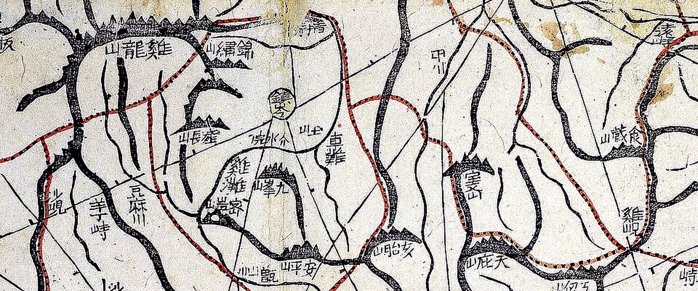

*도엽 북부. 왼쪽부터 `雞龍山` · `錦繡山` · `鎭岑` · `甲川`, 오른쪽 끝이 `食藏山`.*

| 위치 | 표기 | 읽기 | 확신 |
|---|---|---|---|
| (0.40, 0.05) | `雞龍山` | 계룡산 | 상 |
| (0.46, 0.05) | `錦繡山` | 금수산 | 중 |
| (0.50, 0.10) | `鎭岑` | 진잠 읍치(팔각) | 상 |
| (0.49, 0.13) | **`介水院`** | 개수원 | 상 |
| (0.50, 0.18) | `九峯山` | 구봉산 | 상 |
| (0.52, 0.25) | `安坪峙` | 안평치 | 중 |
| (0.61, 0.06) | **`甲川`** | 갑천 | 상 |
| (0.74, 0.13) | **`食藏山`** | 식장산 | 상 |
| **(0.75, 0.21)** | **`雞峴`** | **계현** | **상** |
| (0.65, 0.25) | `天庇山` | 천비산 | 상 |
| (0.71, 0.28) | **`萬仞山`** | 만인산 | 상 |
| (0.80, 0.27) | **`馬達峙`**〔?〕 | 마달치 | **중** |
| (0.84, 0.29) | `西臺山` | 서대산 | 상 |
| (0.83, 0.06) | `增若` | 증약역 | 상 |
| (0.87, 0.09) | `環山` | 환산(고리산) | 상 |
| (0.93, 0.15) | `沃川` | 옥천 읍치 | 상 |

**`介水院` 이 1872년 진잠지도의 사지와 맞물립니다** — 12.2 가 진잠 동쪽 경계를
`介水院里 公州界 十里` 로 적었는데, 대동여지도가 그 원(院)을 진잠 읍치 바로 남동쪽에
그려 놓았습니다.

**`萬仞山`·`天庇山` 이 해동지도 진산군(11.2)의 것과 같습니다** — 그쪽에서는
`萬伊山`·`天庇山` 으로 읽었습니다. `萬仞`/`萬伊` 가운데 **대동여지도 쪽이 `仞`** 입니다
(판독자가 2026-09-19 에 「만인산(萬仞山)」이라 한 것과 맞습니다).

**(0.80, 0.27)의 세 글자를 `馬達峙` 로 읽습니다 — 확신 `중`.**

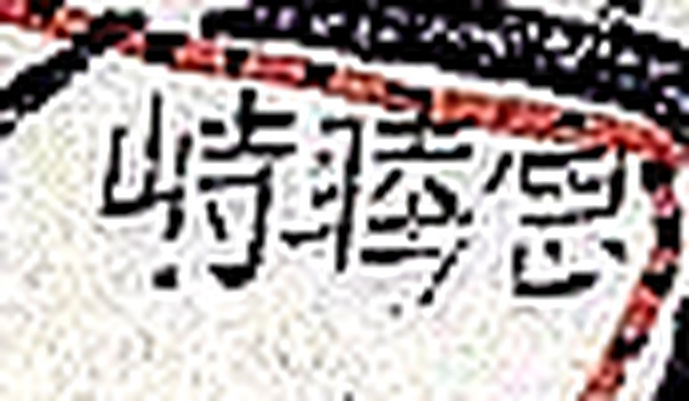

왼쪽 `峙`(山+寺)는 또렷하고, 가운데는 `辶` 받침이 보여 **`達`**, 오른쪽은 가로획이
들어찬 네모꼴에 아래 점이 있어 **`馬`** 로 읽힙니다(우횡서). **자리도 맞습니다** —
`食藏山`·`雞峴` 과 `西臺山` 사이이고, 마달령은 동구 삼괴동↔옥천 군서면입니다.

**다만 축소본의 해상도 한계에 걸려 있습니다.** `達`·`馬` 는 획이 뭉쳐 보이고, 이 조사에서
비슷한 자리에서 두 번 틀린 적이 있습니다(11.2 의 `□峙`, 12.5 의 `懷德`). **확신 `중` 으로
두고 원본 판독을 기다립니다.** 맞다면 **마달령의 세 번째 출전**이 되고(1872 옥천군지도 ·
AMS 1919 · 대동여지도 1861), 가장 이른 것이 됩니다.

#### 2026-10-01 — **`馬達峙` 가 굳었습니다**

3,840 px 사본으로 16-04 북부를 다시 봤습니다.

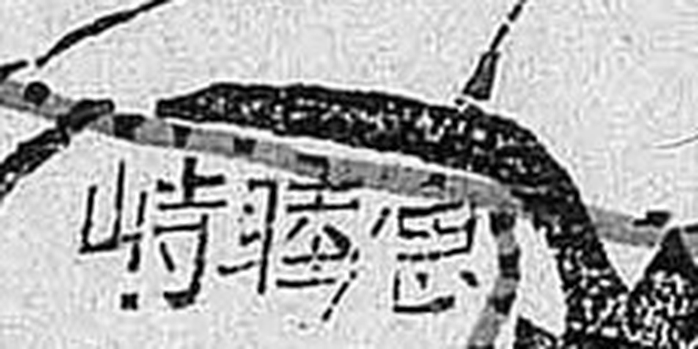

우횡서로 오른쪽부터 `馬`·`達`·`峙`. **`達` 의 `辶` 받침이 또렷해졌습니다** —
2026-09-30 에 `중` 으로 둔 까닭이 해상도였음이 드러났습니다.

| | |
|---|---|
| 확신 | **중 → 상** |
| 근거 | 1861 대동여지도 · 1872 옥천군지도(12.4) · 1919 AMS `馬達嶺`(14장) — **셋이 이름에서 일치** |
| 뜻 | **마달령의 가장 이른 출전이 1861년으로 굳었습니다.** 3장의 출전 칸에서 〔?〕 를 뗍니다 |

같은 자리에서 **`老峙`〔?〕(0.77, 0.03) → `遠峙`〔?〕** 로 고쳤습니다 —
위 글자에 **`辶` 받침이 있어 `老`(耂+匕)가 아닙니다.** 확신 `하`→`중`.

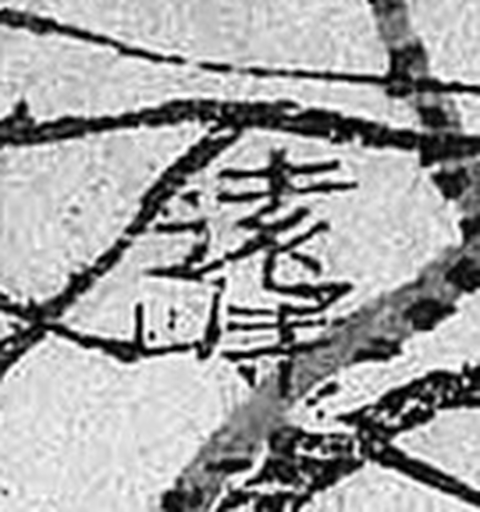

#### 2026-10-01 — **회덕의 미비정 고개 넷은 대동여지도에 없습니다**

3장에 「미비정」으로 남은 회덕 고개 넷(`崖柏峙`·`子田峴`·`子峴`·`于峙領`〔?〕)을
대동여지도로 비정해 보려고, **15-04 아래쪽(회덕 읍치 일대)과 16-04 북쪽을
3,840 px 로 다시 훑었습니다.**

**없습니다.** 회덕 읍치 둘레에서 대동여지도가 적은 고개는 **`質峙` 하나**뿐이고,
나머지(`潟峙`·`墨峴`·`乃城岾`〔?〕)는 모두 청주·회인·문의 쪽입니다.

> **까닭은 자료의 성격입니다.** 대동여지도는 **고을과 고을을 잇는 큰 고개**를 적습니다
> — `質峙`(회덕↔옥천) · `馬達峙`(공주 산내↔옥천) · `雞峴`(고을 경계) · `皮盤嶺`(회인↔청주).
> `崖柏峙`·`子田峴`·`子峴` 은 **회덕 안쪽의 작은 고개**이므로 실릴 자리가 아닙니다.
> 해동지도 회덕현 도엽과 그 첨지가 **지금까지 이 셋의 유일한 출전**입니다(6.2).

**그러므로 넷의 비정은 다른 쪽으로 넘어갑니다** —
**AMS 1:50,000**(14장, 지명이 로마자로 적혀 있어 우리말 이름이 남음) ·
**조선지지자료**(1911) · **지명총람**. 9장 문헌 대조표의 그 세 칸이 다음 과제입니다.

### 13.6 **`雞峴` — 네 번째 표기이자, 자리를 못 박는 기록**


**`雞`(奚+隹) 와 `峴`(山+見) 두 글자가 또렷합니다.** 세로로 쓰였습니다.

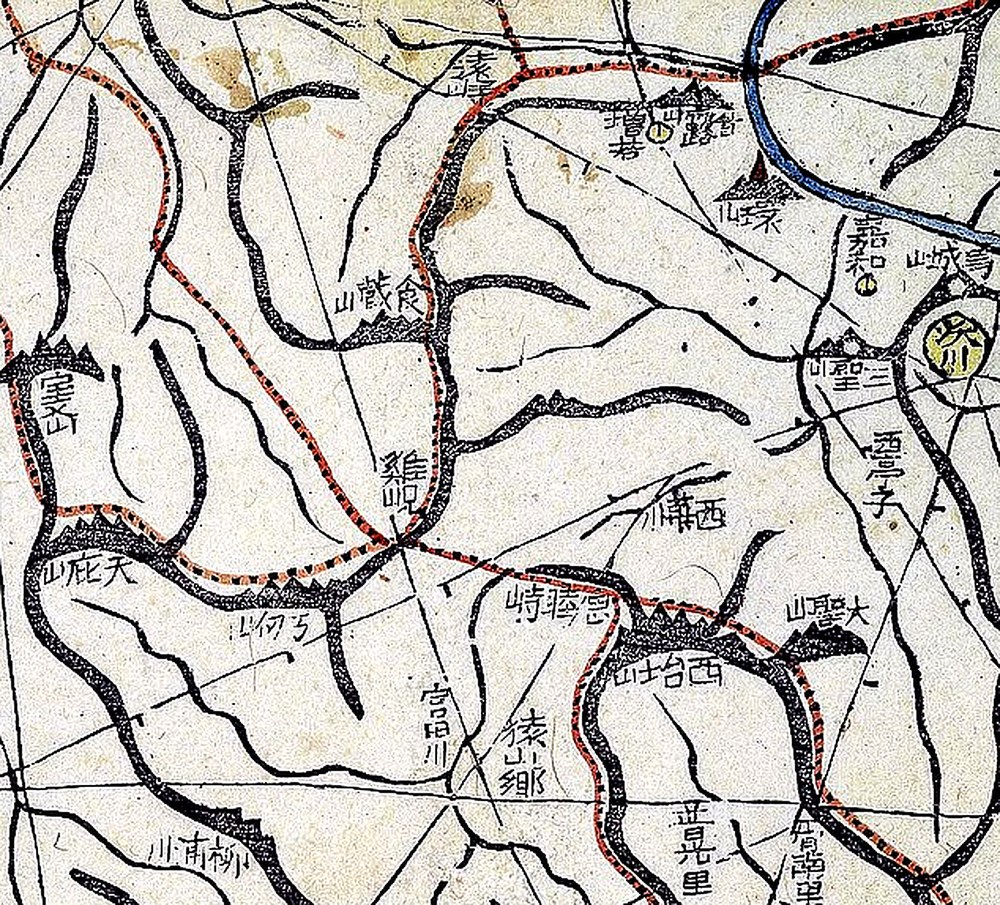

*`食藏山`(위) 아래 `雞峴`, 그 남서쪽이 `天庇山`·`萬仞山`, 동쪽이 `西臺山`·`沃川`.
붉은 점선이 고을 경계입니다.*

**세 가지가 한꺼번에 섭니다.**

1. **`食藏山` 바로 남쪽입니다.** 11.1 이 해동지도 회덕현 동쪽 경계를 북에서 남으로
   훑은 순서가 `于峙嶺` → `東面` → `食藏山` → `雞峙` → `珎山界` 였습니다.
   **대동여지도가 같은 순서를 그대로 보여 줍니다** — 두 계열이 100여 년을 사이에 두고
   같은 자리에 같은 이름을 적었습니다.
2. **고을 경계(붉은 점선) 위에 있습니다.** 식장산 서쪽에서 내려온 경계선이 **`雞峴` 을
   지나** 서남쪽으로 꺾입니다. **닭재가 경계 고개였다**는 것이 처음으로 지도에
   그려진 형태로 확인됩니다.
3. **그 남서쪽이 `天庇山`·`萬仞山`** 입니다. 둘 다 해동지도 진산군 도엽의 산입니다(11.2).
   곧 **계현 남쪽이 진산**입니다.

**다만 소속을 직접 적지는 않습니다.** 대동여지도는 고을 이름을 읍치에만 적고 경계선에는
적지 않으므로, **계현 북쪽이 회덕인지 공주(산내면)인지는 이 도엽만으로 갈리지 않습니다.**
6.4 의 물음 가운데 **「어디에 있었나」는 풀렸고 「누구 땅이었나」는 남았습니다.**

**그리고 `雞` 의 기준 글자가 하나 더 생겼습니다.** 12.5 의 1872년 진산군지도 미판독
세 글자와 견줄 수 있습니다 — 다만 그쪽은 3,840 px 축소본이 이미 해상도 한계입니다.

#### 표기가 넷이 되었습니다

| 표기 | 자료 | 연대 | 위치 |
|---|---|---|---|
| `雞峙` | 해동지도 회덕현 | 1750년대 | (0.87, 0.64) — 11.1 |
| **`雞峴`** | **대동여지도 16-04** | **1861** | **(0.75, 0.21) — 여기** |
| `鷄峴` | 1872 진산군지도 | 1872 | **미확인** — 후보 자리 (0.74, 0.50), 12.5 |
| `鷄峙` | AMS 1:50,000 Taejon | 저본 1919 | 그리드 1049/1485 — 14.2 |

**`峙`/`峴` 이 번갈아 나옵니다** — 1750년대 `峙`, 1861년 `峴`, 1919년 `峙`.
4.4 에서 본 「고을마다 글자 버릇이 다르다」가 **같은 고개 안에서도** 보입니다.

### 13.7 16-04 남서부 — 연산·진산, 그리고 **`全州 揚良所`**

| 위치 | 표기 | 확신 |
|---|---|---|
| (0.44, 0.37) | `連山` 읍치 | 상 |
| **(0.45, 0.42)** | **`羅峙`** | 상 |
| **(0.45, 0.50)** | **`唐突峙`** | 상 |
| (0.37, 0.59) | `瓦老峙`〔?〕 | 하 |
| (0.55, 0.62) | `加岾`〔?〕 | 중 |
| (0.50, 0.38) | `黃山岑`〔?〕 | 하 |
| **(0.49, 0.52)** | **`全州 揚良所`** | 상 |

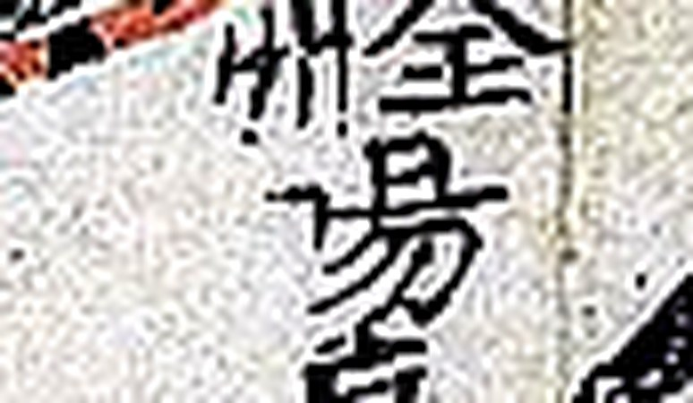

**`全州 揚良所` 가 1872년 진산군지도 기문과 맞물립니다.** 그 기문 고적 조가 이렇게
적습니다(12.5).

> `炭峙 百濟時置邑於兩峴間 以助關防 備羅兵 麗朝廢之 移邑古縣西北地 環三四十里`
> **`陽良所间是也 而今屬全州`**

**「양량소 사이가 그곳인데 지금은 전주에 속한다」** — 그 양량소를 **대동여지도가
`全州 揚良所` 로, 곧 전주 땅임을 밝혀 적어** 놓았습니다. **11년 차이로 두 자료가 같은
말을 합니다.** 진산 옛 읍치의 자리를 좁히는 데 쓸 수 있습니다.

### 13.8 남은 것

- **15-04 위 절반**(공주 북부·천안·청주 북부)
- **16-04 남동부**(금산·무주·용담) — `栗峙`·`炭峙`·`板峙`·`松峙` 의 좌표
  — [남쪽 절반을 넓게](crops/DDYJD-Gyujanggak-16-04_x0.5_y0.3_w0.3_h0.3.jpg)
- **`馬達峙`〔?〕(0.80, 0.27)의 확정** — 맞다면 마달령의 가장 이른 출전입니다
- **`岾`/`峙` 구별** — `乃城岾`〔?〕·`□郞岾`〔?〕·`加岾`〔?〕 셋 다 원본이라야 갈립니다
- **15-03**(옥천 방면)·**16-03**(금산 동부) 확인
- 대동여지도는 **방안(方眼)** 이 있어 거리를 잴 수 있습니다. 고개 사이 거리를 재면
  14장 AMS 그리드와 맞춰 볼 수 있습니다

## 14. 미군 AMS 1:50,000 「Taejon」 — 저본 1919년판 (2026-10-01)

### 14.0 이 도엽이 무엇인가

**미국 육군 지도국(Army Map Service)이 1945년에 만든 1:50,000 지도**이나, 왼쪽 아래
제작 주기에 저본이 적혀 있습니다.

> A.M.S. L751 / Type A (AMS1), 1945
> …**Copied in 1945 from Korea 1:50,000, Japanese Imperial Land Survey, Taejon, 1919.**
> Place names transcribed according to the McCune-Reischauer System; alternate Japanese
> names shown in parentheses transcribed according to the Modified Hepburn (Romaji) System.

**1919년 발행 일본 1:50,000 「大田」(公州 11호)을 그대로 베낀 것**이고, 그 1919년판은
**1917년 측도**입니다. 미국 정부 저작물이라 **퍼블릭 도메인**입니다 —
[`고지도-목록.md`](고지도-목록.md) 의 「1919년판 1:50,000을 보는 법」 참조.

**이 도엽이 고개 조사에 값진 이유는 한자 옆에 로마자가 붙어 있다는 점입니다.**
1872년 지방지도도 해동지도도 한자뿐이라 **읽기를 알 수 없었는데**, 여기에는
`馬達嶺 → Madal-lyŏng (Batatsu-rei)` 처럼 **한국어 읽기와 일본어 읽기가 나란히** 나옵니다.

### 14.1 ⚠ 다만 로마자는 1917년 것이 아닙니다

**지형은 1919년판 그대로인데 지명만 1945년 당시 이름으로 갈아 끼웠습니다.**
저본의 한자는 `大寺里`·`大興里`·`大東里`(**里**)인데 덧쓴 로마자는
`Taeji-chō`·`Taikō-chō`·`Taitō-chō`(**町**)입니다. 리가 정으로 바뀐 것은 **1926년 이후**입니다.

**전사 오류도 있습니다** — `芙沙里`를 `Misa-ri`로, `加尺里`를 `Kach'ŏng-ni`로 적었습니다.
둘 다 괄호 안 일본어는 한자와 맞는데 **한국어 전사만 틀렸습니다.**

> **한자는 1917년 측도의 것으로 믿을 수 있으나, 로마자 읽기는 1945년 시점이고 오기도
> 섞여 있습니다.** 읽기를 인용하실 때는 반드시 다른 자료와 대조하십시오.

### 14.2 고개 여덟 (2026-09-30 일곱 + 2026-10-01 하나)

도엽 그림틀 전역을 훑어 찾은 것입니다. `그리드`는 도엽의 1 km 방안 좌표입니다.

| 한자 | 한국어(AMS) | 일본어(AMS) | 그리드 | 비고 | 크롭 |
|---|---|---|---|---|---|
| **馬達嶺** | Madal-lyŏng | Batatsu-rei | 1048/1481 | **고갯마루 표고 315 m**(2026-10-01 정정 — 2026-09-30 에 `415` 로 읽은 것은 잘못). 바로 북쪽에 `馬達里 Madal-li`, 남동에 `望月山` | 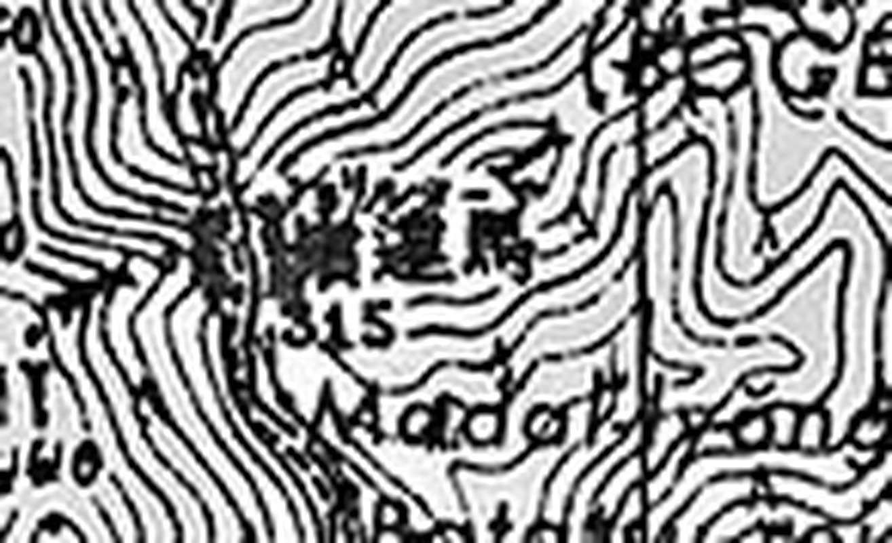 |
| **琵琶嶺** | P'ip'a-ryŏng | Biwa-rei | **1045**/1487 | 남쪽에 `KANGAM-SAN`〔감암산?〕, **남서에 `所好里 Sohori`**(1914년 삼괴리를 이룬 마을) |  |
| **鷄峙** | Kye-ch'i | Kei-ji | **1049/1485** | 서쪽에 `德山 Tŏksan`·`德山里`, **`三槐里`**(삼괴리) — 6.4 |  |
| **望峙** | Mangch'i | Bō-ji | 1030/1477 | 서쪽에 `大洞里`, 동쪽에 `晩木里` |  |
| **墨峙** | Mukch'i | Boku-chi | 1043/1478 | **표고 239.** 남쪽에 `萬仞山 537.1` |  |
| **介峙** | Kaech'i | Kai-ji | 1037/1476 | ~~앞 글자 추정~~ → **2026-10-01 확정**(9배 확대에서 `𠆢` + 두 다리). 서쪽에 `三直川`, 남쪽에 `鶴坪` | 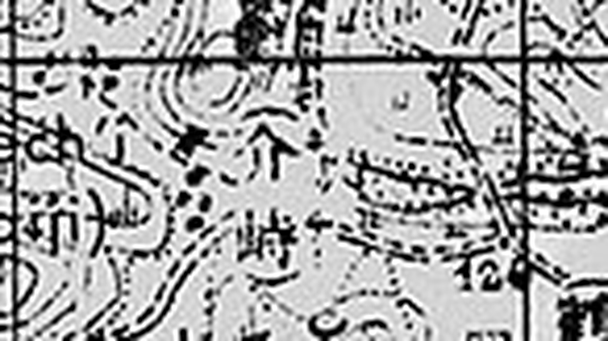 |
| 〔?〕峙 | Chuch'i〔?〕 | Shū-ji | **1027/1475** | **한자 앞 글자 미판독.** 동쪽에 `龍岩` |  |

| **`□峙`** | **P□g-ch'i**〔?〕 | — | **1025/1475** | **2026-10-01 추가 — 여덟째입니다.** 표고 **273**, `五作谷` 바로 남쪽, 도엽 **서남 모서리**. 로마자가 **`P` 로 시작**합니다 |  |

**2026-10-01 에 여덟째가 나왔습니다.** 2026-09-30 의 「고개 일곱」은 **남쪽 띠를 성기게
훑은 결과**였습니다. 새 것은 도엽 서남 모서리(그리드 1025/1475)의 `□峙` 이고,
표고 `273` 이 붙어 있습니다. **한자는 등고선과 겹쳐 갈리지 않지만 로마자가
`P` 로 시작**하므로 첫 글자는 `ㅂ/ㅍ` 소리입니다 — `平`·`屛`·`栢`·`板` 따위로
좁혀집니다. 추측으로 메우지 않습니다.

> **로마자 병기가 한자를 좁혀 줍니다.** `〔?〕峙` 의 한자도 끝내 안 읽혔지만
> 한국어 `Chuch'i`·일본어 `Shū-ji` 가 함께 적혀 있어 **`舟`(シュウ·주)·`州`(シュウ·주)**
> 쯤으로 좁힙니다. 14.1 이 「덧쓴 로마자는 1945년 시점이니 읽기를 그대로 믿지 말라」고
> 경고한 것과 어긋나지 않습니다 — **읽기를 확정하는 데 쓰지 않고, 후보를 줄이는 데만
> 씁니다.**

**고개 이름이 마을 이름이 된 것**도 다섯 보입니다 — `鳥嶺里` · `孟峙里` · `莫峴里` ·
`上莫峴` · `〔?〕峴里`. 고개 자체는 도엽에 따로 표기되지 않았습니다.
2026-10-01 에 **`莫峴里`(1036/1478)·`上莫峴`(1036/1478)** 의 자리를 쟀고,
같은 날 **`孟峙里`(1038/1481)** 도 크롭과 함께 섰습니다.

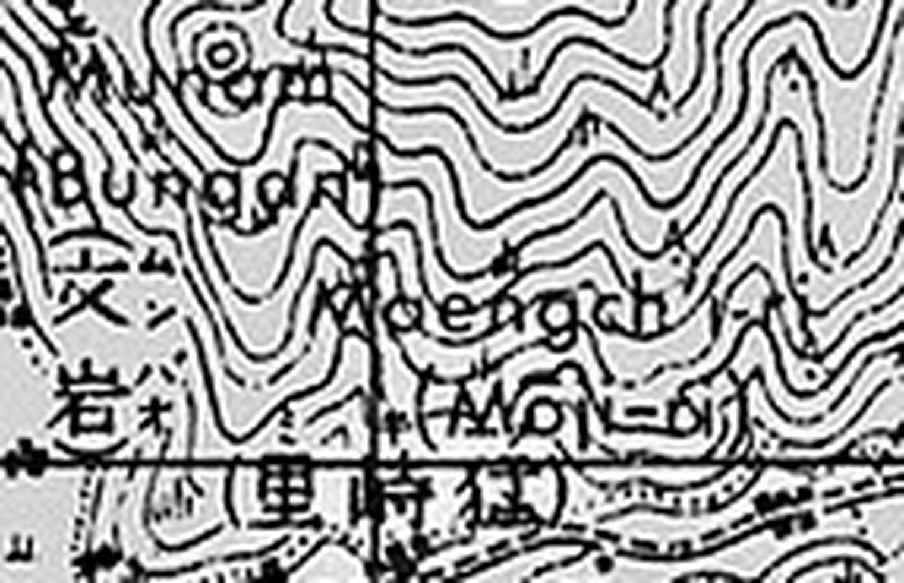

*`孟峙里` — 우횡서로 `(里峙孟)`, 로마자 `Maengch'i-ri`, 일본어 `Mōji-ri`.
곁에 `文岩里`. **대전 중구·서구 남부**입니다.*

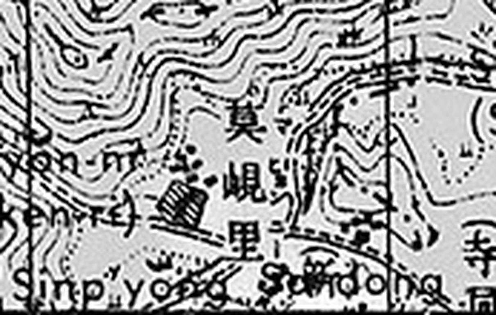

### 14.3 이 도엽이 보탠 것

**`琵琶嶺`·`望峙`·`墨峙`·`介峙`·`〔?〕峙` 다섯은 이 조사에서 처음 나온 고개입니다.**
모두 **자리를 아직 못 댔습니다**(미비정) — 그리드는 도엽 안 좌표일 뿐이고, 오늘의
행정구역으로 옮기는 일이 남았습니다.

**`馬達嶺`은 두 번째 자료가 되었습니다.** 지금까지 근거가 1872년 「옥천군지도」의 `馬達峙`
한 장뿐이었는데(0장 등재 문턱의 「자리를 대는 자료 하나가 모자랍니다」),
**서로 다른 계열의 도엽이 같은 고개를 같은 자리에 적었고 표고 315 m 까지 붙었습니다.**

**`鷄峙`는 6.4 쟁점에 자료를 보탭니다** — 14.4 참조.

#### 2026-10-01 — 남쪽 띠를 다시 훑었습니다

2026-09-30 의 훑기가 **남쪽 띠에서 성겼습니다.** 같은 도엽의 그리드 1474~1479 띠
(= 대전 남쪽 경계 ↔ 금산군 진산면·복수면)를 다시 읽어 넷을 보탰습니다.

- **여덟째 고개 `□峙`**(1025/1475, 표고 273) — 위 표
- **`介峙` 의 첫 글자 확정**
- **`莫峴里`·`上莫峴` 의 자리**(1036/1478)
- **`馬達嶺` 표고 정정 415 → 315**

**그리고 소득 없는 결과가 하나 있습니다.** 이 띠에 **`新` 이 붙은 고개가 없습니다.**
도엽에 **`珍山面`(CHINSAN-MYŎN, 1036/1477)과 `伏壽面`(POKSU-MYŎN)이 걸쳐 있어**
옛 진산군 북부가 이 도엽에 들어 있는데도 그렇습니다. 6.7 의 `新峙`(진산 北面,
만인산 아래)가 **마을 이름으로 남아 있지 않다**는 뜻이고, 그만큼 6.7 을 가르기가
어려워졌습니다. **「없다」고 단정하지는 않습니다** — 같은 날 연기에서 2차 훑기로 넷이
나온 일이 있습니다(12.7.6).

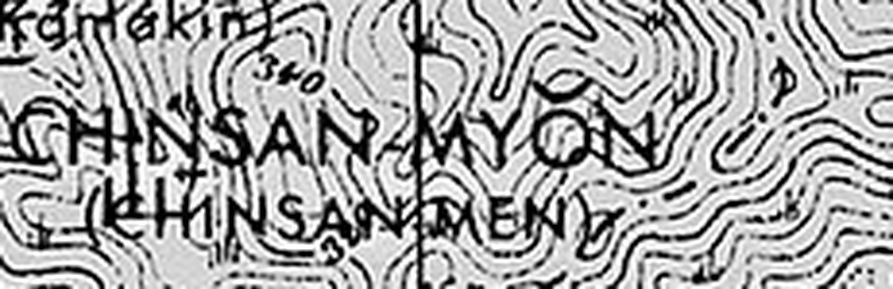

*`CHINSAN-MYŎN (CHINSAN-MEN)` — 옛 진산군이 이 도엽 남쪽 띠에 걸칩니다.*

### 14.4 `馬達` 인가 `馬道` 인가 — 1:250,000 과의 어긋남

같은 미군 계열이라도 **1:250,000 Taejon(L551, J-52-T)**은 이 고개를 **`MADO-RYŎNG`**
으로 적었습니다(6배 확대에서 `M-A-D-O` 자획이 뚜렷합니다). 1:50,000 은 `Madal-lyŏng` 입니다.

**두 도엽의 성격이 다릅니다.**

| | 1:50,000 (L751) | 1:250,000 (L551) |
|---|---|---|
| 만든 방식 | **Copied** — 1919년판을 그대로 베낌 | **Compiled** — 1921·1928·1917~33·1940·1943년 자료를 합침 |
| 1945년 항공사진 수정 | 없음 | **있음** |

1:250,000 에는 한자가 병기되어 있지 않아 이 두 장만으로는 가릴 수 없습니다. 다만 —

- **1872년 「옥천군지도」**는 `馬達峙` (12.4)
- **『조선대전발전지』(1917) 제12장**은 `馬達嶺` 이라 적고 **「그 이름과 같이 말 등(馬背)을
  넘는 것과 비슷한 난소(難所)」** 라고 풀이합니다 — **`達` 쪽과 어울립니다**

> **잠정: `馬達` 이 본디 표기이고, 1:250,000 의 `MADO` 는 합성 과정에서 생긴 이형(異形)으로
> 봅니다.** 다만 **1:200,000 公州(1921)·忠州(1928) 도엽을 확인하기 전까지 확정하지 않습니다.**
> **1:250,000 은 지명 읽기의 1차 근거로 쓰지 않습니다.**

### 14.4-1 **`項洞` — 대전 한복판의 「목」 지명** (2026-10-01)

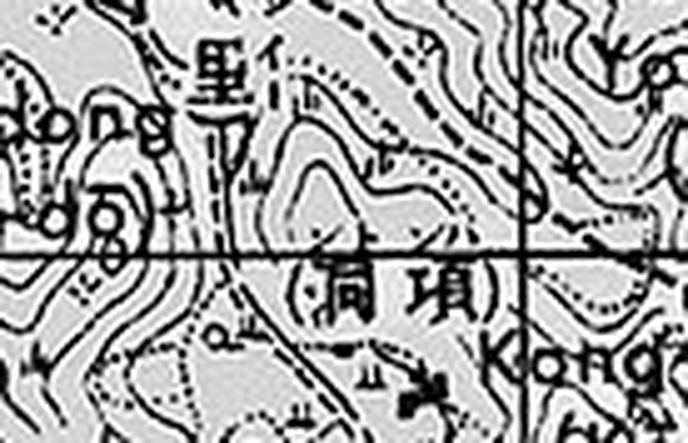

그리드 **1032/1482**, 옛 **`杞城面`**(지금 대전 서구 남부·중구 서쪽) 안입니다.
우횡서로 **`(洞項)`**, 곧 **`項洞`**.

**같은 날 2장에 세운 「`目`·`睦`·`項` 은 우리말 「목」」이 대전 안에서도 확인됩니다.**
진산군에서 넉 자(`目`·`睦`·`項`)로 드러난 그 「목」이 **대전 서구·중구 일대의
마을 이름**으로도 남아 있습니다 — 「항골」입니다.

**다만 로마자가 어긋납니다.** AMS 는 `Kang-dong (Kō-dō)` 로 적었습니다.
`項` 의 한국 한자음은 **항**이므로 `Hang-dong` 이라야 맞고, 일본어 `Kō` 는 `項`(コウ)와
맞습니다. **한국어 쪽이 `Kang` 인 까닭은 모릅니다** — 14.1 이 「덧쓴 로마자는 1945년
시점이라 읽기를 그대로 믿지 말라」고 한 사례가 하나 더 붙은 셈입니다.

#### 진산에도 `項` 이 하나 더 있습니다 — `烏項里` (2026-10-01)

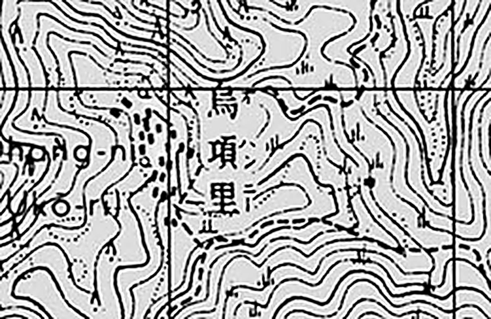

*Kumsan 도엽. 세로로 `烏`·`項`·`里`, 로마자 `Ohang-ni (Ukō-ri)`.*

Kumsan 도엽 그리드 **1036/1467**, 14.5-3 으로 환산하면 **36°06.4′ / 127°22.1′** —
**금산군 진산면 오항리**입니다. 환산값이 오늘 오항리와 거의 겹칩니다.

**이번에는 로마자가 맞습니다** — 한국어 `Ohang`, 일본어 `Ukō`. `項洞` 의 `Kang-dong` 이
전사 오류였다는 쪽을 받칩니다.

> **진산군 한 고을 안에서 `目`(`新目峙`) · `睦`(`思睦峙`) · `項`(`馬項`·`烏項里`) 넷이
> 모입니다.** 2장의 「`目`·`睦`·`項` 은 우리말 「목」」을 **같은 고을 안에서** 받치는
> 사례가 하나 더 늘었습니다. 다만 **`烏項` 의 우리말이 무엇인지는 모릅니다** —
> 한자만으로 「가마목」 따위를 지어내지 않습니다.

### 14.5 **그리드를 읽을 때 틀리기 쉬운 곳** (2026-10-01)


**도엽 테두리는 격자선이 아닙니다.** Taejon 도엽의 아래 테두리는 **북위 36°10′** 이고,
`1475000 yds. N.` 격자선은 **그보다 위**에 있습니다. Kumsan 도엽의 위 테두리도
**같은 36°10′** 이고, `1474` 격자선은 **그보다 아래**입니다. **두 도엽은 그 위도선을
공유**하고, 격자 번호는 1474 와 1475 사이에서 이어집니다.

**테두리를 격자선으로 착각하면 한 칸(1 km)이 어긋납니다.** 2026-10-01 에 실제로
어긋났습니다 — `方峴里` 가 두 도엽 모두에 적혀 있는데(같은 마을입니다) 환산값이
1.5 km 벌어져서야 알았습니다.

#### 환산식 — 2026-10-01 저녁에 다시 재어 고쳤습니다

처음 적은 식은 **격자 두어 칸만 눈으로 재어 기울기를 잡은 것**이라 북쪽으로 갈수록
벌어졌습니다. 이번에는 원본(4,679 × 4,175 px)에서 **격자선을 한 줄씩 다 집어내어**
스무 칸 전체의 간격을 평균냈습니다.

| 도엽 | 환산식 (도엽 폭·높이를 1로 본 좌표 → 그리드) |
|---|---|
| **Taejon 6622 I** | 동경선 `1025 + (x−0.1644)/0.03235` · 북위선 `1494 − (y−0.0519)/0.03624` |
| **Kumsan 6622 II** | 동경선 `1025 + (x−0.1682)/0.031876` · 북위선 `1474 − (y−0.0464)/0.03587` |

**어떻게 얻었나.** 두 도엽 모두 가로 격자선이 **스물한 줄**(스무 칸) 들어 있습니다.
Taejon 은 `y` 0.0519(=**1494**)에서 0.7405(=**1474**)까지, Kumsan 은 0.0464(=**1474**)에서
0.7638(=**1454**)까지입니다. 각 끝의 번호는 도곽 바깥 여백에 찍힌 숫자를 직접 읽어
확인했습니다 — Taejon 북동 모서리의 `1494`, 남동 모서리의 `1476`·`1475`,
Kumsan 북서 모서리의 `1474`, 남동 모서리의 `1454`.

**세로 격자선도 같은 방법으로 셌습니다** — Taejon 은 `x` 0.1644(=**1025**)에서
0.9408(=**1049**)까지 스물네 칸, Kumsan 은 0.1682(=**1025**)에서 스물한 칸입니다.

**한 칸은 1 km 가 아니라 1,000 야드(0.914 km)입니다.** 여백 주기가
`1475000 yds. N.` 이라고 적고 있습니다. 재어 보면 한 칸이 0.92~0.93 km 로 나와
야드 격자와 맞습니다. 이 문서에서 「한 칸」이라 쓴 곳은 모두 1,000 야드입니다.

**이미 적어 둔 값은 그대로 둡니다.** 옛 식과 새 식으로 스물한 건을 모두 다시 계산해
견주었더니 **차이가 가장 큰 곳도 0.5 칸**이었습니다(`鷄峙` 1485.4→1485.0,
`琵琶嶺` 1487.5→1487.0, `項洞` 1482.4→1482.0). 아래 적어 둔 ±0.5 칸 범위 안입니다.

**검산.** 새 식으로 `馬達嶺` 은 1047/1481, `方峴里` 는 두 도엽 모두 1034~1035 / 1474
언저리로 모입니다.

**이 문서의 AMS 그리드 값은 ±0.5 칸으로 읽어 주십시오.** 라벨 가운데를 눈으로
재서 환산한 값이고, 라벨은 대상에서 조금 비켜 놓이는 일이 흔합니다.

### 14.5-1 **도엽의 북쪽 끝은 대전역입니다 — 회덕·계족산은 이 도엽에 없습니다** (2026-10-01)

**도곽 네 모서리의 경위도를 직접 읽었습니다.**

| 모서리 | 적힌 값 | 크롭 |
|---|---|---|
| 북서 | **36°20′ N · 127°15′10″.4 E** | 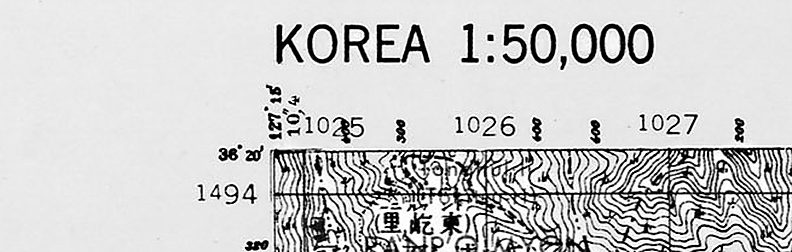 |
| 북동 | **36°20′ N · 127°30′10″.4 E** | 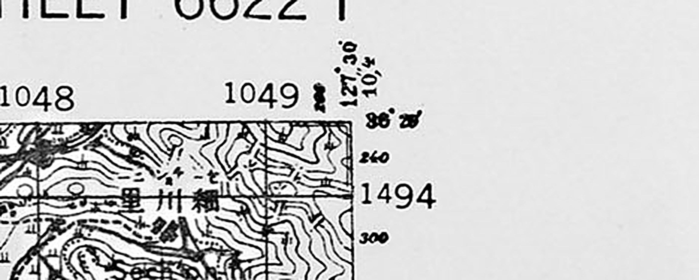 |
| 남동 | **36°10′ N · 127°30′10″.4 E** | 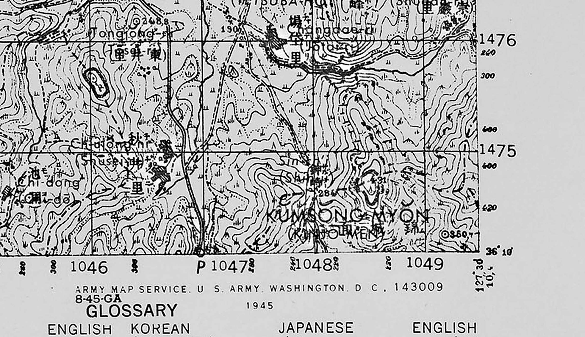 |

> **Taejon 6622 I 은 북위 36°10′~36°20′ · 동경 127°15′10″~127°30′10″ 를 덮습니다.**
> 위도로 **10′**(약 18.5 km), 경도로 **15′**(약 22.4 km)입니다.

**이것이 뜻하는 바가 큽니다.** 대전역이 북위 36°19′56″ 라, **도엽의 위 테두리가 곧
대전역 바로 북쪽**입니다. 위 크롭 세 장과 도엽 북쪽 띠를 나란히 놓고 보면,
시가지가 도곽선에 바짝 붙어 끊깁니다.

> **회덕(36°23′)·계족산(36°23′)·신탄진은 이 도엽 바깥, 북쪽입니다.**
> 2026-10-01 에 「도엽 북쪽 절반을 훑으면 회덕 고개들의 우리말 읽기가 나올 것」이라
> 적었던 것은 **틀렸습니다.** 훑을 북쪽 절반이 애초에 없습니다 —
> 이미 채록한 `琵琶嶺`(1487)·`鷄峙`(1485)가 이 도엽에서 가장 북쪽입니다.

**그러면 회덕은 어느 도엽인가.** 블록 번호 규칙상 바로 위는 **6623 II** 입니다.
그런데 **텍사스대학 소장 목록(367장)에 6623 블록이 통째로 없습니다.** 커먼즈의
AMS 한국 1:50,000 도 그 목록을 옮긴 것이라 마찬가지입니다. 대전에 걸리는 아홉 장을
적어 둔 [`고지도-목록.md`](고지도-목록.md) 의 표에 **북쪽 이웃이 빠져 있던 까닭**입니다.

**회덕 쪽은 AMS 말고 다른 길을 찾아야 합니다** — 1:250,000(L551)에는 들어 있으나
합성도라 연대를 하나로 말할 수 없고(14.4 참조), 1:10,000 계열이나 국토정보플랫폼의
근대 지형도를 보는 편이 낫습니다. 8장 우선순위 4번이 여기에 걸립니다.

### 14.5-2 **커먼즈 3,840 px 벽을 넘는 법 — 원 소장처에서 바로 받습니다** (2026-10-01)

커먼즈 썸네일은 **3,840 px 가 상한**이고 원본 직접 내려받기는 429(과다 요청)로 막힙니다
([`고지도-목록.md`](고지도-목록.md) 참조). 그런데 AMS 도엽은 **커먼즈가 원 소장처가
아닙니다** — 텍사스대학 오스틴 페리-카스타녜다 도서관에서 커먼즈로 옮긴 것이고,
**원 소장처가 같은 파일을 제한 없이 내어 줍니다.**

```
https://maps.lib.utexas.edu/maps/ams/korea_50k/txu-pclmaps-oclc-6612107-<도엽이름>-<번호>.jpg
```

| | 커먼즈 썸네일 | 원 소장처 원본 |
|---|---|---|
| Taejon 6622 I | 3,840 × 3,426 | **4,679 × 4,175** (8.5 MB) |
| Kumsan 6622 II | 3,840 × 3,453 | **4,721 × 4,246** (9.6 MB) |

**가로로 22 % 더 큽니다.** 작아 보여도 이 차이가 글자 판독에서는 큽니다 — 썸네일에서는
획이 뭉쳐 보이던 `峙` 가 원본에서는 **`山` 변과 `寺` 가 갈라져** 보입니다.
아래 14.6 의 `□峙` 는 썸네일로는 글자인지조차 가리지 못했습니다.

**도엽 이름은 같은 디렉터리의 목록 페이지(`.../korea_50k/`)에 다 있습니다.**
한국 1:50,000 은 367장이 올라와 있고, 번호를 알면 이름을 거기서 찾습니다.
파일 이름의 `oclc-` 뒤 번호는 도엽마다 다를 수 있으니 목록에서 그대로 베끼십시오.

### 14.5-3 **그리드를 오늘 좌표로 — 《대전지명지》와 맞춰 보는 다리** (2026-10-01)

14.5-1 로 도곽 네 모서리의 경위도가, 14.5 로 격자 간격이 섰으므로 **그리드를 경위도로
옮길 수 있습니다.** 16장이 「도엽 좌표와 맞춰 볼 일」이라 적어 둔 그 다리입니다.

> **위도** = 36°10′ + (N − **1474.1**) × **0.00830°**
> **경도** = 127°15′10″ + (E − **1024.85**) × **0.01020°**
>
> 두 도엽에 함께 씁니다 — 같은 격자이고 북위 36°10′ 에서 이어집니다.

**검산 셋.** 지도에서 자리가 또렷한 점으로 재어 보았습니다.

| 점 | 환산값 | 오늘 값 | 어긋남 |
|---|---|---|---|
| 대전역 | 36°19.6′ / 127°26.2′ | 36°19.9′ / 127°26.0′ | **0.6 km** |
| 식장산 삼각점(597) | 36°17.9′ / 127°29.0′ | 36°18.1′ / 127°29.0′ | **0.4 km** |
| `墨峙` | 36°12.1′ / 127°26.3′ | **동구 하소동** | 15장의 「먹티(하소동)」와 **합치** |

> **1 km 범위로 읽어 주십시오.** 소수 셋째 자리까지 믿을 값이 아닙니다.
> **동(洞)을 가리는 데 쓰는 값**입니다 — 고개 하나를 짚는 데 쓸 값이 아닙니다.

| 표기 | 그리드 | **오늘 좌표(대략)** |
|---|---|---|
| 馬達嶺 | 1048/1481 | **36°13.6′ / 127°29.2′** |
| 琵琶嶺 | **1045/1487** | **36°16.4′ / 127°27.3′** |
| 鷄峙 | 1048/1485 | **36°15.3′ / 127°29.6′** |
| 望峙 | 1030/1477 | **36°11.5′ / 127°18.5′** |
| 墨峙 | 1043/1478 | **36°12.1′ / 127°26.3′** |
| 介峙 | 1037/1476 | **36°10.8′ / 127°23.0′** |
| 〔?〕峙 | **1027/1475** | **36°10.6′ / 127°16.7′** |
| `□峙`(`P…`) | 1025/1475 | **36°10.3′ / 127°15.5′** |
| 孟峙里 | 1038/1481 | **36°13.6′ / 127°23.3′** |
| 項洞 | 1033/1482 | **36°13.9′ / 127°20.0′** |
| `□峙`(진잠, 14.6) | 1030/1491 | **36°18.3′ / 127°18.2′** |
| 海藍峙 | 1047/1472 | **36°09.1′ / 127°28.7′** |
| 月峰峙 | 1042/1468 | **36°07.2′ / 127°25.7′** |
| 松峴 | 1043/1470 | **36°08.1′ / 127°26.3′** |
| 石峴 | 1046/1472 | **36°08.7′ / 127°28.0′** |
| 方峴里 | 1034/1474 | **36°09.7′ / 127°20.9′** |
| 炭峙 | 1038/1473 | **36°09.4′ / 127°23.3′** |

#### 그러면서 그리드 두 건이 바뀌었습니다

**원본에서 격자선을 눈금 삼아** 라벨 자리를 다시 쟀습니다. 넓게 자른 크롭을 눈으로
어림하던 것과 달리, **격자선 두 줄 사이 어디쯤인지**를 보는 방법입니다.

| 표기 | 옛 값 | **새 값** | 차이 |
|---|---|---|---|
| `琵琶嶺` | 1046/1487 | **1045/1487** | 동경선 1.3 칸 |
| `〔?〕峙` | 1029/1476 | **1027/1475** | 동경선 1.6 칸 |

나머지 여섯(`馬達嶺`·`鷄峙`·`望峙`·`墨峙`·`介峙`·`□峙`)과 마을 이름 셋은
**0.6 칸 안에서 맞아** 그대로 둡니다. 어긋난 둘은 모두 **넓은 맥락 크롭**(폭 0.094)으로
어림했던 것이고, 맞은 쪽은 **좁게 자른 크롭**(폭 0.034~0.045)이었습니다 —
**크롭을 좁게 잡는 것이 곧 좌표를 정확히 재는 일**입니다.

#### 덤 — 이 도엽의 라벨 짜임

`〔?〕峙` 를 크게 보다가 알았습니다. **한자 두 자를 세로로 쌓고, 그 오른쪽에 로마자
두 줄(한국어 · 괄호 안 일본어)을 붙입니다.**

```
〔?〕 Chuch'i
 峙  (Shūji)
```

그러니 **`峙` 위의 글자가 곧 첫 글자**이고, 그 오른쪽 로마자가 **그 고개의 읽기**입니다.
14.6 의 진잠 `□峙` 를 다시 볼 때 이 짜임을 기준으로 삼습니다.

### 14.6 아직 못 한 것

- **고개 여덟의 자리를 오늘 행정구역으로 대는 일.** 그리드 좌표만 있습니다
- ~~`介峙` 앞 글자~~ — **2026-10-01 확정**
- `〔?〕峙` 앞 글자(`舟`/`州` 로 좁힘), **새 `□峙` 의 앞 글자**(로마자가 `P` 로 시작) —
  **추측으로 메우지 않았습니다**
- 도엽에서 **하천 고유명 주기는 `甲川`·`新川`·`大川`〔추정〕 셋뿐**이었습니다. `大東川` 주기는
  이 도엽에서도, 1:10,000 에서도 찾지 못했습니다
- 그리드 1032/1487 에서 **한자는 `九峰山` 으로 자획이 확정되는데 겹쳐 찍힌 로마자는
  `SINSŎNBONG`(神仙峯)** 입니다. 둘 다 기록해 두었습니다
- ~~서쪽 절반(그리드 1025~1033)의 중·북부~~ — **2026-10-01 저녁에 훑었습니다.**
  두계·진잠·계룡 일대입니다. 리 이름은 많이 나왔으나(`豆溪里`·`九老谷`·`外金谷`·
  `雙岩里`·`校村里`·`寒泉里`·`九萬里`·`柳川洞`·`東西岩`·`下細洞`·`水回里`·`內三關里`
  따위) **고개 주기는 아래 한 건뿐**이었습니다
- **그리드 1030/1491 (진잠면 북부, `雙岩里` 서쪽)의 `□峙`** — 글자가 `峙` 인 것은
  원본에서 `山` 변과 `寺` 가 갈라져 보여 확정했으나, **앞 글자를 읽지 못했습니다.**
  등고선과 겹쳐 있고, 바로 옆 마을 주기와도 붙어 있습니다. 로마자도 한국어 줄이
  `Sangba…` 로, 일본어 줄이 `(Jōhoku…)`〔?〕 로 읽혀 **둘을 맞추지 못했습니다** —
  맞춘다면 `上北`이겠으나 한국어 줄의 `a` 가 설명되지 않아 **적지 않습니다.**
  세로쓰기인지 가로쓰기(우횡서)인지도 가리지 못했습니다.
  **고개 수에 넣지 않았습니다** — 3장에도 올리지 않습니다
  <br>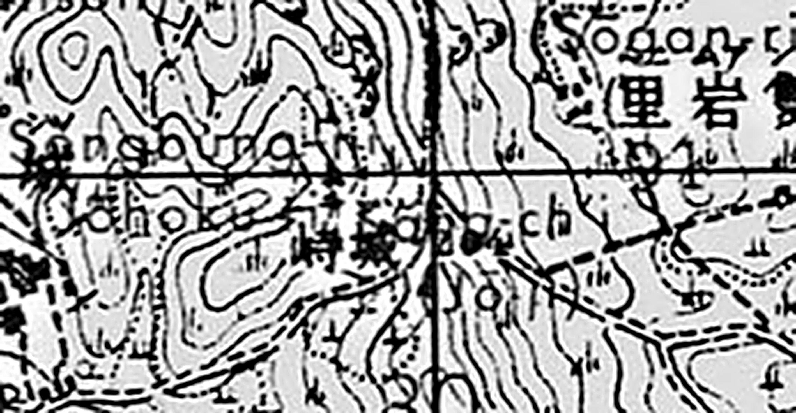

  **자리는 꽤 좁혀집니다.** 14.5 의 새 환산식과 14.5-1 의 도곽 경위도로 재면
  **북위 36°18′ · 동경 127°18′**, 곧 **오늘 유성구 성북동** 언저리입니다
  (±0.5 칸 ≈ 450 m). 도엽에서 바로 동쪽이 `雙岩里`, 남동쪽이 `校村里` 인 것도 맞습니다.
  그런데 **16.1 의 《대전지명지》 성북동 조에는 고개가 둘(`성재`〔산징이재〕·`읍내재`)
  있고 둘 다 한자가 없습니다.** 로마자 첫 줄이 `S…ngb…`, 둘째 줄이 `(Jōhoku…)` 로
  읽히는 것은 `城北` 을 가리키나, **`城北峙` 라는 이름은 어느 자료에도 없습니다.**
  셋을 맞추는 것은 글자를 읽은 뒤의 일로 둡니다 —
  15.2 에서 자리가 가깝다는 이유로 맞추었다가 틀렸습니다.
  (`奄峴` 은 아닙니다. 1872년 진잠 도엽에서 읍치 **서쪽**인데 이 자리는 읍치 북쪽입니다.)

### 14.7 미군 AMS 1:50,000 「Kumsan」(6622 II) — 진산·복수·추부 (2026-10-01)

**Taejon 도엽 바로 남쪽**입니다. 도곽이 동경선 1025~1049 · 북위선 1454~1474 이고,
**옛 진산군이 통째로 들어 있습니다** — `珍山面`(1036.5/1471) · `伏壽面` · `秋富面` ·
`錦城山` · `五臺山`. **만인산(1043/1477)은 이 도엽 북쪽 테두리 바깥**이라 Taejon 쪽입니다.

전면 훑기는 아직 못 했고, 진산 두 계열과 맞춰 보려고 북쪽 띠만 읽었습니다.
**거기서 둘이 나왔습니다.**

| 한자 | AMS 로마자 | 그리드 | 무엇인가 | 크롭 |
|---|---|---|---|---|
| **`方峴里`** | Panghyŏn-ni / Hōken-ri | **1034.2/1473.5** | **`方古峙` 의 오늘 자리** |  |
| **`炭峙`** | 〔탄치〕 | **1038.2/1472.8** | 1872년 진산군지도 **기문 고적 조의 `炭峙`** |  |

**① `方古峙` 가 네 자료로 이어집니다.**

| 자료 | 표기 |
|---|---|
| 『해동지도』 진산군 **기문** | **`方古介`** |
| 『해동지도』 진산군 **그림** | `方古峙` |
| 1872 「진산군지도」 | `方峴` |
| **AMS Kumsan (저본 1919)** | **`方峴里`** |

**마을 이름으로 남았습니다.** 지금 **금산군 복수면 방현리**입니다. 기문의 `方古介` 가
우리말 **「방고개」**의 음차라고 본 것(11.2 ④)과 맞아떨어집니다 —
`介`(개) → `古介`(고개) → `峴`(재).
**3장의 `方古峙` 는 「미비정」을 벗습니다.**

**② `炭峙` 는 기문에만 있던 이름이었습니다.** 1872년 진산군지도 기문 고적 조가
**`炭峙 百濟時置邑於兩峴間 以助關防 備羅兵`**(백제 때 **두 고개 사이**에 읍을 두어
관방을 돕고 신라 병사를 대비했다)이라 적은 그 고개입니다(12.5). **그림에는 없었는데
1919년 지도에 자리가 있습니다** — 진산면과 복수면 사이, `橋村里`·`古村里` 북쪽.

**고갯마루 표고도, 리(里) 글자도 붙어 있지 않습니다.** 마을이 아니라 **고개 그 자체의
이름**으로 적힌 것으로 보이나, 전면 훑기 전이라 확신 `중` 으로 둡니다.

#### 북쪽 띠와 동부를 더 훑었습니다 — 고개 셋이 더 나왔습니다

| 한자 | AMS 로마자 | 그리드 | 표고 | 자리 | 크롭 |
|---|---|---|---|---|---|
| **`海藍峙`** | Haeram-ch'i / Kairan-ji | **1047.0/1472.3** | **280** | 추부면 동부, `上薪里` 남쪽 |  |
| **`月峰峙`** | Wolbong-ch'i / Geppō-ji | **1042.1/1468.2** | **336** | 금성면, `月峯`(498) 북쪽. **2026-10-01 저녁 정정** — 가운데 글자는 `峯` 이 아니라 **`峰`**(`山` 이 왼쪽), 표고는 330 이 아니라 **336** |  |
| **`石峴`** | Sŏkhyŏn / Sekken | **1045.8/1471.5** | — | 추부면, `城底` 동쪽. **1872 금산군지도의 `石峴里`**(12.6) |  |

고개가 아닌 것도 하나 적어 둡니다 — **`鷄元峯`**〔?〕(KYEWŎN-BONG / KEIGEN-hō,
**1047.3/1471.6**, 표고 **353**). **봉우리이지 고개가 아닙니다.** 가운데 글자가 `BONG`
의 `O` 에 가려 `元`/`原` 을 가리지 못했습니다. 6.4 와는 자리가 멉니다(추부면 동부)만,
**이 일대에 `鷄` 지명이 있다**는 사실로 적어 둡니다.

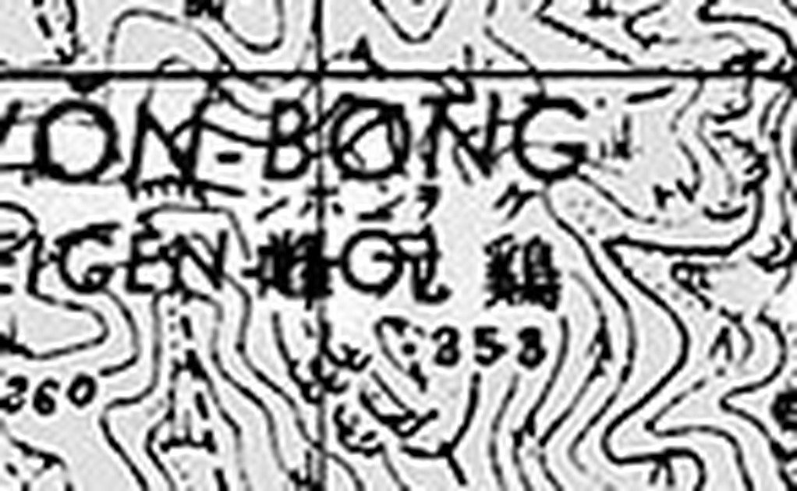

#### **금산군 `西二面` 은 지금의 추부면입니다** — 6.4 의 판단 하나를 뒤집습니다

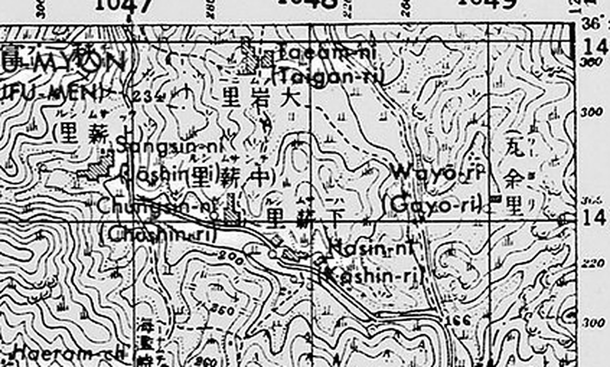

1872년 「금산군지도」가 `薪峙` 둘레에 적은 리 이름들(12.6)을 이 도엽에서 **여섯이나**
찾았습니다.

| 1872 금산군지도 `西二面` | AMS Kumsan (저본 1919) | 그리드 |
|---|---|---|
| `上薪谷` · `下薪谷` | **`上薪里` · `中薪里` · `下薪里`** | 1047~1048 / 1473 |
| `大岩里 二十里` | **`大岩里`** | 1047.9/1473.9 |
| `馬首里` | **`馬首里`** | 1046.3/1472.6 |
| `石峴里` | **`石峴`** | 1045.8/1471.5 |
| `尾余坪 二十里`〔확신 중〕 | **`瓦余里`**(Wayo-ri / Gayo-ri) | 1048.5/1472.6 |

**그러므로 `薪峙` 는 추부면 동부, 1047/1473 언저리입니다.**
6.4 가 「금산군 西二面 은 금산읍 서쪽이어서 AMS 「Taejon」 도엽 남쪽 바깥일 것이고,
곧 만인산 축과 다른 자리」라고 적어 둔 대목을 **철회합니다** — 서이면은 금산읍 서쪽이
아니라 **북서쪽**이고, **만인산–서대산 사이의 바로 그 축**입니다.

> **그러면 네 표기가 한자리에 모입니다.** 해동지도 진산의 동북 `□峙`(`西臺山` 서쪽) ·
> 금산의 `薪峙` · 진산 기문의 `新目峙` · 1872 진산의 `思睦峙` — 넷 다 **만인산 동남,
> 서대산 서쪽의 같은 지대**를 가리킵니다. `新`(신)과 `薪`(신)은 **음이 같습니다.**
> **다만 글자를 맞춘 것은 아닙니다** — 자리가 겹친다는 것까지가 지금 말할 수 있는
> 전부이고, 가르려면 진산 `□峙` 의 첫 글자가 필요합니다(7장).

**`尾余坪` → `瓦余里` 는 후보로만 둡니다.** 1872년 판독이 확신 `중` 이었고,
`尾`(미)와 `瓦`(와)는 음이 다릅니다. 다만 뒤 글자 `余` 가 같고 자리도 맞습니다.

**남은 것** — 이 도엽 전면 훑기(남쪽과 서남쪽은 미착수). 특히 **복수면 북쪽
테두리**(옛 진산군 北面이 공주목 산내면과 닿던 곳)에서 6.7 의 `新峙` 가 마을 이름으로
남아 있는지. 2026-10-01 에 북쪽 띠를 훑었으나 `新` 이 붙은 이름은 **`新村`**(진산면 곁)
하나뿐이었고 고개는 아니었습니다.

#### 14.7-1 진산면 남부·운주면 쪽을 훑었습니다 (2026-10-01 저녁)

원본(4,721 × 4,246)으로 **진산면 남부에서 전라도 운주면까지** 훑었습니다.

| 얻은 것 | |
|---|---|
| **`烏項里`** | 1036/1467 · **36°06.4′/127°22.1′** = 진산면 오항리. **`項` 지명**이라 14.4-1 에 붙였습니다 |
| **`天燈山` 708** | 1031/1464 · **36°04.9′/127°18.8′**. 환산값이 오늘 천등산과 **겹칩니다** — 14.5-3 환산식의 **Kumsan 쪽 검산**이 됩니다<br>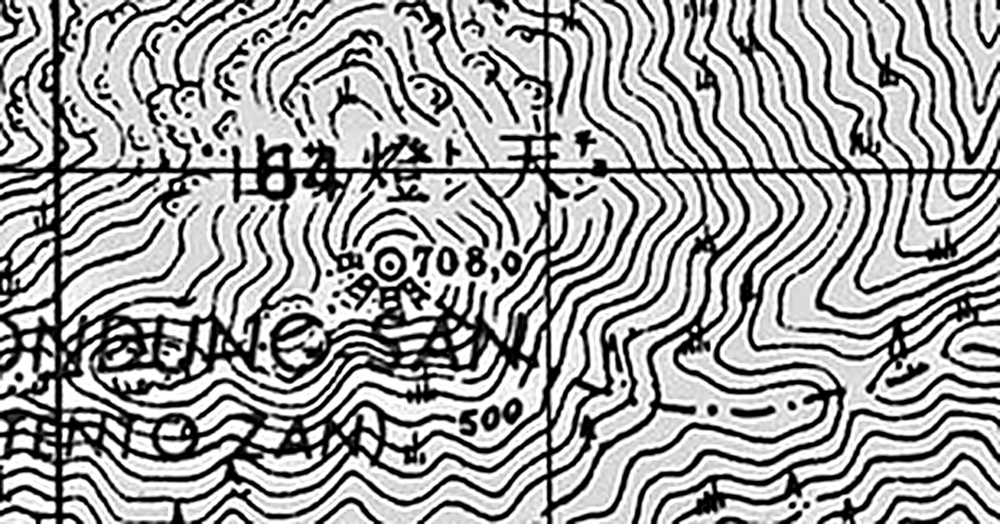 |
| **`梨峙` 374** | 1034/1469 · **36°07.3′/127°20.6′** — 아래 절 참조 |
| 리 이름 | `安心寺`·`山北里`·`石幕里`·`外日陽里`·`乾川里`·`新伏里`·`砥岩`·`花岩山`·`下槐木洞`·`金塘里`·`西坪里`·`玉盃`·`大坪里`·`太古寺`·`大芚山`·`五臺山` |

#### `梨峙` 는 있습니다 — 한 시간 만에 제 말을 되돌립니다

**처음에는 「`梨峙` 주기가 없다」고 적었습니다. 틀렸습니다.**
`天燈山` 둘레만 뒤지고 없다고 한 것인데, **`梨峙` 는 거기서 4 km 북쪽,
`大芚山` 바로 동쪽에 적혀 있었습니다.**

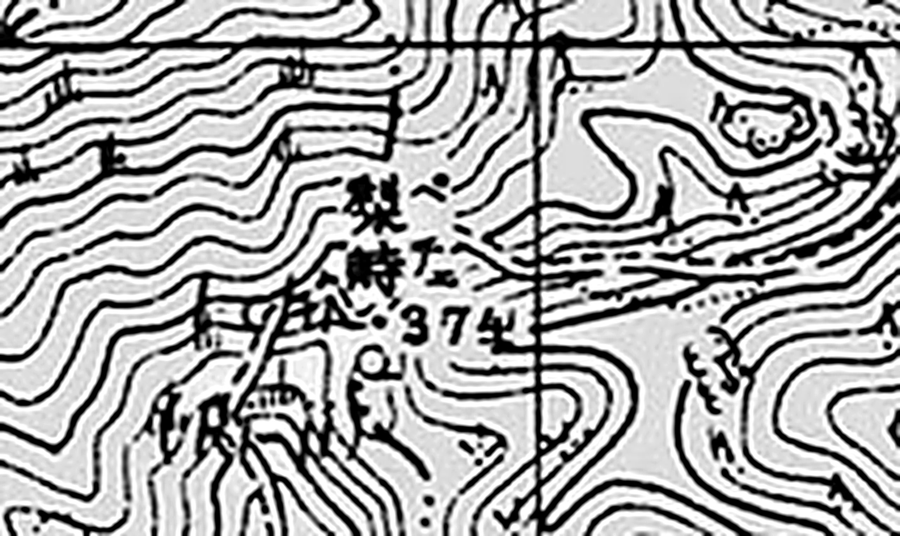

*세로로 `梨`·`峙`, 오른쪽에 가나 `ナシ`·`ヂ`, 아래에 고갯마루 표고 **374**.*

| | |
|---|---|
| 그리드 | **1034/1469** |
| 오늘 좌표(14.5-3) | **36°07.3′ / 127°20.6′** |
| 표고 | **374 m** |
| 곁 | **`大芚山` 877.7 삼각점**이 서쪽 1.7 km(같은 위도), `五臺山` 660 이 북동 |

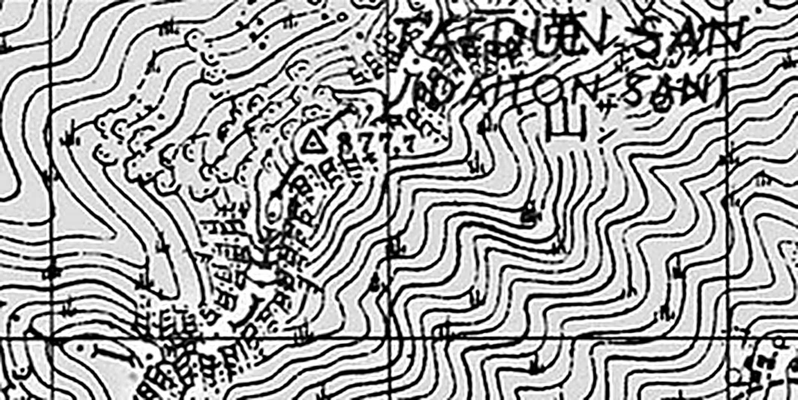

*`大芚山`(DAITON SAN) 877.7 과 `太古寺`. 이 삼각점으로 환산식을 다시 검산하면
**36°07.3′/127°19.4′** 로 오늘 마천대와 0.6 km 안에서 맞습니다.*

**12.5 가 1872년 진산군지도에서 읽은 `梨峙西至全州界十里`(大路)와 이어집니다.**
진산 읍내에서 서남쪽, 전주(완주 운주면) 쪽으로 넘는 큰길의 그 고개입니다.

**곁 지명이 150년을 건너 그대로입니다.** 11.2 는 해동지도 진산군 기문이 `梨峙` 곁에
**`大芚寺`·`五臺山`** 을 적었다고 읽어 두었습니다. AMS 에는 같은 자리에
**`大芚山`·`太古寺`·`五臺山`** 이 있습니다 — 절 이름이 `大芚寺`에서 `太古寺`로
갈리는 것만 빼면 **세 이름이 그대로**입니다. 1750년대 기문과 1917년 측도가
**같은 고개를 같은 이웃으로 둘러싸 적은 셈**이라, `梨峙` 의 자리는 이로써
두 계열이 함께 받칩니다.

> **왜 못 찾았는가 — 기록해 둡니다.** 기억에 있는 배티재 좌표로 자리를 먼저 잡고
> 그 둘레만 봤습니다. **기억한 좌표가 4 km 틀렸고, 그래서 「없다」고 적었습니다.**
> 같은 날 아침에 「`薪峙` 는 AMS 바깥」이라 했다가 옆 도엽을 펴고 철회한 것과
> **똑같은 잘못**입니다. **자리를 짐작해 그 둘레만 보지 말고, 도엽을 띠로 끝까지
> 훑어야 합니다.**

#### 14.7-2 띠로 훑으니 바로 둘이 더 나왔습니다 (2026-10-01 저녁)

위 반성대로 **자리를 짐작하지 않고 도엽을 가로 띠로 잘라** 훑었습니다.
`梨峙` 를 찾은 그 띠(그리드 1468~1471)에서 **고개가 둘 더** 나왔습니다.

| 한자 | 로마자 | 그리드 | 표고 | 오늘 좌표 | 크롭 |
|---|---|---|---|---|---|
| **`松峴`** | — | **1043.1/1470.3** | **247** | **36°08.1′/127°26.3′** |  |
| **`月峰峙`** | Wolbong-ch'i | **1042.1/1468.2** | **336** | **36°07.2′/127°25.7′** |  |

**`松峴` 은 새로 나온 고개**입니다. 세로로 `松`·`峴`, 아래에 표고 `247`.
둘째 글자는 `山` + `見` 이라 **`峴` 으로 확정**합니다(`峙` 가 아닙니다).
**3장에 이미 있는 `松峴` 둘(연기현 서쪽 · 유성 방현동)과는 이름만 같은 다른
고개**입니다 — 15.6 이 유성 `松峴` 을 두고 적어 둔 것과 같은 경우입니다.

**`月峰峙` 는 두 군데를 고칩니다.**

| | 2026-10-01 낮 | **2026-10-01 저녁** |
|---|---|---|
| 가운데 글자 | `峯` | **`峰`** — `山` 이 **왼쪽**에 붙습니다 |
| 표고 | 330 | **336** |

같은 글자의 이체자이지만 **도엽에 찍힌 자형을 적습니다.** 표고는 썸네일에서
`6` 을 `0` 으로 본 것입니다 — 14.5-2 가 적은 **원본과 썸네일의 차이**가
숫자에서도 드러난 사례입니다.

#### 14.7-3 금산읍 북쪽 띠 — `雲峙` 와 `飛峰峙` (2026-10-01 저녁)

같은 방법으로 그리드 1465~1468 띠를 훑어 **금산읍 바로 북쪽에서 고개 둘**을
찾았습니다. 서로 **0.7 km** 떨어져 나란히 있습니다.

| 한자 | 한국어 | 일본어 | 그리드 | 오늘 좌표 | 크롭 |
|---|---|---|---|---|---|
| **`雲峙`** | **Unch'i**(운치) | Unji | **1047.9/1467.2** | **36°06.6′/127°29.3′** | 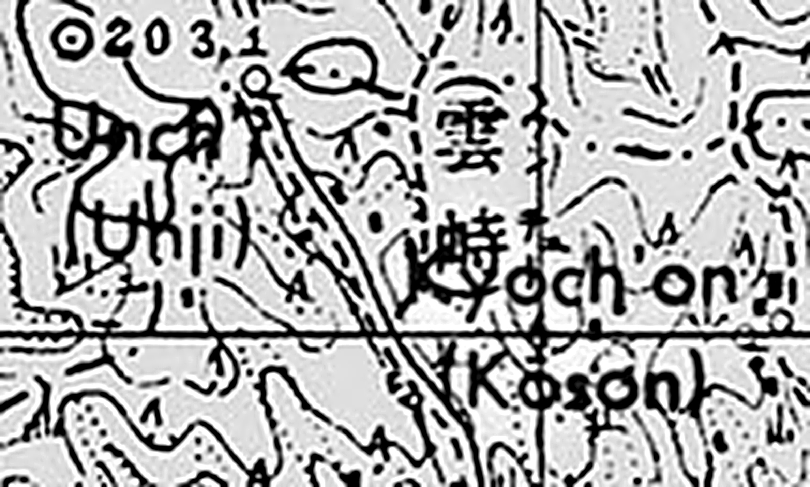 |
| **`飛峰峙`**〔?〕 | **Pibong-ch'i**(비봉치) | Hibō-ji | **1048.7/1467.2** | **36°06.6′/127°29.8′** | 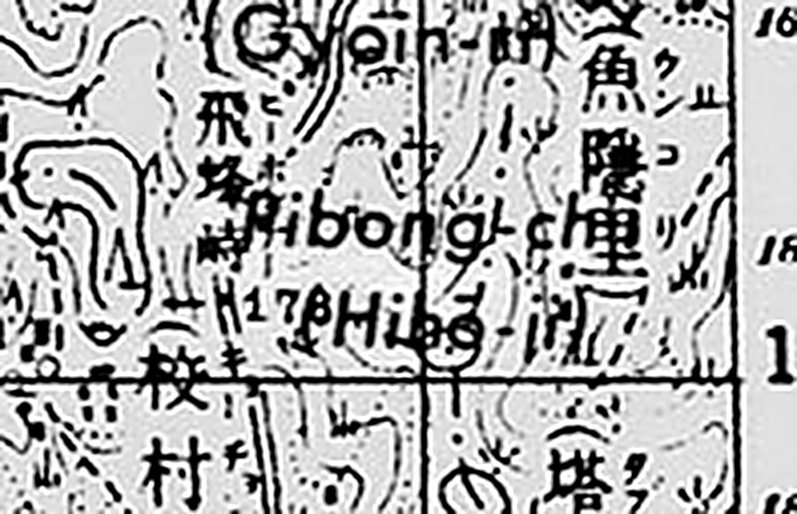 |

**`飛峰峙` 의 가운데 글자는 `峰` 으로 읽었으나 `鳳` 일 여지를 남깁니다.**
자획은 `山` 이 **왼쪽**에 붙어 `峰` 으로 보이고, 같은 도엽의 `月峰峙` 와 자형이
같습니다. 다만 **일본어 전사 `Hibō` 는 `飛峰`(ヒホウ)과 `飛鳳`(ヒホウ) 어느 쪽에도
맞아** 로마자가 가려 주지 못합니다. 금산에 `飛鳳山` 이 있다는 점도 걸립니다 —
**확신 `중`** 으로 둡니다.

**`雲峙` 는 1872년 연산현지도의 `雲住峙`〔?〕 와 다른 고개입니다.** 연산은 대전
서북이고 이쪽은 금산읍 북쪽이라 **80 리가 넘게 떨어져 있습니다.** 이름이 비슷하다고
묶지 않습니다(12.7.2).

> **이 둘은 3장에 올리지 않았습니다.** 3장의 금산 쪽 줄은 모두 **옛 진산군·금산군
> 서이면**, 곧 대전 남쪽 접경의 고개입니다. `雲峙`·`飛峰峙` 는 **금산읍 북쪽**으로
> 한 걸음 더 멀고, 대전으로 넘는 길이라는 근거가 아직 없습니다.
> **3장에 넣을지는 쓰시는 분이 정하실 일**이라 자료만 여기 적어 둡니다.

#### 14.7-4 금산 남부 — 셋 더 (참고) · 그리고 여기서 멈춥니다 (2026-10-01 저녁)

같은 띠 훑기를 그리드 1461~1463 까지 이어 **고개 셋**을 더 읽었습니다.
**금산군 남일면·남이면**으로, 대전에서 더 멀어집니다.

| 한자 | 한국어 | 일본어 | 그리드 | 표고 | 오늘 좌표 | 크롭 |
|---|---|---|---|---|---|---|
| **`月嶺峙`** | **Wŏllyŏng-ch'i** | Getsurei-ji | 1041.1/1462.2 | **351** | 36°04.1′/127°25.1′ | 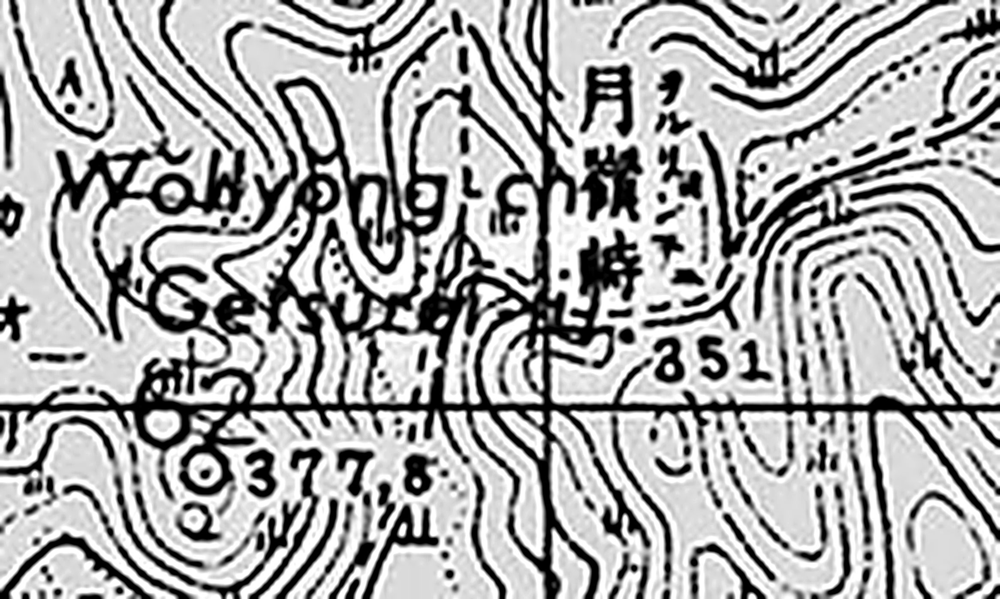 |
| **`立石峙`** | **Ipsŏk-ch'i** | Risseki-ji | 1046.4/1461.6 | — | 36°03.8′/127°28.4′ | 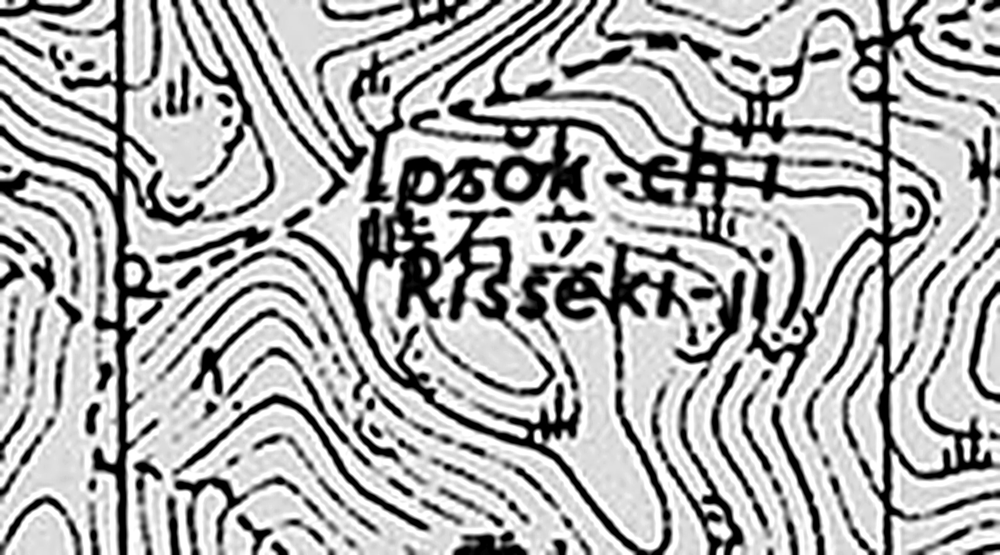 |
| **`芝壯峙`**〔?〕 | — | シサウヂ〔?〕 | 1048.5/1462.9 | — | 36°04.4′/127°29.6′ | 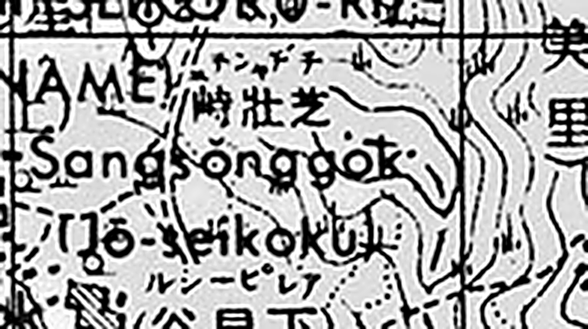 |

**`月嶺峙` 는 `峙` 와 `嶺` 이 한 이름에 겹칩니다.** 11.6.7 이 해동지도 이산현의
**`板峙嶺`** 을 두고 「`峙` 와 `嶺` 이 겹친 드문 표기」라 적어 두었는데,
**둘째 사례**입니다. 로마자 `Wŏllyŏng-ch'i` 가 `嶺`(령)과 `峙`(치)를 **둘 다 소리내어**
적고 있어, 적어도 1945년 전사자에게는 **한 이름의 두 음절**로 들렸습니다.

**`芝壯峙` 는 확신 `중`** 입니다. 한자는 우횡서로 `芝`·`壯`·`峙` 로 읽히고 위에 붙은
가나가 `シ`·`サウ`·`ヂ` 로 보이나, **한국어 로마자가 없어 받쳐 줄 것이 없습니다.**
`壯` 은 `庄` 일 여지도 남습니다.

> **Kumsan 도엽은 여기서 멈춥니다.** 남은 남쪽 3분의 1은 **금산군 남이면·부리면과
> 전라도 운주면**이고, 이 조사가 보는 **대전·옛 회덕·진잠·공주목 산내면·진산군**
> 어디와도 닿지 않습니다. **훑으면 고개는 더 나오겠지만 이 표가 쓸 자리가 없습니다.**
> 필요해지면 같은 방법(가로 띠·격자선 눈금)으로 이어 가면 됩니다.
>
> 지금까지 Kumsan 도엽에서 읽은 고개는 **아홉**입니다 —
> `海藍峙`·`月峰峙`·`石峴`·`炭峙`·`梨峙`·`松峴`·`雲峙`·`飛峰峙`〔?〕·`月嶺峙`
> (`立石峙`·`芝壯峙`〔?〕 를 넣으면 열하나).

### 14.8 **AMS 계열로 얻을 수 있는 것과 없는 것 — 결산** (2026-10-01 저녁)

도엽 넷을 다 받아 도곽을 읽었으므로 **이 계열이 대전을 어디까지 덮는지**가 확정됐습니다.

#### 번호 규칙과 도곽

한 도엽은 **위도 10′ × 경도 15′** 입니다. 번호 `NNNN` 의 **앞 두 자리는 경도 띠,
뒤 두 자리는 위도 띠**이고, 로마 숫자는 **I = 북동 · II = 남동 · III = 남서 · IV = 북서**
입니다. 경도 눈금이 `127°15′10″.4` 처럼 **10″.4 가 붙는 것**은 네 도엽이 모두 같습니다.

| 도엽 | 덮는 범위 | 덮는 곳 | 이 조사에서 |
|---|---|---|---|
| **Taejon 6622 I** | 36°10′~20′ · 127°15′10″~30′10″ | 대전 시가(북쪽 끝)·보문산·식장산·진잠·두계 | **전면 훑기 완료**. 고개 여덟 + `□峙`(진잠) |
| **Kumsan 6622 II** | 36°00′~10′ · 같은 경도 | 진산·복수·추부·금산·운주 | 북부·동부·진산 남부 **훑기 완료**. 고개 열하나. 남쪽 1/3 은 범위 밖이라 멈춤(14.7-4) |
| **Nonsan 6622 IV** | 36°10′~20′ · 127°00′10″~15′10″ | 논산 연산면·벌곡면, 계룡 두마면·신도안 | **동쪽 1/3 을 훑었으나 고개 주기가 하나도 없었습니다** <br>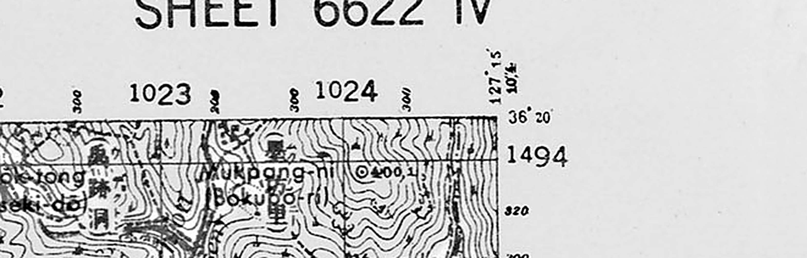 |
| Kanggyong 6622 III | 36°00′~10′ · 127°00′~15′ | 강경 | 조사 범위 밖 |

**Nonsan 도엽에서 읽은 것**은 리 이름뿐입니다 — `連山里`·`天護山`·`天護峰`·`伐谷面`·
`豆磨面`·`新都安`·`山直里`·`沙峰里`·`光石里`·`水落里`·`花岳里`·`石溪里`·`長古山` 따위.
**1872년 연산현지도의 `熊峙` 에 맞물릴 고개 주기는 나오지 않았습니다**(12.7.2).

#### **대전 북부와 옥천 쪽은 이 계열로 볼 수 없습니다**

| 필요한 도엽 | 덮을 곳 | 상태 |
|---|---|---|
| **6623 II** | **회덕·계족산·신탄진**(36°20′ 위) | **텍사스대학 367장에 없음** |
| **6722 IV** | **옥천읍·군서면·군북면**(127°30′ 동쪽) | **없음** |

**둘 다 없습니다.** 그러니 3장의 (미상) 가운데 **회덕 쪽 고개와, 대전 고개들이
넘어가는 옥천 쪽 마을**은 이 계열로는 끝내 확인할 수 없습니다 —
8장 4순위(국토정보플랫폼)가 그 자리를 맡습니다.

> **2026-10-02 정정 — 「끝내」가 지나쳤습니다.** 1:50,000 으로는 못 봅니다. 그러나 같은
> AMS 의 **1:250,000 「NJ 52-14 Taejon」 한 장이 회덕과 옥천을 둘 다 담습니다**
> — [14.9](#149-1250000-nj-52-14-taejon--빈-구역을-메우는-한-장-2026-10-02) 참조.
> 축척이 다섯 배 성기지만 **한자가 붙어 있고 자리를 잴 수 있습니다.**

### 14.8-1 **공주와 청주도 없습니다 — `6623` 네 장이 통째로 빕니다** (2026-10-02)

**번호부터 짚습니다.** 14.8 의 규칙(경도 띠 `66` = 127°00′~30′ · 위도 띠 `23` = 36°20′~40′ ·
`I` 북동 `II` 남동 `III` 남서 `IV` 북서)으로 읍치를 넣으면 이렇게 됩니다.

| 고을 | 읍치 | 도엽 | 텍사스 367장에 |
|---|---|---|---|
| **공주** | 36°26.8′N · 127°07.2′E | **6623 III** | **없음** |
| **청주** | 36°38.5′N · 127°29.3′E | **6623 I** | **없음** |
| 회덕 | — | 6623 II | 없음 (14.8) |
| (공주 북부·유구) | — | 6623 IV | 없음 |

**`6623` 은 네 장이 다 없습니다.** 가진 367장 가운데 이 띠에 든 것이 하나도 없습니다.

#### 충청 일대를 격자로 폈습니다

가진 것과 없는 것을 한눈에 보려고 텍사스 목록 367장을 격자로 폈습니다.
`IV`·`I` 이 북쪽 줄, `III`·`II` 가 남쪽 줄입니다.

| 위도 띠 | `65` (126°30′~127°00′) | `66` (127°00′~127°30′) | `67` (127°30′~128°00′) |
|---|---|---|---|
| **`25`** 37°00′~20′ | Taebu Do IV · Namyang I<br>— · — | Suwon IV · **—**<br>Osan Ni III · Ansong II | Yoju IV · Munmang Ni I<br>— · Mokkye Dong II |
| **`24`** 36°40′~37°00′ | — · — <br>— · — | Pyongtaeng Ni IV · **—**<br>**—** · **—** | Umsong IV · Ch'ungju I<br>— · Koesan II |
| **`23`** 36°20′~40′ | — · —<br>Taechon Ni III · — | **네 장 다 없음**<br>**공주 III · 청주 I · 회덕 II** | **—** · Songni San I<br>**—** · Chongsan II |
| **`22`** 36°00′~20′ | Nampo IV · Puyo I<br>Sochon III · Hamnyol Li II | **Nonsan IV · Taejon I**<br>**Kanggyong III · Kumsan II** | **—**(옥천읍) · Yongdong I<br>Muju III · Solchon II |
| **`21`** 35°40′~36°00′ | Kunsan IV · —<br>Puan III · Kumje II | Kosan IV · Yongdam I<br>Chonju III · Chinan II | Ansongjang IV · Mupungjang I<br>Changgye Ri III · Kochang II |

**`6622` 는 네 장이 다 있고(대전), 바로 위 `6623` 은 네 장이 다 없습니다.** 금강 중류 —
**공주·청주·회덕·조치원** — 이 통째로 빠져 있습니다.

#### 이것이 이 조사에 뜻하는 것

| 고을 | 우리가 읽은 옛 도엽 | AMS 로 받칠 수 있나 |
|---|---|---|
| 회덕현 | 해동지도 · 1872 회덕현지도 | **못 받침** (6623 II 없음) |
| **공주목** | 해동지도 공주목 · 1872 공주목지도 | **못 받침** (6623 III 없음) |
| **청주목** | 해동지도 청주목 · **1872 청주목지도**(면 주기로 고개 여섯 — 12.7.3) | **못 받침** (6623 I 없음) |
| 진잠현 · 금산 · 진산 | 해동지도 · 1872 | **받침** (6622 I·II) |
| 옥천군 | 1872 옥천군지도(`馬達峙`) | **못 받침** (6722 IV 없음) |

**14.8 은 「회덕과 옥천이 빈다」고 적었는데, 실은 공주와 청주도 빕니다.**
이 조사가 읽은 고을 가운데 **AMS 로 자리를 못 박을 수 없는 것이 넷**입니다.
**8장 4순위(국토정보플랫폼)가 맡을 몫이 그만큼 큽니다.**

#### 한 장에 공주와 청주가 함께 든 텍사스 도엽은 **1:250,000 뿐입니다**

| | |
|---|---|
| 도엽 | **NJ 52-14 Taejon** — Korea Series **L552**, 1:250,000, U.S. Army Map Service, 1950- |
| 크기 | 6.8 MB · **5,000 × 3,798 px** |
| 보는 곳 | <https://maps.lib.utexas.edu/maps/ams/korea/> · 커먼즈에도 올라와 있습니다 |

**[14.4](#144-馬達-인가-馬道-인가--1250000-과의-어긋남) 가 1:250,000 에 못을 박아
두었으나, 그것은 다른 도엽(L551 `J-52-T`)이었습니다.** 2026-10-02 에 이 도엽을 받아
보니 **한자가 붉은 글씨로 병기되어 있습니다** — [14.9](#149-1250000-nj-52-14-taejon--빈-구역을-메우는-한-장-2026-10-02)
에서 도곽·내력·첫 훑기를 적습니다.

> **번호로 짐작하지 말고 도곽 모서리를 읽으십시오.** 2026-10-01 에 「Taejon 동쪽이니
> 옥천읍이 있겠다」며 **Yongdong 6722 I** 을 받았는데, 도곽이 **127°45′10″.4~128°00′**
> 이어서 옥천읍은 들어 있지도 않았습니다(청성면·영동 북부입니다).
> **8 MB 를 받고서야 알았습니다.**
>
> 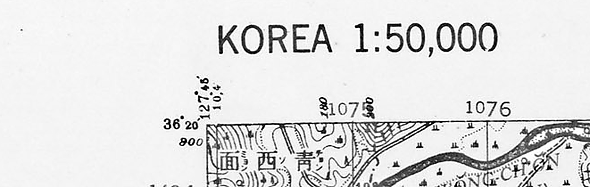


### 14.9 1:250,000 「NJ 52-14 Taejon」 — 빈 구역을 메우는 한 장 (2026-10-02)

**14.8-1 이 적은 `6623` 네 장의 구멍을, 이 한 장이 통째로 덮습니다.**

| | |
|---|---|
| 도엽 | **NJ 52-14 Taejon** · Korea Series **L552** · 1:250,000 |
| 판 | **Edition 4-AMS (First Printing, 5-55)** — 1955년 5월 초판 |
| 만든 곳 | Army Map Service, Corps of Engineers, U.S. Army |
| 받은 곳 | 텍사스대학 PCL · 6.8 MB · **5,000 × 3,798 px** |
| 두는 곳 | 저장소 밖(회원 작업 폴더 `ams_maps/`). 크롭만 [`crops/`](crops/) 에 |

#### 도곽 — **번호로 짐작한 것과 다릅니다**

| 모서리 | 읽은 값 | 크롭 |
|---|---|---|
| **북서** | **127°00′ / 37°00′** | 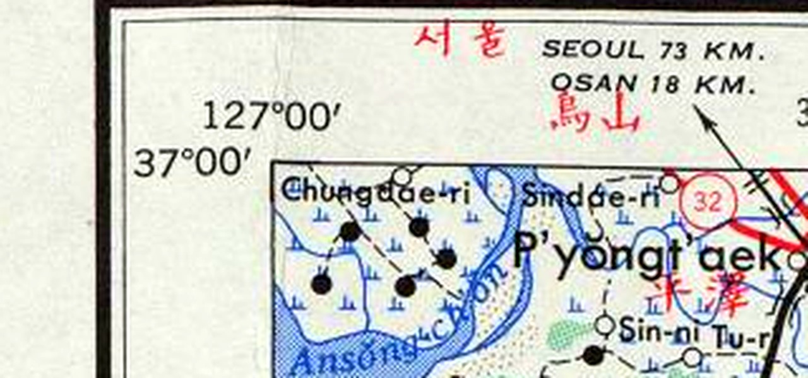 |
| 북동 | **128°30′ / 37°00′** | — |
| **남서** | **127°00′ / 36°00′** | 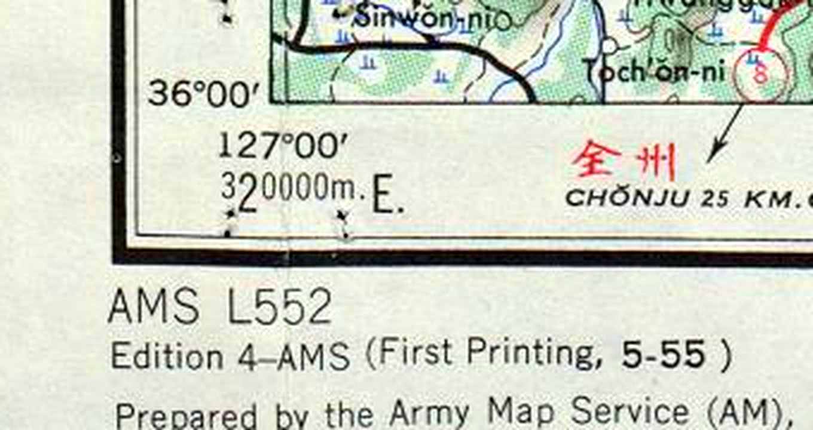 |

**`NJ 52-14` = 36°00′~37°00′N × 127°00′~128°30′E.**

**번호 규칙으로 풀면 127°30′~129° 가 나옵니다 — 1°30′ 만큼 다릅니다.** 14.8 이 적어 둔
「번호로 짐작하지 말고 도곽 모서리를 읽으십시오」가 또 맞았습니다. 색인도의 칸들도
**줄마다 서쪽으로 밀려 있어** 그것으로는 못 가렸습니다. 도엽 범례의
`FORMAT: 1° N-S × 1°30′ E-W south of 40°` 는 **크기만 맞고 자리는 알려 주지 않습니다.**

#### 이 한 장이 덮는 것

| 빠져 있던 도엽 | 덮을 곳 | 이 도엽에 |
|---|---|---|
| `6623 III` | **공주** | **들어 있음** — `[Kongju]` **`公州`** |
| `6623 I` | **청주** | **들어 있음** — `[CH'ŎNGJU]` |
| `6623 II` | **회덕·계족산·신탄진** | **들어 있음** — `Ŭmnae-ri`(읍내리) · `KYEJOK-SAN 399` · `Sint'anjin` **`新灘津`** |
| `6623 IV` | 공주 북부·유구 | 서쪽 끝만 (`YUGU-RI 10 KM` 난외 주기) |
| `6722 IV` | **옥천읍·군서·군북** | **들어 있음** — `Okch'ŏn` |

그 밖에 **조치원 `[Choch'iwŏn]` · 연기 · 보은 · 괴산 · 충주 남부 · 영동 북부**가 한 장에 듭니다.
**대전 본역은 물론 이 조사가 보는 고을이 거의 다 들어옵니다.**

#### 한자가 붙어 있습니다 — 14.4 를 손질합니다

**14.4 는 「1:250,000 에는 한자가 병기되어 있지 않다」고 적었습니다. 그 도엽은
L551 `J-52-T` 였고, 이 도엽은 L552 `NJ 52-14` 입니다.**

이 도엽은 **里·洞·城 이름에 한자를 붉은 글씨로 병기합니다** — `公州` · `新灘津` ·
`寺洞` · `外三洞` · `南谷里` · `壯岩里` · `斗毛里` · `金谷里` · `五龍里` · `鷹院里` ·
`白雲洞` · `梨木里` · `石花里` · `德岩里` 따위. **다만 전부는 아닙니다** — 로마자만
있고 한자가 없는 이름이 훨씬 많습니다.

#### ⚠ **1919년 상태가 아닙니다** — 도엽 주기의 내력

> Compiled in **1953** from Korea, 1:50,000, **AMS, 1946–50**; Korea, 1:50,000,
> **AFFE (64 ETB), 1949–51**. Planimetric detail revised by photo-planimetric methods.
> **Names transliterated in accordance with the McCune-Reischauer System.**

**이것이 14장 전체에서 가장 조심할 대목입니다.**

| | 1:50,000 「Taejon」 6622 I | **이 도엽** |
|---|---|---|
| 만든 방식 | **1919년판을 그대로 베낌**(Copied) | **1953년 편찬**(Compiled) |
| 바탕 | 1919년 일본 1:50,000 | 1:50,000 AMS 1946–50 · AFFE 1949–51 |
| 평면 수정 | 없음 | **항공사진으로 고침** |
| 로마자 | 1945년 덧쓴 것 | **1953년 매큔–라이샤워 전사** |

**그러므로 이 도엽은 「1919년 창」이 아니라 「1950년대 초 창」입니다.**
14장이 「Taejon 6622 I 은 1917년 측도 상태를 보여 준다」고 적어 둔 것이
**이 도엽에는 해당하지 않습니다.** 다만 바탕이 된 1:50,000 AMS(L751)가 1919년판
계열이므로 **이름 자체는 같은 뿌리**일 가능성이 큽니다 — **가능성까지입니다.**

#### 좌표 환산 — 그리드가 아니라 경위도입니다

이 도엽은 1 km 방안이 아니라 **10,000 m UTM 그리드**를 씁니다(난외 `403`·`404`, 본문 `2`~`8`).
간단히는 그림틀 네 모서리로 선형 환산합니다. **그림틀 안쪽 모서리는 픽셀로
(411, 228)~(4083, 3264)** 입니다.

```
경도 = 127.0 + (x_px − 411) / 3672 × 1.5
위도 = 37.0  − (y_px − 228) / 3036
```

> **모서리를 두 번 잡았습니다.** 처음에는 채색 범위로 (410, 216)~(4109, 3263)을 잡았는데,
> 가로세로 비가 **1.214** 로 나와 도엽이 마땅히 가져야 할 비(36.5°N 에서 1°30′ : 1° =
> **1.210**)와 어긋났습니다. 도곽선을 어두운 화소로 다시 찾으니 왼쪽 `411`·아래 `3264` 는
> 또렷하고, 위·오른쪽을 비로 맞추면 `228`·`4083` 이며 **비가 1.2095** 로 맞습니다.

**검산 — 시가(노랑)로 했습니다.** 라벨은 자리가 치우쳐 믿기 어려워, **노랑으로 칠한
시가 덩어리의 중심**을 기계로 뽑아 오늘 좌표와 견주었습니다.

| 시가 | 이 식으로 | 오늘 | 차 |
|---|---|---|---|
| **대전** | 127°25.5′E 36°20.0′N | 127°26.0′ 36°19.9′(대전역) | **0.8 km** |
| 청주 | 127°30.4′E 36°37.8′N | 127°29.3′ 36°38.5′ | 1.9 km |
| 공주 | 127°08.3′E 36°27.9′N | 127°07.2′ 36°26.8′ | 2.5 km |
| 금산 | 127°30.4′E 36°06.2′N | 127°29′ 36°06′ | 2.1 km |

**1~2.5 km 입니다.** 뽑은 칸이 100 px(1.6 km)짜리라 그 몫이 섞여 있으나,
**`A`(±0.1 km)는 어림없고 `B`(±1 km)도 넉넉하게 잡아야 합니다.**
[3.1](#31-위치-대장--좌표를-둘-적습니다-2026-10-01-신설) 에 올릴 때 **`B`** 로 달되
**「1:250,000 환산」임을 비고에 적습니다.**

#### 첫 훑기 — **전면 훑기가 아닙니다**

**2장의 「띠로 훑는다」를 아직 하지 않았습니다.** 공주·청주·회덕·옥천 네 군데만
펴 보았습니다. 그 네 장에서 눈에 띈 고개·재 이름은 다음과 같습니다.

| 로마자 | 자리 | 비고 |
|---|---|---|
| **`Tongsanjae`** — **동산재** | **36°22′N 127°29′E**(±1 km 이상) | **비래리·법동 ↔ 주산리·추동리 사이.** 아래 참조 |
| `Pamjae` (밤재) | 36°24.2′N 127°38.1′E | 옥천 군북·안내 방면. **`栗峙`(6.6)와는 자리가 다릅니다** |
| `Tongjŏngjae`〔?〕 | 옥천읍 북쪽 | 미측정 |
| `Chagojae`〔?〕 · `Tangjae` | 옥천 동부 | 미측정 |
| `Sansoryong-dong` | 대전 남부 | `-ryong` = `嶺` 일 수 있음 |
| `Maengch'i-ri` (맹치리) | 대전 중구·서구 남부 | **14.2 의 `孟峙里`** — 두 도엽이 일치 |
| `Madal-li` (마달리) | 세천 동쪽 | **14.2 의 `馬達里`** — 일치 |
| `Yŏngch'i-ri` · `Mach'i-ri` · `Koch'i-ri` · `Chakch'i` | 연기·청주 일대 | 미측정 |
| `Nohyŏn-ni` · `Yuhyŏn-ni` · `Sanghyŏn-ni` · `Kirhyŏn-ni` | 연기·청주·옥천 | 미측정 |
| **`Ihyŏn-ni`** (이현리) | 대덕구 북부 | **3장 배오개 `梨峴`** 과 맞물립니다 |

**`-jae`·`-ch'i`·`-hyŏn` 이 붙은 이름이 넉넉히 있습니다.** 다만 **대부분 `里` 이름**이고,
고개 자체를 따로 적은 것은 드뭅니다 — 14.2 가 「고개 이름이 마을 이름이 된 것」이라
적은 것과 같은 꼴입니다.

#### `Tongsanjae`〔?〕 — 질티·절고개가 다투는 자리입니다

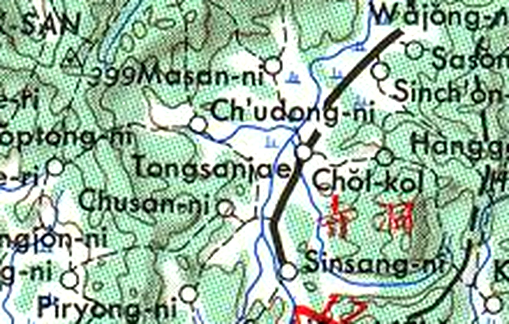

**글자는 `Tongsanjae` — 「동산재」입니다** (2026-10-02 회원 판독).

| | |
|---|---|
| **확인된 것** | **동산재**라는 재 이름이 **36°22′N 127°29′E**(±1 km 이상)에 적혀 있습니다. 둘레에 `Pirae-ri`(비래리) · `Poptong-ni`(법동리) · `Chusan-ni`(**주산리**) · `Ch'udong-ni`(추동리) · `Chŏl-kol` **`寺洞`**(절골) 이 모여 있고, 점선 소로가 그 사이를 지납니다 |
| **아직 아닌 것** | 이것이 질티(`迭峴`)인지 절고개(`龍子庵峴`)인지 비룡동 질티(`陶峙`)인지 **또 다른 고개인지** |

**왜 눈에 띄는가.** 《대전지명지》는 길치고개(`迭峴`)를 **「비래동 댕이 ↔ 동구 추동의
주산(注山)」** 이라 적습니다([5.1](#51-대전지명지1994-고개-323건-2026-10-02-통합)).
**그 두 끝이 이 도엽에 `Pirae-ri` 와 `Chusan-ni` 로 나란히 있고, 그 사이에 재가 적혀
있습니다.** 절고개(`龍子庵峴`)의 두 끝(비래암 ↔ 추동 가래울)도 같은 구역입니다.

**그런데 《대전지명지》에 「동산재」가 없습니다.** 비래동·추동·주산동·비룡동·법동·용운동
여섯 동의 `〔고개〕` 를 다 뒤졌습니다.

| 동 | 《대전지명지》의 고개 |
|---|---|
| 비래동 | 길치고개(`迭峴`) · 길티성재 · 절고개(`龍子庵峴`) · 복호고재 |
| 추동 | 한절고재 · 혼고개 |
| 주산동 | 고용골고개 |
| 비룡동 | 질티(`陶峙`) · 갈고개 · 아랫갈고개 · 윗갈고개 · 바람재 · 바름재 · 방석재 · 지랭이고개 |
| 법동 | 돌고개 · 무너머 · 정문재 |
| 용운동 | 갈고개(갈현) · 백룡고개 · 새울고개 · 성재 · 할딱고개 |

**「동산재」는 하나도 없습니다.** 다만 **법동에 「동산너머」라는 땅 이름**이 있습니다
(「무너머 — 동산너머와 산소골 사이」). 「동산」이 이 일대의 땅 이름인 것은 맞으나,
**법동은 이 재에서 서쪽으로 5 km 가까이 떨어져 있습니다.**

#### 그래서 이 도엽으로는 16.4 를 못 가립니다

**±1 km 가 넘는 오차가 후보들을 갈라 주지 못합니다.** 질티(비래동)·절고개·질티(비룡동)
세 자리가 서로 **2~3 km 안에** 있어, 이 환산으로는 어느 것과도 겹칩니다.

| | |
|---|---|
| **이 도엽이 준 것** | ① **동산재라는 이름 하나** — 1950년대 초에 이 자리에 그렇게 불린 재가 있었다 ② 비래리·주산리·추동리·절골이 **한 자리에 모여 있다**는 그림 |
| **이 도엽이 못 준 것** | 질티가 하나인지 둘인지. **그 일은 1:50,000 이나 현대 지형도의 몫입니다** |

**「동산재」가 《대전지명지》에 없다는 것 자체가 소득입니다.** 1994년 채록이 1950년대
도엽의 이름을 하나 놓쳤거나, 둘이 같은 고개의 다른 이름이거나 — **어느 쪽이든 두
자료를 맞대어야 할 까닭입니다.**

#### 공주와 청주 — 읍치 둘레

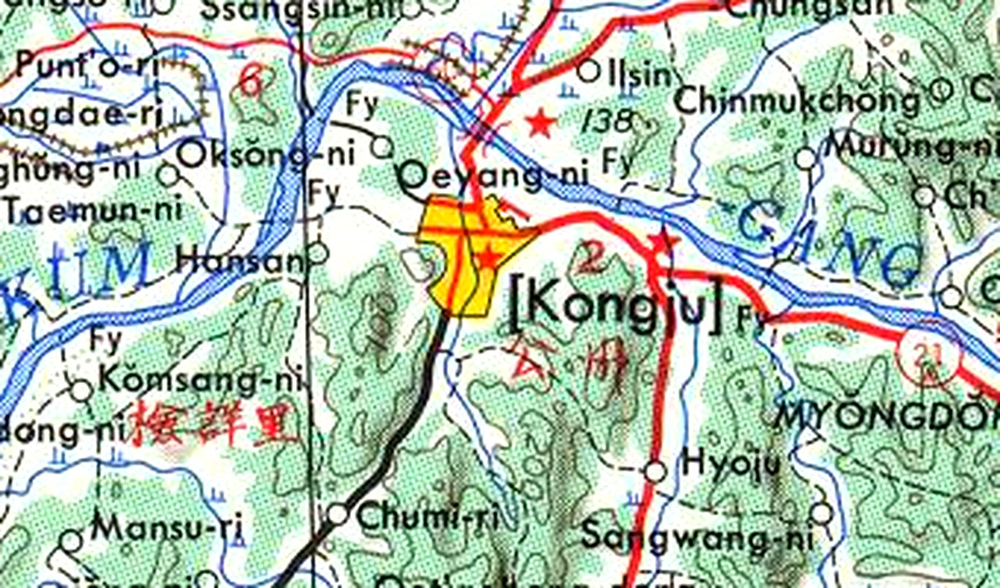
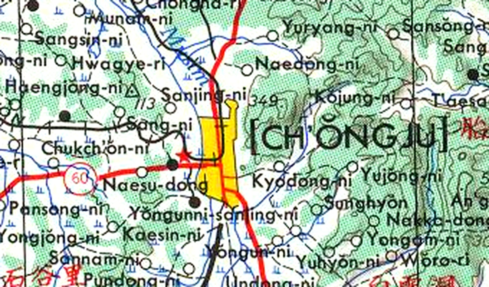

*왼쪽 `[Kongju]` **`公州`** — 금강(`KŬM GANG`)이 읍치 북쪽을 감고 돕니다.
오른쪽 `[CH'ŎNGJU]` — 서남쪽에 `[Choch'iwŏn]`(조치원)과 **`五龍里`**.*

**두 읍치 둘레에서 고개 주기는 아직 찾지 못했습니다.** `Sanghyŏn-ni`·`Yonghyŏn-ni`
(공주 쪽), `Yuhyŏn-ni`·`Sunghyŏn`·`Koch'i-ri`(청주 쪽)가 보이나 **모두 마을 이름**이고,
자리도 아직 재지 않았습니다.

#### 아직 안 한 것

- ~~전면 훑기~~ → **마쳤습니다**([14.9-2](#149-2-전면-훑기--어디까지-보았나-2026-10-02)). **동쪽 3분의 1(127°45′ 동쪽)은 이 조사가 보는 고을과 닿지 않아 뺐습니다** — 14.7-4 와 같은 판단입니다
- ~~`Tongsanjae` 글자 가리기~~ → **동산재로 읽었습니다**(2026-10-02). 다만 **자리를 가리는 데는 이 도엽의 정밀도가 모자랍니다** — 1:50,000 이나 현대 지형도로 넘깁니다
- ~~12.7.3 의 청주목 고개 여섯을 이 도엽에서 찾기~~ → **찾았으나 여섯 다 없습니다**([14.9-1](#149-1-청주목-고개-여섯--이-도엽에-없습니다-2026-10-02))
- **6.6 `栗峙`** — 공주목 구즉면 일대에서 '밤'계 이름을 **전면 훑기에서도 못 찾았습니다**.
  `Pamjae`(옥천 군북)와 `栗里`(연기 전의) 둘이 있으나 **구즉면이 아닙니다**
- **3.1 위치 대장에 올리기** — 자리를 잰 것부터 급 `B` 로

### 14.9-1 청주목 고개 여섯 — **이 도엽에 없습니다** (2026-10-02)

**12.7.3 이 1872년 청주목지도의 면 주기에서 읽은 고개 여섯**(`德峴`·`巨峙`·`弓峴`·
`悅峙`·`開峴`·`栢峴`)을 이 도엽에서 찾았습니다. **여섯 다 못 찾았습니다.**

#### 어떻게 찾았나

**면 주기가 자리를 알려 줍니다.** 1872년 도엽은 면마다 `自邑○距○里` 를 적어 두었으므로,
청주 읍치(**36°38.5′N 127°29.3′E**)에서 그 방향·거리로 구역을 잡았습니다.

| 고개 | 면 | 면 주기 | 오늘 어디쯤 | 편 구역 | 찾았나 |
|---|---|---|---|---|---|
| `德峴` | `南二面` | 邑南 20리 | 청주 서원구 **남이면** | 36°33′ 127°25′ 둘레 (5배 확대) | **없음** |
| `巨峙` | `山內二面` | 邑東 30리 | 청주 상당구 **낭성면** | 36°34′ 127°38′ 둘레 | **없음** |
| `悅峙` | `山內一面` | 邑東 40리 | 청주 상당구 **미원면** | 36°36′ 127°38′ 둘레 | **없음** |
| `弓峴` | `西內二面` | 邑西 40리 | 청주 흥덕구 **옥산·강내** 쪽 | 36°38′ 127°18′ 둘레 | **없음** |
| `栢峴` | `西江外二面` | 邑西 40리 | 〃 | 〃 | **없음** |
| `開峴` | `北江外一面` | 邑北 30리 | 청주 청원구 **오창** 쪽 | 36°45′ 127°29′ 둘레 | **없음** |

로마자로는 `Tŏkhyŏn` · `Kŏch'i` · `Yŏlch'i` · `Kunghyŏn` · `Paekhyŏn` · `Kaehyŏn`
으로 적혔을 것입니다(이 도엽은 매큔–라이샤워 전사).

#### 「없다」가 무엇을 뜻하고 무엇을 뜻하지 않는가

**도엽이 그 수준을 못 담는 것은 아닙니다.** 같은 면의 **1872년 리 이름이 실제로 남아
있습니다.**

| 면 | 1872년 리 목록(12.7.3) | 이 도엽에서 확인한 것 |
|---|---|---|
| `南二面` | 今須 **駕馬** 芦川 岊〔?〕 **德峴** 立岩 **長城** | **`Kama-ri`**(가마리 = 駕馬) · `Changsŏn`〔?〕 <br>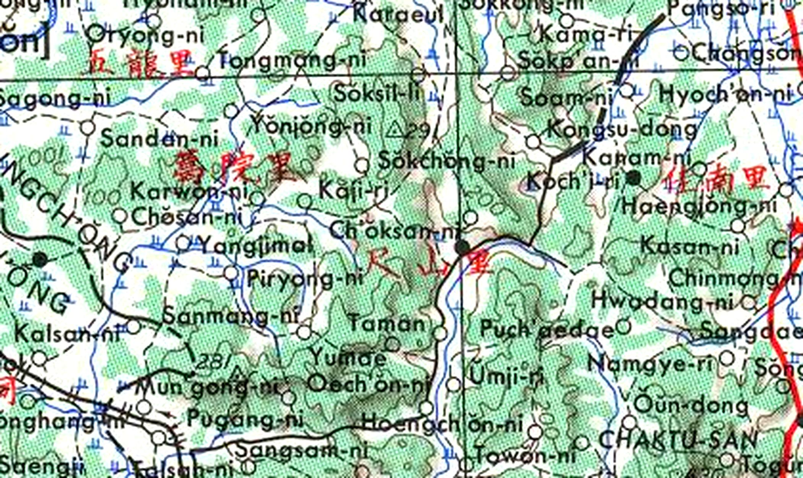 |
| `北江外一面` | **機岩** 農野 塔橋 佳谷 春谷 **開峴** 場德 長城 槍洞 **華山** 院洞 | **`Kiam-ni`**(기암 = 機岩) · **`Hwasan-ni`**(화산 = 華山) |

**그러니 「이 도엽은 리를 안 적는다」는 핑계가 서지 않습니다.** 적힌 리도 있고 안 적힌
리도 있습니다.

| | |
|---|---|
| **확인된 것** | 1:250,000 `NJ 52-14` 에 여섯 가운데 **하나도 없습니다** |
| **아직 아닌 것** | 그 고개들이 **없어졌는지**, 1:250,000 이 **골라 싣느라 빠진 것**인지 |

**두 가지가 섞여 있습니다.**

1. **1914년 행정구역 개편**이 리를 대거 합쳤습니다. 오늘 남이면에 **장성리는 남았으나
   덕현리는 없습니다** — `德峴` 은 그때 다른 리에 합쳐진 것으로 보입니다.
2. **1:250,000 은 마을을 골라 싣습니다.** 같은 면에서도 둘은 싣고 넷은 빼는 식입니다.

**그러므로 이것은 「1872년에 없었다」의 근거가 되지 못합니다.** 1872년 도엽이 리 목록에
또렷이 적어 둔 것이고(12.7.3, 확신 `상`), **이 도엽은 80년 뒤의 다른 지도**입니다.

#### 청주목 조사에 이 도엽이 준 것

**여섯은 못 찾았으나 빈손은 아닙니다.** `6623 I`(청주) 1:50,000 이 없는 터라,
**청주 읍치와 네 면 구역의 자리를 좌표로 잡을 수 있게 된 것**이 소득입니다.
`德峴` 을 다시 찾을 때 **어디를 볼지**가 위 표로 좁혀졌습니다.

**다음은 1:50,000 입니다.** 텍사스대학에 없으므로 **국토정보플랫폼의 구지형도**나
**일본 육지측량부 1:50,000 조선 도엽**(`淸州` 계열)으로 가야 합니다 — 8장 4순위.

### 14.9-2 전면 훑기 — 어디까지 보았나 (2026-10-02)

**2장의 「띠로 훑는다」대로 그림틀을 잘라 보았습니다.** 다 보지는 않았고,
**14.7-4 의 전례대로 이 조사가 보는 어느 고을과도 닿지 않는 구역은 뺐습니다.**

| 구역 | 경위도 | 덮는 곳 | 훑었나 |
|---|---|---|---|
| 서북 | 127°00′~127°23′ · 36°30′~37°00′ | 공주 북부·전의·연기·천안 남부 | **봄** |
| 북 | 127°23′~127°45′ · 36°40′~37°00′ | 진천·증평·청주 북부 | **봄**(청주 북부까지) |
| 중서 | 127°00′~127°23′ · 36°10′~36°30′ | **공주**·유성·구즉·논산 북부 | **봄** |
| 중 | 127°23′~127°45′ · 36°15′~36°40′ | **청주**·조치원·**회덕**·대전·**옥천**·보은 서부 | **봄** |
| 남 | 127°00′~127°45′ · 36°00′~36°13′ | 논산·강경·여산·**금산·진산**·무주 북부 | **봄** |
| **동** | **127°45′~128°30′** | 괴산·보은 동부·상주·영동 동부 | **안 봄** — 이 조사가 보는 고을과 닿지 않습니다 |
| **북동** | 127°45′~128°30′ · 36°40′~37°00′ | 음성·충주 남부 | **안 봄** — 같은 까닭 |

**동쪽 3분의 1을 뺀 것은 14.7-4 에서 「Kumsan」 남쪽 3분의 1을 뺀 것과 같은 판단**입니다.
**보은·회인은 접경 고을이라 서쪽 자락까지는 보았습니다.**

#### 훑기에서 나온 고개·재 이름

**「재」(`-jae`)로 끝나는 땅 이름이 뜻밖에 많습니다.** 1:50,000 도엽에서는 고개 주기가
드물고 대개 `里` 이름뿐이었는데, 이 도엽에는 **고개 그 자체를 가리키는 이름**이 섞여
있습니다.

| 로마자 | 자리 | 비고 |
|---|---|---|
| **`Tongsanjae`** 동산재 | 36°22′N 127°29′E | 대덕 비래↔추동 (14.9) |
| `Kamajae` 가마재 | 36°04′N 127°10′E | 논산 남부·완주 경계 |
| `Kujae` 구재 | 36°03′N 127°17′E | 논산 남부 |
| `Pamjae` 밤재 | 36°24′N 127°38′E | 옥천 군북·안내 쪽. **6.6 `栗峙` 와는 자리가 다릅니다** |
| `Tongjŏngjae`〔?〕 | 옥천읍 북 | 미측정 |
| `Chagojae`〔?〕 · `Tangjae` 당재 | 옥천 동 | 미측정 |
| `Tokkogae` 돌고개 | 청주 동북 | 미측정 |
| `Sijae-gol` 시재골 | 청주 서 | 미측정 |
| `Sansoryong-dong` 산소령동 | 대전 남부 | `-ryong` = `嶺` 일 수 있음 |
| `Ojae-ri` 오재리 | 금산 동 | 미측정 |

**고개 이름이 마을 이름이 된 것**(14.2 가 적은 꼴)은 훨씬 많습니다 —
`Maengch'i-ri`(**孟峙里**) · `Madal-li`(**馬達里**) · **`Panghyŏn-ni`(方峴里)** ·
`Ihyŏn-ni`(**梨峴里**) · `Taech'i-ri`(**大峙里**) · `Chungch'i-ri`(**中峙里**) ·
`Paekhyŏn-ni` · `Kuch'i-ri` · `Songch'i-ri` · `Chakch'i` · `Yŏngch'i-ri` ·
`Mach'i-ri` · `Koch'i-ri` · `Nohyŏn-ni` · `Yuhyŏn-ni` · `Sunghyŏn` · `Hyŏnam-ni` ·
`Hyŏndong-ni` · `Kirhyŏn-ni` · `Sanghyŏn-ni` · `Yonghyŏn-ni` · `Hoch'i-ri` 따위.

#### 3장과 맞물린 것 넷

| 3장의 고개 | 이 도엽에서 | 뜻 |
|---|---|---|
| **`方古介` / `方峴`** (방고개) | **`Panghyŏn-ni`** 36°09.8′N 127°21.3′E <br>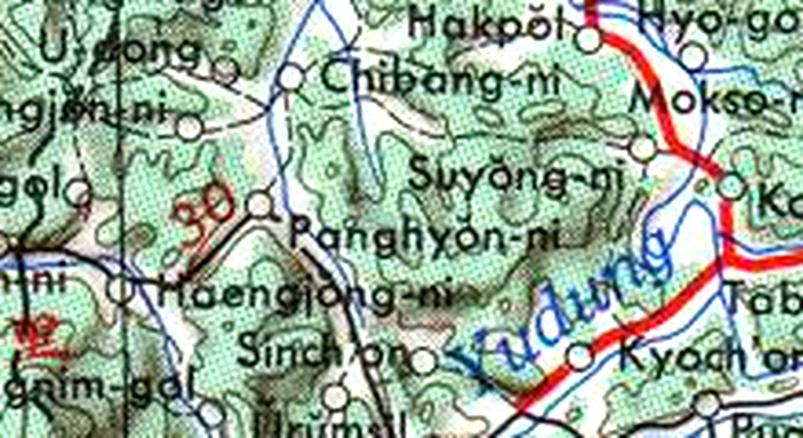 | **금산군 복수면 방현리** — 14.7 의 `方峴里` 와 같은 자리. **두 축척이 일치합니다** |
| **`梨峴`** (배오개) | **`Ihyŏn-ni`** 대덕구 북부 | 3장 배오개와 맞물립니다 |
| `孟峙里` | **`Maengch'i-ri`** 대전 중·서구 남부 | 14.2(1:50,000)와 **같은 이름·같은 구역** |
| `馬達嶺` | **`Madal-li`** 세천 동쪽 | 〃 |

**두 축척이 서로를 받칩니다.** 1:50,000 에서 읽은 것이 1:250,000 에도 같은 자리에
있으면, **제 환산식이 맞게 돌아간다는 검산**이 됩니다.

#### 훑기의 결론 — 이 도엽의 값

| 잘하는 일 | 못하는 일 |
|---|---|
| **1:50,000 이 없는 구역**(공주·청주·회덕·옥천)에 **이름과 대략의 자리**를 준다 | **자리를 못 박는다** (±1~2.5 km) |
| 고을 읍치와 면 구역을 **좌표로 잡아 준다** | 1872년 리 이름을 되찾아 준다 — **80년 사이에 지워졌습니다** |
| **里·洞 한자**를 붉은 글씨로 준다 | 한자를 **전부** 주지는 않는다 |

**다음 한 걸음은 축척입니다.** 이 도엽이 할 수 있는 일은 여기까지이고,
`6623` 네 장의 **1:50,000 을 다른 소장처에서 찾는 일**이 남았습니다(8장 4순위).

### 14.10 **바탕 지도를 OpenStreetMap 에서 받았습니다 — 길이 좁았습니다** (2026-10-02)

[`고개-위치.svg`](고개-위치.svg) 에 바탕을 깔면서 겪은 것을 적어 둡니다. 같은 길을
다시 갈 사람이 헤매지 않게 하려는 것입니다.

**① 래스터 타일은 쓸 수 없습니다.** OSM 의 그림 타일을 `<image>` 로 불러 쓰는 것이
가장 쉬운 길처럼 보이지만, **GitHub 은 `.svg` 를 그릴 때 바깥 자원을 막습니다.**
타일 주소를 적어 두면 빈 자리로 남습니다. 그래서 **벡터로 받아 직접 그렸습니다** —
저장소 안에서 자족하고, 글자가 또렷하며, 판본끼리 차이(diff)도 보입니다.

**② Overpass 공개 서버는 자주 끊깁니다.** 이 작업을 하는 동안
`overpass-api.de` 는 거의 내내 연결이 끊겼고(`Connection reset`),
`overpass.kumi.systems` 는 응답이 없었으며, **`overpass.private.coffee` 만
꾸준히 답했습니다.** `fetch-osm.py` 가 미러 넷을 돌려 가며 열 번까지 다시
묻고, **받은 켜를 `.osm-raw/` 에 쟁여 두어 다시 받지 않는** 것은 이 때문입니다.

**③ 경계는 관계(relation)를 통째로 달라고 하면 안 됩니다.** 도(道) 하나의
경계는 꼭짓점이 수만 개라 공개 서버가 끝내 `504` 로 끊습니다. 관계를 먼저 고른
뒤 **그 멤버 way 중 우리 범위에 걸치는 것만** 달라고 하면 몇 초에 끝납니다.

```
rel[boundary=administrative][admin_level=4](범위)->.r;
way(r.r)(범위);
out geom;
```

**④ 계류(stream)는 둘로 갈라 받습니다.** 한 번에 범위 전체를 달라고 하면 끊깁니다.
북위 36°11.7′ 을 금으로 위아래를 따로 받습니다.

**받아 둔 것은 그림에 쓸 만큼만 추립니다** — 꼭짓점을 더글러스–포이커로 솎고
(1 px 안에서 움직이는 것은 버립니다) 좌표를 소수 넷째 자리(≈10 m)에서 끊습니다.
원본 수백 KB 가 [`배경-osm.json`](배경-osm.json) 한 장으로 줄어듭니다.

---

### 14.11 **지도를 북쪽으로 넓히고 축척을 바로잡았습니다** (2026-10-02)

#### ① 범위 — 대청호까지

전 범위는 북위 36°18′ 에서 끊겨 있었습니다. **급 `A`·`C` 고개가 거의 다 그 북쪽**
(대덕구·유성구)이라 지도에 설 수 없었고, 대청호도 보이지 않았습니다. 이제
**36°05′~36°30′ × 127°13′30″~127°35′** 입니다.

#### ② **세로 축척이 31.5% 눌려 있었습니다**

전 그림은 폭과 높이를 따로 정해 두었습니다. 그래서 가로는 1 px 이 **0.0290 km**,
세로는 **0.0381 km** 였습니다 — **5 km 자는 가로로 잰 것이라, 그 자로 세로 거리를
재면 31.5% 짧게 나왔습니다.** 「등장방형 도법」이라 적어 두고 등장방형이 아니었던
셈입니다.

이제 **높이를 폭에서 끌어내** 둘을 같게 맞춥니다.

```
ph = pw × (위도폭 × 111) / (경도폭 × 111.320 cos φ)
```

**자가 어느 쪽으로 재도 맞습니다.** 자도 범례에서 떼어 그림틀 안으로 옮겼습니다.

#### ③ 도곽을 네모로 그렸습니다 — 급이 갈리는 까닭이 보입니다

그림이 넓어져 AMS 두 도엽이 통째로 들어왔습니다. 전에는 선 몇 개로 긋던 것을
**네모 둘**로 그렸더니 한 가지가 저절로 드러납니다 —
**급 `B` 열여섯이 하나도 빠짐없이 네모 안에 있습니다.** 밖에는 환산할 저본이
없기 때문입니다([14.5-1](#145-1-도엽의-북쪽-끝은-대전역입니다--회덕계족산은-이-도엽에-없습니다-2026-10-01)).
**급이 갈리는 것은 고개의 탓이 아니라 자료의 탓**이라는 것이 그림 한 장에 담깁니다.

#### ④ 큰 것 둘은 Nominatim 에서 받습니다

**대청호와 대전광역시 경계는 Overpass 로 받지 않습니다.** 그 둘은 way 하나가
아니라 토막 수십 개로 쪼개진 **관계**라, 받아서 도로 꿰매야 하고 관계를 통째로
달라고 하면 서버가 끊습니다. **Nominatim 은 같은 OSM 자료를 이미 꿰맨 다각형
하나로 줍니다.**

| | 받은 것 | 솎은 뒤 |
|---|---|---|
| 대청호 | 고리 6 · 꼭짓점 16,828 | 꼭짓점 2,692 (겉 하나 + 섬 다섯) |
| 대전광역시 경계 | 고리 1 · 꼭짓점 2,241 | 꼭짓점 677 |

**섬은 물빛으로 칠하지 않습니다** — 다각형의 첫 고리가 겉, 나머지가 속입니다.
이것을 가르지 않으면 호수 한가운데 섬이 사라집니다.

급 `C` 고개의 동(洞) 중심도 Nominatim 에 물어 얻습니다. **구(區)까지 적어 물으므로**
같은 이름이 여러 구에 있어도 헷갈리지 않습니다 — 삼정동은 대덕구에도 동구에도
있고, 둘은 8 km 떨어져 있습니다.

#### ⑤ 「서버가 죽었다」가 아니라 **내 질의가 틀렸던 것**

한 시간 가까이 Overpass 가 통째로 멎은 줄 알았습니다. 실제로 그날
`overpass-api.de`·`private.coffee`·`kumi` 셋이 함께 멎어 있기도 했지만
(`osm.ch`·`openstreetmap.fr` 는 살아 있었습니다), **진짜 까닭은 따로 있었습니다** —
질의를 띠별로 고쳐 쓰면서 합집합 괄호 안의 **마지막 `;` 를 빠뜨렸습니다.**

```
(way[waterway=river](범위));out geom;     ← 400 parse error
(way[waterway=river](범위););out geom;    ← 맞는 것
```

**그런데 400 의 몸통이 HTML 이라 오류 글이 눈에 띄지 않았습니다.** `urllib` 이
던지는 것은 `HTTP Error 400: Bad Request` 한 줄뿐이고, **무엇이 틀렸는지는 읽지
않은 몸통 안에** 있었습니다. 그래서 틀린 질의를 서버 탓으로 돌리고 미러만 바꿔
가며 한참을 헤맸습니다.

> **고친 것은 질의만이 아닙니다.** `fetch-osm.py` 가 이제 **오류 몸통을 읽어
> `Error:` 줄을 찍습니다.** 다음에 같은 일이 나면 첫 줄에 까닭이 보입니다.
> **남의 서버를 탓하기 전에 그 서버가 보낸 말을 읽을 것** — 2장의 자[尺] 원칙이
> 자료 받는 데에도 그대로 듭니다.

---

## 15. 대전동구문화원 「지명유래」 — 우리말 이름 (2026-10-01)

**지도가 아닙니다.** 대전동구문화원이 동(洞)마다 지명을 모아 놓은 것으로, **고개를
우리말 이름으로 올리고 한자를 괄호에 넣습니다** — 2장이 요구하는 표제어 방식 그대로입니다.

| | |
|---|---|
| 자료 | 대전동구문화원 「동구역사문화 아카이브 > 지역학연구소 > 지명유래」 |
| 주소 | <https://dgcc.or.kr/> (동별 44쪽) |
| 훑은 범위 | **44개 동 전부**에서 `[고개]` 항목을 뽑음 (2026-10-01) |
| 한계 | **동구만** 다룹니다. 유성구는 15.6, 나머지 구는 15.7 |

**10장이 「프록시에 막혔다」고 적어 둔 자료입니다.** 2026-10-01 에 열렸습니다.

### 15.1 한자 고개와 맞물린 것 — 셋

| 우리말 | 한자 | 자료가 말하는 자리 | 우리 기록과 |
|---|---|---|---|
| **지프재** | `琵琶嶺` | **대별동 ↔ 소호동.** 고개 양쪽 바위가 비파처럼 생겨서 | **맞습니다** — AMS `琵琶嶺`(**1045/1487**) 곁이 `所好里` 였습니다(14장). 다만 **자리는 아직 안 맞습니다** — 14.5-3 으로 환산하면 **36°16.4′/127°27.3′** 로, 소호동보다 **2 km 가량 북쪽**입니다. 환산 오차가 1 km 안이므로 **두 자리가 같다고 하기 어렵습니다.** `所好里` 가 곁에 적힌 것과 어긋나는 대목이라 그대로 적어 둡니다 |
| **길치 → 질티** | `吉峙` | **비룡동 ↔ 가양동.** 「고개가 **길고 험하여 길치**라 하였다. 이것이 **질티**로 변하였다」. 곁에 `질티성터(질현성)` | **6.5 가 확인됩니다** |
| **먹티**(묵티·택티) | `墨峙` | **하소동** | **제 비정이 틀렸습니다** — 15.2 |

**`吉峙` 가 가장 큰 소득입니다.** 6.5 는 `吉`·`質`·`迭` 세 표기를 놓고 **「`吉` 은 소리가
다른데 왜 같은 고개인가」** 를 미결로 두었습니다. 이 자료가 **「길고 험하여 길치 → 질티」**
라고 순서까지 댑니다. 다만 **민간 어원일 수 있으므로** 표기 변화의 증거로 삼되
어원으로 단정하지는 않습니다.

**자리는 어긋납니다.** 3장은 질티를 「대덕구 비래동」으로 적어 두었는데 이 자료는
**「동구 비룡동 ↔ 가양동」** 이라 하고 질현성도 그쪽으로 적습니다. **아직 못 가렸습니다.**

### 15.2 `墨峙` = 머들령 비정을 철회합니다

**2026-10-01 에 `墨峙` 를 머들령으로 비정하고 3장으로 올렸습니다. 철회합니다.**

| | |
|---|---|
| 내가 세운 것 | 자리가 머들령과 맞으므로 같은 고개. 로마자 `Mukch'i` 는 1945년에 덧쓴 **한자음**일 것이고 현지에서는 「머들재」라 불렀을 것 |
| 자료가 말하는 것 | `墨峙` 의 우리말은 **「먹티」**(묵티·택티)이고 **하소동**에 있습니다. **머들령은 따로 있습니다** |

**가정이 두 군데서 틀렸습니다.** ① `Mukch'i` 는 한자음 전사가 아니라 **실제 현지 이름
「먹티」** 였습니다. ② 자리가 맞는다는 것에서 같은 고개라고 민 것이 성급했습니다.

**자리가 맞는다고 이름까지 같아지지 않습니다.**

### 15.3 머들령 — 자리가 자료마다 갈립니다

| 자료 | 머들령의 자리 |
|---|---|
| 3장·5장(종전) | 동구 **하소동** ↔ 금산 추부면 마전리 |
| 동구문화원 **신상동** | 「머들령[고개]」. 봉계 남쪽에 머들령고개 |
| 동구문화원 **삼괴동** | 머들령마을·머들령골·머들령날망·머들령성황당·머들령정자·머들령제방. 「대전에서 금산·무주·진안 가는 큰 길목이라 **주막거리**도 있고 번창」 |

**삼괴동 항목은 마달령과 머들령을 같은 것으로 적습니다** — 「마달령 마달산 아래에 있는
높은 고개로 공주말에서 추부면 요강리로 넘어가는 고개 **(머들령, 마달현)**」.

**6.4 는 「마달령과 머들령을 섞지 않습니다」라고 적어 두었습니다. 정면으로 어긋납니다.**
어느 쪽이 맞는지, **머들령이라는 이름이 여러 고개에 걸쳐 있는지** 아직 가리지 못했습니다.
**가릴 때까지 어느 쪽도 지우지 않습니다.**

**2026-10-02 — 《대전지명지》 안에서도 셋으로 갈립니다.**

| 동 | 표제 | 자료가 말하는 자리 |
|---|---|---|
| 동구 **세천동** | **머들령(마달령 `馬達嶺`)** | **세천 서쪽, 증약굴 위** |
| 동구 **삼괴동** | 마달령(머들령·마달현) | 마달산 아래, 공주말 ↔ **금산 추부면 요강리** |
| 동구 **신상동** | 머들령(머들렁) | 봉계 남쪽 |

**세천동 것과 삼괴동 것은 넘어가는 끝이 다릅니다** — 앞은 **옥천**(증약), 뒤는 **금산
추부면**. **한 자료가 같은 이름을 두 고개에 붙이고, 둘 다 마달령이라 적습니다.**
이 자료에는 도면이 없으므로 여기서 더 나아가지 않습니다 —
[5.1 「머들령이 셋입니다」](#머들령이-셋입니다) 참조.

### 15.4 닭재 — 자료가 말하는 자리

> **닭재(계현)[고개]** — 닭산에 있는 고개로서 **덕산 마을의 뒤쪽**에 있다. 산세가 닭의
> 모양처럼 생겼다 하여 붙여진 이름이다.
>
> **닭재성황당** — 닭재를 통하여 **충북 군서면 논골로 넘어가는 곳**이다.

**AMS 도엽과 합치합니다** — `鷄峙`(1049/1485)는 `德山` 동쪽, `郡西面`(옥천) 곁입니다(14장).
**그러나 해동지도와는 어긋납니다** — 해동지도 회덕현은 `雞峙` 를 `珎山界`(진산) 접경에
그렸습니다(11.1). 6.4 의 물음이 그대로 남습니다.

### 15.5 동구 44개 동의 고개

**한자가 붙지 않은 것이 대부분입니다.** 옛 지도의 한자 고개와 맞물리는 것이 더 있을 수
있으므로 그대로 남깁니다.

| 동 | 고개 |
|---|---|
| 가오동·천동 | 언고개 |
| 구도동 | 꼬부랑제 |
| 내탑동 | 능장고개 · 왜점골고개 |
| 대별동 | 노루고개 · 매봉재 · **비파령(지프재)** · 언고개 |
| 대성동 | 정성고개 |
| 마산동 | 서당골 · 성황고개 · 혼고개 |
| 비룡동 | 갈고개 · 바람재 · 바름재 · 윗갈고개 · **질티(길치, 도치)** |
| 사성동 | 대실고개 · 뒷골고개 · 맹골고개 · 송림고개 |
| **삼괴동** | 구단고개 · **닭재(계현)** · 닭재성황당 · **마들령** · 붉은뎅이고개 |
| 삼정동 | 가랑이고개 · 구절고개 · 바람재 · 아래소금재(하염티) · 엄남박이 · 윗소금재 |
| 상소동 | 금돌재 · 말무리재 · 진동재 |
| 세천동 | 장고개 |
| 소호동 | 고모재 · 사라니재 · 삼바골 · 수리램이 · 숙글재 · 숫고개 |
| **신상동** | 갈고개 · 고무재 · 독골재 · **머들령** · 성황재 · 시루고개 · 옹곳재 |
| 신촌동 | 고용재 |
| 오동 | 개티 · 궤티고개 · 당앞고개 · **삽재** · 소골고개 |
| 용운동 | 백룡고개 · 새울고개 · 성재 |
| 이사동 | 고모재 · 돌고개 · **절고개** · 하고개 |
| 장척동 | 금동고개 · 성재 · 성툭 · 큰골고개 |
| 주촌동 | 개티재 · 괴티 · 머기고개 · **삽재** · 새절고개 · 왜정골고개 · 우괴티 · 장고개 · 절재 · 정골고개 |
| **하소동** | 가랭이재 · **묵티고개** · 설동재 · 태봉고개 · 태봉재 |
| 효평동 | 동담재(비람재) |

**이름이 여럿 겹칩니다** — `언고개`(가오·대별·천동), `바람재`(비룡·삼정), `삽재`(오동·주촌동),
`고모재`(소호·이사동), `성재`(용운·장척동), `갈고개`(비룡·신상동), `장고개`(세천·주촌동).
**3장의 `揷峙`(삽재)는 유성구 갑동↔공주 반포인데 동구 오동·주촌동에도 삽재가 있습니다.**
**우리말 이름만으로 같은 고개라고 할 수 없다**는 것을 이 목록이 그대로 보여 줍니다.


### 15.6 유성문화원 「지명유래」 (2026-10-01)

| | |
|---|---|
| 자료 | 유성문화원 「유성의 지명유래」 — <https://yuseong.or.kr/culture/place> |
| 범위 | **동별 55쪽 전부** |
| 성격 | 동구 자료와 달리 **항목 목록이 아니라 줄글**입니다. 고개가 마을 설명 안에 섞여 나옵니다 |

**한자가 함께 적힌 고개 넷이 새로 나왔습니다.**

| 우리말 | 한자 | 자리 |
|---|---|---|
| **장고개 · 노루고개** | `獐峴` | 궁동 — 활골 서쪽, 충남대 정문 앞쪽 |
| **도미재 · 덕미** | `道美峙` | 노은동 — 논골 남서쪽 |
| **솔고개** | `松峴` | 방현동 — 재밑 동남쪽. 「소나무가 우거진 솔고개 아래에 마을이 있으므로」 |
| **중고개** | `中峴` | 둔곡동 — 두니실 서쪽. 「백운사를 찾아가는 중들이 넘어다니던 고개」 |

**`松峴` 은 3장의 `松峙`/`松峴`(연기현 서쪽, 솔재?)과 **다른 고개**입니다.** 이름이 같을
뿐입니다 — 15.5 에서 본 「삽재가 동구에도 유성구에도 있다」와 같은 경우입니다.

**한자가 없는 고개도 여럿입니다** — `덕진재`·`달전재`(둔곡동), `다름고개`(가정동),
`대곡티`(구룡동), `구수고개`(어은동), `엉고개`(방동), `까치골고개`(금고동),
`칼재울`〔도척〕(용계동), `방고개`(방현동 — 동 이름 `坊峴洞` 의 유래).

**`揷峙`(삽재)가 받쳐집니다.** 갑동·덕명동·노은동 세 쪽이 모두 **「유성–삽재고개 정상간
도로(현충원로)」** 를 경계로 듭니다. 3장의 「유성구 갑동 ↔ 공주시 반포면」과 맞습니다.

**`奄峴`·`牛拳峴` 은 나오지 않았습니다.** 둘 다 1872년 진잠 도엽의 것이고 지금 유성구
남부에 해당하는데, 55쪽 어디에도 없습니다. **이름이 끊긴 것으로 보이나, 자료 하나로
단정하지는 않습니다.**


### 15.8 대덕문화원 「전통마을」 (2026-10-01)

| | |
|---|---|
| 자료 | 대덕문화원 「대덕의 역사문화 > 전통마을」 — <https://ddcc.or.kr/> |
| 범위 | **동별 29쪽 전부**에서 `[고개]` 항목을 뽑음 |
| 성격 | 동구 자료와 같은 항목식. **한자를 괄호에 함께 적는 일이 잦습니다** |

#### 질티 — 두 구에 다 있습니다

**15.1 에서 「자리가 어긋난다」고 적어 둔 것이, 양쪽 기록으로 섰습니다.**

| 자료 | 적은 것 | 넘어가는 두 곳 |
|---|---|---|
| **대덕문화원 비래동** | **길치고개**(길티고개, 질티고개, **질현**) | 비래동 **댕이마을 ↔ 동구 추동 가래울·주산** |
| 대덕문화원 비래동 | **길티성재**(길치성재) | 길치골 ↔ 동구 추동 |
| **동구문화원 비룡동** | **질티**(길치, 도치) | 비룡동 ↔ **가양동**. 곁에 `질티성터(질현성)` |

**두 기록이 다 「길치 → 질티」 계열이고, 둘 다 성(城)을 끼고 있습니다.** 같은 고갯길을
양쪽 구에서 각각 적은 것인지, 이름이 같은 다른 고개인지 **아직 가리지 못했습니다.**
다만 **1872년 회덕현지도의 `吉峙`(0.70, 0.26)가 「길치」라는 표기와 곧바로 이어진다**는
것은 양쪽 모두에서 받쳐집니다.

#### 절고개 — 한자가 붙었습니다

> **절고개(비래암고개, 용자암고개, 용자암현 `龍子庵峴`)** — 비래암과 비래암약수터를 지나
> 동구 추동 가래울로 넘어가는 고개

**5장이 「절고개 — 대덕구 비래동, 비래사 위」로 적어 둔 것과 맞습니다.** 한자 표기
`龍子庵峴` 을 얻었으므로 **3장으로 올립니다.**

#### 한자가 붙은 고개 — 새로 여섯

| 우리말 | 한자 | 자리 |
|---|---|---|
| **다롱고개 · 다른고개** | `月峴` | 송촌동 — 금바위와 비래동 옥류각 사이. **송준길·송시열이 비래암을 오갈 때 넘던 고개** |
| **갬재** | `榛峴` | 신대동 — 「개금나무가 많아서」 |
| **찬샴골고개 · 찬샘골고개** | `冷泉峴` | 갈전동 |
| **배오개 · 배고개** | `梨峴` | 이현동 — 배산 아래. 동 이름 `梨峴洞` 의 유래 |
| **덕고개 · 덜골고개** | `德洞峴` / `德谷峴` | 삼정동 — 덕골 ↔ 용호동 |
| **구리고개** | `銅峴`〔?〕 | 미호동 — 지명산 남쪽 |

**`月峴`(다롱고개)이 눈에 띕니다.** 송준길·송시열이 비래암을 오갈 때 넘던 고개라면,
1872년 회덕현지도의 `同春堂`·`飛來菴` 과 한 축입니다([1872-회덕현지도-판독.md](1872-회덕현지도-판독.md)).
**다만 도엽에서 이 고개를 아직 찾지 못했습니다.**

#### 그 밖 — 계족산 능선의 고개들

장동 쪽에 `성재`(계족산 북쪽, 계족산성 남북), `장판재`, `둥굿재`, `섯밧재`, `동소고개`,
`고내미고개`, `이현고개(큰재)` 가 줄지어 있습니다. 부수동·황호동에도 `성재`(성치산성)가
따로 있습니다. **5장의 「능성(계족산성길 구간)」이 이 가운데 하나일 수 있습니다** —
아직 못 가렸습니다.

**`장고개` 가 유난히 많습니다** — 신일동 셋, 장동 넷, 덕암동·상서동·평촌동·용호동·와동.
모두 「장(場) 보러 넘던 고개」입니다. **우리말 이름이 같다고 같은 고개가 아니라는 것을
가장 크게 보여 주는 사례**입니다.

### 15.7 아직 받지 못한 구

| 구 | 자료 | 상태 |
|---|---|---|
| 동구 | 대전동구문화원 「지명유래」 | **완료**(15.1~15.5) |
| 유성구 | 유성문화원 「지명유래」 | **완료**(15.6) |
| 대덕구 | 대덕문화원 「전통마을」(29쪽) | **완료**(15.8) |
| 중구 | 대전중구문화원 「역사와 지명유래」 | **4쪽뿐**(유천·문화·산성·은행선화동)이고 **고개 항목이 없습니다** |
| 서구 | 대전서구문화원 『서구의 마을유래』(2005) | 책입니다. 지역N문화에 원문이 있으나 아직 열지 않았습니다 |
| **전역** | **《대전지명지》(1994)** | **16장** — 다섯 구를 다 덮습니다. 문화원 자료보다 촘촘합니다 |

---

## 16. 《대전지명지》(1994) — 대전 전역의 지명 (2026-10-01 착수)

**8장이 1순위로 꼽은 「한국지명총람」을 대신할 자료를 찾았습니다.**

| | |
|---|---|
| 자료 | **《大田地名誌》** — 大田直轄市史編纂委員會, 1994 |
| 보는 곳 | 대전시립박물관 「대전의 지명」 게시판에 **전문이 올라 있습니다** — <https://www.daejeon.go.kr/his/board/musBoardDataList.do?bbsCode=hisname&menuSeq=669> |
| 분량 | **217쪽**(동 단위) — **다섯 구 전역** |
| 형식 | 동마다 〔위치〕〔유래〕〔연혁〕 뒤에 `<지명>` 목록. 항목마다 **〔고개〕〔골〕〔마을〕〔들〕〔못〕** 따위로 갈래를 달고 **〔위치〕〔유래〕를 따로 적습니다** |

**지명총람과 같은 꼴입니다.** 우리말 이름을 표제로 삼고 한자를 괄호에 넣으며, 자리와
유래를 함께 줍니다. **문화원 자료보다 촘촘하고 대전 전역을 덮습니다.**

### 이 자료로 할 수 있는 일과 할 수 없는 일

**도면이 없습니다.** 〔위치〕가 「○○ 북쪽에 있다」·「○○에서 ○○으로 넘어가는 고개」 같은
**말로 된 상대 서술**이고, 지도도 좌표도 표고도 없습니다.

| 할 수 있는 일 | 할 수 없는 일 |
|---|---|
| **우리말 이름**을 얻는다 | **자리를 못 박는다** |
| **한자 표기**를 얻는다 | 두 기록이 **같은 고개인지 가른다** |
| 넘어가는 두 마을을 안다 | 옛 지도의 어느 표기와 **이어 붙인다** |

**그래서 이 자료는 이름의 출전이지 자리의 출전이 아닙니다.** 이름과 표기는 받아 쓰되,
**같은 고개인지 가리는 판정의 근거로는 쓰지 않습니다.** 가르는 일은 **좌표와 표고가 있는
자료**(14장 AMS 1:50,000, 국토정보플랫폼 현대 지형도)로 합니다.

**3장에서 이 자료만을 출전으로 하는 줄은 확신이 `중` 을 넘지 못합니다.** 자료 하나이고,
그 자료가 자리를 받치지 못하기 때문입니다.

### 16.1 진잠 일대 1차 채록 (2026-10-01)

**서구 남부·유성구 남부 15쪽**에서 `〔고개〕` 항목을 뽑았습니다. 1872년 진잠 도엽의
`奄峴`·`牛拳峴` 을 찾는 것이 목적이었습니다.

| 동 | 고개 |
|---|---|
| **세동** | 벽고재¹·벽고재²(벡고개) · 불당재 · **진티고개(`鎭峙`)** · 홀목재 |
| **봉곡동** | **대고개(댓고개·맑고개, `大峴`)** |
| **대정동** | 강제고개 · 아랫고개 · 윗고개 · 이랭이재(이라재) · 질마고개(서낭댕이고개) · 한우물고개 |
| **원내동** | 소롱재 · 장판재 · **향청재**(鄕廳-, 상청재) |
| **성북동** | 성재(산징이재) · **읍내재**(움내재·학교뒷재) |
| **장안동** | 꽃밭재 · 맥김이재 |
| 교촌동 | 선바위재(선바우재) |
| 오동(五洞) | 장고개 · 중말재 |
| 원정동 | 명마고개 |

**한자가 붙은 것 둘** — `鎭峙`(진티고개, 세동)와 `大峴`(대고개, 봉곡동). 3장에 올립니다.

### 16.2 `奄峴`·`牛拳峴` — 아직 못 찾았습니다

**유성문화원 55쪽(15.6)에 이어 이 15쪽에서도 나오지 않았습니다.**

다만 **진잠 읍치 둘레의 고개 이름이 나왔습니다** — 원내동 `향청재`(향청 있던 자리),
성북동 `읍내재`(움내재·학교뒷재). `奄峴` 이 1872년 도엽에서 **읍치 서쪽**이었으므로
**이 가운데 하나일 수 있습니다.** 다만 **자리가 가깝다는 것만으로 같은 고개라 하지
않습니다** — 15.2 에서 그렇게 해서 틀렸습니다. 도엽 좌표와 맞춰 볼 일입니다.

`牛拳峴` 은 「남 `壯安里` 珍山界 15리」 쪽이었는데, 장안동 쪽 고개는 `꽃밭재`·`맥김이재`
둘뿐입니다. **더 볼 쪽은 흑석동·산직동·용촌동** 입니다.

> **2026-10-02 정정 — 「둘 다 한자가 없다」가 틀렸습니다.** 221쪽을 다시 끊으니
> **`맥김이재(막현리 莫顯里)`** 로 한자가 붙어 있습니다. `牛拳` 과 겹치는 글자는 아니지만,
> **AMS 「Taejon」의 `莫峴里`·`上莫峴`(1036/1478)과 이름이 맞물릴 수 있습니다** —
> [5.1](#莫顯里장안동-와-ams-莫峴里--맞춰-볼-만합니다) 참조. 같은 날 서구 남부에서
> **괴곡동 `仙谷峴`**(선골 ↔ **금산군 복수면 지량리**)도 나왔습니다. **진산계로 넘는 길이
> 이 일대에 둘 이상 있었다**는 뜻이고, `牛拳峴` 을 찾을 구역이 그만큼 좁혀집니다.

**성북동에는 한자 쪽에서 들어오는 실마리가 하나 더 있습니다.** 미군 AMS 「Taejon」
도엽의 **북위 36°18′ · 동경 127°18′**(= 성북동 언저리)에 `□峙` 가 적혀 있습니다.
`峙` 는 확정했으나 앞 글자를 읽지 못했습니다 — [14.6](#146-아직-못-한-것) 참조.
**이 표의 `성재`·`읍내재` 와 맞물릴 자리**이나, 셋을 맞추는 일은 글자를 읽은 뒤로
미룹니다.


### 16.4 221쪽 전부를 받았습니다 (2026-10-01)

**동 221쪽을 모두 받아 `〔고개〕` 항목을 뽑았습니다.**

> **2026-10-02 — 323건으로 고쳤습니다.** 처음 뽑은 **299건**은 항목 경계를 문장 부호로만
> 끊어 **다음 항목 이름이 앞 항목 꼬리에 붙어** 있었습니다. 〔갈래〕 표지를 경계로 삼아
> 다시 끊으니 **323건 · 112개 동**이 되었고, 한자 표기가 붙은 것도 **27 → 35** 로
> 늘었습니다. **고개 목록은 [5.1](#51-대전지명지1994-고개-323건-2026-10-02-통합) 에,
> 전체 이름은 [`대전지명지-고개-이름목록.md`](대전지명지-고개-이름목록.md) 에 있습니다.**

| | |
|---|---|
| 받은 것 | 동별 전문 221개 파일 + 고개 **323건** |
| 둔 곳 | **저장소 밖**(회원 작업 폴더). 아래 「왜 저장소에 두지 않는가」 참조 |
| 뽑는 법 | 본문에서 `…〔고개〕〔위치〕…〔유래〕…` 꼴을 끊어 냄 |

**왜 저장소에 두지 않는가.** 《大田地名誌》는 **1994년 발간이라 저작재산권이 살아
있습니다.** 본문을 통째로 공개 저장소에 올리는 것은 이 문서가 「주의」에 적어 둔
**「자료마다 소장 기관의 이용 조건이 다르다」** 에 걸립니다. **여기에는 우리 고개와
맞물리는 사실만 옮기고 출전을 답니다.**

#### 한자가 붙은 고개 — **서른다섯** (2026-10-02 갱신)

**표는 [5.1](#51-대전지명지1994-고개-323건-2026-10-02-통합) 에 있습니다.**
2026-10-01 에 여기 두었던 **스물일곱 줄**은 동을 못 적은 칸이 일곱이었고(`石峙`·
`大谷峙`·`粉峴`·`道洞峴`·`月谷峴`·`火峙`·`仙谷峴`·`僧跡峴`·`社稷峴`·`鞍峴`),
`松峴` 을 「유성구 방현동 외」로 뭉뚱그렸습니다. **다시 끊으면서 모두 동이 붙었고
여덟이 늘었습니다.** 두 표가 어긋나지 않도록 **5.1 한 곳에만 둡니다.**

#### 질티 — 《대전지명지》는 둘로 세웁니다

**15.1·15.8 의 「자리가 어긋난다」에 자료가 하나 더 붙었습니다.** 《대전지명지》는 둘을
**따로 세우고 한자까지 가릅니다.** 다만 **이것이 「고개가 둘이다」를 증명하지는 않습니다** —
이 자료에는 도면이 없고, 편찬자가 구술을 동별로 나눠 실으면서 한 고개를 둘로 적었을
여지가 남습니다.

| 동 | 표제 | 한자 | 넘어가는 두 곳 |
|---|---|---|---|
| **대덕구 비래동** | 길치고개(길티고개·질티고개) | **`迭峴`** | 비래동 댕이 ↔ **동구 추동 주산**. 경부고속도로 대전터널 북쪽 |
| **동구 비룡동** | 질티(길치·도치) | **`陶峙`** | 비룡동 ↔ **가양동**. 「고개가 길고 험하여 길치」 |

비래동 쪽에는 `길티성재`(돌로 성을 쌓아서)가, 비룡동 쪽에는 `질티성터(질현성)`가
적혀 있습니다. **성 이름도 둘로 적힙니다.**

**둘인지 하나인지는 좌표로 가립니다.** 두 자리는 직선으로 3 km 남짓 떨어져 있어
**현대 지형도에서 두 안부가 따로 잡히는지 보면 결판납니다.** 1872년 「회덕현지도」의
`吉峙`(0.70, 0.26)가 어느 쪽인지도 그때 정해집니다. **3장의 질티 줄은 그때까지 하나로
둡니다.**

#### `沈峴` 이 실재하는 지명으로 나왔습니다

> **자모실고개(탄현 `炭峴`, 침현 `沈峴`)〔고개〕** 〔위치〕옛날 백제의 요충지로
> **충북 옥천군 군북면 자모리**로 넘어가는 고개이다. — 동구 **삼정동**

**6.1 에 곧바로 걸립니다.** 6.1 은 해동지도 회덕현의 그 글자를 **처음에 `沈峴` 으로
읽었다가 확대본을 보고 `于峙嶺` 으로 고쳤다**고 적어 두었습니다. 그런데 **`沈峴` 이
실재하는 고개 이름으로, 그것도 `于峙嶺` 이 있어야 할 자리 언저리에서 나왔습니다** —
`于峙嶺` 은 「식장산 **북쪽**, 회덕현 동북, `沃川界` 안쪽」이고, 삼정동은 식장산 북쪽이며
이 고개는 **옥천 군북면으로 넘어갑니다.**

**그렇다고 처음 판독이 옳았다고 하지는 않습니다.** 자형은 확대본으로 고친 것이고,
이름이 실재한다는 것과 그 도엽의 그 글자가 그것이라는 것은 다른 말입니다.
**다시 볼 까닭이 생겼다는 데까지입니다** — 8장 5순위(해동지도 고해상 원본)의 값이
그만큼 올라갑니다.

`炭峴` 이 함께 적힌 것도 가볍지 않습니다. 백제 탄현 비정은 오랜 쟁점이고, 유성 둔곡동
항목에도 백제부흥군과 함께 `탄현(炭峴)` 이 나옵니다(15.6). **다만 이 조사의 범위를
벗어나므로 기록만 해 둡니다.**

### 16.3 남은 일

- ~~217쪽 가운데 15쪽만 보았습니다~~ → **221쪽 전부를 받았습니다**(16.4)
- ~~한자 고개 스물일곱을 3장과 맞추는 일~~ → **2026-10-02 에 맞췄습니다**([5.1](#51-대전지명지1994-고개-323건-2026-10-02-통합)).
  **서른다섯 가운데 열넷이 새 것**이고, 둘은 문화원 자료와 **동이 어긋납니다**(`安永峴`·`南鵲峴`)
- **새로 들어온 한자 고개 열넷을 옛 지도에서 찾는 일** — `錦洞峴`·`仙谷峙`·`仙谷峴`·`鶴峴`·
  `石峙`·`僧跡峴`·`道洞峴`·`粉峴`·`火峙`·`化峰`·`大谷峙`·`月谷峴`·`社稷峴`·`鞍峴`.
  **지금까지 읽은 어느 도엽에도 없습니다**(AMS 넷 포함)
- **`莫顯里`(장안동) ↔ AMS `莫峴里`(1036/1478) 맞춰 보기** — 맞으면 우리말 이름과 그리드가
  한꺼번에 붙습니다
- `吉峙` 가 `迭峴`(비래동)인지 `陶峙`(비룡동)인지 가리기
- **머들령이 셋인 것** 가리기 — 세천동(증약) · 삼괴동(추부면 요강리) · 신상동(봉계). AMS
  1048/1481 둘레를 다시 봅니다
- **이 자료가 문화원 자료와 어긋나는 데가 있는지** 대조해야 합니다 — 15.8 에서 질티가
  두 구에 다 있었던 것처럼

---

## 17. 자료 안내 — 어디서 보나

**옛 지도는 [`고지도-목록.md`](고지도-목록.md) 에 도엽별로 정리했습니다** — 어떤 도엽이 있고
원문을 어디서 보는지, 위키미디어 공용 링크가 있는지가 거기 있습니다.

지도가 아닌 자료는 다음과 같습니다.

| 자료 | 소장·제공 |
|---|---|
| 여지도서 · 읍지 계열 | 규장각, 한국고전종합DB |
| 조선지지자료 | 국립중앙도서관 |
| 한국지명총람 | 한글학회 |
| **《大田地名誌》(1994)** | 大田直轄市史編纂委員會. **대전시립박물관 「대전의 지명」 게시판에 전문**이 올라 있습니다 — <https://www.daejeon.go.kr/his/board/musBoardDataList.do?bbsCode=hisname&menuSeq=669>. 고개 이름은 [`대전지명지-고개-이름목록.md`](대전지명지-고개-이름목록.md) · **1994년 발간이라 저작재산권이 살아 있습니다** |
| 구(區) 문화원 「지명유래」·「전통마을」 | 대전동구문화원 · 유성문화원 · 대덕문화원 (15장) |
| 미군 AMS 1:50,000 | 텍사스대학 PCL 지도 모음 (14장) |
| 현대 지형도·좌표 | 국토지리정보원 국토정보플랫폼 |

## 18. 함께 조사하려면

- **자료를 하나 보고 오셨으면** 9 표의 상태를 고치고, 얻은 고개를 3장에 줄로 넣고,
  10 대조표의 해당 칸을 채웁니다. 출전(서명·권·쪽 또는 도엽)을 반드시 적습니다.
- **이름만 아는 고개를 아시면** 6에 적어 두십시오. 출전 없이 3에 올리지 않습니다.
- **의견이 갈리면** 6장에 쟁점으로 세우고 양쪽 근거를 다 적습니다. 한쪽을 지우지 않습니다.
- **의론은 이슈에서** 합니다. 문서 안에서 주고받지 않습니다 — 쟁점 하나가 이슈 하나입니다.
  결론이 나면 문서에 반영하고 이슈를 닫습니다.
- **지도 확대 그림**은 `images/` 에 두고 본문에서 겁니다. 이슈 댓글에는 그대로 끌어다
  놓으면 붙습니다. 넣는 규칙은 [`README.md`](README.md) 참조.
- **근거가 갖춰진 건은** `internal` 저장소(비공개)의 Issues → "지명 등재 발의" 서식으로
  넘깁니다. 대장에 오르는 길은 그 절차 하나뿐입니다 — 이 문서에서 대장으로 직접 옮기지
  않습니다. 접근 권한이 없으시면 연구회로 알려 주십시오.

## 19. 변경 이력

**2026-09-03 에 문서를 세 부분으로 개편하고 절 번호를 다시 붙였습니다.** 아래 이력 가운데
그 이전 줄에 적힌 절 번호는 **옛 번호**입니다. 옮겨 간 자리는 이렇습니다.

| 옛 | 새 | | 옛 | 새 |
|---|---|---|---|---|
| 3.1 | 3 | | 4.8 옥천 | 12.4 |
| 3.2 | 5 | | 4.8 진산 | 12.5 |
| 4.1 | 11.1 | | 4.8 금산 | 12.6 |
| 4.2 | 8 | | 4.8 회덕 | 12.1 |
| 4.3 | 9 | | 4.9 | 12.2 |
| 4.4 | 11.2 | | 4.10 | 12.3 |
| 4.5 | 11.3 | | 5.1~5.5 | 6.1~6.5 |
| 4.6 | 12.3 안 | | 6 | 13 |
| 4.7 | 11.4 | | 7 | 10 |
| | | | 8 | 14 |


| 날짜 | 내용 |
|---|---|
| 2026-10-01 | **미군 AMS 1:50,000 「Taejon」 판독(14장 신설)** — 저본이 **1919년 발행 일본 1:50,000**(1917 측도)임을 제작 주기에서 확인. **고개 일곱**을 찾아 3장에 다섯(`琵琶嶺`·`望峙`·`墨峙`·`介峙`·`〔?〕峙`)을 새로 넣고 `馬達嶺`·`鷄峙` 는 기존 줄에 출전을 보탬. **한자 옆에 로마자가 붙어 있어 읽기를 처음으로 알 수 있는 계열**입니다 |
| 2026-10-01 | **`馬達嶺` 에 두 번째 자료가 생김**(6.1) — 1872 옥천군지도 한 장뿐이던 근거에 다른 계열 도엽이 더해지고 **고갯마루 415 m** 가 붙음. 0장 등재 문턱의 「자리를 대는 자료 하나가 모자랍니다」에 해당하는 자료입니다 |
| 2026-10-01 | **`鷄峙` 의 읽기 `Kye-ch'i`(닭재) 확인**(6.4) — 표기가 셋이 됨(`雞峙`·`鷄峴`·`鷄峙`). 다만 세 도엽의 자리를 같은 좌표계에 올려 견주는 일은 남음 |
| 2026-10-01 | **⚠ 이 도엽의 로마자는 1917년 것이 아님을 확인**(14.1) — 저본 한자는 `大寺里`(里)인데 덧쓴 로마자는 `Taeji-chō`(**町**). 지형은 1919년판이나 **지명만 1945년 시점으로 갈아 끼운 것**. 전사 오류 2건(`芙沙里`→`Misa-ri`, `加尺里`→`Kach'ŏng-ni`)도 확인 |
| 2026-10-01 | 3부에 14장이 들어가면서 **자료 안내·함께 조사하려면·변경 이력을 14·15·16 으로 밀었습니다** |
| 2026-09-01 | 문서 개설. 해동지도 회덕현 도엽 채록(고개 6건), 마달령설 검토 |
| 2026-09-01 | 대전 전역 조사표로 확장 |
| 2026-09-01 | `雞峙`=`鷄峴`(1872 진산군)=닭재 동일성 검토 착수(5.4). 회덕–전라도 진산군 접경 사실을 1장에 반영 |
| 2026-09-01 | `internal` 에서 이 저장소 `research/` 로 옮김 |
| 2026-09-01 | `main` 에 병합. 쟁점을 이슈 #4~#8 로 세움 |
| 2026-09-01 | 지도 이미지는 저장소에 올리지 않고 위키미디어 공용 링크로 걸기로 함. 도엽 목록을 [`고지도-목록.md`](고지도-목록.md) 로 분리 |
| 2026-09-01 | 1872년 지방지도 회덕현·진잠·공주목·진산군 도엽 원문 확보 |
| 2026-09-01 | 인접 고을 도엽까지 확보 — 1872년 지방지도로 볼 아홉 고을이 다 갖춰짐 |
| 2026-09-02 | 4.1 을 판독 기록 형식으로 바꿈 — 고개 여섯의 상대 좌표(개략)를 넣음 |
| 2026-09-02 | 해동지도 13종 커먼즈 링크 확보 — 두 지도 계열이 다 갖춰짐 |
| 2026-09-02 | 해동지도 「진산군」 채록(4.4, 고개 8건). `鷄峴` 미발견, 진산 사지에 회덕이 없음 — 5.4 를 다시 엶 |
| 2026-09-02 | 해동지도 「공주목」 1차 채록(4.5). `懷德界` 확인, `山內面` 이 초경 80리·종경 100리로 공주목 동남쪽 끝임을 확인 |
| 2026-09-02 | 공주목 동부 확대본 가채록(4.6) — `柏峴`(?) 이 나와 5.3 에 단서로 붙임 |
| 2026-09-02 | 4.6 의 출전이 1872년 「공주목지도」로 확인됨. 조각 좌표는 여전히 미상 |
| 2026-09-02 | **해동지도 공주목 동부에서 `栗峙` 채록** — 회덕현 밖에서 처음 나온 대전의 고개. `九則面` 확인 |
| 2026-09-02 | 더 큰 조각으로 `栗峙` 의 도엽 좌표를 (0.53, 0.63) ±0.05 로 추정. 면 일곱과 `日新驛` 을 함께 읽음 |
| 2026-09-02 | 진산군 북쪽 경계 확대본 — `新峙` 판독 확정. `公山界` 가 두 번 적힌 것을 확인해 5.4 를 보강 |
| 2026-09-02 | `萬伊山` 이 **만인산(萬仞山)** 임을 확인 — `新峙` 가 대전 동구·금산 경계 고개로 비정됨. 머들령·마전(馬房) 축과 이어짐 |
| 2026-09-02 | 진산군 고개 확대본 여섯 — 판독 확신 `상` 으로 올림, `連山界` 확정, `泥峙` 를 고개 목록에서 뺌(일곱으로) |
| 2026-09-02 | `晩目峙` 의 첫 글자를 확정 못 해 `□目峙` 로 되돌림(확신 `중`). 후보는 `晥`·`晩` |
| 2026-09-02 | 진산군 동북 `沃川界` 아래에서 **여덟째 고개 `□峙` 발견** — 첫 글자에 새(鳥) 변. `鷄` 라면 5.4 가 뒤집힘 |
| 2026-09-02 | `隂泥`(?) 두 글자가 두 고개 곁에 반복 — 지명이 아니라 주기로 판단 |
| 2026-09-02 | 해동지도 「금산군」 착수(4.7). `西臺山` 서쪽 `□峙`(송치/신치). **`鷄峙` 추측을 접음** — 초두를 새 변으로 잘못 봄 |
| 2026-09-02 | 제보 둘 — 질티가 1872년 「회덕현지도」에 나옴, 절고개는 비래사 위. 3.2 를 고침 |
| 2026-09-02 | 태조 태실이 당시 **진산군** 땅이었음을 반영. 진산이 작은 고을로 오래 존속한 배경 |
| 2026-09-02 | 1872년 지방지도 접경 네 도엽 착수(4.8). **「옥천군지도」에서 `馬達峙` 확정** — 마달령이 옛 지도에서 확인된 첫 건, 3.2 → 3.1 로 올림. 5.1 마달령설은 더 약해짐 |
| 2026-09-02 | **1872년 「진산군지도」 북쪽 경계 1차 판독** — 도로 주기에 `懷德`+`峙` 확인, 고개 이름 글자는 미판독. 5.4 의 판정점이 "원본 미확인"에서 "이름 한 글자 미판독"으로 좁혀짐 |
| 2026-09-02 | 1872년 「금산군지도」 西二面에서 `薪峙`·`隘口`·`石峴里` 채록. 1872년 「회덕현지도」 남부에서는 고개 표기를 찾지 못함(훑은 범위를 4.8 에 남김) |
| 2026-09-02 | `crops/` 에 판독 근거 넉 장을 넣음 — 저장소에 조각 그림이 들어간 첫 건 |
| 2026-09-02 | 해동지도와 1872년의 차이를 5.4 에 명시 — 해동지도 진산군은 북쪽을 공주로만 적지만 1872년 진산군지도는 `懷德` 을 적음. "진산 도엽에 회덕이 없다" 논거는 해동지도에 한정 |
| 2026-09-02 | 3.1 마달령의 조선시대 소속 칸을 5.1 논거와 맞춤 — `옥천군 군북면 접경` → `공주목 산내면 ↔ 옥천군 경계(도엽은 옥천 쪽)` |
| 2026-09-03 | **1872년 「진잠산천방리도로지도」 전면 훑기**(4.9) — 도엽 본체를 원본 3×3 타일로 아홉 장 전부 봄. 고개 `奄峴`·`牛拳峴` 채록, 3.1 에 진잠 고개 첫 두 줄. 4.2 의 5번(가장 큰 구멍) 절반 해소 |
| 2026-09-03 | 진잠 도엽 **방위 확정 — 위가 西**(아래 동, 왼쪽 남, 오른쪽 북). 경계 표기·면 배치·산 위치·물길 넷이 서로 맞음. 회덕현지도(위가 東)와 다름을 명시 |
| 2026-09-03 | 진잠 도엽 아래 여백에서 `去懷德路` 확인 — 1872년 도엽이 이웃 고을을 **도로 주기로** 적는 사례 둘째(진산군지도에 이어). 경계 표기만 훑으면 놓친다는 주의를 4.9 에 남김 |
| 2026-09-03 | 진잠 기문의 **사지를 읽음**(북 학하동·동 개수원리 공주계, 남 장안리 진산계, 서 월저리 연산계). `珎山界` 의 `珎` 가 회덕현지도와 같은 이체자임을 확인 — 5.1·5.4 의 `珎` 판독 보강 |
| 2026-09-03 | **1872년 「공주목지도」 착수**(4.10). 방위 확정 — **위가 南**(아래 북, 왼쪽 동, 오른쪽 서). 기문이 적은 `鷄龍山 在邑東南間四十里` 가 그림 배치와 맞아떨어짐 |
| 2026-09-03 | 공주목 기문 **산천 조에 고개가 하나도 없음**을 확인(계룡산·태화산·창벽·웅진제단 넷). 1872년 도엽은 고개를 기문이 아니라 그림에만 남긴 것으로 보임 |
| 2026-09-03 | 공주목 기문 사창 조에서 **`山內面 高水亭里`(내흥창, 읍동 70리)·`鳴灘面 石三洞里`(영유창, 읍동 40리)** 채록 — 대전 쪽 리 이름을 거리와 함께 얻은 첫 자료 |
| 2026-09-03 | 공주목 동쪽 가장자리에서 `炭洞面`·`九則面`·`鳴灘面` 위치를 도엽 좌표로 찍음. `東` 대자 아래 경계 주기는 **4배 확대에도 `界` 만 확실** — 4.6 이 `懷德界` 로 본 자리이며 재판독 대상 |
| 2026-09-03 | **1872년 세 도엽의 방위가 모두 다름**을 확인 — 회덕 위=東, 진잠 위=西, 공주목 위=南. 도엽마다 확인하라는 주의를 4.9·4.10 에 남김 |
| 2026-09-03 | 공주목 왼쪽(동) 변의 경계 주기가 **`懷德界` 로 확정**(판독자). 위에서부터 `炭洞面`·`東`·`懷德界`·`九則面`. **공주–회덕 두 도엽이 서로를 이웃으로 적는 것**이 확인되어 5.4 의 진산 쪽 침묵이 오히려 예외가 됨 |
| 2026-09-03 | 판독 교훈 하나 — 위 주기를 4배 확대본에서 **다섯 글자로 잘못 끊었으나 실제는 세 글자**였음. 흘림에서는 글자 경계 자체가 판독 대상이므로 획보다 글자 수를 먼저 세어야 함 |
| 2026-09-03 | 판독자 해석 — `懷德界` 가 `炭洞面`·`九則面` 사이에 놓인 것에서 **공주–회덕 통행로**를 읽음. 아울러 **유성–유등천면 축은 공주목 내부 교통로**여서 경계 고개가 아니라는 점을 기록(경계 고개만 쫓으면 대전 서·중부 옛길이 빠짐) |
| 2026-09-03 | 공주목 도엽은 **붉은 도로선을 그리지 않음**을 확인(산줄기·물길만). 진잠·회덕 도엽과 다르므로 도로 근거는 해동지도나 읍지 도로조에서 찾아야 함 |
| 2026-09-03 | 4.6 의 두 `峴`(`柏峴`·`巢嵓峴`, 둘 다 확신 `하`)을 찾아 세 구역을 훑었으나 **재확인 실패**. `距邑十里` 자리는 `東部面 向孝浦里 濟南倉` 이었고, `閣` 은 읍치 `碑閣` 일 수 있음 — **오독으로 보되 지우지 않음** |
| 2026-09-03 | 읍치 구역 채록 — `鄕校`·`紅門`·`山城`·`東門`·`南門`·`雙樹亭`·`碑閣` 좌표. 계룡산 일대에서 `鷄龍山 距邑四十里`·`古王庵 距邑五十里`·`連山界` 좌표 |
| 2026-09-03 | 공주목 도엽은 **구역에 따라 글자가 상하 반전**되어 있음(계룡산 서쪽 일대). 방위가 180° 돌아 있어 일부를 반대편에서 읽도록 적었음 — 돌려 보지 않으면 글자를 못 찾음 |
| 2026-09-03 | 회덕현지도 (0.79, 0.13) 이 **`三巨里店`(삼거리점)으로 확정**(판독자). 상하 반전을 못 알아채 `店` 을 `川` 으로 읽었던 것. 갈림길의 주막이므로 **옥천 방면 길이 갈라지던 지점**일 수 있음 |
| 2026-09-03 | **질티가 1872년 「회덕현지도」에서 `吉峙` 로 확인**(판독자, (0.70, 0.26)) — 3.2 → **3.1 승격**. 남부만 훑고 "없다"고 적었던 것은 방향 판단 착오였음 |
| 2026-09-03 | **5.5 신설** — `吉峙`·`質峙`·`迭峴` 한 고개 세 표기. 한자 색인만으로는 같은 고개가 세 줄로 갈리는 문제를 적음 |
| 2026-09-03 | 회덕 東面 주기 확정 — 里 `古芚·宜洞·楊川·新垡·三巨里·細川·細谷`, `戶三百七十 口二千六百六十九`. **`三巨里` 가 리 목록에 있어 `三巨里店` 과 맞물림**. `楊川市`(개시 5·15일)·`古芚店` 좌표 |
| 2026-09-03 | 판독자 확정 셋 — 진잠 `奄峴`(첫 글자 `大`+`甲`), 진잠 `新峴里`(덧쓴 글자 아님), 공주목 `山內面`. 모두 확신 `상` 으로 올림 |
| 2026-09-03 | **철회** — 2026-09-02 에 1872년 「진산군지도」 가장자리 주기에서 읽었다던 `懷德`+`峙` 는 오독. 판독자 확인 결과 **`忠淸道連山界十里`** 이며 회덕도 고개도 없음. `連山` 을 `懷德` 으로 본 것 |
| 2026-09-03 | 그 철회로 **5.4 가 강해짐** — 1872년 진산 도엽에도 회덕이 없으므로, 해동지도의 침묵(4.4)이 120년 뒤까지 이어짐. 「1872년 진산은 회덕을 적는다」던 대목을 5.4 에서 지움 |
| 2026-09-03 | **진산군지도의 방위를 확인하지 않았음**을 드러냄 — 「북쪽 경계」라 적은 자리에서 나온 것이 `連山界`(진산 서쪽). 회덕 위=東·진잠 위=西·공주목 위=南 이었으니 진산도 확인 필요 |
| 2026-09-03 | 진잠 `新峴里` → **`薪峴里`** 로 정정(판독자) — 첫 글자는 풀초(`艹`)가 얹힌 `薪`. 내가 「덧쓴 작은 글자」로 본 것이 그 `艹` 였음 |
| 2026-09-03 | `薪` 이 이 지역 고개 이름에 쓰이는 글자임이 확인되어, 금산군지도 `薪峙` 확신을 `하` → `중` 으로 올림. **해동지도 진산군의 `新峙`(4.4)도 `薪峙` 일 가능성을 재검토 대상으로 올림** |
| 2026-09-03 | **금산군지도 좌표 정정** — `薪峙` (0.32,0.26)→**(0.39,0.30)**, `隘口` (0.33,0.28)→**(0.41,0.32)**. 크롭은 맞았으나 그 안의 위치를 도엽 좌표로 환산할 때 틀렸음(그 좌표로 자르면 빈 화면) |
| 2026-09-03 | **`石峴里` 철회** — 그 자리에 있는 것은 `上薪谷`·`下薪谷`. `峴` 이 든 리 이름이 아니었음. `馬首里`·`大岩里`·`尾余坪` 을 함께 채록 |
| 2026-09-03 | 금산 `薪峙` 확신 `상` — 풀초(`艹`)가 뚜렷하고 아래 마을이 `薪谷` 이며 진잠 `薪峴里` 와 같은 글자. 붉은 도로가 `薪峙` 를 넘어 `隘口` 로 내려감 |
| 2026-09-03 | 공주목 `□谷面` 첫 글자는 **판독자도 미상**. 진산 가장자리 주기 첫 글자는 **`無` 의 이체자로 보임**(뜻은 미결) |
| 2026-09-03 | **표에 크롭을 박아 넣기 시작함** — 3.1 에 `크롭` 칸을, 4.8·4.9·4.10 기록표의 `근거` 칸에 `` 를 넣어 링크를 누르지 않고 글자를 바로 견주게 함. 규칙은 [`판독-기록-형식.md`](판독-기록-형식.md) 에 적음 |
| 2026-09-03 | 상하 뒤집힌 자리에 **`_r180` 판독용 사본** 규칙을 만듦(좌표대로 자른 것 + 돌려서 읽을 것 두 장). 표에는 `_r180` 을 박음 |
| 2026-09-03 | 진산 가장자리 주기의 **첫 글자 자리를 (0.71, 0.39)로 특정** — 라벨은 12자이고 오른쪽 위에서 왼쪽 아래로 내려감. 처음 크롭이 머리를 잘라 먹어 첫 글자가 안 보였던 것 |
| 2026-09-03 | 3.1 에 `薪峙`(1872 금산군지도) 추가, `奄峴` 확신 `중`→`상`. `薪峙`·`新峙` 는 같은 고개일 수 있으나 자리가 달라 아직 두 줄로 둠 |
| 2026-09-03 | **문서를 세 부분으로 개편** — 1부 확정된 것(3~4장), 2부 연구중인 것(5~10장), 3부 지도별 판독(11~12장). 시간순으로 쌓여 뒤엉킨 절 순서(4.1→4.4→…→4.10→4.2→4.3)를 바로잡고 절 번호를 다시 붙임 |
| 2026-09-03 | 개편하면서 **철회 이후에도 남아 있던 낡은 문장 셋을 잡음** — 7.4 의 「진산군지도 원본 1차 확인(懷德+峙)」 불릿, 10장 대조표의 `雞峙` 행, 14.2 의 「진산군지도의 `懷德` 주기와 같은 성격」. 앞선 치환이 조용히 실패해 남아 있었음 |
| 2026-09-03 | **4장 「확정된 도엽 사실」**(방위·사지·「고개가 없다」로 확인된 곳)과 **7장 「미판독 글자」** 를 새로 만들어 흩어져 있던 것을 모음 |
| 2026-09-03 | 「철회하고 고친 판독」 장을 문서에서 **내림** — 개별 철회는 각 도엽 절(3부)과 이 변경 이력에 그대로 있고, 오독의 갈래를 모은 정리는 저장소 밖에서 관리합니다. 그에 맞춰 5~16장 번호를 하나씩 앞으로 당김 |
| 2026-09-03 | 6장 쟁점에 **도엽 표기 크롭을 박음** — 6.1 에 `吉峙`·`馬達峙`, 6.4 에 `薪峙`·`馬達峙`·진산 가장자리 주기, 6.5 표에 `吉峙`. 쟁점을 읽으면서 글자를 바로 견줄 수 있게 함 |
| 2026-09-03 | 도엽 절 제목에서 철회·정정 표현을 내리고 내용 이름으로 바꿈(12.5 「가장자리 주기」 등). 철회 사실은 본문에 그대로 있음 |
| 2026-09-03 | **도엽마다 판독 문서를 따로 만듦** — 진잠·공주목·옥천군·진산군·금산군(1872), 해동지도 회덕현. 대조표 3부에는 고개 관련만 두고 전문은 각 문서로 |
| 2026-09-03 | 해동지도 회덕현 원본을 열어 `子田峴`·`子峴` 확인 — **`子田峙` 를 `子田峴` 으로 고침**(셋째 글자가 `山`+`見`). 「본문 `峙` / 첨지 `峴`」 이라던 6.2 의 대목은 저해상본에서 확인되지 않음. 두 고개 좌표 재측정 |
| 2026-09-03 | **해동지도 진잠현 착수**(11.5) — 본체 전면 훑기. **고개는 하나도 없음.** 사지가 1872년과 다르고, 해동지도 쪽은 **동쪽을 회덕이라 적음**. 방위는 위=西 로 1872년과 같음 |
| 2026-09-03 | 해동지도 공주목 원본 보강 — 2026-09-02 에 `鎭岑界`〔?〕 확신 `하` 로 적었던 것이 **`珎山界`** 로 확정(0.58, 0.72). **공주목 도엽 하나에 `懷德界` 와 `珎山界` 가 위아래로 나란히** 있어 6.4 의 「회덕·진산이 각각 공주와 접한다」가 도엽으로 확인됨 |
| 2026-09-03 | 해동지도 공주목 `栗峙` 의 `栗` 은 9배 확대로 확실하나 **둘째 글자는 미확인**. `珎山界` 곁의 `□面`(0.52, 0.69)을 미판독으로 세움 — 산내면일 수 있는 자리 |
| 2026-09-19 | **등재로 넘기는 문턱을 정해 0장에 걸음**(`internal` `docs/decisions.md` 0017). 지금 3장 열네 건 가운데 넷을 다 넘는 것은 `질티` 하나이고, `마달령` 은 **자리를 대는 자료 하나가 모자랍니다**(근거가 1872년 옥천군지도 한 장뿐). 문서 내용은 고치지 않았습니다 |
| 2026-09-30 | **1872년 공주목지도 산내면·유등천면 일대 전면 훑기**(6.4 · 12.3) — `峙`·`峴` 이 **한 자도 없음**. 「다음 확인 순서」 2번의 절반이 닫힘. 닭재의 소속은 이 도엽에서 나지 않음 |
| 2026-09-30 | `山內面` 곁의 글자 뭉치가 **고개가 아니라 내흥창 주기**(`山內面 高水亭里 乃興倉 距邑七十里`)임을 확정 — 기문 사창 조와 글자까지 일치 |
| 2026-09-30 | 공주목지도에서 **`鎭岑界`(0.41, 0.10)·`柳等川面`(0.37, 0.30)** 새로 채록. 4.2 사지의 공주목 줄에 진잠이 들어감. `太平倉`〔?〕 주기는 확신 `중`, `□內面`(0.42, 0.28)을 미판독으로 세움 |
| 2026-09-30 | **커먼즈에서 도엽 축소본(3,840 px)을 직접 내려받는 길이 열렸습니다** — 다만 원본(13,856 px)은 요청 제한(`429`)으로 막힙니다. 이번 조각은 축소본에서 잘랐으므로 원본을 볼 수 있는 분의 재확인이 필요합니다 |
| 2026-09-30 | **해동지도 공주목 동남단 훑기**(11.3) — 대전 다섯 면이 다 들어가는 범위에 `栗`〔峙?〕 말고 고개가 없음. **6.4 「다음 확인 순서」 2번이 두 계열 모두 닫힘** |
| 2026-09-30 | **해동지도 공주목 면별 거리표 26면 전문 채록** — 대전 다섯 면이 1·2·5·6·7번으로 **공주목에서 가장 먼 변두리**. 이 표가 1872년 창고 주기 판독의 검산 도구가 됨(`太平倉` 의 면 이름이 20리 어긋남) |
| 2026-09-30 | 2026-09-02 저해상 조각에서 읽은 거리값 둘을 **정정** — `辰頭面` 20·40→30·40, `曲火川面` 30·70→30·50. 사지 표기 `燕岐`→**`燕歧`** |
| 2026-09-30 | **`栗峙` 의 둘째 글자가 다시 열림**(6.6 신설) — 류철: **`山` 부수가 보이지 않아 `寺`(절 사)로도 읽힌다.** 정황은 `峙` 쪽이나 확신 못 함. 3장 확신 `중`→**`하`**. `寺` 라면 회덕현 밖에서 채록된 대전의 고개가 없어집니다 |
| 2026-09-30 | 「`栗` 곁에 `倉`」 이 **오독임을 확인** — 글자가 아니라 **창고 건물 그림**이었습니다(11.3 · 판독 문서 정정) |
| 2026-09-30 | **해동지도 회덕현 남쪽 경계 훑기**(6.4 3번·11.1) — `珎山界` 는 남쪽 변이 아니라 **동남 끝, `雞峙` 바로 건너편에 한 번**. 남쪽 변은 `公州界` 둘. 「남쪽 방면을 뭉뚱그렸나」가 **아니오**로 닫힘 |
| 2026-09-30 | **회덕현 면별 거리표 7면 전문 채록** — `外南面` 종경 30리 = 사지 `南距 珍山界 三十里`. **회덕 남쪽 끝 = 외남면 끝 = 진산계 = 계치 자리.** 삼괴동이 1914년에 `外南面 德山里` 를 품은 것과 이어짐 |
| 2026-09-30 | `雞峙` 좌표 정정 (0.79, 0.68) → **(0.87, 0.64)**. 글자는 `奚`+`隹` / `山`+`寺` 로 또렷 — **`山` 부수가 분명해** 6.6 의 `栗`〔峙/寺?〕과 대조가 됨 |
| 2026-09-30 | **해동지도 금산군 전면 훑기 — 11.4 의 쟁점이 풀림.** `松峙`(0.69, 0.68)와 `薪峙`(0.61, 0.31)가 **따로** 있습니다. 북쪽 `□峙` 는 **`薪峙` 로 확정**(확신 `하`→`상`), 제보의 「용담면으로 가는 송치」는 남쪽 `松峙` 로 붉은 길이 곧장 넘습니다 |
| 2026-09-30 | 금산군 도엽 서남쪽에서 **`柏子峙`** 채록 — **`柏` 과 `子` 가 한 이름에 함께** 쓰인 첫 예. 6.3 의 '잣' 가설에 처음으로 근거가 생김 |
| 2026-09-30 | 금산군 방위가 **표준(위=北)** 임을 확인해 2026-09-02 의 방위 걱정을 닫음. 사지·면별 거리표 13면 확인 |
| 2026-09-30 | 진산군 `隂泥`(?) 를 **`隂阨`〔?〕** 로 고쳐 읽음 — 금산 도엽에 세 곳 이상 또렷하게 나오고 모두 붉은 길 위. **길목의 성격을 적은 주기**로 보고 7장에 세움 |
| 2026-09-30 | 진산군 `□峙` 좌표 (0.66, 0.30)→**(0.72, 0.29)**. 금산 `薪` 과 **자형이 맞지 않아** 확신 `하` 유지. `□目峙` 재확인 — `晥` 쪽으로 기우나 미확정 |
| 2026-09-30 | **해동지도 접경 도엽 넷(옥천·문의·청주·연산) 훑기 — 11.6 신설.** 미착수로 남아 있던 도엽들입니다 |
| 2026-09-30 | **문의현에서 `弘峙`(0.45, 0.55) 채록** — 붉은 길이 지나고, 좌상단 첨지가 **방어처로 지목**. 문의 읍치에서 회덕으로 내려가는 축 위입니다. 문의 도엽 방위는 **위=西** |
| 2026-09-30 | **첨지의 성격이 바뀌었습니다**(6.2) — 문의·청주 도엽 좌상단에 **같은 형식**의 첨지(`… 備禦處在 … 故添書`)가 있습니다. 회덕 첨지도 표기 수정 메모가 아니라 **관방 기록**일 가능성이 큽니다 |
| 2026-09-30 | **해동지도 옥천군에 고개 표기가 하나도 없음**(4.3) — 1872년 도엽에는 `馬達峙` 가 또렷한데 120년 앞선 이 도엽에는 없습니다. 사지 `西距懷德界二十里` 는 회덕 쪽 `東距沃川界二十里` 와 **거리까지 일치** |
| 2026-09-30 | 4.2 에 **이웃이 서로를 적는 짝 네 개**를 표로 세움 — 회덕↔옥천·문의·공주, 진잠↔연산이 모두 맞고 **진산만 어긋납니다.** 6.4 의 핵심 논거가 더 또렷해짐 |
| 2026-09-30 | **해동지도 접경 도엽을 모두 훑었습니다**(11.6.5~11.6.8) — 연기·회인·이산·은진까지. 연기 고개 넷은 모두 공주 쪽, 회인 고개 셋은 모두 **`嶺`**, 은진에는 고개가 없음 |
| 2026-09-30 | **회인현은 `南距懷德界三十里` 로 회덕을 적는데 회덕은 회인을 적지 않습니다.** 사지가 네 방향 대표만 적으므로 **일방 기록은 드물지 않다**는 것을 확인하고, 4.2 의 「진산만 어긋난다」를 **약한 논거로 내렸습니다** — 6.4 의 힘은 진산이 북쪽을 `公山界` 라고 **적극적으로 적는 데** 있습니다 |
| 2026-09-30 | **방어처 첨지가 여섯 도엽에 있음을 확인**(11.6.8) — 회덕까지 일곱. 형식이 같아 6.2 의 회덕 첨지를 읽는 열쇠가 됩니다 |
| 2026-09-30 | 고을마다 **즐겨 쓰는 글자가 다름**을 확인 — 회인은 `嶺` 셋, 회덕은 `峙`·`峴`, 진산·금산은 `峙`. 2장 표기 원칙에 걸리는 관찰입니다 |
| 2026-09-30 | **1872년 진산군지도 방위 확정 — 위=西·오른쪽=北**(12.5). 도엽 안에 방위 대자 `西`(0.54, 0.31)·`南`(0.13, 0.54)이 **상하 반전**되어 있었습니다. 1872년 네 도엽의 방위가 다 다릅니다 |
| 2026-09-30 | **`鷄峴` 이 있을 자리를 찾았습니다 — (0.74, 0.50)**(12.5). 북쪽 가장자리, `北面` 곁, 아랫줄이 `三十里`(해동지도 사지 `北距公山界三十里` 와 같은 값). **글자 셋은 못 읽었고 `鷄峴` 이라 적지 않습니다** |
| 2026-09-30 | 진산군지도 기문에 **`梨峙`·`炭峙`** 가 고적 조로 실림. `炭峙` 주기 「백제 때 **두 고개 사이**에 읍을 두어 관방을 돕고 신라 병사를 대비했다」. 태실 기사로 **태조 태실이 진산**임이 도엽으로 확인됨 |
| 2026-09-30 | 진산군지도에서 **`方峴`(0.64, 0.41)** 채록 — 해동지도의 `方古峙`(11.2)와 같은 고개로 보임 |
| 2026-09-30 | **1872년 접경 도엽 착수**(12.7 신설) — 문의현에서 **`漏峴`**(0.32, 0.38) 채록(붉은 길이 지남), 연산현에서 위 가장자리 `全羅道珎山界三十里` 확인 |
| 2026-09-30 | 문의 사지에 **`南距懷德界十里`** — 해동지도(15리)보다 5리 가깝게 적혔습니다 |
| 2026-09-30 | **`隘口` 로 확정 — 미판독 하나가 풀렸습니다**(11.4 · 11.2). `泥峙`→`隂泥`(?)→`隂阨`〔?〕 로 두 번 고쳤던 두 글자입니다. **1872년 금산군지도가 `薪峙` 바로 아래에 또렷한 해서로 `隘口` 를 적었고**, 그 기문 관방 조가 `隘口四處` 라고 못박습니다. 7장 미판독에서 내립니다 |
| 2026-09-30 | **`石峴里` 철회를 되돌립니다 — 있습니다**(12.6). 2026-09-03 에 (0.28, 0.31)에 없다며 철회했으나 **자리가 (0.26, 0.34)** 였습니다. 없다고 말하려면 그 자리가 아니라 **도엽 전체**를 봐야 합니다 |
| 2026-09-30 | 1872년 금산군지도 북부 재확인 — `薪峙`·`隘口`·`上薪谷`·`下薪谷` 좌표와 판독이 모두 맞음. 리 이름 몇을 보탬 |
| 2026-09-30 | **1872년 옥천군지도에 「회덕 계족산 봉수」가 적혀 있습니다**(12.4) — 옥천 환산 봉수의 `去應`(보내는 곳)이 `懷德 鷄足山烽燧`. **봉수 노선이 대전으로 이어집니다**. 회덕 땅에 `鷄` 계열 지명이 있었다는 1872년 기록이고, **`鷄` 의 기준 글자**가 생겼습니다 |
| 2026-09-30 | `鷄` 가 도엽마다 갈립니다 — 해동지도 회덕현 `雞`(奚+隹), 1872 옥천군지도 `鷄`(奚+鳥). 2장 표기 원칙에 걸리는 관찰 |
| 2026-09-30 | 1872년 옥천군지도 방위를 **도엽 안 방위 대자로 확정**(표준, 위=北) |
| 2026-09-30 | **1872년 접경 도엽을 모두 한 번씩 훑었습니다**(12.7.4) — 옥천·금산·진산·문의·연산·청주. 여섯 도엽의 **방위가 넷으로 갈립니다** |
| 2026-09-30 | 1872년 연산현지도에서 **`鎭岑縣`**(0.17, 0.10) 확인 — 해동지도의 `鎭岑界` 두 곳이 1872년에도 이어집니다. 진잠↔연산은 두 계열 모두에서 서로를 적습니다 |
| 2026-09-30 | 1872년 청주목지도는 네 변에 **`南接沃川界`·`北接鎭川界`·`東接尙州界`·`西接全義界`〔?〕** 를 적어 방위와 접경을 한 줄로 알려 줍니다. **위=南.** 회덕은 없고 고개 표기도 없습니다 |
| 2026-09-30 | **4.4 「이웃 고을의 고개」 신설** — 오늘 접경 도엽에서 나온 고개 열몇을 모았습니다. 3장은 대전 것만 싣되, 길로 이어지는 이웃 고개를 잃지 않기 위해서입니다 |
| 2026-09-30 | **고을마다 글자 버릇이 다릅니다**(4.4) — 회덕 `峙`·`峴`, 진산·금산 `峙`, **회인 `嶺` 셋**, 연기 `峴` 셋. 한 고개가 두 고을 도엽에 다른 글자로 나타날 수 있다는 뜻입니다 |
| 2026-09-30 | 1872년 문의현지도 방위를 **위=西**(확신 중)로 봄 — `燕岐界 距三十里` 가 위 변에 있고 사지가 `西距燕岐界三十里`. 해동지도 문의와 같은 방위이고, `弘峙`·`漏峴` 은 **읍치 기준 방향이 갈려** 두 고개로 봅니다 |
| 2026-09-30 | 9장에 `栗峙`〔?〕 줄을 더하고 `雞峙` 줄의 1872 칸을 「후보 자리 발견, 글자 미판독」으로 고침 |
| 2026-09-30 | **『대동여지도』(1861) 착수 — 13장 신설.** 커먼즈에 규장각본이 층·면 단위로 있습니다. **대전은 15층 4면(북부)과 16층 4면(남부)에 걸칩니다.** 목판본이라 글자가 또렷하고 `峙`·`峴`·`嶺` 이 회화식 군현지도보다 훨씬 촘촘합니다 |
| 2026-09-30 | **`質峙` 를 지도에서 처음 찾았습니다**(13.4 · 6.5) — 대동여지도 15-04 (0.75, 0.99), 회덕 읍치 바로 동쪽. 6.5 의 세 표기 가운데 둘이 지도로 확인됐고, **`質`(1861)→`吉`(1872)** 순서가 나와 「구개음화」 설명은 방향이 거꾸로가 됩니다 |
| 2026-09-30 | 대동여지도 15-04 에서 `懷德`·`儒城`·`鎭岑`·**`雞足山`**·`新灘` 채록. 계족산이 1872년 옥천군지도 봉수 주기(12.4)와 맞물립니다 |
| 2026-09-30 | **3부 장 번호를 밀었습니다** — 13→14(AMS), 14→15(자료 안내), 15→16(함께 조사하려면), 16→17(변경 이력). 비운 13장에 대동여지도를 넣었습니다. **12장(1872)은 절 참조가 100곳이 넘어 건드리지 않았으므로 13장이 시기 순서와 어긋납니다**(1861 < 1872) |
| 2026-09-30 | **`雞峴` 을 대동여지도 16-04 (0.75, 0.21)에서 찾았습니다**(13.6 · 6.4) — **`食藏山` 바로 남쪽, 고을 경계(붉은 점선) 위**이고 남서쪽이 `天庇山`·`萬仞山`(진산). 해동지도 회덕현의 `食藏山`→`雞峙`→`珎山界` 순서(11.1)와 100여 년을 두고 그대로 맞습니다. **표기가 넷이 됐고**, 3장 확신을 `중`→**`상`** 으로 올렸습니다 |
| 2026-09-30 | **6.4 의 물음이 둘로 갈렸습니다** — 「어디에 있었나」는 풀렸고 「누구 땅이었나」는 남았습니다. 대동여지도는 고을 이름을 읍치에만 적습니다 |
| 2026-09-30 | 대동여지도 16-04 북부 채록 — `介水院`(12.2 진잠 사지와 맞물림) · `甲川` · `食藏山` · `萬仞山`(`萬伊山` 아닌 `萬仞`) · `天庇山` · `西臺山` · `環山` · `增若` · `沃川` · `安坪峙` · `□□峙`〔?〕 |
| 2026-09-30 | 대동여지도 16-04 (0.80, 0.27)의 세 글자를 **`馬達峙`〔?〕 확신 `중`** 으로 읽음(13.5) — 맞다면 **마달령의 가장 이른 출전**(1861)입니다. 축소본 해상도 한계라 원본 재확인이 필요합니다 |
| 2026-09-30 | **도엽마다 판독 문서를 두었습니다** — 아홉에서 **스물넷**으로(해동지도 13 · 1872년 9 · 대동여지도 2). 3부의 각 절은 고개 쟁점만 두고 **전문은 도엽 문서로** 갑니다. 목록은 [`README.md`](README.md) |
| 2026-09-30 | **대동여지도 15-04 아래 절반 전면 훑기 — 고개 아홉**(13.3). `赤峴`·`皮盤嶺`·`墨峴`·`潟峙`〔?〕·`乃城岾`〔?〕·`□郞岾`〔?〕·`栗峙川`〔?〕 추가. 회화식 군현지도 한 장에 서넛이던 것이 같은 넓이에 아홉입니다 |
| 2026-09-30 | **`岾`(재 점)이 네 번째 고개 글자**임을 확인(13.3) — 2장 표기 원칙에 넣었습니다. `峙`·`峴`·`嶺`·`岾` 넷은 뜻이 같고 고을과 자료에 따라 갈립니다 |
| 2026-09-30 | **`墨峴`(대동여지도 회인 쪽)을 3장의 `墨峙`(머들령 자리)와 못박아 갈랐습니다**(13.3) — 글자가 같고 자리가 40리 넘게 다릅니다. 해동지도 회인현의 `墨嶺`(11.6.6)과 같은 것으로 봅니다 |
| 2026-09-30 | **봉수 노선 세 점이 모두 지도에서 확인됨**(13.3) — 옥천 `環山` → 회덕 `雞足山` → 문의 `所伊山`(=야미산). 1872 옥천군지도 주기(12.4)·1872 회덕현지도 기문·대동여지도가 맞물립니다 |
| 2026-09-30 | **대동여지도 16-04 남서부 훑기**(13.7 신설) — `羅峙`·`唐突峙`·`加岾`〔?〕 등 고개 일곱. **`全州 揚良所`** 가 1872년 진산군지도 기문의 `陽良所间是也 而今屬全州` 와 **11년 차이로 같은 말**을 합니다 |
| 2026-09-30 | **해동지도 진산군 기문을 읽었습니다 — 고개가 넷 더 있습니다**(11.2). 산천 조가 `梨峙`·`方古介`·`晚目峙`·`新目峙` 를 **경계 고을과 거리를 달아** 적어 두었습니다 |
| 2026-09-30 | **`□目峙` 의 첫 글자가 `晚` 으로 풀렸습니다** — **그림이 아니라 기문이 풀었습니다.** 8배로 키워도 안 갈리던 글자가 같은 도엽 기문의 해서에서 바로 읽힙니다. 확신 `중`→**`상`**, 7장 미판독에서 내림 |
| 2026-09-30 | **`晚目峙` 의 주기가 `鎭岑界`** — 4.2 의 짝에 **진산↔진잠**이 들어갑니다. 만목치가 **대전 경계 고개**일 수 있습니다. 다만 그림 좌표(서쪽)와 어긋나 셋 중 하나로 열어 둡니다 |
| 2026-09-30 | **`新目峙`**(옥천계 35리)는 기문에만 있는 새 고개. 그림의 동북 `□峙`(0.72, 0.29)일 가능성 |
| 2026-09-30 | **`方古介`(기문) / `方古峙`(그림) / `方峴`(1872)** — 한 도엽 안에서도 기문과 그림의 글자가 갈립니다. `介` 는 우리말 '개'를 음으로 적은 것으로 보여 **「방고개」** 로 읽힙니다 |
| 2026-10-01 | 9장 문헌 대조표에 **「1919 지형도(AMS)」 열**을 더하고, 고개별 그리드 값을 채움 |
| 2026-10-01 | 만인산 언저리에서 **`新峙`·`薪峙`·`墨峙`·머들령 넷이 겹치는 것**을 3장에 표로 세움. 특히 `墨峙`(먹치)와 머들령은 자리가 거의 같음 — 소리 변화가 설명되지 않아 줄은 합치지 않음. 5장 머들령 줄에 후보 표시 |
| 2026-10-01 | **만인산 언저리 네 이름을 AMS 그리드로 대조.** `墨峙`(1043/1478)는 `萬仞山`(1043/1477) 바로 북쪽 한 칸이고 곁 마을 `可旺里`·`斗滿里`·`柯亭里` 가 모두 추부면 — **머들령의 두 끝(산내면 ↔ 추부면)과 자리가 일치**. 다만 로마자 `Mukch'i` 가 1945년 덧쓴 한자음일 수 있어 이름은 미결 |
| 2026-10-01 | `薪峙`(1872 금산군지도 西二面)는 **만인산 축과 별개로 보임** — 곁 마을 여섯이 AMS 지명 목록에 하나도 없고, 금산 西二面 은 AMS 도엽 남쪽 바깥일 가능성이 큼 |
| 2026-10-01 | 해동지도 진산군에서 `萬伊山`→`彌勒寺`→`新峙` 가 위에서 아래로 놓이는 것을 확인 — **`新峙` 는 만인산 남쪽**이고 `墨峙` 는 북쪽이므로 **별개로 판정**. `彌勒寺` 가 AMS 에도 있어 두 자료의 기준점이 맞물림 |
| 2026-10-01 | **머들령을 5장에서 3장으로 올림** — `墨峙` 로 비정(확신 `중`). 자리는 맞으나 `Mukch'i` 가 1945년 덧쓴 한자음이라는 것이 아직 가정이어서 **뒤집힐 수 있는 비정**임을 명시 |
| 2026-10-01 | **해동지도 문의현 2차 판독**(11.6.2) — 기문·사지표·면별표를 전문으로 읽었습니다. 문의 기문에는 **산천 조가 없습니다**: 해동지도 기문의 조목은 도엽마다 다릅니다 |
| 2026-10-01 | **`峴城` → `城峴` 정정**(11.6.2) — 이 도엽의 가로 라벨은 우횡서이므로 오른쪽 글자가 먼저입니다. **성 이름이 아니라 고개**이고, `弘峙` 보다 남쪽이어서 **문의→회덕 길에 고개가 둘**입니다. 5장에 추가 |
| 2026-10-01 | **`栗峴` 채록**(11.6.2) — 읍치 **북쪽**(청주 방면), 붉은 길 둘이 갈라지는 자리. 첫 글자 `栗`/`界` 는 확신 `중`, 7장 미판독에 올림 |
| 2026-10-01 | 문의 사지의 **`西距燕岐界十五里` 를 `燕歧界卅里`(30리)로 정정** — 같은 표의 `十五里` 가 두 자로 또렷이 갈라져 있어 `卅` 한 자와 맞놓여 갈렸습니다. 4.2 반영 |
| 2026-10-01 | **첨지의 쓰임이 둘로 갈립니다**(6.2) — 문의 첨지가 든 `鷹峯`·`弘峙` 는 **둘 다 그림 안에 있고**, 회덕 첨지가 든 `子峴`·`子田峴` 은 **둘 다 없습니다**. 회덕 첨지는 **두 고개의 유일한 출전**이라는 무게가 더해집니다 |
| 2026-10-01 | 문의 면별 종경(`南面` 30리)과 사지(`南距懷德界十五里`)가 **다른 값**임을 확인 — 거리로 고개를 비정할 때는 **사지만** 씁니다. 11.1 회덕의 `外南面` 일치는 운이 좋았던 경우 |
| 2026-10-01 | 7장 머리말 정정 — **커먼즈본이 곧 해동지도 원본 크기**(2,409 px)였습니다. 커먼즈에서 더 키울 여지는 없고, 남은 글자는 규장각 고해상본을 봐야 합니다 |
| 2026-10-01 | **해동지도 옥천군 2차 판독 — `九也峙` 를 찾았습니다**(11.6.1). 2026-09-30 의 「고개 표기가 하나도 없음」을 **거둡니다.** 1차는 1,920 px 축소본, 2차는 2,409 px 원본 크기였습니다. **「없다」고 적을 때는 도엽 전체를, 가장 큰 사본으로 봐야 합니다** — `石峴里` 철회(12.6)에 이어 두 번째 같은 교훈 |
| 2026-10-01 | 옥천 기문 전문 — **문의와 같은 네 조목, 산천 조 없음.** 전라도 진산·금산은 산천 조가 있었습니다. **기문의 조목이 도(道)를 따라 갈리는지**가 새 물음입니다. 군병 조가 옥천 `右營鎭`, 문의 `中營鎭` |
| 2026-10-01 | **방어처 첨지가 여덟 도엽이 됐고, 옥천에서 문구가 처음 갈립니다**(11.6.8) — 나머지 일곱은 `備禦處在 … 故添書`, 옥천은 **`□□ 與備禦同`**(방어처와 같다). 첨지가 한 번에 붙은 것이 아닐 수 있습니다 |
| 2026-10-01 | 옥천 면별표에 **값이 비어 있는 `邑內面` 첨지** — `初竟`·`終竟` 까지만 적고 숫자가 없습니다. **해동지도가 작업 중인 책이었음**을 보여 주는 자리입니다. `陽南面` 은 초경 70리가 종경 40리보다 커 두 값이 뒤바뀐 것으로 보입니다 |
| 2026-10-01 | **봉수 표시 `烽□` 가 옥천 둘·문의 하나, 세 곳이 같은 필체**(11.6.1 · 11.6.2) — 문의 11.6.2 의 1차 판독에서 `金峯` 으로 읽었던 라벨이 이것입니다. 아래 글자는 `燧`/`臺` 로 읽히지 않아 7장 미판독에 올립니다. **1872년 옥천군지도(8,434 px)로 가르는 것이 다음 수** |
| 2026-10-01 | 옥천 사지에 **`去本縣` 거리**가 붙어 있음을 확인(청산 60·회덕 40·영동 60·문의 60리). **옥천은 문의를 적는데 문의 사지에는 옥천이 없습니다** — 4.2 의 ⚠ 「일방 기록」에 한 예 더 |
| 2026-10-01 | **1872년 옥천군지도 전면 훑기**(12.4) — 지금까지 북서부(마달치)만 보고 있었습니다. 8,434 px 원본의 3,840 px 사본으로 전면을 봤습니다 |
| 2026-10-01 | **`烽臺` 로 갈렸습니다 — 「또렷한 도엽 하나」의 세 번째 사례.** 해동지도 옥천(둘)·문의(하나)의 봉수 표시 `烽□` 를 1872년 옥천군지도가 같은 자리에 해서로 `烽臺` 라 적어 갈랐습니다. 7장 미판독에서 내립니다. **흐린 글자는 더 키우지 말고 같은 말을 또렷하게 쓴 다른 도엽을 찾습니다**(`隘口`·`晚目峙` 에 이어) |
| 2026-10-01 | **`月伊` 확정** — 해동지도 옥천의 둘째 봉수 산 `月□`(1차 판독 `月呑`)이 1872년 도엽의 **`月伊峯`** 으로 풀렸습니다 |
| 2026-10-01 | **문의현 (0.690, 0.570)의 `金峯`〔?〕 이 `烽臺` 였습니다**(11.6.2) — **문의 도엽에도 봉수 표시가 있습니다.** 다만 산 이름이 적혀 있지 않아 `夜味山`/`所伊山` 비정은 대동여지도에 기댄 채로 둡니다 |
| 2026-10-01 | **봉수 노선이 세 고리에서 다섯 고리가 됐습니다**(13.3) — `永同 朴達羅山 → 옥천 月伊峯 → 옥천 環山 → 회덕 雞足山 → 문의 夜味山`. 가운데 고리는 **양쪽 주기가 서로를 적어** 맞물립니다 |
| 2026-10-01 | **`九也峙` 가 1872년 도엽에도 있습니다**(12.4, 0.720·0.595) — 해동지도와 **같은 이름·같은 방향**. 120년을 건넌 이름입니다. 같은 날 해동지도에서 먼저 찾고 여기서 확인했습니다 |
| 2026-10-01 | 1872 옥천군지도에서 **`問峙`**(0.744, 0.148) 채록 — 북동쪽 `金積山` 곁, 보은·회인 방면. 4.4 에 올립니다 |
| 2026-10-01 | **1872년 옥천군지도는 면마다 리 이름을 다 적었습니다**(12.4) — 한 장에 리 이름 수백 건. `郡東面` 리 목록에 **`□峙`·`鳥嶺`** 같이 고개 글자를 쓴 리 이름이 있습니다. **지명 조사의 본 광맥**이고, 전문 전사를 남은 일로 세웁니다 |
| 2026-10-01 | 12.4 의 `環山` 봉수 주기 전사 정정 — `環山 其臺 烽`→**`環山烽臺`**, `未應`→**`來應`**. 2026-09-30 판독은 저해상 사본이었습니다 |
| 2026-10-01 | 해동지도 `利內`·`利南` 면이 1872년에는 **`伊內`·`伊南`** — 한 고을 안에서 면 이름 글자가 바뀐 예(2장) |
| 2026-10-01 | **연기현의 고개가 넷에서 둘로 줄었습니다**(11.6.5) — `金沙峴`→**`金沙驛`**〔?〕, `城峴`→**`城□`**. 둘 다 뒷글자에 `峴` 의 왼쪽 `山` 부수가 없습니다. `松峙`·`石峴` 은 확신 `중`→**`상`** |
| 2026-10-01 | **`峴`/`峙` 는 왼쪽 `山` 부수 하나로 갈립니다**(2장) — 저해상 사본에서 두 글자 지명의 뒷글자를 `峴` 으로 읽기 쉽습니다. **같은 도엽에 확실한 `峴` 이 있으면 그것을 자[尺]로 삼습니다.** 이번에는 연기의 `石峴` 이 자가 됐습니다 |
| 2026-10-01 | **4.4 의 「고을마다 글자 버릇이 다르다」에서 연기 근거를 거둡니다** — **회인의 `嶺` 셋만 강한 근거로 남습니다.** 나머지는 「고을마다 다르다」기보다 「도엽마다 적은 수가 적다」일 수 있습니다 |
| 2026-10-01 | 연기 기문 전문 — **문의·옥천과 같은 네 조목, 산천 조 없음.** **충청도 도엽 셋이 한 틀**이고 전라도 진산·금산만 산천 조를 갖습니다. 전결 단위를 **`卜`**(문의·옥천은 `負`)으로 적고 군병이 **세 갈래** |
| 2026-10-01 | `城項`〔?〕 이 맞다면 **`項`(목 항)이 다섯 번째 고개 글자**가 됩니다 — 1872 옥천군지도 `陽內面` 의 `竹項里` 와 짝(2장 · 11.6.5 · 12.4) |
| 2026-10-01 | **회인현에서 `車嶺` 을 찾아 고개가 넷이 됐습니다**(11.6.6) — `蘆嶺` 바로 위를 1차에서 지나쳤습니다. **`墨嶺` 의 `山` 부수를 자[尺]로 삼아 넷을 모두 검사**해 확신 `중`→**`상`** |
| 2026-10-01 | 같은 날 연기가 줄고 회인이 늘어, **4.4 「고을마다 글자 버릇」은 회인의 `嶺` 넷만이 강한 근거**가 됐습니다. 한 도엽에 몰린 근거이므로 **더 많은 도엽으로 받쳐야 합니다** |
| 2026-10-01 | **첨지 문구가 셋으로 갈립니다**(11.6.8) — `故添書`(여섯) · `與備禦同`(옥천) · **`寫畫`(회인)**. **한 번에 한 손으로 붙은 것이 아닙니다.** 여섯 쪽이 본(本)으로 보이고, 6.2 의 회덕 첨지는 그 여섯에 듭니다 |
| 2026-10-01 | **회인 면별표에도 `邑內面` 조각**이 붙어 있습니다(11.6.6) — 옥천과 같은 꼴인데 **옥천은 값이 비었고 회인은 채워졌습니다.** 읍내면을 빠뜨리는 일이 되풀이됐고, **해동지도가 작업 중인 책**이라는 증거가 둘이 됐습니다 |
| 2026-10-01 | 회인 기문 전문 — **충청도 도엽 넷(문의·옥천·연기·회인)이 모두 호구·전결·곡물·군병 네 조목뿐이고 산천 조가 없습니다.** 전라도 진산·금산만 산천 조를 갖습니다. **기문의 조목이 도(道)를 따라 갈린다**는 쪽으로 기웁니다 |
| 2026-10-01 | **해동지도 연산현 북동에 `□□峴` 이 있습니다**(11.6.4) — 2026-09-30 의 「대전 쪽 가장자리에 고개 표기가 없다」를 **거둡니다**(4.3). `峴` 은 또렷하고 앞 두 글자는 미판독이며, 자리가 **`鎭岑界` 와 `珎山界` 사이**여서 **진잠에서 넘는 고개**일 수 있습니다. 7장에 크롭과 함께 올립니다 |
| 2026-10-01 | **오늘만 「없다」를 세 번 거뒀습니다** — 해동지도 옥천(`九也峙`), 해동지도 연산(`□□峴`), 그리고 연기에서는 반대로 **있다던 둘을 지웠습니다**. 「없다」와 「있다」 모두 **확대본과 같은 도엽 안의 자[尺]** 로 다시 봐야 합니다 |
| 2026-10-01 | 연산 `德目峙` 확신 `중`→**`상`**(붉은 길이 지남). 둘째 `鎭岑界`(0.636, 0.324) 확인 |
| 2026-10-01 | 연산 기문 전문 — **충청도 도엽 다섯(문의·옥천·연기·회인·연산)이 모두 같은 네 조목, 산천 조 없음.** 전결 단위 `卜` 이 연기와 같아 **`卜`/`負` 는 연기만의 버릇이 아닙니다** |
| 2026-10-01 | 연산 첨지에 **`故添書` 가 보이지 않습니다**(11.6.8) — 첨지 있는 도엽이 아홉이 됐고, 문구는 `故添書`(여섯)·`與備禦同`(옥천)·`寫畫`(회인)·미확인(연산)으로 갈립니다. `大屯山`→**`大芚山`** 정정 |
| 2026-10-01 | **`馬峴` 을 철회합니다 — 고개가 아니라 `縣內面` 이었습니다**(11.1). 2026-09-01 에 저해상 그림에서 두 글자로 보고 읽은 것인데, **세 글자이고 같은 도엽 면별 거리표의 `縣內面` 과 글자가 같습니다.** 3장·9장에서 내렸습니다. **해동지도 회덕현의 고개는 여섯이 아니라 다섯**입니다 |
| 2026-10-01 | **회덕 고개 여섯을 한 자[尺]로 다시 쟀습니다**(11.1) — `崖柏峙`·`子田峴` 확신 **중→상**, `子峴`·`雞峙` 재확인(**6.4 의 핵심 증거가 검사를 통과**), `于峙嶺` 셋째 글자 **흔들림**. `崖柏峙` 의 `柏` 이 굳어 **6.3(`子`/`柏`)의 한쪽 발이 단단해집니다** |
| 2026-10-01 | **`于峙嶺` 의 물음이 넓어졌습니다**(6.1) — 첫 글자는 **`牛` 가 아니고**(왼쪽 위 `丿` 없음) `于`/`亐` 로 좁혀졌으나, **셋째 글자에 `山` 부수가 없습니다.** `嶺` 이 아니라 **`領`**〔?〕 일 수 있습니다. 마달령설 부정은 그대로입니다 |
| 2026-10-01 | **2장에 고개 글자 후보 둘을 올립니다** — **`領`**(회덕 `于峙領`〔?〕)과 **`項`**(연기 `城項`〔?〕). 둘 다 확신 `하` 이고, 맞으면 글자가 넷에서 여섯이 됩니다 |
| 2026-10-01 | **2장에 「같은 도엽 안의 자[尺]」를 원칙으로 세웠습니다** — 하루에 넷이 바뀌었습니다. 연기 둘 철회(자: `石峴`), 회인 넷 확신 상승(자: `墨嶺`), 회덕 `馬峴` 철회(자: `縣內面`), 회덕 `于峙嶺` 흔들림(자: 회인 `墨嶺`) |
| 2026-10-01 | **해동지도 회덕현 기문 전문** — 호구·전결·곡물·군병 네 조목뿐이고 **산천 조가 없습니다.** **충청도 도엽 여섯이 모두 한 틀**이고 전라도 진산·금산만 산천 조를 갖습니다. 곧 **`于峙□` 와 `子峴`·`子田峴` 은 기문으로는 풀 수 없습니다** — 그림·첨지와 다른 계열이 전부입니다 |
| 2026-10-01 | **해동지도 진잠현 2차 판독**(11.5) — 「고개가 하나도 없다」를 다시 확인했습니다. 같은 날 옥천·연산에서는 거뒀는데 **진잠은 그대로**입니다 |
| 2026-10-01 | **「면별 거리표를 고치는 쪽지」 계통을 찾았습니다**(11.5) — 진잠 둘·회인 하나·옥천 하나. **11.6.8 의 방어처 첨지와 다른 계통**입니다. 넷 중 하나(옥천)는 끝내 값을 못 채웠고 하나(진잠)는 「본과 다르다」고 적습니다 — **해동지도가 작업 중인 책**이라는 증거가 모입니다. `備面` 두 글자는 세 도엽에 공통으로 나오는데 뜻을 모릅니다 |
| 2026-10-01 | **충청도 도엽 일곱의 기문이 모두 한 틀입니다** — 회덕·진잠·문의·옥천·연기·회인·연산. 호구·전결·곡물·군병 네 조목뿐이고 **산천 조가 없습니다.** 전라도 진산·금산만 산천 조를 갖습니다. **대전 본역의 고개는 기문으로는 풀 수 없습니다** |
| 2026-10-01 | **1872년 회덕현지도 전면 훑기**(12.1) — 3,840 px 사본. `吉峙` 좌표를 **(0.694, 0.253)** 으로 조이고 자[尺] 검사를 통과시켰습니다. **도엽 전면에 고개는 `吉峙` 하나**입니다 |
| 2026-10-01 | **`鷄足山`+`烽臺` 가 그림으로도 있습니다**(12.1) — 지금까지 주기로만 알던 봉수입니다. 용어가 **`烽臺`** 여서 1872년 계열의 표준 표기임이 굳었고, 해동지도의 `烽□`→`烽臺` 판정을 한 번 더 받칩니다 |
| 2026-10-01 | **1872년 계열은 면마다 리 이름을 다 적습니다** — 옥천(12.4)에 이어 **회덕(12.1)도 확인**. `東面`·`外南面` 전사. `細川`(세천)이 `吉峙` 와 같은 東面, `加陽`·`龍田`·`大東` 은 지금 동구 동 이름으로 이어집니다. **면 일곱 전사를 남은 일로 세웁니다** |
| 2026-10-01 | **1872년 진잠지도 재훑기 — 두 고개의 쓰임이 짝을 이룹니다**(12.2). `奄峴` 을 넘는 길이 **`去連山路`** 로, `牛拳峴` 곁에는 **`去珎山界路`** 가 있습니다. **1872년 진잠 사지의 서·남 두 방향이 그대로 고개 둘**입니다. **길 주기가 고개의 쓰임을 알려 주는 기준**을 처음 세웠습니다 |
| 2026-10-01 | 1872년 진잠지도 `雞山里` 의 `雞`(奚+隹)가 해동지도 회덕현 `雞峙` 와 같은 자형임을 확인(12.2) — **「닭」 계열 지명이 진잠에도** 있었습니다. 지금 유성구 계산동. 6.4 의 맥락에 넣습니다 |
| 2026-10-01 | **커먼즈 썸네일의 상한(3,840 px)을 제약으로 적었습니다**(10장) — 해동지도는 그것이 곧 원본 크기이고, 1872 옥천·회덕·진잠은 넉넉하지만 **1872 공주목지도(13,856 px)만 28%여서 잔글씨가 안 읽힙니다.** 대전 다섯 면의 리 이름이 그 도엽에 있으므로 **회원 원본 파일로 다시 열 때 첫 과제**로 둡니다 |
| 2026-10-01 | **`馬達峙` 확신 `중`→`상`**(13.5) — 3,840 px 사본에서 `達` 의 `辶` 받침이 또렷해졌습니다. 1861 대동여지도·1872 옥천군지도·1919 AMS 셋이 이름에서 일치하므로, **마달령의 가장 이른 출전이 1861년으로 굳었습니다.** 3장 출전 칸의 〔?〕 를 뗍니다 |
| 2026-10-01 | 대동여지도 16-04 `老峙`〔?〕 → **`遠峙`**〔?〕 — 위 글자에 `辶` 받침이 있어 `老` 가 아닙니다. 확신 `하`→`중` |
| 2026-10-01 | **회덕의 미비정 고개 넷은 대동여지도에 없습니다**(13.5) — 15-04 아래쪽과 16-04 북쪽을 다시 훑었습니다. **대동여지도는 고을을 잇는 큰 고개만 적습니다.** `崖柏峙`·`子田峴`·`子峴` 은 회덕 안쪽의 작은 고개여서 실릴 자리가 아니고, **해동지도 회덕현과 그 첨지가 유일한 출전**입니다. 비정은 **AMS·조선지지자료·지명총람** 쪽으로 넘깁니다 |
| 2026-10-01 | **1872년 계열에 빠져 있던 도엽 셋을 찾았습니다**(12.7.5~12.7.8) — 커먼즈 1872년 분류 200장을 해동지도 열세 고을과 맞춰 보았습니다. **회인현지도**(`0021`) · **연기현지도**(`0023`) · **문의현지도 둘째본**(`0002`). 문의는 **도엽이 두 장**입니다 |
| 2026-10-01 | **회인 기문이 4.2 에 답합니다** — **`後爲懷德兼任官`**(그 뒤 회덕이 겸임하는 관이 되었다). 「회인은 회덕을 적는데 회덕은 회인을 적지 않는다」는 일방 기록에 **한때 회덕 수령이 회인을 겸임했다**는 까닭이 붙습니다 |
| 2026-10-01 | **`皮盤嶺` 에 거리가 붙었습니다** — 1872 회인현지도 `自官北距十五里`. 해동지도·대동여지도와 함께 **세 자료**이고, 고갯마루까지의 거리가 적힌 드문 예입니다. `東面` 리 목록의 **`車嶺`** 이 해동지도 회인의 `車嶺` 과 같은 쪽이어서 그 확신을 `중`→`상` 으로 올립니다 |
| 2026-10-01 | **12.7.1 의 미결이 풀렸습니다** — 문의현지도 둘째본이 `漏峴` 옆에 **`自官東距十里`** 라 적었고, 이는 사지의 `東距懷仁界十里` 와 같은 값입니다. **`漏峴`(회인 길)과 `弘峙`(회덕 길)는 다른 고개**입니다. 좌표로는 못 갈랐던 것이 **거리 주기 한 줄로** 갈렸습니다 |
| 2026-10-01 | 문의현지도 둘째본의 사지가 **`西距燕歧界三十里`** 여서, 같은 날 한 해동지도 `十五里`→`卅里` 정정(11.6.2)을 **같은 날 받쳐 주었습니다.** 회덕까지는 1872년 두 장이 함께 **10리**(해동지도 15리) |
| 2026-10-01 | **1872년 계열을 해동지도의 고을 이름으로 찾으면 개명한 고을을 놓칩니다**(12.7.8) — 해동지도 **이산현**은 1776년에 `尼山`→`魯城` 으로 바뀌어 1872년에는 **「노성현읍지도」**(`0015`)입니다. 아직 미착수 |
| 2026-10-01 | **『해동지도』 진산군 기문 산천 조의 서식이 풀렸습니다**(11.2) — `<이름>` + `<성격 두 글자> <거리>里` + `<○○界>`. `陰峻`(`梨峙`) ↔ `暫夷`〔?〕(나머지 셋). **2026-09-30 의 `十重` 은 `里` 였습니다.** 거리는 읍치가 아니라 **고개에서 그 경계까지**입니다 |
| 2026-10-01 | **기문의 `新目峙` = 1872년 「진산군지도」의 `思睦峙`** — `思睦峙東至忠淸道沃川界四十里`. 동쪽 옥천 길, 35리·40리. **그림의 동북 `□峙`(0.71, 0.28)가 그 자리**입니다(확신 중). 2026-09-30 의 「그림에서 못 찾음」이 닫힙니다 |
| 2026-10-01 | **고개 이름 가운데의 `目`·`睦`·`項` 은 우리말 「목」입니다**(2장) — 진산 한 고을에서 `晚目峙`·`新目峙`(目) · `思睦峙`·`睦洞`(睦) · `馬項`(項). 「눈」·「화목」·「목덜미」로는 어느 것도 풀리지 않고 **「좁은 길목」으로 읽어야 넷이 한꺼번에 풀립니다.** `○目峙` 는 **「―목재」** 입니다 |
| 2026-10-01 | **6.7 을 세웠습니다** — 그림의 `新峙`(북, 만인산 아래)와 기문의 `新目峙`(동, 옥천 길)가 같은 고개인가. 가르지 않고 양쪽 논거를 적었습니다. 3장의 `新峙` 는 **대전 경계 고개 후보**로 남습니다 |
| 2026-10-01 | **1872년 진산군지도에 경계 길 주기가 방위마다 있습니다**(12.5) — 동 `思睦峙…沃川界四十里` · **서북 `馬項西北至忠淸道公州界□□里` + `夾路`** · 서 `…連山界十里`. **6.4 가 한 겹 두터워집니다** — 1872년 도엽도 북쪽을 **공주**라 적고, 그것도 사지가 아니라 **길 주기**로 적습니다 |
| 2026-10-01 | **`鷄峴` 후보 자리가 사라졌습니다**(12.5) — 2026-09-30 에 세운 (0.74, 0.50)은 고개 주기가 아니라 **리(里) 패**였습니다. 동그라미 + 이름 세 자 + 관문에서의 거리. 아랫줄도 `三十里` 가 아니라 `二十里` 일 수 있습니다 |
| 2026-10-01 | **`隘口` 확정을 철회했습니다**(11.2) — 해동지도 진산군의 두 글자는 **위아래 모두 `阝` 변**이라 `隘口` 와 획이 맞지 않습니다. **`陰阨`**〔?〕 로 고쳤습니다. **자[尺]를 대기 전에 획부터 세어야 한다**는 원칙을 2장에 적었습니다 — 2026-09-30 에 뜻이 그럴듯하다는 이유로 금산 도엽의 `隘口` 를 진산에 갖다 댄 것이 잘못이었습니다. 금산 쪽 `隘口` 는 그대로 섭니다 |
| 2026-10-01 | **해동지도 진산군 고개 여덟의 좌표를 눈금으로 다시 쟀습니다** — `梨峙`(0.08, 0.64)→**(0.03, 0.62)**, `方古峙`(0.34, 0.48)→**(0.17, 0.47)**. 나머지 여섯은 ±0.02 안이었습니다. 2026-09-02 의 눈대중이 두 곳에서 크게 틀렸습니다 |
| 2026-10-01 | 해동지도 진산군 **면별 거리표** 채록(판독 문서) — `北面` 十里~三十里, `東二面` 二十里~四十里. 사지의 `東距沃川界四十里` 와 `東二面` 종경이 같습니다 |
| 2026-10-01 | **미군 1:50,000 「Kumsan」(6622 II) 도엽을 처음 펼쳤습니다**(14.7) — 옛 진산군이 통째로 들어 있습니다. 북쪽 띠만 읽고도 둘이 나왔습니다: **`方峴里`**(= `方古峙` 의 오늘 자리, **금산군 복수면 방현리**)와 **`炭峙`**(1872년 기문 고적 조에만 있던 이름). **`方古介`→`古介`→「방고개」** 의 우리말 읽기가 마을 이름으로 확인됩니다 |
| 2026-10-01 | 『해동지도』 진산군 `方古峙` 가 **네 자료로 이어졌습니다** — 기문 `方古介` · 그림 `方古峙` · 1872 `方峴` · AMS `方峴里`. 3장에서 **「미비정」을 벗습니다** |
| 2026-10-01 | **미군 1:50,000 「Kumsan」 도엽에서 고개 셋을 더 찾았습니다**(14.7) — **`海藍峙`**(1047.0/1472.3, 표고 280) · **`月峯峙`**(1042.1/1468.4, 표고 330) · **`石峴`**(1045.8/1471.5, 1872 금산군지도의 `石峴里`). 봉우리 **`鷄元峯`**〔?〕(353)도 적어 둡니다 — 고개가 아니지만 이 일대에 `鷄` 지명이 있습니다 |
| 2026-10-01 | **6.4 의 `薪峙` 판단을 철회합니다** — 「금산군 西二面 은 금산읍 서쪽이어서 AMS 도엽 바깥」이라 적었던 것은 **엉뚱한 도엽(Taejon)을 본 탓**이었습니다. 옆 도엽 Kumsan 에 `上薪里`·`中薪里`·`下薪里`·`大岩里`·`馬首里`·`石峴`·`瓦余里` 가 다 있습니다. **西二面 = 지금의 추부면**이고, `薪峙` 는 **만인산 동남·서대산 서쪽**입니다. 「없다」고 적기 전에 옆 도엽을 펴 볼 일이었습니다 |
| 2026-10-01 | **그래서 네 표기가 한자리에 모입니다** — 해동지도 진산 동북 `□峙`(서대산 서쪽) · 금산 `薪峙` · 진산 기문 `新目峙` · 1872 진산 `思睦峙`. `新`·`薪` 은 음이 같습니다. **다만 자리가 겹친다는 것까지이고 글자를 맞춘 것은 아닙니다** — 가르려면 진산 `□峙` 의 첫 글자가 필요합니다 |
| 2026-10-01 | **1872년 진산군지도 서남 경계 주기 `梨峙西至全州界十里`**(12.5) — 『해동지도』 기문의 `梨峙 陰峻十里 全州界` 와 **거리가 같습니다.** 같은 날 세운 「기문의 리는 읍치가 아니라 **고개에서 그 경계까지**」 읽기를 120년 뒤 도엽이 풀어서 적어 둔 셈입니다. 경계 길 주기는 이제 **넷**(동·서북·서·서남)이고, **같은 전라도인 전주에는 도 이름을 붙이지 않습니다** |
| 2026-10-01 | **같은 도엽에 산을 적는 서식도 있습니다** — `○○ 自○○落脉 在郡○ ○里`. `仁大峯 自錦山進樂山落脉 在郡南二十里` · `達理峯 自仁大峯落脉 在郡南十里` · `西臺山 自仁大峯落脉`. **산경표식**입니다. 글자를 돌린 각도도 방향마다 달라 — 서북·서남 180°, 남쪽 90°, 동쪽 0° — **돌려 보지 않으면 글자가 있는지조차 모릅니다** |
| 2026-10-01 | **1872년 연기현지도를 다시 훑어 고개 넷을 찾았습니다**(12.7.6) — `松峴店`(고개 아래 **주막**) · `小松峙` · `南面` 리 목록의 `石峴`·`月峴`〔?〕. 1차에서 「찾지 못했다」고만 적고 **「없다」고 적지 않은 것이 옳았습니다.** 하루에 「고개가 없다」가 **세 번** 거둬졌습니다 — 옥천·연산·연기 |
| 2026-10-01 | **`金沙驛` 이 확정됐습니다** — 1872년 연기현지도(0.37, 0.74)에 또렷한 해서로 있습니다. 같은 날 오전의 `金沙峴`→`金沙驛`〔?〕 철회가 **독립된 자료로 확인**됐습니다. 확신 `중`→`상`, 〔?〕 를 뗍니다 |
| 2026-10-01 | **1872년 회인현지도 아래 가장자리에 경계 주기가 둘 있습니다**(12.7.5) — 끝의 `界三十二里` 는 읽히나 고을 이름이 **초서**여서 갈리지 않습니다(`懷德`〔?〕·`沃川`〔?〕). **같은 도엽 안에서 글씨체가 갈립니다** — 오른쪽 변 `報恩界十六里` 는 또렷한 해서입니다. 「이 도엽은 또렷하다/흐리다」로 뭉뚱그릴 수 없습니다 |
| 2026-10-01 | **AMS 「Taejon」 남쪽 띠를 다시 훑어 고개가 일곱에서 여덟이 됐습니다**(14.2·14.3) — 도엽 서남 모서리의 **`□峙`**(1025/1475, 표고 **273**). 한자는 등고선과 겹쳐 안 읽히나 **로마자가 `P` 로 시작**해 첫 글자가 `ㅂ/ㅍ` 소리로 좁혀집니다 |
| 2026-10-01 | **`馬達嶺` 의 표고를 정정합니다 — 415 m 가 아니라 `315`** 입니다. 2026-09-30 에 잘못 읽었습니다. 3장·6.1·14.2·14.3 을 함께 고쳤습니다 |
| 2026-10-01 | **`介峙` 의 첫 글자를 확정했습니다**(14.2) — 9배 확대에서 `𠆢` 아래 두 다리. 확신 `중`→`상`. `〔?〕峙` 는 여전히 미판독이나 **로마자 `Chuch'i`·일본어 `Shū-ji` 로 `舟`/`州` 까지 좁혔습니다** — **로마자 병기를 읽기 확정이 아니라 후보 줄이기에 씁니다** |
| 2026-10-01 | **AMS 도엽의 테두리는 격자선이 아닙니다**(14.5) — Taejon 아래 테두리와 Kumsan 위 테두리는 **같은 36°10′** 이고, 1475·1474 격자선은 그 안쪽에 있습니다. 착각하면 **한 칸(1 km)이 어긋납니다.** 두 도엽에 걸쳐 적힌 `方峴里` 로 잡았고, 환산식을 14.5 에 적어 두었습니다 |
| 2026-10-01 | **6.7 에 소극적 결과 하나** — AMS 「Taejon」 남쪽 띠(옛 진산군 북부가 걸쳐 있습니다)에 **`新` 이 붙은 고개·마을이 없습니다.** 「없다」고 단정하지는 않습니다 |
| 2026-10-01 | `莫峴里`·`上莫峴` 의 자리를 쟀습니다 — **1036/1478**, 금산군 복수면·진산면 북부 |
| 2026-10-01 | **1872년 지방지도 2차 검증 — 청주목**(12.7.3) — 크롭이 하나도 없던 도엽이라 네 변 접경 주기를 모두 박고 `西接全義界` 의 〔?〕 를 뗐습니다. **`南二面` 리 목록에서 `德峴`** 을 찾아 「고개 표기 없음」을 **「그림에는 없고 리 이름에는 있다」**로 고쳤습니다. 하루에 네 번째입니다 |
| 2026-10-01 | **1872년 지방지도 2차 검증 — 문의현**(12.7.1) — **방위를 위=西에서 위=東으로 정정**했습니다. 왼쪽 `淸州界十里`·오른쪽 **`懷德界十里`**·아래 `燕岐界三十里` 셋이 사지와 거리까지 맞습니다. 2026-09-30 의 잘못은 **읽히는 주기(아래)를 못 보고 안 읽히는 주기(위)에 기대어 방위를 정한 것**입니다 |
| 2026-10-01 | **`懷德界十里` 는 1872년 문의현지도의 첫 「그림 주기」 회덕 기록**입니다 — 그동안은 기문 사지 한 줄뿐이었습니다. **4.2 의 짝에 보탭니다** |
| 2026-10-01 | **1872년 지방지도 열두 도엽을 2차로 검증하고 크롭을 모두 채웠습니다.** 「표기는 적혀 있는데 크롭이 없는 칸」이 **0** 이 됐습니다(전 도엽 합계 크롭 97). 큰 것 넷 — 청주목 **`德峴`**, 문의현 **방위 정정(위=東)**, 연산현 **`熊峙`**, 금산군 **`隘口` 등 여섯 칸 크롭** |
| 2026-10-01 | **1872년 연산현지도에 고개가 있습니다 — `熊峙`**(0.645, 0.378, 12.7.2). 2026-09-30 의 「대전 쪽에는 고개 표기가 없다」를 고칩니다. 도엽 동쪽(진잠 방면)이고 길이 지납니다. 함께 적어 두었던 `雲住峙`〔?〕·`城隍峙`〔?〕 는 **좌표가 없어 2차에서 되짚을 수 없었습니다** — **좌표 없는 추정은 적지 않습니다** |
| 2026-10-01 | **1872년 진잠지도 `鐵峴里` 의 좌표를 (0.32, 0.43)→(0.215, 0.427)로 고쳤습니다**(12.2) — 옛 좌표 자리에는 `下南面 十三洞` 패가 있습니다. 하루에 네 번째 좌표 정정입니다(해동지도 진산 `梨峙`·`方古峙`, 1872 금산 2026-09-03 분 포함) |
| 2026-10-01 | **1872년 금산군지도 `隘口` 가 크롭으로 섰습니다**(12.6) — `隘`(阝+益)·`口` 가 또렷해, 같은 날 해동지도 진산군을 `隘口`→**`陰阨`**〔?〕 로 고친 정정이 옳았음을 되비춥니다(두 글자 다 `阝` 변인 진산 쪽과 다릅니다). `尾余坪` 은 확신 `중`→`상`, 다만 AMS 는 같은 자리를 **`瓦余里`** 로 적습니다 |
| 2026-10-01 | `鷄峙` 곁 마을 `三會里` 를 **`三槐里`(삼괴리)로 볼 여지**를 6.4 에 세움 — 일본어 전사가 둘 다 가능하고, 저본이 1917년 측도(1914년 개편 뒤)이며, **1914년에 삼괴리를 이룬 마을 넷 가운데 둘(`德山`·`所好`)이 `鷄峙`·`琵琶嶺` 바로 곁에 있음**. 맞다면 `鷄峙` 가 계현산성 자리로 못박힘. 한자는 도곽에 잘려 미확정 |
| 2026-10-01 | **`三槐里` 확정**(판독자) — `鷄峙`(1049/1485)가 삼괴리 북동 약 1 km 임을 확인. **다만 해동지도·대동여지도·1872년의 것과 같은 고개인지, 계현산성이 이 고개에 딸린 것인지는 아직 입증되지 않았습니다** |
| 2026-10-01 | 1914년에 삼괴리를 이룬 마을 넷 가운데 **셋(`德山里`·`所好里`·`馬達里`)이 고개 셋(`鷄峙`·`琵琶嶺`·`馬達嶺`) 바로 곁**임을 관찰 기록. **병합의 까닭이나 통행의 집중을 끌어내지는 않습니다** — 관찰일 뿐입니다 |
| 2026-10-01 | 새 물음 — `鷄峙` 는 `郡西面`(옥천) 곁이어서 **회덕 ↔ 옥천** 경계로 읽히는데, 해동지도 회덕현은 `雞峙` 를 `珎山界`(진산) 접경에 그림. 어긋남의 까닭을 6.4 의 다음 물음으로 세움 |
| 2026-10-01 | **속단한 대목을 되돌림** — 「닭재·계현산성·`鷄峙` 가 한 점으로 모인다」, 「통행이 이 한 점으로 모였다」, 1914년 병합의 까닭 추정 셋을 내리고, **확인된 것과 아직 아닌 것을 갈라 적음**(6.4) |
| 2026-10-01 | **8장 우선순위를 다시 매김** — 5·6번(진잠·공주목)이 메워졌으므로 낡은 대목을 지우고, **한국지명총람·조선지지자료를 1·2순위로 올림**. 3장에 선 고개 **스물아홉 가운데 우리말 이름이 붙은 것은 여섯뿐**이어서, 지금 막힌 곳은 판독이 아니라 **이름**임을 명시 |
| 2026-10-01 | **해동지도 계열에서 크롭이 하나도 없던 세 문서를 채웠습니다** — 청주목·이산현·은진현. 셋 다 「대전과 닿지 않는 참고 도엽」이라 뒤로 밀려 있던 것입니다. 이제 **해동지도 열세 도엽에도 크롭 없는 문서가 없습니다** |
| 2026-10-01 | **해동지도 이산현 `板峙嶺` 확정**(11.6.7) — 8배 확대에서 첫 글자가 `木`+`厂`+`又`, 곧 `板` 입니다. `杻峙嶺` 후보를 뺍니다. 확신 `하`→`상`. **`峙` 와 `嶺` 이 겹친 드문 표기**입니다 |
| 2026-10-01 | **`文義界` 를 `全義界` 로 볼 뻔했습니다**(11.6.3) — 좁게 자르면 `文` 의 윗점이 잘립니다. 1872년 청주목지도의 서쪽이 `西接全義界` 라 더 헷갈리는 자리입니다. **가장자리 표기는 한 장씩 떼어 보지 말고 그 변의 이웃과 나란히 놓고 봅니다** |
| 2026-10-01 | 좌상단 방어처 첨지 셋(청주·이산·은진)을 크롭으로 박았습니다 — **덧붙인 종이의 테두리가 보입니다.** 청주 쪽 셋째 줄 둘째 글자는 `禦` 보다 **`看`** 에 가까워 보여 11.6.8 의 확인 과제로 적어 둡니다 |
| 2026-10-01 | **AMS 「Taejon」 가운데 띠(대전 시가 남쪽)를 훑었습니다**(8장 3순위) — **`項洞`**(1032/1482, 옛 `杞城面`)을 찾았습니다. 같은 날 2장에 세운 **「`目`·`睦`·`項` 은 우리말 「목」」이 대전 안에서도** 확인됩니다(「항골」). 다만 AMS 로마자는 `Kang-dong` 으로 `項`(항)과 어긋나, 14.1 의 「덧쓴 로마자를 믿지 말라」 사례가 하나 늘었습니다 |
| 2026-10-01 | **`孟峙里` 가 크롭과 그리드로 섰습니다**(14.2) — **1038/1481**, 대전 중구·서구 남부. 14.2 가 적어 둔 「고개 이름이 마을 이름이 된 것」 다섯 가운데 셋(`孟峙里`·`莫峴里`·`上莫峴`)이 이제 자리를 갖췄습니다 |
| 2026-10-01 | AMS 「Taejon」 가운데 띠에서 **고개 표기는 나오지 않았습니다** — `山內面`·`杞城面` 일대는 마을·산 이름뿐입니다. 「없다」고 적지는 않습니다(아직 북쪽 절반이 남았습니다) |
| 2026-10-01 | **15장 신설 — 대전동구문화원 「지명유래」**(동별 44쪽에서 `[고개]` 항목 전부). 10장이 「막혔다」고 적어 둔 자료가 열림 |
| 2026-10-01 | 우리말 이름 셋 — `琵琶嶺`=**지프재**(대별동↔소호동), `吉峙`=**길치→질티**(비룡동↔가양동), `墨峙`=**먹티**(하소동). `吉峙` 는 6.5 가 미결로 둔 「`吉` 은 왜 소리가 다른가」에 자료가 순서를 댐 |
| 2026-10-01 | **`墨峙` = 머들령 비정을 철회**(15.2) — `墨峙` 의 우리말은 **「먹티」**, 머들령은 신상동·삼괴동에 따로 있음. 「`Mukch'i` 는 한자음 전사일 것」이라던 가정도 틀림 |
| 2026-10-01 | 머들령 자리가 자료마다 갈림(15.3). **삼괴동 항목은 마달령과 머들령을 같은 것으로 적어** 6.4 와 어긋남. 질티 자리도 비래동/비룡동으로 갈림. **어느 쪽도 지우지 않음** |
| 2026-10-01 | 닭재가 **「덕산 마을 뒤쪽」·「충북 군서면 논골로 넘어감」**으로 적힌 것을 확인(15.4) — AMS `鷄峙` 와 합치, 해동지도 `珎山界` 와는 여전히 어긋남 |
| 2026-10-01 | **유성문화원 「지명유래」 55쪽을 받음**(15.6) — 한자가 붙은 고개 넷이 새로 나옴: `獐峴`(장고개·노루고개, 궁동), `道美峙`(도미재, 노은동), `松峴`(솔고개, 방현동), `中峴`(중고개, 둔곡동). 3장에 네 줄 추가 |
| 2026-10-01 | 유성 쪽 `松峴` 은 3장의 `松峙`/`松峴`(연기현 서쪽)과 **다른 고개** — 이름만 같음. 동구·유성구에 `삽재` 가 따로 있는 것과 같은 경우 |
| 2026-10-01 | **`奄峴`·`牛拳峴` 은 유성문화원 55쪽 어디에도 없음** — 1872년 진잠 도엽의 고개 둘이라 지금 유성구 남부에 해당하는데도 이름이 끊긴 것으로 보임. **자료 하나로 단정하지 않음** |
| 2026-10-01 | `揷峙`(삽재)가 받쳐짐 — 갑동·덕명동·노은동 세 쪽이 모두 「유성–삽재고개 정상간 도로(현충원로)」를 경계로 듦 |
| 2026-10-01 | 15.7 신설 — 구별 진행 현황. **대덕구(질티·절고개 쟁점)·중구·서구가 남음** |
| 2026-10-01 | **대덕문화원 「전통마을」 29쪽을 받음**(15.8). 한자가 붙은 고개 여섯이 새로 나옴 — `月峴`(다롱고개, 송촌동)·`榛峴`(갬재, 신대동)·`冷泉峴`(찬샘골고개, 갈전동)·`梨峴`(배오개, 이현동)·`德洞峴`(덕고개, 삼정동)·`銅峴`〔?〕(구리고개, 미호동) |
| 2026-10-01 | **절고개를 5장에서 3장으로 올림** — 한자 `龍子庵峴` 과 자리(비래동 비래암 ↔ 동구 추동 가래울)를 얻음 |
| 2026-10-01 | **질티가 두 구에 다 있음을 확인**(15.8) — 대덕 비래동 「길치고개(길티·질티·질현)」와 동구 비룡동 「질티(길치·도치)」. 둘 다 성(城)을 끼고 있음. **같은 고갯길의 두 끝인지 다른 고개인지 못 가림** — 다만 `吉峙` 가 「길치」와 곧바로 이어지는 것은 양쪽이 받침 |
| 2026-10-01 | `月峴`(다롱고개)은 **송준길·송시열이 비래암을 오갈 때 넘던 고개**로 적힘 — 1872년 회덕현지도의 `同春堂`·`飛來菴` 과 한 축이나 **도엽에서 아직 못 찾음** |
| 2026-10-01 | 대덕에 `장고개` 가 아홉 넘게 있음(신일동 셋·장동 넷 등). **우리말 이름이 같다고 같은 고개가 아니라는 가장 큰 사례** |
| 2026-10-01 | **16장 신설 — 《大田地名誌》(大田直轄市史編纂委員會, 1994)**. 대전시립박물관 「대전의 지명」 게시판에 **전문 217쪽**이 올라 있음. 동마다 〔위치〕〔유래〕〔연혁〕과 `<지명>` 목록을 주고 항목마다 갈래(〔고개〕〔골〕…)를 닮. **8장이 1순위로 꼽은 한국지명총람을 갈음할 자료** |
| 2026-10-01 | 진잠 일대 15쪽 1차 채록(16.1) — 한자가 붙은 고개 둘 `鎭峙`(진티고개, 세동)·`大峴`(대고개, 봉곡동)을 3장에 올림. 그 밖 `향청재`·`읍내재`·`꽃밭재` 등 스물 남짓 |
| 2026-10-01 | **`奄峴`·`牛拳峴` 은 유성문화원 55쪽에 이어 《대전지명지》 15쪽에서도 안 나옴**(16.2). 원내동 `향청재`·성북동 `읍내재` 가 진잠 읍치 둘레 고개이나 **자리가 가깝다는 것만으로 같다고 하지 않음** |
| 2026-10-01 | 중구문화원 「역사와 지명유래」는 **4쪽뿐이고 고개 항목이 없음**. 서구는 『서구의 마을유래』(2005) 책이며 아직 안 봄 |
| 2026-10-01 | **《대전지명지》 221쪽을 모두 받아 `〔고개〕` 299건을 뽑음**(16.4). **저작권이 살아 있는 1994년 발간물이므로 본문은 저장소 밖에 두고**, 우리 고개와 맞물리는 사실만 옮김 |
| 2026-10-01 | 한자가 붙은 고개 **스물일곱**을 추림 — `迭峴`·`陶峙`·`鷄峴`·`炭峴`/`沈峴`·`龍子庵峴`·`月峴`·`梨峴`·`榛峴`·`銅峴`·`德洞峴`·`松峴`·`中峴`·`大峴`·`鎭峙`·`石峙`·`大谷峙`·`於南峙`·`粉峴`·`南鵲峴`·`道洞峴`·`月谷峴`·`火峙`/`佛峙`·`社稷峴`·`仙谷峴`·`僧跡峴`·`安永峴`·`鞍峴` |
| 2026-10-01 | 질티에 대해 **《대전지명지》가 둘로 세움**(16.4) — 대덕 비래동 `迭峴`(댕이↔동구 추동 주산)과 동구 비룡동 `陶峙`(비룡동↔가양동). **한자까지 갈리고 성(城)도 둘.** 15.1·15.8 의 「어긋남」은 어긋남이 아니라 **두 고개**였음. `吉峙` 가 어느 쪽인지는 미정 |
| 2026-10-01 | **`沈峴` 이 실재 지명으로 나옴** — 동구 삼정동 `자모실고개(炭峴·沈峴)`, 식장산 북쪽에서 **옥천 군북면 자모리**로 넘어감. 6.1 이 처음 `沈峴` 으로 읽었다가 `于峙嶺` 으로 고친 그 자리 언저리. **처음 판독이 옳았다고 하지는 않되 다시 볼 까닭이 생김** — 8장 해동지도 고해상 원본의 값이 올라감 |
| 2026-10-01 | 3장에 네 줄 추가 — `炭峴`/`沈峴`(자모실고개)·`於南峙`(느나미재)·`安永峴`(안영고개)·`南鵲峴`(남작골고개) |
| 2026-10-01 | **「북쪽 절반을 훑겠다」던 계획이 무너졌습니다 — 그런 절반이 없습니다**(14.5-1). 도곽 네 모서리를 읽었더니 **Taejon 6622 I 은 북위 36°10′~36°20′** 이고, 대전역이 36°19′56″ 라 **위 테두리가 곧 대전역 북쪽**입니다. **회덕·계족산·신탄진은 이 도엽 바깥**이고, 그 위 도엽(6623 II)은 **텍사스대학 소장 367장에 아예 없습니다.** 바로 앞 줄의 「아직 북쪽 절반이 남았습니다」를 철회합니다 |
| 2026-10-01 | **커먼즈 3,840 px 벽을 넘었습니다**(14.5-2) — AMS 도엽은 커먼즈가 원 소장처가 아니라 **텍사스대학 페리-카스타녜다 도서관**이고, 그쪽은 원본(**4,679 × 4,175**)을 제한 없이 내어 줍니다. 가로로 22 % 큰 것뿐이지만 획이 갈라져 보이고 말고가 갈립니다 — 아래 `□峙` 는 썸네일로는 글자인지조차 가리지 못했습니다 |
| 2026-10-01 | **그리드 환산식을 다시 재어 고쳤습니다**(14.5). 먼젓번 식은 격자 두어 칸만 눈으로 재어 기울기를 잡은 것이라 북쪽으로 갈수록 벌어졌습니다. 이번에는 원본에서 **격자선 스물한 줄을 한 줄씩 집어내어** 스무 칸을 평균냈습니다. **한 칸이 1 km 가 아니라 1,000 야드(0.914 km)** 라는 것도 이때 확인했습니다. 이미 적어 둔 스물한 건을 새 식으로 다시 계산해 보니 **가장 큰 차이가 0.5 칸**이어서 값은 그대로 둡니다 |
| 2026-10-01 | **AMS 「Taejon」 서쪽 절반(두계·진잠·계룡)을 훑어 도엽 전면 훑기를 마쳤습니다.** 리 이름은 많았으나(`豆溪里`·`九老谷`·`外金谷`·`雙岩里`·`校村里`·`寒泉里` 따위) **고개 주기는 `□峙` 한 건뿐**이었습니다 — 그리드 1030/1491, 진잠면 북부. `峙` 는 확정했으나 **앞 글자를 읽지 못해 고개 수에 넣지 않았고 3장에도 올리지 않았습니다**(14.6) |
| 2026-10-02 | **《대전지명지》의 한계를 16장 머리에 못 박음**(판독자 지적) — **도면이 없어** 〔위치〕가 말로 된 상대 서술뿐입니다. **이름과 한자 표기의 출전이지 자리의 출전이 아닙니다.** 같은 고개인지 가리는 판정에는 쓰지 않고, 그 일은 좌표·표고가 있는 자료(14장 AMS, 국토정보플랫폼)로 합니다 |
| 2026-10-02 | 그에 따라 **「질티는 둘이다」를 되돌림** — 《대전지명지》가 둘로 세운다는 데까지입니다. 도면이 없으므로 편찬자가 한 고개를 동별로 나눠 적었을 여지가 남습니다. **두 자리가 3 km 남짓 떨어져 있어 현대 지형도에서 안부 둘이 잡히는지 보면 결판납니다** |
| 2026-10-01 | **그리드를 오늘 경위도로 옮기는 다리를 놓았습니다**(14.5-3) — 16장이 「도엽 좌표와 맞춰 볼 일」이라 적어 둔 바로 그것입니다. 검산 셋 가운데 **`墨峙` 가 36°12.1′/127°26.3′ 로 15장의 「먹티(하소동)」와 합치**했습니다. **1 km 범위로, 동(洞)을 가리는 데만** 쓰십시오 |
| 2026-10-01 | **그리드 두 건을 정정** — `琵琶嶺` 1046→**1045**, `〔?〕峙` 1029→**1027/1475**. 원본에서 **격자선을 눈금 삼아** 다시 쟀습니다. 어긋난 둘은 모두 **넓은 맥락 크롭**으로 어림한 것이었고 좁게 자른 크롭은 다 맞았습니다 — **크롭을 좁게 잡는 것이 곧 좌표를 정확히 재는 일**입니다 |
| 2026-10-01 | **`琵琶嶺` = 지프재 비정에 금이 갔습니다**(15.1) — 환산하면 **36°16.4′/127°27.3′** 로 소호동보다 2 km 북쪽입니다. 곁에 `所好里` 가 적힌 것과 어긋납니다. **어느 쪽도 지우지 않고 적어 둡니다** |
| 2026-10-01 | **이 도엽의 라벨 짜임을 알았습니다**(14.5-3) — **한자 두 자를 세로로 쌓고 그 오른쪽에 로마자 두 줄**(한국어·괄호 안 일본어)입니다. 그러니 `峙` 위의 글자가 곧 첫 글자이고 오른쪽 로마자가 그 고개의 읽기입니다 |
| 2026-10-01 | **`烏項里` 를 찾았습니다**(14.4-1) — AMS 「Kumsan」 1036/1467, 곧 **금산군 진산면 오항리**. 진산군 한 고을 안에서 **`目`(`新目峙`)·`睦`(`思睦峙`)·`項`(`馬項`·`烏項里`) 넷이 모입니다.** 이번에는 로마자도 `Ohang-ni (Ukō-ri)` 로 맞아, `項洞` 의 `Kang-dong` 이 전사 오류였다는 쪽을 받칩니다. **`烏項` 의 우리말은 모릅니다 — 짓지 않습니다** |
| 2026-10-01 | ~~**`梨峙`(배티재)에 고개 주기가 없습니다**~~ — **같은 날 저녁에 철회**했습니다. 아래를 보십시오 |
| 2026-10-01 | **`天燈山` 708(1031/1464)로 14.5-3 환산식을 Kumsan 쪽에서도 검산**했습니다 — **36°04.9′/127°18.8′** 로 오늘 천등산과 겹칩니다. 두 도엽에 같은 식을 써도 된다는 것이 이로써 양쪽에서 받쳐집니다 |
| 2026-10-01 | **`梨峙` 를 찾았습니다 — 「없다」던 제 말을 한 시간 만에 되돌립니다**(14.7-1). 표고 **374**, 그리드 1034/1469, **36°07.3′/127°20.6′**, `大芚山` 877.7 삼각점 동쪽 1.7 km. **기억에 있는 배티재 좌표로 자리를 먼저 잡고 그 둘레만 본 것**이 잘못이었습니다 — 같은 날 아침 `薪峙` 때와 **똑같은 잘못**입니다. **자리를 짐작해 그 둘레만 보지 말고 띠로 끝까지 훑습니다** |
| 2026-10-01 | **해동지도 진산 기문과 AMS 가 곁 지명으로 맞물립니다** — 해동지도는 `梨峙` 곁에 `大芚寺`·`五臺山` 을 적었고(11.2), AMS 에는 같은 자리에 **`大芚山`·`太古寺`·`五臺山`** 이 있습니다. 150년 사이를 두고 **같은 세 이름이 같은 고개 곁**에 섭니다 |
| 2026-10-01 | **`松峴`**(1043/1470, 표고 **247**)을 AMS 「Kumsan」에서 새로 찾았습니다(14.7-2) — **3장의 `松峴` 둘(연기 서쪽·유성 방현동)과 이름만 같은 다른 고개**입니다. `梨峙` 를 놓쳤던 반성대로 **자리를 짐작하지 않고 가로 띠로 잘라 훑은** 결과입니다 |
| 2026-10-01 | **`月峯峙` 를 `月峰峙` 로, 표고 330 을 336 으로 정정**(14.7-2). 가운데 글자는 `山` 이 왼쪽에 붙는 `峰` 이고, 표고는 썸네일에서 `6` 을 `0` 으로 본 것이었습니다. **원본과 썸네일의 차이가 숫자에서도 드러났습니다** |
| 2026-10-01 | **금산읍 북쪽에서 고개 둘 — `雲峙`(Unch'i)·`飛峰峙`〔?〕(Pibong-ch'i)**(14.7-3). 0.7 km 떨어져 나란히 있습니다. **`飛峰峙` 의 가운데 글자는 `峰`/`鳳` 을 로마자가 가려 주지 못해 확신 `중`** 입니다. **3장에는 올리지 않았습니다** — 대전 남쪽 접경보다 한 걸음 더 멀고 대전으로 넘는 길이라는 근거가 없습니다. 1872 연산현지도의 `雲住峙`〔?〕 와도 다른 고개입니다 |
| 2026-10-01 | **금산 남부에서 `月嶺峙`(351)·`立石峙`·`芝壯峙`〔?〕 를 더 읽고 Kumsan 도엽 훑기를 멈췄습니다**(14.7-4). **`月嶺峙` 는 `峙` 와 `嶺` 이 한 이름에 겹치는 둘째 사례**입니다(첫째는 11.6.7 의 `板峙嶺`). 로마자 `Wŏllyŏng-ch'i` 가 `嶺`·`峙` 를 **둘 다 소리내어** 적습니다. 남은 남쪽 3분의 1은 **이 조사가 보는 어느 고을과도 닿지 않아** 훑지 않습니다 |
| 2026-10-01 | **AMS 계열 결산**(14.8) — 도엽 넷을 다 받아 도곽을 읽었습니다. 한 도엽은 **위도 10′ × 경도 15′** 이고, 번호의 앞 두 자리가 경도 띠·뒤 두 자리가 위도 띠입니다. **`Nonsan`(6622 IV)의 동쪽 1/3 을 훑었으나 고개 주기가 하나도 없었습니다** — 1872 연산현지도의 `熊峙` 에 맞물릴 것이 나오지 않습니다 |
| 2026-10-01 | **회덕(6623 II)과 옥천읍(6722 IV) 도엽은 텍사스대학 367장에 둘 다 없습니다**(14.8). 그러니 3장의 (미상) 가운데 **회덕 쪽 고개와 대전 고개들이 넘어가는 옥천 쪽**은 AMS 로는 끝내 볼 수 없습니다 — 8장 4순위가 그 자리를 맡습니다 |
| 2026-10-01 | **번호로 짐작하고 도엽을 받았다가 헛걸음했습니다**(14.8) — 「Taejon 동쪽이니 옥천읍이 있겠다」며 `Yongdong`(6722 I)을 8 MB 받았는데 도곽이 **127°45′10″~128°00′** 이라 옥천읍이 들어 있지도 않았습니다. **번호로 짐작하지 말고 도곽 모서리를 읽습니다** |
| 2026-10-01 | **1872년 공주목지도 원본을 받는 길을 찾았습니다** — `公州牧地圖`·`奎10405`·`book_cd=GK10405_00`, **커먼즈 파일 이름(`KYKH002_0000_0026.jpg`)이 곧 규장각 파일 이름**입니다. 10장이 「회원 원본 파일이 필요하다」로만 적어 두어 **어디서 어떻게 받는지 아무도 모르던 것**을 없앴습니다. 절차는 [`고지도-목록.md`](고지도-목록.md) 의 「규장각 원본을 받는 법」에 있습니다. 다만 이 작업 환경에서는 이미지 서버(9443 포트)에 닿지 못해 **대전 다섯 면의 리 이름 전사는 여전히 미착수**입니다 |
| 2026-10-01 | **2장에 「띠로 훑는다」를 원칙으로 세웠습니다.** 하루에 두 번(`薪峙`·`梨峙`) 같은 잘못으로 틀렸습니다 — **자리를 짐작해 그 둘레만 보지 말고 도엽을 띠로 잘라 끝까지 훑습니다.** 띠로 훑자마자 같은 도엽에서 고개가 여섯이 더 나왔습니다 |
| 2026-10-01 | **2장에 「`嶺` 과 `峙` 가 한 이름에 겹치기도 한다」를 보탰습니다** — `板峙嶺`(이산현)과 `月嶺峙`(AMS Kumsan). 뒤엣것은 로마자가 **둘 다 소리내어** 적어 줍니다. **`嶺` 뒤에 `峙` 가 왔다고 판독이 틀린 것은 아닙니다** |
| 2026-10-01 | **1872년 청주목지도의 면 주기를 여덟 더 읽어 고개가 셋 늘었습니다** — `巨峙`(`山內二面`)·`弓峴`(`西內二面`)·`悅峙`(`山內一面`). 이 도엽의 고개 표기는 넷이 되었고 **넷 다 그림 라벨이 아니라 리 목록 안**입니다(12.7.3) |
| 2026-10-01 | **`時` 와 `峙` 가 같은 도엽 이웃 칸에 나란히 있습니다** — 청주목지도 `山內二面` 의 `開時` 와 `巨峙`. **같은 손·같은 크기**라 2장의 자[尺]로 이보다 나은 것이 없습니다. 이 자로 `悅峙` 를 가렸습니다(썸네일에서는 `悅時` 로 보였습니다). **`-치` 로 들린다고 다 `峙` 가 아니고, 한 도엽에 둘이 함께 쓰입니다** |
| 2026-10-01 | **1872년 청주목지도의 면 주기 스물둘을 다 읽었습니다**(12.7.3). 고개는 **여섯** — `德峴`(南二面)·`巨峙`(山內二面)·`弓峴`(西內二面)·`悅峙`(山內一面)·`開峴`(北江外一面)·`栢峴`(西江外二面). **여섯 다 리 이름이고 그림 라벨에는 하나도 없습니다.** 큰 고을의 1872년 도엽이 고개를 어떻게 적는가의 본보기입니다 — **그림만 보고 「고개가 없다」고 적으면 여섯을 놓칩니다** |
| 2026-10-01 | **4.3 에 못을 박았습니다 — 「없다」는 그림과 리 목록을 둘 다 본 뒤에만 적습니다.** 청주목지도는 **그림에 고개가 하나도 없는데 리 이름에는 여섯**이었습니다. 표에 「전면 훑기」라 적힌 것도 **그림만 본 것**이면 리 목록을 다시 봐야 합니다 |
| 2026-10-01 | **1872년 회덕현지도의 면 주기를 둘 더 읽었습니다**(12.1) — `北面`·`縣內面`. **둘 다 고개 글자가 한 자도 없습니다.** 이로써 넉 면(`東面`·`外南面`·`北面`·`縣內面`)에 고개 이름이 없고, 이 도엽의 고개는 여전히 `吉峙` 하나입니다. **남은 면들은 도엽 아래쪽 180° 띠에 있고 획이 가늘어 3,840 px 사본으로는 안 읽힙니다** — 공주목지도와 같은 벽이고, 같은 날 찾아 둔 규장각 원본 경로로 넘깁니다 |
| 2026-10-01 | **1872년 진잠지도의 방(榜) 색을 컬러로 다시 보고 정정했습니다**(12.2) — 다섯 가지입니다: `西面`(붉은 테두리만)·`下南面`(붉은 채움)·`上南面`(**노란 채움**)·`北面`(먹 테두리)·`東面`(푸른 채움). 「상남면은 붉은 방」이라 적었던 것이 틀렸습니다. **면 배정을 색으로 기계처럼 가릴 수 있게 됐습니다** |
| 2026-10-01 | **크롭을 흑백으로만 만들어 온 것이 정보를 버리고 있었습니다.** 1872년 계열은 길(붉은 선)·물(푸른 선)·면(패 색)이 다 **색으로** 갈립니다. 글자 판독에는 흑백이 낫지만, **색이 뜻을 지는 자리에서는 컬러로 봐야 합니다** |
| 2026-10-01 | **위치 대장을 세웠습니다(3.1) — 좌표를 둘 적습니다.** 땅 좌표(경위도)는 **현대 지도에 찍는** 데 쓰고, 도엽 자리(`도엽 (x, y)`)는 **옛 지도 위에 찍고 다시 찾는** 데 씁니다. **옛 고을지도는 축척이 없어 도엽 자리에서 경위도를 뽑을 수 없으므로**, 둘은 서로를 대신하지 못합니다. 2장에 원칙으로, [`판독-기록-형식.md`](판독-기록-형식.md) 에 꼴로 적었습니다 |
| 2026-10-01 | **경위도에 급을 답니다** — `A` 현대 측량(±0.1 km) · `B` AMS 환산(±1 km) · `C` 동(洞)까지만 · `—` 없음. **지금 `A` 는 하나도 없고 `B` 열여섯, `C` 열아홉, `—` 열셋**입니다. **8장 4순위(국토정보플랫폼)가 할 일이 이 서른둘**로 셀 수 있게 됐습니다 |
| 2026-10-01 | **기계가 읽을 사본 둘** — [`고개-위치.csv`](고개-위치.csv) 와 [`고개-위치.geojson`](고개-위치.geojson). **`.geojson` 은 GitHub 가 열면 지도로 그려 줍니다** — 좌표가 선 열여섯 점이 한 화면에 섭니다 |
| 2026-10-01 | **점 옆에 이름이 늘 보이는 지도를 두었습니다** — [`고개-위치.svg`](고개-위치.svg). **GeoJSON 은 상시 이름표를 달지 못합니다** — GitHub 의 지도는 Leaflet 이고 점을 **눌러야** 속성 표가 뜹니다. 그래서 `.geojson` 에는 **`name` 을 속성 맨 앞에** 두어 눌렀을 때 이름이 맨 위에 오게 하고(다른 뷰어는 그 자리를 이름표로 씁니다), **늘 보이는 이름표는 `.svg`** 로 냈습니다 |
| 2026-10-01 | **지도의 점 생김새가 8장을 그대로 보여 줍니다** — 색이 찬 점은 우리말 이름이 선 것(다섯), 테두리만 있는 점은 아직 `(미상)`(열하나). AMS 두 도엽의 도곽과 36°10′ 이음선도 함께 그려 **땅 좌표와 도엽 자리가 한 그림에서 만납니다** |
| 2026-10-01 | **생성 스크립트를 문서 안에서 파일로 옮겼습니다** — [`make-positions.py`](make-positions.py). 지도의 이름표가 서로 겹치지 않게 자리를 잡는 대목이 길어져, 문서에 넣으면 문서가 읽히지 않습니다. `.csv` 하나에서 `.geojson`·`.svg`·3.1 의 대장 표가 한꺼번에 나옵니다 |
| 2026-10-01 | **사본 셋을 GitHub 이 만들게 했습니다** — 작업 [`positions.yml`](../.github/workflows/positions.yml). `고개-위치.csv` 를 `main` 에 밀면 **웹 화면의 연필 단추로 고쳐도** 작업이 이어서 돌아 `.geojson`·`.svg`·3.1 의 대장 표를 다시 만들어 커밋합니다. **스크립트를 돌리는 것을 잊어 지도와 대장이 어긋나는 일을 없애려는 것**이고, 명령줄을 쓰지 않는 임원도 대장을 고칠 수 있게 하려는 것입니다. 만든 뒤 점 수·좌표 범위·빈 이름·`.svg` 의 XML 을 스스로 검사하고, 어긋나면 커밋하지 않고 멈춥니다. 커밋하는 것이 생성물 셋뿐이고 그 셋은 작업을 부르는 `paths` 에 없으므로 **되돌이는 생기지 않습니다** |
| 2026-10-02 | **《대전지명지》 고개 323건을 5장에 통합했습니다**(5.1). 동 221쪽 가운데 **112개 동**에 `〔고개〕` 가 있습니다. 전체 이름은 [`대전지명지-고개-이름목록.md`](대전지명지-고개-이름목록.md) 에 구·동별로 두고, 대조표에는 **우리 조사와 맞물리는 것만** 적었습니다 |
| 2026-10-02 | **299건은 끊기가 덜 된 것이었습니다 — 323건으로 고쳤습니다.** 항목 경계를 문장 부호로만 끊어 **다음 항목 이름이 앞 항목 꼬리에 붙어** 있었습니다. 〔갈래〕 표지를 경계로 삼아 다시 끊었습니다. 한자 표기가 붙은 것도 **27 → 35**, 그 가운데 **열넷이 새 것**입니다 — `錦洞峴`·`仙谷峙`·`仙谷峴`·`鶴峴`·`石峙`·`僧跡峴`·`道洞峴`·`粉峴`·`火峙`·`化峰`·`大谷峙`·`月谷峴`·`社稷峴`·`鞍峴` |
| 2026-10-02 | **새 한자 고개 열넷은 지금까지 읽은 어느 도엽에도 없습니다** — 해동지도 13종·1872년 12종·대동여지도 2면·AMS 4도엽을 다 대 보았습니다. **이름이 먼저 들어오고 지도가 뒤따라야 하는 자리**가 열넷 생겼습니다 |
| 2026-10-02 | **3장의 미비정 고개를 323건에 대 보았으나 풀린 것이 없습니다**(5.1) — `奄峴`·`牛拳峴`·`栗峙`·`崖柏峙`·`子峴`·`子田峴`·`于峙嶺`·`新峙`·`薪峙` 모두. **`栗峙`(밤고개)는 유성 북부에 '밤'계 고개 이름이 아예 없고**, `于峙嶺`·`新峙`·`薪峙` 는 '우티'·'새재'·'섶재'계가 없습니다. **없다는 것도 결과로 적어 둡니다** |
| 2026-10-02 | **16.2 의 「장안동 고개 둘 다 한자가 없다」를 정정했습니다** — `맥김이재(막현리 莫顯里)` 로 붙어 있습니다. **AMS 「Taejon」의 `莫峴里`·`上莫峴`(1036/1478)과 맞물릴 수 있습니다**(5.1). 맞으면 `莫峴` 에 **우리말 이름과 그리드가 한꺼번에** 붙습니다 — 맞춰 보는 것이 다음 할 일입니다 |
| 2026-10-02 | **머들령이 《대전지명지》 안에서만 셋입니다**(5.1·15.3) — 동구 **세천동**(세천 서쪽, 증약굴 위, `馬達嶺`) · **삼괴동**(마달산 아래, 공주말 ↔ 금산 추부면 요강리) · **신상동**(봉계 남쪽). **앞 둘은 넘어가는 끝이 다른데 둘 다 마달령이라 적습니다.** 도면이 없는 자료라 여기서 더 나아가지 않고, **AMS 1048/1481 둘레를 다시 보는 것**으로 넘깁니다 |
| 2026-10-02 | **「잣」이 `城` 을 적는 사례가 나와 6.3 에 보탰습니다** — 유성구 **성북동(城北洞)** 을 이웃 동들이 **「잣디」·「윗잣뒤」** 라 부릅니다(교촌동 `선바위재`·세동 `불당재`). 6.3 은 금산 `柏子峙` 를 근거로 `子`·`柏` 을 **'잣나무'** 쪽으로 올려 두었는데, **'잣'에 `城` 이라는 다른 뜻이 있다는 것이 갈래를 둘로 만듭니다.** 회덕 `子峴`·`子田峴` 이 어느 쪽인지는 **자리를 못 박은 뒤에야** 가립니다 |
| 2026-10-02 | **같은 이름이 여러 동에 나옵니다** — `장고개` 일곱, `성재` 여섯, `솔고개`·`돌고개`·`언고개`·`서낭당고개` 각 셋. **고개가 여럿이라는 뜻이지 한 고개가 여러 번 적혔다는 뜻이 아닙니다.** 반대로 **두 동이 한 고개를 양쪽에서 적은 것**도 있습니다(유성 덕진동·구룡동 `大谷峙`, 중구 무수동·사정동 `松峴`). **가르는 것은 좌표이지 이름이 아닙니다** |
| 2026-10-02 | **누리집 자료에 CJK 호환 한자가 섞여 있습니다** — `冷`(U+F92E)·`嶺`(U+F9AB) 처럼 **눈에는 같은데 `冷`(U+51B7)·`嶺`(U+5DBA)로는 안 걸리는** 글자입니다. 이 때문에 `冷泉峴` 과 `馬達嶺` 을 한 번 놓쳤습니다. **한글 음이 둘인 한자**에서 주로 나타납니다 — 긁은 글은 **`NFKC` 로 펴고 나서** 찾습니다 |
| 2026-10-02 | **5장을 셋으로 나눴습니다** — 5.1 《대전지명지》 323건 · 5.2 출전을 아직 확인하지 않은 것(등산로 안내 셋) · 5.3 3장으로 올라간 것들. **출전이 있는 것과 없는 것이 한 표에 섞여 있던 것**을 갈랐습니다 |
| 2026-10-02 | **공주와 청주의 AMS 1:50,000 도엽은 텍사스대학에 없습니다**(14.8-1). 공주 읍치는 **`6623 III`**, 청주 읍치는 **`6623 I`** 인데 **`6623` 네 장이 통째로 빕니다** — 회덕(`6623 II`)만 없는 것이 아니었습니다. 367장을 격자로 펴 보니 **`6622`(대전)는 네 장이 다 있고 바로 위 `6623`(금강 중류 — 공주·청주·회덕·조치원)은 네 장이 다 없습니다** |
| 2026-10-02 | **AMS 로 받칠 수 없는 고을이 넷으로 늘었습니다** — 회덕 · **공주목** · **청주목** · 옥천. 특히 **12.7.3 에서 면 주기로 고개 여섯을 읽은 청주목**을 이 계열로는 대조할 수 없습니다. **8장 4순위(국토정보플랫폼)가 맡을 몫이 그만큼 큽니다** |
| 2026-10-02 | **한 장에 공주와 청주가 함께 든 텍사스 도엽은 1:250,000 `NJ 52-14 Taejon`(L552, 6.8 MB, 5,000 × 3,798 px) 뿐입니다.** 다만 14.4 가 「1:250,000 은 지명 읽기의 1차 근거로 쓰지 않는다」고 못을 박아 두었으므로, 보더라도 **이름의 출전이 아니라 길과 산줄기의 얼개**를 보는 데까지입니다 |
| 2026-10-02 | **1:250,000 `NJ 52-14 Taejon` 을 받아 도곽을 읽었습니다 — `36°00′~37°00′N × 127°00′~128°30′E`**(14.9). **번호 규칙이 가리키던 것과 1°30′ 어긋납니다.** 14.8 의 「번호로 짐작하지 말고 도곽 모서리를 읽으십시오」가 또 맞았습니다. **공주·청주·회덕·옥천·조치원이 모두 이 한 장에 듭니다** — `6623` 네 장과 `6722 IV` 의 구멍을 통째로 덮습니다 |
| 2026-10-02 | **14.8 의 「회덕 쪽과 옥천 쪽은 이 계열로 끝내 확인할 수 없습니다」를 정정했습니다.** 1:50,000 으로는 못 봅니다만 **같은 AMS 의 1:250,000 한 장이 둘 다 담습니다.** 축척이 다섯 배 성기지만 한자가 붙어 있고 자리를 잴 수 있습니다 |
| 2026-10-02 | **1:250,000 에 한자가 병기되어 있습니다 — 14.4 를 손질했습니다.** 14.4 가 「한자가 없다」고 적은 것은 **다른 도엽(L551 `J-52-T`)** 이었습니다. 이 도엽(L552 `NJ 52-14`, Edition 4-AMS)은 **里·洞 이름에 붉은 한자를 답니다** — `公州`·`新灘津`·`寺洞`·`外三洞`·`南谷里` 따위. 다만 **전부는 아닙니다** |
| 2026-10-02 | **⚠ 이 도엽은 1919년 상태가 아닙니다**(14.9). 도엽 주기가 **「Compiled in 1953 from Korea 1:50,000 AMS 1946–50; AFFE 1949–51, planimetric detail revised by photo-planimetric methods」** 라고 적습니다. **로마자도 1953년 매큔–라이샤워 전사**입니다. 14장이 「Taejon 6622 I 은 1917년 측도 상태를 보여 준다」고 적어 둔 것이 **이 도엽에는 해당하지 않습니다** |
| 2026-10-02 | **그림틀 네 모서리로 경위도 환산식을 세웠습니다**(14.9) — `경도 = 127.0 + (x−410)/3699×1.5` · `위도 = 37.0 − (y−216)/3047`. `Pirae-ri` 라벨로 검산하니 **오늘 비래동과 0.4 km 안**입니다. 3.1 의 급으로는 **`B`** |
| 2026-10-02 | **비래리와 주산리 사이에 재 이름이 하나 적혀 있습니다**(14.9) — **36°21.8′N 127°28.8′E**. 《대전지명지》가 길치고개(`迭峴`)의 두 끝으로 적은 **「비래동 ↔ 추동 주산」 바로 그 사이**입니다. ~~다만 글자를 못 가렸습니다~~ → **같은 날 「동산재」로 읽었습니다**(아래). **이름이 길치도 절고개도 아니므로 같은 고개라고 하지 않습니다** |
| 2026-10-02 | **첫 훑기일 뿐 전면 훑기가 아닙니다**(14.9). 공주·청주·회덕·옥천 네 군데만 폈습니다. **6.6 의 `栗峙`(밤고개)는 공주목 구즉면 쪽에서 찾지 못했습니다** — `Pamjae` 가 하나 있으나 옥천 군북 쪽이라 자리가 다릅니다 |
| 2026-10-02 | **지도에 바탕을 깔았습니다**(3.1 · 14.10) — 물줄기·길·철도·**시·도 경계**·산·오늘 지명. 점만 떠 있으면 「그래서 어디냐」에 답하지 못합니다. **가장 일을 많이 하는 것은 시·도 경계입니다** — `지프재`와 `먹티`가 대전광역시 경계선 위에 앉은 것이 한눈에 보입니다. 고개가 본디 두 고을을 잇는 자리이니, **오늘의 시 경계가 옛 고을 경계를 물려받았다는 증거**로 읽을 수 있습니다. 자료는 © OpenStreetMap 기여자(ODbL) — 범례의 출처 표시를 지우지 마십시오 |
| 2026-10-02 | **바탕은 래스터 타일이 아니라 벡터입니다** — **GitHub 은 `.svg` 를 그릴 때 바깥 자원을 막기 때문**에 타일 주소를 적어 두면 빈 자리로 남습니다. 받아서 직접 그리니 저장소 안에서 자족하고 글자가 또렷하며 판본 차이도 보입니다. **바탕은 작업(Actions)이 받지 않습니다** — [`배경-osm.json`](배경-osm.json) 은 저장소에 두고 [`fetch-osm.py`](fetch-osm.py) 로 몇 해에 한 번 손으로 받습니다. 그림 한 장 그리자고 남의 서버를 두드릴 일이 아니고, 그 서버가 막히면 그림이 아예 안 나오게 되기 때문입니다 |
| 2026-10-02 | **재 이름을 「동산재」로 읽었습니다**(14.9, 회원 판독). 《대전지명지》에서 **비래동·추동·주산동·비룡동·법동·용운동 여섯 동의 고개를 다 뒤졌으나 「동산재」가 없습니다** — 법동에 「동산너머」라는 땅 이름이 있을 뿐이고 그마저 5 km 떨어져 있습니다. **1994년 채록이 1950년대 도엽의 이름을 하나 놓쳤거나, 둘이 같은 고개의 다른 이름입니다** |
| 2026-10-02 | **「0.4 km 안」이라 적은 것을 거뒀습니다**(14.9). 라벨 한 점을 눈대중으로 찍어 잰 값이었습니다. **노랑 시가 덩어리의 중심을 기계로 뽑아 넷을 견주니 1~2.5 km** 입니다 — 대전 0.8 · 청주 1.9 · 공주 2.5 · 금산 2.1 km. 급은 **`B`** 로 두되 **「1:250,000 환산」을 비고에 답니다** |
| 2026-10-02 | **그림틀 모서리를 두 번 잡았습니다**(14.9). 채색 범위로 잡은 첫 값은 가로세로 비가 **1.214** 로, 36.5°N 에서 1°30′:1° 가 가져야 할 **1.210** 과 어긋났습니다. 도곽선을 어두운 화소로 다시 찾아 **(411, 228)~(4083, 3264)** 로 고치니 비가 **1.2095** 로 맞습니다. **도엽이 마땅히 가져야 할 비를 검산에 쓸 수 있습니다** |
| 2026-10-02 | **이 도엽으로는 16.4(질티가 하나인가 둘인가)를 못 가립니다**(14.9). 후보 세 자리가 **2~3 km 안**에 모여 있는데 이 환산의 오차가 그만합니다. **1:250,000 은 이름을 주고 자리는 못 줍니다** |
| 2026-10-02 | **12.7.3 의 청주목 고개 여섯을 `NJ 52-14` 에서 찾았으나 하나도 없습니다**(14.9-1). 면 주기(`自邑○距○里`)로 네 구역을 잡아 폈고 `德峴`(남이면)은 **5배 확대**까지 보았습니다. **다만 「없다」가 「1872년에 없었다」는 아닙니다** — 1914년 개편으로 리가 합쳐졌고(오늘 남이면에 장성리는 남고 **덕현리는 없습니다**), 1:250,000 은 마을을 **골라 싣습니다** |
| 2026-10-02 | **도엽이 그 수준을 못 담는 것은 아님을 확인했습니다**(14.9-1) — 같은 면의 1872년 리가 실제로 남아 있습니다. `南二面` 의 **`駕馬`→`Kama-ri`**, `北江外一面` 의 **`機岩`→`Kiam-ni`·`華山`→`Hwasan-ni`**. **적힌 리도 있고 안 적힌 리도 있습니다** |
| 2026-10-02 | **전면 훑기를 마쳤습니다**(14.9-2). **동쪽 3분의 1(127°45′ 동쪽 — 괴산·보은 동부·상주·영동)은 이 조사가 보는 고을과 닿지 않아 뺐습니다** — 14.7-4 에서 「Kumsan」 남쪽 3분의 1을 뺀 것과 같은 판단입니다. **보은·회인은 접경 고을이라 서쪽 자락까지 보았습니다** |
| 2026-10-02 | **1:250,000 에는 「재」로 끝나는 땅 이름이 뜻밖에 많습니다**(14.9-2) — `Tongsanjae`·`Kamajae`·`Kujae`·`Pamjae`·`Tangjae`·`Tokkogae`·`Sijae-gol`·`Ojae-ri`. **1:50,000 에서는 고개 주기가 드물고 대개 `里` 이름뿐이었는데**, 이 도엽에는 **고개 그 자체를 가리키는 이름**이 섞여 있습니다 |
| 2026-10-02 | **두 축척이 서로를 받칩니다**(14.9-2). 1:50,000 에서 읽은 **`方峴里`·`孟峙里`·`馬達里`** 와 3장의 **`梨峴`** 이 1:250,000 에도 같은 자리에 있습니다. **환산식이 맞게 돌아간다는 검산**이 됩니다 |
| 2026-10-02 | **6.6 `栗峙`(밤고개)를 전면 훑기에서도 못 찾았습니다** — `Pamjae`(옥천 군북)와 `栗里`(연기 전의) 둘이 있으나 **공주목 구즉면이 아닙니다** |
| 2026-10-02 | **국토정보플랫폼에서 일제강점기 1:50,000 을 찾았습니다**(8.1) — **`6623` 네 장이 텍사스대학에 없다는 막다른 길에서 벗어났습니다.** 「구지도 통판 서비스」의 **`지형도(50K)` × `1910~1930`**(내부 이름 `PC050K_1945`)이 **열쇠 없이 타일로 공개**됩니다. 필요한 넉 장은 **36709 공주 · 36710 대전(회덕) · 36706 청주 · 36711 보은(옥천)** 입니다 |
| 2026-10-02 | **이 자료는 한자 지명이 그대로이고 면(面) 이름까지 있습니다**(8.1) — 회덕 일대에서 **`東面`**·`木洞里`·`連丑里`·`比來里`·`秋洞里`·`龍溪里`·`大頭山` 을 확인했습니다. **AMS 1:50,000 은 로마자 위주, 1:250,000 은 `里` 한자만 붉게 달았습니다.** 해상도도 **2.1167 m/px** 로 AMS 복제본보다 곱습니다 |
| 2026-10-02 | **8장 4순위(국토정보플랫폼)가 열렸습니다.** 16.4(질티)·6.1(`于峙嶺`)·14.9-1(청주목 여섯)·6.6(`栗峙`)이 모두 이 넉 장 위에 있습니다. **3.1 위치 대장의 `C`·`—` 서른둘도 여기서 급을 올릴 수 있습니다** |
| 2026-10-02 | **⚠ 두 가지를 아직 못 가렸습니다**(8.1) — ① 메뉴는 「1910~1930」인데 내부 이름은 `PC050K_1945` 라 **연대가 어긋납니다.** 14장이 AMS 저본을 제작 주기로 확정했듯 **도곽 밖 주기를 읽어야** 하고 그러려면 낱장 파일이 필요합니다. ② **이용 조건(공공누리 유형)을 확인하지 않았습니다** — 그래서 **아직 크롭을 올리지 않았습니다** |
| 2026-10-02 | **저작권·이용 조건이 풀렸습니다**(회원 확인) — 국토정보플랫폼의 1910~1930 1:50,000 은 **저작권이 만료되어 누구든 쓸 수 있고** 누리집에서 신청하면 내려받을 수 있습니다. **크롭을 저장소에 올려도 됩니다.** 8.1 의 ⚠ 둘 가운데 하나를 지웠습니다 |
| 2026-10-02 | **대전 전역 모자이크를 만들었습니다**(8.2) — L9 타일 **1,209장**(31 × 39)을 받아 **7,936 × 9,984 px · 4.233 m/px** 한 장으로 이었습니다. 범위는 **127°12.9′~127°35.4′E · 36°08.5′~36°31.3′N**, 곧 **대전광역시 전역**입니다. **AMS 「Taejon」 원본(≈4.8 m/px)보다 곱습니다** |
| 2026-10-02 | **좌표 환산이 정밀해졌습니다**(8.2) — EPSG:5179 표준식을 구현해 **OpenLayers 와 0 m 로 일치**하는 것을 확인했습니다. **14.9 의 1:250,000 환산(±1~2.5 km)과 차원이 다릅니다** — 투영 오차가 없고 남는 것은 라벨 치우침뿐입니다 |
| 2026-10-02 | **`東山峙` 를 찾았습니다**(8.3) — **127°29.8′E 36°22.0′N**. **14.9 의 `Tongsanjae`(동산재)의 한자**이고, 글자가 **`峙`** 이므로 **고개가 확정**됩니다. 일본 원도는 한자 위에 가타카나로 **`トンサンチ`(동산치)** 를 달아 두었습니다 |
| 2026-10-02 | **`-재` 인가 `-치` 인가 — 두 자료가 갈립니다**(8.3). 1919년 원도는 **동산치**, 1953년 AMS 는 **동산재**. 같은 도엽의 **`兩屈峴`** 은 한자가 `峴` 인데 우리말은 **「양굴고개」** 입니다 — **`峙`·`峴` 과 「치」·「재」·「고개」 사이에 일대일 대응이 없습니다** |
| 2026-10-02 | **새 고개 `兩屈峴`(양굴고개) 145** — **127°29.5′E 36°23.4′N**. 표고와 우리말 이름이 함께 붙어 있습니다 |
| 2026-10-02 | **`栗寺洞`(율사동)이 실재합니다** — **127°24.7′E 36°22.0′N**. **6.6 의 「`栗峙` 인가 `栗寺` 인가」** 에서 **`栗寺` 라는 표기가 대전 안에 실재한다**는 것이 확인됐습니다. 해동지도의 그 글자가 `栗寺` 라는 뜻은 아니고, **`栗寺` 가 있을 법하지 않다는 반론이 사라졌다**는 데까지입니다 |
| 2026-10-02 | **이 자료의 가장 큰 값은 가타카나 음독입니다**(8.3) — `鷹峰山`에 **`メーボーサン`(매봉산)**, `東山峙`에 `トンサンチ`, `兩屈峴`에 `ヤングルゴケ`. **8장이 「자료는 다 있는데 이름이 없다」고 적은 문제를 정면으로 풉니다** — **3장의 `(미상)` 여러 줄이 여기서 이름을 얻을 수 있습니다** |
| 2026-10-02 | **모자이크의 측도 연도를 캤습니다 — 한 해가 아닙니다**(8.4). 색조가 갈리는 이음매를 재 보니 **정확히 `36°20′`·`36°30′`·`127°15′`·`127°30′`**, 곧 **AMS 와 같은 10′ × 15′ 일본 도엽**을 이어 붙인 것입니다. **도엽마다 따로 답해야 합니다** |
| 2026-10-02 | **대전 시가 도엽(`36°10′~20′ × 127°15′~30′`)은 `1914~1927`, 좁히면 1910년대 후반입니다**(8.4) — **`大田面`**(1931.4 대전읍 승격 이전) · **소제호가 그려져 있음**(1927년 무렵 매립 이전) · **호남선**(1914.1 전통 이후) · **`憲兵分隊`**(헌병경찰제 1910~1919.8). **14장이 AMS 「Taejon」의 저본으로 확정한 「1919년 발행·1917년 측도」와 도곽까지 겹칩니다 — 같은 판으로 보입니다** |
| 2026-10-02 | **유성·회덕 도엽은 못 좁혔습니다**(8.4). 대전–유성 도로가 갑천을 건너는 자리에 **`萬年橋`** 가 있고, 『조선토목사업지』(1937)의 **「天安大邱線 1등교, 38.05 m, 콘크리트, 大田郡 柳川面 月坪里·儒城面 鳳鳴里 入會, 1928.11.22 기공」** 과 **자리·이름이 정확히 같습니다.** 다만 **『조선대전발전지』(1917)가 이미 「대전·유성 간 2리 도로에 자동차가 왕복 50전」이라 적으므로** 앞선 다리가 있었을 공산이 큽니다 — **1:50,000 으로는 재질을 못 가립니다** |
| 2026-10-02 | **가리는 법은 하나뿐입니다 — 도곽 밖 주기**(8.4). 「明治○年測圖 / 大正○年修正測圖 / 昭和○年發行」이 한 줄로 답합니다. **타일에는 도곽 밖이 안 들어오므로 낱장 파일을 신청해야 합니다** — 이용 조건이 풀렸으니 막을 것이 없습니다 |
| 2026-10-02 | **급 `A` 가 여섯 생겼습니다 — OpenStreetMap 에 고갯마루 점(`natural=saddle`)이 있습니다**(3.1). `揷峙`(삽재)·`龍子庵峴`(절고개)·`德洞峴`(덕고개)·`大峴`(대고개)·`安永峴`(안영고개)·`梨峴`(배오개). **이름만 맞추지 않고 비고에 적힌 구(區)·동(洞)까지 맞는 것만 받았습니다** — 그래서 「솔고개」(OSM 은 중구, 우리는 유성구)와 「장고개」(OSM 은 동구, 우리는 유성구) **둘은 버렸습니다.** 고개 이름은 한 시 안에도 여럿이라 이름만으로는 못 가립니다. 버린 둘은 5.1 의 323 건과 맞춰 볼 거리로 남습니다 |
| 2026-10-02 | **지도가 마흔여덟 가운데 서른다섯을 보여 줍니다** — 어제는 열여섯이었습니다. 급 `C` 열셋은 그 동(洞)의 중심을 Nominatim 에서 얻어 **네모**로 찍었습니다. **`C` 점은 고개의 자리가 아니라 「이 언저리」라는 뜻**이라 생김새를 달리했습니다 |
| 2026-10-02 | **지도를 북쪽으로 넓혔습니다 — 대청호가 들어옵니다**(14.11). 급 `A`·`C` 고개가 거의 다 옛 범위 북쪽(대덕·유성)이라 설 자리가 없었습니다. 대청호와 대전광역시 경계는 **Overpass 가 아니라 Nominatim 에서** 다각형 하나로 받습니다 — Overpass 로는 토막 수십 개를 도로 꿰매야 합니다 |
| 2026-10-02 | **세로 축척이 31.5% 눌려 있던 것을 바로잡았습니다**(14.11). 폭과 높이를 따로 정해 두어 가로는 1 px 이 0.0290 km, 세로는 0.0381 km 였습니다 — **「등장방형 도법」이라 적어 두고 5 km 자가 세로에는 안 맞았습니다.** 이제 높이를 폭에서 끌어내 둘을 같게 맞춥니다 |
| 2026-10-02 | **도곽을 네모로 그렸더니 급이 갈리는 까닭이 그림에 드러났습니다** — **급 `B` 열여섯이 하나도 빠짐없이 AMS 도엽 네모 안에** 있습니다. 밖에는 환산할 저본이 없기 때문입니다(14.5-1). **급이 갈리는 것은 고개의 탓이 아니라 자료의 탓입니다** |
| 2026-10-02 | **「서버가 죽었다」가 아니라 내 질의가 틀렸던 것입니다**(14.11 ⑤). 합집합 괄호 안의 마지막 `;` 를 빠뜨려 400 이 났는데, **그 몸통이 HTML 이라 까닭이 눈에 띄지 않아** 한 시간을 미러 탓으로 돌렸습니다. 거기에 **200 에 올바른 JSON 을 주면서 속이 늘 비어 있는 서버**(`overpass.osm.ch`)까지 겹쳤습니다. `fetch-osm.py` 는 이제 **오류 몸통을 읽어 찍고**, **자료 기준 시각을 보아 빈 서버를 걸러 냅니다.** 남의 서버를 탓하기 전에 그 서버가 보낸 말을 읽을 것 — 2장의 자[尺]가 자료 받는 데에도 듭니다 |
| 2026-10-02 | **추정할 필요가 없었습니다 — 국토정보맵이 도엽별 서지를 가지고 있습니다**(8.5). `POST /ms/map/oldmapQuery.do` 에 EPSG:5179 bbox 와 **`type=1`(광복이전지형도)** 을 주면 `mapname`·`scale`·**`printdate`**·도곽이 돌아옵니다. **낱장 미리보기**(`oldmapExtnsCnvrs.do` → `oldmapOutputStream.do`)는 **2,205 px 전지에 여백까지** 들어 있어, 8.1 이 적어 둔 「타일로는 도곽 밖이 안 보인다」는 벽이 뚫립니다 |
| 2026-10-02 | **간기를 읽었습니다 — `大正八年二月十五日印刷 · 同二月二十八日發行 · 著作權所有者 朝鮮總督府 · 印刷兼發行者 陸地測量部`**(8.5). **「유성」과 「대전」 두 도엽이 똑같이 1919년 2월입니다.** 8.4 가 증거로 좁힌 「1914~1927, 1910년대 후반」이 **맞았습니다** |
| 2026-10-02 | **그래서 `萬年橋` 는 1928년 콘크리트 다리가 아닙니다**(8.5). 유성 도엽이 1919년이므로, 지도의 다리는 1917년 『조선대전발전지』가 「자동차·마차·인력거·자전거가 다닌다」고 적은 **그 길의 앞선 다리**입니다 |
| 2026-10-02 | **대전 둘레 스무 장의 도엽 색인·연도표를 만들었습니다**(8.5) — 공주 1922 · 유성 1919 · 보은 1919 · 청산 1919 · 논산 1924 · **대전 1919** · 옥천 1919 · 영동 1923 · 강경 1925 · 금산 1918 · 무주 1917 · 설천 1918 · 광정리 1921 · 청주 1923 · 미원 1916 · 속리산 1919 · 천안 1927 · 오근장 1918 · 청안 1918 · 괴산 1918. **符號도 파일 이름에 들어 있습니다**(대전 180 · 유성 194 · 공주 193 · 청주 208 · 옥천 181) |
| 2026-10-02 | **AMS 저본 연도가 이 표에서 한꺼번에 나옵니다**(8.5). **AMS 1:50,000 의 도엽 이름은 일본 도엽 이름 그대로**이고, 14장이 제작 주기로 확정한 **「Taejon = 1919년판」이 이 표의 「대전 1919」와 정확히 맞습니다.** 나머지 여덟 장도 맞춰 보면 저본 연도가 한꺼번에 섭니다 |
| 2026-10-02 | **다만 測圖 연도는 아직입니다**(8.5). 간기는 **印刷·發行만** 말합니다. 14장이 「대전 = 1917년 측도」라 적은 근거를 이 도엽에서는 못 찾았습니다 — **발행이 1919년 2월이니 측도는 그보다 앞선다**는 데까지입니다 |
| 2026-10-02 | **1928년 만년교 공사는 「개축」이었습니다**(8.5) — 『조선토목사업지』의 그 표 이름이 **`橋梁改良工事施行一覽表`**(교량**개량**공사)입니다. **`改良`은 고치는 공사이지 새로 놓는 것이 아닙니다.** **1919년 도엽에 이미 `萬年橋` 가 이름까지 붙어 그려져 있던 것과 맞물립니다** |
| 2026-10-02 | **대전–유성 길의 날짜 셋이 한 줄로 섰습니다**(8.5) — **~1917 이전** 자동차·마차·인력거·자전거가 다님(『조선대전발전지』) · **1919** 「유성」 도엽에 `萬年橋` · **1928.11~** 콘크리트 1등교 38.05 m 로 개축(『조선토목사업지』). **언제 처음 놓였는지는 아직 모릅니다** — 적어도 1917년 이전입니다 |
| 2026-10-02 | **`獐峴` 이 궁동인지 둔곡동인지 걸립니다**(6.8). **《대전지명지》의 궁동 항목에는 「장고개」가 없습니다** — 남작골고개 하나뿐이고, 유성구에서 장고개를 적은 곳은 **둔곡동**입니다. 한자 `獐峴` 을 단 것은 **유성문화원뿐**이고 자리는 궁동이라 합니다. 두 동은 10 km 떨어져 있어 「한 고개를 양쪽에서 적은 것」은 아닙니다. **급 `C` 좌표(궁동 중심)를 `A` 로 올리려면 어느 동인지부터 정해야 합니다.** `獐` 이 노루이니 본디 이름이 **노루고개**이고 「장고개」는 한자음을 우리말처럼 읽은 것일 수 있습니다 — 그렇다면 흔한 「장고개」 일곱과 **뿌리가 다릅니다.** 아직 가정입니다 |
| 2026-10-02 | **머들령 셋 가운데 적어도 둘은 다른 고개입니다**(15.3) — 바탕 지도를 받다가 **OSM 의 「마달령봉」(264 m, 36.3433/127.5105)**이 걸렸습니다. **증약리에서 1.2 km** 라 《대전지명지》 세천동 항목의 「증약굴 위」와 맞고, **우리 대장의 `馬達嶺`(AMS 환산)에서는 13.1 km** 입니다. **13 km 는 한 능선이 아닙니다.** 다만 ① 봉우리 이름이지 고갯마루가 아니고 ② 지명지가 「세천 **서쪽**」이라 한 것과 어긋납니다(증약도 마달령봉도 세천 동쪽) |
| 2026-10-02 | **대장 `馬達嶺` 비고의 「옥천 군서·군북면」이 덜 맞습니다** — AMS 환산 좌표에서 **추부면 2.5 km, 군서면 6.0 km** 입니다. 《대전지명지》 삼괴동 항목의 「공주말 ↔ **금산 추부면** 요강리」와 맞습니다. 1872년 「옥천군지도」가 옥천 쪽 도엽이라 그 너머를 적은 것일 수 있습니다. **좌표가 생기니 어느 쪽이 가까운지를 셀 수 있게 됐습니다** — 고치기 전에 도엽을 한 번 더 봅니다 |
| 2026-10-02 | **마달령을 대장에서 두 줄로 갈랐습니다**(15.3) — 도엽을 다시 보니 **1872년 「옥천군지도」의 `馬達峙` 는 북쪽(증약·세천) 고개**였습니다. 그 도엽이 `馬達峙` 와 `環山烽臺` 를 **나란히** 그렸는데, 환산에서 마달령봉은 **3.5 km**, 우리가 적어 둔 AMS 환산 좌표는 **15.7 km** 입니다. 게다가 그 고개를 지나는 붉은 길이 **증약역을 거쳐 회덕으로** 빠집니다. 남쪽 것은 따로 받쳐집니다 — AMS 좌표가 **금산 추부면 요광리에서 1.5 km** 라 《대전지명지》 삼괴동 항목의 「공주말 ↔ 금산 추부면 요강리」와 그대로 맞습니다. **두 계열이 저마다 다른 자료로 받쳐졌습니다.** 3.1 의 「둘 다 서면 두 줄로 나눈다」를 처음 쓴 자리입니다. 셋째(신상동)는 아직 모르고, **6.1 의 마달령설은 어느 쪽인지 다시 따져야 합니다** |
| 2026-10-02 | **대장의 도엽 자리 하나가 틀려 있었습니다** — `1872 옥천 (0.21, 0.165)` 인데 12.4 의 표와 크롭 파일 이름은 모두 **(0.27, 0.17)** 입니다. **x 가 0.06 어긋났습니다.** 도엽 자리가 틀리면 「다시 찾기」가 안 되고, 거기 딸린 비고까지 함께 틀어집니다(「군서·군북면」) |
| 2026-10-02 | **두 마달령의 이름을 바로잡았습니다** — 어제 가른 두 줄에 제가 이름을 거꾸로 달았습니다. **연구회(대향연)는 남쪽(삼괴동)을 「머들령」, 북쪽(세천)을 「마달령」이라 부릅니다.** 표제를 그대로 따랐습니다 — 이 대장은 연구회의 것이고 **쓰는 이름이 곧 표제**입니다. 《대전지명지》는 두 이름을 양쪽에 다 달되 **앞세운 이름이 연구회와 반대**라, 그 자료를 보고 오는 사람이 반드시 걸립니다. 적어 두었습니다 |
| 2026-10-02 | **연구회 용법이 땅에 붙어 있습니다** — 《대전지명지》 삼괴동 항목의 다른 두 줄(`구단고개`·`신평고개`)이 **「머들령 마을」**을 기준점으로 씁니다. **삼괴동에 「머들령」이라는 마을이 있습니다** — 고개 이름이 마을 이름이 된 14.2 의 꼴이고, 그 마을이 남쪽에 있으니 남쪽을 머들령이라 부르는 것이 자료에서도 받쳐집니다 |
| 2026-10-02 | **「증약굴 위」의 출처를 바로잡았습니다** — 《대전지명지》가 아니라 **동구문화원 「지명유래」**(15.5)입니다. 지명지는 「세천 서쪽」까지만 적습니다. 어제 새 줄을 세우며 출처를 잘못 붙였습니다 |
