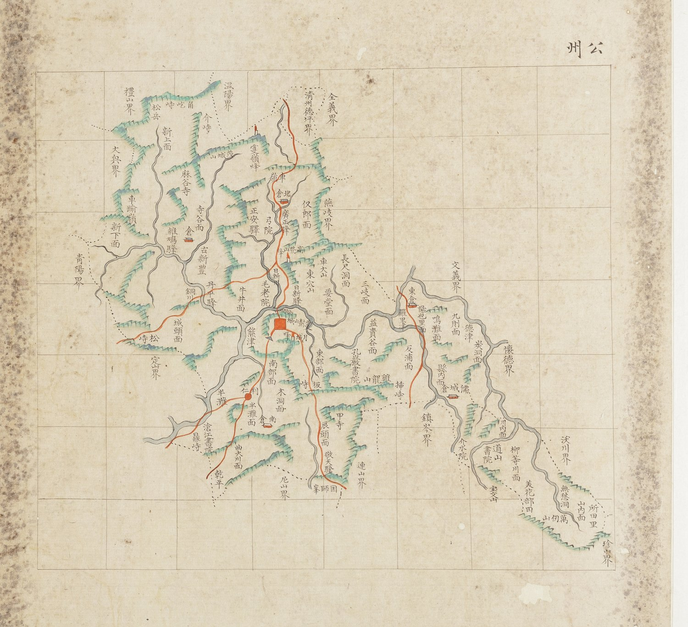

# 『조선지도』 「충청도 공주」 판독

『조선지도』(규장각 **奎16030**, 1767~1776) 가운데 공주목 도엽.
**방안식**이고, 같은 해의 『팔도군현지도』와 **쌍둥이**입니다 — 계열 길잡이는
[`조선지도-판독.md`](조선지도-판독.md), 짝은
[`팔도군현지도-공주-판독.md`](팔도군현지도-공주-판독.md).

## 도엽

| | |
|---|---|
| 자료번호 | `GM16030IL0006_002` |
| 원문 | [커먼즈 파일](https://commons.wikimedia.org/wiki/File:Joseon_jido_GM16030IL0006_002_%EC%B6%A9%EC%B2%AD%EB%8F%84_%EA%B3%B5%EC%A3%BC.jpg) |
| 크기 | 4,135 × 5,218 px |
| 규장각 색인 | 77건 |
| 훑은 범위 | **전면** (2026-10-05) |
| 방위 | **위 = 北** · 가로 이름은 **우횡서** |



## 경계 — 열다섯, **하나는 면 이름까지**

`禮山界` · `溫陽界` · **`淸州德坪界`** · `全義界` · `燕歧界` · `文義界` · `懷德界` ·
`鎭岑界` · `沃川界` · `珍山界` · `連山界` · `尼山界` · `定山界` · `大興界` · `靑陽界`.

**`淸州德坪界`** 는 청주의 **월경지 덕평면**입니다 — 청주 도엽이 따로 떼어 그린 그 구역입니다.
이 계열이 청주를 적을 때 면 이름을 다는 버릇이 여기서도 나옵니다.

## 대전 꼬리 — 팔도군현지도와 같습니다

```
懷德界 → 川內面 · 道山書院 · 寶文山 → 柳等川面 · 美花部田〔?〕
      → 無愁洞 · 萬仞山 · 山內面 · 所田里 → 珍山界 (동쪽은 沃川界)
```

**회덕과 진산 사이를 공주목 면들이 가로막습니다**(규장각 5.10).
**꼬리에 고개가 하나도 없고 붉은 길도 닿지 않습니다** — 이것도 팔도군현지도와 같습니다.

## 고개 — 여덟, **모두 서·북부**. `鼎峙` 가 풀렸습니다

`角屹峙` · `介峙` · `車嶺` · `車踰嶺` · `松峙` · **`鼎峙`** · `板峙` · **`揷峙`**.

> **`鼎峙`(솥 정)입니다.** 팔도군현지도에서 `正峙`〔?〕로 미뤄 두었던 글자가
> 이 도엽에서 또렷합니다. 규장각 색인의 「정치」가 맞되 글자는 **`鼎`** 입니다.

**`揷峙`(삽재)에 붉은 길이 지납니다** — 공주 읍치에서 동쪽으로 나가 `鎭岑界` 로 넘는 길입니다.
대조표 3장의 `揷峙`(유성구 갑동 ↔ 공주시 반포면 온천리, 급 `A`)와 들어맞습니다.

## 길 — 읍치에서 여섯 갈래

북(`車嶺` 넘어 서울) · 서(`松峙` 넘어 `定山界`) · 남(`利仁` → `乾平`) ·
동남(`板峙`·`敬天驛` → `連山界`) · **동(`揷峙` 넘어 `鎭岑界`)** · 동북(`東倉`·`陽也里面`).

**고개 여덟 가운데 길이 닿는 것은 `車嶺`·`松峙`·`板峙`·`揷峙` 넷**입니다.

## 남은 것

1. `美花部田`〔?〕 넷째 글자 — `田` 인가 `曲` 인가
2. `所田里` 의 오늘 자리
3. 서·북부 면 이름 전수

## 변경 이력

| 날짜 | 내용 |
|---|---|
| 2026-10-05 | **문서 개설 · 전면 판독.** 경계 열다섯·고개 여덟·길 여섯 갈래를 채록. **팔도군현지도에서 `正峙`〔?〕로 미뤄 둔 글자가 `鼎峙`(솥 정)로 풀렸습니다.** `揷峙` 에 붉은 길이 지나 공주→진잠 길목임이 확인되고, **대전 꼬리의 차례와 「길이 닿지 않음」은 팔도군현지도와 같습니다** |
