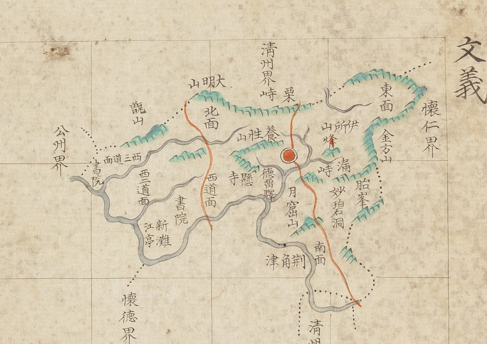

# 『조선지도』 「충청도 문의」 판독

『조선지도』(규장각 **奎16030**, 1767~1776) 가운데 문의현 도엽.
**방안식**이고, 같은 해의 『팔도군현지도』와 **쌍둥이**입니다 — 계열 길잡이는
[`조선지도-판독.md`](조선지도-판독.md), 짝은
[`팔도군현지도-문의-판독.md`](팔도군현지도-문의-판독.md).

## 도엽

| | |
|---|---|
| 자료번호 | `GM16030IL0006_018` |
| 원문 | [커먼즈 파일](https://commons.wikimedia.org/wiki/File:Joseon_jido_GM16030IL0006_018_%EC%B6%A9%EC%B2%AD%EB%8F%84_%EB%AC%B8%EC%9D%98.jpg) |
| 크기 | 4,102 × 5,235 px |
| 규장각 색인 | 23건 |
| 훑은 범위 | **전면** (2026-10-05) |
| 방위 | **위 = 北** · 가로 이름은 **우횡서** |

## 경계 — **`懷德界` 가 있습니다**

`淸州界`(북·남) · `懷仁界`(동) · **`懷德界`**(남) · `公州界`(서).

> **팔도군현지도 문의에는 `懷德界` 가 없습니다.** 회덕 도엽은 북쪽에 `文義界` 를 적으므로,
> **조선지도에서야 짝이 성립합니다**(대조표 4.2). **같은 해 같은 방식의 두 책인데
> 한쪽만 이웃을 적습니다.**

## 고개 — 둘

**`栗峙`**(북, `淸州界` 안쪽 — 붉은 길이 넘어감) · **`漏峙`**〔?〕(동, 읍치 동쪽).

규장각 색인은 뒤엣것을 「만치」로 적었으나, 글자는 팔도군현지도 문의의 `漏峙` 와
같아 보입니다. **갈라 두지 못했습니다.**

`峙` 입니다 — 『해동지도』는 `栗峴`, 1872년은 `漏峴` 으로 `峴` 을 씁니다(대조표 4.4).

## 길 — 둘, **`栗峙` 가 길목**

① 북쪽 `大明山` 쪽에서 내려와 `西道面` 을 지나 남쪽으로
② **`栗峙` 를 넘어** 읍치로 들어와 `漏峙` 남쪽을 지나 남쪽으로.

## 면·산천·그 밖

| 갈래 | 읽은 것 |
|---|---|
| 면 | `北面` · `東面` · `南面` · `西一道面`〔?〕 · `西二道面` · `西三道面` |
| 산 | `大明山` · `甑山` · `養性山` · `伊所山` · `金方山` · `胎峯` · `月窟山` · `烽` |
| 역 | **`德留驛`** |
| 나루 | `荊角津` · `新灘` |
| 그 밖 | `書院` 둘 · `江亭` · `妙碧洞` · `懸寺` |

> **`德留驛` 입니다 — 역(驛)이었습니다.** 팔도군현지도 문의에서 `德留壁`〔?〕 로 읽어
> 둔 것을 **이 도엽이 풀어 줍니다.** 규장각 색인의 「덕유역」과도 맞습니다.

## 남은 것

1. `漏峙`/「만치」 — 글자를 갈라야 합니다
2. 서도면 셋(`一`·`二`·`三`)의 차례 확인

## 변경 이력

| 날짜 | 내용 |
|---|---|
| 2026-10-05 | **문서 개설 · 전면 판독.** **`懷德界` 가 있습니다** — 팔도군현지도 문의에는 없어 일방 기록이던 것이 이 도엽에서 짝이 됩니다. **`德留驛`**(역)으로 팔도군현지도의 `德留壁`〔?〕 를 풀었습니다. 고개는 `栗峙`·`漏峙`〔?〕 둘이고 `栗峙` 에 붉은 길이 지납니다 |
