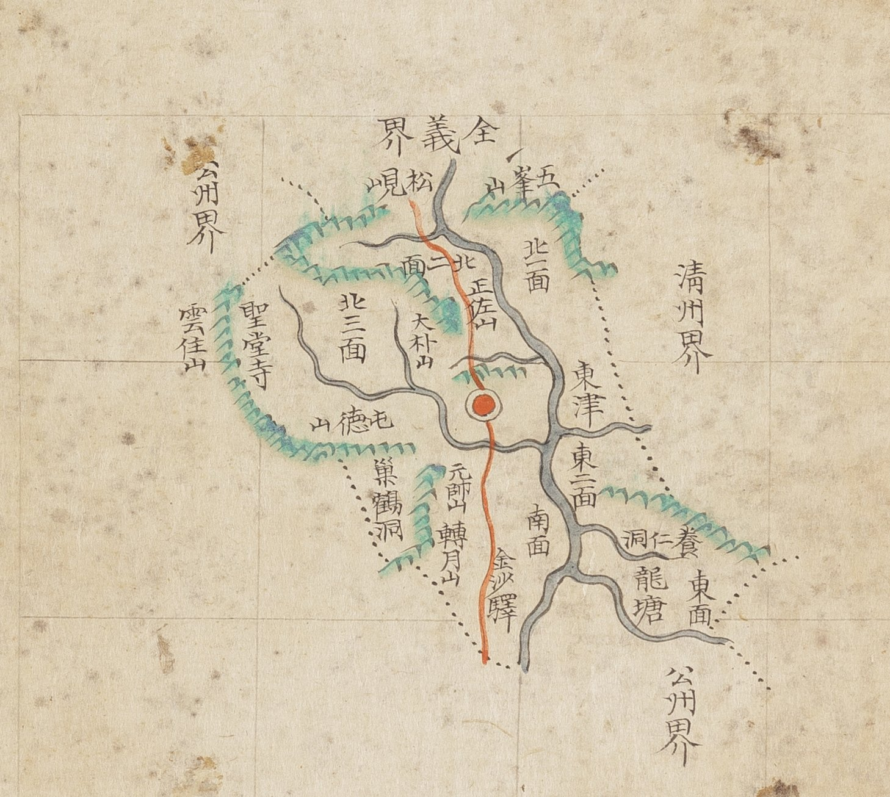

# 『조선지도』 「충청도 연기」 판독

『조선지도』(규장각 **奎16030**, 1767~1776) 가운데 연기현 도엽.
**방안식**이고, 같은 해의 『팔도군현지도』와 **쌍둥이**입니다 — 계열 길잡이는
[`조선지도-판독.md`](조선지도-판독.md), 짝은
[`팔도군현지도-연기-판독.md`](팔도군현지도-연기-판독.md).

## 도엽

| | |
|---|---|
| 자료번호 | `GM16030IL0006_010` |
| 원문 | [커먼즈 파일](https://commons.wikimedia.org/wiki/File:Joseon_jido_GM16030IL0006_010_%EC%B6%A9%EC%B2%AD%EB%8F%84_%EC%97%B0%EA%B8%B0.jpg) |
| 크기 | 4,102 × 5,202 px |
| 규장각 색인 | 20건 |
| 훑은 범위 | **전면** (2026-10-05) |
| 방위 | **위 = 北** · 가로 이름은 **우횡서** |

## 경계 — 셋

`全義界`(북) · `淸州界`(동) · `公州界`(서·남).

**`文義界` 가 없습니다** — 팔도군현지도 연기는 동남에 적습니다. 또 한 번 갈립니다.

## 고개 — **하나**, 그리고 **길목입니다**

**`松峴`** — 북쪽 `全義界` 안쪽. **붉은 길이 이 고개를 넘어** 들어옵니다.

> 『해동지도』 연기현은 `松峙`, 1872년 「연기현지도」는 `松峴店`(고개 아래 주막)과
> `小松峙` 를 적습니다. **이 도엽은 팔도군현지도와 같이 `松峴` 하나**입니다.

## 길 — 하나로 꿰뚫습니다

**북쪽 `松峴` 을 넘어 들어와 읍치를 지나 남쪽 `金沙驛` 으로 빠집니다.**
갈림이 없는 **외길**입니다 — 열한 장 가운데 가장 단순한 길 그림입니다.

## 면·산천·그 밖

| 갈래 | 읽은 것 |
|---|---|
| 면 | `北一面` · `北二面` · `北三面` · `東面` · `東二面` · `南面` |
| 산 | `五峯山` · `正佐山` · `大朴山` · `雲住山` · `屯德山` · `元帥山` · `轉月山` |
| 절 | `聖堂寺` |
| 나루 | `東津` |
| 역 | `金沙驛` |
| 그 밖 | `巢鶴洞` · `龍塘` · `養仁洞` |

## 남은 것

1. `松峴` 의 오늘 자리 — 대조표 3장에서 아직 「미비정」입니다
2. `東一面` 이 보이지 않는 까닭

## 변경 이력

| 날짜 | 내용 |
|---|---|
| 2026-10-05 | **문서 개설 · 전면 판독.** 고개는 **`松峴` 하나**이고 **붉은 길이 그 고개를 넘어** 읍치를 거쳐 `金沙驛` 으로 빠지는 **외길**입니다. `文義界` 가 없어 팔도군현지도와 갈립니다 |
