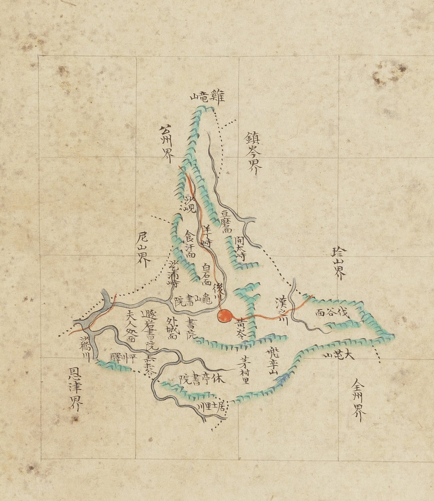

# 『조선지도』 「충청도 연산」 판독

『조선지도』(규장각 **奎16030**, 1767~1776) 가운데 연산현 도엽.
**방안식**이고, 같은 해의 『팔도군현지도』와 **쌍둥이**입니다 — 계열 길잡이는
[`조선지도-판독.md`](조선지도-판독.md), 짝은
[`팔도군현지도-연산-판독.md`](팔도군현지도-연산-판독.md).

## 도엽

| | |
|---|---|
| 자료번호 | `GM16030IL0006_008` |
| 원문 | [커먼즈 파일](https://commons.wikimedia.org/wiki/File:Joseon_jido_GM16030IL0006_008_%EC%B6%A9%EC%B2%AD%EB%8F%84_%EC%97%B0%EC%82%B0.jpg) |
| 크기 | 4,119 × 5,300 px |
| 규장각 색인 | 26건 |
| 훑은 범위 | **전면** (2026-10-05) |
| 방위 | **위 = 北** · 가로 이름은 **우횡서** |

## 경계 — 여섯

`公州界`(북서) · **`鎭岑界`**(북동) · **`珍山界`**(동) · `全州界`(남동) · `恩津界`(남서) · `尼山界`(서).

## 고개 — 다섯

`沙峴` · **`羊丁峙`** · `開太峙` · `薩浦峙` · **`黃岺`**.

**팔도군현지도에서 확신 `중` 으로 둔 두 글자가 풀립니다** —
`羊丁峙` 는 **`羊`** 이 또렷하고, 황령은 **`黃岺`**(`嶺` 의 속자 `岺`)입니다.

**`德目峙` 는 이 도엽에도 없습니다.** 『해동지도』 연산현이 적는 그 고개
(= 오늘 논산시 벌곡면 **덕목재**)를 **방안식 둘이 똑같이 빠뜨립니다.**

## 길 — **읍치에서 동쪽으로 `伐谷面` 을 지나 `珍山界` 로**

붉은 길이 셋입니다 — 북(`沙峴` 넘어 `公州界`) · **동(`漢三川` 건너 `伐谷面` → `珍山界`)** ·
서(`尼山界` 쪽).

> **「진산 → 벌곡」 길의 연산 쪽 그림입니다.** 진산군 도엽이 서쪽 길에
> `連山界十里` 를 적고 그 안쪽에 `方峴`(방고개)을 놓은 그 길입니다(대조표 3장).
> **그런데 이 도엽은 그 길 위에 고개 이름을 하나도 적지 않습니다** —
> `德目峙` 가 빠진 자리가 바로 거기입니다.

## 면·산천·그 밖

| 갈래 | 읽은 것 |
|---|---|
| 면 | `豆磨面` · `食汗面` · `白石面` · `外城面` · `夫人處面` · **`伐谷面`** · `芼村里` |
| 산 | `雞龍山` · `龜山` · `兜率山` · `大芚山` |
| 서원 | `書院`(구산) · `遯巖書院` · `書院` · `休亭書院` |
| 역 | `平川驛` |
| 물 | `後川` · `漢三川` · `沙橋川` · `居士里川` |

**`芼村` 이 면이 아니라 리(里)로 적혀 있습니다** — 팔도군현지도는 `芼村面`.

## 남은 것

1. **`德目峙` 가 왜 방안식 둘에 다 없는가**
2. `伐谷面` 안의 리 이름 — 두 방안식 모두 적지 않습니다

## 변경 이력

| 날짜 | 내용 |
|---|---|
| 2026-10-05 | **문서 개설 · 전면 판독.** 고개 다섯의 글자를 확정(`羊丁峙`·`黃岺`). **읍치에서 동쪽 길이 `伐谷面` 을 지나 `珍山界` 로 나가** 「진산→벌곡」 길의 연산 쪽 그림이 됩니다. **`德目峙` 는 방안식 둘 다 빠뜨립니다** — 길은 그리고 이름만 뺀 꼴입니다 |
