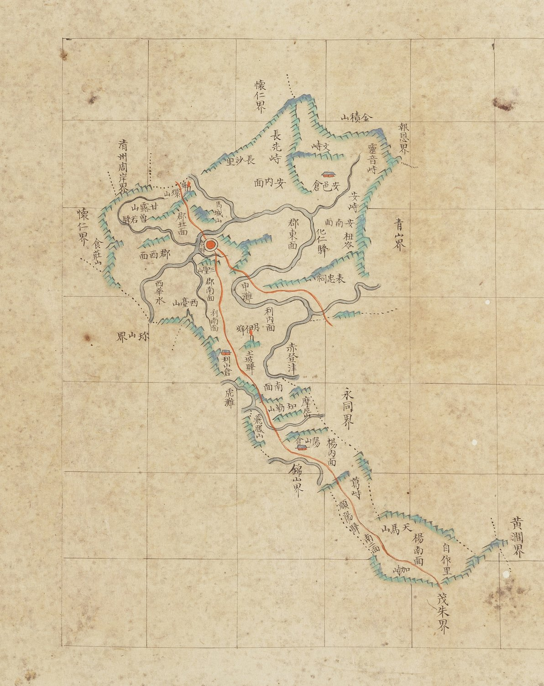

# 『조선지도』 「충청도 옥천」 판독

『조선지도』(규장각 **奎16030**, 1767~1776) 가운데 옥천군 도엽.
**방안식**이고, 같은 해의 『팔도군현지도』와 **쌍둥이**입니다 — 계열 길잡이는
[`조선지도-판독.md`](조선지도-판독.md), 짝은
[`팔도군현지도-옥천-판독.md`](팔도군현지도-옥천-판독.md).

## 도엽

| | |
|---|---|
| 자료번호 | `GM16030IL0006_012` |
| 원문 | [커먼즈 파일](https://commons.wikimedia.org/wiki/File:Joseon_jido_GM16030IL0006_012_%EC%B6%A9%EC%B2%AD%EB%8F%84_%EC%98%A5%EC%B2%9C.jpg) |
| 크기 | 4,103 × 5,268 px |
| 규장각 색인 | 46건 |
| 훑은 범위 | **전면** (2026-10-05) |
| 방위 | **위 = 北** · 가로 이름은 **우횡서** |

## **`遠峙` 가 없습니다** — 팔도군현지도와 갈리는 자리

팔도군현지도 옥천은 **서쪽 끝, `懷德界` 안쪽·`增若驛` 서쪽에 `遠峙`** 를 적습니다
([`팔도군현지도-옥천-판독.md`](팔도군현지도-옥천-판독.md)).
**이 도엽은 같은 자리에 `食莊山`·`增若驛`·`環山`·`甘露山` 을 그려 놓고 `遠峙` 만 뺐습니다.**

> **회덕 도엽의 `質峙` 와 같은 일입니다.** 거기서도 팔도군현지도는 적고 조선지도는
> 뺐습니다. **두 방안식은 같은 땅을 그리면서 고개 이름을 서로 다르게 고릅니다** —
> 대조표 6.5 의 「라벨은 땅이 아니라 편찬자의 선택」을 받치는 **두 번째 사례**입니다.

## 경계 — 열

`報恩界`(북) · `懷仁界`(북서·서) · **`淸州周岸界`**(서북) · `珎山界`(서남) · `錦山界`(남서) ·
`靑山界`(동북) · `永同界`(동) · `黃澗界`(동남) · `茂朱界`(남).

**`懷德界` 가 보이지 않습니다** — 팔도군현지도 옥천은 적습니다. `遠峙` 와 함께 빠졌습니다.

## 고개 — 일곱

`長先峙` · `文峙` · `靈音峙` · `安峙` · `杻岺` · **`葛峙`** · `加峙`.

> **`葛峙` 입니다 — 팔도군현지도는 `葛峴`.** 같은 고개를 `峙`/`峴` 으로 달리 씁니다.
> 대조표 4.4 의 「글자 버릇은 도엽마다」에 사례 하나를 더합니다.

## 길 — 읍치에서 남동으로 길게

붉은 길이 읍치에서 **남동**으로 뻗어 `土坡驛` → `錦山界` 곁 → **`葛峙`** → `順陽驛` →
**`加峙`** → `茂朱界` 로 나갑니다. 북쪽으로는 `環山` 쪽 한 갈래.

**서쪽(회덕 쪽)에는 붉은 길이 없습니다.** `遠峙` 를 뺀 것과 짝이 맞습니다 —
**이 도엽은 옥천에서 회덕 쪽을 비워 두었습니다.**

## 산천·그 밖

| 갈래 | 읽은 것 |
|---|---|
| 산 | `食莊山` · `環山` · `甘露山` · `馬城山` · `三聖山` · `西臺山` · `摩尼山` · `飛鳳山` · `天馬山` · `金積山` |
| 역 | `增若驛` · `化仁驛` · **`土坡驛`** · `順陽驛` |
| 창 | `安邑倉` · `利山倉` · `陽山倉` |
| 나루 | **`申灘`** · `赤登津` · `虎灘` |
| 사당 | `表忠祠` |

**`土坡驛`·`申灘` 입니다** — 팔도군현지도는 `土破驛`·`市灘` 으로 읽힙니다. 글자가 갈립니다.

## 남은 것

1. **`遠峙` 를 왜 뺐는가** — 두 방안식의 계통 관계를 따질 거리입니다
2. `土坡`/`土破`, `申灘`/`市灘` 의 원 글자
3. `杻岺` 의 첫 글자

## 변경 이력

| 날짜 | 내용 |
|---|---|
| 2026-10-05 | **문서 개설 · 전면 판독.** **`遠峙` 가 없습니다** — 팔도군현지도 옥천은 적는데 이 도엽은 같은 자리를 그려 놓고 이름만 뺐습니다. 회덕의 `質峙` 와 같은 일이고, 「라벨은 편찬자의 선택」의 두 번째 사례입니다. `葛峙`(팔도군현 `葛峴`)·`土坡驛`·`申灘` 등 글자가 여럿 갈립니다 |
