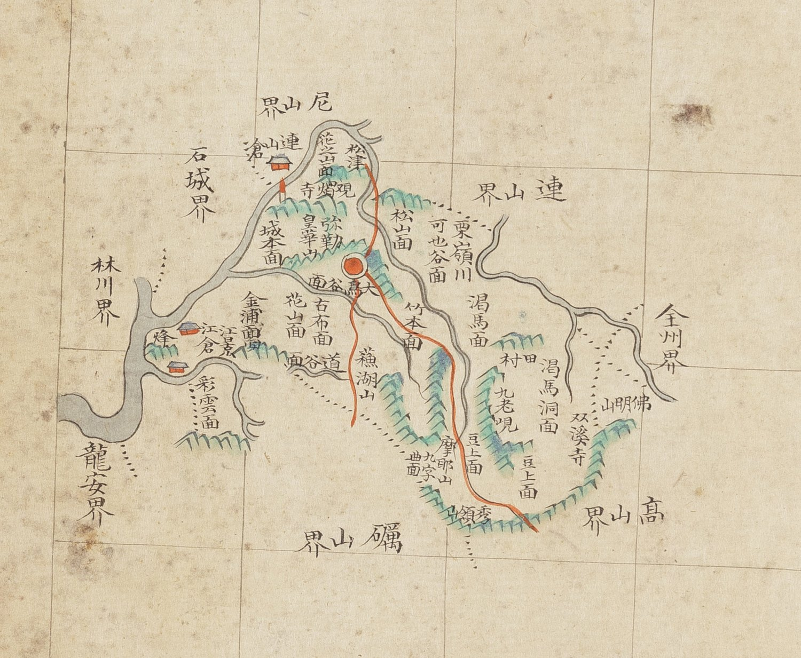

# 『조선지도』 「충청도 은진」 판독

『조선지도』(규장각 **奎16030**, 1767~1776) 가운데 은진현 도엽.
**방안식**이고, 같은 해의 『팔도군현지도』와 **쌍둥이**입니다 — 계열 길잡이는
[`조선지도-판독.md`](조선지도-판독.md), 짝은
[`팔도군현지도-은진-판독.md`](팔도군현지도-은진-판독.md).

## 도엽

| | |
|---|---|
| 자료번호 | `GM16030IL0006_006` |
| 원문 | [커먼즈 파일](https://commons.wikimedia.org/wiki/File:Joseon_jido_GM16030IL0006_006_%EC%B6%A9%EC%B2%AD%EB%8F%84_%EC%9D%80%EC%A7%84.jpg) |
| 크기 | 4,152 × 5,284 px |
| 규장각 색인 | 33건 |
| 훑은 범위 | **전면** (2026-10-05) |
| 방위 | **위 = 北** · 가로 이름은 **우횡서** |

## 경계 — 여덟

`尼山界`(북) · `連山界`(북동) · `全州界`(동) · `高山界`(남동) · `礪山界`(남) ·
`龍安界`(남서) · `林川界`(서) · `石城界`(서북).

**충청도와 전라도가 맞물리는 자리**입니다 — 넷이 전라도입니다.

## 고개 — 둘, **`秀嶺` 이 풀렸습니다**

**`九老峴`**(동, `渴馬洞面` 곁) · **`秀嶺`**(남동 끝, `高山界` 쪽 — **붉은 길이 넘음**).

> **팔도군현지도에서 「남동 끝 `○岺`〔?〕」 으로 미뤄 둔 것이 `秀嶺`** 입니다.
> 규장각 색인의 **「수령산」은 산이 아니라 이 고개**입니다 — 색인의 「―령」을
> 산으로도 고개로도 함부로 세지 말아야 하는 사례입니다.
>
> `栗嶺川`(율령천)은 그대로 **내 이름**입니다.

## 길 — 읍치에서 셋, 하나가 `秀嶺` 을 넘습니다

북(`松津` 쪽) · 남(`蕪湖山` 쪽) · **동남(`竹本面`·`豆上面` 지나 `秀嶺` 넘어 `高山界`)**.

## 면·산천·그 밖

| 갈래 | 읽은 것 |
|---|---|
| 면 | `花之面`〔?〕 · `城本面` · `花山面` · `金浦面` · `彩雲面` · `古布面` · `谷面` · `松山面` · `可也谷面` · `竹本面` · `渴馬面` · `渴馬洞面` · `豆上面` · `九字曲面` |
| 산 | **`皇華山`** · `蕪湖山` · `摩耶山` · `佛明山` |
| 불상 | **`彌勒`** — 은진미륵 |
| 절 | **`觀燭寺`** · `雙溪寺` |
| 창 | `連山倉` · `江倉` · 봉수 `烽` |
| 물 | `松津` · `栗嶺川` · `大鳥` |

**`皇華山` 입니다** — 팔도군현지도는 `白華山` 으로 읽힙니다. **`觀燭寺`**(관촉사)도 이 도엽에서 또렷합니다.

## 남은 것

1. `皇華`/`白華` — 원 글자
2. `花之面`〔?〕 둘째 글자

## 변경 이력

| 날짜 | 내용 |
|---|---|
| 2026-10-05 | **문서 개설 · 전면 판독.** **팔도군현지도에서 미뤄 둔 남동 끝 고개가 `秀嶺`** 임을 밝혔습니다 — 색인의 「수령산」은 산이 아니라 이 고개이고, 붉은 길이 그 고개를 넘어 `高山界` 로 나갑니다. `皇華山`·`觀燭寺` 도 또렷합니다 |
