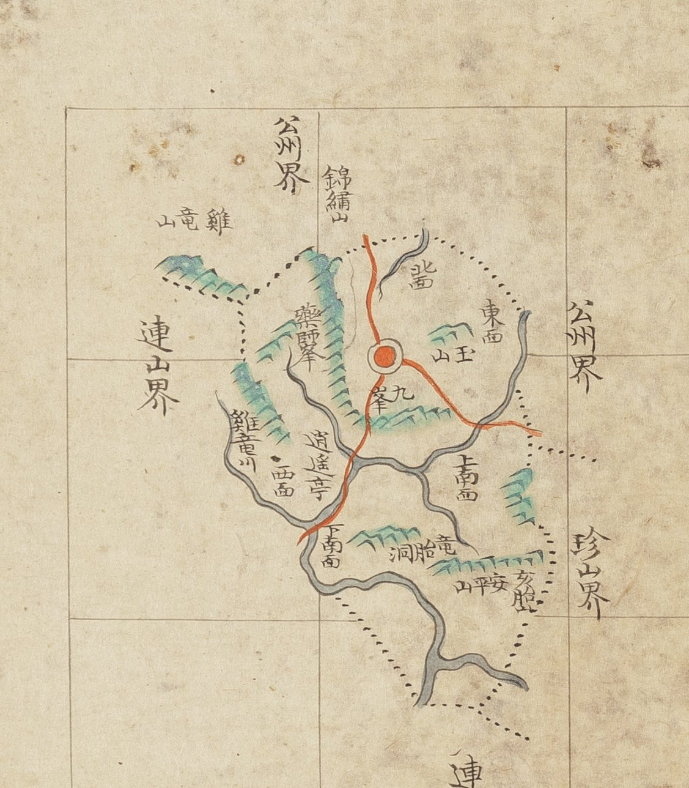

# 『조선지도』 「충청도 진잠」 판독

『조선지도』(규장각 **奎16030**, 1767~1776) 가운데 진잠현 도엽.
**방안식**이고, 같은 해의 『팔도군현지도』와 **쌍둥이**입니다 — 계열 길잡이는
[`조선지도-판독.md`](조선지도-판독.md), 짝은
[`팔도군현지도-진잠-판독.md`](팔도군현지도-진잠-판독.md).

## 도엽

| | |
|---|---|
| 자료번호 | `GM16030IL0006_009` |
| 원문 | [커먼즈 파일](https://commons.wikimedia.org/wiki/File:Joseon_jido_GM16030IL0006_009_%EC%B6%A9%EC%B2%AD%EB%8F%84_%EC%A7%84%EC%9E%A0.jpg) |
| 크기 | 4,103 × 5,300 px |
| 규장각 색인 | 15건 |
| 훑은 범위 | **전면** (2026-10-05) |
| 방위 | **위 = 北** · 가로 이름은 **우횡서** |

## 경계 — 넷

`公州界`(서북·동 **두 곳**) · `連山界`(서남) · **`珍山界`**(동남).

**팔도군현지도와 같되 글자가 다릅니다** — 저쪽은 `珎山界`(속자 `珎`), 이쪽은 **`珍山界`**(정자 `珍`).

## 고개 — **하나도 없습니다**

**`峙`·`峴` 이 한 글자도 없습니다.** 팔도군현지도 진잠도 같습니다 —
**방안식 둘이 똑같이 진잠의 고개를 적지 않습니다.** 1872년 「진잠지도」는
`奄峴`·`牛拳峴` 둘을 적습니다.

## 길 — 읍치에서 셋

붉은 길이 읍치에서 **북**(`公州界` 쪽) · **동**(`公州界` 쪽) · **남**(`下南面` 지나 `連山界` 쪽)
으로 갈립니다. **고개 이름이 하나도 없는 채로 길만 셋**입니다.

## 산천·면·그 밖

| 갈래 | 읽은 것 |
|---|---|
| 산 | `雞龍山`(서북, 고을 밖) · `錦繡山` · `藥師峯`〔?〕 · `九峯` · `玉山` · `安平山` · `亥胎` |
| 물 | `雞龍川` |
| 면 | `北面`〔?〕 · `東面` · `西面` · `上南面` · `下南面` |
| 그 밖 | `逍遙亭` · `竜胎洞` |

**`雞`/`鷄` 가 갈립니다** — 이 도엽은 `雞`(새 추 변), 팔도군현지도는 `鷄`(새 조 변)입니다.

## 남은 것

1. `藥師峯` 가운데 글자 — 팔도군현지도는 `師` 로 읽었는데 이 도엽은 다른 글자로 보입니다
2. 북쪽 면 이름(`北面`?) 확인

## 변경 이력

| 날짜 | 내용 |
|---|---|
| 2026-10-05 | **문서 개설 · 전면 판독.** 경계 넷·면 다섯·산 일곱을 채록. **고개가 하나도 없는 것은 팔도군현지도와 같고**, `珍`/`珎`·`雞`/`鷄` 가 두 방안식에서 갈립니다 |
