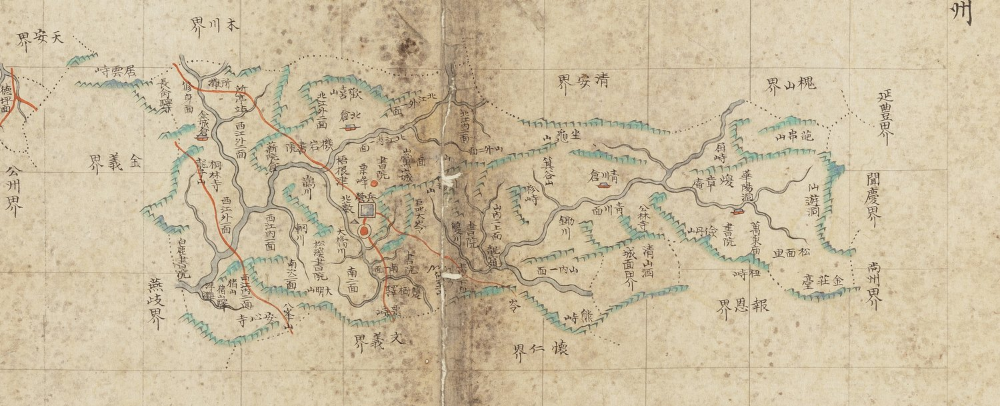

# 『조선지도』 「충청도 청주」 판독

『조선지도』(규장각 **奎16030**, 1767~1776) 가운데 청주목 도엽.
**방안식**이고, 같은 해의 『팔도군현지도』와 **쌍둥이**입니다 — 계열 길잡이는
[`조선지도-판독.md`](조선지도-판독.md), 짝은
[`팔도군현지도-청주-판독.md`](팔도군현지도-청주-판독.md).

## 도엽

| | |
|---|---|
| 자료번호 | `GM16030IL0006_020` |
| 원문 | [커먼즈 파일](https://commons.wikimedia.org/wiki/File:Joseon_jido_GM16030IL0006_020_%EC%B6%A9%EC%B2%AD%EB%8F%84_%EC%B2%AD%EC%A3%BC.jpg) |
| 크기 | **8,043 × 5,221 px** — 열 장 가운데 홀로 가로 |
| 규장각 색인 | 74건 |
| 훑은 범위 | **전면** (2026-10-05) |
| 방위 | **위 = 北** · 가로 이름은 **우횡서** |

## 판형 — **홀로 가로**, 그리고 가장 큽니다

`8,043 × 5,221 px` 로 다른 아홉 장(4,100 × 5,200 안팎)의 **두 배 폭**입니다.
고을이 동서로 길어 종이를 눕혔습니다 — 팔도군현지도 청주와 같은 판단입니다.

## **월경지(越境地)** 가 그려져 있습니다

도엽 **서쪽 끝**에 본 고을에서 떨어진 구역이 따로 그려지고 **`德坪面`** 이 적혀 있습니다.
**붉은 길까지 들어가 있습니다.**

**공주 도엽이 경계로 `淸州德坪界` 를 적은 그 면**입니다 — 두 도엽이 맞물립니다.
**방안식이라 떨어진 자리를 종이 위 제자리에 놓을 수 있어** 가능한 그림입니다.

## 경계 — 열넷 안팎

`天安界` · `木川界` · `淸安界` · `槐山界` · `延豐界` · **`聞慶界`** · `尙州界` ·
`報恩界` · `懷仁界` · `文義界` · `燕歧界` · `公州界` · `全義界` · `金溪界`〔?〕.

**`懷德界` 가 없습니다** — 회덕 도엽은 동북에 `淸州周安界` 를 적는데 청주는 회덕을
적지 않습니다. 팔도군현지도 청주도 같습니다.

## 고개 — 일곱 안팎

**`居雲峙`** · `巨叱大岺` · `杉峙`〔?〕 · `屛峙`〔?〕 · **`熊峙`** · `杻峙`〔?〕 · `栗峙`〔?〕.

> **`居雲峙` 입니다.** 규장각 색인이 「굴운치」로 적은 것을 이 도엽은 **`居雲`** 으로
> 적습니다. 다만 다른 고개 넷은 글자가 흐려 확신 `하` 입니다.

`熊峙` 는 회인 도엽에도 있습니다 — **두 고을 경계의 같은 고개**일 수 있습니다.

## 길 — 동서로 꿰뚫습니다

붉은 길이 도엽을 **동서로 가로지르고**, 읍치(붉은 원 + 푸른 네모 성)에서 갈라집니다.
**월경지 `德坪面` 에도 길이 그려져 있습니다.**

## 남은 것

1. **고개 넷의 글자** — `杉`·`屛`·`杻`·`栗` 모두 확신 `하`
2. **`周安面` 이 도엽 어디에 있는지** — 회덕과 닿는 자리입니다
3. 월경지 `德坪面` 의 둘레 지명
4. 청주 `熊峙` 와 회인 `熊峙` 가 같은 고개인지

## 변경 이력

| 날짜 | 내용 |
|---|---|
| 2026-10-05 | **문서 개설 · 전면 판독.** 홀로 가로 판형이고 **월경지 `德坪面` 이 길까지 갖춰 그려져** 있습니다 — 공주 도엽의 `淸州德坪界` 와 맞물립니다. 색인의 「굴운치」가 **`居雲峙`** 임을 확인했으나 나머지 고개 넷은 글자가 흐려 확신 `하` 입니다 |
