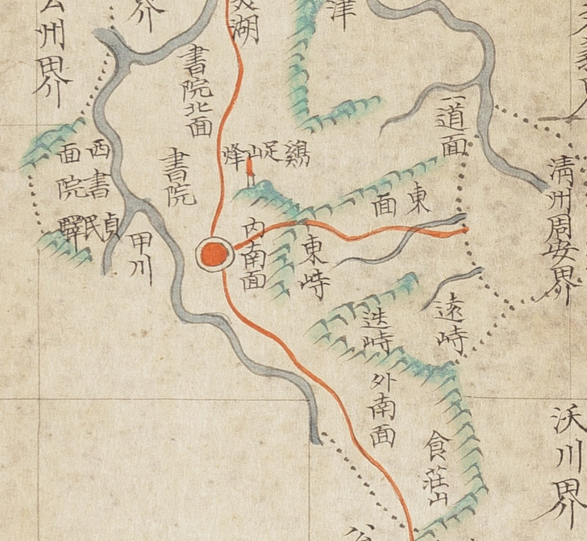

# 『조선지도』 「충청도 회덕」 판독

『조선지도』(규장각 **奎16030**, 1767~1776) 가운데 회덕현 도엽. **대전 본역의 중심 도엽**입니다.
계열 길잡이는 [`조선지도-판독.md`](조선지도-판독.md), 쌍둥이는
[`팔도군현지도-회덕-판독.md`](팔도군현지도-회덕-판독.md).

## 도엽

| | |
|---|---|
| 자료번호 | `GM16030IL0006_011` |
| 원문 | [커먼즈 파일](https://commons.wikimedia.org/wiki/File:Joseon_jido_GM16030IL0006_011_%EC%B6%A9%EC%B2%AD%EB%8F%84_%ED%9A%8C%EB%8D%95.jpg) |
| 크기 | 4,070 × 5,202 px |
| 규장각 색인 | 18건 |
| 훑은 범위 | 고개 중심 (2026-10-04) · **길과 경계** (2026-10-05) |
| 방위 | **위 = 北** · 가로 이름은 **우횡서** |

## 고개 — **셋**, `質峙` 가 없습니다

`東峙` · `迭峙` · `遠峙`.

> **팔도군현지도 회덕은 넷입니다** — `東峙`·**`質峙`**·`迭峙`·`遠峙`.
> **이 도엽은 같은 세 갈래 길을 똑같이 그려 놓고 `質峙` 라벨만 뺐습니다.**
> **길이 그대로인데 이름이 사라집니다 — 라벨은 땅이 아니라 편찬자의 선택입니다**
> (대조표 6.5). 같은 일이 **옥천 도엽의 `遠峙`** 에서도 일어납니다
> ([`조선지도-옥천-판독.md`](조선지도-옥천-판독.md)).

## 길 — 읍치에서 셋

| 갈래 | 어디로 | 지나는 고개 |
|---|---|---|
| 북 | `書院面` → 문의·청주 | — |
| 동 | 산줄기를 넘어 `東面` 아래로 | **`東峙`** 북쪽 |
| 남 | `內南面` → 도엽 남쪽 끝 | (팔도군현지도라면 **`質峙`** 자리) |

**`迭峙`·`遠峙` 에는 길이 닿지 않습니다** — `食莊山` 쪽 딴 산줄기 위입니다.

## 경계·면·산천

| 갈래 | 읽은 것 |
|---|---|
| 면 | `北面` · `西面` · `東面` · `一道面` · `內南面` · `外南面` |
| 산 | `鷄足山`(학족산봉) · `食莊山` |
| 물 | `甲川` · `美湖` · `荊角津` |
| 그 밖 | `貞民驛` · `書院` 셋 |

## 남은 것

1. **`質峙` 를 왜 뺐는가** — 팔도군현지도와의 계통 관계
2. 경계 표기 전수 — `淸州周安界` 가 이 도엽에도 있는지

## 변경 이력

| 날짜 | 내용 |
|---|---|
| 2026-10-04 | 고개 셋을 읽고 좌표에 앉힘(잔차 1.26 km, 규장각 5.8). **색인의 「질치」 둘 문제가 이 도엽에는 없습니다** — 애초에 `質峙` 가 없기 때문입니다 |
| 2026-10-05 | **문서 개설.** 길 세 갈래를 따라 읽고, **팔도군현지도와 같은 길을 그려 놓고 `質峙` 라벨만 뺀 것**을 밝혔습니다 — 대조표 6.5 의 「라벨은 편찬자의 선택」의 첫 사례입니다 |
