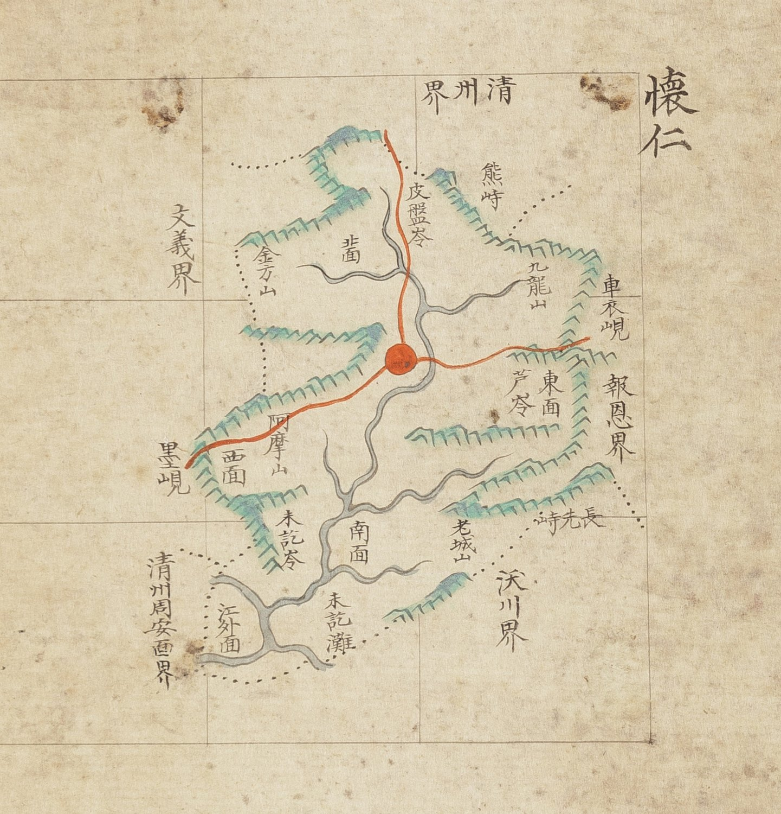

# 『조선지도』 「충청도 회인」 판독

『조선지도』(규장각 **奎16030**, 1767~1776) 가운데 회인현 도엽.
**방안식**이고, 같은 해의 『팔도군현지도』와 **쌍둥이**입니다 — 계열 길잡이는
[`조선지도-판독.md`](조선지도-판독.md), 짝은
[`팔도군현지도-회인-판독.md`](팔도군현지도-회인-판독.md).

## 도엽

| | |
|---|---|
| 자료번호 | `GM16030IL0006_017` |
| 원문 | [커먼즈 파일](https://commons.wikimedia.org/wiki/File:Joseon_jido_GM16030IL0006_017_%EC%B6%A9%EC%B2%AD%EB%8F%84_%ED%9A%8C%EC%9D%B8.jpg) |
| 크기 | 4,103 × 5,216 px |
| 규장각 색인 | 17건 |
| 훑은 범위 | **전면** (2026-10-05) |
| 방위 | **위 = 北** · 가로 이름은 **우횡서** |

## 경계 — 다섯, **하나는 면 이름까지**

`淸州界`(북) · `報恩界`(동) · `沃川界`(남동) · **`淸州周安面界`**(남서) · `文義界`(서).

> **`周安面` 입니다.** 팔도군현지도 회인을 `淸州固安面界` 로 읽어 두었는데,
> 이 도엽은 **`周安面`** 이 또렷합니다. 회덕 도엽의 `淸州周安界`·옥천 도엽의
> `淸州周岸界` 와도 맞으므로, **팔도군현지도 쪽 읽기를 `周安`〔?〕 으로 되돌립니다.**

## 고개 — **일곱**, 팔도군현지도보다 둘 많습니다

| 표기 | 자리 |
|---|---|
| `皮盤岺` | 북, `淸州界` 쪽 — **붉은 길이 넘음** |
| **`熊峙`** | 북동 — **팔도군현지도에 없음** |
| `車衣峴` | 동, `報恩界` 쪽 |
| `芦岺` | 동 |
| `墨峴` | 서 — **붉은 길이 넘음** |
| **`未訖岺`** | 남서 — **팔도군현지도에 없음**. 아래 `未訖灘`(여울)과 짝 |
| `長先峙` | 남동 |

**`岺` 셋 · `峴` 둘 · `峙` 둘**로 섞어 씁니다. 『해동지도』 회인현이 `嶺` 넷으로 통일한 것과
어긋나며, **「글자 버릇은 고을이 아니라 도엽의 것」**을 거듭 보입니다(대조표 4.4).

## 길 — 읍치에서 **셋**, 둘이 고개를 넘습니다

북(**`皮盤岺`** 넘어 `淸州`) · 동(`車衣峴` 쪽 `報恩`) · 서남(`阿摩山` 지나 **`墨峴`** 넘어 `文義`).

**고개 일곱 가운데 길이 닿는 것은 둘**입니다.

## 면·산천

`北面` · `東面` · `西面` · `南面` · `江外面`.
`金方山` · `九龍山` · `阿摩山` · `老城山` · `未訖灘`.

## 남은 것

1. **`熊峙`·`未訖岺` 이 팔도군현지도에 없는 까닭**
2. `長先峙` 가 옥천 도엽의 같은 이름과 같은 고개인지
3. `墨峴` 을 3장의 `墨峙`(머들령 자리)와 섞지 말 것

## 변경 이력

| 날짜 | 내용 |
|---|---|
| 2026-10-05 | **문서 개설 · 전면 판독.** 고개 **일곱** — 팔도군현지도보다 **`熊峙`·`未訖岺` 둘이 많습니다.** `岺`·`峴`·`峙` 를 섞어 써 「글자 버릇은 도엽의 것」을 거듭 보입니다. **`淸州周安面界`** 가 또렷해 팔도군현지도의 `固安面`〔?〕 읽기를 되돌립니다 |
