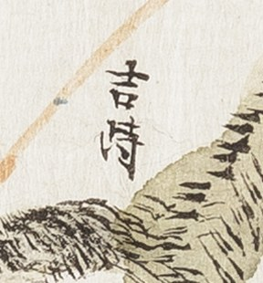

# 판독 기록 형식

옛 지도 판독을 **여럿이 나눠서, 여러 컴퓨터에서** 하기 위한 기록 방식입니다.

## 원칙

**옮기는 것은 그림이 아니라 판독입니다.** 원본은 위키미디어 공용에 있고 주소가 영구적입니다.
같은 그림을 저장소에 다시 넣을 이유가 없습니다. 저장소에 남겨야 하는 것은
**"어느 도엽 어디를 보고 무엇을 읽었는가"** 입니다.

그래서 기록은 세 가지를 갖춰야 합니다.

1. **다시 찾아갈 수 있어야 한다** — 도엽과 그 안의 위치
2. **뒤집을 수 있어야 한다** — 확신도와 판독자를 밝힌다. 판독은 종종 바뀝니다
3. **근거가 붙어야 한다** — 무엇을 보고 그렇게 읽었는지

## 위치를 적는 법

**도엽의 폭과 높이를 각각 1로 본 상대 좌표**로 적습니다. 왼쪽 위가 `(0, 0)`, 오른쪽 아래가
`(1, 1)` 입니다. 소수 둘째 자리까지면 충분합니다.

```
(0.72, 0.31)   ← 오른쪽에서 조금 왼쪽, 위에서 3분의 1쯤
```

- **크기가 달라도 변하지 않습니다.** 원본이 9,653 × 12,734 픽셀이든 축소본이든 같은 값입니다.
- "동북쪽", "오른쪽 위" 만 적으면 다른 사람이 다시 찾기 어렵습니다. 옛 지도는 글자가 빽빽합니다.

## 잘라낸 그림 — `crops/`

쟁점의 근거가 되는 조각은 **[`crops/`](crops/) 에 둡니다.** 원본 도엽은 두지 않습니다 —
원본은 위키미디어 공용에 있고 주소가 영구적입니다([`고지도-목록.md`](고지도-목록.md)).

판독은 자주 뒤집힙니다. 뒤집을 때 **근거 그림이 저장소 안에 있어야 다른 사람이 바로
확인합니다.** 이슈 댓글에만 붙여 두면 이슈마다 흩어져 나중에 찾기 어렵고 문서에서 걸 수도
없습니다.

**이름에 자른 자리를 넣습니다.** 저장소에 두든 이슈 댓글에 붙이든 마찬가지입니다.

```
<자료번호>_x<왼쪽>_y<위>_w<폭>_h<높이>.jpg

KYKH002_0000_0046_x0.68_y0.26_w0.10_h0.12.jpg
```

값은 위에서 정한 상대 좌표입니다. 이렇게 하면 **누구나 커먼즈 원본에서 같은 자리를 다시
자를 수 있습니다.** 그림이 없어져도 좌표가 남으므로 판독을 검증할 길이 끊기지 않습니다.

**한 장 500 KB 이내.** 넘으면 판독에 필요한 만큼만 더 잘라 내거나 폭을 줄입니다. 원본은
한 장에 0.6~83 MB 이고 git 은 한 번 커밋한 파일을 지워도 히스토리에 남깁니다. 판독에 쓰는
조각은 글자가 읽히기만 하면 되므로 그보다 훨씬 작아도 충분합니다(`decisions.md` 0016).

**어디에서도 참조되지 않는 조각은 두지 않습니다.** 문서나 이슈에서 걸리지 않으면 나중에
무엇이었는지 알 수 없게 됩니다.

**넣는 방법** — GitHub 웹에서 `crops/` 에 `Add file → Upload files` 로 끌어다 놓습니다.
그림은 텍스트가 아니라 API 로는 올라가지 않습니다. 이 폴더도 사이트에는 나가지 않습니다
(`_config.yml` 의 `exclude` 에 `research` 가 있음).

## 좌표대로 자르기 — 이름이 저절로 붙습니다

**손으로 자르고 좌표를 따로 적는 방식은 오래 못 갑니다.** 자른 자리를 나중에 되짚기
어렵고, 조각과 좌표가 어긋나기 시작합니다. **좌표를 입력으로 주고 자르면** 파일 이름이
규칙대로 저절로 붙습니다.

```python
# crop.py — 상대 좌표로 자르고 규칙대로 이름을 붙인다
#   python crop.py <원본.jpg> <x> <y> <w> <h>
#   python crop.py KYKH002_0000_0046_충청도_회덕현지도.jpg 0.68 0.26 0.10 0.12
import sys, os
from PIL import Image

src, x, y, w, h = sys.argv[1], *map(float, sys.argv[2:6])
im = Image.open(src)
W, H = im.size
box = (round(x*W), round(y*H), round((x+w)*W), round((y+h)*H))
out = im.crop(box)

# 500 KB 를 넘으면 폭을 줄여 가며 다시 저장한다
stem = os.path.splitext(os.path.basename(src))[0]
name = f"{stem}_x{x:g}_y{y:g}_w{w:g}_h{h:g}.jpg"
for width in (out.width, 2000, 1400, 1000, 700):
    img = out if width == out.width else out.resize(
        (width, round(out.height * width / out.width)))
    img.save(name, quality=88)
    if os.path.getsize(name) <= 500_000:
        break
print(name, os.path.getsize(name), "bytes", box)
```

- **좌표를 모를 때는** 이미지 뷰어에서 글자 위 픽셀 좌표를 읽고 도엽 크기로 나눕니다.
  해동지도는 2409×3730 px 내외, 1872년 지방지도는 그보다 훨씬 큽니다.
- 넉넉히 자릅니다. **글자만 자르면 위치를 못 따집니다** — 주변 산줄기·물길·경계 표기·
  도로선이 함께 들어와야 다른 사람이 확인할 수 있습니다.
- 한 자리를 여러 배율로 자를 때는 `w`·`h` 만 달리하면 이름이 저절로 갈립니다.

## 표에 그림을 박아 넣습니다

**기록 표의 `근거` 칸에는 링크가 아니라 그림을 박습니다.** 링크는 눌러야 보이고, 판독은
**눈으로 바로 견줘야** 고쳐집니다.

```

```

- 마크다운 표 칸 안에서도 `` 는 GitHub 에서 그대로 그려집니다. `width` 로 크기를
  줄이지 않으면 표가 깨집니다 — **글자 한두 자면 `150`, 주기 한 줄이면 `260`** 쯤입니다.
- **박아 넣을 조각은 따로 좁게 자릅니다.** 넉넉한 조각은 위치를 따지는 데 쓰고(그대로
  링크로 걸고), 표에는 글자만 보이는 좁은 조각을 씁니다. 두 조각은 좌표가 다르니
  **파일 이름이 저절로 갈립니다.**
- **미판독 글자는 반드시 박습니다.** 그림이 표에 있으면 읽을 수 있는 사람이 지나가다
  바로 고쳐 줍니다. `□` 만 적어 두면 아무도 못 고칩니다.

## 상하가 뒤집힌 글자 — `_r180`

**옛 지도는 한 도엽 안에서도 구역마다 글자를 뒤집어 적습니다.** 도엽의 방위가 북쪽이
위가 아닐 때 특히 그렇습니다(1872년 지방지도는 회덕 위=東, 진잠 위=西, 공주목 위=南).
**돌려 보지 않으면 글자가 있는지조차 모릅니다** — 실제로 "글자가 뭉개졌다"고 넘긴 자리에
지명이 있었습니다.

그런 자리는 **좌표대로 자른 것과, 돌려서 읽을 수 있게 만든 것 두 장**을 둡니다.

```
KYKH002_0000_0046_x0.79_y0.13_w0.06_h0.02.jpg        ← 좌표대로 (검증용)
KYKH002_0000_0046_x0.79_y0.13_w0.06_h0.02_r180.jpg   ← 180° 돌린 것 (판독용)
```

`_r180` 쪽은 색과 대비를 조금 올려 둡니다. **먹이 흐린 도엽에서는 흑백 고대비보다 색을
살린 쪽이 훨씬 잘 읽힙니다** — 흑백으로 4배 확대해 놓고 세 글자를 다섯으로 끊어 읽은
일이 있었습니다. 표에는 `_r180` 을 박습니다.

## 기록 표

도엽 하나에 표 하나를 만들고 `대전-고개-대조표.md` 의 4장에 붙입니다.

| 위치 | 표기 | 읽기 | 확신 | 판독자 | 날짜 | 근거 |
|---|---|---|---|---|---|---|
| (0.00, 0.00) | 한자 그대로 | 우리말·한자음 | 상/중/하 | 이름 | YYYY-MM-DD | 이슈 번호나 crop 이름 |

- **표기**는 도엽에 적힌 글자 그대로. 못 읽은 글자는 `□` 로 둡니다
- **확신**은 `상` 글자가 또렷함 / `중` 읽히나 확대 검증 안 함 / `하` 이견이 있거나 획이 불분명
- **읽기**가 갈리면 후보를 모두 적습니다 — `于/亐/牛`

## 일이 나뉘는 자리

환경마다 볼 수 있는 것이 다릅니다. 그것을 약점이 아니라 **분업**으로 씁니다.

| | 하는 일 |
|---|---|
| **그림이 보이는 곳**<br>(내 컴퓨터, 커먼즈가 열리는 환경) | 도엽을 열어 글자를 읽고, 좌표와 함께 기록을 커밋한다. 쟁점이 되는 자리는 잘라 이슈 댓글에 붙인다 |
| **그림이 안 보이는 곳**<br>(일부 원격 환경) | 기록을 읽고 문헌과 대조하고, 앞뒤가 맞지 않는 곳에 의문을 제기한다. 다른 도엽의 기록과 맞춰 본다 |

**두 쪽이 같은 파일을 봅니다.** 그림을 못 보는 쪽도 "이 좌표를 다시 확대해 봐 달라"고 정확히
요청할 수 있습니다.

## 주의

- 판독은 **자주 바뀝니다.** 이 조사에서도 `沈峴` 으로 읽었던 것이 확대본 한 장으로
  `于峙嶺` 이 되었습니다. 그래서 확신도와 판독자를 적습니다 — 틀렸을 때 어디부터
  다시 볼지 알기 위해서입니다
- **고친 판독은 지우지 않습니다.** 대조표 5장에 쟁점으로 세우고 양쪽을 다 적습니다
- 이슈 댓글의 그림은 GitHub 쪽에 저장되어 흩어집니다. **오래 남길 근거는 `crops/` 에 두고**
  좌표를 기록에 적습니다
