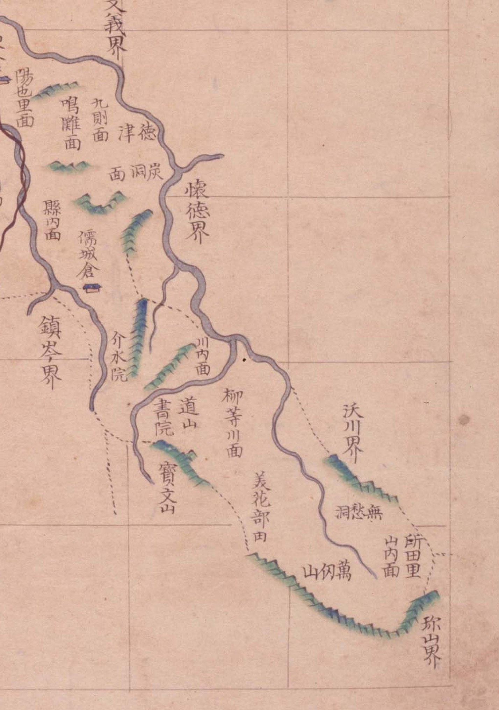

# 『팔도군현지도』 「충청도 공주」 판독

『팔도군현지도』(古4709-111, 1767~1776) 가운데 공주목 도엽.
**동남으로 길게 뻗은 꼬리가 지금의 대전 중구·동구 남부**입니다.
계열의 생김새는 [`팔도군현지도-판독.md`](팔도군현지도-판독.md).

## 도엽

| | |
|---|---|
| 자료번호 | `GM33535IL0002_002` |
| 원문 | [커먼즈 파일](https://commons.wikimedia.org/wiki/File:Paldo_gunhyeon_jido_GM33535IL0002_002_%EC%B6%A9%EC%B2%AD%EB%8F%84_%EA%B3%B5%EC%A3%BC.jpg) |
| 크기 | 3,118 × 4,102 px |
| 규장각 색인 | **79건** — 청주(78)와 함께 가장 많습니다 |
| 훑은 범위 | **대전 꼬리 전면** · 나머지는 개관 (2026-10-05) |
| 방위 | **위 = 北** |
| 글 방향 | 세로는 그대로, **가로는 우횡서** |
| 장서인 | 오른쪽 위에 **`京城帝國大學圖書`** |



*대전 꼬리. 왼쪽 위에서 오른쪽 아래로 `懷德界` → `柳等川面` → `山內面` → `珎山界`.*

## 경계 — 열넷

`溫陽界` · `天安界` · `木川界` · `全義界` · `燕歧界` · `文義界` · `懷德界` · `鎭岑界` ·
`沃川界` · `珎山界` · `連山界` · `尼山界` · `定山界` · `大興界` · `靑陽界` · `禮山界`.
**충청도에서 가장 많은 고을과 닿는 큰 고을**입니다.

## 대전 꼬리 — **이것이 6.4 의 뼈대입니다**

북에서 남으로 차례가 끊이지 않습니다.

```
文義界
  │   陽也里面 · 鳴雕面 · 九則面 · 德津面 · 炭洞面 · 縣內面 · 儒城倉
  │
懷德界 ───────────────────┐
  │   介水院 · 川內面 · 道山書院 · 寶文山   │
  │   柳等川面 · 美花部田〔?〕            │  ← 서쪽은 鎭岑界
  │   無愁洞 · 萬仞山 · 山內面 · 所田里    │
  └────────────── 沃川界(동) · 珎山界(동남 끝)
```

**북쪽 `懷德界` 와 동남 끝 `珎山界` 사이를 공주목 면들이 가로막습니다.**
곧 **회덕과 진산은 직접 닿지 않습니다** —
[`규장각-고지도-새계열.md`](규장각-고지도-새계열.md) 5.10 을 이 도엽이 다시 받칩니다.

**꼬리에 고개가 하나도 없습니다.** 이 도엽의 고개 아홉은 **모두 서·북부**입니다.

## 고개 — 아홉, **모두 서·북부**

`角屹峙` · `介峙` · `揷峙` · `松峙` · `正峙`〔?〕 · `板峙` · `車嶺` · `車踰嶺` · `雙嶺峯`.

가장 동쪽이 **`揷峙`**(삽재)로, 지금 유성구 갑동 ↔ 공주시 반포면 온천리입니다
(대조표 3장, 급 `A`). **대전에 걸리는 것은 이것 하나뿐**입니다.

## 면

꼬리 쪽만 적습니다 — `陽也里面` · `鳴雕面` · `九則面` · `德津面` · `炭洞面` · `縣內面` ·
`川內面` · `柳等川面` · **`山內面`**.
서·북부에는 `新上面` · `新下面` · `麻谷面` · `正安面` · `儀郞面` · `東穴面`〔?〕 · `要堂面` ·
`三岐面` · `反浦面` · `益貴谷面` · `長尺洞面` · `우정면` 등이 더 있습니다(색인).

## 산천·그 밖 (꼬리 쪽)

| 갈래 | 읽은 것 |
|---|---|
| 산 | **`寶文山`** · **`萬仞山`** |
| 마을 | **`無愁洞`** · **`所田里`** · `美花部田`〔?〕 |
| 원 | `介水院` |
| 서원 | `道山書院` |
| 창 | **`儒城倉`** |

## 도엽을 좌표에 앉혀 보았습니다 — **안 됩니다**

기준점 열(갑사·마곡사·계룡산·보문산·만인산·무수동·이인·차령·경천역·반포면)으로
어파인을 맞추니 **잔차 4.0 km**, 동쪽 꼬리의 기준점만 써도 **3.7 km** 입니다.

| 기준점 | 잔차(동쪽만) |
|---|---|
| 이인 | 0.1 km |
| 반포면 | 1.8 km |
| 계룡산 · 갑사 | 2.3 km |
| 유성창 | 3.2 km |
| 만인산 | 4.4 km |
| 무수동 | 4.8 km |
| **보문산** | **5.4 km** |

**고을이 길고 꼬리가 휘어, 한 장을 어파인 하나로는 펼 수 없습니다.**
같은 방안식인 회덕 도엽이 **1.26 km** 로 앉는 것과 견주면 — **방안식이라서 되는 것이
아니라 고을 생김새가 정합니다.**

**그러므로 이 도엽에서는 좌표를 쓰지 않습니다.** 쓸 수 있는 것은 **차례와 이웃
관계**뿐입니다. 그래도 방향은 맞습니다 — 앉힌 `山內面` 이 동구 삼괴동 쪽,
`柳等川面` 이 중구 안영동 쪽으로 떨어집니다.

## 남은 것

1. **`美花部田`〔?〕 넷째 글자** — `田` 인가 `曲`(부곡)인가. 규장각 색인도 「미화부전」
2. **서·북부 전면 판독** — 고개 아홉의 글자 확인(`正峙`〔?〕)
3. **`所田里` 의 오늘 자리** — 동구 소호동과는 다른 이름입니다
4. 공주목 주기의 면별 거리와 맞추기 — 산내면의 범위를 재려면 필요합니다

## 변경 이력

| 날짜 | 내용 |
|---|---|
| 2026-10-05 | **문서 개설.** 대전 꼬리를 전면 판독해 `懷德界`→`柳等川面`→`山內面`→`所田里`→`珎山界` 차례를 세웠습니다. 고개 아홉이 모두 서·북부이고 **꼬리에는 없음**을 확인. **도엽이 좌표에 앉지 않음**(잔차 4.0 km)을 밝혔습니다 |
