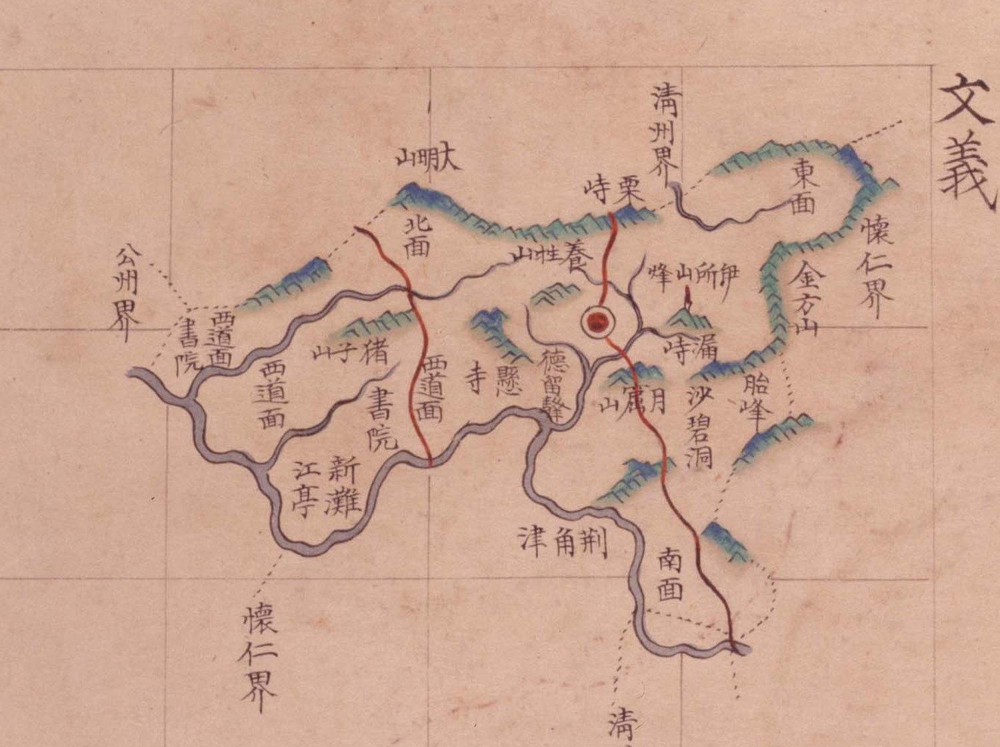

# 『팔도군현지도』 「충청도 문의」 판독

『팔도군현지도』(古4709-111, 1767~1776) 가운데 문의현 도엽. 문의는 **회덕의 북쪽 이웃**입니다.

## 도엽

| | |
|---|---|
| 자료번호 | `GM33535IL0002_018` |
| 원문 | [커먼즈 파일](https://commons.wikimedia.org/wiki/File:Paldo_gunhyeon_jido_GM33535IL0002_018_%EC%B6%A9%EC%B2%AD%EB%8F%84_%EB%AC%B8%EC%9D%98.jpg) |
| 크기 | 3,118 × 4,170 px · 색인 23건 |
| 훑은 범위 | **전면** (2026-10-05) |
| 방위 | **위 = 北** · 가로 이름은 **우횡서** |

## 경계 — 넷

`淸州界`(북동) · `懷仁界`(동·남) · `公州界`(서) · `淸州界`〔?〕(남).

**`懷德界` 가 없습니다.** 회덕 도엽은 북쪽에 `文義界` 를 적는데(짝 성립, 대조표 4.2),
**이 도엽은 회덕을 적지 않습니다** — 일방 기록입니다.

## 고개 — 둘

| 표기 | 자리 |
|---|---|
| **`栗峙`** | 북, `淸州界` 바로 안쪽. 붉은 길이 넘어갑니다 |
| **`漏峙`** | 동, 읍치 동쪽 |

> **`峙` 입니다 — `峴` 이 아닙니다.** 『해동지도』 문의현은 **`栗峴`**, 1872년
> 「문의현지도」는 **`漏峴`** 으로 적습니다(대조표 11.6.2 · 12.7.1).
> **같은 고개를 계열마다 `峙`/`峴` 으로 달리 씁니다** — 대조표 2장의 이표기 목록에 듭니다.

## 면

`北面` · `東面` · `西道面` · `南面`.

## 산천·그 밖

| 갈래 | 읽은 것 |
|---|---|
| 산 | `大明山` · `養性山` · `金方山` · `伊所山` · `猪子山` · `月藏山`〔?〕 · `胎峰` · `烽` |
| 나루·여울 | `荊角津` · `新灘` |
| 그 밖 | `江亭` · `書院` 둘 · `德留壁`〔?〕 · `沙碧洞` · `懸寺`〔?〕 |

**`荊角津` 은 회덕 도엽에도 있습니다** — 금강의 같은 나루를 두 고을이 함께 적었습니다.

## 남은 것

1. `月藏山`·`德留壁`·`懸寺` 의 글자 확인
2. **`栗峙`/`栗峴`, `漏峙`/`漏峴`** — 계열별 표기를 대조표 2장에 정리할 것
3. 서원 둘의 이름

## 변경 이력

| 날짜 | 내용 |
|---|---|
| 2026-10-05 | **문서 개설 · 전면 판독.** 고개 둘을 **`栗峙`·`漏峙`** 로 읽어 다른 계열의 `峴` 표기와 어긋남을 밝혔습니다. `荊角津` 이 회덕 도엽과 겹치는 것을 확인 |
