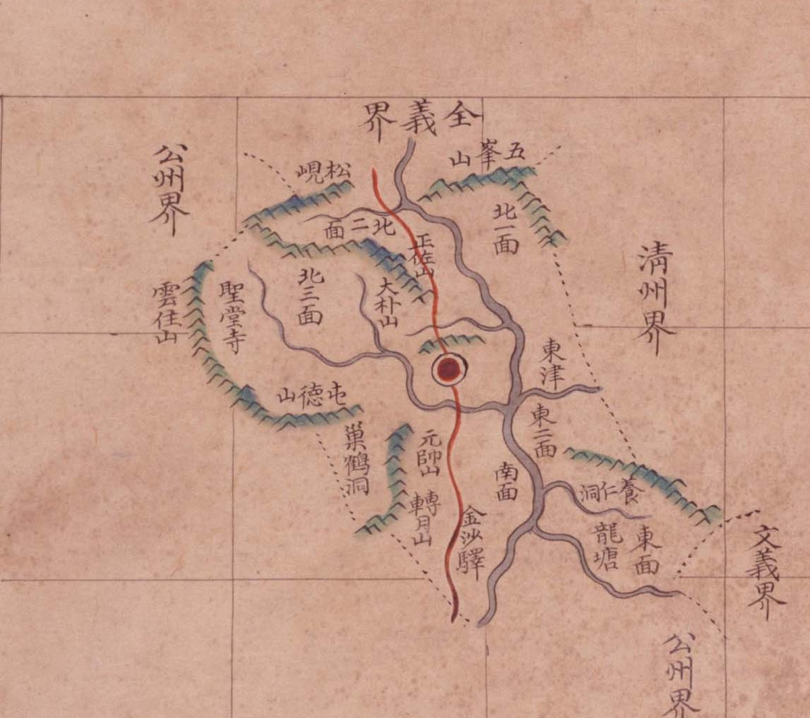

# 『팔도군현지도』 「충청도 연기」 판독

『팔도군현지도』(古4709-111, 1767~1776) 가운데 연기현 도엽. 연기는 **공주목 북쪽**, 지금 세종시입니다.

## 도엽

| | |
|---|---|
| 자료번호 | `GM33535IL0002_010` |
| 원문 | [커먼즈 파일](https://commons.wikimedia.org/wiki/File:Paldo_gunhyeon_jido_GM33535IL0002_010_%EC%B6%A9%EC%B2%AD%EB%8F%84_%EC%97%B0%EA%B8%B0.jpg) |
| 크기 | 3,118 × 4,125 px · 색인 20건 |
| 훑은 범위 | **전면** (2026-10-05) |
| 방위 | **위 = 北** · 가로 이름은 **우횡서** |

## 경계 — 넷

`全義界`(북) · `淸州界`(동) · `文義界`(동남) · `公州界`(서·남).

## 고개 — **하나**

**`松峴`** — 서북, `公州界` 쪽. 붉은 길이 지납니다.

> **계열마다 글자가 다릅니다.** 『해동지도』 연기현은 **`松峙`**, 1872년 「연기현지도」는
> **`松峴店`**(고개 아래 주막)과 **`小松峙`** 를 적습니다(대조표 11.6.5 · 12.7).
> 이 도엽은 **`松峴`** 입니다. `峙`/`峴` 이 한 고개에 다 쓰인 예가 하나 더 늘었습니다.

**`小松峙` 는 이 도엽에 없습니다** — 1872년에만 있습니다.

## 면

`北一面` · `北二面` · `北三面` · `東二面` · `東面` · `南面`.

## 산천·그 밖

| 갈래 | 읽은 것 |
|---|---|
| 산 | `五峯山` · `正佐山` · `大朴山` · `雲住山` · `屯德山` · `元帥山` · `轉月山` |
| 절 | `聖堂寺` |
| 나루 | `東津` |
| 역 | `金沙驛` |
| 그 밖 | `巢鶴洞` · `龍塘` · `養仁洞`〔?〕 |

## 남은 것

1. **`松峴` 의 오늘 자리** — 대조표 3장에서 아직 「미비정」입니다
2. `養仁洞` 의 글자 확인
3. 면 이름 — `東一面` 이 보이지 않습니다. 가려졌는지 없는지

## 변경 이력

| 날짜 | 내용 |
|---|---|
| 2026-10-05 | **문서 개설 · 전면 판독.** 고개는 **`松峴` 하나**뿐이고, 해동지도(`松峙`)·1872(`松峴店`·`小松峙`)와 글자·갯수가 모두 다름을 밝혔습니다 |
