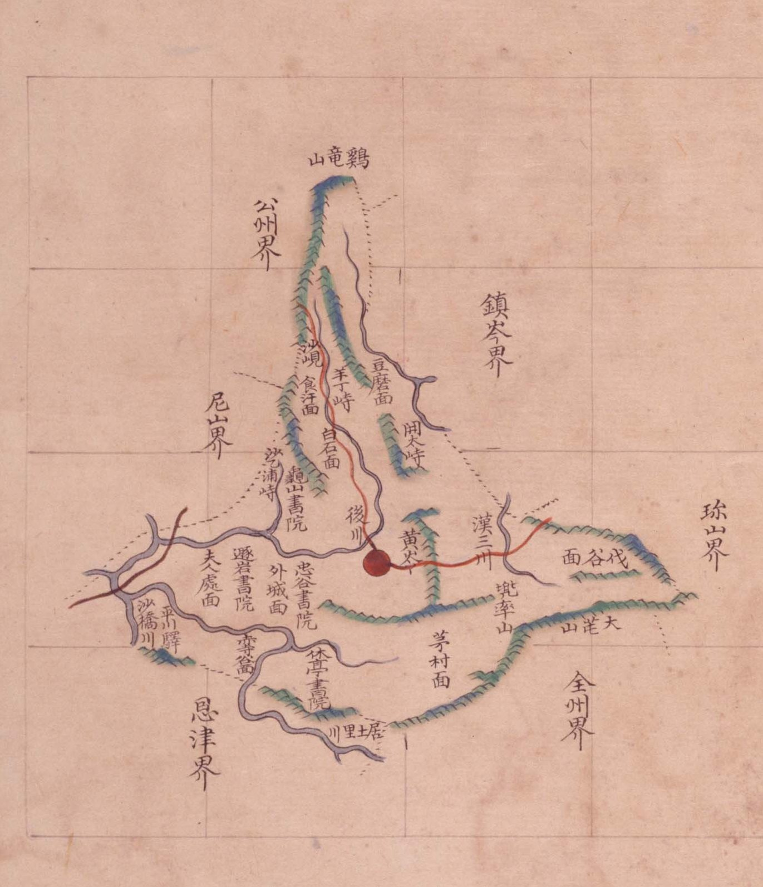

# 『팔도군현지도』 「충청도 연산」 판독

『팔도군현지도』(古4709-111, 1767~1776) 가운데 연산현 도엽. 연산은 **진잠의 서남 이웃**이고,
동쪽 끝의 **`伐谷面`(벌곡면)이 진산과 닿습니다** — 「진산에서 벌곡 가는 길」이 걸리는 도엽입니다.

## 도엽

| | |
|---|---|
| 자료번호 | `GM33535IL0002_008` |
| 원문 | [커먼즈 파일](https://commons.wikimedia.org/wiki/File:Paldo_gunhyeon_jido_GM33535IL0002_008_%EC%B6%A9%EC%B2%AD%EB%8F%84_%EC%97%B0%EC%82%B0.jpg) |
| 크기 | 3,118 × 4,132 px · 색인 25건 |
| 훑은 범위 | **전면** (2026-10-05) |
| 방위 | **위 = 北** · 글 방향 세로 그대로, 가로는 **우횡서** |

## 경계 — 여섯

`公州界`(북서) · **`鎭岑界`**(북동) · **`珎山界`**(동) · `全州界`(남동) · `恩津界`(남) · `尼山界`(서).

**`珎山界` 가 동쪽에 있습니다** — 연산(벌곡면 쪽)과 진산이 닿습니다.
진산군 도엽이 서쪽 길에 `連山界十里` 를 적는 것과 짝이 맞습니다
([`해동지도-진산군-판독.md`](해동지도-진산군-판독.md) · [`1872-진산군지도-판독.md`](1872-진산군지도-판독.md)).

## 고개 — 다섯

| 표기 | 자리 |
|---|---|
| `沙峴` | 서북, `公州界` 쪽 |
| `羊丁峙`〔?〕 | 북, `食汗面` 곁 — 색인 「양정치」 |
| `開太峙` | 북, `豆磨面` 곁 — 색인 「개태치」 |
| `薩浦峙` | 서, `龜山書院` 곁 |
| `黃嶺`〔?〕 | 중앙 동, `兜率山` 쪽 — 색인 「황령」 |

> **`羊丁峙`·`黃嶺` 은 확신 `중` 입니다.** 『해동지도』 연산현은 `良丁峙`·`黃山峙` 계열로
> 적고, 광여도·여지도·지승은 `黃山嶺` 입니다(대조표 11.6.4 · 규장각 3장).
> **이 도엽만 글자가 다를 수 있으므로 고해상 재확인이 필요합니다.**

**`德目峙` 가 이 도엽에는 없습니다.** 『해동지도』 연산현이 적은 그 고개
(= 오늘 논산시 벌곡면 **덕목재**)를 **방안식 도엽은 빠뜨렸습니다**.

## 면

`豆磨面` · `食汗面` · `白石面` · `外城面` · `夫人處面` · `赤寺谷面` · `芼村面` · **`伐谷面`** · `大谷面`.

**`伐谷面` 이 동쪽 끝**, `珎山界` 안쪽에 있습니다.

## 산천·그 밖

| 갈래 | 읽은 것 |
|---|---|
| 산 | `鷄龍山`(북, 고을 밖) · `兜率山` · **`大芚山`**(동남) |
| 물 | `後川` · `漢三川` · `沙橋川` · `居士里川` |
| 서원 | `龜山書院` · `遯巖書院` · `忠谷書院` · `休亭書院` — **넷** |
| 역 | `平川驛` |

## 남은 것

1. **`羊丁峙`·`黃嶺` 의 글자** — 다른 계열과 어긋납니다
2. **`德目峙` 가 왜 없는가** — 회화식(해동지도)에는 있고 방안식에는 없습니다
3. `伐谷面` 안의 리 이름 — 이 도엽은 적지 않습니다

## 변경 이력

| 날짜 | 내용 |
|---|---|
| 2026-10-05 | **문서 개설 · 전면 판독.** 경계 여섯·고개 다섯·면 아홉·서원 넷을 채록. **`珎山界` 가 동쪽에 있어 연산(벌곡)↔진산 접경이 확인**되고, **`德目峙` 가 이 도엽에는 없다**는 것을 적었습니다 |
