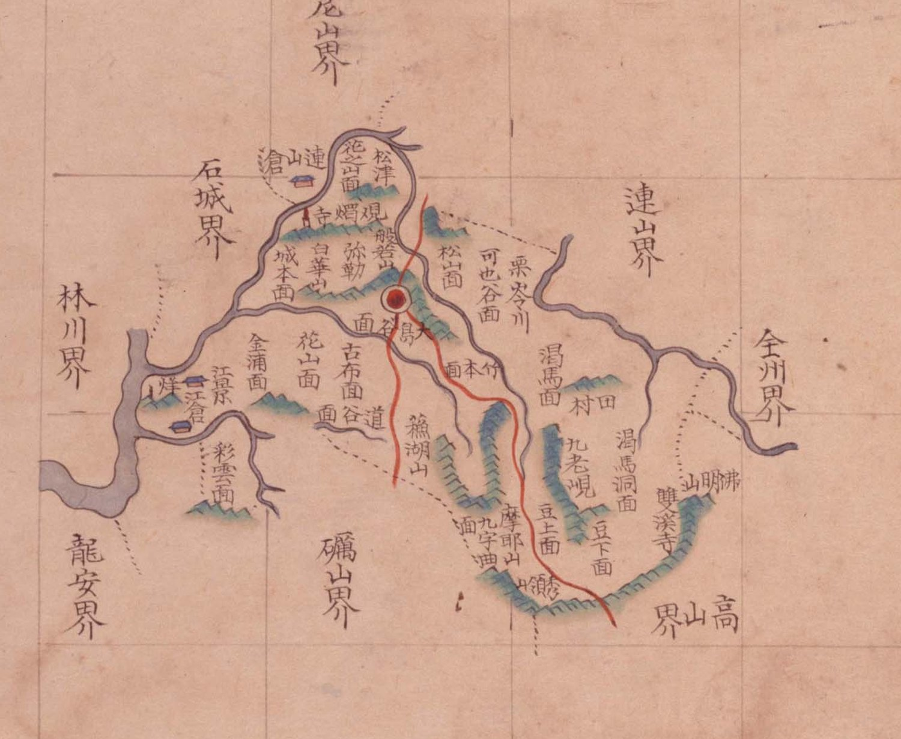

# 『팔도군현지도』 「충청도 은진」 판독

『팔도군현지도』(古4709-111, 1767~1776) 가운데 은진현 도엽. 지금 논산시 은진면·강경 일대입니다.
대전과 닿지 않는 **둘레 고을**이라 간략히 봅니다.

## 도엽

| | |
|---|---|
| 자료번호 | `GM33535IL0002_006` |
| 원문 | [커먼즈 파일](https://commons.wikimedia.org/wiki/File:Paldo_gunhyeon_jido_GM33535IL0002_006_%EC%B6%A9%EC%B2%AD%EB%8F%84_%EC%9D%80%EC%A7%84.jpg) |
| 크기 | 3,118 × 4,145 px · 색인 33건 |
| 훑은 범위 | **전면** (2026-10-05) |
| 방위 | **위 = 北** · 가로 이름은 **우횡서** |

## 경계 — **여덟**, 열한 장 가운데 공주 다음으로 많습니다

`尼山界`(북) · `連山界`(북동) · `全州界`(동) · `高山界`(남동) · `礪山界`(남) ·
`龍安界`(남서) · `林川界`(서) · `石城界`(서북).

**충청도와 전라도가 맞물리는 자리**입니다 — `全州`·`高山`·`礪山`·`龍安` 넷이 전라도입니다.

## 고개 — 둘

| 표기 | 자리 |
|---|---|
| **`九老峴`** | 동, `渴馬洞面` 곁 |
| `○岺`〔?〕 | 남동 끝, `高山界` 쪽 — 글자를 가리지 못했습니다 |

색인은 「구노현」·「수령산」·「율령천」을 듭니다. **`栗岺川`**(율령천)은 **내 이름**이지
고개가 아닙니다 — 색인의 「―령」을 고개로 세지 않도록 주의합니다.

## 면

`花之面`〔?〕 · `城本面` · `花山面` · `金浦面` · `彩雲面` · `古布面` · `谷面` · `松山面` ·
`可也谷面` · `竹本面` · `渴馬洞面` · `田村面` · `豆上面` · `豆下面` · `九字浦面` — **열다섯**.
**열한 장 가운데 면이 가장 많습니다.**

## 산천·그 밖

| 갈래 | 읽은 것 |
|---|---|
| 산 | `般若山` · `白華山` · `蕪湖山` · `摩耶山` · `佛明山` |
| 불상 | **`彌勒`** — 은진미륵(관촉사 석조미륵보살입상) |
| 물 | `松津` · `栗岺川` · `大島` |
| 절 | `雙溪寺` · `觀燭寺`〔?〕 |
| 창 | `倉` 둘(북·서) · `江倉` |
| 봉수 | `烽` |

## 남은 것

1. 남동 끝 `○岺`〔?〕 의 첫 글자
2. `花之面`·`觀燭寺` 의 글자 확인
3. 면 열다섯의 차례와 오늘 자리

## 변경 이력

| 날짜 | 내용 |
|---|---|
| 2026-10-05 | **문서 개설 · 전면 판독.** 경계 여덟·면 열다섯을 채록. **`栗岺川` 이 고개가 아니라 내 이름**임을 밝혀, 색인의 「―령」을 고개로 세지 않도록 적었습니다 |
