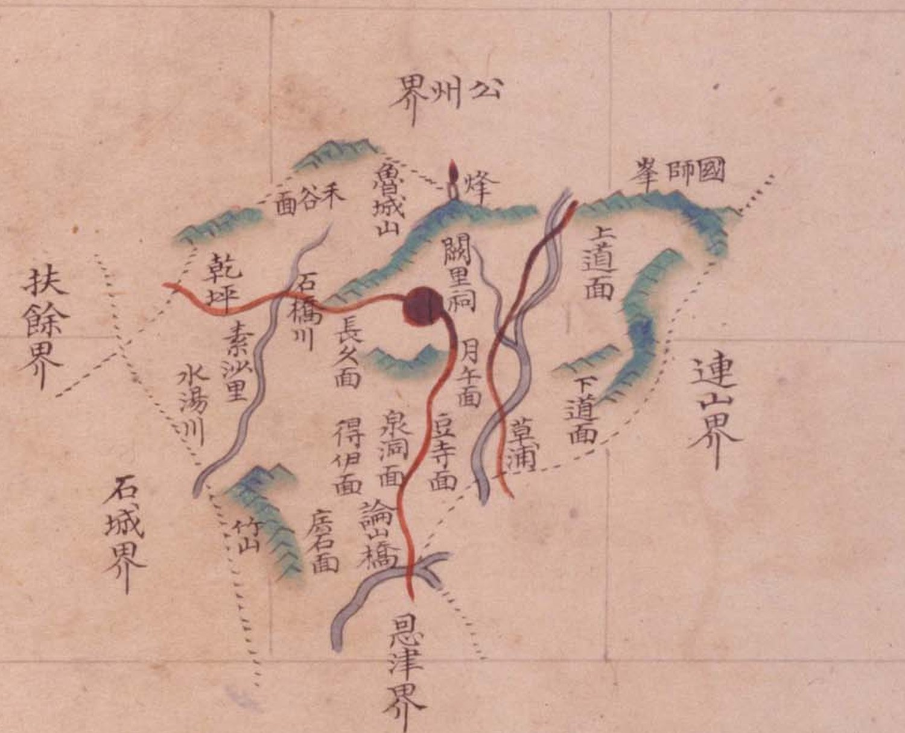

# 『팔도군현지도』 「충청도 이산」 판독

『팔도군현지도』(古4709-111, 1767~1776) 가운데 이산현(尼山縣) 도엽. 지금 논산시 노성면입니다.
대전과 닿지 않는 **둘레 고을**이라 간략히 봅니다.

> **이름이 헷갈립니다.** 충청도 **`尼山`**(이산)과 평안도 **`理山`**(이산)은 다른 고을이고,
> 규장각 색인도 둘을 섞습니다. 이 도엽은 **충청도 이산**입니다(대조표 2장).

## 도엽

| | |
|---|---|
| 자료번호 | `GM33535IL0002_005` |
| 원문 | [커먼즈 파일](https://commons.wikimedia.org/wiki/File:Paldo_gunhyeon_jido_GM33535IL0002_005_%EC%B6%A9%EC%B2%AD%EB%8F%84_%EC%9D%B4%EC%82%B0.jpg) |
| 크기 | 3,118 × 4,150 px · 색인 20건 |
| 훑은 범위 | **전면** (2026-10-05) |
| 방위 | **위 = 北** · 가로 이름은 **우횡서** |

## 경계 — 다섯

`公州界`(북) · `連山界`(동) · `恩津界`(남) · `石城界`(남서) · `扶餘界`(서).

## 고개 — **하나도 없습니다**

**`峙`·`峴` 이 한 글자도 없습니다.** 진잠 도엽과 함께 **둘뿐인 사례**입니다.

『해동지도』 이산현은 `板峙嶺` 을 적습니다(대조표 11.6.7). **방안식이 빠뜨린 것**입니다.

## 면

`禾谷面` · `長久面` · `得伊面` · `泉洞面` · `豆寺面` · `月午面` · `廣石面` · `上道面` · `下道面`.

## 산천·그 밖

| 갈래 | 읽은 것 |
|---|---|
| 산 | `魯城山` · `國師峯` · `竹山` |
| 물 | `石橋川` · `水湯川` · `草浦` |
| 그 밖 | **`闕里祠`**(궐리사) · `乾坪` · `素沙里` · `論橋` · `烽` |

**`闕里祠`** 는 공자의 고향 궐리를 딴 사당으로, 노성 궐리사입니다.

## 남은 것

1. `板峙嶺`(해동지도)이 이 도엽에 없는 까닭
2. `烽` 의 이름 — 노성산 봉수인지

## 변경 이력

| 날짜 | 내용 |
|---|---|
| 2026-10-05 | **문서 개설 · 전면 판독.** 경계 다섯·면 아홉을 채록. **고개가 하나도 없고**, 해동지도의 `板峙嶺` 이 빠진 것을 확인 |
