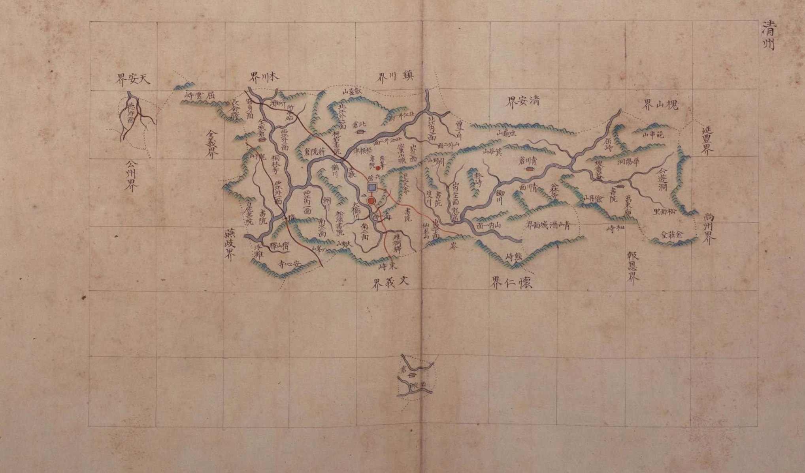

# 『팔도군현지도』 「충청도 청주」 판독

『팔도군현지도』(古4709-111, 1767~1776) 가운데 청주목 도엽. **열한 장 가운데 홀로 가로로 눕힌 판형**입니다.
대전과는 회덕 북동쪽의 **주안면(周安面)**으로만 닿습니다.

## 도엽

| | |
|---|---|
| 자료번호 | `GM33535IL0002_020` |
| 원문 | [커먼즈 파일](https://commons.wikimedia.org/wiki/File:Paldo_gunhyeon_jido_GM33535IL0002_020_%EC%B6%A9%EC%B2%AD%EB%8F%84_%EC%B2%AD%EC%A3%BC.jpg) |
| 크기 | **3,129 × 2,053 px** — 혼자만 가로 |
| 규장각 색인 | 78건 |
| 훑은 범위 | 개관 (2026-10-05) |
| 방위 | **위 = 北** · 가로 이름은 **우횡서** |

**고을이 동서로 아주 깁니다.** 그래서 종이를 눕혔습니다 — **고을 생김새가 판형을 정한
유일한 사례**입니다.

## 경계 — 열셋

`天安界` · `木川界` · `鎭川界` · `淸安界` · `槐山界` · `延豐界` · `尙州界` · `報恩界` ·
`懷仁界` · `文義界` · `燕歧界` · `全義界` · `公州界`.

**`懷德界` 가 없습니다.** 회덕 도엽은 동북에 `淸州周安界` 를 적는데(면 이름까지),
**청주 도엽은 회덕을 적지 않습니다** — 일방 기록입니다(대조표 4.2 의 주의).

## **월경지(越境地)가 둘 그려져 있습니다**

도엽 **왼쪽 위**와 **아래 가운데**에, 본 고을에서 **떨어져 나온 작은 구역**이 따로
그려지고 저마다 **`倉`** 이 찍혀 있습니다. 둘레는 점선으로 끊겨 있습니다.

**이 계열이 월경지를 그린 것은 이 도엽뿐입니다.** 청주목이 멀리까지 월경지를 둔 것은
잘 알려진 사실인데, **방안식이라 떨어진 자리를 종이 위 제자리에 놓을 수 있어** 그릴 수
있었던 것으로 보입니다. **회화식 도엽은 이렇게 못 그립니다.**

## 고개 — 일곱 (색인)

`巨叱大嶺` · `屈雲峙` · `屈峙` · `粉峙` · `熊峙` · `杻峙`〔?〕 · `栗峙`.

**글자는 아직 확인하지 않았습니다** — 색인의 한글 음만 옮긴 것입니다.
`栗峙` 는 문의 도엽의 `栗峙` 와 이름이 같습니다. 같은 고개인지 보지 않았습니다.

## 남은 것

1. **전면 판독** — 78건 가운데 고개 일곱의 글자부터
2. **월경지 둘의 이름** — `倉` 말고 다른 글자가 있는지 고해상으로
3. **`周安面`** 이 도엽 어디에 있는지 — 회덕과 닿는 자리입니다
4. 청주 `栗峙` 와 문의 `栗峙` 가 같은 고개인지

## 변경 이력

| 날짜 | 내용 |
|---|---|
| 2026-10-05 | **문서 개설 · 개관.** 홀로 가로 판형인 것, 경계 열셋, **월경지 둘이 그려진 것**을 적었습니다. 고개 일곱은 색인의 한글 음만 있고 글자는 미확인입니다 |
