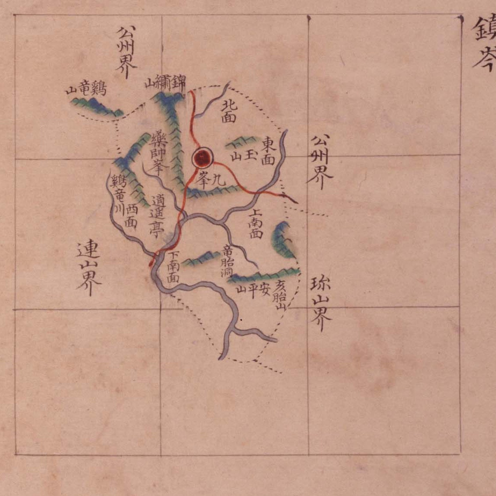
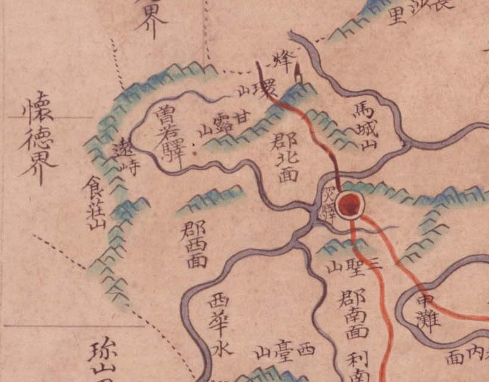

# 『팔도군현지도』 판독 — 충청도 열한 고을

『팔도군현지도(八道郡縣地圖)』(규장각 **古4709-111**, `GR33535_00`, **1767~1776**).
**방안식(方眼式)** 군현도 책입니다 — 고을마다 한 장씩, **눈금(方眼) 위에** 그렸습니다.
2026-10-03 에 규장각에서 다섯 계열을 한꺼번에 찾으면서 들어왔고
([`규장각-고지도-새계열.md`](규장각-고지도-새계열.md)), 대전에 걸리는 **충청도 열한 장**을
받아 두었습니다. 회덕은 2026-10-04 에 읽었고, **진잠·공주·옥천은 2026-10-05 에 읽습니다.**

> **규장각 목록은 이 책을 1724년이라 적는데 틀렸습니다.** 1767~1776 입니다 —
> 근거는 [`규장각-고지도-새계열.md`](규장각-고지도-새계열.md) 6.3.

## 도엽 열한 장

| 이미지 ID | 고을 | 크기 | 색인 | 원문 | 판독 |
|---|---|---|---|---|---|
| `GM33535IL0002_002` | **공주** | 3118×4102 | 79 | [커먼즈](https://commons.wikimedia.org/wiki/File:Paldo_gunhyeon_jido_GM33535IL0002_002_%EC%B6%A9%EC%B2%AD%EB%8F%84_%EA%B3%B5%EC%A3%BC.jpg) | **2026-10-05 · 대전 꼬리** |
| `GM33535IL0002_005` | 이산 | 3118×4150 | 20 | [커먼즈](https://commons.wikimedia.org/wiki/File:Paldo_gunhyeon_jido_GM33535IL0002_005_%EC%B6%A9%EC%B2%AD%EB%8F%84_%EC%9D%B4%EC%82%B0.jpg) | 미착수 |
| `GM33535IL0002_006` | 은진 | 3118×4145 | 33 | [커먼즈](https://commons.wikimedia.org/wiki/File:Paldo_gunhyeon_jido_GM33535IL0002_006_%EC%B6%A9%EC%B2%AD%EB%8F%84_%EC%9D%80%EC%A7%84.jpg) | 미착수 |
| `GM33535IL0002_008` | 연산 | 3118×4132 | 25 | [커먼즈](https://commons.wikimedia.org/wiki/File:Paldo_gunhyeon_jido_GM33535IL0002_008_%EC%B6%A9%EC%B2%AD%EB%8F%84_%EC%97%B0%EC%82%B0.jpg) | 색인만 |
| `GM33535IL0002_009` | **진잠** | 3118×4104 | 15 | [커먼즈](https://commons.wikimedia.org/wiki/File:Paldo_gunhyeon_jido_GM33535IL0002_009_%EC%B6%A9%EC%B2%AD%EB%8F%84_%EC%A7%84%EC%9E%A0.jpg) | **2026-10-05 · 전면** |
| `GM33535IL0002_010` | 연기 | 3118×4125 | 20 | [커먼즈](https://commons.wikimedia.org/wiki/File:Paldo_gunhyeon_jido_GM33535IL0002_010_%EC%B6%A9%EC%B2%AD%EB%8F%84_%EC%97%B0%EA%B8%B0.jpg) | 색인만 |
| `GM33535IL0002_011` | **회덕** | 3118×4131 | 20 | [커먼즈](https://commons.wikimedia.org/wiki/File:Paldo_gunhyeon_jido_GM33535IL0002_011_%EC%B6%A9%EC%B2%AD%EB%8F%84_%ED%9A%8C%EB%8D%95.jpg) | **2026-10-04** |
| `GM33535IL0002_012` | **옥천** | 3118×4169 | 48 | [커먼즈](https://commons.wikimedia.org/wiki/File:Paldo_gunhyeon_jido_GM33535IL0002_012_%EC%B6%A9%EC%B2%AD%EB%8F%84_%EC%98%A5%EC%B2%9C.jpg) | **2026-10-05 · 서쪽 끝** |
| `GM33535IL0002_017` | 회인 | 3118×4096 | 15 | [커먼즈](https://commons.wikimedia.org/wiki/File:Paldo_gunhyeon_jido_GM33535IL0002_017_%EC%B6%A9%EC%B2%AD%EB%8F%84_%ED%9A%8C%EC%9D%B8.jpg) | 색인만 |
| `GM33535IL0002_018` | 문의 | 3118×4170 | 23 | [커먼즈](https://commons.wikimedia.org/wiki/File:Paldo_gunhyeon_jido_GM33535IL0002_018_%EC%B6%A9%EC%B2%AD%EB%8F%84_%EB%AC%B8%EC%9D%98.jpg) | 색인만 |
| `GM33535IL0002_020` | 청주 | 3129×2053 | 78 | [커먼즈](https://commons.wikimedia.org/wiki/File:Paldo_gunhyeon_jido_GM33535IL0002_020_%EC%B6%A9%EC%B2%AD%EB%8F%84_%EC%B2%AD%EC%A3%BC.jpg) | 색인만 |

「색인」은 규장각 지명 색인의 건수입니다([`규장각-색인.csv`](규장각-색인.csv)).
**청주만 가로로 눕힌 판형**입니다(3129×2053).

## 이 계열의 생김새

**① 눈금이 종이 전체에 그어져 있고, 고을은 그 위에 떠 있습니다.**
진잠처럼 작은 고을은 눈금 **서너 칸**만 차지하고 나머지는 빈 종이입니다. 공주처럼
큰 고을은 **여섯 칸 × 다섯 칸**을 채웁니다. **고을의 크기가 종이에서 바로 보입니다** —
회화식(해동지도·광여도·여지도·지승)이 고을마다 종이를 가득 채우는 것과 정반대입니다.

**② 위가 北입니다.** 열한 장 모두 그렇습니다.

**③ 글 방향이 섞입니다.** 세로 이름은 그냥 읽히고, **가로 이름은 우횡서**입니다
(`山竜鷄` = 鷄龍山). 경계 표기 `○○界` 는 **세로**로 가장자리에 붙습니다.

**④ 읍치는 붉은 겹동그라미**, 길은 **붉은 선**, 내는 **잿빛 띠**, 산줄기는 **푸른 톱니**입니다.
역·원·창·서원에는 저마다 다른 꼴을 씁니다.

**⑤ 공주 도엽 오른쪽 위에 `京城帝國大學圖書` 장서인**이 찍혀 있습니다.

---

## 1. 진잠 — **고개가 하나도 없습니다** (2026-10-05)



진잠은 작은 고을이라 **눈금 세 칸 × 네 칸** 귀퉁이에만 그려졌습니다. 읽은 것 전부:

| 갈래 | 읽은 것 |
|---|---|
| 경계 | **`公州界`**(서북·동 **두 곳**) · **`連山界`**(서남) · **`珎山界`**(동남) |
| 면 | `北面` · `東面` · `西面` · `上南面` · `下南面` — **다섯** |
| 산 | `鷄龍山`(서북, 고을 밖) · `錦繡山` · `藥師峯` · `九峯` · `玉山` · `安平山` · `亥胎山` |
| 물 | `鷄龍川` |
| 그 밖 | `逍遙亭` · `龍胎洞` |

**`峙`·`峴` 이 한 글자도 없습니다.** 1872년 「진잠지도」가 `奄峴`·`牛拳峴` 둘을 적는 것과
견주면([`1872-진잠지도-판독.md`](1872-진잠지도-판독.md)), **이 계열은 고개를 적지 않는
고을이 있다**는 뜻입니다. 회덕 도엽이 넷을 적는 것과도 어긋나므로 **계열의 버릇이 아니라
도엽마다 다른 것**으로 봅니다.

**`公州界` 가 두 곳입니다** — 서북(계룡산 쪽)과 동(지금 유성 쪽). 공주목이 진잠을
**둘러싸듯** 접했음을 보여 줍니다. 그리고 **`珎山界` 가 동남**에 있어, 진잠과 진산이
**직접 닿았다**는 기록이 하나 더 늘었습니다(대조표 4.2 의 「진잠↔진산」 짝).

## 2. 공주목 — 대전 꼬리 (2026-10-05)


공주목은 **동남으로 길게 꼬리**를 뻗습니다. 그 꼬리가 지금의 **대전 중구·동구 남부**입니다.
꼬리를 북에서 남으로 훑으면 이렇습니다.

```
文義界 ─ 陽也里面 · 鳴雕面 · 九則面 · 德津面 · 炭洞面 · 縣內面 ─ 儒城倉
   │
   └─ 懷德界 ────────────────────────────┐
         介水院 · 川內面 · 道山書院 · 寶文山   │
         柳等川面 · 美花部田〔?〕             │  鎭岑界(서)
         無愁洞 · 萬仞山 · 山內面 · 所田里     │
                                        └─ 沃川界(동) · 珎山界(동남 끝)
```

**이것이 6.4 의 뼈대입니다.** 북쪽 `懷德界` 와 동남 끝 `珎山界` 사이에
**`柳等川面` → `山內面` → `所田里`** 가 **끊이지 않고 들어앉아** 있습니다. 곧
**회덕과 진산 사이를 공주목 산내면이 가로막습니다** — 둘이 직접 닿지 않았다는
[`규장각-고지도-새계열.md`](규장각-고지도-새계열.md) 5.10 을 이 도엽이 다시 받칩니다.

**고개는 꼬리 쪽에 없습니다.** 공주 도엽의 고개 아홉(`角屹峙`·`介峙`·`揷峙`·`松峙`·
`正峙`〔?〕·`板峙`·`車嶺`·`車踰嶺`·`雙嶺峯`)은 **모두 서·북부**이고, **대전 꼬리에는
하나도 없습니다.** `揷峙`(삽재)가 가장 동쪽인데 지금 유성구 갑동 쪽입니다.

> **`美花部田`〔?〕 은 확신이 낮습니다.** 넷째 글자가 `田` 으로 보이나 `曲`(부곡)일
> 수 있습니다. 규장각 색인도 「미화부전」으로 적었습니다. 고해상 재확인이 필요합니다.

## 3. 옥천 — **`遠峙` 가 여기에도 있습니다** (2026-10-05)



옥천 도엽의 **서쪽 끝**입니다. 세로로 `懷德界`, 그 안쪽에 **`遠峙`**, 그 아래
**`食莊山`**(식장산), 오른쪽에 `增若驛`·`甘露山`·`環山`(봉수)·`馬城山`이 있습니다.

**회덕 도엽의 `遠峙` 와 같은 고개로 봅니다.**

| | 자리 |
|---|---|
| **회덕 도엽**(`_011`)의 `遠峙` | 도엽 **동쪽 끝**, `食藏山` 북 |
| **옥천 도엽**(`_012`)의 `遠峙` | 도엽 **서쪽 끝**, `懷德界` 안쪽 · `食莊山` 북 · `增若驛` 서 |

**한 지도책 안에서 이웃 두 고을이 같은 고개를 서로 적었습니다.** 대조표 4.2 의
「이웃이 서로를 적는 짝」에 **회덕 ↔ 옥천**이 `遠峙` 로 들어갑니다.

> **그리고 이것이 `馬達峙` 쟁점에 닿습니다.** 1872년 「옥천군지도」는 **같은 자리**를
> **`馬達峙`** 로 적습니다 — 동구 세천동 ↔ 옥천 군북면 **증약리**(대조표 15.3).
> 이 도엽의 `遠峙` 도 **`增若驛` 바로 서쪽**입니다. **1770년대 `遠峙` ↔ 1872년 `馬達峙`
> 가 한 고개의 두 이름**일 수 있습니다. 대조표가 좌표로 잰 `遠峙` ↔ 마달령〔세천〕
> **1.39 km**(6.9)와도 결이 같습니다.
>
> **다만 단정하지 않습니다.** 두 이름이 같은 고개라는 **직접 증언은 아직 없습니다** —
> 같은 자리를 가리키는 **이웃 관계**가 그렇다는 것까지입니다.

**`食莊山` 입니다 — `食藏山` 이 아닙니다.** 가운데 글자가 `莊`(艹+壯)으로 또렷합니다.
해동지도 회덕현은 `食藏山`, 이 도엽은 `食莊山` — **이표기 하나를 더합니다**(대조표 2장).

## 4. 회덕 — 이미 읽었습니다

2026-10-03~04 에 읽어 [`규장각-고지도-새계열.md`](규장각-고지도-새계열.md) 5.1·5.3·5.5·5.8
에 있습니다. 요지만 옮깁니다.

- 고개 **넷** — **`東峙` · `質峙` · `迭峙` · `遠峙`**. 서→동으로 줄을 섭니다
- **규장각 색인이 `質峙` 와 `迭峙` 를 둘 다 「질치」로 적어 묶어 두었습니다**(5.5).
  색인만 믿으면 셋으로 셉니다
- 도엽을 좌표에 앉혀 네 고개를 비래동→가양→용운→세천으로 세웠습니다(잔차 **1.26 km**, 5.8)
- **`珍山界` 가 없습니다.** 남쪽 길이 `質峙` 를 지나 `公州界` 로 빠집니다(5.9)

---

## 도엽을 좌표에 앉혀 보았습니다 — **공주는 안 됩니다**

회덕 도엽은 잔차 **1.26 km** 로 앉았습니다(5.8). 같은 방법을 공주 도엽에 썼더니
**잔차 4.0 km** 가 나왔습니다. 동쪽 꼬리의 기준점만으로 다시 맞춰도 **3.7 km** 입니다.

| 기준점 | 잔차(동쪽만 맞춤) |
|---|---|
| 이인 | 0.1 km |
| 반포면 | 1.8 km |
| 계룡산 · 갑사 | 2.3 km |
| 유성창 | 3.2 km |
| 만인산 | 4.4 km |
| 무수동 | 4.8 km |
| **보문산** | **5.4 km** |

**고을이 길고 꼬리가 휘어, 한 장을 어파인 하나로는 펼 수 없습니다.** 방안식이라고
다 되는 것이 아니라 **고을의 생김새가 정합니다** — 회덕처럼 뭉친 고을은 되고,
공주처럼 꼬리 달린 고을은 안 됩니다.

**그러므로 공주 도엽에서는 좌표를 쓰지 않습니다.** 위 2 에서 쓴 것은 **차례와
이웃 관계**뿐입니다. 그래도 방향은 맞습니다 — 앉힌 `山內面` 이 동구 삼괴동 쪽,
`柳等川面` 이 중구 안영동 쪽으로 떨어집니다.

## 규장각 색인을 고칠 곳

색인은 한글 음만 주고 한자를 주지 않습니다. 도엽에서 글자를 확인해 고칩니다.

| 도엽 | 색인 | 도엽의 글자 |
|---|---|---|
| 진잠 | 약수봉 | **`藥師峯`**(약사봉) |
| 진잠 | 해태산 | **`亥胎山`** |
| 진잠 | 금수산 | **`錦繡山`** |
| 진잠 | 용태동 | **`龍胎洞`**(`竜胎洞`) |
| 옥천 | 식장산 | **`食莊山`**(`藏` 아님) |
| 옥천 | 원치 | **`遠峙`** |
| 회덕 | 질치 ×2 | **`質峙`** 와 **`迭峙`** — 다른 고개 둘(5.5) |

## 남은 것

1. **공주 도엽 서·북부** — 고개 아홉의 글자 확인. 대전 밖이지만 `揷峙`(삽재)는 걸립니다
2. **옥천 도엽 전면** — 고개 여덟(`加峙`·`葛峴`·`問峙`·`安峙`·`永音峙`·`遠峙`·`楡嶺`·`長善峙`)
3. **연산·연기·문의·회인** — 색인만 보았고 도엽을 펴지 않았습니다
4. **청주** — 색인 78건에 고개 일곱. 판형이 달라 따로 보아야 합니다
5. **`美花部田`〔?〕 넷째 글자** — `田` 인가 `曲`(부곡)인가
6. **`遠峙` = `馬達峙` 인가** — 두 이름을 잇는 직접 증언 찾기(『여지도서』·『옥천군읍지』 산천 조)

## 변경 이력

| 날짜 | 내용 |
|---|---|
| 2026-10-05 | **문서 개설.** 진잠·공주·옥천 세 도엽을 읽었습니다. **옥천 도엽에서 `遠峙` 를 찾아 회덕↔옥천이 같은 고개를 서로 적는 짝임을 밝혔고**(3), 자리가 `增若驛` 서쪽이어서 1872년 `馬達峙` 와 한 고개일 가능성을 세웠습니다. **진잠 도엽에는 고개가 하나도 없습니다**(1). **공주 도엽의 대전 꼬리가 `懷德界`→`柳等川面`→`山內面`→`珎山界` 로 이어져 5.10 을 받칩니다**(2). 공주 도엽은 **좌표에 앉지 않습니다**(잔차 4.0 km) — 꼬리가 휘어서입니다. 색인 일곱 건의 한자를 고쳤습니다 |
