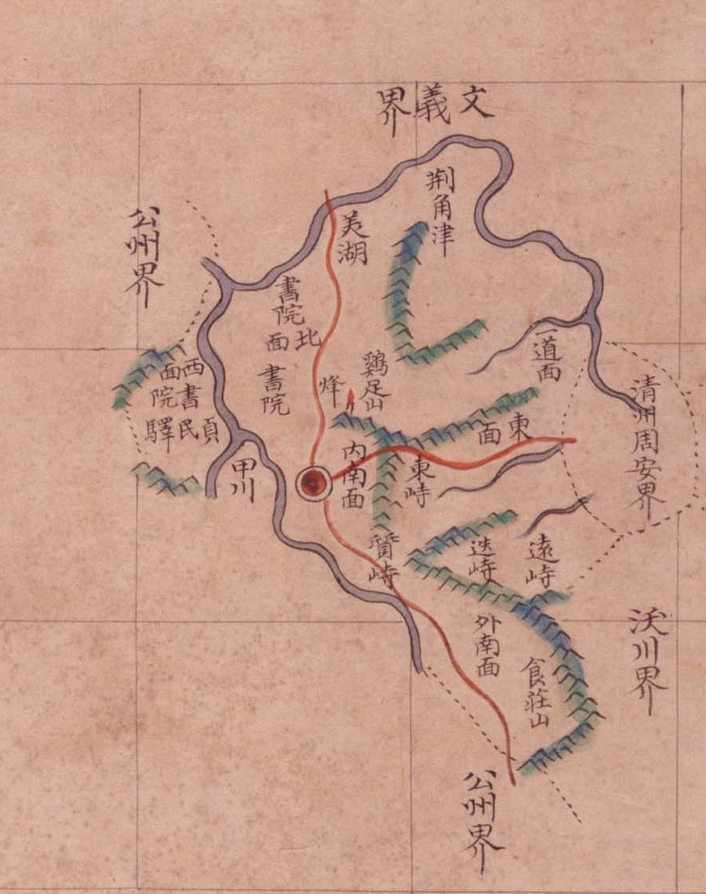

# 『팔도군현지도』 「충청도 회덕」 판독

『팔도군현지도』(규장각 **古4709-111**, 1767~1776) 가운데 회덕현 도엽.
**방안식**입니다 — 계열 전체의 생김새는 [`팔도군현지도-판독.md`](팔도군현지도-판독.md).
**대전 본역의 중심 도엽**이고, 이 계열에서 **고개를 가장 많이 적은 장**입니다.

## 도엽

| | |
|---|---|
| 자료번호 | `GM33535IL0002_011` |
| 원문 | [커먼즈 파일](https://commons.wikimedia.org/wiki/File:Paldo_gunhyeon_jido_GM33535IL0002_011_%EC%B6%A9%EC%B2%AD%EB%8F%84_%ED%9A%8C%EB%8D%95.jpg) |
| 크기 | 3,118 × 4,131 px |
| 규장각 색인 | 20건 |
| 훑은 범위 | 고개 중심 (2026-10-04) · **전면** (2026-10-05) |
| 방위 | **위 = 北** |
| 글 방향 | 세로는 그대로, **가로는 우횡서** |

## 경계 — **다섯**, 그 가운데 하나는 **면 이름까지**

| 방위 | 표기 |
|---|---|
| 북 | `文義界` |
| 서북 | `公州界` |
| **동북** | **`淸州周安界`** |
| 동 | `沃川界` |
| 남 | `公州界` |

**`淸州周安界` 는 고을이 아니라 면을 적었습니다** — 청주 주안면입니다. 이 계열은
**가끔 면 이름까지 답니다**(회인 도엽의 `淸州固安面界`, 옥천 도엽의 `淸州周岸界`도 같은 투).
**옥천 도엽은 같은 면을 `周岸` 으로 적습니다** — 한 책 안에서 `安`/`岸` 이 갈립니다.

**`珍山界` 가 없습니다.** 남쪽은 두 번 다 `公州界` 입니다 — 회덕과 진산이 직접
닿지 않았다는 읽기를 받칩니다([`규장각-고지도-새계열.md`](규장각-고지도-새계열.md) 5.10).

## 면 — 여섯

`北面` · `西面` · `東面` · `一道面` · `內南面` · `外南面`.
읍치 자리에 `縣內面` 을 따로 적지 않았습니다.

## 고개 — **넷**

서에서 동으로 **한 줄**로 늘어섭니다.

| 표기 | 자리 | 앉힌 좌표 |
|---|---|---|
| **`東峙`** | 읍치 동남, `鷄足山` 아래 | 36.367 / 127.460 |
| **`質峙`** | 그 남쪽, **붉은 길 위** | 36.347 / 127.444 |
| **`迭峙`** | 그 동쪽, 길 밖 줄기 | 36.341 / 127.472 |
| **`遠峙`** | 도엽 **동쪽 끝**, `食莊山` 북 | 36.336 / 127.492 |

좌표는 도엽을 어파인으로 앉힌 값입니다(잔차 **1.26 km** —
[`규장각-고지도-새계열.md`](규장각-고지도-새계열.md) 5.8). 비래동 → 가양 → 용운 → 세천
차례가 됩니다.

> **⚠ 규장각 색인은 셋으로 셉니다.** `質峙` 와 `迭峙` 를 **둘 다 「질치」**로 적어
> 묶어 두었기 때문입니다(5.5). **색인만 믿으면 고개 하나를 잃습니다.**

**`遠峙` 는 옥천 도엽에도 있습니다**(2026-10-05) — `懷德界` 안쪽, `增若驛` 서쪽.
**한 지도책 안에서 이웃 두 고을이 같은 고개를 서로 적은 첫 사례**입니다
([`팔도군현지도-옥천-판독.md`](팔도군현지도-옥천-판독.md) · 대조표 4.2).

## 산천

| 갈래 | 읽은 것 |
|---|---|
| 산 | `鷄足山` · **`食莊山`** |
| 물 | `甲川` · `美湖` |
| 나루 | `荊角津` |
| 봉수 | `烽`(읍치 북, 계족산 서) |

> **`食莊山` 입니다 — `食藏山` 이 아닙니다.** 가운데 글자가 `莊`(艹+壯)으로 또렷하고,
> **같은 책 옥천 도엽도 `食莊山`** 입니다. 『해동지도』 회덕현은 `食藏山` 이므로
> **계열이 갈리는 이표기**입니다(대조표 2장).

## 그 밖

`貞民驛`(정민역) · **`書院` 셋**(읍치 서북·서·서남).

## 남은 것

1. **서원 셋의 이름** — 이 도엽은 `書院` 이라고만 적습니다. 숭현서원·미호서원 등과
   맞추려면 다른 자료가 필요합니다
2. **`淸州周安界` 의 `安`/`岸`** — 옥천 도엽과 글자가 다릅니다. 원본 고해상으로 가릴 것
3. `烽` 의 이름 — 계족산 봉수인지

## 변경 이력

| 날짜 | 내용 |
|---|---|
| 2026-10-04 | 고개 넷(`東峙`·`質峙`·`迭峙`·`遠峙`)을 읽고 좌표에 앉힘. 색인이 `質峙`/`迭峙` 를 묶어 둔 것을 밝힘 |
| 2026-10-05 | **전면 판독.** 경계 다섯·면 여섯·`貞民驛`·서원 셋을 채록. **`淸州周安界` 가 면 이름까지 적은 것**과 **`食莊山`**(`藏` 아님)을 확인. `遠峙` 가 옥천 도엽에도 있음을 밝혀 짝을 세움 |
