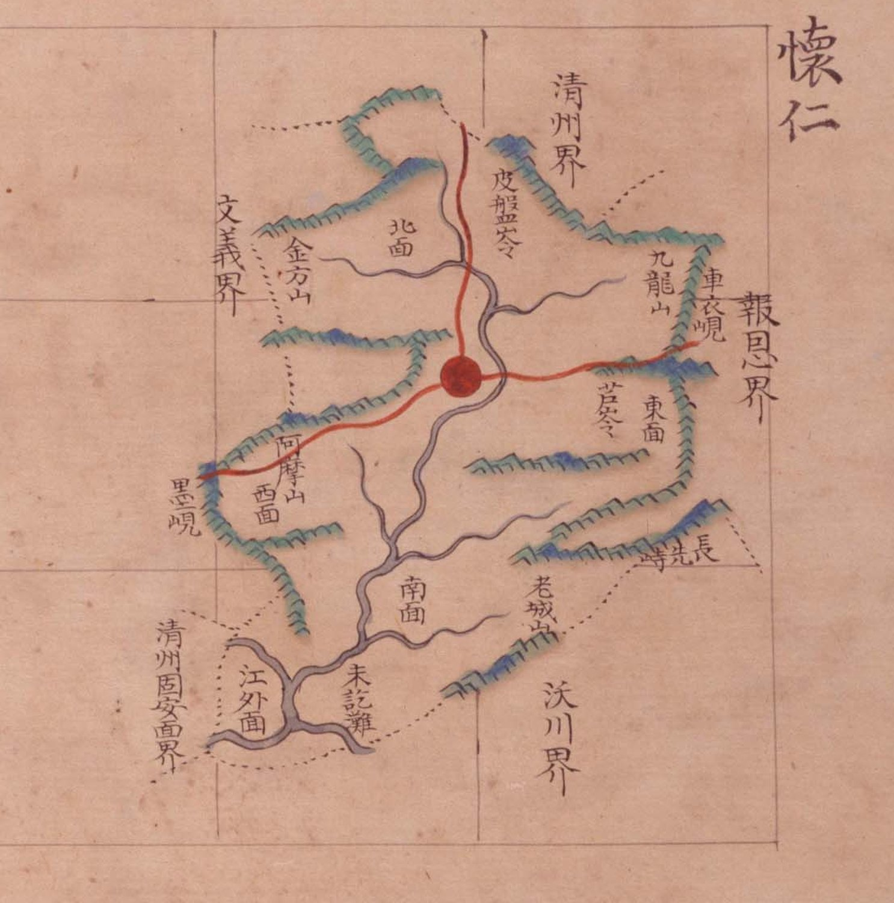

# 『팔도군현지도』 「충청도 회인」 판독

『팔도군현지도』(古4709-111, 1767~1776) 가운데 회인현 도엽. 회인은 **문의의 동쪽, 옥천의 북쪽**입니다.
대전과 직접 닿지는 않으나, **고개 이름이 대조표에 걸립니다**(`皮盤嶺`·`墨峴`).

## 도엽

| | |
|---|---|
| 자료번호 | `GM33535IL0002_017` |
| 원문 | [커먼즈 파일](https://commons.wikimedia.org/wiki/File:Paldo_gunhyeon_jido_GM33535IL0002_017_%EC%B6%A9%EC%B2%AD%EB%8F%84_%ED%9A%8C%EC%9D%B8.jpg) |
| 크기 | 3,118 × 4,096 px · 색인 **15건**(진잠과 함께 가장 적음) |
| 훑은 범위 | **전면** (2026-10-05) |
| 방위 | **위 = 北** · 가로 이름은 **우횡서** |

## 경계 — 다섯, **하나는 면 이름까지**

`淸州界`(북) · `報恩界`(동) · `沃川界`(남동) · **`淸州固安面界`**(남서) · `文義界`(서).

**`淸州固安面界`** 는 고을이 아니라 **면**을 적은 것입니다 — 회덕 도엽의 `淸州周安界`,
옥천 도엽의 `淸州周岸界` 와 같은 투입니다. **이 계열은 청주를 적을 때 면 이름을 답니다.**

**`懷德界` 가 없습니다.** 『해동지도』 회인현은 `南距懷德界三十里` 로 회덕을 적는데
(대조표 11.6.6), **이 방안식 도엽은 적지 않습니다.**

## 고개 — 다섯

| 표기 | 자리 |
|---|---|
| **`皮盤岺`** | 북동, `淸州界` 쪽 — 붉은 길이 넘습니다 |
| **`車衣峴`** | 동, `報恩界` 쪽 — 붉은 길이 넘습니다 |
| `芦岺` | 동, `東面` 곁 |
| **`墨峴`** | 서, `西面` 곁 — 붉은 길이 넘습니다 |
| `長光峙`〔?〕 | 남동 — 색인 「장선치」 |

> **`岺` 을 씁니다.** `嶺` 의 속자입니다. 『해동지도』 회인현이 `皮盤嶺`·`墨嶺`·`蘆嶺`·`車嶺`
> 으로 **넷 다 `嶺`** 을 쓴 것이 「고을마다 글자 버릇」의 유일한 강한 근거였는데
> (대조표 7장), **이 도엽은 `岺` 둘 · `峴` 둘 · `峙` 하나로 섞어 씁니다.**
> **버릇은 고을이 아니라 도엽(계열)의 것일 수 있습니다.**

**`墨峴`** 은 대동여지도 15-04 에도 있습니다(대조표 13.3).
**머들령 자리의 `墨峙`(3장)와 섞지 마십시오** — 다른 고개입니다.

**`長光峙`〔?〕 는 색인이 「장선치」로 적습니다.** 옥천 도엽에도 `長先峙` 가 있으므로
**두 고을 경계의 같은 고개**일 수 있습니다. 가운데 글자(`光`/`先`)를 가리지 못했습니다.

## 면

`北面` · `東面` · `西面` · `南面` · `江外面`.

## 산천

`金方山` · `九龍山` · `阿摩山` · `老城山` · `未訖灘`(미흘탄).

**`金方山` 은 문의 도엽에도 있습니다** — 두 고을이 함께 적은 산입니다.

## 남은 것

1. **`長光峙`/`長先峙` 의 가운데 글자** — 옥천 도엽과 같은 고개인지
2. `皮盤岺`·`車衣峴` 의 오늘 자리 — 대조표 7장에 미비정으로 있습니다
3. 「고을마다 글자 버릇」 가설을 다시 볼 것 — 이 도엽이 반례입니다

## 변경 이력

| 날짜 | 내용 |
|---|---|
| 2026-10-05 | **문서 개설 · 전면 판독.** 고개 다섯을 채록하고, **해동지도 회인현이 `嶺` 으로 통일한 것과 달리 이 도엽은 `岺`·`峴`·`峙` 를 섞어 쓴다**는 것을 밝혔습니다 — 대조표 7장의 「고을마다 글자 버릇」에 반례가 생겼습니다. `淸州固安面界` 가 면 이름까지 적은 세 번째 사례입니다 |
