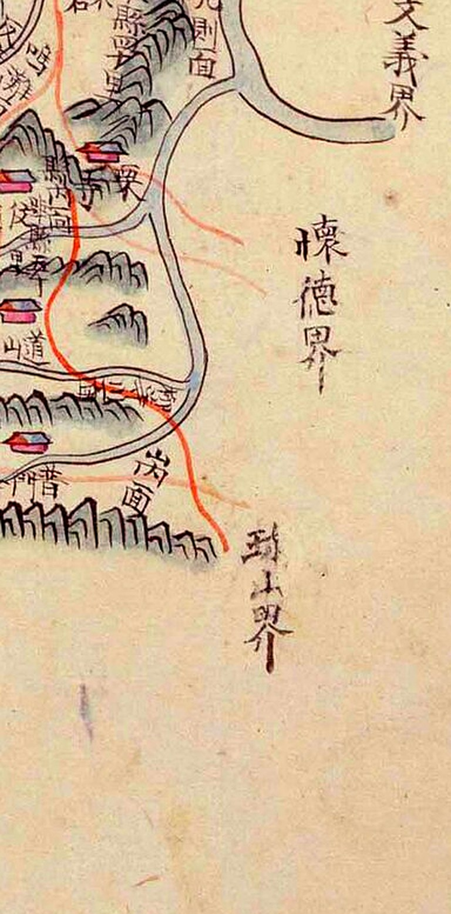
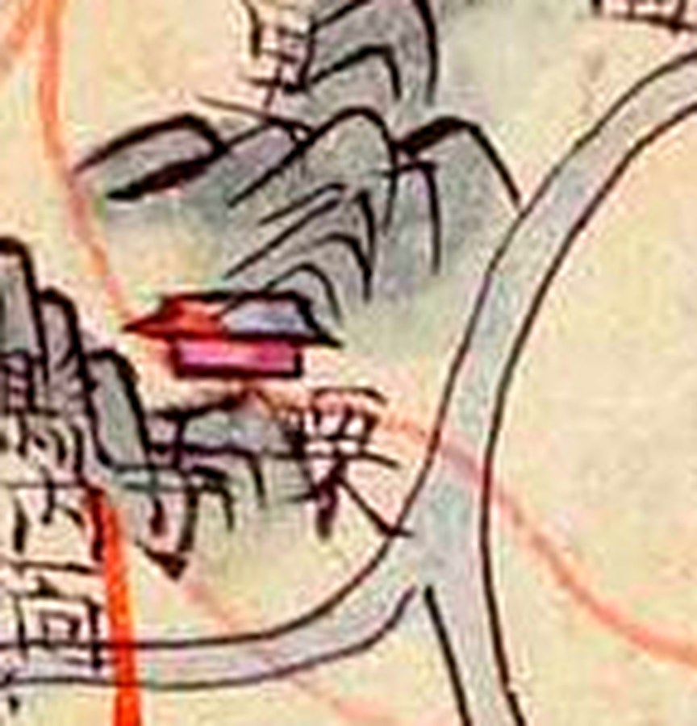
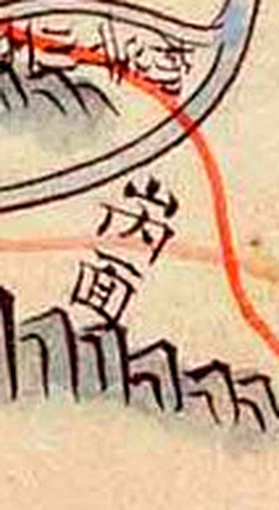

# 『해동지도』 「충청도 공주목」 판독

『해동지도』 8책(1750년대 초 제작 추정, 규장각한국학연구원 소장, 보물) 가운데 충청도
공주목 도엽. **공주목은 대전에 산내면·유등포면·탄동면·구즉면·명탄면으로 걸칩니다.**

1872년 계열은 [`1872-공주목지도-판독.md`](1872-공주목지도-판독.md). 고개 쟁점은
[`대전-고개-대조표.md`](대전-고개-대조표.md) 11.3.

## 도엽

| | |
|---|---|
| 자료번호 | `GM33469IL0006_042` |
| 원문 | [커먼즈 파일](https://commons.wikimedia.org/wiki/File:GM33469IL0006_042_%EC%B6%A9%EC%B2%AD%EB%8F%84_%EA%B3%B5%EC%A3%BC%EB%AA%A9.jpg) |
| 크기 | 2,409 × 3,749 px |
| 방위 | **위가 北** (오른쪽 東) — 표준 |
| 글 방향 | 우횡서 |

**공주목은 범위가 매우 넓어 대전에 해당하는 부분이 작게 그려집니다.** 도엽 오른쪽 3분의
1이 통째로 **면별 거리표**이고, 그림은 왼쪽 3분의 2입니다.

## 방위 확인

| 변 | 경계 표기 |
|---|---|
| 위 | `天安界` · `全義界` |
| 오른쪽 | `燕歧界`(북동) · `文義界`(동북) · **`懷德界`**(동) · **`珎山界`**(동남) |
| 아래 | `尼山界` · `扶餘界` |
| 왼쪽 | `禮山界` · `大興界` · `靑陽界` · `定山界` |

## 사지(四至)

| 방향 | 경계 | 그 고을 읍치까지 |
|---|---|---|
| 東距 | 燕歧界 二十五里 | 去本縣 四十里 |
| 西距 | 定山界 三十里 | 去本縣 五十里 |
| 南距 | 尼山界 四十里 | 去本縣 五十里 |
| 北距 | 天安界 五十里 | 去本郡 九十里 |

**사지에 회덕이 없습니다.** 공주목은 크고 접경 고을이 열둘이 넘어, 사지에는 네 방향
대표만 적었습니다 — **회덕은 사지가 아니라 도엽 가장자리 경계 표기로 나옵니다.**

## 대전과 맞닿는 자리

| 위치 | 표기 | 확신 | 판독자 | 날짜 |
|---|---|---|---|---|
| (0.59, 0.63) | **懷德界** | 상 | Claude | 2026-09-03 |
| **(0.58, 0.72)** | **珎山界** | **상** | Claude | **2026-09-03** |
| (0.52, 0.60) | 栗〔峙?〕 | 중 | 류철·Claude | 2026-09-02 |
| (0.52, 0.69) | □面 | **미판독** | — | 2026-09-03 |

**`珎山界` 를 확정했습니다.** 2026-09-02 에 이 자리를 `鎭岑界`〔?〕 확신 `하` 로 적어
두었는데, **`珎山界`(진산계)였습니다.** `珎` 는 회덕현지도·진잠지도와 같은 이체자입니다.

**이것이 대조표 6.4 에 곧바로 걸립니다.** 6.4 는 「회덕과 진산은 서로를 적지 않고 각각
공주와 접한다」를 논거로 세웠는데, **공주목 도엽이 `懷德界` 와 `珎山界` 를 둘 다,
그것도 위아래로 나란히 적고 있습니다.** 도엽 하나에서 세 고을의 관계가 확인됩니다 —

```
文義 ─ 懷德 ─ (공주목 동남단) ─ 珎山
```

**`栗峙` 의 `栗` 은 확실합니다.** 9배 확대에서 `西`+`木` 이 또렷합니다. 다만 **뒤따르는
`峙` 는 이번 확대에서 확인하지 못했습니다** — 2026-09-02 의 `栗峙` 판독을 뒤집지는
않되 재확인 대상으로 둡니다.

**`珎山界` 곁의 `□面` 을 못 읽었습니다.** 두 글자이고 위 글자가 `岑`·`峕` 꼴로 보입니다.
자리로는 **산내면일 수 있는 곳**이지만, 자리로 미룬 추정을 판독으로 올리지 않습니다.

## 면별 거리표 — 26면 **전문** (2026-09-30)

도엽 오른쪽에 면마다 `初境`·`終境` 리수가 적혀 있습니다. **26면을 다 읽었습니다.**
여섯씩 네 줄에 마지막 줄이 둘입니다. 이 글씨는 도엽에서 가장 또렷한 부분이라
축소본(1,920 px)에서도 숫자까지 읽힙니다.

| # | 면 | 初境 | 終境 | 대전 |
|---|---|---|---|---|
| 1 | `山內面` | 80리 | 100리 | **동구 남부** |
| 2 | `柳等浦面` | 70리 | 80리 | **중구 유천동 일원** |
| 3 | `川內面` | 60리 | 70리 | |
| 4 | `縣內面` | 50리 | 60리 | |
| 5 | `炭洞面` | 50리 | 70리 | **유성구 북부** |
| 6 | `九則面` | 50리 | 70리 | **유성구 금강 남안** |
| 7 | `鳴灘面` | 40리 | 60리 | **대덕·세종 접경** |
| 8 | `陽也里面` | 40리 | 50리 | |
| 9 | `反浦面` | 20리 | 50리 | |
| 10 | `益貴谷面` | 10리 | 50리 | |
| 11 | `辰頭面` | 30리 | 40리 | |
| 12 | `曲火川面`〔?〕 | 30리 | 50리 | |
| 13 | `半灘面` | 30리 | 50리 | |
| 14 | `木洞面` | 10리 | 30리 | |
| 15 | `南部面` | 1리 | 10리 | |
| 16 | `東部面` | 1리 | 20리 | |
| 17 | `三歧面` | 30리 | 40리 | |
| 18 | `長尺洞面` | 20리 | 40리 | |
| 19 | `郞三面`〔?〕 | 30리 | 40리 | |
| 20 | `正安面` | 20리 | 60리 | |
| 21 | `要堂面` | 15리 | 30리 | |
| 22 | `牛井面` | 15리 | 25리 | |
| 23 | `城北面` | 20리 | 40리 | |
| 24 | `寺谷面` | 20리 | 60리 | |
| 25 | `新下面` | 40리 | 60리 | |
| 26 | `新上面` | 50리 | 80리 | |

근거: [1~2행](crops/GM33469IL0006_042_x0.66_y0.33_w0.34_h0.24.jpg) ·
[3행](crops/GM33469IL0006_042_x0.66_y0.55_w0.34_h0.24.jpg) ·
[4행](crops/GM33469IL0006_042_x0.66_y0.75_w0.34_h0.22.jpg)

**표의 순서가 곧 거리 순서입니다.** 첫 항목 `山內面`(80~100리)이 공주목 26면 가운데
가장 멀고, 둘째가 `柳等浦面`(70~80리)입니다. **대전에 걸린 다섯 면이 1·2·5·6·7번**으로
앞쪽에 몰려 있습니다 — **대전 일원이 공주목에서 가장 먼 변두리**였다는 것을 도엽이
스스로 말해 줍니다.

`曲火川面`·`郞三面` 두 이름은 글자가 뭉개져 확신이 낮습니다. 거리값은 또렷합니다.

### 1872년 도엽의 창고 주기와 맞춰 보면 — 어긋나는 데가 있습니다

1872년 「공주목지도」가 창고마다 `距邑○○里` 를 적어 두었습니다(12.3). 그 값을 이 거리표와
견주면 이렇습니다.

| 1872 창고 주기 | 해동지도 거리표 | 차이 |
|---|---|---|
| `乃興倉 … 山內面 高水亭里 距邑七十里` | 산내면 **80~100리** | **10리 모자람** |
| `太平倉 … 柳等川面〔?〕 距邑五十里`〔?〕 | 유등포면 **70~80리** | **20리 모자람** |

**첫째는 설명이 됩니다** — 창고는 면의 초입에 두는 것이 보통이고, 두 자료 사이에 120년이
있습니다. **둘째는 차이가 큽니다.** 태평창 주기를 `柳等川面` 으로 읽은 것이 잘못일
가능성이 높습니다 — 50리대에 들어맞는 면은 `縣內面`(50~60리)·`炭洞面`·`九則面`(50~70리)
쪽입니다. **1872년 쪽 판독(확신 `중`)을 내리지는 않되, 이 거리표를 잣대로 다시 봐야
합니다.**

**거리표가 판독의 검산 도구가 된다는 것이 이번에 드러났습니다.** 공주목 도엽에서 면 이름과
거리가 같이 나오면, 둘을 맞춰 보는 것만으로 오독이 걸러집니다.

## 동남단 훑기 — 고개는 `栗`〔峙?〕 하나뿐입니다 (2026-09-30)

커먼즈 축소본(1,920 px, 원본 2,409 px 의 80%)을 받아 **x 0.44–0.66, y 0.50–0.81**
을 훑었습니다. 대전에 걸리는 다섯 면이 다 들어가는 범위입니다.



*동남단 전경. 위에서부터 `文義界` · `懷德界` · `珎山界` 가 오른쪽 가장자리를 따라 내려갑니다.*

**새로 나온 `峙`·`峴` 은 없습니다.** 이 범위에서 읽은 것은 경계 표기 셋, 면 이름
(`九則面` 등), 창고(`東倉` 과 `距縣○○里` 주기), 절, 그리고 `栗`〔峙?〕 하나입니다.

**`栗` 뒤의 글자는 이 해상도로 끝내 확인하지 못했습니다.** `栗` 자체는 또렷하나,
바로 왼쪽(우횡서이므로 다음 글자 자리)이 산줄기·집 그림과 겹칩니다.



**`□面`(0.52, 0.69)은 두 글자입니다.** 먹의 세로 분포를 재어 보니 `懷德界`(세 글자,
글자 간격 약 48 px)와 견주어 이 라벨은 약 105 px — **두 글자 자리**입니다.



**그런데 거리표의 26면에는 한 글자짜리 면 이름이 하나도 없습니다.** 그러므로 셋 중
하나입니다 — ① 그림에서 면 이름을 줄여 적었다 ② 가운데 글자가 지워졌다
③ 측정이 틀렸다. **어느 쪽인지 정하지 않고 열어 둡니다.** 첫 글자는 `山`·`岑` 꼴의
윗머리를 가졌습니다. 자리로는 산내면일 수 있으나 `山內面` 이라면 세 글자여야 합니다.

**읽어 주실 분을 찾습니다** — 규장각 고해상 원본이면 바로 갈립니다.

## 기문 — 호구·전결 (2026-09-30)

거리표와 같은 또렷한 글씨라 축소본에서도 읽힙니다.

| 항목 | 값 |
|---|---|
| 城郭 | `無` |
| 戶 | `一萬四千七百八十戶` |
| 田 | `五千一百六十四結十八卜` |
| 畓 | `一萬二百五十九結七十四卜` |
| 穀摠數〔?〕 | `一萬三千一百八十五石十一斗` 외 |

**사지는 기존 기록과 같습니다.** 다만 `燕岐` 가 아니라 **`燕歧`** 로 적혀 있어 고쳤습니다.

## 그 밖에 읽은 것

`鷄龍山`(0.31, 0.67) · `甲寺` · `東鶴寺` · `熊津` · `日新驛` · `普門寺`〔?〕 · `車嶺` ·
금강 물줄기 · `東倉` · 창고 여럿

## 남은 것

- **`□面` 판독** — 두 글자인데 26면에 한 글자 면이 없습니다. 대조표 6.4 의 판정에 걸립니다
- `栗` 뒤의 글자 — `峙` 인지
- `曲火川面`·`郞三面` 두 이름의 글자
- 산내면 일원의 잔글씨 — **1,920 px 축소본으로는 여기가 한계입니다.**
  원본(2,409 px)은 커먼즈 요청 제한(`429`)으로 아직 못 받았고, 그마저 25% 차이입니다.
  **규장각 고해상 원본이라야 갈립니다**

## 변경 이력

| 날짜 | 내용 |
|---|---|
| 2026-09-03 | 문서 개설. 2026-09-02 의 1차 채록을 옮기고 원본으로 보강 — **`鎭岑界`〔?〕 를 `珎山界` 로 확정**, `懷德界`·`栗` 좌표 재측정, `□面` 을 미판독으로 세움 |
| 2026-09-30 | **면별 거리표 26면 전문 채록** — 커먼즈 축소본(1,920 px)을 직접 받아 읽음. 대전 다섯 면이 1·2·5·6·7번으로 **공주목에서 가장 먼 변두리**임이 확인됨. 1872년 창고 주기와 맞춰 보니 **태평창 주기의 면 이름 판독이 의심됨**(20리 차이) |
| 2026-09-30 | **동남단(x 0.44–0.66, y 0.50–0.81) 훑기 — 새 고개 없음.** `□面` 이 **두 글자**임을 먹 분포로 확인(26면에 한 글자 면이 없어 모순으로 남김). 기문 호구·전결 채록, `燕岐`→`燕歧` 교정 |
