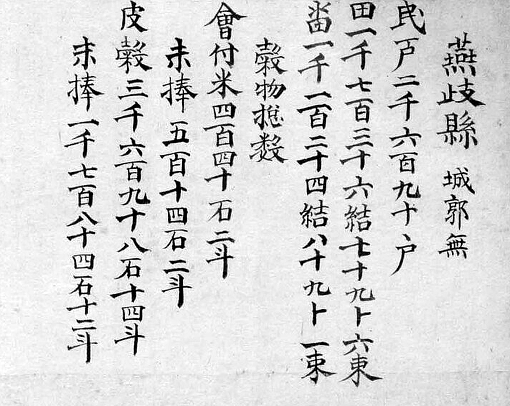
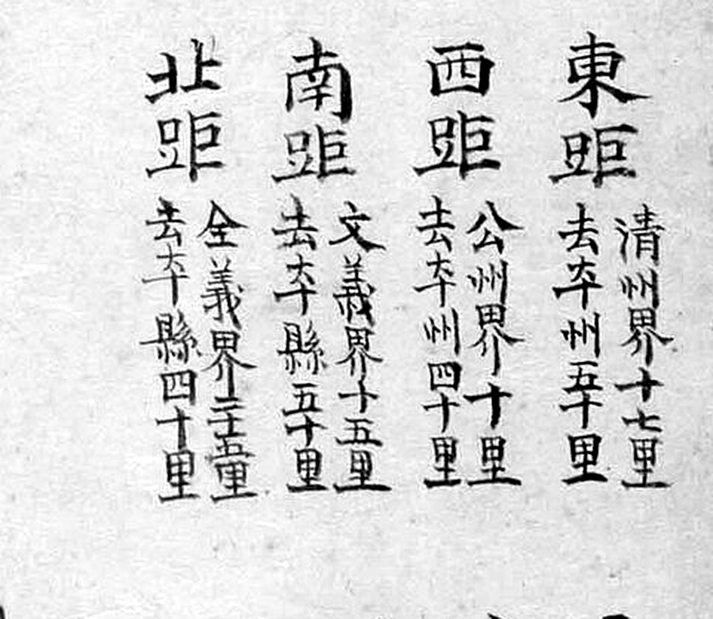

# 『해동지도』 「충청도 연기현」 판독

『해동지도』 8책(1750년대 초 제작 추정, 규장각한국학연구원 소장, 보물) 가운데 충청도
연기현 도엽. **연기는 회덕(대전)의 서북쪽**이고 금강 건너입니다 — **회덕현 도엽에 경계
표기가 없는 2차 접경**입니다. 지금 세종특별자치시 연기면 일원입니다.

기록은 [`대전-고개-대조표.md`](대전-고개-대조표.md) 11.6.5.

## 도엽

| | |
|---|---|
| 자료번호 | `GM33469IL0006_052` |
| 원문 | [커먼즈 파일](https://commons.wikimedia.org/wiki/File:GM33469IL0006_052_%EC%B6%A9%EC%B2%AD%EB%8F%84_%EC%97%B0%EA%B8%B0%ED%98%84.jpg) |
| 크기 | 1,920 × 2,978 px (커먼즈 축소본으로 판독) |
| 훑은 범위 | 전면 (2026-09-30) |
| 방위 | **위가 北** (표준) |
| 글 방향 | 우횡서 |

## 사지(四至)

| 방향 | 경계까지 | 그 고을 읍치까지 |
|---|---|---|
| 東距 | `淸州界 十七里` | 청주 50리 |
| 西距 | `公州界 十里` | 공주 40리 |
| 南距 | `文義界 十五里` | 문의 50리 |
| 北距 | `全義界 十五里` | 전의 40리 |

**`懷德界` 가 없습니다.** 가장자리 표기는 `公州界`(세 곳) · `全義界` · `淸州界` ·
`文義界` 입니다 — **연기는 회덕과 직접 접하지 않고 문의·공주를 사이에 둡니다.**

## 고개 — **넷이 아니라 둘입니다** (2026-10-01 정정)

| 위치 | 표기 | 읽기 | 확신 | 날짜 |
|---|---|---|---|---|
| **(0.287, 0.295)** | **`松峙`** | 송치 | **상** | 2026-10-01 재확인 |
| **(0.118, 0.383)** | **`石峴`** | 석현 | **상** | 2026-10-01 재확인 |
| ~~(0.22, 0.55)~~ | ~~`金沙峴`~~ → **`金沙驛`**〔?〕 | — | 셋째 글자가 `峴` 이 아닙니다 | 2026-10-01 |
| ~~(0.12, 0.57)~~ | ~~`城峴`~~ → **`城□`** | — | 둘째 글자가 `峴` 이 아닙니다 | 2026-10-01 |

### 확정된 둘


*왼쪽 `松峙`, 오른쪽 `石峴`. 둘 다 세로로 쓰였고 `峙`·`峴` 모두 왼쪽에 **작은 `山`**
부수가 또렷합니다.* `松峙` 는 붉은 길이 지납니다.

[서부 일대를 넓게](crops/GM33469IL0006_052_x0.06_y0.26_w0.3_h0.36.jpg) — 네 라벨이 한 화면에 들어갑니다.

### 철회 둘 — **같은 도엽의 `石峴` 이 자[尺]가 됐습니다**

이 도엽은 2차 접경이라 1차 훑기에서 확신을 모두 `중` 으로 두고 넘어갔습니다.
2026-10-01 에 네 라벨을 10배로 키워 **`石峴` 의 `峴` 과 나란히 놓고** 보니 둘이 갈렸습니다.


**`金沙□`(0.219, 0.562)** — `金`·`沙` 는 또렷합니다. 셋째 글자는 왼쪽이 **세로로 긴
갈고리 부수**이고 오른쪽이 `夆`/`睪` 꼴입니다. `石峴` 의 `峴` 이 보여 주는 **납작한 `山`
부수가 아닙니다.** 역(驛)의 `馬` 를 흘려 쓴 꼴로 보여 **`金沙驛`**〔?〕 로 읽되
확신 `중` 입니다 — 문헌 대조가 필요합니다.

**`城□`(0.128, 0.566)** — 가로 두 글자(우횡서)로 오른쪽이 `城`(土+成)입니다. 왼쪽
글자는 오른쪽이 `頁` 이고 왼쪽이 `工`/`禾` 꼴 — **`山` 이 아닙니다.** `項`(목 항)으로
보아 **`城項`**〔?〕 일 수 있으나 확신 `하` 로 둡니다.
(`項` 은 우리말 '목'을 적는 글자여서, 맞다면 **고개 글자가 하나 더 늘어나는 셈**입니다.
1872년 옥천군지도 `陽內面` 리 목록에 `竹項里` 가 있습니다.)

> **얻은 교훈.** `峴`/`峙` 는 **왼쪽 `山` 부수 하나로 갈립니다.** 저해상 사본에서
> 두 글자짜리 지명을 보면 뒷글자를 `峴` 으로 읽기 쉬운데, **같은 도엽에 확실한 `峴` 이
> 있으면 그것을 자로 삼아 대 봅니다.** 이번에는 `石峴` 이 자가 됐습니다.

### 그래서 「고을마다 글자 버릇」은 약해집니다

1차 훑기에서 **「연기는 `峴` 셋에 `峙` 하나」** 라고 적고, 회인(`嶺` 셋)·회덕(`峙`·`峴`)·
진산금산(`峙`)과 함께 **고을마다 즐겨 쓰는 글자가 다르다**는 관찰을 세웠습니다(4.4).
연기가 `峙` 하나 · `峴` 하나가 되면 **연기 쪽 근거는 사라집니다.**
회인의 `嶺` 셋은 그대로이므로 관찰 자체는 남지만, **연기를 근거로 들지 않습니다.**

**대전 쪽(남동)에는 고개 표기가 없습니다** — 이것은 그대로입니다.

**`石峴` 은 1872년 금산군지도의 `石峴里`(12.6)와 같은 글자입니다** — 같은 고개가 아니라
흔한 이름입니다. 대조표 6.4 의 주의 그대로 **이름이 같아도 자리가 다릅니다.**

## 좌상단 첨지 — **방어처**

> `五峯山 雲住山 興龍山 城山 正左山 … 備禦處在 … 故添書`〔?〕

문의·청주 도엽과 **같은 형식**입니다(11.6.8). 산 다섯을 지목했습니다.

## 기문(記文) — 문의·옥천과 **같은 네 조목**



```
燕歧縣 城郭無
民戶 二千六百九十戶
田 一千七百三十六結 七十九卜 六束
畓 一千一百二十四結 八十九卜 一束
穀物摠數
  會付米 四百四十石 二斗
  末捧   五百十四石 二斗
  皮穀   三千六百九十八石 十四斗
  末捧   一千七百八十四石 十二斗
軍兵摠數
  監營軍 二十二名
  兵營軍 二十三名
  右營鎭束伍軍 三百六十二名
```

**호구·전결·곡물·군병 넷뿐이고 산천 조가 없습니다** — 문의현(11.6.2)·옥천군(11.6.1)과
같습니다. **충청도 도엽 셋이 모두 같은 틀**이고, 전라도 진산·금산 도엽만 산천 조를
갖고 있습니다(11.2 · 11.4).

두 가지가 눈에 띕니다.

- **`卜`(복)으로 적습니다.** 전결의 단위를 문의·옥천은 `負` 로 적는데 연기는 `卜`
  입니다. 같은 값을 가리키는 다른 글자입니다.
- **군병이 세 갈래**입니다 — 감영군·병영군·우영진속오군. 문의는 둘(병영군·중영진),
  옥천도 둘(병영군·우영진)이었습니다.

고을 이름을 **`燕歧`**(止+支)로 적습니다 — 문의 사지의 `燕歧界` 와 같은 글자입니다.

## 면별 초경·종경



| 면 | 初竟 | 終竟 |
|---|---|---|
| 邑內面 | 一里 | 五里 |
| 南面 | 十里 | 二十里 |
| 東一面 | 五里 | 十里 |
| 東二面 | 七里 | 二十里 |
| 北一面 · 北二面 · 北三面 | (미판독) | (미판독) |

## 그 밖에 읽은 것

| 갈래 | 표기 |
|---|---|
| 산 | `五峯山` · `雲住山` · `起德山` · `元帥山` · `龍帥山` · `轉月峯` |
| 물 | `苔川` · `臼川` · `合江` |
| 그 밖 | `梟鶴洞` · `三歧` · `釜洞` · `養三洞` · `鳳藏`〔?〕 |
| 관아 | `衙舍` · `客舍` · `鄕校` |
| 면 | `邑內面`(初境1리/終境5리) · `南面` · `東一面` · `東二面` · `北一面` · `北二面` · `北三面` |

## 남은 것

- **`金沙□` 의 셋째 글자** — `驛` 인지. 연기현의 역 이름을 문헌에서 확인
- **`城□` 의 둘째 글자** — `項` 인지. 맞다면 고개 글자가 하나 더 늘어납니다
- 좌상단 첨지 전문 (초서)
- 면별 거리표의 `北一面`·`北二面`·`北三面`
- 금강 건너 회덕 `一道面` 과 마주하는 자리 — 나루가 적혀 있는지
- 3,840 px 사본 — 2026-10-01 에는 커먼즈 요청 한도에 걸려 1,920 px 로 봤습니다

## 변경 이력

| 날짜 | 내용 |
|---|---|
| 2026-09-30 | **문서 개설 · 훑기.** 사지, 고개 넷(모두 서쪽 공주 방면), 좌상단 **방어처 첨지**. `懷德界` 없음 |
| 2026-10-01 | **고개가 넷에서 둘로 줄었습니다.** 네 라벨을 10배로 키워 같은 도엽 `石峴` 의 `峴` 과 나란히 대 보니, **`金沙峴`→`金沙驛`〔?〕 · `城峴`→`城□`** 로 갈렸습니다(`峴` 의 왼쪽 `山` 부수가 없습니다). **`松峙`·`石峴` 은 확신 `중`→`상`.** 「연기는 `峴` 셋에 `峙` 하나」라는 4.4 의 관찰 근거도 함께 거둡니다 |
| 2026-10-01 | 기문 전문 — **문의·옥천과 같은 네 조목, 산천 조 없음.** 충청도 도엽 셋이 한 틀입니다. 전결 단위를 **`卜`** 으로 적고, 군병이 **세 갈래**(감영·병영·우영진) |
