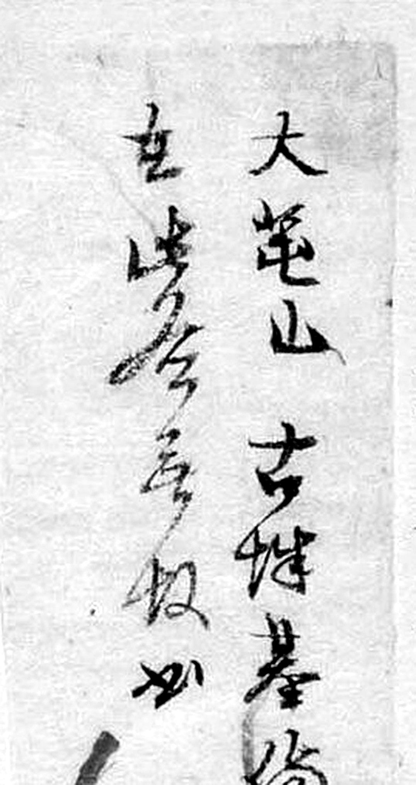
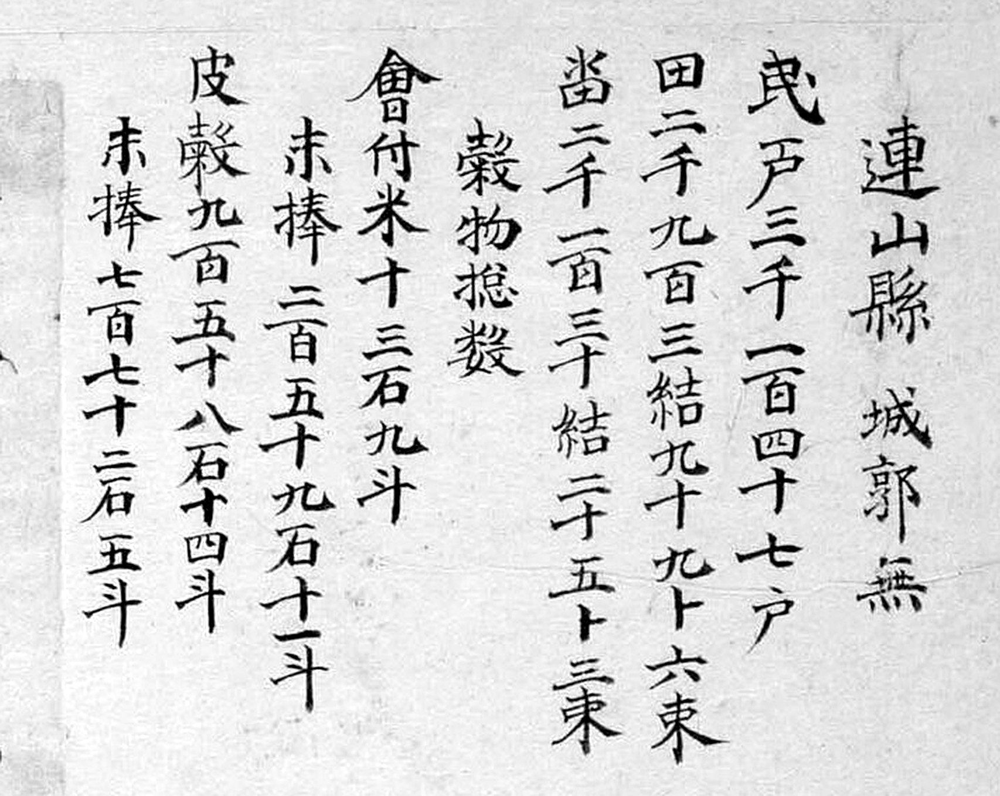
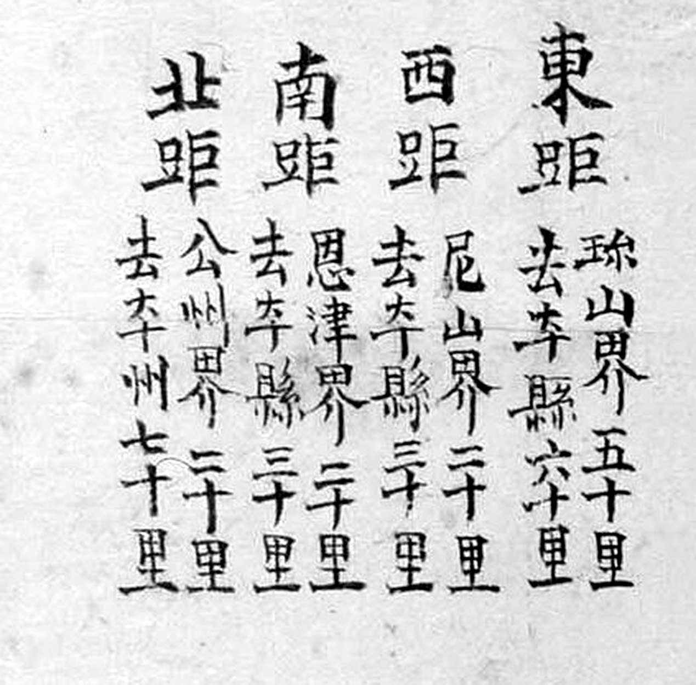

# 『해동지도』 「충청도 연산현」 판독

『해동지도』 8책(1750년대 초 제작 추정, 규장각한국학연구원 소장, 보물) 가운데 충청도
연산현 도엽. **연산은 진잠(대전 유성·서구 남부)의 서남쪽 이웃**입니다. 지금 논산시
연산면입니다.

1872년 계열은 [`1872-연산현지도-판독.md`](1872-연산현지도-판독.md), 기록은
[`대전-고개-대조표.md`](대전-고개-대조표.md) 11.6.4.

## 도엽

| | |
|---|---|
| 자료번호 | `GM33469IL0006_045` |
| 원문 | [커먼즈 파일](https://commons.wikimedia.org/wiki/File:GM33469IL0006_045_%EC%B6%A9%EC%B2%AD%EB%8F%84_%EC%97%B0%EC%82%B0%ED%98%84.jpg) |
| 크기 | 1,920 × 2,979 px (커먼즈 축소본으로 판독) |
| 훑은 범위 | 2026-09-30 대전 쪽(북동) 가장자리 중심 · **2026-10-01 2차 — 기문·사지 전문, 북동부 전면** |
| 방위 | 위가 北이되 **북쪽 가장자리 글자는 상하가 뒤집혀** 있습니다 |
| 글 방향 | 우횡서 |

## 사지(四至)

| 방향 | 경계까지 | 그 고을 읍치까지 |
|---|---|---|
| 東距 | `珎山界 五十里` | 진산 60리 |
| 西距 | `尼山界 二十里` | 이산 30리 |
| 南距 | `恩津界 二十里` | 은진 30리 |
| 北距 | `公州界 二十里` | 공주 70리 |

**사지에 진잠이 없습니다** — 진잠은 2차 접경입니다. 그런데도 **가장자리에는 두 번
적혔습니다**(아래).

## `鎭岑界` 가 두 곳

| 위치 | 표기 | 확신 |
|---|---|---|
| (0.353, 0.367) | **`鎭岑界`** | 상 |
| **(0.636, 0.324)** | **`鎭岑界`** | 중 → **상** (2026-10-01 확인) |


*(0.35, 0.37)의 `鎭岑界`. 이 구역은 글자가 **상하 반전**되어 있어 `界岑鎭` 으로 보입니다.*

**1872년 진잠 도엽의 사지 `西 月底里 連山界 十五里` 와 짝이 맞습니다**(12.2) —
**진잠과 연산은 서로를 적습니다.** 1872년 연산현지도에도 `鎭岑縣` 이 위 가장자리에
있습니다(12.7.2). **두 계열 모두에서 짝이 성립합니다.**

## 고개 — **북동(진잠 방향)에 `□□峴` 이 하나 있습니다** (2026-10-01)

| 위치 | 표기 | 확신 | 날짜 |
|---|---|---|---|
| **(0.872, 0.643)** | **`德目峙`** | 중 → **상** | 2026-10-01 |
| **(0.785, 0.475)** | **`□□峴`** | `峴` **상** · 앞 두 자 **미판독** | 2026-10-01 |
| (0.883, 0.586) | `□□□` | 미판독 | 2026-10-01 |

### `德目峙`


세로로 `德`·`目`·`峙`. `峙` 의 `山` 부수가 왼쪽에 또렷합니다(연기에서 쓴 것과 같은
검사 — 11.6.5). **붉은 길이 이 고개를 지납니다.** 자리는 동쪽, 진산·전주 방면입니다.

#### 오늘 **덕목재**입니다 (2026-10-05 비정)

논산시 벌곡면 **덕목리(德木里)** 에 고갯마루 **덕목재**가 있습니다
(OpenStreetMap `natural=saddle`, **36.1877 / 127.2511** — 대조표 3장·대장, 급 `A`).

- **`德目` ↔ `德木`.** `目`·`木` 둘 다 우리말 **「목」**입니다 — 진산군 한 고을에서
  `目`·`睦`·`項` 이 모두 「목」으로 쓰인 것을 이미 보았습니다(대조표 2장 · 14.5).
- **자리가 맞습니다.** 도엽은 `德目峙` 를 **읍치 동쪽**에 놓았고, 덕목재는 연산
  읍치에서 동쪽으로 3 km, **진산 가는 길목**입니다. 벌곡면은 그때 연산현 **벌곡면**
  이었습니다.

**이것이 「진산에서 벌곡으로 가는 길」의 연산 쪽 고개입니다.** 진산 쪽 고개는
『해동지도』 진산군의 **`方古介`/`方古峙`**(= 1872 `方峴`, 1919 `方峴里`)이고
([`해동지도-진산군-판독.md`](해동지도-진산군-판독.md)), 길로 이으면

**연산 읍치 ― `德目峙`(덕목재) ― 벌곡면 ― `方峴`(방고개) ― 진산 읍치**

가 됩니다. **한 길인데 진산 도엽은 `方峴` 만, 연산 도엽은 `德目峙` 만 적습니다** —
고을마다 제 경계 쪽 고개만 그린 것입니다. 확신 **중**(이름과 방향은 맞되 도엽이
회화식이라 좌표로 짚지 못했습니다).

### `□□峴` — **대전 쪽에 고개가 없다던 것을 고칩니다**


1차 훑기에서 「대전(진잠) 쪽 북동 가장자리에는 고개 표기가 없다」고 적었습니다.
**(0.785, 0.475)에 세 글자 라벨이 있고 맨 왼쪽이 `峴`(山+見)입니다.**
우횡서이므로 `峴` 이 마지막 글자이고, 앞 두 글자는 읽지 못했습니다.

자리는 **읍치(0.55, 0.62) 북동** — `鎭岑界`(0.636, 0.324)와 `珎山界`(0.90, 0.366)
사이입니다. [북동 일대를 넓게](crops/GM33469IL0006_045_x0.55_y0.3_w0.45_h0.22.jpg)

**고개임은 분명하되 이름을 모릅니다.** 대조표 7장 미판독에 올립니다 —
**진잠에서 연산으로 넘는 고개**일 수 있어 대전 조사에 걸립니다.

### `德目峙` 북쪽의 세 글자


(0.883, 0.586)에 세 글자가 가로로 있습니다. **맨 오른쪽 글자가 `□□峴` 라벨의 맨 오른쪽
글자와 같아 보입니다** — 같은 말로 시작하는 두 지명일 수 있습니다. 셋 다 미판독입니다.

`水影峙`〔?〕(0.53, 0.78)로 보이던 것은 2차에서도 확인하지 못했습니다.

## 첨지 — **`故添書` 가 보이지 않습니다**



두 줄, 오른쪽부터:

```
大芚山 古城基 □…
… □峙〔?〕 … 如
```

`大芚山`(`屯` 이 아니라 **`芚`**)·`古城基` 는 또렷하고, 왼쪽 줄은 초서라 못 읽었습니다.
**다른 도엽의 `備禦處在 … 故添書` 가 보이지 않습니다** — 11.6.8 의 첨지 목록에 이
도엽을 더하되 **문구는 미확인**으로 둡니다.

왼쪽 줄 둘째 글자가 `峙`(山+寺)로 보입니다 — 맞다면 **첨지가 고개를 하나 더 든
셈**이므로, 전문 판독이 대전 조사에 걸립니다.

## 기문(記文) — **충청도 다섯 번째, 같은 네 조목**



```
連山縣 城郭無
民戶 三千一百四十七戶
田 二千九百三結 九十九卜 六束
畓 二千一百三十結 二十五卜 三束
穀物摠數
  會付米 十三石 九斗
  末捧   二百五十九石 十一斗
  皮穀   九百五十八石 四斗
  末捧   七百七十二石 五斗
軍兵摠數
  監營軍 二十五名
  兵營軍 二十三名
  右營鎭束伍軍 三百十七名
```

**호구·전결·곡물·군병 넷뿐, 산천 조 없음** — 문의·옥천·연기·회인과 같습니다.
**충청도 도엽 다섯이 한 틀**이고 전라도 진산·금산만 산천 조를 갖습니다.

전결 단위를 **`卜`** 으로 적습니다 — 연기와 같습니다(11.6.5). 곧 `卜`/`負` 는
연기만의 버릇이 아닙니다. 군병은 **세 갈래**(감영·병영·우영진)로 연기와 같습니다.

## 사지 — `去本縣` 까지



```
東距 珎山界五十里 去本縣六十里
西距 尼山界二十里 去本縣三十里
南距 恩津界二十里 去本縣三十里
北距 公州界二十里 去本州七十里
```

`珎山界` 의 `珎` 는 회덕현·진잠 도엽과 같은 이체자입니다(5.1 · 5.4).

## 그 밖에 읽은 것

| 갈래 | 표기 |
|---|---|
| 산 | `鷄龍山` · `大芚山` · `兜率山` |
| 성 | `古山城基` |
| 서원 | `遯巖書院` |
| 관아 | `衙舍` · `客舍` · `鄕校` |
| 면 | `豆麻面` · `白石面` · `赤寺谷面` · `外城面` · `夫人處面` · `食漢面`〔?〕 · `代谷面` 등 |

가장자리 경계 표기 — `尼山界`(0.09, 0.43)·(0.07, 0.64) · `珎山界`(0.93, 0.37)〔?〕 ·
`全州界`(0.96, 0.60) · `恩津界`(0.48, 0.86)·(0.66, 0.86).

## 남은 것

- **`□□峴`(0.785, 0.475)의 앞 두 글자** — 진잠에서 넘는 고개일 수 있습니다
- (0.883, 0.586)의 세 글자
- 첨지 왼쪽 줄 — `□峙`〔?〕 가 맞는지
- `水影峙`〔?〕 확인 — 2차에서도 못 찾았습니다
- 면별 거리표 전문
- 3,840 px 사본 — 2026-10-01 에는 커먼즈 요청 한도에 걸려 1,920 px 로 봤습니다

## 변경 이력

| 날짜 | 내용 |
|---|---|
| 2026-09-30 | **문서 개설 · 훑기.** 사지, **`鎭岑界` 두 곳**(진잠↔연산 짝 성립), 대전 쪽 고개 없음, 좌상단 첨지 |
| 2026-10-01 | **2차 판독.** ① **`□□峴`(0.785, 0.475) 발견 — 「대전 쪽에 고개 표기가 없다」를 고칩니다.** `峴` 은 또렷하고 앞 두 글자는 미판독, 자리는 `鎭岑界` 와 `珎山界` 사이입니다 ② `德目峙` 확신 `중`→**`상`**(붉은 길이 지남) ③ 둘째 `鎭岑界`(0.636, 0.324) 확인 ④ 기문 전문 — **충청도 다섯 번째 같은 틀**, 전결 단위 `卜`(연기와 같음), 군병 세 갈래 ⑤ 사지 `去本縣` 거리 ⑥ 첨지에 `故添書` 가 보이지 않고 `大芚山`(`屯` 아님)·`古城基` 가 또렷 |
| 2026-10-05 | **`德目峙` 가 미비정을 벗었습니다** — 오늘 논산시 벌곡면 덕목리의 **덕목재**(OSM 고갯마루 점, 36.1877/127.2511). `德目`↔`德木`, 둘 다 「목」입니다. **진산에서 벌곡으로 가는 길의 연산 쪽 고개**이고, 진산 쪽 짝은 `方古介`/`方峴` 입니다. 대조표 3장과 대장에 올렸습니다(급 `A`) |
