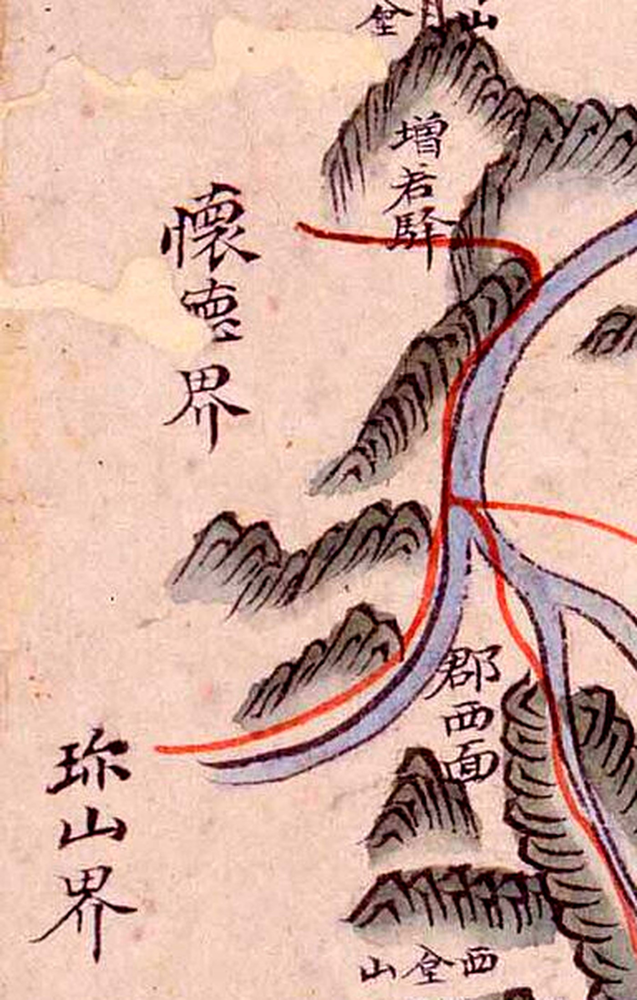
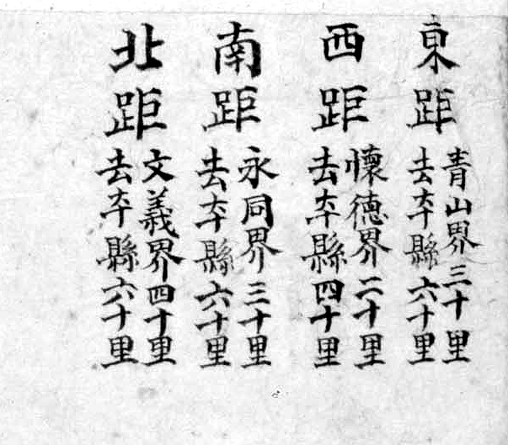
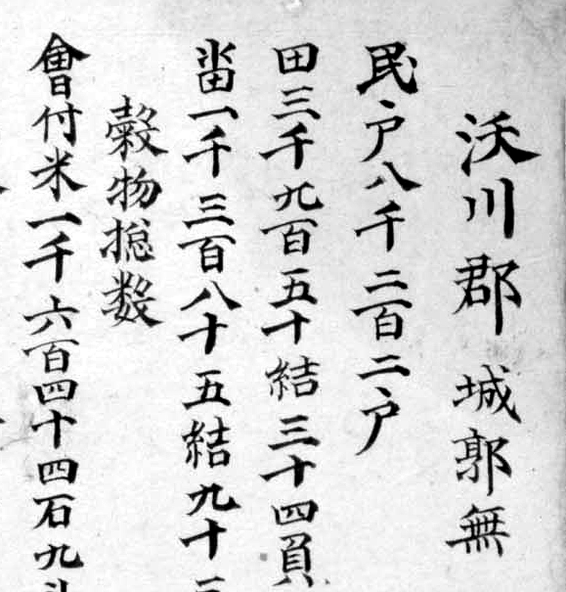
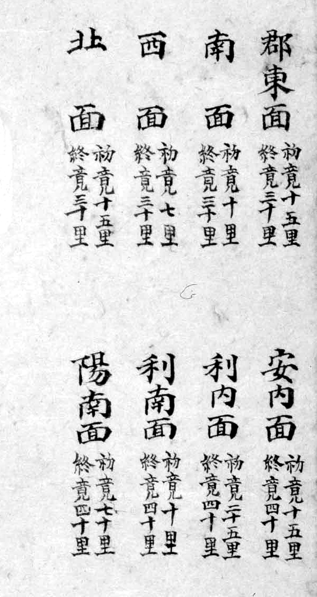
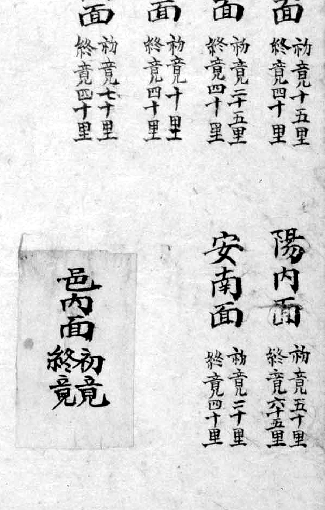

# 『해동지도』 「충청도 옥천군」 판독

『해동지도』 8책(1750년대 초 제작 추정, 규장각한국학연구원 소장, 보물) 가운데 충청도
옥천군 도엽. **옥천은 회덕(대전)의 동쪽 이웃**입니다. 마달령이 넘는 고을이고, 식장산
동쪽이 옥천 땅입니다.

1872년 계열은 [`1872-옥천군지도-판독.md`](1872-옥천군지도-판독.md), 기록은
[`대전-고개-대조표.md`](대전-고개-대조표.md) 11.6.1.

## 도엽

| | |
|---|---|
| 자료번호 | `GM33469IL0007_013` |
| 원문 | [커먼즈 파일](https://commons.wikimedia.org/wiki/File:GM33469IL0007_013_%EC%B6%A9%EC%B2%AD%EB%8F%84_%EC%98%A5%EC%B2%9C%EA%B5%B0.jpg) |
| 크기 | **2,409 × 3,781 px** (커먼즈본이 곧 원본 크기. 1차 판독은 1,920 px 축소본이었습니다) |
| 훑은 범위 | 전면 (2026-09-30 1차) · **전면 재훑기 + 기문·사지·면별표 전문** (2026-10-01 2차) |
| 방위 | **위가 北** (표준) |
| 글 방향 | 우횡서 |

**도엽의 왼쪽 절반만 그림이고 오른쪽 절반은 표입니다** — 사지와 면별 초경·종경이
오른쪽을 가득 채웁니다. 그래서 그림이 작게 그려졌고, 1차 판독 때 작은 글자를
놓쳤습니다(아래).

## 고개 — **`九也峙` 하나. 「없다」를 거둡니다**

> **2026-10-01 정정.** 1차 판독에서 「도엽 전체에서 `峙`·`峴`·`嶺` 이 한 자도 나오지
> 않는다」고 적었습니다. **틀렸습니다.** 원본 크기로 다시 훑으니 도엽 가운데쯤에
> **`九也峙`** 가 있습니다. 대조표 4.3 의 「고개가 없다」 줄에서 내립니다.

| 위치 | 표기 | 읽기 | 확신 | 판독자 | 날짜 |
|---|---|---|---|---|---|
| **(0.395, 0.541)** | **`九也峙`** | 구야치 | **상** | Claude | 2026-10-01 |


우횡서로 오른쪽부터 `九`·`也`·`峙` 입니다. `峙`(山+寺)가 또렷합니다.
`也`(어조사 야)는 우리말 소리를 적은 것으로 보입니다 — 금산군 도엽의 `方古介`(방고개)에서
`介` 가 '개'를 적은 것과 같은 쓰임입니다(11.2).

자리는 읍치(0.287, 0.421) **남동쪽**, 곧 영동·청산 방면입니다. **회덕(대전) 쪽이
아닙니다.** 마달령 자리인 서쪽 길에는 여전히 고개 이름이 없습니다.

[일대를 넓게](crops/GM33469IL0007_013_x0.325_y0.52_w0.11_h0.07.jpg) — 바로 곁에
`月□`(봉수가 있는 산)과 `烽□`(봉수 표시), 아래에 `土坡驛 距郡二十五里` 가 모여 있습니다.

### 그래도 마달령은 없습니다

**1872년 「옥천군지도」에는 `馬達峙`(마달령)가 또렷한데**, 120년 앞선 이 도엽에는
없습니다. 회덕 쪽으로 가는 붉은 길은 그려 놓고 고개 이름은 적지 않았습니다.
**「고개 표기가 없다」가 아니라 「서쪽 길의 고개 이름이 없다」로 고쳐 적습니다.**

> **두 번째로 같은 교훈입니다.** 2026-09-30 에 1872년 금산군지도의 `石峴里` 를
> 「없다」고 철회했다가 자리가 두 칸 옆이어서 되돌린 일이 있습니다(12.6). 이번에는
> **해상도**가 문제였습니다. 「없다」고 적을 때는 **도엽 전체를, 가장 큰 사본으로**
> 봐야 합니다.

## 서쪽 가장자리 — 대전과 맞닿는 자리

| 위치 | 표기 | 확신 |
|---|---|---|
| (0.06, 0.36) | **`懷德界`** | 상 |
| (0.03, 0.47) | `珎山界` | 상 |



**붉은 길 둘이 회덕계 쪽으로 뻗습니다** — 하나는 북쪽 `增若驛` 을 지나고, 하나는 읍치에서
곧장 서쪽으로 갑니다. 뒤엣것이 마달령을 넘는 길로 보입니다.

## 사지(四至) — 「그 고을 읍치까지」까지 전문



```
東距 靑山界三十里 去本縣六十里
西距 懷德界二十里 去本縣四十里
南距 永同界三十里 去本縣六十里
北距 文義界四十里 去本縣六十里
```

**`西距懷德界二十里` 가 회덕현 도엽의 `東距沃川界二十里` 와 정확히 맞습니다**
([`해동지도-회덕현-판독.md`](해동지도-회덕현-판독.md)). **두 고을이 서로를 같은 거리로
적었습니다** — 대조표 4.2 의 「이웃이 서로를 적는 짝」 가운데 거리까지 맞는 유일한 예입니다.

**한 가지가 어긋납니다.** 옥천은 `北距文義界四十里` 로 문의를 적는데, **문의 도엽의
사지에는 옥천이 없습니다**(東 회인 · 西 연기 · 南 회덕 · 北 청주). 사지는 네 방향의
대표 고을만 적으므로 **일방 기록이 드물지 않습니다**(4.2 의 ⚠ 항목).

## 기문(記文) — 문의와 같은 네 조목. **산천 조가 없습니다**



```
沃川郡 城郭無
民戶 八千二百二戶
田 三千九百五十結 三十四負 九束
畓 一千三百八十五結 九十三負 六束
穀物摠數
  會付米 一千六百四十四石 九斗
  末捧   二千六百八十三石
  皮穀   四千六百六石
  末捧   三千二百二十五石 九斗
軍兵摠數
  兵營軍 九十名
  右營鎭束伍軍 五百七十四名
```

[곡물·군병 쪽](crops/GM33469IL0007_013_x0.37_y0.005_w0.4_h0.19.jpg)

**문의현 기문(11.6.2)과 조목이 똑같습니다** — 호구·전결·곡물·군병 넷뿐이고 **산천 조가
없습니다.** 해동지도 진산군 기문은 산천 조에 고개 넷을 경계 고을·거리와 함께 적어
`晚目峙` 를 풀어 주었는데(11.2), 충청도 쪽 도엽 둘은 그렇지 않습니다.
**기문의 조목은 도(道)를 따라 갈리는 듯합니다** — 전라도 진산·금산 도엽과 충청도
문의·옥천 도엽을 더 견주어 볼 일입니다.

군병 조의 `右營鎭`(우영진)이 문의의 `中營鎭`(중영진)과 갈립니다. 충청도 다섯 영 가운데
옥천이 우영, 문의가 중영에 속했음을 도엽이 바로 알려 줍니다.

## 면별 초경·종경 — 열한 면 + **값이 빈 첨지 하나**



| 면 | 初竟 | 終竟 | | 면 | 初竟 | 終竟 |
|---|---|---|---|---|---|---|
| 郡東面 | 十五里 | 二十里 | | 利南面 | 十里 | 四十里 |
| 郡南面 | 十里 | 二十里 | | **陽南面** | **七十里** | **四十里** |
| 郡西面 | 七里 | 三十里 | | 陽內面 | 五十里 | 六十五里 |
| 郡北面 | 十五里 | 三十里 | | 安南面 | 二十里 | 四十里 |
| 安內面 | 十五里 | 四十里 | | | | |
| 利內面 | 二十五里 | 四十里 | | | | |

**`陽南面` 은 초경(70리)이 종경(40리)보다 큽니다.** 도엽에 쓰인 그대로이고, 두 값이
뒤바뀐 것으로 보입니다. 11.6.2 에서 문의 `南面` 종경과 사지가 어긋난 것과 함께
**면별 거리표를 거리 비정의 근거로 쓰지 않는 이유**가 됩니다.

### 값이 비어 있는 `邑內面` 첨지



표 오른쪽 아래에 종이 조각이 덧붙어 있고 **`邑內面 初竟 終竟`** 까지만 적혀 있습니다.
**숫자가 없습니다.** 읍내면만 표에서 빠져 나중에 조각을 붙였는데, **값은 끝내 적히지
않았습니다.** 해동지도가 완성본이 아니라 **작업 중인 책**이었음을 보여 주는 자리입니다.

## 좌상단 첨지 — **여덟 번째 도엽. 문구가 다릅니다**


한 줄, 여섯 자:

```
□□ 與備禦 同
```

`與`·`備`·`禦`·`同` 은 또렷하고, 맨 위 두 자(지명으로 보임)는 초서라 못 읽었습니다.

**11.6.8 이 모은 첨지 일곱(회덕·문의·청주·연기·회인·이산·은진)은 모두
`… 備禦處在 … 故添書`** 꼴인데, **옥천은 `… 與備禦同`(방어처와 같다)** 입니다.
**여덟 번째 도엽이고, 문구가 처음으로 갈립니다.** 같은 손이 같은 때에 붙인 것이라면
문구가 왜 갈렸는지가 물음이 되고, 다른 때에 붙은 것이라면 첨지가 한 번에 붙은 것이
아니라는 뜻이 됩니다.

## 봉수 둘

| 위치 | 산 | 봉수 표시 | 확신 |
|---|---|---|---|
| (0.145, 0.295) | **`環山`** | `烽□` (0.122, 0.297) | 산 이름 **상** |
| (0.365, 0.545) | `月□` | `烽□` (0.350, 0.556) | 산 이름 **하** |


**`環山`(고리산)이 이 도엽의 봉수입니다.** 1872년 옥천군지도의 봉수 주기가
`環山 … 去應 懷德 鷄足山烽燧` 라 적어 **봉수 노선이 대전으로 이어지는 것**을 보여 주는데
(12.4), 그 산입니다. 곁에 봉수대 그림(탑 모양)도 그려져 있습니다.

**봉수 표시의 두 글자는 아직 못 갈랐습니다.** `烽` 은 또렷한데(`火`+`夆`), 아래 글자가
`金`·`全` 처럼 보입니다. 뜻은 분명하므로(봉수) `烽□` 로 적어 둡니다 —
1차 판독은 `烽燧` 로, 2차에서는 `烽臺` 로도 읽어 보았으나 획이 어느 쪽에도 꼭 맞지
않습니다. **같은 두 글자가 해동지도 문의현 도엽 (0.690, 0.570)에도 같은 필체로
있습니다**(11.6.2) — 1차에서 `金峯` 으로 읽었던 라벨이 사실 이것입니다.

두 번째 봉수가 붙은 산 `月□` 의 둘째 글자도 못 읽었습니다. 1차 판독은 `月呑` 으로
읽었습니다. **1872년 옥천군지도(8,434 × 11,625 px)로 가르는 것이 가장 빠른 길**입니다.

## 그 밖에 읽은 것

| 갈래 | 표기 (괄호는 정규좌표) |
|---|---|
| 산 | `環山` · `馬城山`(0.265, 0.355) · `西臺山`(0.13, 0.49) · `智勒山`(0.14, 0.556) · `雉鳳山`〔?〕(0.17, 0.626) |
| 물·나루 | `赤登津`(0.355, 0.63) · `化仁津`〔?〕 · `庯灘`〔?〕(0.28, 0.585) |
| 역 | `增若驛`(0.135, 0.33) · `化仁驛 距郡三十里`(0.48, 0.44) · `土坡驛 距郡二十五里`(0.40, 0.57) · `順陽驛`(0.152, 0.665) · `嘉化驛`〔?〕(0.225, 0.45) |
| 창 | `安邑倉`(0.52, 0.41) · `陽山倉`(0.175, 0.665) · `倉`(읍치) |
| 누정 | `□仙樓`〔?〕(0.315, 0.665) |
| 폐현 | `陽山縣`〔?〕(0.165, 0.69) |
| 관아 | `衙舍` · `客舍` · `鄕校` |
| 면 | `郡東` `郡南` `郡西` `郡北` `邑內` `安內` `安南` `利內` `利南` `陽內` `陽南` — **열한 면** |

**역이 다섯입니다.** 옥천은 증약도(增若道) 찰방이 있던 고을이라 역이 촘촘합니다.
역 둘에 **`距郡○○里`** 주기가 달려 있어, 면별 거리표와 달리 **지점 거리를 직접
알려 주는 드문 자료**입니다.

`雉鳳山`〔?〕 은 1차 판독에서 `鳳凰山` 으로 읽었던 라벨입니다. 우횡서로 오른쪽부터
읽으면 `雉`(矢+隹)·`鳳`·`山` 으로 보이나 첫 글자가 확실치 않습니다.

## 남은 것

- **`烽□` 의 둘째 글자** — 1872년 옥천군지도 고해상본으로 가름 (문의현 도엽과 같은 글자)
- **`月□`** 의 둘째 글자 — 같은 길
- 좌상단 첨지의 첫 두 자 (초서)
- `雉鳳山`〔?〕 · `嘉化驛`〔?〕 · `□仙樓`〔?〕 · `庯灘`〔?〕 · `陽山縣`〔?〕 확인
- **`九也峙` 가 1872년 도엽·대동여지도에도 있는지** — 있다면 이름이 이어진 것이 확인됩니다
- 규장각 고해상 원본 — 커먼즈본이 원본 크기여서 더 키울 여지가 없습니다

## 변경 이력

| 날짜 | 내용 |
|---|---|
| 2026-09-30 | **문서 개설 · 전면 훑기.** 방위 표준, 사지(회덕과 **거리까지 일치**), 서쪽 가장자리. 고개 표기 하나도 없음(→ 2026-10-01 정정) |
| 2026-10-01 | **원본 크기로 재훑기.** ① **`九也峙` 채록 — 「고개가 없다」를 거둡니다** ② 기문 전문(문의와 같은 네 조목, **산천 조 없음**, 우영진) ③ 사지의 `去本縣` 거리 ④ 면별 열한 면 전문과 **`陽南面` 의 초경>종경 오류** ⑤ **값이 빈 `邑內面` 첨지** ⑥ 좌상단 첨지가 **여덟 번째**이고 문구가 `… 與備禦同` 으로 **처음 갈림** ⑦ 봉수 둘(`環山`·`月□`), 봉수 표시 두 글자가 **문의현 도엽과 같은 라벨**임을 확인 |
