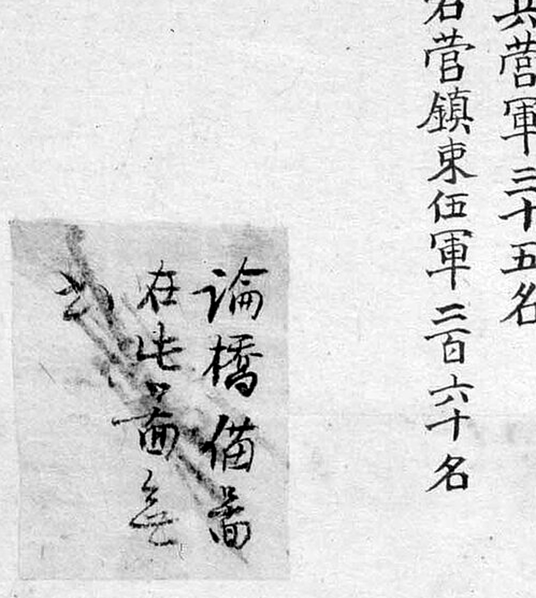

# 『해동지도』 「충청도 이산현」 판독

『해동지도』 8책(1750년대 초 제작 추정, 규장각한국학연구원 소장, 보물) 가운데 충청도
이산현 도엽. **대전과 직접 닿지 않습니다** — 연산을 사이에 둡니다. 참고 자료로 훑었습니다.

**이산현(尼山縣) = 노성현(魯城縣).** 해동지도 제작 시점에는 `尼山縣` 이었고, 1776년 정조
즉위 뒤 공자의 고향 `尼丘` 를 피휘하여 `魯城縣` 으로 고쳤습니다. 1872년 「노성현읍지도」와
같은 고을입니다 — **같은 고을이 자료에 따라 다른 이름으로 나오는 사례**입니다.

기록은 [`대전-고개-대조표.md`](대전-고개-대조표.md) 11.6.7.

## 도엽

| | |
|---|---|
| 자료번호 | `GM33469IL0006_044` |
| 원문 | [커먼즈 파일](https://commons.wikimedia.org/wiki/File:GM33469IL0006_044_%EC%B6%A9%EC%B2%AD%EB%8F%84_%EC%9D%B4%EC%82%B0%ED%98%84.jpg) |
| 크기 | 1,920 × 3,005 px (커먼즈 축소본으로 판독) |
| 훑은 범위 | 전면 (2026-09-30) |
| 방위 | **위가 北** (표준) |
| 글 방향 | 우횡서 |

## 사지(四至)

| 방향 | 경계까지 | 그 고을 읍치까지 |
|---|---|---|
| 東距 | `連山界 十里` | 연산 30리 |
| 西距 | `石城界 十里` | 석성 20리 |
| 南距 | `恩津界 十里` | 은진 20리 |
| 北距 | `公州界 十里` | 공주 50리 |

**진잠·회덕이 없습니다.** 가장자리 표기는 `公州界`(0.27, 0.31)·(0.02, 0.40) ·
`石城界`(0.02, 0.57) · `公州界`(0.76, 0.50) · `連山界`(0.79, 0.74) · `恩津界`(0.35, 0.85).

## 고개 하나

| 위치 | 표기 | 읽기 | 확신 | 크롭 |
|---|---|---|---|---|
| (0.51, 0.36) | **`板峙嶺`** | 판치령 · **「널재」**(추정) | 하 → **상**(2026-10-01) |  |

**2026-10-01 에 8배로 확대해 확정했습니다.** 첫 글자는 왼쪽이 `木`, 오른쪽이 `厂`+`又`,
곧 **`板`** 입니다 — `杻`(木+丑)의 가로획 셋이 아닙니다. **`杻峙嶺` 후보를 뺍니다.**

`板` 은 우리말 **「널」**이므로 「널재」일 수 있으나 그 이상은 모릅니다.
**대전과 무관합니다** — 고개 글자가 둘 겹친(`峙`+`嶺`) 드문 표기 사례로 둡니다.

## 좌상단 첨지

> `論橋 備當 在此處…`〔?〕

**2026-10-01 에 쪽지를 크롭으로 박았습니다.** `論`·`橋`·`備`·`當` 넉 자가 또렷하고,
왼쪽에 `在此處…` 가 이어집니다.

다리(`論橋`)를 지목한 첨지입니다. 다른 충청도 도엽의 방어처 첨지와 같은 계열로 보입니다
(11.6.8).

## 그 밖에 읽은 것

| 갈래 | 표기 |
|---|---|
| 산 | `魯城山` · `鵝龍山` · `飛龍山` · `烏山` |
| 성 | `古城` · `烽燧` |
| 다리 | `論橋` · `草浦橋` · `斗橋` · `石橋` |
| 창 | `海倉` |
| 면 | `上道面` · `廣石面` · `禾谷面` · `下道面` · `得尹面` · `月午洞面` · `豆寺面` · `素沙面` · `邑內面` · `泉洞面` · `長久洞面` |

**다리가 넷이나 적혀 있습니다** — 논산평야의 저지대 고을다운 기록입니다.
고개가 하나뿐인 것과 짝이 됩니다.

## 남은 것

- `板峙嶺`〔?〕 확인
- 좌상단 첨지 전문
- 1872년 「노성현읍지도」와의 대조 — 같은 고을의 120년 뒤 모습

## 변경 이력

| 날짜 | 내용 |
|---|---|
| 2026-09-30 | **문서 개설 · 훑기.** 사지, 고개 하나, 첨지. **대전과 닿지 않음** 확인 |
| 2026-10-01 | **2차 — 크롭이 하나도 없던 문서였습니다.** `板峙嶺` 을 8배로 확대해 **확신 `하`→`상`**(`杻峙嶺` 후보 뺌), 첨지도 박았습니다 |
