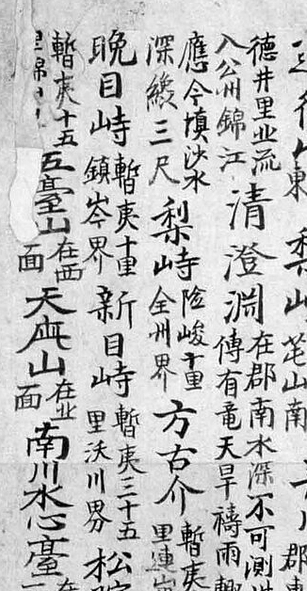
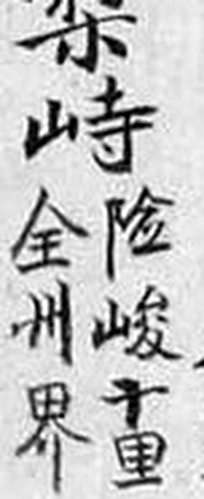
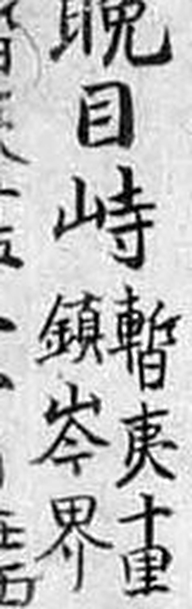
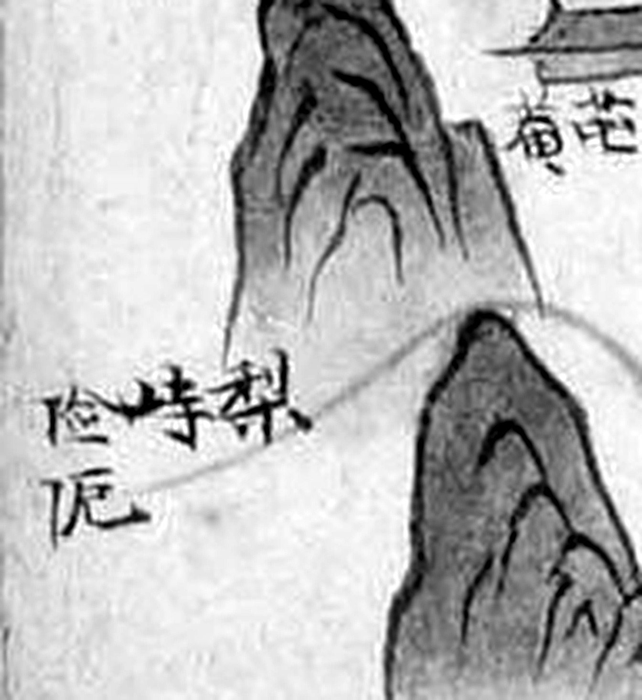
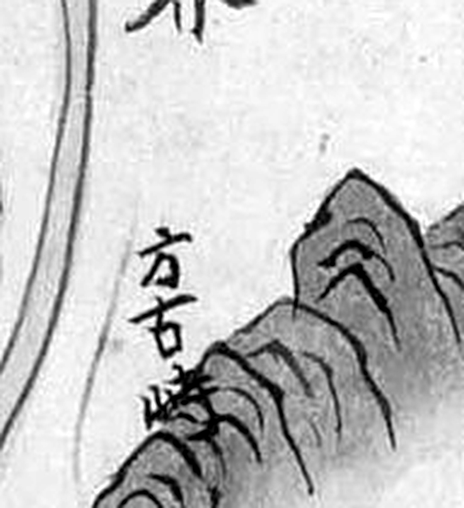
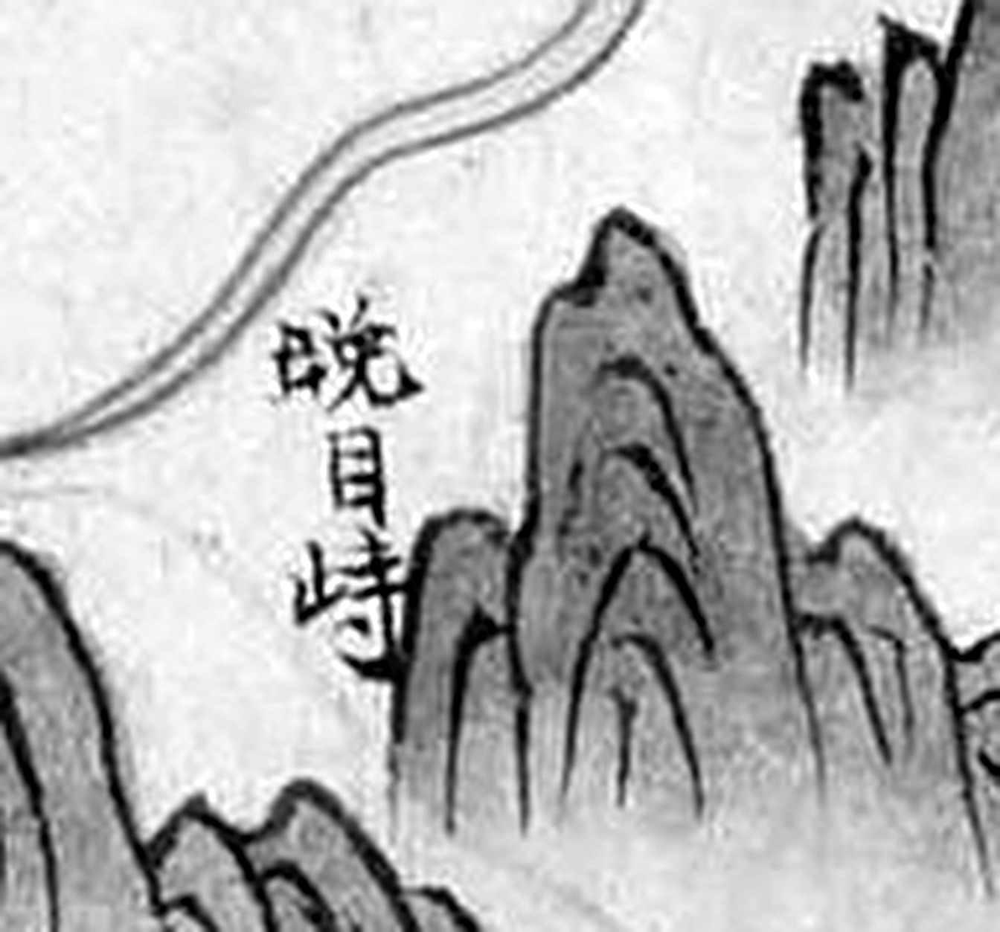

# 『해동지도』 「전라도 진산군」 판독

『해동지도』 8책(1750년대 초 제작 추정, 규장각한국학연구원 소장, 보물) 가운데 전라도
진산군 도엽. **진산군은 회덕(대전)의 남쪽**으로, 지금 금산군 진산면입니다. 금산은 1963년에야
충남이 되었으니 당시는 **전라도**였습니다.

**이 도엽은 대조표 6.4(닭재 쟁점)의 축입니다** — 진산이 북쪽을 공주라 적고 회덕을 적지
않는다는 사실이 6.4 의 핵심 논거입니다. 1872년 계열은
[`1872-진산군지도-판독.md`](1872-진산군지도-판독.md), 고개 기록은
[`대전-고개-대조표.md`](대전-고개-대조표.md) 11.2.

## 도엽

| | |
|---|---|
| 자료번호 | `GM33469IL0007_017` |
| 원문 | [커먼즈 파일](https://commons.wikimedia.org/wiki/File:GM33469IL0007_017_%EC%A0%84%EB%9D%BC%EB%8F%84_%EC%A7%84%EC%82%B0%EA%B5%B0.jpg) |
| 크기 | 2,409 × 3,750 px 내외 (축소본 1,920 px 로 판독) |
| 훑은 범위 | 본체 전면 + 확대본 여섯 (2026-09-02) · 재확인 (2026-09-30) · **기문 재판독·좌표 재측정** (2026-10-01) |
| 글 방향 | 우횡서 |

**6·7책 저화질 그룹입니다**([`고지도-목록.md`](고지도-목록.md)). 지명 라벨은 읽히나
잔글씨는 한계가 있습니다.

## 기문 — 도엽 위쪽 (2026-09-30)

도엽 위쪽 띠에 기문이 가로로 길게 적혀 있습니다. **그림의 잔글씨보다 훨씬 또렷해서
축소본에서도 읽힙니다.**

```
珎山郡 城郭無
距京都 四百四十… · 距營門 一百二十…
元戶 二千二百五十戶 內 男 三千九百四十… 女 四千七百九十五…
元田畓幷 一千一百八十二結 四十七負四束…
宗田畓 七百四十五結 十負三束
穀物摠數 — 各樣雜穀 八千七十五石
軍兵摠數 — 京案付各色軍 七百四十九名 · 巡營各色軍 五十名 ·
           威鳳屬精抄軍 十二名 · 兵營屬新選 二十五名 ·
           錦城鎭屬射夫 一名 · 後營鎭束軍校幷 三百八十三名
本百濟珍同縣【一作同洞】 新羅爲黃山郡領縣 高麗屬進禮縣
恭讓王以高山監務來無 本朝太祖陞爲知珎山郡事 太宗例改今名 爲郡置郡守
```

숫자 일부는 확신 `중` 입니다 — 축소본이라 자릿수 재확인이 필요합니다.

### 산천 조 — **고개 넷이 적혀 있습니다**

**그림에만 있는 줄 알았던 고개가 기문에도 있습니다.** 그것도 **경계 고을과 거리**를
달고서입니다.



*산천 조 전체. 2026-10-01 에 4배로 다시 받아 읽었습니다.*

| 표기 | 주기 | 그림에서 |
|---|---|---|
| **`梨峙`** | **`陰峻`** · **`十里`** · **`全州界`** | (0.03, 0.62) — 있음 |
| **`方古介`** | **`暫夷`**〔?〕 · `□里` · **`連山界`** | (0.17, 0.47)에 **`方古峙`** 로 — **글자가 다릅니다** |
| **`晚目峙`** | **`暫夷`**〔?〕 · **`十里`** · **`鎭岑界`** | (0.27, 0.52)에 `晚目峙` 로 |
| **`新目峙`** | **`暫夷`**〔?〕 · **`三十五里`** · **`沃川界`** | 동북 `□峙`(0.71, 0.28)로 보입니다 — 아래 ③ |

### 주기의 서식이 풀렸습니다 (2026-10-01)

넷이 **같은 틀**로 적혀 있습니다. 이름 다음에 **할주(割註) 두 줄**이 붙는데,
오른쪽 줄이 **길의 성격 두 글자 + 거리**, 왼쪽 줄이 **경계 고을**입니다.

```
<이름>  │ <성격 두 글자> <거리>里 │ <○○界>
```

  

*왼쪽부터 `梨峙 陰峻十里 全州界` · `晚目峙 暫夷十里 鎭岑界` · `新目峙 暫夷三十五里 沃川界`.*

- **`陰峻`**(음준, 응달지고 가파름)은 `梨峙` 하나뿐입니다. 배티재가 험한 고개라는 평과 맞습니다.
- 나머지 셋은 모두 **`暫夷`**〔?〕입니다. `夷` 는 또렷하고 앞 글자는 `車`+`斤` 위에 `日`,
  곧 `暫` 으로 보입니다. **`漸夷`(점점 평탄해짐)의 이표기일 수 있어 확신 `중` 입니다.**
  어느 쪽이든 `陰峻` 의 반대말 자리입니다.
- **2026-09-30 에 `十重` 으로 읽은 글자는 `里` 였습니다.** 아래쪽 가로획이 `田` 에 붙은
  `里` 가 확대에서 또렷합니다. 정정합니다.

> **기문의 거리는 읍치에서 잰 것이 아닙니다.** 사지는 `西距全州界五里` 인데 `梨峙` 주기는
> `十里` 입니다. 읍치 기준이라면 고개가 경계 너머에 있게 됩니다. **고개에서 그 경계까지,
> 또는 그 길의 길이**로 읽어야 앞뒤가 맞습니다 — 1872년 도엽의 같은 투
> (`思睦峙東至忠淸道沃川界四十里`)가 이 읽기를 받쳐 줍니다.

  

*왼쪽부터 `晚目峙 鎭岑界` · `新目峙 … 沃川界` · `方古介`.*

그 밖에 산천 조에 `大芚山`(在郡西 又見高山縣) · `巖正山` · `天庇山`(在業面) ·
`西臺山` · `達往山` · `五臺山`(在西面) · `淸澄洞`(在郡南 木深不可測 傳有竜 天旱禱雨) ·
`德井里`(…流入公州錦江) · `南川 水心臺` 가 있습니다.

### ① **`□目峙` 의 첫 글자는 `晚` 입니다** — 쟁점 해결

2026-09-02 부터 `晥`(환) 과 `晩`(만) 사이에서 가리지 못하던 글자입니다.
**기문의 해서가 또렷합니다 — `日` 변에 `免`, 곧 `晚`.**


**읽기는 「만목치」입니다.** 확신 `중` → **`상`**.

> **그림이 아니라 기문이 풀었습니다.** 그림의 라벨은 저화질 축소본에서 끝내 갈리지
> 않았는데, 같은 도엽 기문의 해서는 바로 읽힙니다. **기문을 먼저 읽을 일이었습니다.**

### ② **`晚目峙` 의 주기가 `鎭岑界` 입니다** — 진산이 진잠을 적습니다

주기가 **`鎭岑界`**(진잠 경계)입니다. 이것이 둘을 바꿉니다.

**첫째, 「이웃이 서로를 적는 짝」에 진산↔진잠이 들어갑니다**(대조표 4.2).
1872년 진잠지도의 사지가 `南 壯安里 珍山界 十五里` 로 **진잠 쪽에서 진산을 적는데**
(12.2), **진산 쪽에서도 진잠을 적는 기록이 나온 것**입니다.

**둘째, `晚目峙` 가 대전 경계 고개일 수 있습니다.** 진잠은 지금 유성구 남부·서구
남부입니다. 주기대로라면 만목치는 **진산–진잠 경계**이고, 그러면 **대전의 고개**입니다.

**다만 그림과 어긋납니다.** 그림에서 `□目峙` 는 (0.27, 0.53), 곧 도엽 **서쪽**
(`鄕校` 서북)입니다. 이 도엽은 위가 北이므로 서쪽은 연산·전주 방면이고 진잠이 아닙니다.
**기문과 그림이 다른 자리를 가리킵니다.**

셋 중 하나입니다 — ① 그림 좌표(2026-09-02 눈대중, ±0.03)가 틀렸다
② 기문의 `鎭岑` 을 잘못 읽었다(`連山` 일 수 있으나 `金` 변이 또렷합니다)
③ 기문과 그림이 실제로 어긋난다. **가리지 않고 둘 다 적어 둡니다.**

### ③ **`新目峙`** — 새 고개, 옥천 경계

주기가 **`暫夷`**〔?〕 **`三十五里`** **`沃川界`** 입니다.

**2026-10-01 에 1872년 「진산군지도」가 같은 고개를 또렷한 해서로 적은 것을 찾았습니다.**


> **`思睦峙東至忠淸道沃川界四十里`**

**`新目峙`(1750년대) ↔ `思睦峙`(1872년).** 둘 다 **동쪽 옥천 길**이고 거리가 35리·40리로
같은 자리를 가리킵니다. 글자는 다르지만 **`目` 과 `睦` 은 둘 다 우리말 「목」**(좁은 길목)의
음차입니다 — 11.2 와 대조표 2장의 「―목재」 항목을 보십시오.

**그러므로 기문의 `新目峙` 는 그림의 동북 `□峙`(0.71, 0.28)입니다.** 그 자리도
`沃川界` 아래, `西臺山` 서쪽이고, 1872년 도엽에서 `思睦峙` 주기가 붙은 자리와 같습니다.
**다만 그림 라벨의 첫 글자를 읽지 못했으므로 확신 `중` 으로 둡니다** — 라벨이 두 글자라
`新目峙` 에서 `目` 을 줄인 꼴이어야 합니다.

**그러면 그림 한가운데의 `新峙`(0.455, 0.310)는 무엇인가** — 아래 ⑤.

### ⑤ **`新峙`(그림)와 `新目峙`(기문)는 같은 고개인가** — 가리지 못했습니다

그림의 `新峙` 는 **두 글자**가 분명합니다. 자리는 `彌勒寺`(절 그림이 붙어 있습니다)
바로 아래, 그 위가 `萬仞山`, 아래가 `北面` 이고, 좌우에 **`公山界` 가 두 번** 적혀 있습니다.


| | 같다고 보면 | 다르다고 보면 |
|---|---|---|
| 글자 | `新目峙` 에서 `目` 을 줄인 것 | `新峙`(새재)와 `新目峙`(새목재)는 별개 |
| 자리 | 그림이 이름을 북쪽에 잘못 붙였다 | 북쪽 `新峙`, 동북 `□峙` 둘 다 실재 |
| 1872년 | `思睦峙` 하나만 남았다 | 북쪽 것은 1872년에 이름이 바뀌었다 |

**저울은 「다르다」 쪽으로 조금 기웁니다** — 1872년 도엽이 `思睦峙` 를 **동쪽에만** 쓰고,
북쪽 경계 길에는 **`馬項`** 이라는 다른 이름을 씁니다(12.5). 그래도 한 도엽에 「새재」와
「새목재」가 함께 있는 꼴이 되어 어색합니다. **가리지 않고 둘 다 적어 둡니다.**

### ④ **`方古介`** — 기문과 그림의 글자가 다릅니다

기문은 **`方古介`**, 그림은 `方古峙`(0.17, 0.47), 1872년 도엽은 `方峴`(12.5)입니다.

**`介` 는 우리말 '개'를 음으로 적은 것으로 보입니다** — 곧 **「방고개」**.
그러면 `方古峙`·`方峴` 은 그 우리말을 한자 뜻으로 옮긴 것이 됩니다.

> **같은 도엽의 기문과 그림이 다른 글자를 씁니다.** 대조표 2장이 「이표기는 버리지
> 않는다」고 한 까닭이 여기 있습니다 — 한 장 안에서도 갈립니다.

## 사지(四至)

`東距沃川界四十里` · `西距全州界五里` · `南距錦山界十五里` · `北距公山界三十里`.

가장자리 경계 표기도 이와 같습니다 — `沃川界`(북동) · **`公山界`(북, 두 번)** ·
`連山界`(서북) · `全州界`(서남) · `錦山界`(동·남).

**`懷德界` 가 어디에도 없습니다.** 북쪽을 **공주**라 적습니다. 이것이 6.4 의 핵심
논거이고, 1872년 도엽에서도 그대로입니다(12.5).

**다만 일방 기록은 드물지 않습니다**(2026-09-30 주의) — 회인현이 회덕을 적는데 회덕은
회인을 적지 않는 예가 있습니다(11.6.6). 사지는 네 방향 대표만 적기 때문입니다.
**6.4 의 힘은 「회덕을 빠뜨렸다」가 아니라 「북쪽은 공주다」라고 적극적으로 적은 데**
있습니다.

## 면

`東一面` · `東二面` · `南面` · `西面` · `北面`. 군명 이칭 `玉溪` · `珍同` · `珍州`.

## 고개 — 여덟

도엽 폭·높이를 1로 본 상대 좌표, ±0.03.

**좌표를 2026-10-01 에 눈금을 그어 다시 쟀습니다.** `梨峙` 와 `方古峙` 가 크게 틀려
있었습니다(2026-09-02 의 눈대중). 나머지는 ±0.02 안에서 맞았습니다.

| 위치 | 표기 | 읽기 | 확신 | 판독자 | 날짜 | 비고 |
|---|---|---|---|---|---|---|
| (기문) | **`新目峙`** | **신목치 · 「새목재」(추정)** | **상** | Claude | 2026-09-30 | 주기 `暫夷〔?〕三十五里 沃川界`. **1872년 `思睦峙` 와 같은 고개** — 위 ③ |
| **(0.03, 0.62)** | `梨峙` | 이치 · **배티재** | 상 | Claude | 2026-09-02 | 서남, `全州界` 안쪽. 금산의 5대 고개로 지금도 불림. 곁에 `大芚寺`·`五臺山`. **곁 주기는 `陰阨`**〔?〕 — 아래 |
| **(0.17, 0.47)** | `方古峙` | 방고치 · **방고개** | 상 | Claude | 2026-09-02 | 서북, `連山界` 안쪽. 곁에 `大芚山`. **기문은 `方古介`**(위 ④), 1872년 도엽은 `方峴`(12.5) |
| **(0.27, 0.52)** | **`晚目峙`** | **만목치 · 「―목재」(추정)** | **상** | Claude | 2026-09-30 | 서쪽, `鄕校` 서북. **기문이 `晚目峙 鎭岑界` 로 적어 첫 글자가 풀렸습니다** — 위 ①. 길이 곁을 지납니다 |
| **(0.71, 0.28)** | `□峙` | **`新目峙` 로 봅니다** | **중** | 류철·Claude | 2026-10-01 | 동북, `沃川界` 아래·`西臺山` 서쪽. **붉은 길이 넘어감.** 곁 주기 `陰阨`〔?〕. 첫 글자는 여전히 미판독 |
| **(0.455, 0.310)** | `新峙` | 신치 · '새재'(추정) | 상 | Claude | 2026-09-02 | **만인산·`彌勒寺` 아래**, 좌우에 `公山界` → **대전 경계 고개 후보**. 기문의 `新目峙` 와 같은지 미결 — 위 ⑤ |
| **(0.52, 0.53)** | `車峙` | 차치 | 상 | Claude | 2026-09-02 | 중앙, `東面` 곁. 붉은 도로선이 넘음. 곁에 `水心臺` |
| **(0.69, 0.545)** | `枾峙` | 시치 · 감고개 | 상 | Claude | 2026-09-02 | 동쪽, `錦山界` 안쪽 |
| **(0.40, 0.82)** | `松院峙` | 송원치 | 상 | Claude | 2026-09-02 | 남쪽, `錦山界` 접경. 붉은 도로선이 넘음 |

  

*왼쪽부터 `梨峙`(곁에 `陰阨`〔?〕·`大芚寺`·`五臺山`) · `方古峙` · `晚目峙`.*

`車峙` 와 `松院峙` 는 **붉은 도로선이 그 위를 넘습니다** — 실제 통행로였다는 뜻입니다.

### `□目峙` 의 첫 글자 — **`晚` 으로 풀렸습니다** (2026-09-30)

2026-09-02 부터 `晥`(환) 과 `晩`(만) 사이에서 갈리지 않던 글자입니다. 그림의 라벨은
축소본을 8배로 키워도 끝내 갈리지 않았습니다.


**같은 도엽 기문의 해서가 풀었습니다** — `晚目峙 鎭岑界`(위 「기문」 ①).
확신 `중` → **`상`**, 읽기는 **만목치**.

### 동북 `□峙` — 금산 쪽과 자형이 맞지 않습니다

같은 날 금산군 도엽을 전면으로 훑어 그쪽 `□峙` 를 **`薪峙`** 로 확정했습니다(11.4).
두 고개는 둘 다 `西臺山` 서쪽이라 같은 고개를 두 고을이 각각 그린 것으로 보아 왔습니다.

 

*왼쪽 진산 (0.71, 0.28), 오른쪽 금산 (0.61, 0.31).*

**금산 쪽 `薪` 은 `艹`(초두)가 가로로 또렷한데, 진산 쪽 글자는 초두가 없고 좌우 짜임**
입니다. 셋 중 하나입니다 — ① 두 고개가 서로 다르다 ② 두 고을이 같은 고개를 다른 이름으로
적었다 ③ 축소본에서 초두를 놓쳤다. **확신 `하` 를 유지합니다.**
2026-09-02 에 이 글자의 첫 획을 새(鳥) 머리로 본 적이 있으나 그때 철회했고, 이번에도
`鷄` 로 읽을 근거는 없습니다.

[동북 일대를 넓게](crops/GM33469IL0007_017_x0.58_y0.22_w0.18_h0.16.jpg)

## 고개에 붙는 두 글자 — **`陰阨`**〔?〕 입니다 (2026-10-01 정정)

`梨峙` 곁과 동북 `□峙` 곁에 같은 두 글자가 세로로 붙어 있습니다. 2026-09-02 에 `泥峙`(?),
2026-09-03 에 `隂泥`(?), 2026-09-30 에 `隂阨`〔?〕 으로 고쳐 읽다가 같은 날
**`隘口` 로 확정했는데, 이것을 철회합니다.**

 

*왼쪽 동북 `□峙` 곁, 오른쪽 `梨峙` 곁. 둘 다 같은 두 글자입니다.*

20배로 키우면 **위아래 글자 모두 왼쪽이 `阝`(좌부변)** 입니다. 아래 글자는 `阝` + `厄`,
곧 **`阨`**(막힐 액)입니다. `隘口` 의 `口` 는 네모 한 자라 `阝` 가 붙을 자리가 없습니다.
**획이 맞지 않습니다.**

위 글자는 `阝` + `今`/`云` 으로 보여 **`陰`** 입니다. 같은 도엽 기문이 `梨峙 陰峻十里` 로
**`陰`** 을 쓰는 것이 자[尺]가 됩니다. 그래서 **`陰阨`**〔?〕 — 응달지고 좁은 길목.
확신 `중`.

> **「다른 도엽의 또렷한 글자」가 늘 자가 되는 것은 아닙니다.** 2026-09-30 에 1872년
> 금산군지도의 또렷한 `隘口` 와 기문의 `隘口四處` 를 보고 진산 도엽의 흐린 두 글자를
> 거기에 맞췄습니다. **뜻이 그럴듯해 획을 맞춰 보지 않은 것이 잘못이었습니다.**
> 자를 대기 전에 **획부터 세어야 합니다.** 금산 도엽의 `隘口` 는 그대로 섭니다 —
> 두 도엽이 서로 다른 말을 적었을 뿐입니다.

## 「목」 — 이 도엽의 지명 원리 (2026-10-01)

**`晚目峙` 와 `新目峙`, 두 고개가 가운데에 `目` 을 답니다.** 「늦은 눈 고개」·「새 눈 고개」로
읽으면 뜻이 서지 않습니다. **`目` 은 우리말 「목」(좁은 길목)의 음차**로 보는 쪽이 자연스럽고,
그러면 둘은 **「―목재」** 가 됩니다.

**1872년 「진산군지도」가 이 읽기를 받쳐 줍니다.** 같은 고을 도엽에 「목」이 셋 나옵니다 —

| 1872년 표기 | 자리 | 「목」 글자 |
|---|---|---|
| **`思睦峙`** | 동쪽, 옥천 가는 길 | `睦` |
| **`馬項`** | 서북쪽, 공주 가는 길(`夾路`) | `項` |
| `睦洞五里` | 리 이름 | `睦` |

**`目`·`睦`·`項` 셋이 모두 「목」입니다.** 한 고을 안에서 같은 우리말을 세 가지 한자로
적은 셈이고, 대조표 2장이 「이표기는 버리지 않는다」고 한 까닭이 다시 보입니다.

## 정정 — `泥峙` 는 고개가 아닙니다

처음 전체 도엽에서 `梨峙` 곁의 두 글자를 `泥峙`(?)로 읽었으나 위 `陰阨`〔?〕 입니다.
고개 목록에서 뺐습니다. **진산군의 고개는 일곱에 `□峙` 를 더해 여덟입니다.**

## 그 밖에 읽은 것

| 갈래 | 표기 |
|---|---|
| 산 | `大芚山` · `西臺山` · `五臺山` · `天庇山` · **`萬仞山`**(만인산) · `七大峯`〔?〕 |
| 대 | `水心臺` |
| 관아 | `衙舍` · `客舍` · `鄕校` |
| 절 | `大芚寺` · `西臺寺` · `彌勒寺` |
| 원 | `新品院` · `三息院` |

**`萬仞山` 의 글자.** 2026-09-02 에 `萬伊山` 으로 읽었는데, 2026-09-30 에 대동여지도
16-04 에서 **`萬仞山`** 을 확인했습니다(13.5). 판독자가 2026-09-19 에 「만인산(萬仞山)」
이라 한 것과 맞습니다.

## 북쪽 경계 — `公山界` 가 두 번

`新峙` 주변 확대본에서 확인했습니다(2026-09-02).

- **북쪽 가장자리에 `公山界` 가 두 번** 적혀 있습니다. 한 번 스친 표기가 아니라
  **북쪽 경계 전체가 공주**라는 뜻입니다. `懷德界` 는 어디에도 없습니다.
- 그 경계에 놓인 고개는 **`新峙`** 입니다. 곧 진산 도엽이 북쪽 경계 고개로 적은 것은
  `鷄峴` 이 아니라 `新峙` 입니다. **1872년 도엽에서 같은 자리의 북쪽 경계 길은 `馬項`
  입니다**(12.5) — 이름이 다릅니다.
- `彌勒寺` · `萬仞山` · `天庇山` · `北面` 을 함께 읽었습니다.

## `鷄峴` 은 이 도엽에 없습니다

전면 훑기에서 나오지 않았습니다. 저화질이라 작은 표기를 놓쳤을 수 있으므로 **없다고
단정하지는 않습니다.** 제보는 120년 뒤 1872년 「진산군지도」에 대한 것이었습니다 — 그쪽
사정은 [`1872-진산군지도-판독.md`](1872-진산군지도-판독.md) 에 있습니다.

**2026-09-30 에 대동여지도 16-04 에서 `雞峴` 을 찾았습니다**(13.6) — `食藏山` 바로
남쪽, 고을 경계 위입니다. **진산 도엽이 그 고개를 북쪽 경계에 적지 않았다는 사실 자체가
여전히 기록으로 남습니다.**

## 남은 것

- ~~`□目峙` 첫 글자~~ — **2026-09-30 에 기문으로 `晚` 확정**
- ~~`新目峙`(기문)를 그림에서 찾기~~ — **2026-10-01 에 동북 `□峙`(0.71, 0.28)로 봅니다**(위 ③)
- ~~고개 여덟의 좌표를 원본으로 조이기~~ — **2026-10-01 에 눈금으로 다시 쟀습니다**
- ~~면별 거리표~~ — **2026-10-01 채록**(아래 「면별 거리표」)
- **`晚目峙` 의 `鎭岑界` 주기와 그림 자리(서쪽)의 어긋남** — 남습니다
- **그림 `新峙`(0.455, 0.310)와 기문 `新目峙` 가 같은 고개인가** — 위 ⑤
- **동북 `□峙` 의 첫 글자** — 1,920 px 축소본으로는 갈리지 않습니다. 금산 `薪峙` 와
  같은 고개인지도 여기 달려 있습니다
- `暫夷`〔?〕 의 첫 글자 — `暫` 인가 `漸` 인가
- 기문 숫자 자릿수 재확인(축소본)
- 규장각 고해상 원본

## 면별 거리표 (2026-10-01)

도엽 오른쪽 기문 아래에 면마다 `初境`·`終境` 이 적혀 있습니다. **읍치에서 그 면이
시작하는 거리와 끝나는 거리**입니다.

| 면 | 초경 | 종경 |
|---|---|---|
| `西面` | 五里 | 十五里 |
| `北面` | 十里 | 三十里 |
| `東一面` | 二十里 | 二十五里 |
| `東二面` | 二十里 | 四十里 |
| `南面` | 五里 | 十五里 |

**사지와 함께 읽으면 고을의 모양이 보입니다** — `東距沃川界四十里` 이고 `東二面` 의
종경이 꼭 `四十里` 입니다. 동쪽이 길게 뻗은 고을입니다.

> 이것은 대조표 11.6 이 모은 **「면별 거리표 쪽지」 계열**과 다릅니다. 여기 것은 쪽지가
> 아니라 기문 본문에 붙어 있습니다.

## 변경 이력

| 날짜 | 내용 |
|---|---|
| 2026-09-02 | 채록. 고개 8건, 확대본 여섯으로 보강. `鷄峴` 미발견, 사지에 회덕 없음 |
| 2026-09-03 | `泥峙` 를 고개 목록에서 뺌. `連界` → `連山界` 확정 |
| 2026-09-30 | **기문 채록 — 고개 넷이 기문에도 있었습니다.** `梨峙`·`方古介`·**`晚目峙`**·**`新目峙`**. **`□目峙` 의 첫 글자가 `晚` 으로 풀렸고**(그림이 아니라 기문이 풀었습니다), `晚目峙` 의 주기가 **`鎭岑界`** 여서 **진산이 진잠을 적는** 기록이 나왔습니다. `新目峙`(옥천계)는 그림에서 아직 못 찾았고, `方古介` 는 그림의 `方古峙` 와 글자가 다릅니다 |
| 2026-09-30 | **문서 개설** — 대조표 11.2 의 기록을 옮기고 보강. `隘口` 확정, `□峙` 좌표 재측정((0.66, 0.30)→(0.72, 0.29))과 금산 자형 대조, `□目峙` 재확인, `萬伊山`→**`萬仞山`** |
| 2026-10-01 | **기문 산천 조의 서식이 풀렸습니다** — `<이름> <성격 두 글자> <거리>里 <○○界>`. `陰峻`(`梨峙`) ↔ `暫夷`〔?〕(나머지 셋). **`十重` 은 `十里` 였습니다**(정정) |
| 2026-10-01 | **`新目峙` = 1872년 `思睦峙`.** `目`·`睦`·`項` 이 모두 우리말 **「목」**임을 보았고, 기문의 `新目峙` 를 그림의 동북 `□峙`(0.71, 0.28)에 댔습니다(확신 중). 그림의 `新峙`(0.455, 0.310)는 **같은 것인지 미결**로 남겼습니다 |
| 2026-10-01 | **`隘口` 확정을 철회했습니다** — 두 글자 모두 `阝` 변이라 `隘口` 와 획이 맞지 않습니다. **`陰阨`**〔?〕 로 고쳤습니다(확신 중). 금산 도엽의 `隘口` 는 그대로 섭니다 |
| 2026-10-01 | **고개 여덟의 좌표를 눈금으로 다시 쟀습니다** — `梨峙`(0.08, 0.64)→**(0.03, 0.62)**, `方古峙`(0.34, 0.48)→**(0.17, 0.47)**. 나머지는 ±0.02 안 |
| 2026-10-01 | **면별 거리표 채록** — 다섯 면의 초경·종경 |
