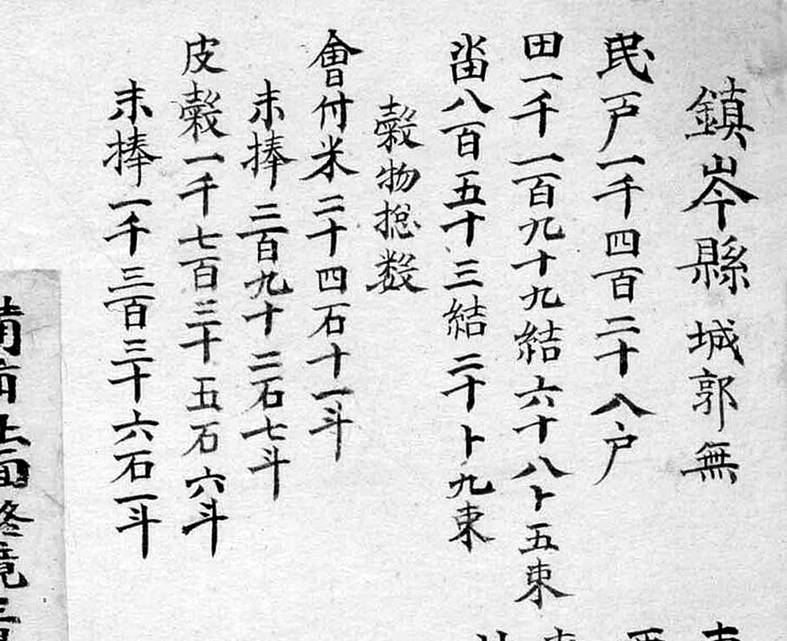
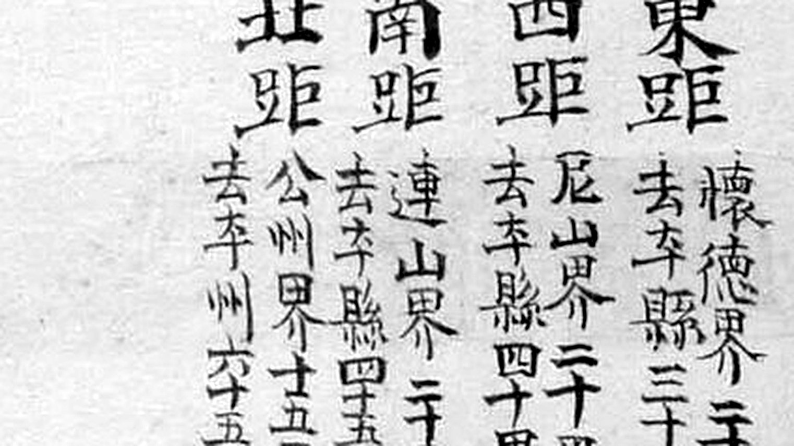
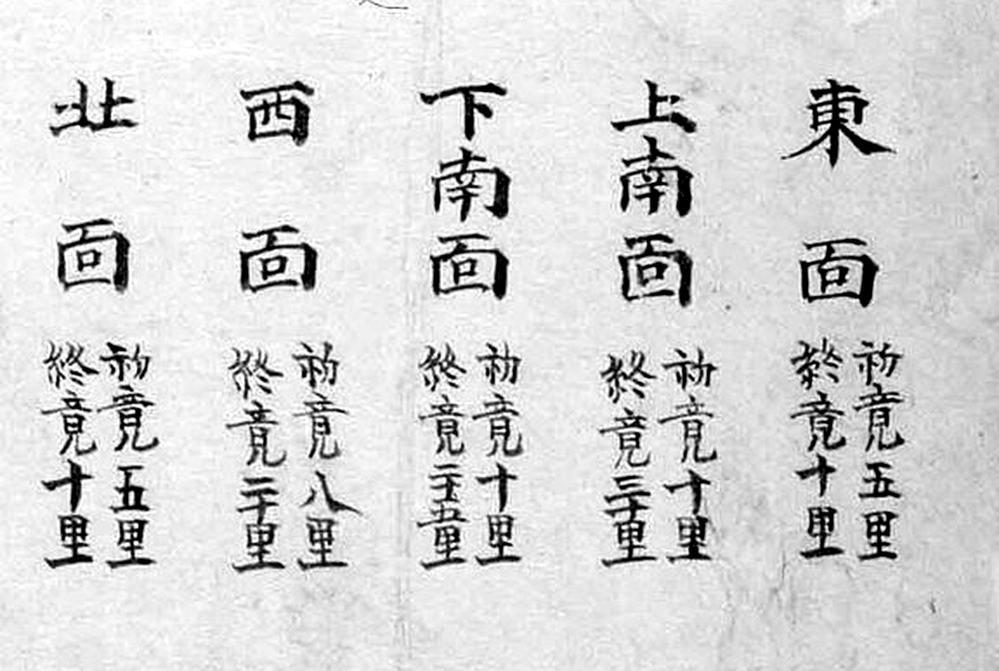

# 『해동지도』 「충청도 진잠현」 판독

『해동지도』 8책(1750년대 초 제작 추정, 규장각한국학연구원 소장, 보물) 가운데 충청도
진잠현 도엽. **진잠현은 지금 유성구 남부와 서구 남부입니다.**

**2026-09-03 착수.** 대조표 8장이 「해동지도 진잠은 미착수」라 적어 두었던 것을 채웁니다.
1872년 계열은 [`1872-진잠지도-판독.md`](1872-진잠지도-판독.md).

## 도엽

| | |
|---|---|
| 자료번호 | `GM33469IL0006_025` |
| 원문 | [커먼즈 파일](https://commons.wikimedia.org/wiki/File:GM33469IL0006_025_%EC%B6%A9%EC%B2%AD%EB%8F%84_%EC%A7%84%EC%9E%A0%ED%98%84.jpg) |
| 크기 | 2,409 × 3,736 px |
| 훑은 범위 | **본체 전면** — 원본 4분할 (2026-09-03) |
| 글 방향 | 우횡서(오른쪽 → 왼쪽) |

## 방위 — 위가 서(西)

**위=西, 아래=東, 왼쪽=南, 오른쪽=北.** 면 배치가 근거입니다.

| 면 | 도엽에서의 자리 | 실제 방위 |
|---|---|---|
| 西面 | 오른쪽 위 | 서·북서 |
| 北面 | 오른쪽 아래 | 북 |
| 下南面 | 왼쪽 위 | 남서 |
| 上南面 | 왼쪽 가운데 | 남 |
| 東面 | 아래 가운데 | 동 |

가장자리 경계 표기도 맞습니다 — `連山界`(남서) 왼쪽 위, `鷄龍山`·`公州界`(북서) 오른쪽 위,
`公州界`(동) 아래.

**1872년 진잠 도엽과 방위가 같습니다.** 같은 고을을 120년 사이에 같은 방향으로 그렸습니다.

## 기문



```
鎭岑縣 城郭無
民戶 一千四百二十八戶
田 一千一百九十九結 六十八卜 五束
畓 八百五十三結 二十卜 九束
穀物摠數
  會付米 三十四石 十一斗
  末捧   二百九十二石 七斗
  皮穀   一千七百三十五石 六斗
  末捧   一千三百三十六石 一斗
軍兵摠數
  監營軍 十一名
  兵營軍 十四名
  右營鎭束伍軍 二百五十六名
```

> **2026-10-01 — 곡물 숫자 셋을 고쳤습니다.** 2026-09-03 에 자릿수 재확인이 필요하다고
> 적어 둔 것입니다. `會付米 三千四百六十一斗` → **`三十四石十一斗`**,
> `未捧 三百九十三石七斗` → **`二百九十二石七斗`**,
> `未捧 一千三百三十六石八斗` → **`一千三百三十六石一斗`**.
> 또 `未捧` 이 아니라 **`末捧`** 입니다 — 다른 도엽도 모두 `末捧` 입니다.

**조목이 호구·전결·곡물·군병 넷뿐이고 산천 조가 없습니다.** 2026-10-01 에 충청도
도엽 일곱(회덕·진잠·문의·옥천·연기·회인·연산)을 모두 읽었는데 **한 틀**이었고,
전라도 진산·금산 도엽만 산천 조를 갖습니다(대조표 11.2 · 11.4).
**진잠 도엽에서 고개를 기문으로 보강할 길은 없습니다.**

전결 단위를 **`卜`** 으로 적습니다 — 회덕·연기·연산과 같고 문의·옥천·회인은 `負` 입니다.
군병은 **세 갈래**(감영·병영·우영진)로 회덕과 같습니다.

## 사지(四至) — **동쪽이 회덕입니다**




| 방향 | 경계 | 그 고을 읍치까지 |
|---|---|---|
| **東距** | **懷德界 二十里** | **去本縣 三十里** |
| 西距 | 尼山界 二十里 | 去本縣 四十里 |
| 南距 | 連山界 二十里 | 去本縣 四十五里 |
| 北距 | 公州界 十五里 | 去本州 六十五里 |

**형식이 두 겹입니다** — 경계까지 거리와, 그 너머 고을 읍치까지 거리를 나란히 적었습니다.
회덕현 도엽의 사지(경계까지만)보다 자세합니다.

**1872년 진잠지도와 사지가 다릅니다.**

| | 해동지도 (1750년대) | 1872년 진잠지도 |
|---|---|---|
| 東 | **懷德界 20리** | 介水院里 **公州界** 10리 |
| 西 | **尼山界 20리** | 月底里 **連山界** 15리 |
| 南 | **連山界 20리** | 壯安里 **珍山界** 15리 |
| 北 | 公州界 15리 | 鶴下洞 公州界 10리 |

**120년 사이에 사방 이웃 인식이 통째로 한 칸씩 돌았습니다.** 어느 쪽이 실제 접경이고
어느 쪽이 주된 통행 방향인지는 따로 볼 일입니다. **다만 해동지도 쪽이 동쪽을 회덕이라
적는 것은 분명합니다** — 1872년 도엽은 회덕을 사지에 넣지 않고 아래 여백의 `去懷德路`
도로 주기로만 남겼습니다.

## 고개 — **하나도 없습니다**

**본체를 원본 4분할로 전면 훑었으나 `峙`·`峴`·`嶺` 표기가 한 자도 나오지 않았습니다.**

| 훑은 구역 | 읽은 것 |
|---|---|
| 서북(왼쪽 위) | `連山界` · `下南面` · `逍遙亭` · `藥獅峯` |
| 서북(오른쪽 위) | `公州界` · `鷄龍山` · `西面` · `鶴雲寺` · `長山` |
| 동남(왼쪽 아래) | `上南面` · `九峯山` · `玉山` · `東面` · `大川` · `公州界` |
| 동북(오른쪽 아래) | `客舍` · `鄕校` · `北面` · `公州界` |

**1872년 도엽에는 `奄峴`·`牛拳峴` 둘이 있습니다.** 120년 뒤 도엽이 고개를 더 적은 것이지,
없던 고개가 생긴 것은 아닐 것입니다 — **해동지도가 고개를 안 적는 도엽이라는 뜻**으로
읽는 편이 온당합니다. 회덕현 도엽은 여섯을 적었으니, **같은 계열 안에서도 도엽마다
다릅니다.**

## 그 밖에 읽은 것

| 갈래 | 표기 |
|---|---|
| 산 | `藥獅峯` · `九峯山` · `玉山` · `長山` · `鷄龍山` |
| 물 | `大川` |
| 누정·절 | `逍遙亭` · `鶴雲寺` |
| 관아 | `衙舍` · `客舍` · `鄕校` · `倉` |
| 면 | `東面` · `西面` · `北面` · `上南面` · `下南面` (5면) |

**`藥獅峯` 은 1872년 도엽의 `藥師峰` 과 글자가 다릅니다** — 같은 산의 이표기로 보입니다.
1872년 도엽에 있는 `錦繡峰`·`白雲峰`·`分雞山`·`安平山` 은 여기에 없습니다.

도엽 오른쪽 아래에 **면별 거리표**가 있습니다 — `東面`·`北面`·`西面`·`下南面`·`上南面`
각각의 `初境`·`終境` 리수. 아직 전문을 옮기지 않았습니다.

## 쪽지 둘 — **방어처 첨지가 아니라 「면별 거리표」 쪽지입니다**

### 위쪽 가운데 (0.56–0.66, 0.08–0.22)


두 줄, 오른쪽부터:

```
備面 北面終境三里 本□
面不同 書付
```

`北面` · `終境` · `三里` · `本` · `面` · `不同` · `書付`(써 붙인다)가 읽힙니다.
**면별 거리표의 `北面 終竟十里` 와 숫자가 다릅니다**(아래) — 곧
**「본(本)과 달라 써 붙인다」**는 정정 쪽지입니다.

맨 위 두 글자 **`備面`** 은 뜻을 모르겠습니다. 다만 아래 쪽지와 회인현 도엽의
쪽지에도 같은 말이 나옵니다.

### 아래쪽 가운데 (0.47–0.56, 0.82–0.92)


한 줄: `此面 備面 □`〔?〕 — 「이 면은 `備面` 과 같다」로 읽히나 끝 글자가 확실치 않습니다.

### 이것이 새 계통입니다

대조표 11.6.8 은 충청도 도엽 아홉에 붙은 **방어처 첨지**(`… 備禦處在 … 故添書`)를
모았습니다. **진잠의 쪽지 둘은 그것이 아닙니다** — 좌상단이 아니라 **지도 한가운데와
아래**에 붙었고, 내용이 **면별 거리표의 숫자**입니다.

같은 계통이 셋 더 있습니다.

| 도엽 | 자리 | 내용 |
|---|---|---|
| **진잠현** | 가운데 위 · 가운데 아래 | `備面 北面終境三里 本面不同書付` · `此面備面□` |
| **회인현** | 면별표 아래 | `邑內面`·`江外面` 을 더하고 `本面無備面有`〔?〕 |
| **옥천군** | 면별표 아래 | `邑內面 初竟 終竟` — **숫자가 비어 있습니다** |

**해동지도에는 「면별 거리표를 고치는 쪽지」 계통이 따로 있습니다.** 넷 가운데
하나(옥천)는 끝내 값을 못 채웠고, 하나(진잠)는 본과 다르다고 적었습니다 —
**이 책이 작업 중인 책이었다는 증거가 모입니다.**

## 면별 초경·종경 — 다섯 면 (2026-10-01)



| 면 | 初竟 | 終竟 |
|---|---|---|
| 東面 | 五里 | 十里 |
| 上南面 | 十里 | 三十里 |
| 下南面 | 十里 | 三十五里 |
| 西面 | 八里 | 三十里 |
| **北面** | **五里** | **十里** |

**`北面 終竟十里` 인데 위쪽 쪽지는 `三里` 라고 적습니다.** 둘 중 어느 쪽이 맞는지는
모릅니다 — 쪽지가 「본과 다르다」고 밝히고 있으므로, **적어도 편찬 당시에 이미
두 값이 돌아다녔다**는 것은 분명합니다.

## 남은 것

- **쪽지 두 장의 `備面`** — 뜻과 글자. 회인현 쪽지(`本面無備面有`〔?〕)와 함께 봐야 합니다
- `北面 終竟` 이 10리인지 3리인지
- `逍遙亭`·`鶴雲寺` 의 현 위치 비정
- 규장각 고해상 원본

## 변경 이력

| 날짜 | 내용 |
|---|---|
| 2026-09-03 | 문서 개설. 본체 전면 훑기 — 방위(위=서), 기문, 사지, 산천·관아. **고개는 하나도 없음** |
| 2026-10-01 | **2차 판독.** ① 기문 곡물 숫자 셋 정정, `未捧`→**`末捧`** ② **면별 거리표 전문**(다섯 면) ③ 쪽지 둘이 **방어처 첨지가 아니라 「면별 거리표」 쪽지**임을 확인 — 회인·옥천에도 같은 계통이 있습니다 ④ **고개가 없다는 것을 다시 확인**(같은 날 옥천·연산에서는 「없다」를 거뒀으나 진잠은 그대로입니다) |
