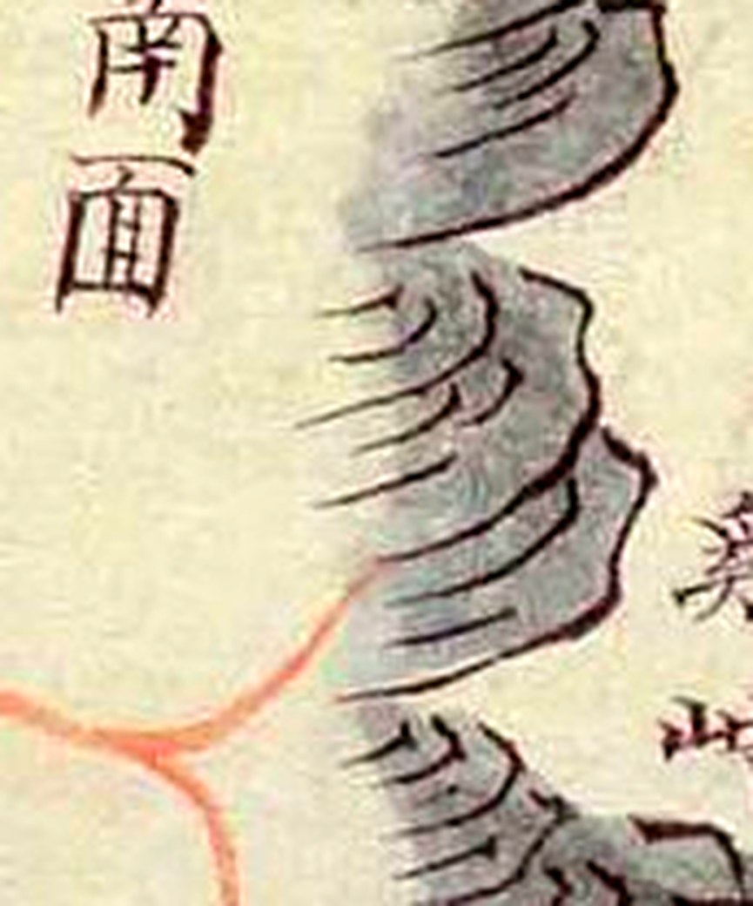
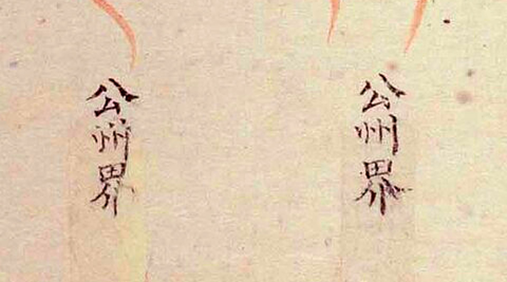
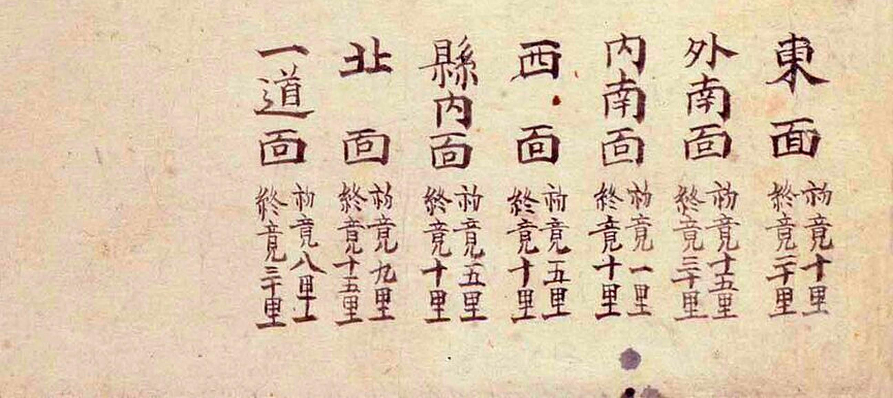
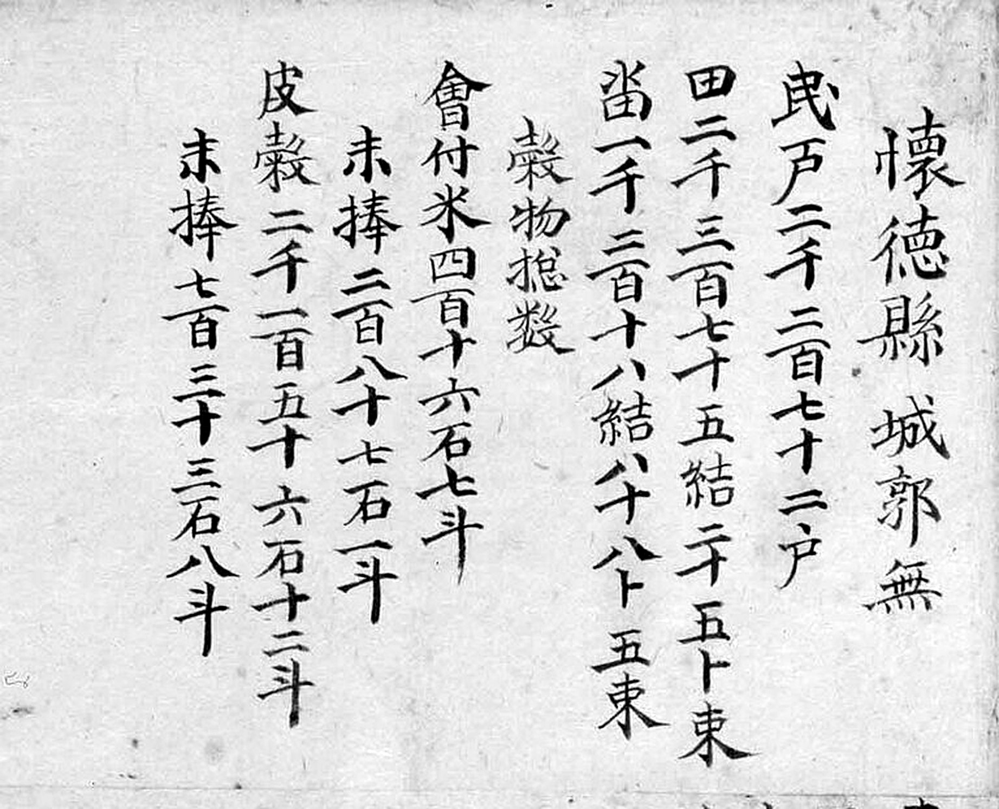

# 『해동지도』 「충청도 회덕현」 판독

『해동지도』 8책(1750년대 초 제작 추정, 서울대학교 규장각한국학연구원 소장, 보물) 가운데
충청도 회덕현 도엽. **1872년 회덕현지도보다 120여 년 앞섭니다** — 두 계열을 견주는 것이
이 조사의 뼈대입니다.

고개 쟁점은 [`대전-고개-대조표.md`](대전-고개-대조표.md) 6.1·6.2·6.4, 채록 기록은 11.1.

## 도엽

| | |
|---|---|
| 자료번호 | `GM33469IL0006_024` |
| 원문 | [커먼즈 파일](https://commons.wikimedia.org/wiki/File:GM33469IL0006_024_%EC%B6%A9%EC%B2%AD%EB%8F%84_%ED%9A%8C%EB%8D%95%ED%98%84.jpg) |
| 크기 | 2,409 × 3,722 px |
| 방위 | **위가 北** — 사지 표기와 합치합니다 |
| 글 방향 | 우횡서(오른쪽 → 왼쪽) |

**해상도가 1872년 계열의 20분의 1입니다.** 1872년 회덕현지도가 78 MP인데 이것은 9 MP이고,
잔글씨는 확대해도 한계가 있습니다. **규장각 고해상 원본이 이 조사에서 가장 값이 큰
미확보 자료입니다**(대조표 8장 1순위).

## 방위 확인

| 변 | 경계 표기 | 사지와 대조 |
|---|---|---|
| 위 | `文義界` | `北距 文義界 二十里` ✓ |
| 오른쪽 위 | `淸州界` | 2차 접경 |
| 오른쪽 | `沃川界` | `東距 沃川界 二十里` ✓ |
| 오른쪽 아래 | `珎山界` | `南距 珍山界 三十里` ✓ |
| 왼쪽·아래 | `公州界` (여러 곳) | `西距 公州界 十里` ✓ |

## 고개 — **여섯이 아니라 다섯** (2026-10-01)

| 위치 | 표기 | 읽기 | 확신 | 판독자 | 날짜 | 비고 |
|---|---|---|---|---|---|---|
| **(0.167, 0.386)** | **崖柏峙** | 애백치 | 중 → **상** | Claude | **2026-10-01** | 서북, `公州界` 안쪽 |
| ~~(0.23, 0.53)~~ | ~~馬峴~~ → **`縣內面`** | — | **철회** | Claude | **2026-10-01** | **고개가 아니라 면 이름** (아래) |
| **(0.542, 0.591)** | **子田峴** | 자전현 | 중 → **상** | Claude | **2026-10-01** | 관아 동남, `甲川` 동편 |
| **(0.621, 0.620)** | **子峴** | 자현 | **상** | Claude | 2026-09-03 · 10-01 재확인 | 자전현 남동, `凉亭` 위 |
| **(0.867, 0.637)** | **雞峙** | 계치 | **상** | Claude | 2026-09-30 · 10-01 재확인 | 동남, `珎山界` 바로 서편. '닭재' |
| (0.946, 0.370) | `于峙`**`□`** | 우치□ / 우티재 | **하** | Claude | **2026-10-01** | 동북, `沃川界` 바로 아래. **셋째 글자에 `山` 이 없습니다** |

### 2026-10-01 — 여섯을 **한 자[尺]로 다시 쟀습니다**

같은 날 연기현에서 **`峴`·`峙`·`嶺` 은 왼쪽(또는 왼쪽 위) `山` 부수 하나로 갈린다**는
것을 확인하고(대조표 11.6.5), 그 검사를 본역에 그대로 돌렸습니다. 1,920 px 사본에서
라벨마다 10배로 키웠습니다.


*왼쪽부터 `崖柏峙` · `子田峴` · `子峴` · `雞峙`. 넷 다 `峙`/`峴` 의 `山` 이 또렷합니다.*

- `崖柏峙` — `崖`(山+厓)·`柏`(木+白)·`峙`(山+寺) 세 글자 모두 또렷. **중→상.**
  **`柏` 이 굳었으므로 6.3(`子`/`柏`)의 한쪽 발이 단단해집니다.**
- `子田峴` — `子`·`田`·`峴`. **중→상.** 2026-09-03 에 「`峙`/`峴` 차이 미확인」으로
  두었던 것을 **`峴` 으로 확정**합니다.
- `子峴`·`雞峙` — 상 유지. **6.4 의 핵심 증거인 `雞峙` 가 검사를 통과했습니다.**

### 철회 — **`馬峴` 은 `縣內面` 이었습니다**


*왼쪽이 그림 속 라벨(0.225, 0.529), 오른쪽이 **같은 도엽 면별 거리표의 `縣內面`**.*

**세 글자이고 같은 글자입니다** — `縣`(県+系) · `內` · `面`.
2026-09-01 에 저해상 그림에서 두 글자로 보고 `馬峴`(말고개)으로 읽었던 것인데,
**`縣` 의 왼쪽 `県` 을 `馬` 로, `內` 를 `峴` 으로 본 오독**입니다.
면별 거리표에 `縣內面` 이 있으니(아래) 같은 도엽 안에 **해서로 또렷하게 쓰인 짝**이
있었던 셈입니다.

> **오늘 세 번째로 쓴 방법입니다.** 연기는 `石峴` 의 `峴` 이, 회인은 `墨嶺` 의 `嶺` 이,
> 회덕은 **면별 거리표의 `縣內面`** 이 자[尺]가 됐습니다.
> **흐린 글자를 더 키우기 전에, 같은 도엽에서 또렷하게 쓰인 같은 글자를 먼저 찾습니다.**

### `于峙嶺` — 셋째 글자에 `山` 이 없습니다


우횡서로 오른쪽부터 `于` · `峙` · `□`.

- **`于`/`亐`** — 가로 둘에 갈고리 하나. **왼쪽 위에 `丿` 가 없으므로 `牛` 는
  지웁니다.** 6.1 에 진전입니다.
- **`峙`** — `山` 또렷. 확신 상.
- **셋째** — 오른쪽은 `頁` 가 분명한데 **왼쪽에 `山` 이 없습니다.** 같은 사본·같은
  크기의 회인현 `墨嶺`(대조표 11.6.6)은 `山` 이 또렷하므로 해상도 탓으로 보기
  어렵습니다. **`領`**〔?〕 일 수 있고, 그렇다면 뜻은 그대로 「재」입니다.

**2026-09-03 에 원본을 열어 `子田峴`·`子峴` 두 건을 확인했습니다.** 둘 다 도엽 본체에
분명히 있고, **붉은 도로가 두 고개를 다 지납니다.** **2026-10-01 에 다섯의 좌표를 모두
다시 쟀습니다**(위 표).

**`子田峙` 로 적어 두었던 것을 `子田峴` 으로 고칩니다.** 셋째 글자는 `山`+`見` 으로
읽히고, 바로 옆 `子峴` 의 `峴` 과 자형이 같습니다. 그동안 「본문은 `子田峙`, 첨지는
`子田峴` 으로 글자가 다르다」고 적어 두었는데, 본문도 `峴` 입니다 —
**2026-10-01 에 10배로 키워 `山`+`見` 을 확인하고 확신을 `상` 으로 올렸습니다.**

도엽 동쪽 경계를 북에서 남으로 훑은 순서: `于峙嶺` → `東面` → `食藏山` → `雞峙` → `珎山界`.
즉 **`于峙嶺` 은 식장산보다 북쪽, `雞峙` 는 남쪽**입니다. 비정 논의의 기준선입니다.

## 남쪽 경계 — `雞峙` 와 `珎山界` 는 나란히 있습니다 (2026-09-30)

대조표 6.4 「다음 확인 순서」 3번 — **회덕 남쪽 끝이 정말 진산에 닿는지, 아니면 남쪽
방면을 뭉뚱그린 것인지** — 를 보려고 남쪽 변을 훑었습니다. 커먼즈 축소본 1,920 px
(원본 2,409 px 의 80%)입니다.

| 위치 | 표기 | 확신 | 날짜 |
|---|---|---|---|
| **(0.87, 0.64)** | `雞峙` | 상 | 2026-09-30 |
| **(0.92, 0.64)** | `珎山界` | 상 | 2026-09-30 |
| (0.56, 0.80) | `公州界` | 상 | 2026-09-30 |
| (0.69, 0.80) | `公州界` | 상 | 2026-09-30 |
| (0.79, 0.59) | `外南面` | 상 | 2026-09-30 |


*동남 모서리. 왼쪽 산줄기 곁에 `雞峙`, 그 오른쪽에 `珎山界`. 아래쪽은 면별 거리표입니다.*

**`雞峙` 와 `珎山界` 가 같은 높이에 있습니다.** 진산계 표기가 남쪽 변이 아니라
**동남 끝, 계치 바로 건너편에 딱 한 번** 적혀 있고, 남쪽 변을 따라서는 `公州界` 가
둘 놓입니다. **이 도엽이 「회덕이 진산과 닿는다」고 말하는 자리는 계치 한 곳**입니다.

**`雞峙` 는 두 글자 모두 또렷합니다.** `雞` 의 왼쪽은 `奚`(爫·幺·大), 오른쪽은 `隹`.
`峙` 는 왼쪽에 `山`, 오른쪽에 `寺`. **여기서는 `山` 부수가 분명합니다** — 공주목의
`栗`〔峙/寺?〕(대조표 6.6)과 견주는 잣대가 됩니다.


**붉은 길이 계치 서쪽 기슭(0.82, 0.635)까지 와서 끊깁니다.** 이 도엽은 길을 고을
경계에서 끊는데, 남쪽 두 `公州界` 에서도 똑같이 끊깁니다. **길이 계치까지 나 있었다는
뜻**입니다.

 

## 면별 거리표 — 7면 **전문** (2026-09-30)

도엽 오른쪽 아래에 있습니다. 거리표 글씨는 또렷해 축소본에서도 숫자까지 읽힙니다.

| 면 | 初境 | 終境 | 사지와 대조 |
|---|---|---|---|
| `東面` | 10리 | 20리 | `東距 沃川界 二十里` ✓ |
| `外南面` | 15리 | **30리** | **`南距 珍山界 三十里` ✓** |
| `內南面` | 1리 | 10리 | |
| `西面` | 5리 | 10리 | `西距 公州界 十里` ✓ |
| `縣內面` | 5리 | 10리 | 읍치 |
| `北面` | 9리 | 15리 | |
| `一道面` | 8리 | 30리 | 금강 북안 쪽 |



**`外南面` 의 종경 30리가 사지의 `南距 珍山界 三十里` 와 정확히 맞습니다.**
곧 **회덕현의 남쪽 끝 = 외남면의 끝 = 진산계**이고, 그 자리에 `雞峙` 가 있습니다.

**이것이 6.4 에 실질적인 값을 더합니다.** 삼괴동은 1914년에 공주군 산내면의
소룡리·마달리·소호리 일부와 **회덕 외남면 덕산리**를 합쳐 만든 곳입니다. 도엽이
**외남면의 끝을 진산계라 하고 거기에 계치를 그렸으니**, 닭재가 **회덕 외남면 땅
(또는 그 경계)** 이었을 쪽으로 무게가 실립니다.

**다만 한쪽만의 기록입니다.** 진산군 도엽은 여전히 회덕을 적지 않고 북쪽을 공주라
합니다(대조표 6.4). 두 도엽의 어긋남 자체가 아직 풀리지 않았습니다.

## 좌상단 첨지(貼紙)

도엽 왼쪽 위에 **별도 종이를 붙인 첨지**가 있고 `子峴 子田峴 俱在…` 로 시작하는 세 줄이
적혀 있습니다. 뒷사람이 두 고개의 위치나 표기를 두고 남긴 메모로 보입니다.
**셋째 줄까지는 초서라 미판독입니다.**

## 기문

```
懷德縣 城郭無
民戶 二千二百七十二戶 · 田 二千三百七十五結 八十五束 · 畓 一千二百十八結 八十五束
會付米 四百四十六石七斗 · 未捧 二百八十七石十斗 · 皮穀 二千一百五十六石十二斗 ·
未捧 七百三十三石八斗
東距 沃川界 二十里 · 西距 公州界 十里 · 南距 珎山界 三十里 · 北距 文義界 二十里
軍兵摠數 — 監營軍 十六名 · 兵營軍 十六名 · 右營鎭束軍 二百六十四名
```

**고개는 기문에 없습니다.** 사지만 있고, 고개 이름은 모두 그림에 적혀 있습니다 — 1872년
공주목지도와 같은 방식입니다.

도엽 오른쪽 아래에 **면별 거리표**가 따로 있습니다. 2026-09-30 에 **전문을 읽었습니다**
(위 「면별 거리표」 절).

## 기문(記文) — **산천 조가 없습니다**



```
懷德縣 城郭無
民戶 二千二百七十二戶
田 二千三百七十五結 二十五卜 五束
畓 一千二百十八結 八十卜 五束
穀物摠數
  會付米 四百十六石 七斗
  末捧   二百八十七石 一斗
  皮穀   二千一百五十六石 十二斗
  末捧   七百三十三石 八斗
軍兵摠數
  監營軍 十六名
  兵營軍 十六名
  右營鎭束伍軍 二百七十四名
```

[군병 쪽](crops/GM33469IL0006_024_x0.3_y0.0_w0.34_h0.2.jpg)

**조목이 호구·전결·곡물·군병 넷뿐입니다.** 2026-10-01 에 접경 도엽 다섯을 읽은
결과와 같습니다 — 문의·옥천·연기·회인·연산 모두 네 조목이고 산천 조가 없습니다
(대조표 11.6). **충청도 도엽 여섯이 한 틀**이고, 전라도 진산·금산 도엽만 산천 조를
갖습니다.

**이것이 이 조사에 뜻하는 바가 있습니다.** 해동지도 진산군 기문은 산천 조에 고개 넷을
**경계 고을과 거리를 달아** 적어 두어 `晚目峙` 를 풀어 주었습니다(대조표 11.2).
**회덕 도엽에는 그런 구원이 없습니다** — `于峙□` 의 글자도, `子峴`·`子田峴` 의 자리도
**기문으로는 풀 수 없습니다.** 그림과 첨지, 그리고 다른 계열(1872년·대동여지도·AMS)이
전부입니다.

전결 단위를 **`卜`** 으로 적습니다 — 연기·연산과 같고 문의·옥천·회인은 `負` 입니다.
군병은 **세 갈래**(감영군·병영군·우영진속오군)로 연기·연산과 같습니다.

## 그 밖에 읽은 지명

관아 계열 `衙舍` · `客舍` · `鄕校` · `倉`, 서쪽 `貞民驛`
산천 `食藏山` · `注山` · `甲川`, 못 두 곳, `船岩`
서원 `崇賢書院` · `靖節書院`〔?〕, 북쪽 강가 두 곳(미확정)
그 밖 `凉亭` · `三亭洞`〔?〕 · `一道面` · `東面` · `外南面` · `西面` · `北面`

## 남은 것

- **규장각 고해상 원본** — `于峙□` 의 첫 글자와 **셋째 글자**, 6.2 의 첨지 셋째 줄
- `貞民驛`/`民田驛` — 그림 라벨은 세로로 `民`·`田`·`驛` 으로 읽힙니다. 어느 쪽인지
- `靖節書院`〔?〕 확인 — 1872년 도엽의 `靖節祠` 와 같은 것인지
- 3,840 px 사본 — 2026-10-01 에는 커먼즈 요청 한도에 걸려 1,920 px 로 봤습니다


## 길 — **`鷄峙` 서쪽에 사거리가 있습니다** (2026-10-05)

이 도엽은 **붉은 길을 그물처럼 그립니다** — 회화식 넷 가운데 길을 그린 것은 이것뿐이고,
광여도·여지도·지승은 아예 안 그립니다.

**`鷄峙` 바로 서쪽, 내를 건너는 자리에 붉은 길이 네 갈래로 갈립니다.**

| 갈래 | 어디로 |
|---|---|
| **동** | **`鷄峙` 를 넘어 `珎山界`** |
| **북** | `外南面` 쪽 |
| **서** | 읍치 쪽 |
| **남** | 아래로(공주 방면) |

**고갯마루가 아니라 고개 아래가 분기점**입니다. 대조표 6.5 「길의 분기로 보면」이
이 그림에서 나왔습니다 — **회화식은 「길이 넘는 자리」를 적고, 방안식은 「능선의
안부」를 적습니다.** 세는 단위가 다릅니다.

**`于峙嶺` 에도 길이 닿습니다** — 북동쪽에서 `沃川界` 를 넘는 길입니다(6.1).

## 변경 이력

| 날짜 | 내용 |
|---|---|
| 2026-09-03 | 문서 개설. 2026-09-01 채록을 옮기고, 원본을 열어 `子田峴`·`子峴` 확인 — `子田峙` → `子田峴` 으로 고치고 좌표를 재측정 |
| 2026-09-30 | **남쪽 경계 훑기**(대조표 6.4 3번) — `雞峙`(0.87, 0.64)와 `珎山界`(0.92, 0.64)가 **같은 높이**이고, 남쪽 변에는 `公州界` 둘. 진산계는 **동남 끝 한 곳**. `雞峙` 좌표를 (0.79, 0.68)에서 정정 |
| 2026-09-30 | **면별 거리표 7면 전문 채록** — `外南面` 종경 30리가 사지 `南距 珍山界 三十里` 와 일치. **회덕 남쪽 끝 = 외남면 끝 = 진산계**이고 그 자리가 `雞峙` |
| 2026-10-01 | **고개 여섯을 한 자[尺]로 다시 쟀습니다.** `崖柏峙`·`子田峴` 확신 **중→상**, `子峴`·`雞峙` 재확인, **`馬峴` 철회**(= `縣內面`), `于峙嶺` 셋째 글자 **흔들림**. 회덕의 고개는 **다섯**입니다 |
| 2026-10-01 | **기문 전문** — 호구·전결·곡물·군병 **네 조목뿐이고 산천 조가 없습니다.** 충청도 도엽 여섯이 모두 같은 틀입니다. 전결 단위 **`卜`**, 군병 **세 갈래**(감영·병영·우영진) |
| 2026-10-05 | **길을 따라 읽었습니다** — `鷄峙` 서쪽, 내를 건너는 자리에 **붉은 길 사거리**(동 `珎山界` · 북 `外南面` · 서 읍치 · 남 공주)가 있습니다. **분기는 고갯마루가 아니라 고개 아래**입니다. 회화식 넷 가운데 **길을 그린 것은 이 도엽뿐**입니다(광여·여지·지승은 안 그립니다). 대조표 6.5 |
