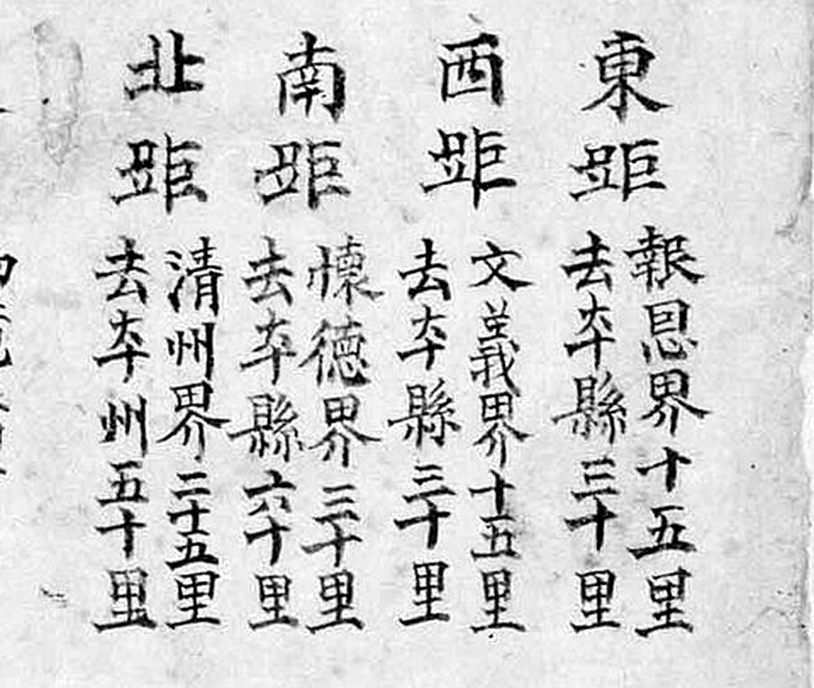
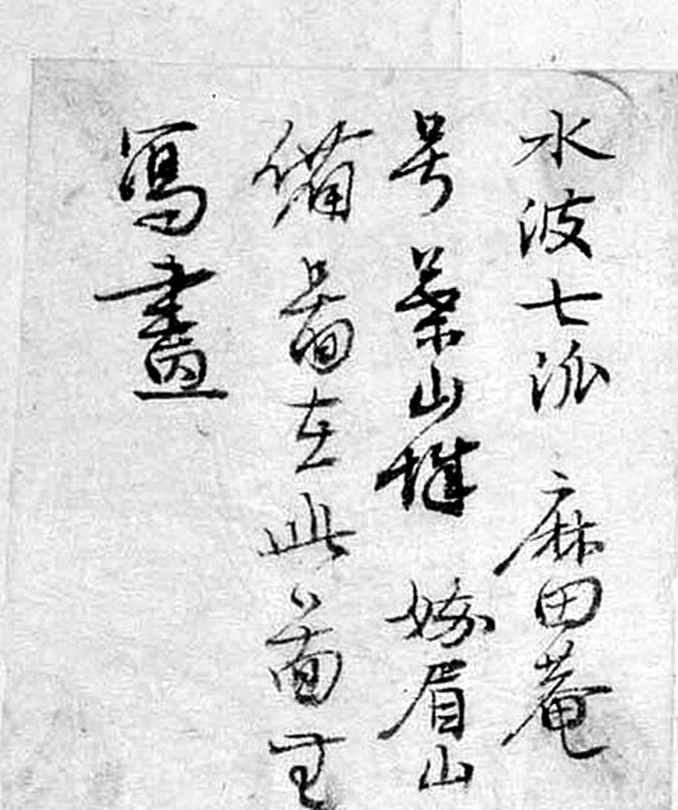
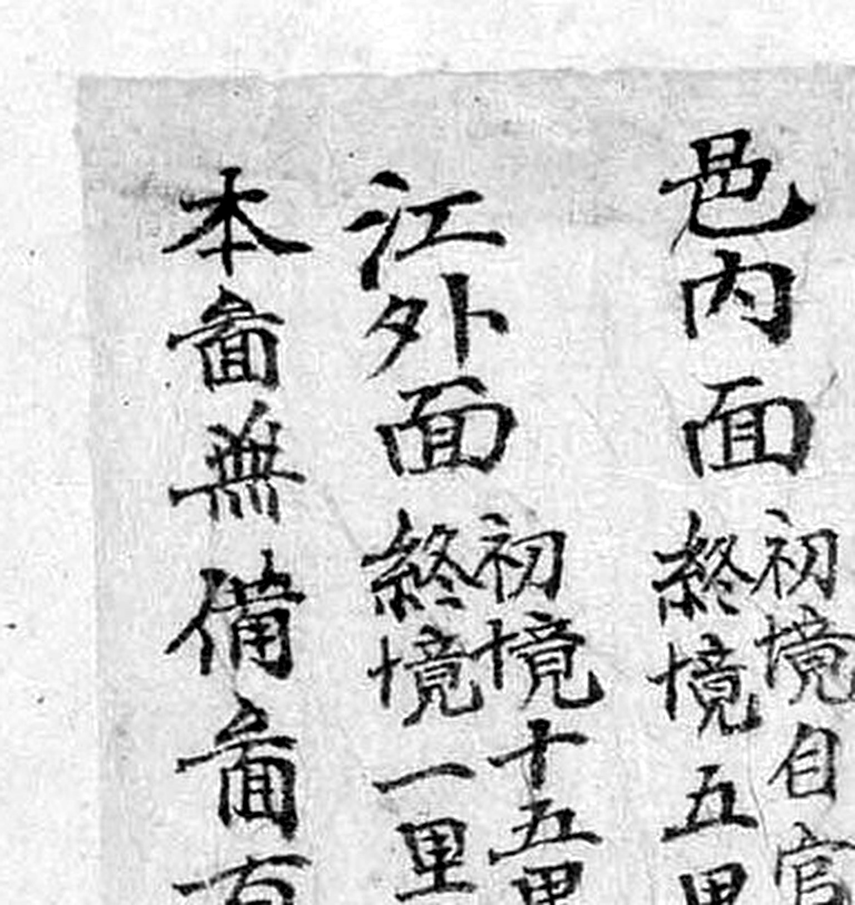
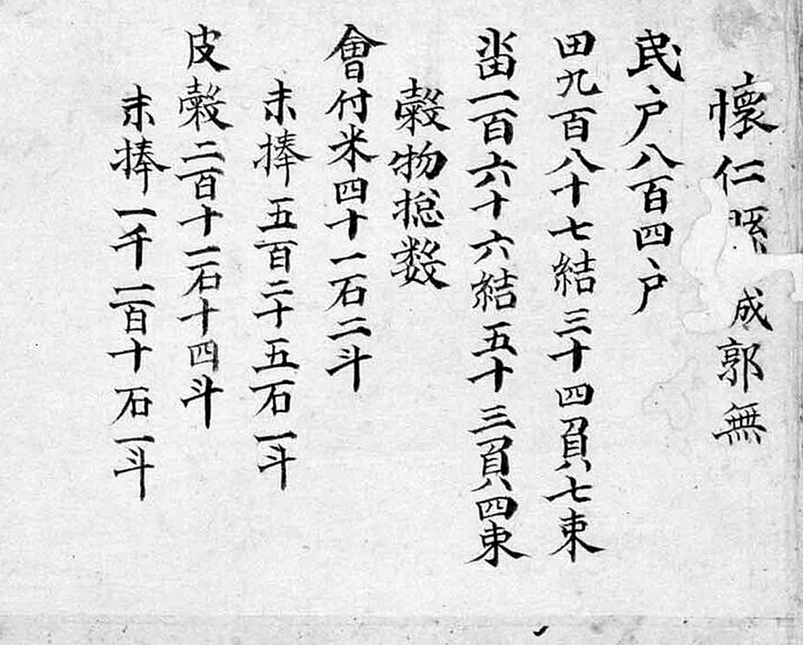

# 『해동지도』 「충청도 회인현」 판독

『해동지도』 8책(1750년대 초 제작 추정, 규장각한국학연구원 소장, 보물) 가운데 충청도
회인현 도엽. **회인은 문의의 동쪽, 옥천의 북쪽**입니다 — **회덕현 도엽에 경계 표기가 없는
2차 접경**인데, **회인 쪽은 회덕을 적습니다.** 지금 보은군 회인면입니다.

기록은 [`대전-고개-대조표.md`](대전-고개-대조표.md) 11.6.6.

## 도엽

| | |
|---|---|
| 자료번호 | `GM33469IL0007_012` |
| 원문 | [커먼즈 파일](https://commons.wikimedia.org/wiki/File:GM33469IL0007_012_%EC%B6%A9%EC%B2%AD%EB%8F%84_%ED%9A%8C%EC%9D%B8%ED%98%84.jpg) |
| 크기 | 1,920 × 3,006 px (커먼즈 축소본으로 판독) |
| 훑은 범위 | 전면 (2026-09-30 1차 · **2026-10-01 2차 — 기문 전문 · 고개 재확인**) |
| 방위 | **위가 北** (표준) |
| 글 방향 | 우횡서 |

## 사지(四至) — **회덕을 적습니다**

| 방향 | 경계까지 | 그 고을 읍치까지 |
|---|---|---|
| 東距 | `報恩界 十五里` | 보은 30리 |
| 西距 | `文義界 十五里` | 문의 30리 |
| **南距** | **`懷德界 三十里`** | **회덕 60리** |
| 北距 | `淸州界 二十五里` | 청주 50리 |



**회인은 회덕을 이웃으로 적는데, 회덕은 회인을 적지 않습니다.**
회덕현 도엽의 사지는 동 옥천·서 공주·남 진산·북 문의 넷뿐이고, 가장자리 표기에도
회인이 없습니다.

> **이것이 대조표 4.2 의 주의를 낳았습니다.** 사지는 **네 방향 대표만** 적으므로
> **일방 기록은 드물지 않습니다.** 그러니 「진산이 회덕을 적지 않는다」 자체는 약한
> 논거입니다 — 6.4 의 힘은 진산이 **「북쪽은 공주다」라고 적극적으로 적은** 데 있습니다.

그림 가장자리 표기는 `淸州界`(0.58, 0.27) · `文義界`(0.27, 0.46)·(0.19, 0.69) ·
`報恩界`(0.96, 0.51) · `沃川界`(0.96, 0.67) — **`懷德界` 는 그림에는 없고 사지에만
있습니다.**

## 고개 **넷** — 모두 `嶺` (2026-10-01 하나 추가)

| 위치 | 표기 | 읽기 | 확신 | 날짜 |
|---|---|---|---|---|
| (0.61, 0.28) | `皮盤嶺` | 피반령 | 중 → **상** | 2026-10-01 |
| **(0.30, 0.42)** | **`墨嶺`** | 묵령 | 중 → **상** | 2026-10-01 |
| (0.94, 0.56) | `蘆嶺` | 노령 | 중 → **상** | 2026-10-01 |
| **(0.955, 0.49)** | **`車嶺`** | 거령/차령 | **중** | 2026-10-01 |

### `墨嶺` 이 이 도엽의 자[尺]입니다


`墨` 아래 글자에 **`山` 부수가 왼쪽에 또렷합니다** — `山` + `令` + `頁` = `嶺`.
같은 날 연기현에서 `金沙峴`·`城峴` 두 라벨이 **`山` 부수가 없어 철회된 것**(11.6.5)과
대조됩니다. **이 도엽의 `嶺` 넷은 모두 같은 검사를 통과합니다** — 그래서 확신을
`중`→`상` 으로 올립니다.

### `車嶺` — 동쪽 가장자리에 하나 더


*위가 `車嶺`, 아래가 `蘆嶺`, 오른쪽이 `報恩界`.* 1차 훑기에서 `蘆嶺` 하나만 보고
지나쳤습니다. 둘은 세로쓰기이고 **`嶺` 의 `山` 이 왼쪽 위에 작게** 붙어 있습니다.
첫 글자를 `卑` 로 볼 여지가 있어 확신 `중` 으로 둡니다.

**보은 가는 길목**입니다. 대전 쪽이 아닙니다.

### 「고을마다 글자 버릇」 — 이제 회인이 **유일한 강한 근거**입니다

**넷 다 `嶺` 을 씁니다.** 회덕이 `峙`·`峴` 을, 진산·금산이 `峙` 를 쓰는 것과 갈립니다.
같은 날 연기의 `峴` 셋이 둘로 줄면서(11.6.5) **회인의 `嶺` 넷이 이 관찰의 유일한
강한 근거**로 남았습니다 — 그리고 넷으로 늘어 오히려 단단해졌습니다(대조표 4.4).

**넷 다 대전 쪽이 아닙니다.** `墨嶺` 은 3장의 `墨峙`(먹치, 머들령 자리)와 글자가 겹치나
**자리가 전혀 다릅니다** — 회인은 대전 북동쪽 멀리입니다. 섞지 않습니다.

## 첨지 둘 — **문구가 또 다릅니다**

### 좌상단 — 끝이 `故添書` 가 아니라 **`寫畫`**



네 줄, 오른쪽부터:

```
水波 七派〔?〕 麻田菴
□ □山雄〔?〕 峨眉山
備 □在左 … □菴□
寫畫
```

초서라 전문을 못 읽었습니다. 다만 **마지막 줄이 `寫畫`(베껴 그림)** 이고
`故添書`(그래서 덧붙여 적었다)가 **아닙니다.** `備` 는 셋째 줄에 있습니다.

**첨지 문구가 셋으로 갈립니다**(11.6.8) —

| 문구 | 도엽 |
|---|---|
| `… 備禦處在 … 故添書` | 회덕 · 문의 · 청주 · 연기 · 이산 · 은진 (여섯) |
| `… 與備禦同` | **옥천** |
| `… 寫畫` | **회인** |

`麻田菴`(0.86, 0.57)과 `峨眉山` 은 그림 안에도 있습니다 — 문의 첨지처럼
**이미 그린 것을 지목한** 꼴입니다(11.6.2).

### 면별표 아래 — `邑內面`·`江外面` 을 더한 조각



```
邑內面  初境 自官門   終境 五里
江外面  初境 十五里   終境 一里〔?〕
本□無備□有 …
```

**본표에는 `東面`·`南面`·`西面`·`北面` 넷뿐이고, 읍내면·강외면은 조각으로 덧붙였습니다.**
**옥천군 도엽에도 똑같은 꼴의 `邑內面` 조각이 있습니다**(11.6.1) — 다만 **옥천은 숫자가
비어 있고 회인은 채워져 있습니다.**

> **해동지도 제작 과정에서 읍내면을 빠뜨리는 일이 되풀이됐습니다.** 도엽 둘에서
> 같은 자리에 같은 종류의 조각이 나왔고, 한쪽은 끝내 값을 못 채웠습니다.
> **이 책은 완성본이 아니라 작업 중인 책**이라는 증거가 둘이 됐습니다.

세 번째 줄은 못 읽었습니다 — `本縣無備面有`〔?〕 로 읽어 보았으나 미확정입니다.

## 기문(記文) — **충청도 도엽 넷이 같은 틀**



```
懷仁縣 城郭無
民戶 八百四十戶
田 九百八十七結 三十四負 七束
畓 一百六十六結 五十三負 四束
穀物摠數
  會付米 四十一石 二斗
  末捧   五百二十五石 一斗
  皮穀   二百十二石 十四斗
  末捧   一千一百十石 一斗
軍兵摠數
  兵營軍 三十二名
  中營鎭束伍軍 一百十六名
```

**호구·전결·곡물·군병 넷뿐, 산천 조 없음** — 문의(11.6.2)·옥천(11.6.1)·연기(11.6.5)와
같습니다. **충청도 도엽 넷이 한 틀**이고, 전라도 진산·금산만 산천 조를 갖습니다
(11.2 · 11.4). **기문의 조목이 도(道)를 따라 갈린다**는 물음에 사례가 넷이 됐습니다.

전결 단위는 `負` 입니다 — 연기만 `卜` 으로 적었습니다(11.6.5).
군병은 둘(병영군·중영진속오군)로 문의와 같습니다.

**호수 840호**로 지금까지 본 도엽 가운데 가장 작습니다(문의 2,862 · 연기 2,690 ·
옥천 8,202).

## 그 밖에 읽은 것

| 갈래 | 표기 |
|---|---|
| 산 | `娥眉山` · `麻城山` · `加山` |
| 절 | `麻田菴` |
| 관아 | `衙舍` · `客舍` · `鄕校` |
| 면 | `邑內面`(初境 自官門/終境 5리) · `江外面` · `北面` · `西面`(5·12리) · `南面`(5·15리) · `東面`(3·15리) · `分江面` |

## 남은 것

- **좌상단 첨지 전문** (초서) — 특히 `寫畫` 앞 세 줄
- 면별표 조각의 셋째 줄
- `車嶺` 의 첫 글자 — `車`/`卑`
- 면별 거리표 숫자 재확인
- 회덕과 맞닿는 남쪽 가장자리를 다시 — 사지에만 있는 `懷德界` 가 그림 어디쯤인지
- 3,840 px 사본 — 2026-10-01 에는 커먼즈 요청 한도에 걸려 1,920 px 로 봤습니다

## 변경 이력

| 날짜 | 내용 |
|---|---|
| 2026-09-30 | **문서 개설 · 훑기.** **`南距懷德界三十里`** 확인(일방 기록의 예 → 대조표 4.2 주의), 고개 셋이 모두 `嶺`, 좌상단 **방어처 첨지** |
| 2026-10-01 | **2차 판독.** ① **`車嶺` 추가 — 고개가 넷**, 넷 다 `嶺`. `墨嶺` 의 `山` 부수를 자[尺]로 삼아 넷을 모두 검사해 확신 `중`→**`상`** ② 같은 날 연기의 `峴` 셋이 둘로 줄어, **회인이 「고을마다 글자 버릇」의 유일한 강한 근거**가 됐습니다 ③ 첨지 끝이 **`寫畫`** — `故添書`(여섯)·`與備禦同`(옥천)에 이어 **세 번째 문구** ④ 면별표 아래 조각에 `邑內面`·`江外面` — **옥천과 같은 꼴**(옥천은 값이 비었고 회인은 채워짐) ⑤ 기문 전문, **충청도 도엽 넷이 같은 틀** |
